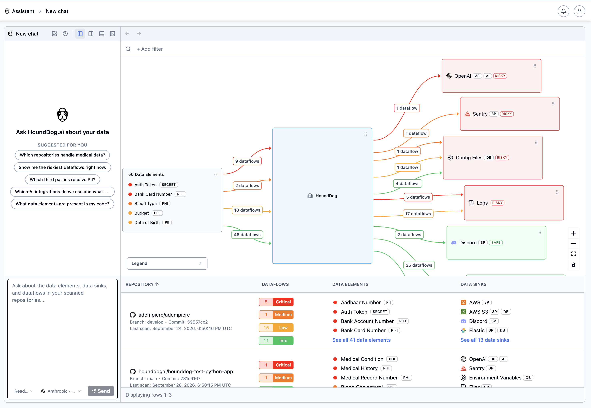
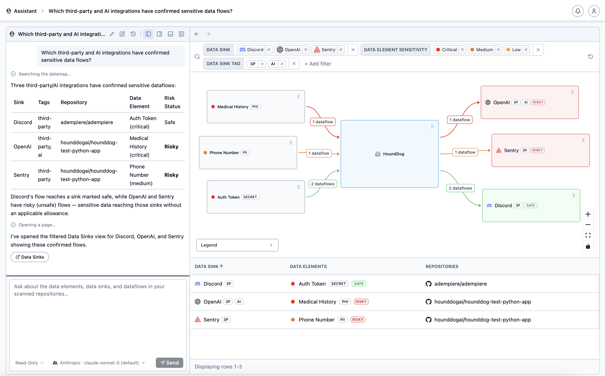

# HoundDog.ai

**Deterministic Privacy Code Scanner for GDPR Data Mapping Evidence and Proactive AI Governance**

HoundDog.ai builds lightweight, Rust-based code scanners that give you a living, code-derived view of the services,
APIs, data flows, and external integrations across the software you build. Deterministic analysis, refreshed on every
commit, across every repo.

> Need org-wide gRPC service mapping for your AI coding agents, covering every service, API, and field across monorepos
> and microservices? See [ProtoMap](https://github.com/hounddogai/protomap).

## Privacy Code Scanner

The [Privacy Code Scanner](https://hounddog.ai/privacy-code-scanning/) provides deterministic, code-level evidence of
sensitive data flows across logs, storage, APIs, third parties, and AI integrations.

Surveys go stale. Privacy platforms infer flows after deployment. AI-only approaches produce inconsistent evidence and
waste tokens on discovery. Our engine continuously maps what developers actually implement, including shadow AI and
SDKs, with accurate, reproducible results as code changes.

A fast, deterministic engine handles discovery, and AI is used selectively for reasoning and context. That means
predictable performance and minimal latency, so the scanner runs directly in CI on standard CPU infrastructure.

It powers Replit's Security Agent at massive scale (100k daily scans) and is used by Fortune 1000 companies across
technology, finance, and healthcare.

## Use Cases

- **[Prevent sensitive data leaks](https://hounddog.ai/data-minimization-and-pii-leak-prevention/).** Catch leaks into
  application logs and other risky mediums before they reach production.
- **[Enable proactive AI governance](https://hounddog.ai/ai-governance-and-shadow-ai-discovery/).** Discover AI
  integrations and see exactly what types of data are shared with them.
- **[Ground GDPR data mapping in code evidence](https://hounddog.ai/gdpr-data-mapping-ropa-privacy-assessments/).** Give
  privacy teams deterministic evidence of actual data flows so they can prevent risks instead of documenting them after
  the fact.
- **[Keep RoPA updated at development speed](https://hounddog.ai/records-of-processing-activities-ropa/).** Reflect new
  categories of personal data and subprocessors as developers introduce them, instead of lagging one or two quarters
  behind the code.

## HoundDog.ai in Action

With the self-hosted or cloud platform, your organization's data map becomes queryable in plain English:

- An AppSec engineer asks where auth tokens are leaking in plaintext into application logs.
- A privacy engineer asks which third-party integrations receive PII.
- An AI governance team asks which AI integrations exist and what sensitive data reaches them.



For example, *"Which third-party and AI integrations have confirmed sensitive data flows?"* queries the underlying
dataflow graph and returns the relevant integrations, sensitive data elements, repositories, code locations, and risk
status.



The data map becomes more than documentation. It becomes an interface to sensitive data flow evidence across your
codebases, refreshed on every commit, across every repo.

## Technical Highlights

- **Deterministic static analysis.** The same commit produces the same result, every time. No prompt sensitivity, and
  your AI tokens are saved for higher-value work like reasoning over detected flows.
- **Deep dataflow tracing.** Tracks sensitive data such as PII, PHI, CHD, and auth tokens through transformations across
  files, functions, and procedures, regardless of nesting depth. Flows are flagged when they reach a sink, whether
  controlled (a database) or high-risk (an LLM prompt or application logs).
- **Broad coverage, fully
  customizable.** [100+ sensitive data types](https://github.com/hounddogai/hounddog/blob/main/data-elements.md)
  and [800+ data sinks](https://github.com/hounddogai/hounddog/blob/main/data-sinks.md) supported out of the box. You
  can also [create your own data element and data sink rules](https://docs.hounddog.ai/platform/scanner-rules/).
- **Built for large codebases.** Scans 1M+ lines of code in seconds on modern laptops.
- **Optional AI integration (highly recommended).** Uses your organization's own AI provider and API key (see
  [FAQ](#does-your-scanner-use-ai)). AI reduces false positives, adds context, and lets you query the data map in plain
  English. It only sees the code behind each finding: its dataflow trace and the source file where it was detected.

## Installation

### Self-Hosted Platform + CLI Scanner (recommended)

Follow
the [self-hosted platform installation instructions](https://github.com/hounddogai/hounddog/tree/main/self-hosted). The
platform runs in lightweight Docker containers on a developer's machine (ideal for POCs) and includes the CLI scanner.

[Enable the AI integration](https://docs.hounddog.ai/platform/ai-settings/) with your organization's API key for the
full experience: the scanner discovers, AI reasons over the detected flows, and you query the results in plain English.

### CLI Scanner Only

For use with the cloud platform, or if you prefer results in the console or as Markdown reports.

**Linux and macOS**

```sh
curl -fsSL https://raw.githubusercontent.com/hounddogai/hounddog/main/install.sh | sh
```

**Windows**

```powershell
irm https://raw.githubusercontent.com/hounddogai/hounddog/main/install.ps1 | iex
```

You can also download the binary from the [releases page](https://github.com/hounddogai/hounddog/releases).

### Uninstallation

```sh
# Linux and macOS
rm -rf ~/.hounddog
sudo rm -f /usr/local/bin/hounddog  # Only if installed as root

# Windows
Remove-Item -Recurse -Force "$env:LocalAppData\hounddog"
Remove-Item -Recurse -Force "$env:ProgramFiles\hounddog"  # Only if installed as administrator
```

## Usage

```sh
hounddog scan [OPTIONS] [PATH]
```

- **Self-hosted platform:** results appear at http://localhost:3300. Trial installs connect the CLI automatically;
  for Production installs, create a CLI API key in the web app after setup.
- **Cloud platform:** set `HOUNDDOG_API_KEY` to your API key and results are uploaded to the platform.
- **CLI only:** results are displayed in the console.

For a quick demo, scan our Python test repository:

```sh
git clone https://github.com/hounddogai/hounddog-test-python
hounddog scan hounddog-test-python
```

Generate a Markdown report with `--output-format=markdown`:

```sh
hounddog scan hounddog-test-python --output-format=markdown --output-path=report.md
```

We recommend the Markdown Viewer Chrome extension for viewing reports
(see [setup and sample report](https://github.com/hounddogai/hounddog/blob/main/sample-report.md)).

### More Options

```sh
hounddog data-elements list --output-format=html  # Supported data elements (HTML)
hounddog data-sinks list --output-format=html     # Supported data sinks (HTML)
hounddog [SUBCOMMAND] --help                      # All subcommands and options
```

## Pricing

See the [HoundDog.ai Pricing Page](https://hounddog.ai/pricing/).

## FAQ

### How can I trust your scanner?

Visit our [Trust Center](https://security.hounddog.ai/) for our latest SOC 2 report, penetration testing results, and
SBOM details.

### Does your scanner send my code to external servers?

Not by default. Scans run locally on your machine or CI runner, and code leaves it only for destinations your
organization sets up:

- **HoundDog.ai platform:** when connected, the scanner uploads scan results, including the source files where dataflows
  were detected, so you can review each finding in context. The self-hosted platform runs entirely inside your network,
  so this code and the resulting data map stay within your infrastructure.
- **Optional AI integration:** each finding is reviewed using only its dataflow trace and the source file where it was
  detected, sent directly to the AI provider you configured.

### Does your scanner use AI?

Scans run on a deterministic static analysis engine, which keeps them fast, cheap, and free of hallucinations. Nothing
from a scan is sent to an AI provider unless your organization enables the optional AI integration.

**Optional AI integration (Enterprise, cloud and self-hosted).** Your organization chooses its own provider (AWS
Bedrock, Anthropic, OpenAI, Google Gemini, or Microsoft Foundry) and API key. When enabled, findings, traces, and source
context go directly to that provider under the DPA and terms your organization holds with it. The AI layer auto-closes
false positives, adjusts severities, and adds context to findings the scanner already produced. The deterministic scan
still runs in your CI on inexpensive CPU with negligible impact on CI time.

**Rule development.** HoundDog.ai uses AI internally to help generate and update detection rules before they ship with
the scanner. Customer code and scan results are never used for this, and HoundDog.ai does not use customer code,
findings, prompts, or responses to train AI models.

### Why not just use an LLM?

We recommend using both. HoundDog.ai is built to make your AI more effective, not to replace it.

- **Spend tokens on reasoning, not discovery.** The scanner finds and traces sensitive data flows, so your AI tokens go
  to higher-value work like assessing risk, reviewing flows, and answering questions about your data map.
- **Evidence you can stand behind.** The same commit always produces the same result. That reproducibility makes
  findings usable as evidence for GDPR data mapping, RoPA, and audits, where AI-generated output that varies with the
  prompt may not yet be accepted.
- **Easy to roll out org-wide.** The Rust scanner runs in CI on standard CPU infrastructure, across every repo and every
  commit, with negligible impact on build times.

### How is this different from secrets scanners like GitLeaks or TruffleHog?

Secrets scanners find credentials hardcoded in code, such as API keys, passwords, or tokens:

```python
exposed_api_key = "sk-proj-1234567890-abcdefghijklmnopqrstuvwxyz"
```

HoundDog.ai tracks how sensitive data actually *flows* through code, across assignments and transformations:

```python
import logging
import os

logger = logging.getLogger(__name__)

# HoundDog.ai detects that `foo` is an authentication token.
foo = os.environ.get("MY_API_KEY")

# HoundDog.ai traces values through various code paths.
bar = {"message": f"api_key={foo}".strip()}

# HoundDog.ai detects that `bar` contains an authentication token (tainted) and is leaked to a log.
logger.info("data=%s", bar)
```

### How is this different from Semgrep or CodeQL?

Semgrep and CodeQL are powerful and highly customizable, but their rules take significant upfront investment to learn
and maintain.

HoundDog.ai works out of the box: broad, high-quality coverage of data elements and sinks from day one,
with [custom rules](https://docs.hounddog.ai/platform/scanner-rules/) when you need them. It is purpose-built for
dataflow analysis, scales efficiently to large codebases, and detects complex flows that general-purpose tools miss.

### Your scanner missed a dataflow!

Our rules are constantly evolving. Please report any false positives or negatives and we will address them.

## Documentation

See the [HoundDog.ai documentation](https://docs.hounddog.ai/).

## License

See [license information](https://hounddog.ai/terms-of-service/) for HoundDog.ai's software.

## Contact

Questions or feedback? Open a GitHub issue or email support@hounddog.ai.
