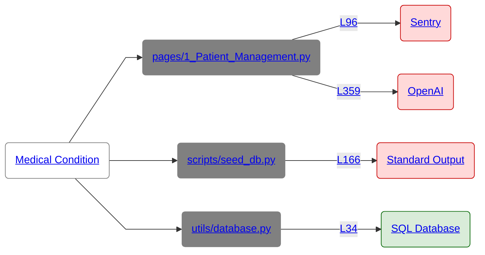
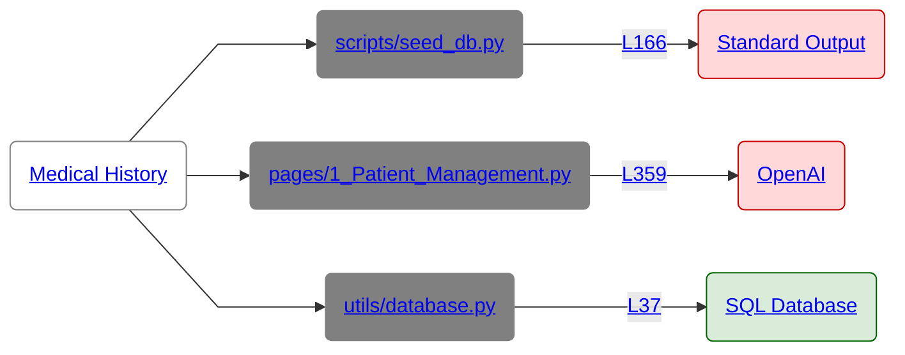
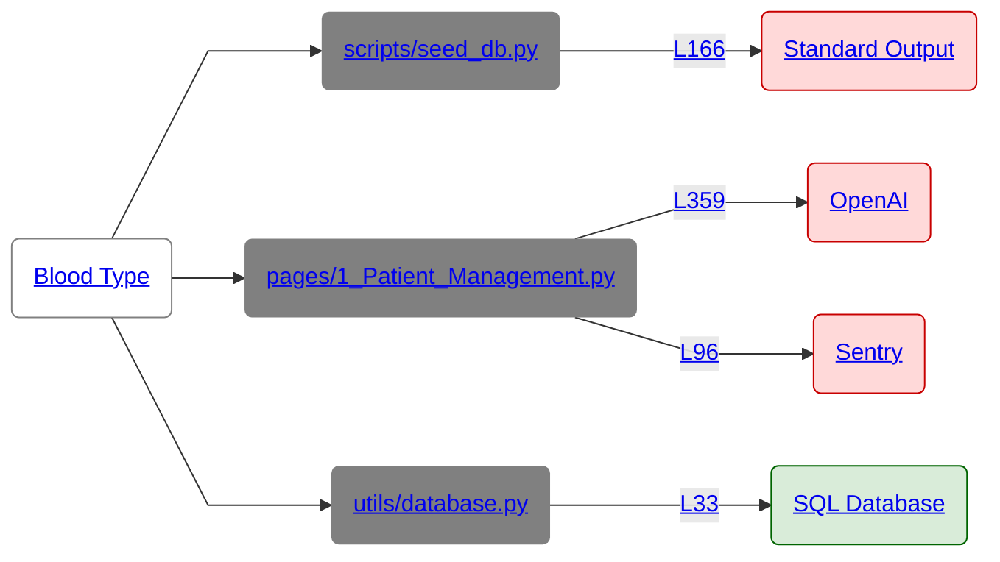
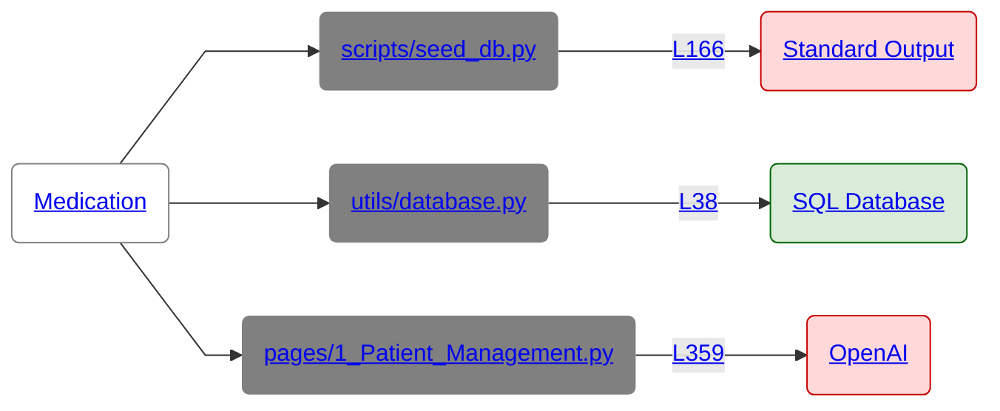
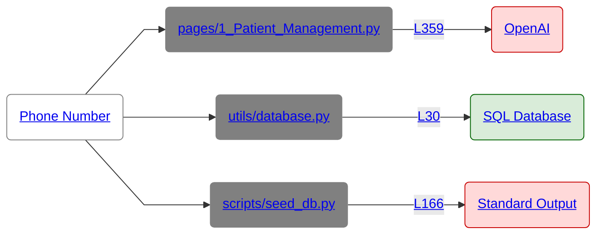
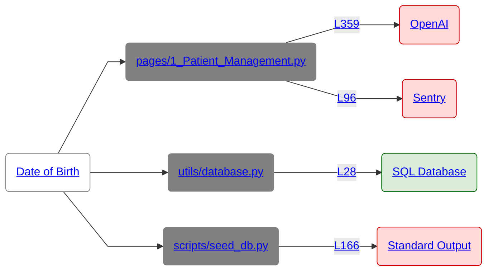
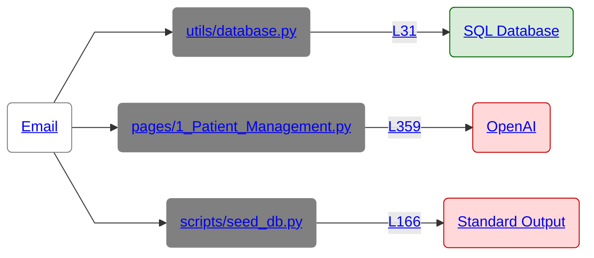
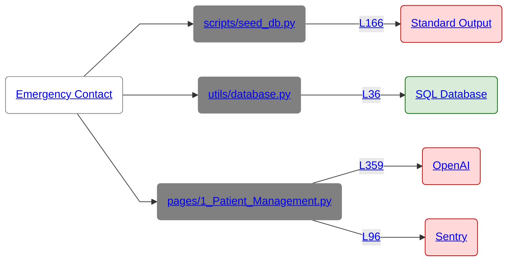
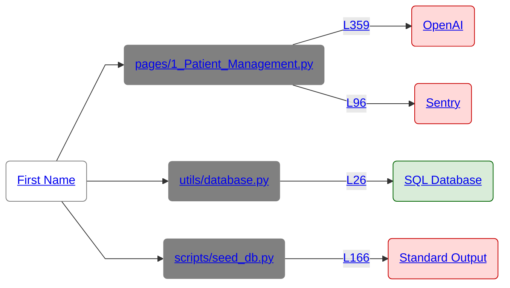
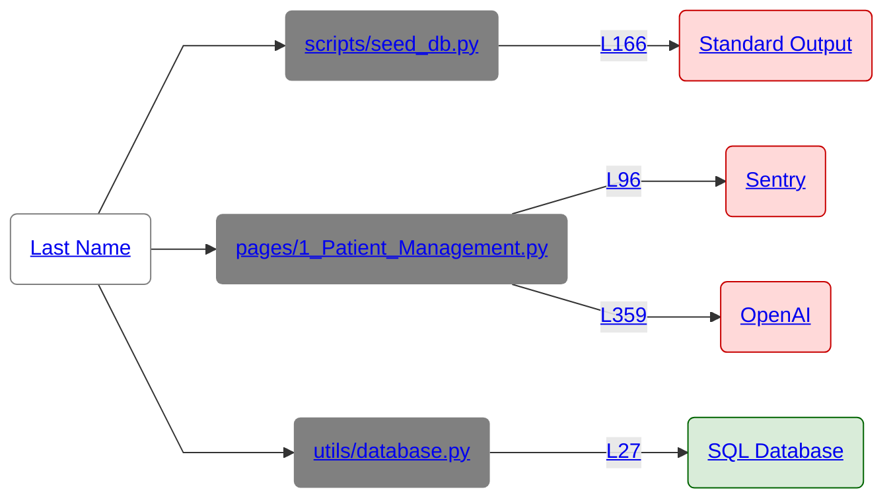

# HoundDog.ai Report

Generated by [HoundDog.ai](https://hounddog.ai) on 2025-12-04 12:54:51 PM.

# Table of Contents

- [Viewing This Report](#viewing-this-report)
- [Key Terminology](#key-terminology)
- [Scan Configuration](#scan-configuration)
- [Files Discovered](#files-discovered)
- [Sensitive Datamap](#sensitive-datamap)
- [Data Sinks](#data-sinks)
- [Dataflows](#dataflows)

# Viewing This Report

For the best viewing experience, we recommend using Google Chrome with [Markdown Viewer](https://chromewebstore.google.com/detail/markdown-viewer/ckkdlimhmcjmikdlpkmbgfkaikojcbjk) extension. For large codebases such as monorepos, this report can be too large to render. So consider scanning a subset of the codebase, one service at a time.

**Setup Instructions:**
1. Install the [Markdown Viewer](https://chromewebstore.google.com/detail/markdown-viewer/ckkdlimhmcjmikdlpkmbgfkaikojcbjk) extension in Chrome

2. Follow the instructions [here](https://docs.hounddog.ai/scanner/markdown-report) to configure the extension.

3. Open this file in Chrome to view it with optimal rendering.


If you face any issues, please reach out to us at support@hounddog.ai.


# Key Terminology

- **Data Elements**: Sensitive data types such as PII (Personally Identifiable Information), PHI (Protected Health Information), PIFI (Personally Identifiable Financial Information), authentication tokens, and other confidential information detected in source code.
- **Data Element Occurrences**: Specific instances of sensitive data elements detected in the codebase. For example, a variable assignment `var email = 'john@example.com'` is one occurrence of the `email` data element.
- **Sensitivity Levels**: Data elements are categorized as <span style="background-color:rgba(255, 0, 0, 1); color:rgba(255, 255, 255, 1); padding:2px 4px; border-radius:3px; font-size:0.85em; font-weight:bold;">Critical</span> (e.g., credit card numbers), <span style="background-color:rgba(255, 100, 0, 1); color:rgba(255, 255, 255, 1); padding:2px 4px; border-radius:3px; font-size:0.85em; font-weight:bold;">Medium</span> (e.g., phone numbers), or <span style="background-color:rgba(241, 194, 50, 1); color:rgba(0, 0, 0, 1); padding:2px 4px; border-radius:3px; font-size:0.85em; font-weight:bold;">Low</span> (e.g., email addresses) according to their sensitivity. Note that the presence of sensitive data alone does not necessarily indicate a privacy risk.
- **Data Sinks**: Locations where sensitive data elements are transmitted or stored, including (but not limited to) logs, databases, HTTP APIs, and third-party SDKs.
- **Data Sink Occurrences**: Specific instances of data sinks detected in the codebase. For example, a function call `logger.info(user_email)` is one occurrence of the `logs` data sink.
- **Dataflows**: The paths that sensitive data element occurrences follow through the codebase to reach data sinks.
- **Safe Dataflows**: Dataflows in which the transmission or storage of sensitive data elements are either:
    1. Sent to destinations that are generally known to be safe (e.g., encrypted databases, internal gRPC endpoints).
    2. Sent to destinations that are generally considered unsafe (e.g., logs, third-party APIs), but the data element is explicitly allowlisted.
    3. Sanitized before reaching the sink (e.g., hashed, masked, encrypted, redacted).
- **Risky Dataflows**: Vulnerable dataflows where sensitive data reaches unsafe sinks without adequate sanitization, potentially exposing it to misuse or leakage.
- **Severity Levels**: Risky dataflows are assigned <span style="background-color:rgba(255, 0, 0, 1); color:rgba(255, 255, 255, 1); padding:2px 4px; border-radius:3px; font-size:0.85em; font-weight:bold;">Critical</span>, <span style="background-color:rgba(255, 100, 0, 1); color:rgba(255, 255, 255, 1); padding:2px 4px; border-radius:3px; font-size:0.85em; font-weight:bold;">Medium</span> or <span style="background-color:rgba(241, 194, 50, 1); color:rgba(0, 0, 0, 1); padding:2px 4px; border-radius:3px; font-size:0.85em; font-weight:bold;">Low</span> severity based on the highest sensitivity level of the data elements exposed. Safe dataflows are assigned an <span style="background-color:rgba(0, 128, 0, 1); color:rgba(255, 255, 255, 1); padding:2px 4px; border-radius:3px; font-size:0.85em; font-weight:bold;">Info</span> severity.

# Scan Configuration

The table below shows the configuration parameters used for this scan.

|Parameter|Value|
|:-|:-|
|Scanner Version|2.3.1|
|Scanner Build|d7941312136a22de43e3c501e0eaf0d3e46fb73c|
|Was `HOUNDDOG_API_KEY` provided?|No|
|Scan Target Directory|<span style="color:rgba(51, 113, 212, 1);">/Users/amjadafanah/hounddog-workspace/hounddog-test-python-app</span>|
|Git Source Code Manager Type|GitHub (Cloud)|
|Git Repository|[hounddogai/hounddog\-test\-python\-app](<https://github.com/hounddogai/hounddog-test-python-app>)|
|Git Branch|[main](<https://github.com/hounddogai/hounddog-test-python-app/tree/main>)|
|Git Commit SHA|f29c8bebe71660f1c0b7dabae095708557ea1f8c|
|Ignored File Patterns|0|
|Ignored Data Elements|0|
|Ignored Data Sinks|0|
|Ignored Data Element Occurrences|0|
|Ignored Dataflows|0|

# Files Discovered

The table below shows the files discovered in the codebase, grouped by programming language.

|Language|File Count|Line Count|
|:-|:-|:-|
|Markdown|1|463|
|Python|12|4031|
|TOML|1|19|
|Other|1|0|
|Total|15|4513|

# Sensitive Datamap

The table below shows the sensitive data elements discovered in the codebase and the sinks they are exposed to. Scroll down further to see detailed information about each data element.

|Data Element|Exposed To|
|:-|:-|
|[Medical Condition](#data-element-43)<br/><span style="color:rgba(100, 100, 100, 1); font-size: 0.85em;">Sensitivity: Critical</span>|<div style="margin-bottom:8px;">[OpenAI](#data-sink-openai) <span style="background-color:rgba(255, 0, 0, 0.15); color:rgba(200, 0, 0, 1); padding:2px 4px; border-radius:3px; font-size:0.75em;">Risky</span></div><div style="margin-bottom:8px;">[Sentry](#data-sink-sentry) <span style="background-color:rgba(255, 0, 0, 0.15); color:rgba(200, 0, 0, 1); padding:2px 4px; border-radius:3px; font-size:0.75em;">Risky</span></div><div style="margin-bottom:8px;">[Standard Output](#data-sink-stdout) <span style="background-color:rgba(255, 0, 0, 0.15); color:rgba(200, 0, 0, 1); padding:2px 4px; border-radius:3px; font-size:0.75em;">Risky</span></div><div style="margin-bottom:8px;">[SQL Database](#data-sink-sql-db) <span style="background-color:rgba(0, 128, 0, 0.15); color:rgba(0, 100, 0, 1); padding:2px 4px; border-radius:3px; font-size:0.75em;">Safe</span></div>|
|[Medical History](#data-element-45)<br/><span style="color:rgba(100, 100, 100, 1); font-size: 0.85em;">Sensitivity: Critical</span>|<div style="margin-bottom:8px;">[OpenAI](#data-sink-openai) <span style="background-color:rgba(255, 0, 0, 0.15); color:rgba(200, 0, 0, 1); padding:2px 4px; border-radius:3px; font-size:0.75em;">Risky</span></div><div style="margin-bottom:8px;">[Standard Output](#data-sink-stdout) <span style="background-color:rgba(255, 0, 0, 0.15); color:rgba(200, 0, 0, 1); padding:2px 4px; border-radius:3px; font-size:0.75em;">Risky</span></div><div style="margin-bottom:8px;">[SQL Database](#data-sink-sql-db) <span style="background-color:rgba(0, 128, 0, 0.15); color:rgba(0, 100, 0, 1); padding:2px 4px; border-radius:3px; font-size:0.75em;">Safe</span></div>|
|[Medical Record Number](#data-element-47)<br/><span style="color:rgba(100, 100, 100, 1); font-size: 0.85em;">Sensitivity: Critical</span>|<span style="color:rgba(100, 100, 100, 1)">*None*</span>|
|[Sexual Orientation](#data-element-73)<br/><span style="color:rgba(100, 100, 100, 1); font-size: 0.85em;">Sensitivity: Critical</span>|<div style="margin-bottom:8px;">[OpenAI](#data-sink-openai) <span style="background-color:rgba(255, 0, 0, 0.15); color:rgba(200, 0, 0, 1); padding:2px 4px; border-radius:3px; font-size:0.75em;">Risky</span></div><div style="margin-bottom:8px;">[Sentry](#data-sink-sentry) <span style="background-color:rgba(255, 0, 0, 0.15); color:rgba(200, 0, 0, 1); padding:2px 4px; border-radius:3px; font-size:0.75em;">Risky</span></div><div style="margin-bottom:8px;">[Standard Output](#data-sink-stdout) <span style="background-color:rgba(255, 0, 0, 0.15); color:rgba(200, 0, 0, 1); padding:2px 4px; border-radius:3px; font-size:0.75em;">Risky</span></div><div style="margin-bottom:8px;">[SQL Database](#data-sink-sql-db) <span style="background-color:rgba(0, 128, 0, 0.15); color:rgba(0, 100, 0, 1); padding:2px 4px; border-radius:3px; font-size:0.75em;">Safe</span></div>|
|[Blood Cholesterol](#data-element-7)<br/><span style="color:rgba(100, 100, 100, 1); font-size: 0.85em;">Sensitivity: Medium</span>|<span style="color:rgba(100, 100, 100, 1)">*None*</span>|
|[Blood Pressure](#data-element-9)<br/><span style="color:rgba(100, 100, 100, 1); font-size: 0.85em;">Sensitivity: Medium</span>|<span style="color:rgba(100, 100, 100, 1)">*None*</span>|
|[Blood Type](#data-element-10)<br/><span style="color:rgba(100, 100, 100, 1); font-size: 0.85em;">Sensitivity: Medium</span>|<div style="margin-bottom:8px;">[OpenAI](#data-sink-openai) <span style="background-color:rgba(255, 0, 0, 0.15); color:rgba(200, 0, 0, 1); padding:2px 4px; border-radius:3px; font-size:0.75em;">Risky</span></div><div style="margin-bottom:8px;">[Sentry](#data-sink-sentry) <span style="background-color:rgba(255, 0, 0, 0.15); color:rgba(200, 0, 0, 1); padding:2px 4px; border-radius:3px; font-size:0.75em;">Risky</span></div><div style="margin-bottom:8px;">[Standard Output](#data-sink-stdout) <span style="background-color:rgba(255, 0, 0, 0.15); color:rgba(200, 0, 0, 1); padding:2px 4px; border-radius:3px; font-size:0.75em;">Risky</span></div><div style="margin-bottom:8px;">[SQL Database](#data-sink-sql-db) <span style="background-color:rgba(0, 128, 0, 0.15); color:rgba(0, 100, 0, 1); padding:2px 4px; border-radius:3px; font-size:0.75em;">Safe</span></div>|
|[Medication](#data-element-49)<br/><span style="color:rgba(100, 100, 100, 1); font-size: 0.85em;">Sensitivity: Medium</span>|<div style="margin-bottom:8px;">[OpenAI](#data-sink-openai) <span style="background-color:rgba(255, 0, 0, 0.15); color:rgba(200, 0, 0, 1); padding:2px 4px; border-radius:3px; font-size:0.75em;">Risky</span></div><div style="margin-bottom:8px;">[Standard Output](#data-sink-stdout) <span style="background-color:rgba(255, 0, 0, 0.15); color:rgba(200, 0, 0, 1); padding:2px 4px; border-radius:3px; font-size:0.75em;">Risky</span></div><div style="margin-bottom:8px;">[SQL Database](#data-sink-sql-db) <span style="background-color:rgba(0, 128, 0, 0.15); color:rgba(0, 100, 0, 1); padding:2px 4px; border-radius:3px; font-size:0.75em;">Safe</span></div>|
|[Phone Number](#data-element-60)<br/><span style="color:rgba(100, 100, 100, 1); font-size: 0.85em;">Sensitivity: Medium</span>|<div style="margin-bottom:8px;">[OpenAI](#data-sink-openai) <span style="background-color:rgba(255, 0, 0, 0.15); color:rgba(200, 0, 0, 1); padding:2px 4px; border-radius:3px; font-size:0.75em;">Risky</span></div><div style="margin-bottom:8px;">[Standard Output](#data-sink-stdout) <span style="background-color:rgba(255, 0, 0, 0.15); color:rgba(200, 0, 0, 1); padding:2px 4px; border-radius:3px; font-size:0.75em;">Risky</span></div><div style="margin-bottom:8px;">[SQL Database](#data-sink-sql-db) <span style="background-color:rgba(0, 128, 0, 0.15); color:rgba(0, 100, 0, 1); padding:2px 4px; border-radius:3px; font-size:0.75em;">Safe</span></div>|
|[Vital Sign](#data-element-81)<br/><span style="color:rgba(100, 100, 100, 1); font-size: 0.85em;">Sensitivity: Medium</span>|<span style="color:rgba(100, 100, 100, 1)">*None*</span>|
|[Date of Birth](#data-element-16)<br/><span style="color:rgba(100, 100, 100, 1); font-size: 0.85em;">Sensitivity: Low</span>|<div style="margin-bottom:8px;">[OpenAI](#data-sink-openai) <span style="background-color:rgba(255, 0, 0, 0.15); color:rgba(200, 0, 0, 1); padding:2px 4px; border-radius:3px; font-size:0.75em;">Risky</span></div><div style="margin-bottom:8px;">[Sentry](#data-sink-sentry) <span style="background-color:rgba(255, 0, 0, 0.15); color:rgba(200, 0, 0, 1); padding:2px 4px; border-radius:3px; font-size:0.75em;">Risky</span></div><div style="margin-bottom:8px;">[Standard Output](#data-sink-stdout) <span style="background-color:rgba(255, 0, 0, 0.15); color:rgba(200, 0, 0, 1); padding:2px 4px; border-radius:3px; font-size:0.75em;">Risky</span></div><div style="margin-bottom:8px;">[SQL Database](#data-sink-sql-db) <span style="background-color:rgba(0, 128, 0, 0.15); color:rgba(0, 100, 0, 1); padding:2px 4px; border-radius:3px; font-size:0.75em;">Safe</span></div>|
|[Email](#data-element-20)<br/><span style="color:rgba(100, 100, 100, 1); font-size: 0.85em;">Sensitivity: Low</span>|<div style="margin-bottom:8px;">[OpenAI](#data-sink-openai) <span style="background-color:rgba(255, 0, 0, 0.15); color:rgba(200, 0, 0, 1); padding:2px 4px; border-radius:3px; font-size:0.75em;">Risky</span></div><div style="margin-bottom:8px;">[Standard Output](#data-sink-stdout) <span style="background-color:rgba(255, 0, 0, 0.15); color:rgba(200, 0, 0, 1); padding:2px 4px; border-radius:3px; font-size:0.75em;">Risky</span></div><div style="margin-bottom:8px;">[SQL Database](#data-sink-sql-db) <span style="background-color:rgba(0, 128, 0, 0.15); color:rgba(0, 100, 0, 1); padding:2px 4px; border-radius:3px; font-size:0.75em;">Safe</span></div>|
|[Emergency Contact](#data-element-21)<br/><span style="color:rgba(100, 100, 100, 1); font-size: 0.85em;">Sensitivity: Low</span>|<div style="margin-bottom:8px;">[OpenAI](#data-sink-openai) <span style="background-color:rgba(255, 0, 0, 0.15); color:rgba(200, 0, 0, 1); padding:2px 4px; border-radius:3px; font-size:0.75em;">Risky</span></div><div style="margin-bottom:8px;">[Sentry](#data-sink-sentry) <span style="background-color:rgba(255, 0, 0, 0.15); color:rgba(200, 0, 0, 1); padding:2px 4px; border-radius:3px; font-size:0.75em;">Risky</span></div><div style="margin-bottom:8px;">[Standard Output](#data-sink-stdout) <span style="background-color:rgba(255, 0, 0, 0.15); color:rgba(200, 0, 0, 1); padding:2px 4px; border-radius:3px; font-size:0.75em;">Risky</span></div><div style="margin-bottom:8px;">[SQL Database](#data-sink-sql-db) <span style="background-color:rgba(0, 128, 0, 0.15); color:rgba(0, 100, 0, 1); padding:2px 4px; border-radius:3px; font-size:0.75em;">Safe</span></div>|
|[First Name](#data-element-27)<br/><span style="color:rgba(100, 100, 100, 1); font-size: 0.85em;">Sensitivity: Low</span>|<div style="margin-bottom:8px;">[OpenAI](#data-sink-openai) <span style="background-color:rgba(255, 0, 0, 0.15); color:rgba(200, 0, 0, 1); padding:2px 4px; border-radius:3px; font-size:0.75em;">Risky</span></div><div style="margin-bottom:8px;">[Sentry](#data-sink-sentry) <span style="background-color:rgba(255, 0, 0, 0.15); color:rgba(200, 0, 0, 1); padding:2px 4px; border-radius:3px; font-size:0.75em;">Risky</span></div><div style="margin-bottom:8px;">[Standard Output](#data-sink-stdout) <span style="background-color:rgba(255, 0, 0, 0.15); color:rgba(200, 0, 0, 1); padding:2px 4px; border-radius:3px; font-size:0.75em;">Risky</span></div><div style="margin-bottom:8px;">[SQL Database](#data-sink-sql-db) <span style="background-color:rgba(0, 128, 0, 0.15); color:rgba(0, 100, 0, 1); padding:2px 4px; border-radius:3px; font-size:0.75em;">Safe</span></div>|
|[Last Name](#data-element-37)<br/><span style="color:rgba(100, 100, 100, 1); font-size: 0.85em;">Sensitivity: Low</span>|<div style="margin-bottom:8px;">[OpenAI](#data-sink-openai) <span style="background-color:rgba(255, 0, 0, 0.15); color:rgba(200, 0, 0, 1); padding:2px 4px; border-radius:3px; font-size:0.75em;">Risky</span></div><div style="margin-bottom:8px;">[Sentry](#data-sink-sentry) <span style="background-color:rgba(255, 0, 0, 0.15); color:rgba(200, 0, 0, 1); padding:2px 4px; border-radius:3px; font-size:0.75em;">Risky</span></div><div style="margin-bottom:8px;">[Standard Output](#data-sink-stdout) <span style="background-color:rgba(255, 0, 0, 0.15); color:rgba(200, 0, 0, 1); padding:2px 4px; border-radius:3px; font-size:0.75em;">Risky</span></div><div style="margin-bottom:8px;">[SQL Database](#data-sink-sql-db) <span style="background-color:rgba(0, 128, 0, 0.15); color:rgba(0, 100, 0, 1); padding:2px 4px; border-radius:3px; font-size:0.75em;">Safe</span></div>|

<a id="data-element-43"></a>
## Medical Condition

**Sensitivity:** Critical • **Tags:** PHI

**Exposed to the following data sinks:**

<details>
<summary style="color: #0066CC; cursor: pointer;">OpenAI <span style="background-color:rgba(255, 0, 0, 0.15); color:rgba(200, 0, 0, 1); padding:2px 4px; border-radius:3px; font-size:0.75em;">Risky</span></summary>

</br>**Exposure #1** <span style="background-color:rgba(255, 0, 0, 0.15); color:rgba(200, 0, 0, 1); padding:2px 4px; border-radius:3px; font-size:0.75em;">Risky</span>

1. First detected here in [pages/1_Patient_Management.py:83:21](https://github.com/hounddogai/hounddog-test-python-app/blob/f29c8bebe716/pages/1_Patient_Management.py#L83-L83)

    ```python
    "allergies": allergies
    ```

2. Placed inside a dictionary in [pages/1_Patient_Management.py:83:21](https://github.com/hounddogai/hounddog-test-python-app/blob/f29c8bebe716/pages/1_Patient_Management.py#L83-L83)

    ```python
    "allergies": allergies
    ```

3. Assigned to 'patient_data' in [pages/1_Patient_Management.py:73:17](https://github.com/hounddogai/hounddog-test-python-app/blob/f29c8bebe716/pages/1_Patient_Management.py#L73-L89)

    ```python
    patient_data = {
        "patient_id": patient_id,
        "first_name": first_name,
        "last_name": last_name,
        "date_of_birth": date_of_birth,
        "gender": gender,
        "phone": phone,
        "email": email,
        "address": address,
        "blood_type": blood_type,
        "allergies": allergies,
        "emergency_contact_name": emergency_contact_name,
        "emergency_contact_phone": emergency_contact_phone,
        "medical_history": medical_history,
        "current_medications": current_medications,
        "created_date": datetime.now(),
    }
    ```

4. Placed inside a string in [pages/1_Patient_Management.py:301:35](https://github.com/hounddogai/hounddog-test-python-app/blob/f29c8bebe716/pages/1_Patient_Management.py#L301-L324)

    ```python
                      f"""
    You are an assistant for clinicians. Use only the provided patient data unless the user explicitly asks for general medical knowledge.
    
    Patient Demographics:
    - Name: {patient_data["first_name"]} {patient_data["last_name"]}
    - Patient ID: {patient_data["patient_id"]}
    - Date of Birth: {_fmt(patient_data.get("date_of_birth"))}
    - Gender: {_fmt(patient_data.get("gender"))}
    - Phone: {_fmt(patient_data.get("phone"))}
    - Email: {_fmt(patient_data.get("email"))}
    - Address: {_fmt(patient_data.get("address"))}
    
    Medical Information:
    - Blood Type: {_fmt(patient_data.get("blood_type"))}
    - Allergies: {_fmt(patient_data.get("allergies"))}
    - Medical History: {_fmt(patient_data.get("medical_history"))}
    - Current Medications: {_fmt(patient_data.get("current_medications"))}
    
    Recent Health Metrics:
    {chr(10).join([f"• {m['date']}: {m['metric_type']} = {m['value']} {m.get('unit', '')}" for m in (recent_metrics or [])])}
    
    Recent Medical Records:
    {chr(10).join([f"• {r['record_date']}: {r['record_type']} - {r.get('description', '')}" for r in (recent_records or [])])}
    """
    ```

5. Propagated from receiver via str.strip in [pages/1_Patient_Management.py:301:35](https://github.com/hounddogai/hounddog-test-python-app/blob/f29c8bebe716/pages/1_Patient_Management.py#L301-L324)

    ```python
                      f"""
    You are an assistant for clinicians. Use only the provided patient data unless the user explicitly asks for general medical knowledge.
    
    Patient Demographics:
    - Name: {patient_data["first_name"]} {patient_data["last_name"]}
    - Patient ID: {patient_data["patient_id"]}
    - Date of Birth: {_fmt(patient_data.get("date_of_birth"))}
    - Gender: {_fmt(patient_data.get("gender"))}
    - Phone: {_fmt(patient_data.get("phone"))}
    - Email: {_fmt(patient_data.get("email"))}
    - Address: {_fmt(patient_data.get("address"))}
    
    Medical Information:
    - Blood Type: {_fmt(patient_data.get("blood_type"))}
    - Allergies: {_fmt(patient_data.get("allergies"))}
    - Medical History: {_fmt(patient_data.get("medical_history"))}
    - Current Medications: {_fmt(patient_data.get("current_medications"))}
    
    Recent Health Metrics:
    {chr(10).join([f"• {m['date']}: {m['metric_type']} = {m['value']} {m.get('unit', '')}" for m in (recent_metrics or [])])}
    
    Recent Medical Records:
    {chr(10).join([f"• {r['record_date']}: {r['record_type']} - {r.get('description', '')}" for r in (recent_records or [])])}
    """.strip()
    ```

6. Assigned to 'patient_context' in [pages/1_Patient_Management.py:301:17](https://github.com/hounddogai/hounddog-test-python-app/blob/f29c8bebe716/pages/1_Patient_Management.py#L301-L324)

    ```python
    patient_context = f"""
    You are an assistant for clinicians. Use only the provided patient data unless the user explicitly asks for general medical knowledge.
    
    Patient Demographics:
    - Name: {patient_data["first_name"]} {patient_data["last_name"]}
    - Patient ID: {patient_data["patient_id"]}
    - Date of Birth: {_fmt(patient_data.get("date_of_birth"))}
    - Gender: {_fmt(patient_data.get("gender"))}
    - Phone: {_fmt(patient_data.get("phone"))}
    - Email: {_fmt(patient_data.get("email"))}
    - Address: {_fmt(patient_data.get("address"))}
    
    Medical Information:
    - Blood Type: {_fmt(patient_data.get("blood_type"))}
    - Allergies: {_fmt(patient_data.get("allergies"))}
    - Medical History: {_fmt(patient_data.get("medical_history"))}
    - Current Medications: {_fmt(patient_data.get("current_medications"))}
    
    Recent Health Metrics:
    {chr(10).join([f"• {m['date']}: {m['metric_type']} = {m['value']} {m.get('unit', '')}" for m in (recent_metrics or [])])}
    
    Recent Medical Records:
    {chr(10).join([f"• {r['record_date']}: {r['record_type']} - {r.get('description', '')}" for r in (recent_records or [])])}
    """.strip()
    ```

7. Assigned to 'messages' in [pages/1_Patient_Management.py:346:25](https://github.com/hounddogai/hounddog-test-python-app/blob/f29c8bebe716/pages/1_Patient_Management.py#L346-L346)

    ```python
    messages = [SystemMessage(content=patient_context)]
    ```

8. Exposed to OpenAI in [pages/1_Patient_Management.py:359:36](https://github.com/hounddogai/hounddog-test-python-app/blob/f29c8bebe716/pages/1_Patient_Management.py#L359-L359)

    ```python
    llm.invoke(messages)
    ```
</br>**Exposure #2** <span style="background-color:rgba(255, 0, 0, 0.15); color:rgba(200, 0, 0, 1); padding:2px 4px; border-radius:3px; font-size:0.75em;">Risky</span>

1. First detected here in [pages/1_Patient_Management.py:83:21](https://github.com/hounddogai/hounddog-test-python-app/blob/f29c8bebe716/pages/1_Patient_Management.py#L83-L83)

    ```python
    "allergies": allergies
    ```

2. Placed inside a dictionary in [pages/1_Patient_Management.py:83:21](https://github.com/hounddogai/hounddog-test-python-app/blob/f29c8bebe716/pages/1_Patient_Management.py#L83-L83)

    ```python
    "allergies": allergies
    ```

3. Assigned to 'patient_data' in [pages/1_Patient_Management.py:73:17](https://github.com/hounddogai/hounddog-test-python-app/blob/f29c8bebe716/pages/1_Patient_Management.py#L73-L89)

    ```python
    patient_data = {
        "patient_id": patient_id,
        "first_name": first_name,
        "last_name": last_name,
        "date_of_birth": date_of_birth,
        "gender": gender,
        "phone": phone,
        "email": email,
        "address": address,
        "blood_type": blood_type,
        "allergies": allergies,
        "emergency_contact_name": emergency_contact_name,
        "emergency_contact_phone": emergency_contact_phone,
        "medical_history": medical_history,
        "current_medications": current_medications,
        "created_date": datetime.now(),
    }
    ```

4. Placed inside a string in [pages/1_Patient_Management.py:301:35](https://github.com/hounddogai/hounddog-test-python-app/blob/f29c8bebe716/pages/1_Patient_Management.py#L301-L324)

    ```python
                      f"""
    You are an assistant for clinicians. Use only the provided patient data unless the user explicitly asks for general medical knowledge.
    
    Patient Demographics:
    - Name: {patient_data["first_name"]} {patient_data["last_name"]}
    - Patient ID: {patient_data["patient_id"]}
    - Date of Birth: {_fmt(patient_data.get("date_of_birth"))}
    - Gender: {_fmt(patient_data.get("gender"))}
    - Phone: {_fmt(patient_data.get("phone"))}
    - Email: {_fmt(patient_data.get("email"))}
    - Address: {_fmt(patient_data.get("address"))}
    
    Medical Information:
    - Blood Type: {_fmt(patient_data.get("blood_type"))}
    - Allergies: {_fmt(patient_data.get("allergies"))}
    - Medical History: {_fmt(patient_data.get("medical_history"))}
    - Current Medications: {_fmt(patient_data.get("current_medications"))}
    
    Recent Health Metrics:
    {chr(10).join([f"• {m['date']}: {m['metric_type']} = {m['value']} {m.get('unit', '')}" for m in (recent_metrics or [])])}
    
    Recent Medical Records:
    {chr(10).join([f"• {r['record_date']}: {r['record_type']} - {r.get('description', '')}" for r in (recent_records or [])])}
    """
    ```

5. Propagated from receiver via str.strip in [pages/1_Patient_Management.py:301:35](https://github.com/hounddogai/hounddog-test-python-app/blob/f29c8bebe716/pages/1_Patient_Management.py#L301-L324)

    ```python
                      f"""
    You are an assistant for clinicians. Use only the provided patient data unless the user explicitly asks for general medical knowledge.
    
    Patient Demographics:
    - Name: {patient_data["first_name"]} {patient_data["last_name"]}
    - Patient ID: {patient_data["patient_id"]}
    - Date of Birth: {_fmt(patient_data.get("date_of_birth"))}
    - Gender: {_fmt(patient_data.get("gender"))}
    - Phone: {_fmt(patient_data.get("phone"))}
    - Email: {_fmt(patient_data.get("email"))}
    - Address: {_fmt(patient_data.get("address"))}
    
    Medical Information:
    - Blood Type: {_fmt(patient_data.get("blood_type"))}
    - Allergies: {_fmt(patient_data.get("allergies"))}
    - Medical History: {_fmt(patient_data.get("medical_history"))}
    - Current Medications: {_fmt(patient_data.get("current_medications"))}
    
    Recent Health Metrics:
    {chr(10).join([f"• {m['date']}: {m['metric_type']} = {m['value']} {m.get('unit', '')}" for m in (recent_metrics or [])])}
    
    Recent Medical Records:
    {chr(10).join([f"• {r['record_date']}: {r['record_type']} - {r.get('description', '')}" for r in (recent_records or [])])}
    """.strip()
    ```

6. Assigned to 'patient_context' in [pages/1_Patient_Management.py:301:17](https://github.com/hounddogai/hounddog-test-python-app/blob/f29c8bebe716/pages/1_Patient_Management.py#L301-L324)

    ```python
    patient_context = f"""
    You are an assistant for clinicians. Use only the provided patient data unless the user explicitly asks for general medical knowledge.
    
    Patient Demographics:
    - Name: {patient_data["first_name"]} {patient_data["last_name"]}
    - Patient ID: {patient_data["patient_id"]}
    - Date of Birth: {_fmt(patient_data.get("date_of_birth"))}
    - Gender: {_fmt(patient_data.get("gender"))}
    - Phone: {_fmt(patient_data.get("phone"))}
    - Email: {_fmt(patient_data.get("email"))}
    - Address: {_fmt(patient_data.get("address"))}
    
    Medical Information:
    - Blood Type: {_fmt(patient_data.get("blood_type"))}
    - Allergies: {_fmt(patient_data.get("allergies"))}
    - Medical History: {_fmt(patient_data.get("medical_history"))}
    - Current Medications: {_fmt(patient_data.get("current_medications"))}
    
    Recent Health Metrics:
    {chr(10).join([f"• {m['date']}: {m['metric_type']} = {m['value']} {m.get('unit', '')}" for m in (recent_metrics or [])])}
    
    Recent Medical Records:
    {chr(10).join([f"• {r['record_date']}: {r['record_type']} - {r.get('description', '')}" for r in (recent_records or [])])}
    """.strip()
    ```

7. Wrapped in langchain_core.messages.SystemMessage in [pages/1_Patient_Management.py:346:37](https://github.com/hounddogai/hounddog-test-python-app/blob/f29c8bebe716/pages/1_Patient_Management.py#L346-L346)

    ```python
    SystemMessage(content=patient_context)
    ```

8. Assigned to 'messages' in [pages/1_Patient_Management.py:346:25](https://github.com/hounddogai/hounddog-test-python-app/blob/f29c8bebe716/pages/1_Patient_Management.py#L346-L346)

    ```python
    messages = [SystemMessage(content=patient_context)]
    ```

9. Exposed to OpenAI in [pages/1_Patient_Management.py:359:36](https://github.com/hounddogai/hounddog-test-python-app/blob/f29c8bebe716/pages/1_Patient_Management.py#L359-L359)

    ```python
    llm.invoke(messages)
    ```
</br>**Exposure #3** <span style="background-color:rgba(255, 0, 0, 0.15); color:rgba(200, 0, 0, 1); padding:2px 4px; border-radius:3px; font-size:0.75em;">Risky</span>

1. First detected here in [pages/1_Patient_Management.py:83:21](https://github.com/hounddogai/hounddog-test-python-app/blob/f29c8bebe716/pages/1_Patient_Management.py#L83-L83)

    ```python
    "allergies": allergies
    ```

2. Placed inside a dictionary in [pages/1_Patient_Management.py:83:21](https://github.com/hounddogai/hounddog-test-python-app/blob/f29c8bebe716/pages/1_Patient_Management.py#L83-L83)

    ```python
    "allergies": allergies
    ```

3. Assigned to 'patient_data' in [pages/1_Patient_Management.py:73:17](https://github.com/hounddogai/hounddog-test-python-app/blob/f29c8bebe716/pages/1_Patient_Management.py#L73-L89)

    ```python
    patient_data = {
        "patient_id": patient_id,
        "first_name": first_name,
        "last_name": last_name,
        "date_of_birth": date_of_birth,
        "gender": gender,
        "phone": phone,
        "email": email,
        "address": address,
        "blood_type": blood_type,
        "allergies": allergies,
        "emergency_contact_name": emergency_contact_name,
        "emergency_contact_phone": emergency_contact_phone,
        "medical_history": medical_history,
        "current_medications": current_medications,
        "created_date": datetime.now(),
    }
    ```

4. Placed inside a string in [pages/1_Patient_Management.py:301:35](https://github.com/hounddogai/hounddog-test-python-app/blob/f29c8bebe716/pages/1_Patient_Management.py#L301-L324)

    ```python
                      f"""
    You are an assistant for clinicians. Use only the provided patient data unless the user explicitly asks for general medical knowledge.
    
    Patient Demographics:
    - Name: {patient_data["first_name"]} {patient_data["last_name"]}
    - Patient ID: {patient_data["patient_id"]}
    - Date of Birth: {_fmt(patient_data.get("date_of_birth"))}
    - Gender: {_fmt(patient_data.get("gender"))}
    - Phone: {_fmt(patient_data.get("phone"))}
    - Email: {_fmt(patient_data.get("email"))}
    - Address: {_fmt(patient_data.get("address"))}
    
    Medical Information:
    - Blood Type: {_fmt(patient_data.get("blood_type"))}
    - Allergies: {_fmt(patient_data.get("allergies"))}
    - Medical History: {_fmt(patient_data.get("medical_history"))}
    - Current Medications: {_fmt(patient_data.get("current_medications"))}
    
    Recent Health Metrics:
    {chr(10).join([f"• {m['date']}: {m['metric_type']} = {m['value']} {m.get('unit', '')}" for m in (recent_metrics or [])])}
    
    Recent Medical Records:
    {chr(10).join([f"• {r['record_date']}: {r['record_type']} - {r.get('description', '')}" for r in (recent_records or [])])}
    """
    ```

5. Propagated from receiver via str.strip in [pages/1_Patient_Management.py:301:35](https://github.com/hounddogai/hounddog-test-python-app/blob/f29c8bebe716/pages/1_Patient_Management.py#L301-L324)

    ```python
                      f"""
    You are an assistant for clinicians. Use only the provided patient data unless the user explicitly asks for general medical knowledge.
    
    Patient Demographics:
    - Name: {patient_data["first_name"]} {patient_data["last_name"]}
    - Patient ID: {patient_data["patient_id"]}
    - Date of Birth: {_fmt(patient_data.get("date_of_birth"))}
    - Gender: {_fmt(patient_data.get("gender"))}
    - Phone: {_fmt(patient_data.get("phone"))}
    - Email: {_fmt(patient_data.get("email"))}
    - Address: {_fmt(patient_data.get("address"))}
    
    Medical Information:
    - Blood Type: {_fmt(patient_data.get("blood_type"))}
    - Allergies: {_fmt(patient_data.get("allergies"))}
    - Medical History: {_fmt(patient_data.get("medical_history"))}
    - Current Medications: {_fmt(patient_data.get("current_medications"))}
    
    Recent Health Metrics:
    {chr(10).join([f"• {m['date']}: {m['metric_type']} = {m['value']} {m.get('unit', '')}" for m in (recent_metrics or [])])}
    
    Recent Medical Records:
    {chr(10).join([f"• {r['record_date']}: {r['record_type']} - {r.get('description', '')}" for r in (recent_records or [])])}
    """.strip()
    ```

6. Assigned to 'patient_context' in [pages/1_Patient_Management.py:301:17](https://github.com/hounddogai/hounddog-test-python-app/blob/f29c8bebe716/pages/1_Patient_Management.py#L301-L324)

    ```python
    patient_context = f"""
    You are an assistant for clinicians. Use only the provided patient data unless the user explicitly asks for general medical knowledge.
    
    Patient Demographics:
    - Name: {patient_data["first_name"]} {patient_data["last_name"]}
    - Patient ID: {patient_data["patient_id"]}
    - Date of Birth: {_fmt(patient_data.get("date_of_birth"))}
    - Gender: {_fmt(patient_data.get("gender"))}
    - Phone: {_fmt(patient_data.get("phone"))}
    - Email: {_fmt(patient_data.get("email"))}
    - Address: {_fmt(patient_data.get("address"))}
    
    Medical Information:
    - Blood Type: {_fmt(patient_data.get("blood_type"))}
    - Allergies: {_fmt(patient_data.get("allergies"))}
    - Medical History: {_fmt(patient_data.get("medical_history"))}
    - Current Medications: {_fmt(patient_data.get("current_medications"))}
    
    Recent Health Metrics:
    {chr(10).join([f"• {m['date']}: {m['metric_type']} = {m['value']} {m.get('unit', '')}" for m in (recent_metrics or [])])}
    
    Recent Medical Records:
    {chr(10).join([f"• {r['record_date']}: {r['record_type']} - {r.get('description', '')}" for r in (recent_records or [])])}
    """.strip()
    ```

7. Wrapped in langchain_core.messages.SystemMessage in [pages/1_Patient_Management.py:346:37](https://github.com/hounddogai/hounddog-test-python-app/blob/f29c8bebe716/pages/1_Patient_Management.py#L346-L346)

    ```python
    SystemMessage(content=patient_context)
    ```

8. Assigned to 'messages' in [pages/1_Patient_Management.py:346:25](https://github.com/hounddogai/hounddog-test-python-app/blob/f29c8bebe716/pages/1_Patient_Management.py#L346-L346)

    ```python
    messages = [SystemMessage(content=patient_context)]
    ```

9. Exposed to OpenAI in [pages/1_Patient_Management.py:359:36](https://github.com/hounddogai/hounddog-test-python-app/blob/f29c8bebe716/pages/1_Patient_Management.py#L359-L359)

    ```python
    llm.invoke(messages)
    ```
</details>
<details>
<summary style="color: #0066CC; cursor: pointer;">Sentry <span style="background-color:rgba(255, 0, 0, 0.15); color:rgba(200, 0, 0, 1); padding:2px 4px; border-radius:3px; font-size:0.75em;">Risky</span></summary>

1. First detected here in [pages/1_Patient_Management.py:105:29](https://github.com/hounddogai/hounddog-test-python-app/blob/f29c8bebe716/pages/1_Patient_Management.py#L105-L105)

    ```python
    "allergies": allergies
    ```

2. Placed inside a dictionary in [pages/1_Patient_Management.py:105:29](https://github.com/hounddogai/hounddog-test-python-app/blob/f29c8bebe716/pages/1_Patient_Management.py#L105-L105)

    ```python
    "allergies": allergies
    ```

3. Exposed to Sentry in [pages/1_Patient_Management.py:96:21](https://github.com/hounddogai/hounddog-test-python-app/blob/f29c8bebe716/pages/1_Patient_Management.py#L96-L109)

    ```python
    sentry_sdk.capture_message(
        f"New patient added: {first_name} {last_name}",
        level="info",
        extras={
            "patient_id": patient_id,
            "patient_name": f"{first_name} {last_name}",
            "gender": gender,
            "date_of_birth": str(date_of_birth),
            "blood_type": blood_type,
            "allergies": allergies,
            "emergency_contact": emergency_contact_name,
            "created_date": str(datetime.now()),
        },
    )
    ```
</details>
<details>
<summary style="color: #0066CC; cursor: pointer;">Standard Output <span style="background-color:rgba(255, 0, 0, 0.15); color:rgba(200, 0, 0, 1); padding:2px 4px; border-radius:3px; font-size:0.75em;">Risky</span></summary>

1. First detected here in [scripts/seed_db.py:156:13](https://github.com/hounddogai/hounddog-test-python-app/blob/f29c8bebe716/scripts/seed_db.py#L156-L156)

    ```python
    "allergies": random.choice(allergies_list)
    ```

2. Placed inside a dictionary in [scripts/seed_db.py:156:13](https://github.com/hounddogai/hounddog-test-python-app/blob/f29c8bebe716/scripts/seed_db.py#L156-L156)

    ```python
    "allergies": random.choice(allergies_list)
    ```

3. Assigned to 'patient_data' in [scripts/seed_db.py:144:9](https://github.com/hounddogai/hounddog-test-python-app/blob/f29c8bebe716/scripts/seed_db.py#L144-L162)

    ```python
    patient_data = {
        "patient_id": generate_patient_id(i),
        "first_name": first_name,
        "last_name": last_name,
        "date_of_birth": random_date(1940, 2010),
        "gender": gender,
        "phone": f"+1 ({random.randint(200, 999)}) {random.randint(200, 999)}-{random.randint(1000, 9999)}",
        "email": f"{first_name.lower()}.{last_name.lower()}@email.com",
        "address": f"{random.randint(100, 9999)} {random.choice(['Main', 'Oak', 'Maple', 'Cedar', 'Pine'])} St, "
        f"{random.choice(['Springfield', 'Riverside', 'Greenville', 'Franklin', 'Clinton'])}, "
        f"{random.choice(['CA', 'NY', 'TX', 'FL', 'IL'])} {random.randint(10000, 99999)}",
        "blood_type": random.choice(blood_types),
        "allergies": random.choice(allergies_list),
        "emergency_contact_name": f"{random.choice(first_names_male + first_names_female)} {random.choice(last_names)}",
        "emergency_contact_phone": f"+1 ({random.randint(200, 999)}) {random.randint(200, 999)}-{random.randint(1000, 9999)}",
        "medical_history": random.choice(medical_histories),
        "current_medications": random.choice(medications_list),
        "created_date": random_datetime(180),  # Created within last 6 months
    }
    ```

4. Placed inside a string in [scripts/seed_db.py:166:19](https://github.com/hounddogai/hounddog-test-python-app/blob/f29c8bebe716/scripts/seed_db.py#L166-L166)

    ```python
    f"  ✓ Added patient: {first_name} {last_name} {patient_data['date_of_birth']}"
    ```

5. Exposed to Standard Output in [scripts/seed_db.py:166:13](https://github.com/hounddogai/hounddog-test-python-app/blob/f29c8bebe716/scripts/seed_db.py#L166-L166)

    ```python
    print(f"  ✓ Added patient: {first_name} {last_name} {patient_data['date_of_birth']}")
    ```
</details>
<details>
<summary style="color: #0066CC; cursor: pointer;">SQL Database <span style="background-color:rgba(0, 128, 0, 0.15); color:rgba(0, 100, 0, 1); padding:2px 4px; border-radius:3px; font-size:0.75em;">Safe</span></summary>

1. First detected here in [utils/database.py:34:5](https://github.com/hounddogai/hounddog-test-python-app/blob/f29c8bebe716/utils/database.py#L34-L34)

    ```python
    allergies = Column(Text)
    ```

2. Stored in SQL Database in [utils/database.py:34:5](https://github.com/hounddogai/hounddog-test-python-app/blob/f29c8bebe716/utils/database.py#L34-L34)

    ```python
    allergies = Column(Text)
    ```
</details>

**Visualization:**


<details>
<summary style="color: #0066CC; cursor: pointer;">See all 76 occurrences of Medical Condition</summary>

[pages/1_Patient_Management.py:213](https://github.com/hounddogai/hounddog-test-python-app/blob/f29c8bebe716/pages/1_Patient_Management.py#L213-L213)

```text
allergies
```
[scripts/seed_db.py:98](https://github.com/hounddogai/hounddog-test-python-app/blob/f29c8bebe716/scripts/seed_db.py#L98-L98)

```text
allergies_list
```
[pages/1_Patient_Management.py:222](https://github.com/hounddogai/hounddog-test-python-app/blob/f29c8bebe716/pages/1_Patient_Management.py#L222-L222)

```text
allergies
```
[pages/1_Patient_Management.py:267](https://github.com/hounddogai/hounddog-test-python-app/blob/f29c8bebe716/pages/1_Patient_Management.py#L267-L267)

```text
allergies
```
[pages/1_Patient_Management.py:307](https://github.com/hounddogai/hounddog-test-python-app/blob/f29c8bebe716/pages/1_Patient_Management.py#L307-L307)

```text
allergies
```
[pages/1_Patient_Management.py:305](https://github.com/hounddogai/hounddog-test-python-app/blob/f29c8bebe716/pages/1_Patient_Management.py#L305-L305)

```text
allergies
```
[pages/1_Patient_Management.py:53](https://github.com/hounddogai/hounddog-test-python-app/blob/f29c8bebe716/pages/1_Patient_Management.py#L53-L53)

```text
allergies
```
[pages/1_Patient_Management.py:83](https://github.com/hounddogai/hounddog-test-python-app/blob/f29c8bebe716/pages/1_Patient_Management.py#L83-L83)

```text
allergies
```
[pages/1_Patient_Management.py:182](https://github.com/hounddogai/hounddog-test-python-app/blob/f29c8bebe716/pages/1_Patient_Management.py#L182-L182)

```text
allergies
```
[pages/1_Patient_Management.py:223](https://github.com/hounddogai/hounddog-test-python-app/blob/f29c8bebe716/pages/1_Patient_Management.py#L223-L223)

```text
allergies
```
[pages/1_Patient_Management.py:315](https://github.com/hounddogai/hounddog-test-python-app/blob/f29c8bebe716/pages/1_Patient_Management.py#L315-L315)

```text
allergies
```
[pages/1_Patient_Management.py:272](https://github.com/hounddogai/hounddog-test-python-app/blob/f29c8bebe716/pages/1_Patient_Management.py#L272-L272)

```text
allergies
```
[pages/1_Patient_Management.py:216](https://github.com/hounddogai/hounddog-test-python-app/blob/f29c8bebe716/pages/1_Patient_Management.py#L216-L216)

```text
allergies
```
[pages/1_Patient_Management.py:316](https://github.com/hounddogai/hounddog-test-python-app/blob/f29c8bebe716/pages/1_Patient_Management.py#L316-L316)

```text
allergies
```
[pages/1_Patient_Management.py:359](https://github.com/hounddogai/hounddog-test-python-app/blob/f29c8bebe716/pages/1_Patient_Management.py#L359-L359)

```text
allergies
```
[pages/1_Patient_Management.py:353](https://github.com/hounddogai/hounddog-test-python-app/blob/f29c8bebe716/pages/1_Patient_Management.py#L353-L353)

```text
allergies
```
[pages/1_Patient_Management.py:355](https://github.com/hounddogai/hounddog-test-python-app/blob/f29c8bebe716/pages/1_Patient_Management.py#L355-L355)

```text
allergies
```
[pages/1_Patient_Management.py:327](https://github.com/hounddogai/hounddog-test-python-app/blob/f29c8bebe716/pages/1_Patient_Management.py#L327-L327)

```text
allergies
```
[pages/1_Patient_Management.py:363](https://github.com/hounddogai/hounddog-test-python-app/blob/f29c8bebe716/pages/1_Patient_Management.py#L363-L363)

```text
allergies
```
[pages/1_Patient_Management.py:306](https://github.com/hounddogai/hounddog-test-python-app/blob/f29c8bebe716/pages/1_Patient_Management.py#L306-L306)

```text
allergies
```
[pages/1_Patient_Management.py:186](https://github.com/hounddogai/hounddog-test-python-app/blob/f29c8bebe716/pages/1_Patient_Management.py#L186-L186)

```text
allergies
```
[pages/1_Patient_Management.py:292](https://github.com/hounddogai/hounddog-test-python-app/blob/f29c8bebe716/pages/1_Patient_Management.py#L292-L292)

```text
allergies
```
[pages/1_Patient_Management.py:347](https://github.com/hounddogai/hounddog-test-python-app/blob/f29c8bebe716/pages/1_Patient_Management.py#L347-L347)

```text
allergies
```
[pages/1_Patient_Management.py:105](https://github.com/hounddogai/hounddog-test-python-app/blob/f29c8bebe716/pages/1_Patient_Management.py#L105-L105)

```text
allergies
```
[pages/1_Patient_Management.py:105](https://github.com/hounddogai/hounddog-test-python-app/blob/f29c8bebe716/pages/1_Patient_Management.py#L105-L105)

```text
allergies
```
[pages/1_Patient_Management.py:83](https://github.com/hounddogai/hounddog-test-python-app/blob/f29c8bebe716/pages/1_Patient_Management.py#L83-L83)

```text
allergies
```
[pages/1_Patient_Management.py:91](https://github.com/hounddogai/hounddog-test-python-app/blob/f29c8bebe716/pages/1_Patient_Management.py#L91-L91)

```text
allergies
```
[scripts/seed_db.py:156](https://github.com/hounddogai/hounddog-test-python-app/blob/f29c8bebe716/scripts/seed_db.py#L156-L156)

```text
allergies
```
[pages/1_Patient_Management.py:359](https://github.com/hounddogai/hounddog-test-python-app/blob/f29c8bebe716/pages/1_Patient_Management.py#L359-L359)

```text
allergies
```
[utils/database.py:56](https://github.com/hounddogai/hounddog-test-python-app/blob/f29c8bebe716/utils/database.py#L56-L56)

```text
allergies
```
[scripts/seed_db.py:156](https://github.com/hounddogai/hounddog-test-python-app/blob/f29c8bebe716/scripts/seed_db.py#L156-L156)

```text
allergies_list
```
[pages/1_Patient_Management.py:342](https://github.com/hounddogai/hounddog-test-python-app/blob/f29c8bebe716/pages/1_Patient_Management.py#L342-L342)

```text
allergies
```
[pages/1_Patient_Management.py:353](https://github.com/hounddogai/hounddog-test-python-app/blob/f29c8bebe716/pages/1_Patient_Management.py#L353-L353)

```text
allergies
```
[pages/1_Patient_Management.py:232](https://github.com/hounddogai/hounddog-test-python-app/blob/f29c8bebe716/pages/1_Patient_Management.py#L232-L232)

```text
allergies
```
[pages/1_Patient_Management.py:243](https://github.com/hounddogai/hounddog-test-python-app/blob/f29c8bebe716/pages/1_Patient_Management.py#L243-L243)

```text
allergies
```
[utils/database.py:34](https://github.com/hounddogai/hounddog-test-python-app/blob/f29c8bebe716/utils/database.py#L34-L34)

```text
allergies
```
[pages/1_Patient_Management.py:314](https://github.com/hounddogai/hounddog-test-python-app/blob/f29c8bebe716/pages/1_Patient_Management.py#L314-L314)

```text
allergies
```
[pages/1_Patient_Management.py:217](https://github.com/hounddogai/hounddog-test-python-app/blob/f29c8bebe716/pages/1_Patient_Management.py#L217-L217)

```text
allergies
```
[pages/1_Patient_Management.py:186](https://github.com/hounddogai/hounddog-test-python-app/blob/f29c8bebe716/pages/1_Patient_Management.py#L186-L186)

```text
allergies
```
[pages/1_Patient_Management.py:310](https://github.com/hounddogai/hounddog-test-python-app/blob/f29c8bebe716/pages/1_Patient_Management.py#L310-L310)

```text
allergies
```
[pages/1_Patient_Management.py:187](https://github.com/hounddogai/hounddog-test-python-app/blob/f29c8bebe716/pages/1_Patient_Management.py#L187-L187)

```text
allergies
```
[pages/1_Patient_Management.py:309](https://github.com/hounddogai/hounddog-test-python-app/blob/f29c8bebe716/pages/1_Patient_Management.py#L309-L309)

```text
allergies
```
[pages/1_Patient_Management.py:215](https://github.com/hounddogai/hounddog-test-python-app/blob/f29c8bebe716/pages/1_Patient_Management.py#L215-L215)

```text
allergies
```
[pages/1_Patient_Management.py:230](https://github.com/hounddogai/hounddog-test-python-app/blob/f29c8bebe716/pages/1_Patient_Management.py#L230-L230)

```text
allergies
```
[pages/1_Patient_Management.py:295](https://github.com/hounddogai/hounddog-test-python-app/blob/f29c8bebe716/pages/1_Patient_Management.py#L295-L295)

```text
allergies
```
[pages/1_Patient_Management.py:328](https://github.com/hounddogai/hounddog-test-python-app/blob/f29c8bebe716/pages/1_Patient_Management.py#L328-L328)

```text
allergies
```
[pages/1_Patient_Management.py:346](https://github.com/hounddogai/hounddog-test-python-app/blob/f29c8bebe716/pages/1_Patient_Management.py#L346-L346)

```text
allergies
```
[pages/1_Patient_Management.py:305](https://github.com/hounddogai/hounddog-test-python-app/blob/f29c8bebe716/pages/1_Patient_Management.py#L305-L305)

```text
allergies
```
[pages/1_Patient_Management.py:213](https://github.com/hounddogai/hounddog-test-python-app/blob/f29c8bebe716/pages/1_Patient_Management.py#L213-L213)

```text
allergies
```
[utils/data_manager.py:49](https://github.com/hounddogai/hounddog-test-python-app/blob/f29c8bebe716/utils/data_manager.py#L49-L49)

```text
allergies
```
[pages/1_Patient_Management.py:355](https://github.com/hounddogai/hounddog-test-python-app/blob/f29c8bebe716/pages/1_Patient_Management.py#L355-L355)

```text
allergies
```
[utils/database.py:34](https://github.com/hounddogai/hounddog-test-python-app/blob/f29c8bebe716/utils/database.py#L34-L34)

```text
allergies
```
[utils/data_manager.py:32](https://github.com/hounddogai/hounddog-test-python-app/blob/f29c8bebe716/utils/data_manager.py#L32-L48)

```text
allergies
```
[pages/1_Patient_Management.py:355](https://github.com/hounddogai/hounddog-test-python-app/blob/f29c8bebe716/pages/1_Patient_Management.py#L355-L355)

```text
allergies
```
[pages/1_Patient_Management.py:346](https://github.com/hounddogai/hounddog-test-python-app/blob/f29c8bebe716/pages/1_Patient_Management.py#L346-L346)

```text
allergies
```
[pages/1_Patient_Management.py:346](https://github.com/hounddogai/hounddog-test-python-app/blob/f29c8bebe716/pages/1_Patient_Management.py#L346-L346)

```text
allergies
```
[pages/1_Patient_Management.py:244](https://github.com/hounddogai/hounddog-test-python-app/blob/f29c8bebe716/pages/1_Patient_Management.py#L244-L244)

```text
allergies
```
[utils/database.py:56](https://github.com/hounddogai/hounddog-test-python-app/blob/f29c8bebe716/utils/database.py#L56-L56)

```text
allergies
```
[pages/1_Patient_Management.py:180](https://github.com/hounddogai/hounddog-test-python-app/blob/f29c8bebe716/pages/1_Patient_Management.py#L180-L180)

```text
allergies
```
[pages/1_Patient_Management.py:329](https://github.com/hounddogai/hounddog-test-python-app/blob/f29c8bebe716/pages/1_Patient_Management.py#L329-L329)

```text
allergies
```
[pages/1_Patient_Management.py:308](https://github.com/hounddogai/hounddog-test-python-app/blob/f29c8bebe716/pages/1_Patient_Management.py#L308-L308)

```text
allergies
```
[pages/1_Patient_Management.py:281](https://github.com/hounddogai/hounddog-test-python-app/blob/f29c8bebe716/pages/1_Patient_Management.py#L281-L281)

```text
allergies
```
[pages/1_Patient_Management.py:214](https://github.com/hounddogai/hounddog-test-python-app/blob/f29c8bebe716/pages/1_Patient_Management.py#L214-L214)

```text
allergies
```
[pages/1_Patient_Management.py:332](https://github.com/hounddogai/hounddog-test-python-app/blob/f29c8bebe716/pages/1_Patient_Management.py#L332-L332)

```text
allergies
```
[utils/database.py:56](https://github.com/hounddogai/hounddog-test-python-app/blob/f29c8bebe716/utils/database.py#L56-L56)

```text
self.allergies
```
[scripts/seed_db.py:166](https://github.com/hounddogai/hounddog-test-python-app/blob/f29c8bebe716/scripts/seed_db.py#L166-L166)

```text
allergies
```
[utils/database.py:45](https://github.com/hounddogai/hounddog-test-python-app/blob/f29c8bebe716/utils/database.py#L45-L62)

```text
allergies
```
[pages/1_Patient_Management.py:221](https://github.com/hounddogai/hounddog-test-python-app/blob/f29c8bebe716/pages/1_Patient_Management.py#L221-L221)

```text
allergies
```
[pages/1_Patient_Management.py:236](https://github.com/hounddogai/hounddog-test-python-app/blob/f29c8bebe716/pages/1_Patient_Management.py#L236-L236)

```text
allergies
```
[pages/1_Patient_Management.py:239](https://github.com/hounddogai/hounddog-test-python-app/blob/f29c8bebe716/pages/1_Patient_Management.py#L239-L239)

```text
allergies
```
[pages/1_Patient_Management.py:353](https://github.com/hounddogai/hounddog-test-python-app/blob/f29c8bebe716/pages/1_Patient_Management.py#L353-L353)

```text
allergies
```
[pages/1_Patient_Management.py:317](https://github.com/hounddogai/hounddog-test-python-app/blob/f29c8bebe716/pages/1_Patient_Management.py#L317-L317)

```text
allergies
```
[pages/1_Patient_Management.py:311](https://github.com/hounddogai/hounddog-test-python-app/blob/f29c8bebe716/pages/1_Patient_Management.py#L311-L311)

```text
allergies
```
[utils/data_manager.py:42](https://github.com/hounddogai/hounddog-test-python-app/blob/f29c8bebe716/utils/data_manager.py#L42-L42)

```text
allergies
```
[pages/1_Patient_Management.py:359](https://github.com/hounddogai/hounddog-test-python-app/blob/f29c8bebe716/pages/1_Patient_Management.py#L359-L359)

```text
allergies
```
[scripts/seed_db.py:164](https://github.com/hounddogai/hounddog-test-python-app/blob/f29c8bebe716/scripts/seed_db.py#L164-L164)

```text
allergies
```
</details>

<a id="data-element-45"></a>
## Medical History

**Sensitivity:** Critical • **Tags:** PHI

**Exposed to the following data sinks:**

<details>
<summary style="color: #0066CC; cursor: pointer;">OpenAI <span style="background-color:rgba(255, 0, 0, 0.15); color:rgba(200, 0, 0, 1); padding:2px 4px; border-radius:3px; font-size:0.75em;">Risky</span></summary>

</br>**Exposure #1** <span style="background-color:rgba(255, 0, 0, 0.15); color:rgba(200, 0, 0, 1); padding:2px 4px; border-radius:3px; font-size:0.75em;">Risky</span>

1. First detected here in [pages/1_Patient_Management.py:86:21](https://github.com/hounddogai/hounddog-test-python-app/blob/f29c8bebe716/pages/1_Patient_Management.py#L86-L86)

    ```python
    "medical_history": medical_history
    ```

2. Placed inside a dictionary in [pages/1_Patient_Management.py:86:21](https://github.com/hounddogai/hounddog-test-python-app/blob/f29c8bebe716/pages/1_Patient_Management.py#L86-L86)

    ```python
    "medical_history": medical_history
    ```

3. Assigned to 'patient_data' in [pages/1_Patient_Management.py:73:17](https://github.com/hounddogai/hounddog-test-python-app/blob/f29c8bebe716/pages/1_Patient_Management.py#L73-L89)

    ```python
    patient_data = {
        "patient_id": patient_id,
        "first_name": first_name,
        "last_name": last_name,
        "date_of_birth": date_of_birth,
        "gender": gender,
        "phone": phone,
        "email": email,
        "address": address,
        "blood_type": blood_type,
        "allergies": allergies,
        "emergency_contact_name": emergency_contact_name,
        "emergency_contact_phone": emergency_contact_phone,
        "medical_history": medical_history,
        "current_medications": current_medications,
        "created_date": datetime.now(),
    }
    ```

4. Placed inside a string in [pages/1_Patient_Management.py:301:35](https://github.com/hounddogai/hounddog-test-python-app/blob/f29c8bebe716/pages/1_Patient_Management.py#L301-L324)

    ```python
                      f"""
    You are an assistant for clinicians. Use only the provided patient data unless the user explicitly asks for general medical knowledge.
    
    Patient Demographics:
    - Name: {patient_data["first_name"]} {patient_data["last_name"]}
    - Patient ID: {patient_data["patient_id"]}
    - Date of Birth: {_fmt(patient_data.get("date_of_birth"))}
    - Gender: {_fmt(patient_data.get("gender"))}
    - Phone: {_fmt(patient_data.get("phone"))}
    - Email: {_fmt(patient_data.get("email"))}
    - Address: {_fmt(patient_data.get("address"))}
    
    Medical Information:
    - Blood Type: {_fmt(patient_data.get("blood_type"))}
    - Allergies: {_fmt(patient_data.get("allergies"))}
    - Medical History: {_fmt(patient_data.get("medical_history"))}
    - Current Medications: {_fmt(patient_data.get("current_medications"))}
    
    Recent Health Metrics:
    {chr(10).join([f"• {m['date']}: {m['metric_type']} = {m['value']} {m.get('unit', '')}" for m in (recent_metrics or [])])}
    
    Recent Medical Records:
    {chr(10).join([f"• {r['record_date']}: {r['record_type']} - {r.get('description', '')}" for r in (recent_records or [])])}
    """
    ```

5. Propagated from receiver via str.strip in [pages/1_Patient_Management.py:301:35](https://github.com/hounddogai/hounddog-test-python-app/blob/f29c8bebe716/pages/1_Patient_Management.py#L301-L324)

    ```python
                      f"""
    You are an assistant for clinicians. Use only the provided patient data unless the user explicitly asks for general medical knowledge.
    
    Patient Demographics:
    - Name: {patient_data["first_name"]} {patient_data["last_name"]}
    - Patient ID: {patient_data["patient_id"]}
    - Date of Birth: {_fmt(patient_data.get("date_of_birth"))}
    - Gender: {_fmt(patient_data.get("gender"))}
    - Phone: {_fmt(patient_data.get("phone"))}
    - Email: {_fmt(patient_data.get("email"))}
    - Address: {_fmt(patient_data.get("address"))}
    
    Medical Information:
    - Blood Type: {_fmt(patient_data.get("blood_type"))}
    - Allergies: {_fmt(patient_data.get("allergies"))}
    - Medical History: {_fmt(patient_data.get("medical_history"))}
    - Current Medications: {_fmt(patient_data.get("current_medications"))}
    
    Recent Health Metrics:
    {chr(10).join([f"• {m['date']}: {m['metric_type']} = {m['value']} {m.get('unit', '')}" for m in (recent_metrics or [])])}
    
    Recent Medical Records:
    {chr(10).join([f"• {r['record_date']}: {r['record_type']} - {r.get('description', '')}" for r in (recent_records or [])])}
    """.strip()
    ```

6. Assigned to 'patient_context' in [pages/1_Patient_Management.py:301:17](https://github.com/hounddogai/hounddog-test-python-app/blob/f29c8bebe716/pages/1_Patient_Management.py#L301-L324)

    ```python
    patient_context = f"""
    You are an assistant for clinicians. Use only the provided patient data unless the user explicitly asks for general medical knowledge.
    
    Patient Demographics:
    - Name: {patient_data["first_name"]} {patient_data["last_name"]}
    - Patient ID: {patient_data["patient_id"]}
    - Date of Birth: {_fmt(patient_data.get("date_of_birth"))}
    - Gender: {_fmt(patient_data.get("gender"))}
    - Phone: {_fmt(patient_data.get("phone"))}
    - Email: {_fmt(patient_data.get("email"))}
    - Address: {_fmt(patient_data.get("address"))}
    
    Medical Information:
    - Blood Type: {_fmt(patient_data.get("blood_type"))}
    - Allergies: {_fmt(patient_data.get("allergies"))}
    - Medical History: {_fmt(patient_data.get("medical_history"))}
    - Current Medications: {_fmt(patient_data.get("current_medications"))}
    
    Recent Health Metrics:
    {chr(10).join([f"• {m['date']}: {m['metric_type']} = {m['value']} {m.get('unit', '')}" for m in (recent_metrics or [])])}
    
    Recent Medical Records:
    {chr(10).join([f"• {r['record_date']}: {r['record_type']} - {r.get('description', '')}" for r in (recent_records or [])])}
    """.strip()
    ```

7. Wrapped in langchain_core.messages.SystemMessage in [pages/1_Patient_Management.py:346:37](https://github.com/hounddogai/hounddog-test-python-app/blob/f29c8bebe716/pages/1_Patient_Management.py#L346-L346)

    ```python
    SystemMessage(content=patient_context)
    ```

8. Assigned to 'messages' in [pages/1_Patient_Management.py:346:25](https://github.com/hounddogai/hounddog-test-python-app/blob/f29c8bebe716/pages/1_Patient_Management.py#L346-L346)

    ```python
    messages = [SystemMessage(content=patient_context)]
    ```

9. Exposed to OpenAI in [pages/1_Patient_Management.py:359:36](https://github.com/hounddogai/hounddog-test-python-app/blob/f29c8bebe716/pages/1_Patient_Management.py#L359-L359)

    ```python
    llm.invoke(messages)
    ```
</br>**Exposure #2** <span style="background-color:rgba(255, 0, 0, 0.15); color:rgba(200, 0, 0, 1); padding:2px 4px; border-radius:3px; font-size:0.75em;">Risky</span>

1. First detected here in [pages/1_Patient_Management.py:86:21](https://github.com/hounddogai/hounddog-test-python-app/blob/f29c8bebe716/pages/1_Patient_Management.py#L86-L86)

    ```python
    "medical_history": medical_history
    ```

2. Placed inside a dictionary in [pages/1_Patient_Management.py:86:21](https://github.com/hounddogai/hounddog-test-python-app/blob/f29c8bebe716/pages/1_Patient_Management.py#L86-L86)

    ```python
    "medical_history": medical_history
    ```

3. Assigned to 'patient_data' in [pages/1_Patient_Management.py:73:17](https://github.com/hounddogai/hounddog-test-python-app/blob/f29c8bebe716/pages/1_Patient_Management.py#L73-L89)

    ```python
    patient_data = {
        "patient_id": patient_id,
        "first_name": first_name,
        "last_name": last_name,
        "date_of_birth": date_of_birth,
        "gender": gender,
        "phone": phone,
        "email": email,
        "address": address,
        "blood_type": blood_type,
        "allergies": allergies,
        "emergency_contact_name": emergency_contact_name,
        "emergency_contact_phone": emergency_contact_phone,
        "medical_history": medical_history,
        "current_medications": current_medications,
        "created_date": datetime.now(),
    }
    ```

4. Placed inside a string in [pages/1_Patient_Management.py:301:35](https://github.com/hounddogai/hounddog-test-python-app/blob/f29c8bebe716/pages/1_Patient_Management.py#L301-L324)

    ```python
                      f"""
    You are an assistant for clinicians. Use only the provided patient data unless the user explicitly asks for general medical knowledge.
    
    Patient Demographics:
    - Name: {patient_data["first_name"]} {patient_data["last_name"]}
    - Patient ID: {patient_data["patient_id"]}
    - Date of Birth: {_fmt(patient_data.get("date_of_birth"))}
    - Gender: {_fmt(patient_data.get("gender"))}
    - Phone: {_fmt(patient_data.get("phone"))}
    - Email: {_fmt(patient_data.get("email"))}
    - Address: {_fmt(patient_data.get("address"))}
    
    Medical Information:
    - Blood Type: {_fmt(patient_data.get("blood_type"))}
    - Allergies: {_fmt(patient_data.get("allergies"))}
    - Medical History: {_fmt(patient_data.get("medical_history"))}
    - Current Medications: {_fmt(patient_data.get("current_medications"))}
    
    Recent Health Metrics:
    {chr(10).join([f"• {m['date']}: {m['metric_type']} = {m['value']} {m.get('unit', '')}" for m in (recent_metrics or [])])}
    
    Recent Medical Records:
    {chr(10).join([f"• {r['record_date']}: {r['record_type']} - {r.get('description', '')}" for r in (recent_records or [])])}
    """
    ```

5. Propagated from receiver via str.strip in [pages/1_Patient_Management.py:301:35](https://github.com/hounddogai/hounddog-test-python-app/blob/f29c8bebe716/pages/1_Patient_Management.py#L301-L324)

    ```python
                      f"""
    You are an assistant for clinicians. Use only the provided patient data unless the user explicitly asks for general medical knowledge.
    
    Patient Demographics:
    - Name: {patient_data["first_name"]} {patient_data["last_name"]}
    - Patient ID: {patient_data["patient_id"]}
    - Date of Birth: {_fmt(patient_data.get("date_of_birth"))}
    - Gender: {_fmt(patient_data.get("gender"))}
    - Phone: {_fmt(patient_data.get("phone"))}
    - Email: {_fmt(patient_data.get("email"))}
    - Address: {_fmt(patient_data.get("address"))}
    
    Medical Information:
    - Blood Type: {_fmt(patient_data.get("blood_type"))}
    - Allergies: {_fmt(patient_data.get("allergies"))}
    - Medical History: {_fmt(patient_data.get("medical_history"))}
    - Current Medications: {_fmt(patient_data.get("current_medications"))}
    
    Recent Health Metrics:
    {chr(10).join([f"• {m['date']}: {m['metric_type']} = {m['value']} {m.get('unit', '')}" for m in (recent_metrics or [])])}
    
    Recent Medical Records:
    {chr(10).join([f"• {r['record_date']}: {r['record_type']} - {r.get('description', '')}" for r in (recent_records or [])])}
    """.strip()
    ```

6. Assigned to 'patient_context' in [pages/1_Patient_Management.py:301:17](https://github.com/hounddogai/hounddog-test-python-app/blob/f29c8bebe716/pages/1_Patient_Management.py#L301-L324)

    ```python
    patient_context = f"""
    You are an assistant for clinicians. Use only the provided patient data unless the user explicitly asks for general medical knowledge.
    
    Patient Demographics:
    - Name: {patient_data["first_name"]} {patient_data["last_name"]}
    - Patient ID: {patient_data["patient_id"]}
    - Date of Birth: {_fmt(patient_data.get("date_of_birth"))}
    - Gender: {_fmt(patient_data.get("gender"))}
    - Phone: {_fmt(patient_data.get("phone"))}
    - Email: {_fmt(patient_data.get("email"))}
    - Address: {_fmt(patient_data.get("address"))}
    
    Medical Information:
    - Blood Type: {_fmt(patient_data.get("blood_type"))}
    - Allergies: {_fmt(patient_data.get("allergies"))}
    - Medical History: {_fmt(patient_data.get("medical_history"))}
    - Current Medications: {_fmt(patient_data.get("current_medications"))}
    
    Recent Health Metrics:
    {chr(10).join([f"• {m['date']}: {m['metric_type']} = {m['value']} {m.get('unit', '')}" for m in (recent_metrics or [])])}
    
    Recent Medical Records:
    {chr(10).join([f"• {r['record_date']}: {r['record_type']} - {r.get('description', '')}" for r in (recent_records or [])])}
    """.strip()
    ```

7. Wrapped in langchain_core.messages.SystemMessage in [pages/1_Patient_Management.py:346:37](https://github.com/hounddogai/hounddog-test-python-app/blob/f29c8bebe716/pages/1_Patient_Management.py#L346-L346)

    ```python
    SystemMessage(content=patient_context)
    ```

8. Assigned to 'messages' in [pages/1_Patient_Management.py:346:25](https://github.com/hounddogai/hounddog-test-python-app/blob/f29c8bebe716/pages/1_Patient_Management.py#L346-L346)

    ```python
    messages = [SystemMessage(content=patient_context)]
    ```

9. Exposed to OpenAI in [pages/1_Patient_Management.py:359:36](https://github.com/hounddogai/hounddog-test-python-app/blob/f29c8bebe716/pages/1_Patient_Management.py#L359-L359)

    ```python
    llm.invoke(messages)
    ```
</br>**Exposure #3** <span style="background-color:rgba(255, 0, 0, 0.15); color:rgba(200, 0, 0, 1); padding:2px 4px; border-radius:3px; font-size:0.75em;">Risky</span>

1. First detected here in [pages/1_Patient_Management.py:86:21](https://github.com/hounddogai/hounddog-test-python-app/blob/f29c8bebe716/pages/1_Patient_Management.py#L86-L86)

    ```python
    "medical_history": medical_history
    ```

2. Placed inside a dictionary in [pages/1_Patient_Management.py:86:21](https://github.com/hounddogai/hounddog-test-python-app/blob/f29c8bebe716/pages/1_Patient_Management.py#L86-L86)

    ```python
    "medical_history": medical_history
    ```

3. Assigned to 'patient_data' in [pages/1_Patient_Management.py:73:17](https://github.com/hounddogai/hounddog-test-python-app/blob/f29c8bebe716/pages/1_Patient_Management.py#L73-L89)

    ```python
    patient_data = {
        "patient_id": patient_id,
        "first_name": first_name,
        "last_name": last_name,
        "date_of_birth": date_of_birth,
        "gender": gender,
        "phone": phone,
        "email": email,
        "address": address,
        "blood_type": blood_type,
        "allergies": allergies,
        "emergency_contact_name": emergency_contact_name,
        "emergency_contact_phone": emergency_contact_phone,
        "medical_history": medical_history,
        "current_medications": current_medications,
        "created_date": datetime.now(),
    }
    ```

4. Placed inside a string in [pages/1_Patient_Management.py:301:35](https://github.com/hounddogai/hounddog-test-python-app/blob/f29c8bebe716/pages/1_Patient_Management.py#L301-L324)

    ```python
                      f"""
    You are an assistant for clinicians. Use only the provided patient data unless the user explicitly asks for general medical knowledge.
    
    Patient Demographics:
    - Name: {patient_data["first_name"]} {patient_data["last_name"]}
    - Patient ID: {patient_data["patient_id"]}
    - Date of Birth: {_fmt(patient_data.get("date_of_birth"))}
    - Gender: {_fmt(patient_data.get("gender"))}
    - Phone: {_fmt(patient_data.get("phone"))}
    - Email: {_fmt(patient_data.get("email"))}
    - Address: {_fmt(patient_data.get("address"))}
    
    Medical Information:
    - Blood Type: {_fmt(patient_data.get("blood_type"))}
    - Allergies: {_fmt(patient_data.get("allergies"))}
    - Medical History: {_fmt(patient_data.get("medical_history"))}
    - Current Medications: {_fmt(patient_data.get("current_medications"))}
    
    Recent Health Metrics:
    {chr(10).join([f"• {m['date']}: {m['metric_type']} = {m['value']} {m.get('unit', '')}" for m in (recent_metrics or [])])}
    
    Recent Medical Records:
    {chr(10).join([f"• {r['record_date']}: {r['record_type']} - {r.get('description', '')}" for r in (recent_records or [])])}
    """
    ```

5. Propagated from receiver via str.strip in [pages/1_Patient_Management.py:301:35](https://github.com/hounddogai/hounddog-test-python-app/blob/f29c8bebe716/pages/1_Patient_Management.py#L301-L324)

    ```python
                      f"""
    You are an assistant for clinicians. Use only the provided patient data unless the user explicitly asks for general medical knowledge.
    
    Patient Demographics:
    - Name: {patient_data["first_name"]} {patient_data["last_name"]}
    - Patient ID: {patient_data["patient_id"]}
    - Date of Birth: {_fmt(patient_data.get("date_of_birth"))}
    - Gender: {_fmt(patient_data.get("gender"))}
    - Phone: {_fmt(patient_data.get("phone"))}
    - Email: {_fmt(patient_data.get("email"))}
    - Address: {_fmt(patient_data.get("address"))}
    
    Medical Information:
    - Blood Type: {_fmt(patient_data.get("blood_type"))}
    - Allergies: {_fmt(patient_data.get("allergies"))}
    - Medical History: {_fmt(patient_data.get("medical_history"))}
    - Current Medications: {_fmt(patient_data.get("current_medications"))}
    
    Recent Health Metrics:
    {chr(10).join([f"• {m['date']}: {m['metric_type']} = {m['value']} {m.get('unit', '')}" for m in (recent_metrics or [])])}
    
    Recent Medical Records:
    {chr(10).join([f"• {r['record_date']}: {r['record_type']} - {r.get('description', '')}" for r in (recent_records or [])])}
    """.strip()
    ```

6. Assigned to 'patient_context' in [pages/1_Patient_Management.py:301:17](https://github.com/hounddogai/hounddog-test-python-app/blob/f29c8bebe716/pages/1_Patient_Management.py#L301-L324)

    ```python
    patient_context = f"""
    You are an assistant for clinicians. Use only the provided patient data unless the user explicitly asks for general medical knowledge.
    
    Patient Demographics:
    - Name: {patient_data["first_name"]} {patient_data["last_name"]}
    - Patient ID: {patient_data["patient_id"]}
    - Date of Birth: {_fmt(patient_data.get("date_of_birth"))}
    - Gender: {_fmt(patient_data.get("gender"))}
    - Phone: {_fmt(patient_data.get("phone"))}
    - Email: {_fmt(patient_data.get("email"))}
    - Address: {_fmt(patient_data.get("address"))}
    
    Medical Information:
    - Blood Type: {_fmt(patient_data.get("blood_type"))}
    - Allergies: {_fmt(patient_data.get("allergies"))}
    - Medical History: {_fmt(patient_data.get("medical_history"))}
    - Current Medications: {_fmt(patient_data.get("current_medications"))}
    
    Recent Health Metrics:
    {chr(10).join([f"• {m['date']}: {m['metric_type']} = {m['value']} {m.get('unit', '')}" for m in (recent_metrics or [])])}
    
    Recent Medical Records:
    {chr(10).join([f"• {r['record_date']}: {r['record_type']} - {r.get('description', '')}" for r in (recent_records or [])])}
    """.strip()
    ```

7. Wrapped in langchain_core.messages.SystemMessage in [pages/1_Patient_Management.py:346:37](https://github.com/hounddogai/hounddog-test-python-app/blob/f29c8bebe716/pages/1_Patient_Management.py#L346-L346)

    ```python
    SystemMessage(content=patient_context)
    ```

8. Assigned to 'messages' in [pages/1_Patient_Management.py:346:25](https://github.com/hounddogai/hounddog-test-python-app/blob/f29c8bebe716/pages/1_Patient_Management.py#L346-L346)

    ```python
    messages = [SystemMessage(content=patient_context)]
    ```

9. Exposed to OpenAI in [pages/1_Patient_Management.py:359:36](https://github.com/hounddogai/hounddog-test-python-app/blob/f29c8bebe716/pages/1_Patient_Management.py#L359-L359)

    ```python
    llm.invoke(messages)
    ```
</details>
<details>
<summary style="color: #0066CC; cursor: pointer;">Standard Output <span style="background-color:rgba(255, 0, 0, 0.15); color:rgba(200, 0, 0, 1); padding:2px 4px; border-radius:3px; font-size:0.75em;">Risky</span></summary>

1. First detected here in [scripts/seed_db.py:159:13](https://github.com/hounddogai/hounddog-test-python-app/blob/f29c8bebe716/scripts/seed_db.py#L159-L159)

    ```python
    "medical_history": random.choice(medical_histories)
    ```

2. Placed inside a dictionary in [scripts/seed_db.py:159:13](https://github.com/hounddogai/hounddog-test-python-app/blob/f29c8bebe716/scripts/seed_db.py#L159-L159)

    ```python
    "medical_history": random.choice(medical_histories)
    ```

3. Assigned to 'patient_data' in [scripts/seed_db.py:144:9](https://github.com/hounddogai/hounddog-test-python-app/blob/f29c8bebe716/scripts/seed_db.py#L144-L162)

    ```python
    patient_data = {
        "patient_id": generate_patient_id(i),
        "first_name": first_name,
        "last_name": last_name,
        "date_of_birth": random_date(1940, 2010),
        "gender": gender,
        "phone": f"+1 ({random.randint(200, 999)}) {random.randint(200, 999)}-{random.randint(1000, 9999)}",
        "email": f"{first_name.lower()}.{last_name.lower()}@email.com",
        "address": f"{random.randint(100, 9999)} {random.choice(['Main', 'Oak', 'Maple', 'Cedar', 'Pine'])} St, "
        f"{random.choice(['Springfield', 'Riverside', 'Greenville', 'Franklin', 'Clinton'])}, "
        f"{random.choice(['CA', 'NY', 'TX', 'FL', 'IL'])} {random.randint(10000, 99999)}",
        "blood_type": random.choice(blood_types),
        "allergies": random.choice(allergies_list),
        "emergency_contact_name": f"{random.choice(first_names_male + first_names_female)} {random.choice(last_names)}",
        "emergency_contact_phone": f"+1 ({random.randint(200, 999)}) {random.randint(200, 999)}-{random.randint(1000, 9999)}",
        "medical_history": random.choice(medical_histories),
        "current_medications": random.choice(medications_list),
        "created_date": random_datetime(180),  # Created within last 6 months
    }
    ```

4. Placed inside a string in [scripts/seed_db.py:166:19](https://github.com/hounddogai/hounddog-test-python-app/blob/f29c8bebe716/scripts/seed_db.py#L166-L166)

    ```python
    f"  ✓ Added patient: {first_name} {last_name} {patient_data['date_of_birth']}"
    ```

5. Exposed to Standard Output in [scripts/seed_db.py:166:13](https://github.com/hounddogai/hounddog-test-python-app/blob/f29c8bebe716/scripts/seed_db.py#L166-L166)

    ```python
    print(f"  ✓ Added patient: {first_name} {last_name} {patient_data['date_of_birth']}")
    ```
</details>
<details>
<summary style="color: #0066CC; cursor: pointer;">SQL Database <span style="background-color:rgba(0, 128, 0, 0.15); color:rgba(0, 100, 0, 1); padding:2px 4px; border-radius:3px; font-size:0.75em;">Safe</span></summary>

1. First detected here in [utils/database.py:37:5](https://github.com/hounddogai/hounddog-test-python-app/blob/f29c8bebe716/utils/database.py#L37-L37)

    ```python
    medical_history = Column(Text)
    ```

2. Stored in SQL Database in [utils/database.py:37:5](https://github.com/hounddogai/hounddog-test-python-app/blob/f29c8bebe716/utils/database.py#L37-L37)

    ```python
    medical_history = Column(Text)
    ```
</details>

**Visualization:**


<details>
<summary style="color: #0066CC; cursor: pointer;">See all 74 occurrences of Medical History</summary>

[pages/1_Patient_Management.py:363](https://github.com/hounddogai/hounddog-test-python-app/blob/f29c8bebe716/pages/1_Patient_Management.py#L363-L363)

```text
medical_history
```
[pages/1_Patient_Management.py:267](https://github.com/hounddogai/hounddog-test-python-app/blob/f29c8bebe716/pages/1_Patient_Management.py#L267-L267)

```text
medical_history
```
[pages/1_Patient_Management.py:355](https://github.com/hounddogai/hounddog-test-python-app/blob/f29c8bebe716/pages/1_Patient_Management.py#L355-L355)

```text
medical_history
```
[pages/1_Patient_Management.py:309](https://github.com/hounddogai/hounddog-test-python-app/blob/f29c8bebe716/pages/1_Patient_Management.py#L309-L309)

```text
medical_history
```
[utils/database.py:59](https://github.com/hounddogai/hounddog-test-python-app/blob/f29c8bebe716/utils/database.py#L59-L59)

```text
medical_history
```
[pages/1_Patient_Management.py:317](https://github.com/hounddogai/hounddog-test-python-app/blob/f29c8bebe716/pages/1_Patient_Management.py#L317-L317)

```text
medical_history
```
[pages/1_Patient_Management.py:243](https://github.com/hounddogai/hounddog-test-python-app/blob/f29c8bebe716/pages/1_Patient_Management.py#L243-L243)

```text
medical_history
```
[pages/1_Patient_Management.py:186](https://github.com/hounddogai/hounddog-test-python-app/blob/f29c8bebe716/pages/1_Patient_Management.py#L186-L186)

```text
medical_history
```
[pages/1_Patient_Management.py:359](https://github.com/hounddogai/hounddog-test-python-app/blob/f29c8bebe716/pages/1_Patient_Management.py#L359-L359)

```text
medical_history
```
[pages/1_Patient_Management.py:222](https://github.com/hounddogai/hounddog-test-python-app/blob/f29c8bebe716/pages/1_Patient_Management.py#L222-L222)

```text
medical_history
```
[pages/1_Patient_Management.py:353](https://github.com/hounddogai/hounddog-test-python-app/blob/f29c8bebe716/pages/1_Patient_Management.py#L353-L353)

```text
medical_history
```
[pages/1_Patient_Management.py:86](https://github.com/hounddogai/hounddog-test-python-app/blob/f29c8bebe716/pages/1_Patient_Management.py#L86-L86)

```text
medical_history
```
[pages/1_Patient_Management.py:281](https://github.com/hounddogai/hounddog-test-python-app/blob/f29c8bebe716/pages/1_Patient_Management.py#L281-L281)

```text
medical_history
```
[pages/1_Patient_Management.py:186](https://github.com/hounddogai/hounddog-test-python-app/blob/f29c8bebe716/pages/1_Patient_Management.py#L186-L186)

```text
medical_history
```
[pages/1_Patient_Management.py:359](https://github.com/hounddogai/hounddog-test-python-app/blob/f29c8bebe716/pages/1_Patient_Management.py#L359-L359)

```text
medical_history
```
[scripts/seed_db.py:159](https://github.com/hounddogai/hounddog-test-python-app/blob/f29c8bebe716/scripts/seed_db.py#L159-L159)

```text
medical_histories
```
[pages/1_Patient_Management.py:359](https://github.com/hounddogai/hounddog-test-python-app/blob/f29c8bebe716/pages/1_Patient_Management.py#L359-L359)

```text
medical_history
```
[pages/1_Patient_Management.py:308](https://github.com/hounddogai/hounddog-test-python-app/blob/f29c8bebe716/pages/1_Patient_Management.py#L308-L308)

```text
medical_history
```
[pages/1_Patient_Management.py:86](https://github.com/hounddogai/hounddog-test-python-app/blob/f29c8bebe716/pages/1_Patient_Management.py#L86-L86)

```text
medical_history
```
[utils/database.py:37](https://github.com/hounddogai/hounddog-test-python-app/blob/f29c8bebe716/utils/database.py#L37-L37)

```text
medical_history
```
[utils/database.py:59](https://github.com/hounddogai/hounddog-test-python-app/blob/f29c8bebe716/utils/database.py#L59-L59)

```text
self.medical_history
```
[utils/database.py:37](https://github.com/hounddogai/hounddog-test-python-app/blob/f29c8bebe716/utils/database.py#L37-L37)

```text
medical_history
```
[pages/1_Patient_Management.py:347](https://github.com/hounddogai/hounddog-test-python-app/blob/f29c8bebe716/pages/1_Patient_Management.py#L347-L347)

```text
medical_history
```
[pages/1_Patient_Management.py:232](https://github.com/hounddogai/hounddog-test-python-app/blob/f29c8bebe716/pages/1_Patient_Management.py#L232-L232)

```text
medical_history
```
[pages/1_Patient_Management.py:327](https://github.com/hounddogai/hounddog-test-python-app/blob/f29c8bebe716/pages/1_Patient_Management.py#L327-L327)

```text
medical_history
```
[pages/1_Patient_Management.py:236](https://github.com/hounddogai/hounddog-test-python-app/blob/f29c8bebe716/pages/1_Patient_Management.py#L236-L236)

```text
medical_history
```
[pages/1_Patient_Management.py:295](https://github.com/hounddogai/hounddog-test-python-app/blob/f29c8bebe716/pages/1_Patient_Management.py#L295-L295)

```text
medical_history
```
[utils/data_manager.py:49](https://github.com/hounddogai/hounddog-test-python-app/blob/f29c8bebe716/utils/data_manager.py#L49-L49)

```text
medical_history
```
[pages/1_Patient_Management.py:91](https://github.com/hounddogai/hounddog-test-python-app/blob/f29c8bebe716/pages/1_Patient_Management.py#L91-L91)

```text
medical_history
```
[pages/1_Patient_Management.py:182](https://github.com/hounddogai/hounddog-test-python-app/blob/f29c8bebe716/pages/1_Patient_Management.py#L182-L182)

```text
medical_history
```
[pages/1_Patient_Management.py:213](https://github.com/hounddogai/hounddog-test-python-app/blob/f29c8bebe716/pages/1_Patient_Management.py#L213-L213)

```text
medical_history
```
[pages/1_Patient_Management.py:180](https://github.com/hounddogai/hounddog-test-python-app/blob/f29c8bebe716/pages/1_Patient_Management.py#L180-L180)

```text
medical_history
```
[pages/1_Patient_Management.py:342](https://github.com/hounddogai/hounddog-test-python-app/blob/f29c8bebe716/pages/1_Patient_Management.py#L342-L342)

```text
medical_history
```
[pages/1_Patient_Management.py:221](https://github.com/hounddogai/hounddog-test-python-app/blob/f29c8bebe716/pages/1_Patient_Management.py#L221-L221)

```text
medical_history
```
[pages/1_Patient_Management.py:353](https://github.com/hounddogai/hounddog-test-python-app/blob/f29c8bebe716/pages/1_Patient_Management.py#L353-L353)

```text
medical_history
```
[pages/1_Patient_Management.py:355](https://github.com/hounddogai/hounddog-test-python-app/blob/f29c8bebe716/pages/1_Patient_Management.py#L355-L355)

```text
medical_history
```
[pages/1_Patient_Management.py:305](https://github.com/hounddogai/hounddog-test-python-app/blob/f29c8bebe716/pages/1_Patient_Management.py#L305-L305)

```text
medical_history
```
[pages/1_Patient_Management.py:353](https://github.com/hounddogai/hounddog-test-python-app/blob/f29c8bebe716/pages/1_Patient_Management.py#L353-L353)

```text
medical_history
```
[pages/1_Patient_Management.py:332](https://github.com/hounddogai/hounddog-test-python-app/blob/f29c8bebe716/pages/1_Patient_Management.py#L332-L332)

```text
medical_history
```
[utils/database.py:59](https://github.com/hounddogai/hounddog-test-python-app/blob/f29c8bebe716/utils/database.py#L59-L59)

```text
medical_history
```
[pages/1_Patient_Management.py:316](https://github.com/hounddogai/hounddog-test-python-app/blob/f29c8bebe716/pages/1_Patient_Management.py#L316-L316)

```text
medical_history
```
[pages/1_Patient_Management.py:346](https://github.com/hounddogai/hounddog-test-python-app/blob/f29c8bebe716/pages/1_Patient_Management.py#L346-L346)

```text
medical_history
```
[pages/1_Patient_Management.py:307](https://github.com/hounddogai/hounddog-test-python-app/blob/f29c8bebe716/pages/1_Patient_Management.py#L307-L307)

```text
medical_history
```
[scripts/seed_db.py:111](https://github.com/hounddogai/hounddog-test-python-app/blob/f29c8bebe716/scripts/seed_db.py#L111-L111)

```text
medical_histories
```
[pages/1_Patient_Management.py:187](https://github.com/hounddogai/hounddog-test-python-app/blob/f29c8bebe716/pages/1_Patient_Management.py#L187-L187)

```text
medical_history
```
[pages/1_Patient_Management.py:329](https://github.com/hounddogai/hounddog-test-python-app/blob/f29c8bebe716/pages/1_Patient_Management.py#L329-L329)

```text
medical_history
```
[pages/1_Patient_Management.py:239](https://github.com/hounddogai/hounddog-test-python-app/blob/f29c8bebe716/pages/1_Patient_Management.py#L239-L239)

```text
medical_history
```
[scripts/seed_db.py:166](https://github.com/hounddogai/hounddog-test-python-app/blob/f29c8bebe716/scripts/seed_db.py#L166-L166)

```text
medical_history
```
[pages/1_Patient_Management.py:214](https://github.com/hounddogai/hounddog-test-python-app/blob/f29c8bebe716/pages/1_Patient_Management.py#L214-L214)

```text
medical_history
```
[scripts/seed_db.py:164](https://github.com/hounddogai/hounddog-test-python-app/blob/f29c8bebe716/scripts/seed_db.py#L164-L164)

```text
medical_history
```
[pages/1_Patient_Management.py:314](https://github.com/hounddogai/hounddog-test-python-app/blob/f29c8bebe716/pages/1_Patient_Management.py#L314-L314)

```text
medical_history
```
[scripts/seed_db.py:159](https://github.com/hounddogai/hounddog-test-python-app/blob/f29c8bebe716/scripts/seed_db.py#L159-L159)

```text
medical_history
```
[pages/1_Patient_Management.py:305](https://github.com/hounddogai/hounddog-test-python-app/blob/f29c8bebe716/pages/1_Patient_Management.py#L305-L305)

```text
medical_history
```
[pages/1_Patient_Management.py:216](https://github.com/hounddogai/hounddog-test-python-app/blob/f29c8bebe716/pages/1_Patient_Management.py#L216-L216)

```text
medical_history
```
[pages/1_Patient_Management.py:244](https://github.com/hounddogai/hounddog-test-python-app/blob/f29c8bebe716/pages/1_Patient_Management.py#L244-L244)

```text
medical_history
```
[pages/1_Patient_Management.py:315](https://github.com/hounddogai/hounddog-test-python-app/blob/f29c8bebe716/pages/1_Patient_Management.py#L315-L315)

```text
medical_history
```
[pages/1_Patient_Management.py:223](https://github.com/hounddogai/hounddog-test-python-app/blob/f29c8bebe716/pages/1_Patient_Management.py#L223-L223)

```text
medical_history
```
[pages/1_Patient_Management.py:306](https://github.com/hounddogai/hounddog-test-python-app/blob/f29c8bebe716/pages/1_Patient_Management.py#L306-L306)

```text
medical_history
```
[utils/data_manager.py:32](https://github.com/hounddogai/hounddog-test-python-app/blob/f29c8bebe716/utils/data_manager.py#L32-L48)

```text
medical_history
```
[pages/1_Patient_Management.py:213](https://github.com/hounddogai/hounddog-test-python-app/blob/f29c8bebe716/pages/1_Patient_Management.py#L213-L213)

```text
medical_history
```
[pages/1_Patient_Management.py:272](https://github.com/hounddogai/hounddog-test-python-app/blob/f29c8bebe716/pages/1_Patient_Management.py#L272-L272)

```text
medical_history
```
[utils/data_manager.py:45](https://github.com/hounddogai/hounddog-test-python-app/blob/f29c8bebe716/utils/data_manager.py#L45-L45)

```text
medical_history
```
[pages/1_Patient_Management.py:215](https://github.com/hounddogai/hounddog-test-python-app/blob/f29c8bebe716/pages/1_Patient_Management.py#L215-L215)

```text
medical_history
```
[pages/1_Patient_Management.py:355](https://github.com/hounddogai/hounddog-test-python-app/blob/f29c8bebe716/pages/1_Patient_Management.py#L355-L355)

```text
medical_history
```
[pages/1_Patient_Management.py:346](https://github.com/hounddogai/hounddog-test-python-app/blob/f29c8bebe716/pages/1_Patient_Management.py#L346-L346)

```text
medical_history
```
[pages/1_Patient_Management.py:310](https://github.com/hounddogai/hounddog-test-python-app/blob/f29c8bebe716/pages/1_Patient_Management.py#L310-L310)

```text
medical_history
```
[pages/1_Patient_Management.py:346](https://github.com/hounddogai/hounddog-test-python-app/blob/f29c8bebe716/pages/1_Patient_Management.py#L346-L346)

```text
medical_history
```
[pages/1_Patient_Management.py:59](https://github.com/hounddogai/hounddog-test-python-app/blob/f29c8bebe716/pages/1_Patient_Management.py#L59-L59)

```text
medical_history
```
[pages/1_Patient_Management.py:217](https://github.com/hounddogai/hounddog-test-python-app/blob/f29c8bebe716/pages/1_Patient_Management.py#L217-L217)

```text
medical_history
```
[pages/1_Patient_Management.py:292](https://github.com/hounddogai/hounddog-test-python-app/blob/f29c8bebe716/pages/1_Patient_Management.py#L292-L292)

```text
medical_history
```
[utils/database.py:45](https://github.com/hounddogai/hounddog-test-python-app/blob/f29c8bebe716/utils/database.py#L45-L62)

```text
medical_history
```
[pages/1_Patient_Management.py:230](https://github.com/hounddogai/hounddog-test-python-app/blob/f29c8bebe716/pages/1_Patient_Management.py#L230-L230)

```text
medical_history
```
[pages/1_Patient_Management.py:328](https://github.com/hounddogai/hounddog-test-python-app/blob/f29c8bebe716/pages/1_Patient_Management.py#L328-L328)

```text
medical_history
```
[pages/1_Patient_Management.py:311](https://github.com/hounddogai/hounddog-test-python-app/blob/f29c8bebe716/pages/1_Patient_Management.py#L311-L311)

```text
medical_history
```
</details>

<a id="data-element-47"></a>
## Medical Record Number

**Sensitivity:** Critical • **Tags:** PHI

**Dataflows:** <span style="color:rgba(100, 100, 100, 1)">*None*</span>

<details>
<summary style="color: #0066CC; cursor: pointer;">See all 9 occurrences of Medical Record Number</summary>

[utils/data_manager.py:387](https://github.com/hounddogai/hounddog-test-python-app/blob/f29c8bebe716/utils/data_manager.py#L387-L387)

```text
utils.database.MedicalRecord.id
```
[utils/data_manager.py:239](https://github.com/hounddogai/hounddog-test-python-app/blob/f29c8bebe716/utils/data_manager.py#L239-L239)

```text
utils/database/MedicalRecord.id
```
[utils/data_manager.py:389](https://github.com/hounddogai/hounddog-test-python-app/blob/f29c8bebe716/utils/data_manager.py#L389-L389)

```text
utils/database/MedicalRecord.id
```
[utils/data_manager.py:387](https://github.com/hounddogai/hounddog-test-python-app/blob/f29c8bebe716/utils/data_manager.py#L387-L387)

```text
utils/database/MedicalRecord.id
```
[utils/data_manager.py:239](https://github.com/hounddogai/hounddog-test-python-app/blob/f29c8bebe716/utils/data_manager.py#L239-L239)

```text
utils.database.MedicalRecord.id
```
[utils/data_manager.py:496](https://github.com/hounddogai/hounddog-test-python-app/blob/f29c8bebe716/utils/data_manager.py#L496-L496)

```text
utils/database/MedicalRecord.id
```
[utils/data_manager.py:496](https://github.com/hounddogai/hounddog-test-python-app/blob/f29c8bebe716/utils/data_manager.py#L496-L496)

```text
utils.database.MedicalRecord.id
```
[utils/data_manager.py:248](https://github.com/hounddogai/hounddog-test-python-app/blob/f29c8bebe716/utils/data_manager.py#L248-L248)

```text
utils.database.MedicalRecord.id
```
[utils/data_manager.py:248](https://github.com/hounddogai/hounddog-test-python-app/blob/f29c8bebe716/utils/data_manager.py#L248-L248)

```text
utils/database/MedicalRecord.id
```
</details>

<a id="data-element-73"></a>
## Sexual Orientation

**Sensitivity:** Critical • **Tags:** PII

**Exposed to the following data sinks:**

<details>
<summary style="color: #0066CC; cursor: pointer;">OpenAI <span style="background-color:rgba(255, 0, 0, 0.15); color:rgba(200, 0, 0, 1); padding:2px 4px; border-radius:3px; font-size:0.75em;">Risky</span></summary>

</br>**Exposure #1** <span style="background-color:rgba(255, 0, 0, 0.15); color:rgba(200, 0, 0, 1); padding:2px 4px; border-radius:3px; font-size:0.75em;">Risky</span>

1. First detected here in [pages/1_Patient_Management.py:78:21](https://github.com/hounddogai/hounddog-test-python-app/blob/f29c8bebe716/pages/1_Patient_Management.py#L78-L78)

    ```python
    "gender": gender
    ```

2. Placed inside a dictionary in [pages/1_Patient_Management.py:78:21](https://github.com/hounddogai/hounddog-test-python-app/blob/f29c8bebe716/pages/1_Patient_Management.py#L78-L78)

    ```python
    "gender": gender
    ```

3. Assigned to 'patient_data' in [pages/1_Patient_Management.py:73:17](https://github.com/hounddogai/hounddog-test-python-app/blob/f29c8bebe716/pages/1_Patient_Management.py#L73-L89)

    ```python
    patient_data = {
        "patient_id": patient_id,
        "first_name": first_name,
        "last_name": last_name,
        "date_of_birth": date_of_birth,
        "gender": gender,
        "phone": phone,
        "email": email,
        "address": address,
        "blood_type": blood_type,
        "allergies": allergies,
        "emergency_contact_name": emergency_contact_name,
        "emergency_contact_phone": emergency_contact_phone,
        "medical_history": medical_history,
        "current_medications": current_medications,
        "created_date": datetime.now(),
    }
    ```

4. Placed inside a string in [pages/1_Patient_Management.py:301:35](https://github.com/hounddogai/hounddog-test-python-app/blob/f29c8bebe716/pages/1_Patient_Management.py#L301-L324)

    ```python
                      f"""
    You are an assistant for clinicians. Use only the provided patient data unless the user explicitly asks for general medical knowledge.
    
    Patient Demographics:
    - Name: {patient_data["first_name"]} {patient_data["last_name"]}
    - Patient ID: {patient_data["patient_id"]}
    - Date of Birth: {_fmt(patient_data.get("date_of_birth"))}
    - Gender: {_fmt(patient_data.get("gender"))}
    - Phone: {_fmt(patient_data.get("phone"))}
    - Email: {_fmt(patient_data.get("email"))}
    - Address: {_fmt(patient_data.get("address"))}
    
    Medical Information:
    - Blood Type: {_fmt(patient_data.get("blood_type"))}
    - Allergies: {_fmt(patient_data.get("allergies"))}
    - Medical History: {_fmt(patient_data.get("medical_history"))}
    - Current Medications: {_fmt(patient_data.get("current_medications"))}
    
    Recent Health Metrics:
    {chr(10).join([f"• {m['date']}: {m['metric_type']} = {m['value']} {m.get('unit', '')}" for m in (recent_metrics or [])])}
    
    Recent Medical Records:
    {chr(10).join([f"• {r['record_date']}: {r['record_type']} - {r.get('description', '')}" for r in (recent_records or [])])}
    """
    ```

5. Propagated from receiver via str.strip in [pages/1_Patient_Management.py:301:35](https://github.com/hounddogai/hounddog-test-python-app/blob/f29c8bebe716/pages/1_Patient_Management.py#L301-L324)

    ```python
                      f"""
    You are an assistant for clinicians. Use only the provided patient data unless the user explicitly asks for general medical knowledge.
    
    Patient Demographics:
    - Name: {patient_data["first_name"]} {patient_data["last_name"]}
    - Patient ID: {patient_data["patient_id"]}
    - Date of Birth: {_fmt(patient_data.get("date_of_birth"))}
    - Gender: {_fmt(patient_data.get("gender"))}
    - Phone: {_fmt(patient_data.get("phone"))}
    - Email: {_fmt(patient_data.get("email"))}
    - Address: {_fmt(patient_data.get("address"))}
    
    Medical Information:
    - Blood Type: {_fmt(patient_data.get("blood_type"))}
    - Allergies: {_fmt(patient_data.get("allergies"))}
    - Medical History: {_fmt(patient_data.get("medical_history"))}
    - Current Medications: {_fmt(patient_data.get("current_medications"))}
    
    Recent Health Metrics:
    {chr(10).join([f"• {m['date']}: {m['metric_type']} = {m['value']} {m.get('unit', '')}" for m in (recent_metrics or [])])}
    
    Recent Medical Records:
    {chr(10).join([f"• {r['record_date']}: {r['record_type']} - {r.get('description', '')}" for r in (recent_records or [])])}
    """.strip()
    ```

6. Assigned to 'patient_context' in [pages/1_Patient_Management.py:301:17](https://github.com/hounddogai/hounddog-test-python-app/blob/f29c8bebe716/pages/1_Patient_Management.py#L301-L324)

    ```python
    patient_context = f"""
    You are an assistant for clinicians. Use only the provided patient data unless the user explicitly asks for general medical knowledge.
    
    Patient Demographics:
    - Name: {patient_data["first_name"]} {patient_data["last_name"]}
    - Patient ID: {patient_data["patient_id"]}
    - Date of Birth: {_fmt(patient_data.get("date_of_birth"))}
    - Gender: {_fmt(patient_data.get("gender"))}
    - Phone: {_fmt(patient_data.get("phone"))}
    - Email: {_fmt(patient_data.get("email"))}
    - Address: {_fmt(patient_data.get("address"))}
    
    Medical Information:
    - Blood Type: {_fmt(patient_data.get("blood_type"))}
    - Allergies: {_fmt(patient_data.get("allergies"))}
    - Medical History: {_fmt(patient_data.get("medical_history"))}
    - Current Medications: {_fmt(patient_data.get("current_medications"))}
    
    Recent Health Metrics:
    {chr(10).join([f"• {m['date']}: {m['metric_type']} = {m['value']} {m.get('unit', '')}" for m in (recent_metrics or [])])}
    
    Recent Medical Records:
    {chr(10).join([f"• {r['record_date']}: {r['record_type']} - {r.get('description', '')}" for r in (recent_records or [])])}
    """.strip()
    ```

7. Wrapped in langchain_core.messages.SystemMessage in [pages/1_Patient_Management.py:346:37](https://github.com/hounddogai/hounddog-test-python-app/blob/f29c8bebe716/pages/1_Patient_Management.py#L346-L346)

    ```python
    SystemMessage(content=patient_context)
    ```

8. Assigned to 'messages' in [pages/1_Patient_Management.py:346:25](https://github.com/hounddogai/hounddog-test-python-app/blob/f29c8bebe716/pages/1_Patient_Management.py#L346-L346)

    ```python
    messages = [SystemMessage(content=patient_context)]
    ```

9. Exposed to OpenAI in [pages/1_Patient_Management.py:359:36](https://github.com/hounddogai/hounddog-test-python-app/blob/f29c8bebe716/pages/1_Patient_Management.py#L359-L359)

    ```python
    llm.invoke(messages)
    ```
</br>**Exposure #2** <span style="background-color:rgba(255, 0, 0, 0.15); color:rgba(200, 0, 0, 1); padding:2px 4px; border-radius:3px; font-size:0.75em;">Risky</span>

1. First detected here in [pages/1_Patient_Management.py:78:21](https://github.com/hounddogai/hounddog-test-python-app/blob/f29c8bebe716/pages/1_Patient_Management.py#L78-L78)

    ```python
    "gender": gender
    ```

2. Placed inside a dictionary in [pages/1_Patient_Management.py:78:21](https://github.com/hounddogai/hounddog-test-python-app/blob/f29c8bebe716/pages/1_Patient_Management.py#L78-L78)

    ```python
    "gender": gender
    ```

3. Assigned to 'patient_data' in [pages/1_Patient_Management.py:73:17](https://github.com/hounddogai/hounddog-test-python-app/blob/f29c8bebe716/pages/1_Patient_Management.py#L73-L89)

    ```python
    patient_data = {
        "patient_id": patient_id,
        "first_name": first_name,
        "last_name": last_name,
        "date_of_birth": date_of_birth,
        "gender": gender,
        "phone": phone,
        "email": email,
        "address": address,
        "blood_type": blood_type,
        "allergies": allergies,
        "emergency_contact_name": emergency_contact_name,
        "emergency_contact_phone": emergency_contact_phone,
        "medical_history": medical_history,
        "current_medications": current_medications,
        "created_date": datetime.now(),
    }
    ```

4. Placed inside a string in [pages/1_Patient_Management.py:301:35](https://github.com/hounddogai/hounddog-test-python-app/blob/f29c8bebe716/pages/1_Patient_Management.py#L301-L324)

    ```python
                      f"""
    You are an assistant for clinicians. Use only the provided patient data unless the user explicitly asks for general medical knowledge.
    
    Patient Demographics:
    - Name: {patient_data["first_name"]} {patient_data["last_name"]}
    - Patient ID: {patient_data["patient_id"]}
    - Date of Birth: {_fmt(patient_data.get("date_of_birth"))}
    - Gender: {_fmt(patient_data.get("gender"))}
    - Phone: {_fmt(patient_data.get("phone"))}
    - Email: {_fmt(patient_data.get("email"))}
    - Address: {_fmt(patient_data.get("address"))}
    
    Medical Information:
    - Blood Type: {_fmt(patient_data.get("blood_type"))}
    - Allergies: {_fmt(patient_data.get("allergies"))}
    - Medical History: {_fmt(patient_data.get("medical_history"))}
    - Current Medications: {_fmt(patient_data.get("current_medications"))}
    
    Recent Health Metrics:
    {chr(10).join([f"• {m['date']}: {m['metric_type']} = {m['value']} {m.get('unit', '')}" for m in (recent_metrics or [])])}
    
    Recent Medical Records:
    {chr(10).join([f"• {r['record_date']}: {r['record_type']} - {r.get('description', '')}" for r in (recent_records or [])])}
    """
    ```

5. Propagated from receiver via str.strip in [pages/1_Patient_Management.py:301:35](https://github.com/hounddogai/hounddog-test-python-app/blob/f29c8bebe716/pages/1_Patient_Management.py#L301-L324)

    ```python
                      f"""
    You are an assistant for clinicians. Use only the provided patient data unless the user explicitly asks for general medical knowledge.
    
    Patient Demographics:
    - Name: {patient_data["first_name"]} {patient_data["last_name"]}
    - Patient ID: {patient_data["patient_id"]}
    - Date of Birth: {_fmt(patient_data.get("date_of_birth"))}
    - Gender: {_fmt(patient_data.get("gender"))}
    - Phone: {_fmt(patient_data.get("phone"))}
    - Email: {_fmt(patient_data.get("email"))}
    - Address: {_fmt(patient_data.get("address"))}
    
    Medical Information:
    - Blood Type: {_fmt(patient_data.get("blood_type"))}
    - Allergies: {_fmt(patient_data.get("allergies"))}
    - Medical History: {_fmt(patient_data.get("medical_history"))}
    - Current Medications: {_fmt(patient_data.get("current_medications"))}
    
    Recent Health Metrics:
    {chr(10).join([f"• {m['date']}: {m['metric_type']} = {m['value']} {m.get('unit', '')}" for m in (recent_metrics or [])])}
    
    Recent Medical Records:
    {chr(10).join([f"• {r['record_date']}: {r['record_type']} - {r.get('description', '')}" for r in (recent_records or [])])}
    """.strip()
    ```

6. Assigned to 'patient_context' in [pages/1_Patient_Management.py:301:17](https://github.com/hounddogai/hounddog-test-python-app/blob/f29c8bebe716/pages/1_Patient_Management.py#L301-L324)

    ```python
    patient_context = f"""
    You are an assistant for clinicians. Use only the provided patient data unless the user explicitly asks for general medical knowledge.
    
    Patient Demographics:
    - Name: {patient_data["first_name"]} {patient_data["last_name"]}
    - Patient ID: {patient_data["patient_id"]}
    - Date of Birth: {_fmt(patient_data.get("date_of_birth"))}
    - Gender: {_fmt(patient_data.get("gender"))}
    - Phone: {_fmt(patient_data.get("phone"))}
    - Email: {_fmt(patient_data.get("email"))}
    - Address: {_fmt(patient_data.get("address"))}
    
    Medical Information:
    - Blood Type: {_fmt(patient_data.get("blood_type"))}
    - Allergies: {_fmt(patient_data.get("allergies"))}
    - Medical History: {_fmt(patient_data.get("medical_history"))}
    - Current Medications: {_fmt(patient_data.get("current_medications"))}
    
    Recent Health Metrics:
    {chr(10).join([f"• {m['date']}: {m['metric_type']} = {m['value']} {m.get('unit', '')}" for m in (recent_metrics or [])])}
    
    Recent Medical Records:
    {chr(10).join([f"• {r['record_date']}: {r['record_type']} - {r.get('description', '')}" for r in (recent_records or [])])}
    """.strip()
    ```

7. Wrapped in langchain_core.messages.SystemMessage in [pages/1_Patient_Management.py:346:37](https://github.com/hounddogai/hounddog-test-python-app/blob/f29c8bebe716/pages/1_Patient_Management.py#L346-L346)

    ```python
    SystemMessage(content=patient_context)
    ```

8. Assigned to 'messages' in [pages/1_Patient_Management.py:346:25](https://github.com/hounddogai/hounddog-test-python-app/blob/f29c8bebe716/pages/1_Patient_Management.py#L346-L346)

    ```python
    messages = [SystemMessage(content=patient_context)]
    ```

9. Exposed to OpenAI in [pages/1_Patient_Management.py:359:36](https://github.com/hounddogai/hounddog-test-python-app/blob/f29c8bebe716/pages/1_Patient_Management.py#L359-L359)

    ```python
    llm.invoke(messages)
    ```
</br>**Exposure #3** <span style="background-color:rgba(255, 0, 0, 0.15); color:rgba(200, 0, 0, 1); padding:2px 4px; border-radius:3px; font-size:0.75em;">Risky</span>

1. First detected here in [pages/1_Patient_Management.py:78:21](https://github.com/hounddogai/hounddog-test-python-app/blob/f29c8bebe716/pages/1_Patient_Management.py#L78-L78)

    ```python
    "gender": gender
    ```

2. Placed inside a dictionary in [pages/1_Patient_Management.py:78:21](https://github.com/hounddogai/hounddog-test-python-app/blob/f29c8bebe716/pages/1_Patient_Management.py#L78-L78)

    ```python
    "gender": gender
    ```

3. Assigned to 'patient_data' in [pages/1_Patient_Management.py:73:17](https://github.com/hounddogai/hounddog-test-python-app/blob/f29c8bebe716/pages/1_Patient_Management.py#L73-L89)

    ```python
    patient_data = {
        "patient_id": patient_id,
        "first_name": first_name,
        "last_name": last_name,
        "date_of_birth": date_of_birth,
        "gender": gender,
        "phone": phone,
        "email": email,
        "address": address,
        "blood_type": blood_type,
        "allergies": allergies,
        "emergency_contact_name": emergency_contact_name,
        "emergency_contact_phone": emergency_contact_phone,
        "medical_history": medical_history,
        "current_medications": current_medications,
        "created_date": datetime.now(),
    }
    ```

4. Placed inside a string in [pages/1_Patient_Management.py:301:35](https://github.com/hounddogai/hounddog-test-python-app/blob/f29c8bebe716/pages/1_Patient_Management.py#L301-L324)

    ```python
                      f"""
    You are an assistant for clinicians. Use only the provided patient data unless the user explicitly asks for general medical knowledge.
    
    Patient Demographics:
    - Name: {patient_data["first_name"]} {patient_data["last_name"]}
    - Patient ID: {patient_data["patient_id"]}
    - Date of Birth: {_fmt(patient_data.get("date_of_birth"))}
    - Gender: {_fmt(patient_data.get("gender"))}
    - Phone: {_fmt(patient_data.get("phone"))}
    - Email: {_fmt(patient_data.get("email"))}
    - Address: {_fmt(patient_data.get("address"))}
    
    Medical Information:
    - Blood Type: {_fmt(patient_data.get("blood_type"))}
    - Allergies: {_fmt(patient_data.get("allergies"))}
    - Medical History: {_fmt(patient_data.get("medical_history"))}
    - Current Medications: {_fmt(patient_data.get("current_medications"))}
    
    Recent Health Metrics:
    {chr(10).join([f"• {m['date']}: {m['metric_type']} = {m['value']} {m.get('unit', '')}" for m in (recent_metrics or [])])}
    
    Recent Medical Records:
    {chr(10).join([f"• {r['record_date']}: {r['record_type']} - {r.get('description', '')}" for r in (recent_records or [])])}
    """
    ```

5. Propagated from receiver via str.strip in [pages/1_Patient_Management.py:301:35](https://github.com/hounddogai/hounddog-test-python-app/blob/f29c8bebe716/pages/1_Patient_Management.py#L301-L324)

    ```python
                      f"""
    You are an assistant for clinicians. Use only the provided patient data unless the user explicitly asks for general medical knowledge.
    
    Patient Demographics:
    - Name: {patient_data["first_name"]} {patient_data["last_name"]}
    - Patient ID: {patient_data["patient_id"]}
    - Date of Birth: {_fmt(patient_data.get("date_of_birth"))}
    - Gender: {_fmt(patient_data.get("gender"))}
    - Phone: {_fmt(patient_data.get("phone"))}
    - Email: {_fmt(patient_data.get("email"))}
    - Address: {_fmt(patient_data.get("address"))}
    
    Medical Information:
    - Blood Type: {_fmt(patient_data.get("blood_type"))}
    - Allergies: {_fmt(patient_data.get("allergies"))}
    - Medical History: {_fmt(patient_data.get("medical_history"))}
    - Current Medications: {_fmt(patient_data.get("current_medications"))}
    
    Recent Health Metrics:
    {chr(10).join([f"• {m['date']}: {m['metric_type']} = {m['value']} {m.get('unit', '')}" for m in (recent_metrics or [])])}
    
    Recent Medical Records:
    {chr(10).join([f"• {r['record_date']}: {r['record_type']} - {r.get('description', '')}" for r in (recent_records or [])])}
    """.strip()
    ```

6. Assigned to 'patient_context' in [pages/1_Patient_Management.py:301:17](https://github.com/hounddogai/hounddog-test-python-app/blob/f29c8bebe716/pages/1_Patient_Management.py#L301-L324)

    ```python
    patient_context = f"""
    You are an assistant for clinicians. Use only the provided patient data unless the user explicitly asks for general medical knowledge.
    
    Patient Demographics:
    - Name: {patient_data["first_name"]} {patient_data["last_name"]}
    - Patient ID: {patient_data["patient_id"]}
    - Date of Birth: {_fmt(patient_data.get("date_of_birth"))}
    - Gender: {_fmt(patient_data.get("gender"))}
    - Phone: {_fmt(patient_data.get("phone"))}
    - Email: {_fmt(patient_data.get("email"))}
    - Address: {_fmt(patient_data.get("address"))}
    
    Medical Information:
    - Blood Type: {_fmt(patient_data.get("blood_type"))}
    - Allergies: {_fmt(patient_data.get("allergies"))}
    - Medical History: {_fmt(patient_data.get("medical_history"))}
    - Current Medications: {_fmt(patient_data.get("current_medications"))}
    
    Recent Health Metrics:
    {chr(10).join([f"• {m['date']}: {m['metric_type']} = {m['value']} {m.get('unit', '')}" for m in (recent_metrics or [])])}
    
    Recent Medical Records:
    {chr(10).join([f"• {r['record_date']}: {r['record_type']} - {r.get('description', '')}" for r in (recent_records or [])])}
    """.strip()
    ```

7. Wrapped in langchain_core.messages.SystemMessage in [pages/1_Patient_Management.py:346:37](https://github.com/hounddogai/hounddog-test-python-app/blob/f29c8bebe716/pages/1_Patient_Management.py#L346-L346)

    ```python
    SystemMessage(content=patient_context)
    ```

8. Assigned to 'messages' in [pages/1_Patient_Management.py:346:25](https://github.com/hounddogai/hounddog-test-python-app/blob/f29c8bebe716/pages/1_Patient_Management.py#L346-L346)

    ```python
    messages = [SystemMessage(content=patient_context)]
    ```

9. Exposed to OpenAI in [pages/1_Patient_Management.py:359:36](https://github.com/hounddogai/hounddog-test-python-app/blob/f29c8bebe716/pages/1_Patient_Management.py#L359-L359)

    ```python
    llm.invoke(messages)
    ```
</details>
<details>
<summary style="color: #0066CC; cursor: pointer;">Sentry <span style="background-color:rgba(255, 0, 0, 0.15); color:rgba(200, 0, 0, 1); padding:2px 4px; border-radius:3px; font-size:0.75em;">Risky</span></summary>

1. First detected here in [pages/1_Patient_Management.py:102:29](https://github.com/hounddogai/hounddog-test-python-app/blob/f29c8bebe716/pages/1_Patient_Management.py#L102-L102)

    ```python
    "gender": gender
    ```

2. Placed inside a dictionary in [pages/1_Patient_Management.py:102:29](https://github.com/hounddogai/hounddog-test-python-app/blob/f29c8bebe716/pages/1_Patient_Management.py#L102-L102)

    ```python
    "gender": gender
    ```

3. Exposed to Sentry in [pages/1_Patient_Management.py:96:21](https://github.com/hounddogai/hounddog-test-python-app/blob/f29c8bebe716/pages/1_Patient_Management.py#L96-L109)

    ```python
    sentry_sdk.capture_message(
        f"New patient added: {first_name} {last_name}",
        level="info",
        extras={
            "patient_id": patient_id,
            "patient_name": f"{first_name} {last_name}",
            "gender": gender,
            "date_of_birth": str(date_of_birth),
            "blood_type": blood_type,
            "allergies": allergies,
            "emergency_contact": emergency_contact_name,
            "created_date": str(datetime.now()),
        },
    )
    ```
</details>
<details>
<summary style="color: #0066CC; cursor: pointer;">Standard Output <span style="background-color:rgba(255, 0, 0, 0.15); color:rgba(200, 0, 0, 1); padding:2px 4px; border-radius:3px; font-size:0.75em;">Risky</span></summary>

1. First detected here in [scripts/seed_db.py:149:13](https://github.com/hounddogai/hounddog-test-python-app/blob/f29c8bebe716/scripts/seed_db.py#L149-L149)

    ```python
    "gender": gender
    ```

2. Placed inside a dictionary in [scripts/seed_db.py:149:13](https://github.com/hounddogai/hounddog-test-python-app/blob/f29c8bebe716/scripts/seed_db.py#L149-L149)

    ```python
    "gender": gender
    ```

3. Assigned to 'patient_data' in [scripts/seed_db.py:144:9](https://github.com/hounddogai/hounddog-test-python-app/blob/f29c8bebe716/scripts/seed_db.py#L144-L162)

    ```python
    patient_data = {
        "patient_id": generate_patient_id(i),
        "first_name": first_name,
        "last_name": last_name,
        "date_of_birth": random_date(1940, 2010),
        "gender": gender,
        "phone": f"+1 ({random.randint(200, 999)}) {random.randint(200, 999)}-{random.randint(1000, 9999)}",
        "email": f"{first_name.lower()}.{last_name.lower()}@email.com",
        "address": f"{random.randint(100, 9999)} {random.choice(['Main', 'Oak', 'Maple', 'Cedar', 'Pine'])} St, "
        f"{random.choice(['Springfield', 'Riverside', 'Greenville', 'Franklin', 'Clinton'])}, "
        f"{random.choice(['CA', 'NY', 'TX', 'FL', 'IL'])} {random.randint(10000, 99999)}",
        "blood_type": random.choice(blood_types),
        "allergies": random.choice(allergies_list),
        "emergency_contact_name": f"{random.choice(first_names_male + first_names_female)} {random.choice(last_names)}",
        "emergency_contact_phone": f"+1 ({random.randint(200, 999)}) {random.randint(200, 999)}-{random.randint(1000, 9999)}",
        "medical_history": random.choice(medical_histories),
        "current_medications": random.choice(medications_list),
        "created_date": random_datetime(180),  # Created within last 6 months
    }
    ```

4. Placed inside a string in [scripts/seed_db.py:166:19](https://github.com/hounddogai/hounddog-test-python-app/blob/f29c8bebe716/scripts/seed_db.py#L166-L166)

    ```python
    f"  ✓ Added patient: {first_name} {last_name} {patient_data['date_of_birth']}"
    ```

5. Exposed to Standard Output in [scripts/seed_db.py:166:13](https://github.com/hounddogai/hounddog-test-python-app/blob/f29c8bebe716/scripts/seed_db.py#L166-L166)

    ```python
    print(f"  ✓ Added patient: {first_name} {last_name} {patient_data['date_of_birth']}")
    ```
</details>
<details>
<summary style="color: #0066CC; cursor: pointer;">SQL Database <span style="background-color:rgba(0, 128, 0, 0.15); color:rgba(0, 100, 0, 1); padding:2px 4px; border-radius:3px; font-size:0.75em;">Safe</span></summary>

1. First detected here in [utils/database.py:29:5](https://github.com/hounddogai/hounddog-test-python-app/blob/f29c8bebe716/utils/database.py#L29-L29)

    ```python
    gender = Column(String(50), nullable=False)
    ```

2. Stored in SQL Database in [utils/database.py:29:5](https://github.com/hounddogai/hounddog-test-python-app/blob/f29c8bebe716/utils/database.py#L29-L29)

    ```python
    gender = Column(String(50), nullable=False)
    ```
</details>

**Visualization:**


<details>
<summary style="color: #0066CC; cursor: pointer;">See first 100/170 occurrences of Sexual Orientation</summary>

<span style="color:rgba(100, 100, 100, 1); font-size: 0.85em;">To view all 170 occurrences, use `--output-format=markdown-full` (this may result in a very large Markdown file).</span>

[pages/1_Patient_Management.py:308](https://github.com/hounddogai/hounddog-test-python-app/blob/f29c8bebe716/pages/1_Patient_Management.py#L308-L308)

```text
gender
```
[pages/4_Analytics_Dashboard.py:512](https://github.com/hounddogai/hounddog-test-python-app/blob/f29c8bebe716/pages/4_Analytics_Dashboard.py#L512-L512)

```text
st.session_state.data_manager.get_gender_distribution
```
[pages/1_Patient_Management.py:236](https://github.com/hounddogai/hounddog-test-python-app/blob/f29c8bebe716/pages/1_Patient_Management.py#L236-L236)

```text
gender
```
[pages/1_Patient_Management.py:309](https://github.com/hounddogai/hounddog-test-python-app/blob/f29c8bebe716/pages/1_Patient_Management.py#L309-L309)

```text
gender
```
[pages/1_Patient_Management.py:307](https://github.com/hounddogai/hounddog-test-python-app/blob/f29c8bebe716/pages/1_Patient_Management.py#L307-L307)

```text
gender
```
[pages/1_Patient_Management.py:272](https://github.com/hounddogai/hounddog-test-python-app/blob/f29c8bebe716/pages/1_Patient_Management.py#L272-L272)

```text
gender
```
[utils/data_manager.py:420](https://github.com/hounddogai/hounddog-test-python-app/blob/f29c8bebe716/utils/data_manager.py#L420-L420)

```text
gender
```
[pages/1_Patient_Management.py:217](https://github.com/hounddogai/hounddog-test-python-app/blob/f29c8bebe716/pages/1_Patient_Management.py#L217-L217)

```text
gender
```
[pages/1_Patient_Management.py:314](https://github.com/hounddogai/hounddog-test-python-app/blob/f29c8bebe716/pages/1_Patient_Management.py#L314-L314)

```text
gender
```
[utils/database.py:29](https://github.com/hounddogai/hounddog-test-python-app/blob/f29c8bebe716/utils/database.py#L29-L29)

```text
gender
```
[utils/data_manager.py:49](https://github.com/hounddogai/hounddog-test-python-app/blob/f29c8bebe716/utils/data_manager.py#L49-L49)

```text
gender
```
[pages/1_Patient_Management.py:306](https://github.com/hounddogai/hounddog-test-python-app/blob/f29c8bebe716/pages/1_Patient_Management.py#L306-L306)

```text
gender
```
[pages/1_Patient_Management.py:180](https://github.com/hounddogai/hounddog-test-python-app/blob/f29c8bebe716/pages/1_Patient_Management.py#L180-L180)

```text
gender
```
[pages/4_Analytics_Dashboard.py:72](https://github.com/hounddogai/hounddog-test-python-app/blob/f29c8bebe716/pages/4_Analytics_Dashboard.py#L72-L72)

```text
gender_data
```
[pages/4_Analytics_Dashboard.py:69](https://github.com/hounddogai/hounddog-test-python-app/blob/f29c8bebe716/pages/4_Analytics_Dashboard.py#L69-L69)

```text
get_gender_distribution
```
[pages/4_Analytics_Dashboard.py:512](https://github.com/hounddogai/hounddog-test-python-app/blob/f29c8bebe716/pages/4_Analytics_Dashboard.py#L512-L512)

```text
get_gender_distribution
```
[utils/data_manager.py:107](https://github.com/hounddogai/hounddog-test-python-app/blob/f29c8bebe716/utils/data_manager.py#L107-L107)

```text
gender_filter
```
[pages/4_Analytics_Dashboard.py:72](https://github.com/hounddogai/hounddog-test-python-app/blob/f29c8bebe716/pages/4_Analytics_Dashboard.py#L72-L72)

```text
gender_data.values
```
[utils/data_manager.py:521](https://github.com/hounddogai/hounddog-test-python-app/blob/f29c8bebe716/utils/data_manager.py#L521-L521)

```text
Patient.gender.isnot
```
[utils/data_manager.py:280](https://github.com/hounddogai/hounddog-test-python-app/blob/f29c8bebe716/utils/data_manager.py#L280-L280)

```text
gender
```
[pages/1_Patient_Management.py:329](https://github.com/hounddogai/hounddog-test-python-app/blob/f29c8bebe716/pages/1_Patient_Management.py#L329-L329)

```text
gender
```
[pages/1_Patient_Management.py:355](https://github.com/hounddogai/hounddog-test-python-app/blob/f29c8bebe716/pages/1_Patient_Management.py#L355-L355)

```text
gender
```
[scripts/seed_db.py:149](https://github.com/hounddogai/hounddog-test-python-app/blob/f29c8bebe716/scripts/seed_db.py#L149-L149)

```text
gender
```
[scripts/seed_db.py:358](https://github.com/hounddogai/hounddog-test-python-app/blob/f29c8bebe716/scripts/seed_db.py#L358-L358)

```text
gender_counts
```
[pages/1_Patient_Management.py:135](https://github.com/hounddogai/hounddog-test-python-app/blob/f29c8bebe716/pages/1_Patient_Management.py#L135-L135)

```text
gender_filter
```
[scripts/seed_db.py:366](https://github.com/hounddogai/hounddog-test-python-app/blob/f29c8bebe716/scripts/seed_db.py#L366-L366)

```text
gender_counts
```
[utils/data_manager.py:311](https://github.com/hounddogai/hounddog-test-python-app/blob/f29c8bebe716/utils/data_manager.py#L311-L311)

```text
gender_counts
```
[utils/data_manager.py:420](https://github.com/hounddogai/hounddog-test-python-app/blob/f29c8bebe716/utils/data_manager.py#L420-L420)

```text
patient.gender
```
[utils/data_manager.py:312](https://github.com/hounddogai/hounddog-test-python-app/blob/f29c8bebe716/utils/data_manager.py#L312-L312)

```text
gender_counts
```
[pages/1_Patient_Management.py:353](https://github.com/hounddogai/hounddog-test-python-app/blob/f29c8bebe716/pages/1_Patient_Management.py#L353-L353)

```text
gender
```
[utils/database.py:29](https://github.com/hounddogai/hounddog-test-python-app/blob/f29c8bebe716/utils/database.py#L29-L29)

```text
gender
```
[pages/1_Patient_Management.py:305](https://github.com/hounddogai/hounddog-test-python-app/blob/f29c8bebe716/pages/1_Patient_Management.py#L305-L305)

```text
gender
```
[scripts/seed_db.py:141](https://github.com/hounddogai/hounddog-test-python-app/blob/f29c8bebe716/scripts/seed_db.py#L141-L141)

```text
gender
```
[utils/data_manager.py:297](https://github.com/hounddogai/hounddog-test-python-app/blob/f29c8bebe716/utils/data_manager.py#L297-L297)

```text
gender_counts
```
[pages/4_Analytics_Dashboard.py:515](https://github.com/hounddogai/hounddog-test-python-app/blob/f29c8bebe716/pages/4_Analytics_Dashboard.py#L515-L515)

```text
gender_dist.items
```
[scripts/seed_db.py:355](https://github.com/hounddogai/hounddog-test-python-app/blob/f29c8bebe716/scripts/seed_db.py#L355-L355)

```text
gender_counts
```
[utils/data_manager.py:303](https://github.com/hounddogai/hounddog-test-python-app/blob/f29c8bebe716/utils/data_manager.py#L303-L303)

```text
gender
```
[scripts/seed_db.py:367](https://github.com/hounddogai/hounddog-test-python-app/blob/f29c8bebe716/scripts/seed_db.py#L367-L367)

```text
gender_counts
```
[utils/data_manager.py:108](https://github.com/hounddogai/hounddog-test-python-app/blob/f29c8bebe716/utils/data_manager.py#L108-L108)

```text
gender
```
[scripts/seed_db.py:355](https://github.com/hounddogai/hounddog-test-python-app/blob/f29c8bebe716/scripts/seed_db.py#L355-L355)

```text
gender_dict
```
[pages/1_Patient_Management.py:78](https://github.com/hounddogai/hounddog-test-python-app/blob/f29c8bebe716/pages/1_Patient_Management.py#L78-L78)

```text
gender
```
[utils/data_manager.py:297](https://github.com/hounddogai/hounddog-test-python-app/blob/f29c8bebe716/utils/data_manager.py#L297-L297)

```text
gender_dict.get
```
[pages/1_Patient_Management.py:327](https://github.com/hounddogai/hounddog-test-python-app/blob/f29c8bebe716/pages/1_Patient_Management.py#L327-L327)

```text
gender
```
[utils/data_manager.py:299](https://github.com/hounddogai/hounddog-test-python-app/blob/f29c8bebe716/utils/data_manager.py#L299-L299)

```text
gender_counts
```
[utils/data_manager.py:521](https://github.com/hounddogai/hounddog-test-python-app/blob/f29c8bebe716/utils/data_manager.py#L521-L521)

```text
utils/database/Patient.gender
```
[pages/1_Patient_Management.py:244](https://github.com/hounddogai/hounddog-test-python-app/blob/f29c8bebe716/pages/1_Patient_Management.py#L244-L244)

```text
gender
```
[utils/data_manager.py:311](https://github.com/hounddogai/hounddog-test-python-app/blob/f29c8bebe716/utils/data_manager.py#L311-L311)

```text
utils.database.Patient.gender
```
[pages/1_Patient_Management.py:221](https://github.com/hounddogai/hounddog-test-python-app/blob/f29c8bebe716/pages/1_Patient_Management.py#L221-L221)

```text
gender
```
[utils/data_manager.py:311](https://github.com/hounddogai/hounddog-test-python-app/blob/f29c8bebe716/utils/data_manager.py#L311-L311)

```text
gender_counts
```
[utils/data_manager.py:299](https://github.com/hounddogai/hounddog-test-python-app/blob/f29c8bebe716/utils/data_manager.py#L299-L299)

```text
gender_counts
```
[pages/4_Analytics_Dashboard.py:77](https://github.com/hounddogai/hounddog-test-python-app/blob/f29c8bebe716/pages/4_Analytics_Dashboard.py#L77-L77)

```text
fig_gender.update_layout
```
[pages/4_Analytics_Dashboard.py:69](https://github.com/hounddogai/hounddog-test-python-app/blob/f29c8bebe716/pages/4_Analytics_Dashboard.py#L69-L69)

```text
streamlit.session_state.data_manager.get_gender_distribution
```
[utils/data_manager.py:108](https://github.com/hounddogai/hounddog-test-python-app/blob/f29c8bebe716/utils/data_manager.py#L108-L108)

```text
utils.database.Patient.gender
```
[scripts/seed_db.py:372](https://github.com/hounddogai/hounddog-test-python-app/blob/f29c8bebe716/scripts/seed_db.py#L372-L372)

```text
gender_counts
```
[pages/1_Patient_Management.py:216](https://github.com/hounddogai/hounddog-test-python-app/blob/f29c8bebe716/pages/1_Patient_Management.py#L216-L216)

```text
gender
```
[pages/1_Patient_Management.py:295](https://github.com/hounddogai/hounddog-test-python-app/blob/f29c8bebe716/pages/1_Patient_Management.py#L295-L295)

```text
gender
```
[pages/1_Patient_Management.py:355](https://github.com/hounddogai/hounddog-test-python-app/blob/f29c8bebe716/pages/1_Patient_Management.py#L355-L355)

```text
gender
```
[utils/data_manager.py:311](https://github.com/hounddogai/hounddog-test-python-app/blob/f29c8bebe716/utils/data_manager.py#L311-L311)

```text
gender
```
[pages/4_Analytics_Dashboard.py:73](https://github.com/hounddogai/hounddog-test-python-app/blob/f29c8bebe716/pages/4_Analytics_Dashboard.py#L73-L73)

```text
gender_data
```
[utils/data_manager.py:299](https://github.com/hounddogai/hounddog-test-python-app/blob/f29c8bebe716/utils/data_manager.py#L299-L299)

```text
gender_dict.items
```
[utils/data_manager.py:281](https://github.com/hounddogai/hounddog-test-python-app/blob/f29c8bebe716/utils/data_manager.py#L281-L281)

```text
gender_dict
```
[pages/1_Patient_Management.py:68](https://github.com/hounddogai/hounddog-test-python-app/blob/f29c8bebe716/pages/1_Patient_Management.py#L68-L68)

```text
gender
```
[pages/4_Analytics_Dashboard.py:511](https://github.com/hounddogai/hounddog-test-python-app/blob/f29c8bebe716/pages/4_Analytics_Dashboard.py#L511-L511)

```text
gender_dist
```
[pages/1_Patient_Management.py:305](https://github.com/hounddogai/hounddog-test-python-app/blob/f29c8bebe716/pages/1_Patient_Management.py#L305-L305)

```text
gender
```
[pages/4_Analytics_Dashboard.py:69](https://github.com/hounddogai/hounddog-test-python-app/blob/f29c8bebe716/pages/4_Analytics_Dashboard.py#L69-L69)

```text
st.session_state.data_manager.get_gender_distribution
```
[pages/1_Patient_Management.py:353](https://github.com/hounddogai/hounddog-test-python-app/blob/f29c8bebe716/pages/1_Patient_Management.py#L353-L353)

```text
gender
```
[pages/4_Analytics_Dashboard.py:73](https://github.com/hounddogai/hounddog-test-python-app/blob/f29c8bebe716/pages/4_Analytics_Dashboard.py#L73-L73)

```text
gender_data.keys
```
[pages/1_Patient_Management.py:328](https://github.com/hounddogai/hounddog-test-python-app/blob/f29c8bebe716/pages/1_Patient_Management.py#L328-L328)

```text
gender
```
[scripts/seed_db.py:351](https://github.com/hounddogai/hounddog-test-python-app/blob/f29c8bebe716/scripts/seed_db.py#L351-L351)

```text
gender_dict
```
[utils/data_manager.py:521](https://github.com/hounddogai/hounddog-test-python-app/blob/f29c8bebe716/utils/data_manager.py#L521-L521)

```text
gender
```
[pages/1_Patient_Management.py:281](https://github.com/hounddogai/hounddog-test-python-app/blob/f29c8bebe716/pages/1_Patient_Management.py#L281-L281)

```text
gender
```
[utils/database.py:51](https://github.com/hounddogai/hounddog-test-python-app/blob/f29c8bebe716/utils/database.py#L51-L51)

```text
gender
```
[pages/1_Patient_Management.py:230](https://github.com/hounddogai/hounddog-test-python-app/blob/f29c8bebe716/pages/1_Patient_Management.py#L230-L230)

```text
gender
```
[pages/1_Patient_Management.py:186](https://github.com/hounddogai/hounddog-test-python-app/blob/f29c8bebe716/pages/1_Patient_Management.py#L186-L186)

```text
gender
```
[pages/1_Patient_Management.py:239](https://github.com/hounddogai/hounddog-test-python-app/blob/f29c8bebe716/pages/1_Patient_Management.py#L239-L239)

```text
gender
```
[pages/1_Patient_Management.py:78](https://github.com/hounddogai/hounddog-test-python-app/blob/f29c8bebe716/pages/1_Patient_Management.py#L78-L78)

```text
gender
```
[utils/data_manager.py:298](https://github.com/hounddogai/hounddog-test-python-app/blob/f29c8bebe716/utils/data_manager.py#L298-L298)

```text
gender_counts
```
[pages/1_Patient_Management.py:213](https://github.com/hounddogai/hounddog-test-python-app/blob/f29c8bebe716/pages/1_Patient_Management.py#L213-L213)

```text
gender
```
[utils/data_manager.py:280](https://github.com/hounddogai/hounddog-test-python-app/blob/f29c8bebe716/utils/data_manager.py#L280-L280)

```text
utils/database/Patient.gender
```
[utils/data_manager.py:311](https://github.com/hounddogai/hounddog-test-python-app/blob/f29c8bebe716/utils/data_manager.py#L311-L311)

```text
utils/database/Patient.gender
```
[pages/1_Patient_Management.py:347](https://github.com/hounddogai/hounddog-test-python-app/blob/f29c8bebe716/pages/1_Patient_Management.py#L347-L347)

```text
gender
```
[utils/data_manager.py:521](https://github.com/hounddogai/hounddog-test-python-app/blob/f29c8bebe716/utils/data_manager.py#L521-L521)

```text
utils.database.Patient.gender
```
[utils/data_manager.py:311](https://github.com/hounddogai/hounddog-test-python-app/blob/f29c8bebe716/utils/data_manager.py#L311-L311)

```text
utils/database/Patient.gender
```
[pages/1_Patient_Management.py:132](https://github.com/hounddogai/hounddog-test-python-app/blob/f29c8bebe716/pages/1_Patient_Management.py#L132-L132)

```text
gender_filter
```
[pages/1_Patient_Management.py:359](https://github.com/hounddogai/hounddog-test-python-app/blob/f29c8bebe716/pages/1_Patient_Management.py#L359-L359)

```text
gender
```
[pages/4_Analytics_Dashboard.py:515](https://github.com/hounddogai/hounddog-test-python-app/blob/f29c8bebe716/pages/4_Analytics_Dashboard.py#L515-L515)

```text
gender
```
[pages/1_Patient_Management.py:186](https://github.com/hounddogai/hounddog-test-python-app/blob/f29c8bebe716/pages/1_Patient_Management.py#L186-L186)

```text
gender
```
[pages/4_Analytics_Dashboard.py:71](https://github.com/hounddogai/hounddog-test-python-app/blob/f29c8bebe716/pages/4_Analytics_Dashboard.py#L71-L71)

```text
fig_gender
```
[scripts/seed_db.py:349](https://github.com/hounddogai/hounddog-test-python-app/blob/f29c8bebe716/scripts/seed_db.py#L349-L349)

```text
gender_counts
```
[pages/1_Patient_Management.py:316](https://github.com/hounddogai/hounddog-test-python-app/blob/f29c8bebe716/pages/1_Patient_Management.py#L316-L316)

```text
gender
```
[pages/1_Patient_Management.py:317](https://github.com/hounddogai/hounddog-test-python-app/blob/f29c8bebe716/pages/1_Patient_Management.py#L317-L317)

```text
gender
```
[pages/1_Patient_Management.py:267](https://github.com/hounddogai/hounddog-test-python-app/blob/f29c8bebe716/pages/1_Patient_Management.py#L267-L267)

```text
gender
```
[utils/database.py:51](https://github.com/hounddogai/hounddog-test-python-app/blob/f29c8bebe716/utils/database.py#L51-L51)

```text
gender
```
[pages/1_Patient_Management.py:359](https://github.com/hounddogai/hounddog-test-python-app/blob/f29c8bebe716/pages/1_Patient_Management.py#L359-L359)

```text
gender
```
[pages/1_Patient_Management.py:292](https://github.com/hounddogai/hounddog-test-python-app/blob/f29c8bebe716/pages/1_Patient_Management.py#L292-L292)

```text
gender
```
[pages/4_Analytics_Dashboard.py:516](https://github.com/hounddogai/hounddog-test-python-app/blob/f29c8bebe716/pages/4_Analytics_Dashboard.py#L516-L516)

```text
gender
```
[scripts/seed_db.py:140](https://github.com/hounddogai/hounddog-test-python-app/blob/f29c8bebe716/scripts/seed_db.py#L140-L140)

```text
gender
```
[utils/data_manager.py:307](https://github.com/hounddogai/hounddog-test-python-app/blob/f29c8bebe716/utils/data_manager.py#L307-L307)

```text
get_gender_distribution
```
[pages/4_Analytics_Dashboard.py:77](https://github.com/hounddogai/hounddog-test-python-app/blob/f29c8bebe716/pages/4_Analytics_Dashboard.py#L77-L77)

```text
fig_gender
```
[pages/1_Patient_Management.py:91](https://github.com/hounddogai/hounddog-test-python-app/blob/f29c8bebe716/pages/1_Patient_Management.py#L91-L91)

```text
gender
```
</details>

<a id="data-element-7"></a>
## Blood Cholesterol

**Sensitivity:** Medium • **Tags:** PHI

**Dataflows:** <span style="color:rgba(100, 100, 100, 1)">*None*</span>

<details>
<summary style="color: #0066CC; cursor: pointer;">See all 17 occurrences of Blood Cholesterol</summary>

[pages/2_Health_Metrics.py:131](https://github.com/hounddogai/hounddog-test-python-app/blob/f29c8bebe716/pages/2_Health_Metrics.py#L131-L131)

```text
Cholesterol (HDL)
```
[pages/2_Health_Metrics.py:139](https://github.com/hounddogai/hounddog-test-python-app/blob/f29c8bebe716/pages/2_Health_Metrics.py#L139-L139)

```text
Cholesterol (Total)
```
[scripts/seed_db.py:220](https://github.com/hounddogai/hounddog-test-python-app/blob/f29c8bebe716/scripts/seed_db.py#L220-L220)

```text
Cholesterol (Total)
```
[pages/2_Health_Metrics.py:132](https://github.com/hounddogai/hounddog-test-python-app/blob/f29c8bebe716/pages/2_Health_Metrics.py#L132-L132)

```text
Cholesterol (LDL)
```
[scripts/seed_db.py:212](https://github.com/hounddogai/hounddog-test-python-app/blob/f29c8bebe716/scripts/seed_db.py#L212-L212)

```text
Cholesterol (Total)
```
[scripts/seed_db.py:186](https://github.com/hounddogai/hounddog-test-python-app/blob/f29c8bebe716/scripts/seed_db.py#L186-L186)

```text
Cholesterol (Total)
```
[scripts/seed_db.py:214](https://github.com/hounddogai/hounddog-test-python-app/blob/f29c8bebe716/scripts/seed_db.py#L214-L214)

```text
Cholesterol (Total)
```
[pages/2_Health_Metrics.py:139](https://github.com/hounddogai/hounddog-test-python-app/blob/f29c8bebe716/pages/2_Health_Metrics.py#L139-L139)

```text
Cholesterol (HDL)
```
[scripts/seed_db.py:226](https://github.com/hounddogai/hounddog-test-python-app/blob/f29c8bebe716/scripts/seed_db.py#L226-L226)

```text
Cholesterol (Total)
```
[pages/2_Health_Metrics.py:130](https://github.com/hounddogai/hounddog-test-python-app/blob/f29c8bebe716/pages/2_Health_Metrics.py#L130-L130)

```text
Cholesterol (Total)
```
[scripts/seed_db.py:226](https://github.com/hounddogai/hounddog-test-python-app/blob/f29c8bebe716/scripts/seed_db.py#L226-L226)

```text
Cholesterol (Total)
```
[scripts/seed_db.py:214](https://github.com/hounddogai/hounddog-test-python-app/blob/f29c8bebe716/scripts/seed_db.py#L214-L214)

```text
Cholesterol (Total)
```
[scripts/seed_db.py:208](https://github.com/hounddogai/hounddog-test-python-app/blob/f29c8bebe716/scripts/seed_db.py#L208-L208)

```text
Cholesterol (Total)
```
[scripts/seed_db.py:207](https://github.com/hounddogai/hounddog-test-python-app/blob/f29c8bebe716/scripts/seed_db.py#L207-L207)

```text
Cholesterol (Total)
```
[scripts/seed_db.py:212](https://github.com/hounddogai/hounddog-test-python-app/blob/f29c8bebe716/scripts/seed_db.py#L212-L212)

```text
Cholesterol (Total)
```
[pages/2_Health_Metrics.py:139](https://github.com/hounddogai/hounddog-test-python-app/blob/f29c8bebe716/pages/2_Health_Metrics.py#L139-L139)

```text
Cholesterol (LDL)
```
[scripts/seed_db.py:223](https://github.com/hounddogai/hounddog-test-python-app/blob/f29c8bebe716/scripts/seed_db.py#L223-L223)

```text
Cholesterol (Total)
```
</details>

<a id="data-element-9"></a>
## Blood Pressure

**Sensitivity:** Medium • **Tags:** PHI

**Dataflows:** <span style="color:rgba(100, 100, 100, 1)">*None*</span>

<details>
<summary style="color: #0066CC; cursor: pointer;">See all 34 occurrences of Blood Pressure</summary>

[scripts/seed_db.py:212](https://github.com/hounddogai/hounddog-test-python-app/blob/f29c8bebe716/scripts/seed_db.py#L212-L212)

```text
Blood Pressure (Diastolic)
```
[pages/2_Health_Metrics.py:147](https://github.com/hounddogai/hounddog-test-python-app/blob/f29c8bebe716/pages/2_Health_Metrics.py#L147-L147)

```text
Blood Pressure (Diastolic)
```
[pages/2_Health_Metrics.py:139](https://github.com/hounddogai/hounddog-test-python-app/blob/f29c8bebe716/pages/2_Health_Metrics.py#L139-L139)

```text
Blood Pressure (Systolic)
```
[scripts/seed_db.py:212](https://github.com/hounddogai/hounddog-test-python-app/blob/f29c8bebe716/scripts/seed_db.py#L212-L212)

```text
Blood Pressure (Diastolic)
```
[scripts/seed_db.py:220](https://github.com/hounddogai/hounddog-test-python-app/blob/f29c8bebe716/scripts/seed_db.py#L220-L220)

```text
Blood Pressure (Systolic)
```
[scripts/seed_db.py:214](https://github.com/hounddogai/hounddog-test-python-app/blob/f29c8bebe716/scripts/seed_db.py#L214-L214)

```text
Blood Pressure (Systolic)
```
[scripts/seed_db.py:207](https://github.com/hounddogai/hounddog-test-python-app/blob/f29c8bebe716/scripts/seed_db.py#L207-L207)

```text
Blood Pressure (Systolic)
```
[pages/2_Health_Metrics.py:139](https://github.com/hounddogai/hounddog-test-python-app/blob/f29c8bebe716/pages/2_Health_Metrics.py#L139-L139)

```text
Blood Pressure (Diastolic)
```
[pages/2_Health_Metrics.py:156](https://github.com/hounddogai/hounddog-test-python-app/blob/f29c8bebe716/pages/2_Health_Metrics.py#L156-L156)

```text
Blood Pressure (Systolic)
```
[scripts/seed_db.py:223](https://github.com/hounddogai/hounddog-test-python-app/blob/f29c8bebe716/scripts/seed_db.py#L223-L223)

```text
Blood Pressure (Systolic)
```
[scripts/seed_db.py:226](https://github.com/hounddogai/hounddog-test-python-app/blob/f29c8bebe716/scripts/seed_db.py#L226-L226)

```text
Blood Pressure (Systolic)
```
[pages/2_Health_Metrics.py:119](https://github.com/hounddogai/hounddog-test-python-app/blob/f29c8bebe716/pages/2_Health_Metrics.py#L119-L119)

```text
Blood Pressure (Systolic)
```
[pages/2_Health_Metrics.py:146](https://github.com/hounddogai/hounddog-test-python-app/blob/f29c8bebe716/pages/2_Health_Metrics.py#L146-L146)

```text
Blood Pressure (Systolic)
```
[pages/2_Health_Metrics.py:157](https://github.com/hounddogai/hounddog-test-python-app/blob/f29c8bebe716/pages/2_Health_Metrics.py#L157-L157)

```text
Blood Pressure (Systolic)
```
[scripts/seed_db.py:226](https://github.com/hounddogai/hounddog-test-python-app/blob/f29c8bebe716/scripts/seed_db.py#L226-L226)

```text
Blood Pressure (Diastolic)
```
[pages/2_Health_Metrics.py:136](https://github.com/hounddogai/hounddog-test-python-app/blob/f29c8bebe716/pages/2_Health_Metrics.py#L136-L136)

```text
Blood Pressure (Mean Arterial)
```
[scripts/seed_db.py:226](https://github.com/hounddogai/hounddog-test-python-app/blob/f29c8bebe716/scripts/seed_db.py#L226-L226)

```text
Blood Pressure (Systolic)
```
[scripts/seed_db.py:223](https://github.com/hounddogai/hounddog-test-python-app/blob/f29c8bebe716/scripts/seed_db.py#L223-L223)

```text
Blood Pressure (Diastolic)
```
[scripts/seed_db.py:226](https://github.com/hounddogai/hounddog-test-python-app/blob/f29c8bebe716/scripts/seed_db.py#L226-L226)

```text
Blood Pressure (Diastolic)
```
[scripts/seed_db.py:212](https://github.com/hounddogai/hounddog-test-python-app/blob/f29c8bebe716/scripts/seed_db.py#L212-L212)

```text
Blood Pressure (Systolic)
```
[scripts/seed_db.py:214](https://github.com/hounddogai/hounddog-test-python-app/blob/f29c8bebe716/scripts/seed_db.py#L214-L214)

```text
Blood Pressure (Diastolic)
```
[pages/2_Health_Metrics.py:139](https://github.com/hounddogai/hounddog-test-python-app/blob/f29c8bebe716/pages/2_Health_Metrics.py#L139-L139)

```text
Blood Pressure (Mean Arterial)
```
[scripts/seed_db.py:179](https://github.com/hounddogai/hounddog-test-python-app/blob/f29c8bebe716/scripts/seed_db.py#L179-L179)

```text
Blood Pressure (Systolic)
```
[pages/2_Health_Metrics.py:156](https://github.com/hounddogai/hounddog-test-python-app/blob/f29c8bebe716/pages/2_Health_Metrics.py#L156-L156)

```text
Blood Pressure (Diastolic)
```
[scripts/seed_db.py:212](https://github.com/hounddogai/hounddog-test-python-app/blob/f29c8bebe716/scripts/seed_db.py#L212-L212)

```text
Blood Pressure (Systolic)
```
[pages/2_Health_Metrics.py:120](https://github.com/hounddogai/hounddog-test-python-app/blob/f29c8bebe716/pages/2_Health_Metrics.py#L120-L120)

```text
Blood Pressure (Diastolic)
```
[scripts/seed_db.py:214](https://github.com/hounddogai/hounddog-test-python-app/blob/f29c8bebe716/scripts/seed_db.py#L214-L214)

```text
Blood Pressure (Diastolic)
```
[scripts/seed_db.py:220](https://github.com/hounddogai/hounddog-test-python-app/blob/f29c8bebe716/scripts/seed_db.py#L220-L220)

```text
Blood Pressure (Diastolic)
```
[pages/2_Health_Metrics.py:157](https://github.com/hounddogai/hounddog-test-python-app/blob/f29c8bebe716/pages/2_Health_Metrics.py#L157-L157)

```text
Blood Pressure (Diastolic)
```
[scripts/seed_db.py:207](https://github.com/hounddogai/hounddog-test-python-app/blob/f29c8bebe716/scripts/seed_db.py#L207-L207)

```text
Blood Pressure (Diastolic)
```
[scripts/seed_db.py:180](https://github.com/hounddogai/hounddog-test-python-app/blob/f29c8bebe716/scripts/seed_db.py#L180-L180)

```text
Blood Pressure (Diastolic)
```
[scripts/seed_db.py:208](https://github.com/hounddogai/hounddog-test-python-app/blob/f29c8bebe716/scripts/seed_db.py#L208-L208)

```text
Blood Pressure (Systolic)
```
[scripts/seed_db.py:214](https://github.com/hounddogai/hounddog-test-python-app/blob/f29c8bebe716/scripts/seed_db.py#L214-L214)

```text
Blood Pressure (Systolic)
```
[scripts/seed_db.py:208](https://github.com/hounddogai/hounddog-test-python-app/blob/f29c8bebe716/scripts/seed_db.py#L208-L208)

```text
Blood Pressure (Diastolic)
```
</details>

<a id="data-element-10"></a>
## Blood Type

**Sensitivity:** Medium • **Tags:** PHI

**Exposed to the following data sinks:**

<details>
<summary style="color: #0066CC; cursor: pointer;">OpenAI <span style="background-color:rgba(255, 0, 0, 0.15); color:rgba(200, 0, 0, 1); padding:2px 4px; border-radius:3px; font-size:0.75em;">Risky</span></summary>

</br>**Exposure #1** <span style="background-color:rgba(255, 0, 0, 0.15); color:rgba(200, 0, 0, 1); padding:2px 4px; border-radius:3px; font-size:0.75em;">Risky</span>

1. First detected here in [pages/1_Patient_Management.py:82:21](https://github.com/hounddogai/hounddog-test-python-app/blob/f29c8bebe716/pages/1_Patient_Management.py#L82-L82)

    ```python
    "blood_type": blood_type
    ```

2. Placed inside a dictionary in [pages/1_Patient_Management.py:82:21](https://github.com/hounddogai/hounddog-test-python-app/blob/f29c8bebe716/pages/1_Patient_Management.py#L82-L82)

    ```python
    "blood_type": blood_type
    ```

3. Assigned to 'patient_data' in [pages/1_Patient_Management.py:73:17](https://github.com/hounddogai/hounddog-test-python-app/blob/f29c8bebe716/pages/1_Patient_Management.py#L73-L89)

    ```python
    patient_data = {
        "patient_id": patient_id,
        "first_name": first_name,
        "last_name": last_name,
        "date_of_birth": date_of_birth,
        "gender": gender,
        "phone": phone,
        "email": email,
        "address": address,
        "blood_type": blood_type,
        "allergies": allergies,
        "emergency_contact_name": emergency_contact_name,
        "emergency_contact_phone": emergency_contact_phone,
        "medical_history": medical_history,
        "current_medications": current_medications,
        "created_date": datetime.now(),
    }
    ```

4. Placed inside a string in [pages/1_Patient_Management.py:301:35](https://github.com/hounddogai/hounddog-test-python-app/blob/f29c8bebe716/pages/1_Patient_Management.py#L301-L324)

    ```python
                      f"""
    You are an assistant for clinicians. Use only the provided patient data unless the user explicitly asks for general medical knowledge.
    
    Patient Demographics:
    - Name: {patient_data["first_name"]} {patient_data["last_name"]}
    - Patient ID: {patient_data["patient_id"]}
    - Date of Birth: {_fmt(patient_data.get("date_of_birth"))}
    - Gender: {_fmt(patient_data.get("gender"))}
    - Phone: {_fmt(patient_data.get("phone"))}
    - Email: {_fmt(patient_data.get("email"))}
    - Address: {_fmt(patient_data.get("address"))}
    
    Medical Information:
    - Blood Type: {_fmt(patient_data.get("blood_type"))}
    - Allergies: {_fmt(patient_data.get("allergies"))}
    - Medical History: {_fmt(patient_data.get("medical_history"))}
    - Current Medications: {_fmt(patient_data.get("current_medications"))}
    
    Recent Health Metrics:
    {chr(10).join([f"• {m['date']}: {m['metric_type']} = {m['value']} {m.get('unit', '')}" for m in (recent_metrics or [])])}
    
    Recent Medical Records:
    {chr(10).join([f"• {r['record_date']}: {r['record_type']} - {r.get('description', '')}" for r in (recent_records or [])])}
    """
    ```

5. Propagated from receiver via str.strip in [pages/1_Patient_Management.py:301:35](https://github.com/hounddogai/hounddog-test-python-app/blob/f29c8bebe716/pages/1_Patient_Management.py#L301-L324)

    ```python
                      f"""
    You are an assistant for clinicians. Use only the provided patient data unless the user explicitly asks for general medical knowledge.
    
    Patient Demographics:
    - Name: {patient_data["first_name"]} {patient_data["last_name"]}
    - Patient ID: {patient_data["patient_id"]}
    - Date of Birth: {_fmt(patient_data.get("date_of_birth"))}
    - Gender: {_fmt(patient_data.get("gender"))}
    - Phone: {_fmt(patient_data.get("phone"))}
    - Email: {_fmt(patient_data.get("email"))}
    - Address: {_fmt(patient_data.get("address"))}
    
    Medical Information:
    - Blood Type: {_fmt(patient_data.get("blood_type"))}
    - Allergies: {_fmt(patient_data.get("allergies"))}
    - Medical History: {_fmt(patient_data.get("medical_history"))}
    - Current Medications: {_fmt(patient_data.get("current_medications"))}
    
    Recent Health Metrics:
    {chr(10).join([f"• {m['date']}: {m['metric_type']} = {m['value']} {m.get('unit', '')}" for m in (recent_metrics or [])])}
    
    Recent Medical Records:
    {chr(10).join([f"• {r['record_date']}: {r['record_type']} - {r.get('description', '')}" for r in (recent_records or [])])}
    """.strip()
    ```

6. Assigned to 'patient_context' in [pages/1_Patient_Management.py:301:17](https://github.com/hounddogai/hounddog-test-python-app/blob/f29c8bebe716/pages/1_Patient_Management.py#L301-L324)

    ```python
    patient_context = f"""
    You are an assistant for clinicians. Use only the provided patient data unless the user explicitly asks for general medical knowledge.
    
    Patient Demographics:
    - Name: {patient_data["first_name"]} {patient_data["last_name"]}
    - Patient ID: {patient_data["patient_id"]}
    - Date of Birth: {_fmt(patient_data.get("date_of_birth"))}
    - Gender: {_fmt(patient_data.get("gender"))}
    - Phone: {_fmt(patient_data.get("phone"))}
    - Email: {_fmt(patient_data.get("email"))}
    - Address: {_fmt(patient_data.get("address"))}
    
    Medical Information:
    - Blood Type: {_fmt(patient_data.get("blood_type"))}
    - Allergies: {_fmt(patient_data.get("allergies"))}
    - Medical History: {_fmt(patient_data.get("medical_history"))}
    - Current Medications: {_fmt(patient_data.get("current_medications"))}
    
    Recent Health Metrics:
    {chr(10).join([f"• {m['date']}: {m['metric_type']} = {m['value']} {m.get('unit', '')}" for m in (recent_metrics or [])])}
    
    Recent Medical Records:
    {chr(10).join([f"• {r['record_date']}: {r['record_type']} - {r.get('description', '')}" for r in (recent_records or [])])}
    """.strip()
    ```

7. Wrapped in langchain_core.messages.SystemMessage in [pages/1_Patient_Management.py:346:37](https://github.com/hounddogai/hounddog-test-python-app/blob/f29c8bebe716/pages/1_Patient_Management.py#L346-L346)

    ```python
    SystemMessage(content=patient_context)
    ```

8. Assigned to 'messages' in [pages/1_Patient_Management.py:346:25](https://github.com/hounddogai/hounddog-test-python-app/blob/f29c8bebe716/pages/1_Patient_Management.py#L346-L346)

    ```python
    messages = [SystemMessage(content=patient_context)]
    ```

9. Exposed to OpenAI in [pages/1_Patient_Management.py:359:36](https://github.com/hounddogai/hounddog-test-python-app/blob/f29c8bebe716/pages/1_Patient_Management.py#L359-L359)

    ```python
    llm.invoke(messages)
    ```
</br>**Exposure #2** <span style="background-color:rgba(255, 0, 0, 0.15); color:rgba(200, 0, 0, 1); padding:2px 4px; border-radius:3px; font-size:0.75em;">Risky</span>

1. First detected here in [pages/1_Patient_Management.py:82:21](https://github.com/hounddogai/hounddog-test-python-app/blob/f29c8bebe716/pages/1_Patient_Management.py#L82-L82)

    ```python
    "blood_type": blood_type
    ```

2. Placed inside a dictionary in [pages/1_Patient_Management.py:82:21](https://github.com/hounddogai/hounddog-test-python-app/blob/f29c8bebe716/pages/1_Patient_Management.py#L82-L82)

    ```python
    "blood_type": blood_type
    ```

3. Assigned to 'patient_data' in [pages/1_Patient_Management.py:73:17](https://github.com/hounddogai/hounddog-test-python-app/blob/f29c8bebe716/pages/1_Patient_Management.py#L73-L89)

    ```python
    patient_data = {
        "patient_id": patient_id,
        "first_name": first_name,
        "last_name": last_name,
        "date_of_birth": date_of_birth,
        "gender": gender,
        "phone": phone,
        "email": email,
        "address": address,
        "blood_type": blood_type,
        "allergies": allergies,
        "emergency_contact_name": emergency_contact_name,
        "emergency_contact_phone": emergency_contact_phone,
        "medical_history": medical_history,
        "current_medications": current_medications,
        "created_date": datetime.now(),
    }
    ```

4. Placed inside a string in [pages/1_Patient_Management.py:301:35](https://github.com/hounddogai/hounddog-test-python-app/blob/f29c8bebe716/pages/1_Patient_Management.py#L301-L324)

    ```python
                      f"""
    You are an assistant for clinicians. Use only the provided patient data unless the user explicitly asks for general medical knowledge.
    
    Patient Demographics:
    - Name: {patient_data["first_name"]} {patient_data["last_name"]}
    - Patient ID: {patient_data["patient_id"]}
    - Date of Birth: {_fmt(patient_data.get("date_of_birth"))}
    - Gender: {_fmt(patient_data.get("gender"))}
    - Phone: {_fmt(patient_data.get("phone"))}
    - Email: {_fmt(patient_data.get("email"))}
    - Address: {_fmt(patient_data.get("address"))}
    
    Medical Information:
    - Blood Type: {_fmt(patient_data.get("blood_type"))}
    - Allergies: {_fmt(patient_data.get("allergies"))}
    - Medical History: {_fmt(patient_data.get("medical_history"))}
    - Current Medications: {_fmt(patient_data.get("current_medications"))}
    
    Recent Health Metrics:
    {chr(10).join([f"• {m['date']}: {m['metric_type']} = {m['value']} {m.get('unit', '')}" for m in (recent_metrics or [])])}
    
    Recent Medical Records:
    {chr(10).join([f"• {r['record_date']}: {r['record_type']} - {r.get('description', '')}" for r in (recent_records or [])])}
    """
    ```

5. Propagated from receiver via str.strip in [pages/1_Patient_Management.py:301:35](https://github.com/hounddogai/hounddog-test-python-app/blob/f29c8bebe716/pages/1_Patient_Management.py#L301-L324)

    ```python
                      f"""
    You are an assistant for clinicians. Use only the provided patient data unless the user explicitly asks for general medical knowledge.
    
    Patient Demographics:
    - Name: {patient_data["first_name"]} {patient_data["last_name"]}
    - Patient ID: {patient_data["patient_id"]}
    - Date of Birth: {_fmt(patient_data.get("date_of_birth"))}
    - Gender: {_fmt(patient_data.get("gender"))}
    - Phone: {_fmt(patient_data.get("phone"))}
    - Email: {_fmt(patient_data.get("email"))}
    - Address: {_fmt(patient_data.get("address"))}
    
    Medical Information:
    - Blood Type: {_fmt(patient_data.get("blood_type"))}
    - Allergies: {_fmt(patient_data.get("allergies"))}
    - Medical History: {_fmt(patient_data.get("medical_history"))}
    - Current Medications: {_fmt(patient_data.get("current_medications"))}
    
    Recent Health Metrics:
    {chr(10).join([f"• {m['date']}: {m['metric_type']} = {m['value']} {m.get('unit', '')}" for m in (recent_metrics or [])])}
    
    Recent Medical Records:
    {chr(10).join([f"• {r['record_date']}: {r['record_type']} - {r.get('description', '')}" for r in (recent_records or [])])}
    """.strip()
    ```

6. Assigned to 'patient_context' in [pages/1_Patient_Management.py:301:17](https://github.com/hounddogai/hounddog-test-python-app/blob/f29c8bebe716/pages/1_Patient_Management.py#L301-L324)

    ```python
    patient_context = f"""
    You are an assistant for clinicians. Use only the provided patient data unless the user explicitly asks for general medical knowledge.
    
    Patient Demographics:
    - Name: {patient_data["first_name"]} {patient_data["last_name"]}
    - Patient ID: {patient_data["patient_id"]}
    - Date of Birth: {_fmt(patient_data.get("date_of_birth"))}
    - Gender: {_fmt(patient_data.get("gender"))}
    - Phone: {_fmt(patient_data.get("phone"))}
    - Email: {_fmt(patient_data.get("email"))}
    - Address: {_fmt(patient_data.get("address"))}
    
    Medical Information:
    - Blood Type: {_fmt(patient_data.get("blood_type"))}
    - Allergies: {_fmt(patient_data.get("allergies"))}
    - Medical History: {_fmt(patient_data.get("medical_history"))}
    - Current Medications: {_fmt(patient_data.get("current_medications"))}
    
    Recent Health Metrics:
    {chr(10).join([f"• {m['date']}: {m['metric_type']} = {m['value']} {m.get('unit', '')}" for m in (recent_metrics or [])])}
    
    Recent Medical Records:
    {chr(10).join([f"• {r['record_date']}: {r['record_type']} - {r.get('description', '')}" for r in (recent_records or [])])}
    """.strip()
    ```

7. Wrapped in langchain_core.messages.SystemMessage in [pages/1_Patient_Management.py:346:37](https://github.com/hounddogai/hounddog-test-python-app/blob/f29c8bebe716/pages/1_Patient_Management.py#L346-L346)

    ```python
    SystemMessage(content=patient_context)
    ```

8. Assigned to 'messages' in [pages/1_Patient_Management.py:346:25](https://github.com/hounddogai/hounddog-test-python-app/blob/f29c8bebe716/pages/1_Patient_Management.py#L346-L346)

    ```python
    messages = [SystemMessage(content=patient_context)]
    ```

9. Exposed to OpenAI in [pages/1_Patient_Management.py:359:36](https://github.com/hounddogai/hounddog-test-python-app/blob/f29c8bebe716/pages/1_Patient_Management.py#L359-L359)

    ```python
    llm.invoke(messages)
    ```
</br>**Exposure #3** <span style="background-color:rgba(255, 0, 0, 0.15); color:rgba(200, 0, 0, 1); padding:2px 4px; border-radius:3px; font-size:0.75em;">Risky</span>

1. First detected here in [pages/1_Patient_Management.py:82:21](https://github.com/hounddogai/hounddog-test-python-app/blob/f29c8bebe716/pages/1_Patient_Management.py#L82-L82)

    ```python
    "blood_type": blood_type
    ```

2. Placed inside a dictionary in [pages/1_Patient_Management.py:82:21](https://github.com/hounddogai/hounddog-test-python-app/blob/f29c8bebe716/pages/1_Patient_Management.py#L82-L82)

    ```python
    "blood_type": blood_type
    ```

3. Assigned to 'patient_data' in [pages/1_Patient_Management.py:73:17](https://github.com/hounddogai/hounddog-test-python-app/blob/f29c8bebe716/pages/1_Patient_Management.py#L73-L89)

    ```python
    patient_data = {
        "patient_id": patient_id,
        "first_name": first_name,
        "last_name": last_name,
        "date_of_birth": date_of_birth,
        "gender": gender,
        "phone": phone,
        "email": email,
        "address": address,
        "blood_type": blood_type,
        "allergies": allergies,
        "emergency_contact_name": emergency_contact_name,
        "emergency_contact_phone": emergency_contact_phone,
        "medical_history": medical_history,
        "current_medications": current_medications,
        "created_date": datetime.now(),
    }
    ```

4. Placed inside a string in [pages/1_Patient_Management.py:301:35](https://github.com/hounddogai/hounddog-test-python-app/blob/f29c8bebe716/pages/1_Patient_Management.py#L301-L324)

    ```python
                      f"""
    You are an assistant for clinicians. Use only the provided patient data unless the user explicitly asks for general medical knowledge.
    
    Patient Demographics:
    - Name: {patient_data["first_name"]} {patient_data["last_name"]}
    - Patient ID: {patient_data["patient_id"]}
    - Date of Birth: {_fmt(patient_data.get("date_of_birth"))}
    - Gender: {_fmt(patient_data.get("gender"))}
    - Phone: {_fmt(patient_data.get("phone"))}
    - Email: {_fmt(patient_data.get("email"))}
    - Address: {_fmt(patient_data.get("address"))}
    
    Medical Information:
    - Blood Type: {_fmt(patient_data.get("blood_type"))}
    - Allergies: {_fmt(patient_data.get("allergies"))}
    - Medical History: {_fmt(patient_data.get("medical_history"))}
    - Current Medications: {_fmt(patient_data.get("current_medications"))}
    
    Recent Health Metrics:
    {chr(10).join([f"• {m['date']}: {m['metric_type']} = {m['value']} {m.get('unit', '')}" for m in (recent_metrics or [])])}
    
    Recent Medical Records:
    {chr(10).join([f"• {r['record_date']}: {r['record_type']} - {r.get('description', '')}" for r in (recent_records or [])])}
    """
    ```

5. Propagated from receiver via str.strip in [pages/1_Patient_Management.py:301:35](https://github.com/hounddogai/hounddog-test-python-app/blob/f29c8bebe716/pages/1_Patient_Management.py#L301-L324)

    ```python
                      f"""
    You are an assistant for clinicians. Use only the provided patient data unless the user explicitly asks for general medical knowledge.
    
    Patient Demographics:
    - Name: {patient_data["first_name"]} {patient_data["last_name"]}
    - Patient ID: {patient_data["patient_id"]}
    - Date of Birth: {_fmt(patient_data.get("date_of_birth"))}
    - Gender: {_fmt(patient_data.get("gender"))}
    - Phone: {_fmt(patient_data.get("phone"))}
    - Email: {_fmt(patient_data.get("email"))}
    - Address: {_fmt(patient_data.get("address"))}
    
    Medical Information:
    - Blood Type: {_fmt(patient_data.get("blood_type"))}
    - Allergies: {_fmt(patient_data.get("allergies"))}
    - Medical History: {_fmt(patient_data.get("medical_history"))}
    - Current Medications: {_fmt(patient_data.get("current_medications"))}
    
    Recent Health Metrics:
    {chr(10).join([f"• {m['date']}: {m['metric_type']} = {m['value']} {m.get('unit', '')}" for m in (recent_metrics or [])])}
    
    Recent Medical Records:
    {chr(10).join([f"• {r['record_date']}: {r['record_type']} - {r.get('description', '')}" for r in (recent_records or [])])}
    """.strip()
    ```

6. Assigned to 'patient_context' in [pages/1_Patient_Management.py:301:17](https://github.com/hounddogai/hounddog-test-python-app/blob/f29c8bebe716/pages/1_Patient_Management.py#L301-L324)

    ```python
    patient_context = f"""
    You are an assistant for clinicians. Use only the provided patient data unless the user explicitly asks for general medical knowledge.
    
    Patient Demographics:
    - Name: {patient_data["first_name"]} {patient_data["last_name"]}
    - Patient ID: {patient_data["patient_id"]}
    - Date of Birth: {_fmt(patient_data.get("date_of_birth"))}
    - Gender: {_fmt(patient_data.get("gender"))}
    - Phone: {_fmt(patient_data.get("phone"))}
    - Email: {_fmt(patient_data.get("email"))}
    - Address: {_fmt(patient_data.get("address"))}
    
    Medical Information:
    - Blood Type: {_fmt(patient_data.get("blood_type"))}
    - Allergies: {_fmt(patient_data.get("allergies"))}
    - Medical History: {_fmt(patient_data.get("medical_history"))}
    - Current Medications: {_fmt(patient_data.get("current_medications"))}
    
    Recent Health Metrics:
    {chr(10).join([f"• {m['date']}: {m['metric_type']} = {m['value']} {m.get('unit', '')}" for m in (recent_metrics or [])])}
    
    Recent Medical Records:
    {chr(10).join([f"• {r['record_date']}: {r['record_type']} - {r.get('description', '')}" for r in (recent_records or [])])}
    """.strip()
    ```

7. Assigned to 'messages' in [pages/1_Patient_Management.py:346:25](https://github.com/hounddogai/hounddog-test-python-app/blob/f29c8bebe716/pages/1_Patient_Management.py#L346-L346)

    ```python
    messages = [SystemMessage(content=patient_context)]
    ```

8. Exposed to OpenAI in [pages/1_Patient_Management.py:359:36](https://github.com/hounddogai/hounddog-test-python-app/blob/f29c8bebe716/pages/1_Patient_Management.py#L359-L359)

    ```python
    llm.invoke(messages)
    ```
</details>
<details>
<summary style="color: #0066CC; cursor: pointer;">Sentry <span style="background-color:rgba(255, 0, 0, 0.15); color:rgba(200, 0, 0, 1); padding:2px 4px; border-radius:3px; font-size:0.75em;">Risky</span></summary>

1. First detected here in [pages/1_Patient_Management.py:104:29](https://github.com/hounddogai/hounddog-test-python-app/blob/f29c8bebe716/pages/1_Patient_Management.py#L104-L104)

    ```python
    "blood_type": blood_type
    ```

2. Placed inside a dictionary in [pages/1_Patient_Management.py:104:29](https://github.com/hounddogai/hounddog-test-python-app/blob/f29c8bebe716/pages/1_Patient_Management.py#L104-L104)

    ```python
    "blood_type": blood_type
    ```

3. Exposed to Sentry in [pages/1_Patient_Management.py:96:21](https://github.com/hounddogai/hounddog-test-python-app/blob/f29c8bebe716/pages/1_Patient_Management.py#L96-L109)

    ```python
    sentry_sdk.capture_message(
        f"New patient added: {first_name} {last_name}",
        level="info",
        extras={
            "patient_id": patient_id,
            "patient_name": f"{first_name} {last_name}",
            "gender": gender,
            "date_of_birth": str(date_of_birth),
            "blood_type": blood_type,
            "allergies": allergies,
            "emergency_contact": emergency_contact_name,
            "created_date": str(datetime.now()),
        },
    )
    ```
</details>
<details>
<summary style="color: #0066CC; cursor: pointer;">Standard Output <span style="background-color:rgba(255, 0, 0, 0.15); color:rgba(200, 0, 0, 1); padding:2px 4px; border-radius:3px; font-size:0.75em;">Risky</span></summary>

1. First detected here in [scripts/seed_db.py:155:13](https://github.com/hounddogai/hounddog-test-python-app/blob/f29c8bebe716/scripts/seed_db.py#L155-L155)

    ```python
    "blood_type": random.choice(blood_types)
    ```

2. Placed inside a dictionary in [scripts/seed_db.py:155:13](https://github.com/hounddogai/hounddog-test-python-app/blob/f29c8bebe716/scripts/seed_db.py#L155-L155)

    ```python
    "blood_type": random.choice(blood_types)
    ```

3. Assigned to 'patient_data' in [scripts/seed_db.py:144:9](https://github.com/hounddogai/hounddog-test-python-app/blob/f29c8bebe716/scripts/seed_db.py#L144-L162)

    ```python
    patient_data = {
        "patient_id": generate_patient_id(i),
        "first_name": first_name,
        "last_name": last_name,
        "date_of_birth": random_date(1940, 2010),
        "gender": gender,
        "phone": f"+1 ({random.randint(200, 999)}) {random.randint(200, 999)}-{random.randint(1000, 9999)}",
        "email": f"{first_name.lower()}.{last_name.lower()}@email.com",
        "address": f"{random.randint(100, 9999)} {random.choice(['Main', 'Oak', 'Maple', 'Cedar', 'Pine'])} St, "
        f"{random.choice(['Springfield', 'Riverside', 'Greenville', 'Franklin', 'Clinton'])}, "
        f"{random.choice(['CA', 'NY', 'TX', 'FL', 'IL'])} {random.randint(10000, 99999)}",
        "blood_type": random.choice(blood_types),
        "allergies": random.choice(allergies_list),
        "emergency_contact_name": f"{random.choice(first_names_male + first_names_female)} {random.choice(last_names)}",
        "emergency_contact_phone": f"+1 ({random.randint(200, 999)}) {random.randint(200, 999)}-{random.randint(1000, 9999)}",
        "medical_history": random.choice(medical_histories),
        "current_medications": random.choice(medications_list),
        "created_date": random_datetime(180),  # Created within last 6 months
    }
    ```

4. Placed inside a string in [scripts/seed_db.py:166:19](https://github.com/hounddogai/hounddog-test-python-app/blob/f29c8bebe716/scripts/seed_db.py#L166-L166)

    ```python
    f"  ✓ Added patient: {first_name} {last_name} {patient_data['date_of_birth']}"
    ```

5. Exposed to Standard Output in [scripts/seed_db.py:166:13](https://github.com/hounddogai/hounddog-test-python-app/blob/f29c8bebe716/scripts/seed_db.py#L166-L166)

    ```python
    print(f"  ✓ Added patient: {first_name} {last_name} {patient_data['date_of_birth']}")
    ```
</details>
<details>
<summary style="color: #0066CC; cursor: pointer;">SQL Database <span style="background-color:rgba(0, 128, 0, 0.15); color:rgba(0, 100, 0, 1); padding:2px 4px; border-radius:3px; font-size:0.75em;">Safe</span></summary>

1. First detected here in [utils/database.py:33:5](https://github.com/hounddogai/hounddog-test-python-app/blob/f29c8bebe716/utils/database.py#L33-L33)

    ```python
    blood_type = Column(String(10))
    ```

2. Stored in SQL Database in [utils/database.py:33:5](https://github.com/hounddogai/hounddog-test-python-app/blob/f29c8bebe716/utils/database.py#L33-L33)

    ```python
    blood_type = Column(String(10))
    ```
</details>

**Visualization:**


<details>
<summary style="color: #0066CC; cursor: pointer;">See all 77 occurrences of Blood Type</summary>

[utils/database.py:55](https://github.com/hounddogai/hounddog-test-python-app/blob/f29c8bebe716/utils/database.py#L55-L55)

```text
self.blood_type
```
[utils/database.py:45](https://github.com/hounddogai/hounddog-test-python-app/blob/f29c8bebe716/utils/database.py#L45-L62)

```text
blood_type
```
[pages/1_Patient_Management.py:347](https://github.com/hounddogai/hounddog-test-python-app/blob/f29c8bebe716/pages/1_Patient_Management.py#L347-L347)

```text
blood_type
```
[utils/database.py:55](https://github.com/hounddogai/hounddog-test-python-app/blob/f29c8bebe716/utils/database.py#L55-L55)

```text
blood_type
```
[pages/1_Patient_Management.py:308](https://github.com/hounddogai/hounddog-test-python-app/blob/f29c8bebe716/pages/1_Patient_Management.py#L308-L308)

```text
blood_type
```
[pages/1_Patient_Management.py:329](https://github.com/hounddogai/hounddog-test-python-app/blob/f29c8bebe716/pages/1_Patient_Management.py#L329-L329)

```text
blood_type
```
[pages/1_Patient_Management.py:91](https://github.com/hounddogai/hounddog-test-python-app/blob/f29c8bebe716/pages/1_Patient_Management.py#L91-L91)

```text
blood_type
```
[pages/1_Patient_Management.py:104](https://github.com/hounddogai/hounddog-test-python-app/blob/f29c8bebe716/pages/1_Patient_Management.py#L104-L104)

```text
blood_type
```
[pages/1_Patient_Management.py:355](https://github.com/hounddogai/hounddog-test-python-app/blob/f29c8bebe716/pages/1_Patient_Management.py#L355-L355)

```text
blood_type
```
[pages/1_Patient_Management.py:281](https://github.com/hounddogai/hounddog-test-python-app/blob/f29c8bebe716/pages/1_Patient_Management.py#L281-L281)

```text
blood_type
```
[pages/1_Patient_Management.py:82](https://github.com/hounddogai/hounddog-test-python-app/blob/f29c8bebe716/pages/1_Patient_Management.py#L82-L82)

```text
blood_type
```
[pages/1_Patient_Management.py:359](https://github.com/hounddogai/hounddog-test-python-app/blob/f29c8bebe716/pages/1_Patient_Management.py#L359-L359)

```text
blood_type
```
[pages/1_Patient_Management.py:186](https://github.com/hounddogai/hounddog-test-python-app/blob/f29c8bebe716/pages/1_Patient_Management.py#L186-L186)

```text
blood_type
```
[pages/1_Patient_Management.py:316](https://github.com/hounddogai/hounddog-test-python-app/blob/f29c8bebe716/pages/1_Patient_Management.py#L316-L316)

```text
blood_type
```
[scripts/seed_db.py:155](https://github.com/hounddogai/hounddog-test-python-app/blob/f29c8bebe716/scripts/seed_db.py#L155-L155)

```text
blood_type
```
[pages/1_Patient_Management.py:346](https://github.com/hounddogai/hounddog-test-python-app/blob/f29c8bebe716/pages/1_Patient_Management.py#L346-L346)

```text
blood_type
```
[pages/1_Patient_Management.py:328](https://github.com/hounddogai/hounddog-test-python-app/blob/f29c8bebe716/pages/1_Patient_Management.py#L328-L328)

```text
blood_type
```
[pages/1_Patient_Management.py:215](https://github.com/hounddogai/hounddog-test-python-app/blob/f29c8bebe716/pages/1_Patient_Management.py#L215-L215)

```text
blood_type
```
[utils/data_manager.py:423](https://github.com/hounddogai/hounddog-test-python-app/blob/f29c8bebe716/utils/data_manager.py#L423-L423)

```text
patient.blood_type
```
[pages/1_Patient_Management.py:353](https://github.com/hounddogai/hounddog-test-python-app/blob/f29c8bebe716/pages/1_Patient_Management.py#L353-L353)

```text
blood_type
```
[pages/1_Patient_Management.py:315](https://github.com/hounddogai/hounddog-test-python-app/blob/f29c8bebe716/pages/1_Patient_Management.py#L315-L315)

```text
blood_type
```
[pages/1_Patient_Management.py:213](https://github.com/hounddogai/hounddog-test-python-app/blob/f29c8bebe716/pages/1_Patient_Management.py#L213-L213)

```text
blood_type
```
[pages/1_Patient_Management.py:327](https://github.com/hounddogai/hounddog-test-python-app/blob/f29c8bebe716/pages/1_Patient_Management.py#L327-L327)

```text
blood_type
```
[pages/1_Patient_Management.py:314](https://github.com/hounddogai/hounddog-test-python-app/blob/f29c8bebe716/pages/1_Patient_Management.py#L314-L314)

```text
blood_type
```
[utils/database.py:55](https://github.com/hounddogai/hounddog-test-python-app/blob/f29c8bebe716/utils/database.py#L55-L55)

```text
blood_type
```
[pages/1_Patient_Management.py:346](https://github.com/hounddogai/hounddog-test-python-app/blob/f29c8bebe716/pages/1_Patient_Management.py#L346-L346)

```text
blood_type
```
[pages/1_Patient_Management.py:221](https://github.com/hounddogai/hounddog-test-python-app/blob/f29c8bebe716/pages/1_Patient_Management.py#L221-L221)

```text
blood_type
```
[utils/data_manager.py:423](https://github.com/hounddogai/hounddog-test-python-app/blob/f29c8bebe716/utils/data_manager.py#L423-L423)

```text
blood_type
```
[pages/1_Patient_Management.py:307](https://github.com/hounddogai/hounddog-test-python-app/blob/f29c8bebe716/pages/1_Patient_Management.py#L307-L307)

```text
blood_type
```
[pages/1_Patient_Management.py:306](https://github.com/hounddogai/hounddog-test-python-app/blob/f29c8bebe716/pages/1_Patient_Management.py#L306-L306)

```text
blood_type
```
[pages/1_Patient_Management.py:182](https://github.com/hounddogai/hounddog-test-python-app/blob/f29c8bebe716/pages/1_Patient_Management.py#L182-L182)

```text
blood_type
```
[utils/database.py:33](https://github.com/hounddogai/hounddog-test-python-app/blob/f29c8bebe716/utils/database.py#L33-L33)

```text
blood_type
```
[pages/1_Patient_Management.py:353](https://github.com/hounddogai/hounddog-test-python-app/blob/f29c8bebe716/pages/1_Patient_Management.py#L353-L353)

```text
blood_type
```
[pages/1_Patient_Management.py:355](https://github.com/hounddogai/hounddog-test-python-app/blob/f29c8bebe716/pages/1_Patient_Management.py#L355-L355)

```text
blood_type
```
[pages/1_Patient_Management.py:359](https://github.com/hounddogai/hounddog-test-python-app/blob/f29c8bebe716/pages/1_Patient_Management.py#L359-L359)

```text
blood_type
```
[pages/1_Patient_Management.py:305](https://github.com/hounddogai/hounddog-test-python-app/blob/f29c8bebe716/pages/1_Patient_Management.py#L305-L305)

```text
blood_type
```
[pages/1_Patient_Management.py:104](https://github.com/hounddogai/hounddog-test-python-app/blob/f29c8bebe716/pages/1_Patient_Management.py#L104-L104)

```text
blood_type
```
[pages/1_Patient_Management.py:310](https://github.com/hounddogai/hounddog-test-python-app/blob/f29c8bebe716/pages/1_Patient_Management.py#L310-L310)

```text
blood_type
```
[pages/1_Patient_Management.py:355](https://github.com/hounddogai/hounddog-test-python-app/blob/f29c8bebe716/pages/1_Patient_Management.py#L355-L355)

```text
blood_type
```
[utils/data_manager.py:41](https://github.com/hounddogai/hounddog-test-python-app/blob/f29c8bebe716/utils/data_manager.py#L41-L41)

```text
blood_type
```
[utils/data_manager.py:32](https://github.com/hounddogai/hounddog-test-python-app/blob/f29c8bebe716/utils/data_manager.py#L32-L48)

```text
blood_type
```
[pages/1_Patient_Management.py:236](https://github.com/hounddogai/hounddog-test-python-app/blob/f29c8bebe716/pages/1_Patient_Management.py#L236-L236)

```text
blood_type
```
[pages/1_Patient_Management.py:187](https://github.com/hounddogai/hounddog-test-python-app/blob/f29c8bebe716/pages/1_Patient_Management.py#L187-L187)

```text
blood_type
```
[pages/1_Patient_Management.py:217](https://github.com/hounddogai/hounddog-test-python-app/blob/f29c8bebe716/pages/1_Patient_Management.py#L217-L217)

```text
blood_type
```
[utils/database.py:33](https://github.com/hounddogai/hounddog-test-python-app/blob/f29c8bebe716/utils/database.py#L33-L33)

```text
blood_type
```
[pages/1_Patient_Management.py:311](https://github.com/hounddogai/hounddog-test-python-app/blob/f29c8bebe716/pages/1_Patient_Management.py#L311-L311)

```text
blood_type
```
[pages/1_Patient_Management.py:243](https://github.com/hounddogai/hounddog-test-python-app/blob/f29c8bebe716/pages/1_Patient_Management.py#L243-L243)

```text
blood_type
```
[utils/data_manager.py:423](https://github.com/hounddogai/hounddog-test-python-app/blob/f29c8bebe716/utils/data_manager.py#L423-L423)

```text
blood_type
```
[pages/1_Patient_Management.py:213](https://github.com/hounddogai/hounddog-test-python-app/blob/f29c8bebe716/pages/1_Patient_Management.py#L213-L213)

```text
blood_type
```
[utils/data_manager.py:49](https://github.com/hounddogai/hounddog-test-python-app/blob/f29c8bebe716/utils/data_manager.py#L49-L49)

```text
blood_type
```
[pages/1_Patient_Management.py:239](https://github.com/hounddogai/hounddog-test-python-app/blob/f29c8bebe716/pages/1_Patient_Management.py#L239-L239)

```text
blood_type
```
[pages/1_Patient_Management.py:52](https://github.com/hounddogai/hounddog-test-python-app/blob/f29c8bebe716/pages/1_Patient_Management.py#L52-L52)

```text
blood_type
```
[scripts/seed_db.py:164](https://github.com/hounddogai/hounddog-test-python-app/blob/f29c8bebe716/scripts/seed_db.py#L164-L164)

```text
blood_type
```
[pages/1_Patient_Management.py:309](https://github.com/hounddogai/hounddog-test-python-app/blob/f29c8bebe716/pages/1_Patient_Management.py#L309-L309)

```text
blood_type
```
[pages/1_Patient_Management.py:317](https://github.com/hounddogai/hounddog-test-python-app/blob/f29c8bebe716/pages/1_Patient_Management.py#L317-L317)

```text
blood_type
```
[pages/1_Patient_Management.py:359](https://github.com/hounddogai/hounddog-test-python-app/blob/f29c8bebe716/pages/1_Patient_Management.py#L359-L359)

```text
blood_type
```
[pages/1_Patient_Management.py:292](https://github.com/hounddogai/hounddog-test-python-app/blob/f29c8bebe716/pages/1_Patient_Management.py#L292-L292)

```text
blood_type
```
[pages/1_Patient_Management.py:305](https://github.com/hounddogai/hounddog-test-python-app/blob/f29c8bebe716/pages/1_Patient_Management.py#L305-L305)

```text
blood_type
```
[pages/1_Patient_Management.py:232](https://github.com/hounddogai/hounddog-test-python-app/blob/f29c8bebe716/pages/1_Patient_Management.py#L232-L232)

```text
blood_type
```
[pages/1_Patient_Management.py:346](https://github.com/hounddogai/hounddog-test-python-app/blob/f29c8bebe716/pages/1_Patient_Management.py#L346-L346)

```text
blood_type
```
[pages/1_Patient_Management.py:363](https://github.com/hounddogai/hounddog-test-python-app/blob/f29c8bebe716/pages/1_Patient_Management.py#L363-L363)

```text
blood_type
```
[pages/1_Patient_Management.py:332](https://github.com/hounddogai/hounddog-test-python-app/blob/f29c8bebe716/pages/1_Patient_Management.py#L332-L332)

```text
blood_type
```
[pages/1_Patient_Management.py:214](https://github.com/hounddogai/hounddog-test-python-app/blob/f29c8bebe716/pages/1_Patient_Management.py#L214-L214)

```text
blood_type
```
[pages/1_Patient_Management.py:186](https://github.com/hounddogai/hounddog-test-python-app/blob/f29c8bebe716/pages/1_Patient_Management.py#L186-L186)

```text
blood_type
```
[pages/1_Patient_Management.py:267](https://github.com/hounddogai/hounddog-test-python-app/blob/f29c8bebe716/pages/1_Patient_Management.py#L267-L267)

```text
blood_type
```
[pages/1_Patient_Management.py:223](https://github.com/hounddogai/hounddog-test-python-app/blob/f29c8bebe716/pages/1_Patient_Management.py#L223-L223)

```text
blood_type
```
[pages/1_Patient_Management.py:180](https://github.com/hounddogai/hounddog-test-python-app/blob/f29c8bebe716/pages/1_Patient_Management.py#L180-L180)

```text
blood_type
```
[pages/1_Patient_Management.py:82](https://github.com/hounddogai/hounddog-test-python-app/blob/f29c8bebe716/pages/1_Patient_Management.py#L82-L82)

```text
blood_type
```
[pages/1_Patient_Management.py:295](https://github.com/hounddogai/hounddog-test-python-app/blob/f29c8bebe716/pages/1_Patient_Management.py#L295-L295)

```text
blood_type
```
[pages/1_Patient_Management.py:353](https://github.com/hounddogai/hounddog-test-python-app/blob/f29c8bebe716/pages/1_Patient_Management.py#L353-L353)

```text
blood_type
```
[pages/1_Patient_Management.py:244](https://github.com/hounddogai/hounddog-test-python-app/blob/f29c8bebe716/pages/1_Patient_Management.py#L244-L244)

```text
blood_type
```
[pages/1_Patient_Management.py:222](https://github.com/hounddogai/hounddog-test-python-app/blob/f29c8bebe716/pages/1_Patient_Management.py#L222-L222)

```text
blood_type
```
[pages/1_Patient_Management.py:230](https://github.com/hounddogai/hounddog-test-python-app/blob/f29c8bebe716/pages/1_Patient_Management.py#L230-L230)

```text
blood_type
```
[scripts/seed_db.py:166](https://github.com/hounddogai/hounddog-test-python-app/blob/f29c8bebe716/scripts/seed_db.py#L166-L166)

```text
blood_type
```
[pages/1_Patient_Management.py:272](https://github.com/hounddogai/hounddog-test-python-app/blob/f29c8bebe716/pages/1_Patient_Management.py#L272-L272)

```text
blood_type
```
[pages/1_Patient_Management.py:216](https://github.com/hounddogai/hounddog-test-python-app/blob/f29c8bebe716/pages/1_Patient_Management.py#L216-L216)

```text
blood_type
```
[pages/1_Patient_Management.py:342](https://github.com/hounddogai/hounddog-test-python-app/blob/f29c8bebe716/pages/1_Patient_Management.py#L342-L342)

```text
blood_type
```
</details>

<a id="data-element-49"></a>
## Medication

**Sensitivity:** Medium • **Tags:** PHI

**Exposed to the following data sinks:**

<details>
<summary style="color: #0066CC; cursor: pointer;">OpenAI <span style="background-color:rgba(255, 0, 0, 0.15); color:rgba(200, 0, 0, 1); padding:2px 4px; border-radius:3px; font-size:0.75em;">Risky</span></summary>

</br>**Exposure #1** <span style="background-color:rgba(255, 0, 0, 0.15); color:rgba(200, 0, 0, 1); padding:2px 4px; border-radius:3px; font-size:0.75em;">Risky</span>

1. First detected here in [pages/1_Patient_Management.py:87:21](https://github.com/hounddogai/hounddog-test-python-app/blob/f29c8bebe716/pages/1_Patient_Management.py#L87-L87)

    ```python
    "current_medications": current_medications
    ```

2. Placed inside a dictionary in [pages/1_Patient_Management.py:87:21](https://github.com/hounddogai/hounddog-test-python-app/blob/f29c8bebe716/pages/1_Patient_Management.py#L87-L87)

    ```python
    "current_medications": current_medications
    ```

3. Assigned to 'patient_data' in [pages/1_Patient_Management.py:73:17](https://github.com/hounddogai/hounddog-test-python-app/blob/f29c8bebe716/pages/1_Patient_Management.py#L73-L89)

    ```python
    patient_data = {
        "patient_id": patient_id,
        "first_name": first_name,
        "last_name": last_name,
        "date_of_birth": date_of_birth,
        "gender": gender,
        "phone": phone,
        "email": email,
        "address": address,
        "blood_type": blood_type,
        "allergies": allergies,
        "emergency_contact_name": emergency_contact_name,
        "emergency_contact_phone": emergency_contact_phone,
        "medical_history": medical_history,
        "current_medications": current_medications,
        "created_date": datetime.now(),
    }
    ```

4. Placed inside a string in [pages/1_Patient_Management.py:301:35](https://github.com/hounddogai/hounddog-test-python-app/blob/f29c8bebe716/pages/1_Patient_Management.py#L301-L324)

    ```python
                      f"""
    You are an assistant for clinicians. Use only the provided patient data unless the user explicitly asks for general medical knowledge.
    
    Patient Demographics:
    - Name: {patient_data["first_name"]} {patient_data["last_name"]}
    - Patient ID: {patient_data["patient_id"]}
    - Date of Birth: {_fmt(patient_data.get("date_of_birth"))}
    - Gender: {_fmt(patient_data.get("gender"))}
    - Phone: {_fmt(patient_data.get("phone"))}
    - Email: {_fmt(patient_data.get("email"))}
    - Address: {_fmt(patient_data.get("address"))}
    
    Medical Information:
    - Blood Type: {_fmt(patient_data.get("blood_type"))}
    - Allergies: {_fmt(patient_data.get("allergies"))}
    - Medical History: {_fmt(patient_data.get("medical_history"))}
    - Current Medications: {_fmt(patient_data.get("current_medications"))}
    
    Recent Health Metrics:
    {chr(10).join([f"• {m['date']}: {m['metric_type']} = {m['value']} {m.get('unit', '')}" for m in (recent_metrics or [])])}
    
    Recent Medical Records:
    {chr(10).join([f"• {r['record_date']}: {r['record_type']} - {r.get('description', '')}" for r in (recent_records or [])])}
    """
    ```

5. Propagated from receiver via str.strip in [pages/1_Patient_Management.py:301:35](https://github.com/hounddogai/hounddog-test-python-app/blob/f29c8bebe716/pages/1_Patient_Management.py#L301-L324)

    ```python
                      f"""
    You are an assistant for clinicians. Use only the provided patient data unless the user explicitly asks for general medical knowledge.
    
    Patient Demographics:
    - Name: {patient_data["first_name"]} {patient_data["last_name"]}
    - Patient ID: {patient_data["patient_id"]}
    - Date of Birth: {_fmt(patient_data.get("date_of_birth"))}
    - Gender: {_fmt(patient_data.get("gender"))}
    - Phone: {_fmt(patient_data.get("phone"))}
    - Email: {_fmt(patient_data.get("email"))}
    - Address: {_fmt(patient_data.get("address"))}
    
    Medical Information:
    - Blood Type: {_fmt(patient_data.get("blood_type"))}
    - Allergies: {_fmt(patient_data.get("allergies"))}
    - Medical History: {_fmt(patient_data.get("medical_history"))}
    - Current Medications: {_fmt(patient_data.get("current_medications"))}
    
    Recent Health Metrics:
    {chr(10).join([f"• {m['date']}: {m['metric_type']} = {m['value']} {m.get('unit', '')}" for m in (recent_metrics or [])])}
    
    Recent Medical Records:
    {chr(10).join([f"• {r['record_date']}: {r['record_type']} - {r.get('description', '')}" for r in (recent_records or [])])}
    """.strip()
    ```

6. Assigned to 'patient_context' in [pages/1_Patient_Management.py:301:17](https://github.com/hounddogai/hounddog-test-python-app/blob/f29c8bebe716/pages/1_Patient_Management.py#L301-L324)

    ```python
    patient_context = f"""
    You are an assistant for clinicians. Use only the provided patient data unless the user explicitly asks for general medical knowledge.
    
    Patient Demographics:
    - Name: {patient_data["first_name"]} {patient_data["last_name"]}
    - Patient ID: {patient_data["patient_id"]}
    - Date of Birth: {_fmt(patient_data.get("date_of_birth"))}
    - Gender: {_fmt(patient_data.get("gender"))}
    - Phone: {_fmt(patient_data.get("phone"))}
    - Email: {_fmt(patient_data.get("email"))}
    - Address: {_fmt(patient_data.get("address"))}
    
    Medical Information:
    - Blood Type: {_fmt(patient_data.get("blood_type"))}
    - Allergies: {_fmt(patient_data.get("allergies"))}
    - Medical History: {_fmt(patient_data.get("medical_history"))}
    - Current Medications: {_fmt(patient_data.get("current_medications"))}
    
    Recent Health Metrics:
    {chr(10).join([f"• {m['date']}: {m['metric_type']} = {m['value']} {m.get('unit', '')}" for m in (recent_metrics or [])])}
    
    Recent Medical Records:
    {chr(10).join([f"• {r['record_date']}: {r['record_type']} - {r.get('description', '')}" for r in (recent_records or [])])}
    """.strip()
    ```

7. Wrapped in langchain_core.messages.SystemMessage in [pages/1_Patient_Management.py:346:37](https://github.com/hounddogai/hounddog-test-python-app/blob/f29c8bebe716/pages/1_Patient_Management.py#L346-L346)

    ```python
    SystemMessage(content=patient_context)
    ```

8. Assigned to 'messages' in [pages/1_Patient_Management.py:346:25](https://github.com/hounddogai/hounddog-test-python-app/blob/f29c8bebe716/pages/1_Patient_Management.py#L346-L346)

    ```python
    messages = [SystemMessage(content=patient_context)]
    ```

9. Exposed to OpenAI in [pages/1_Patient_Management.py:359:36](https://github.com/hounddogai/hounddog-test-python-app/blob/f29c8bebe716/pages/1_Patient_Management.py#L359-L359)

    ```python
    llm.invoke(messages)
    ```
</br>**Exposure #2** <span style="background-color:rgba(255, 0, 0, 0.15); color:rgba(200, 0, 0, 1); padding:2px 4px; border-radius:3px; font-size:0.75em;">Risky</span>

1. First detected here in [pages/1_Patient_Management.py:87:21](https://github.com/hounddogai/hounddog-test-python-app/blob/f29c8bebe716/pages/1_Patient_Management.py#L87-L87)

    ```python
    "current_medications": current_medications
    ```

2. Placed inside a dictionary in [pages/1_Patient_Management.py:87:21](https://github.com/hounddogai/hounddog-test-python-app/blob/f29c8bebe716/pages/1_Patient_Management.py#L87-L87)

    ```python
    "current_medications": current_medications
    ```

3. Assigned to 'patient_data' in [pages/1_Patient_Management.py:73:17](https://github.com/hounddogai/hounddog-test-python-app/blob/f29c8bebe716/pages/1_Patient_Management.py#L73-L89)

    ```python
    patient_data = {
        "patient_id": patient_id,
        "first_name": first_name,
        "last_name": last_name,
        "date_of_birth": date_of_birth,
        "gender": gender,
        "phone": phone,
        "email": email,
        "address": address,
        "blood_type": blood_type,
        "allergies": allergies,
        "emergency_contact_name": emergency_contact_name,
        "emergency_contact_phone": emergency_contact_phone,
        "medical_history": medical_history,
        "current_medications": current_medications,
        "created_date": datetime.now(),
    }
    ```

4. Placed inside a string in [pages/1_Patient_Management.py:301:35](https://github.com/hounddogai/hounddog-test-python-app/blob/f29c8bebe716/pages/1_Patient_Management.py#L301-L324)

    ```python
                      f"""
    You are an assistant for clinicians. Use only the provided patient data unless the user explicitly asks for general medical knowledge.
    
    Patient Demographics:
    - Name: {patient_data["first_name"]} {patient_data["last_name"]}
    - Patient ID: {patient_data["patient_id"]}
    - Date of Birth: {_fmt(patient_data.get("date_of_birth"))}
    - Gender: {_fmt(patient_data.get("gender"))}
    - Phone: {_fmt(patient_data.get("phone"))}
    - Email: {_fmt(patient_data.get("email"))}
    - Address: {_fmt(patient_data.get("address"))}
    
    Medical Information:
    - Blood Type: {_fmt(patient_data.get("blood_type"))}
    - Allergies: {_fmt(patient_data.get("allergies"))}
    - Medical History: {_fmt(patient_data.get("medical_history"))}
    - Current Medications: {_fmt(patient_data.get("current_medications"))}
    
    Recent Health Metrics:
    {chr(10).join([f"• {m['date']}: {m['metric_type']} = {m['value']} {m.get('unit', '')}" for m in (recent_metrics or [])])}
    
    Recent Medical Records:
    {chr(10).join([f"• {r['record_date']}: {r['record_type']} - {r.get('description', '')}" for r in (recent_records or [])])}
    """
    ```

5. Propagated from receiver via str.strip in [pages/1_Patient_Management.py:301:35](https://github.com/hounddogai/hounddog-test-python-app/blob/f29c8bebe716/pages/1_Patient_Management.py#L301-L324)

    ```python
                      f"""
    You are an assistant for clinicians. Use only the provided patient data unless the user explicitly asks for general medical knowledge.
    
    Patient Demographics:
    - Name: {patient_data["first_name"]} {patient_data["last_name"]}
    - Patient ID: {patient_data["patient_id"]}
    - Date of Birth: {_fmt(patient_data.get("date_of_birth"))}
    - Gender: {_fmt(patient_data.get("gender"))}
    - Phone: {_fmt(patient_data.get("phone"))}
    - Email: {_fmt(patient_data.get("email"))}
    - Address: {_fmt(patient_data.get("address"))}
    
    Medical Information:
    - Blood Type: {_fmt(patient_data.get("blood_type"))}
    - Allergies: {_fmt(patient_data.get("allergies"))}
    - Medical History: {_fmt(patient_data.get("medical_history"))}
    - Current Medications: {_fmt(patient_data.get("current_medications"))}
    
    Recent Health Metrics:
    {chr(10).join([f"• {m['date']}: {m['metric_type']} = {m['value']} {m.get('unit', '')}" for m in (recent_metrics or [])])}
    
    Recent Medical Records:
    {chr(10).join([f"• {r['record_date']}: {r['record_type']} - {r.get('description', '')}" for r in (recent_records or [])])}
    """.strip()
    ```

6. Assigned to 'patient_context' in [pages/1_Patient_Management.py:301:17](https://github.com/hounddogai/hounddog-test-python-app/blob/f29c8bebe716/pages/1_Patient_Management.py#L301-L324)

    ```python
    patient_context = f"""
    You are an assistant for clinicians. Use only the provided patient data unless the user explicitly asks for general medical knowledge.
    
    Patient Demographics:
    - Name: {patient_data["first_name"]} {patient_data["last_name"]}
    - Patient ID: {patient_data["patient_id"]}
    - Date of Birth: {_fmt(patient_data.get("date_of_birth"))}
    - Gender: {_fmt(patient_data.get("gender"))}
    - Phone: {_fmt(patient_data.get("phone"))}
    - Email: {_fmt(patient_data.get("email"))}
    - Address: {_fmt(patient_data.get("address"))}
    
    Medical Information:
    - Blood Type: {_fmt(patient_data.get("blood_type"))}
    - Allergies: {_fmt(patient_data.get("allergies"))}
    - Medical History: {_fmt(patient_data.get("medical_history"))}
    - Current Medications: {_fmt(patient_data.get("current_medications"))}
    
    Recent Health Metrics:
    {chr(10).join([f"• {m['date']}: {m['metric_type']} = {m['value']} {m.get('unit', '')}" for m in (recent_metrics or [])])}
    
    Recent Medical Records:
    {chr(10).join([f"• {r['record_date']}: {r['record_type']} - {r.get('description', '')}" for r in (recent_records or [])])}
    """.strip()
    ```

7. Wrapped in langchain_core.messages.SystemMessage in [pages/1_Patient_Management.py:346:37](https://github.com/hounddogai/hounddog-test-python-app/blob/f29c8bebe716/pages/1_Patient_Management.py#L346-L346)

    ```python
    SystemMessage(content=patient_context)
    ```

8. Assigned to 'messages' in [pages/1_Patient_Management.py:346:25](https://github.com/hounddogai/hounddog-test-python-app/blob/f29c8bebe716/pages/1_Patient_Management.py#L346-L346)

    ```python
    messages = [SystemMessage(content=patient_context)]
    ```

9. Exposed to OpenAI in [pages/1_Patient_Management.py:359:36](https://github.com/hounddogai/hounddog-test-python-app/blob/f29c8bebe716/pages/1_Patient_Management.py#L359-L359)

    ```python
    llm.invoke(messages)
    ```
</br>**Exposure #3** <span style="background-color:rgba(255, 0, 0, 0.15); color:rgba(200, 0, 0, 1); padding:2px 4px; border-radius:3px; font-size:0.75em;">Risky</span>

1. First detected here in [pages/1_Patient_Management.py:87:21](https://github.com/hounddogai/hounddog-test-python-app/blob/f29c8bebe716/pages/1_Patient_Management.py#L87-L87)

    ```python
    "current_medications": current_medications
    ```

2. Placed inside a dictionary in [pages/1_Patient_Management.py:87:21](https://github.com/hounddogai/hounddog-test-python-app/blob/f29c8bebe716/pages/1_Patient_Management.py#L87-L87)

    ```python
    "current_medications": current_medications
    ```

3. Assigned to 'patient_data' in [pages/1_Patient_Management.py:73:17](https://github.com/hounddogai/hounddog-test-python-app/blob/f29c8bebe716/pages/1_Patient_Management.py#L73-L89)

    ```python
    patient_data = {
        "patient_id": patient_id,
        "first_name": first_name,
        "last_name": last_name,
        "date_of_birth": date_of_birth,
        "gender": gender,
        "phone": phone,
        "email": email,
        "address": address,
        "blood_type": blood_type,
        "allergies": allergies,
        "emergency_contact_name": emergency_contact_name,
        "emergency_contact_phone": emergency_contact_phone,
        "medical_history": medical_history,
        "current_medications": current_medications,
        "created_date": datetime.now(),
    }
    ```

4. Placed inside a string in [pages/1_Patient_Management.py:301:35](https://github.com/hounddogai/hounddog-test-python-app/blob/f29c8bebe716/pages/1_Patient_Management.py#L301-L324)

    ```python
                      f"""
    You are an assistant for clinicians. Use only the provided patient data unless the user explicitly asks for general medical knowledge.
    
    Patient Demographics:
    - Name: {patient_data["first_name"]} {patient_data["last_name"]}
    - Patient ID: {patient_data["patient_id"]}
    - Date of Birth: {_fmt(patient_data.get("date_of_birth"))}
    - Gender: {_fmt(patient_data.get("gender"))}
    - Phone: {_fmt(patient_data.get("phone"))}
    - Email: {_fmt(patient_data.get("email"))}
    - Address: {_fmt(patient_data.get("address"))}
    
    Medical Information:
    - Blood Type: {_fmt(patient_data.get("blood_type"))}
    - Allergies: {_fmt(patient_data.get("allergies"))}
    - Medical History: {_fmt(patient_data.get("medical_history"))}
    - Current Medications: {_fmt(patient_data.get("current_medications"))}
    
    Recent Health Metrics:
    {chr(10).join([f"• {m['date']}: {m['metric_type']} = {m['value']} {m.get('unit', '')}" for m in (recent_metrics or [])])}
    
    Recent Medical Records:
    {chr(10).join([f"• {r['record_date']}: {r['record_type']} - {r.get('description', '')}" for r in (recent_records or [])])}
    """
    ```

5. Propagated from receiver via str.strip in [pages/1_Patient_Management.py:301:35](https://github.com/hounddogai/hounddog-test-python-app/blob/f29c8bebe716/pages/1_Patient_Management.py#L301-L324)

    ```python
                      f"""
    You are an assistant for clinicians. Use only the provided patient data unless the user explicitly asks for general medical knowledge.
    
    Patient Demographics:
    - Name: {patient_data["first_name"]} {patient_data["last_name"]}
    - Patient ID: {patient_data["patient_id"]}
    - Date of Birth: {_fmt(patient_data.get("date_of_birth"))}
    - Gender: {_fmt(patient_data.get("gender"))}
    - Phone: {_fmt(patient_data.get("phone"))}
    - Email: {_fmt(patient_data.get("email"))}
    - Address: {_fmt(patient_data.get("address"))}
    
    Medical Information:
    - Blood Type: {_fmt(patient_data.get("blood_type"))}
    - Allergies: {_fmt(patient_data.get("allergies"))}
    - Medical History: {_fmt(patient_data.get("medical_history"))}
    - Current Medications: {_fmt(patient_data.get("current_medications"))}
    
    Recent Health Metrics:
    {chr(10).join([f"• {m['date']}: {m['metric_type']} = {m['value']} {m.get('unit', '')}" for m in (recent_metrics or [])])}
    
    Recent Medical Records:
    {chr(10).join([f"• {r['record_date']}: {r['record_type']} - {r.get('description', '')}" for r in (recent_records or [])])}
    """.strip()
    ```

6. Assigned to 'patient_context' in [pages/1_Patient_Management.py:301:17](https://github.com/hounddogai/hounddog-test-python-app/blob/f29c8bebe716/pages/1_Patient_Management.py#L301-L324)

    ```python
    patient_context = f"""
    You are an assistant for clinicians. Use only the provided patient data unless the user explicitly asks for general medical knowledge.
    
    Patient Demographics:
    - Name: {patient_data["first_name"]} {patient_data["last_name"]}
    - Patient ID: {patient_data["patient_id"]}
    - Date of Birth: {_fmt(patient_data.get("date_of_birth"))}
    - Gender: {_fmt(patient_data.get("gender"))}
    - Phone: {_fmt(patient_data.get("phone"))}
    - Email: {_fmt(patient_data.get("email"))}
    - Address: {_fmt(patient_data.get("address"))}
    
    Medical Information:
    - Blood Type: {_fmt(patient_data.get("blood_type"))}
    - Allergies: {_fmt(patient_data.get("allergies"))}
    - Medical History: {_fmt(patient_data.get("medical_history"))}
    - Current Medications: {_fmt(patient_data.get("current_medications"))}
    
    Recent Health Metrics:
    {chr(10).join([f"• {m['date']}: {m['metric_type']} = {m['value']} {m.get('unit', '')}" for m in (recent_metrics or [])])}
    
    Recent Medical Records:
    {chr(10).join([f"• {r['record_date']}: {r['record_type']} - {r.get('description', '')}" for r in (recent_records or [])])}
    """.strip()
    ```

7. Wrapped in langchain_core.messages.SystemMessage in [pages/1_Patient_Management.py:346:37](https://github.com/hounddogai/hounddog-test-python-app/blob/f29c8bebe716/pages/1_Patient_Management.py#L346-L346)

    ```python
    SystemMessage(content=patient_context)
    ```

8. Assigned to 'messages' in [pages/1_Patient_Management.py:346:25](https://github.com/hounddogai/hounddog-test-python-app/blob/f29c8bebe716/pages/1_Patient_Management.py#L346-L346)

    ```python
    messages = [SystemMessage(content=patient_context)]
    ```

9. Exposed to OpenAI in [pages/1_Patient_Management.py:359:36](https://github.com/hounddogai/hounddog-test-python-app/blob/f29c8bebe716/pages/1_Patient_Management.py#L359-L359)

    ```python
    llm.invoke(messages)
    ```
</details>
<details>
<summary style="color: #0066CC; cursor: pointer;">Standard Output <span style="background-color:rgba(255, 0, 0, 0.15); color:rgba(200, 0, 0, 1); padding:2px 4px; border-radius:3px; font-size:0.75em;">Risky</span></summary>

1. First detected here in [scripts/seed_db.py:160:13](https://github.com/hounddogai/hounddog-test-python-app/blob/f29c8bebe716/scripts/seed_db.py#L160-L160)

    ```python
    "current_medications": random.choice(medications_list)
    ```

2. Placed inside a dictionary in [scripts/seed_db.py:160:13](https://github.com/hounddogai/hounddog-test-python-app/blob/f29c8bebe716/scripts/seed_db.py#L160-L160)

    ```python
    "current_medications": random.choice(medications_list)
    ```

3. Assigned to 'patient_data' in [scripts/seed_db.py:144:9](https://github.com/hounddogai/hounddog-test-python-app/blob/f29c8bebe716/scripts/seed_db.py#L144-L162)

    ```python
    patient_data = {
        "patient_id": generate_patient_id(i),
        "first_name": first_name,
        "last_name": last_name,
        "date_of_birth": random_date(1940, 2010),
        "gender": gender,
        "phone": f"+1 ({random.randint(200, 999)}) {random.randint(200, 999)}-{random.randint(1000, 9999)}",
        "email": f"{first_name.lower()}.{last_name.lower()}@email.com",
        "address": f"{random.randint(100, 9999)} {random.choice(['Main', 'Oak', 'Maple', 'Cedar', 'Pine'])} St, "
        f"{random.choice(['Springfield', 'Riverside', 'Greenville', 'Franklin', 'Clinton'])}, "
        f"{random.choice(['CA', 'NY', 'TX', 'FL', 'IL'])} {random.randint(10000, 99999)}",
        "blood_type": random.choice(blood_types),
        "allergies": random.choice(allergies_list),
        "emergency_contact_name": f"{random.choice(first_names_male + first_names_female)} {random.choice(last_names)}",
        "emergency_contact_phone": f"+1 ({random.randint(200, 999)}) {random.randint(200, 999)}-{random.randint(1000, 9999)}",
        "medical_history": random.choice(medical_histories),
        "current_medications": random.choice(medications_list),
        "created_date": random_datetime(180),  # Created within last 6 months
    }
    ```

4. Placed inside a string in [scripts/seed_db.py:166:19](https://github.com/hounddogai/hounddog-test-python-app/blob/f29c8bebe716/scripts/seed_db.py#L166-L166)

    ```python
    f"  ✓ Added patient: {first_name} {last_name} {patient_data['date_of_birth']}"
    ```

5. Exposed to Standard Output in [scripts/seed_db.py:166:13](https://github.com/hounddogai/hounddog-test-python-app/blob/f29c8bebe716/scripts/seed_db.py#L166-L166)

    ```python
    print(f"  ✓ Added patient: {first_name} {last_name} {patient_data['date_of_birth']}")
    ```
</details>
<details>
<summary style="color: #0066CC; cursor: pointer;">SQL Database <span style="background-color:rgba(0, 128, 0, 0.15); color:rgba(0, 100, 0, 1); padding:2px 4px; border-radius:3px; font-size:0.75em;">Safe</span></summary>

1. First detected here in [utils/database.py:38:5](https://github.com/hounddogai/hounddog-test-python-app/blob/f29c8bebe716/utils/database.py#L38-L38)

    ```python
    current_medications = Column(Text)
    ```

2. Stored in SQL Database in [utils/database.py:38:5](https://github.com/hounddogai/hounddog-test-python-app/blob/f29c8bebe716/utils/database.py#L38-L38)

    ```python
    current_medications = Column(Text)
    ```
</details>

**Visualization:**


<details>
<summary style="color: #0066CC; cursor: pointer;">See all 74 occurrences of Medication</summary>

[pages/1_Patient_Management.py:315](https://github.com/hounddogai/hounddog-test-python-app/blob/f29c8bebe716/pages/1_Patient_Management.py#L315-L315)

```text
current_medications
```
[scripts/seed_db.py:160](https://github.com/hounddogai/hounddog-test-python-app/blob/f29c8bebe716/scripts/seed_db.py#L160-L160)

```text
current_medications
```
[pages/1_Patient_Management.py:346](https://github.com/hounddogai/hounddog-test-python-app/blob/f29c8bebe716/pages/1_Patient_Management.py#L346-L346)

```text
current_medications
```
[pages/1_Patient_Management.py:221](https://github.com/hounddogai/hounddog-test-python-app/blob/f29c8bebe716/pages/1_Patient_Management.py#L221-L221)

```text
current_medications
```
[pages/1_Patient_Management.py:63](https://github.com/hounddogai/hounddog-test-python-app/blob/f29c8bebe716/pages/1_Patient_Management.py#L63-L63)

```text
current_medications
```
[pages/1_Patient_Management.py:267](https://github.com/hounddogai/hounddog-test-python-app/blob/f29c8bebe716/pages/1_Patient_Management.py#L267-L267)

```text
current_medications
```
[pages/1_Patient_Management.py:236](https://github.com/hounddogai/hounddog-test-python-app/blob/f29c8bebe716/pages/1_Patient_Management.py#L236-L236)

```text
current_medications
```
[pages/1_Patient_Management.py:353](https://github.com/hounddogai/hounddog-test-python-app/blob/f29c8bebe716/pages/1_Patient_Management.py#L353-L353)

```text
current_medications
```
[utils/database.py:60](https://github.com/hounddogai/hounddog-test-python-app/blob/f29c8bebe716/utils/database.py#L60-L60)

```text
current_medications
```
[pages/1_Patient_Management.py:355](https://github.com/hounddogai/hounddog-test-python-app/blob/f29c8bebe716/pages/1_Patient_Management.py#L355-L355)

```text
current_medications
```
[utils/database.py:38](https://github.com/hounddogai/hounddog-test-python-app/blob/f29c8bebe716/utils/database.py#L38-L38)

```text
current_medications
```
[pages/1_Patient_Management.py:230](https://github.com/hounddogai/hounddog-test-python-app/blob/f29c8bebe716/pages/1_Patient_Management.py#L230-L230)

```text
current_medications
```
[pages/1_Patient_Management.py:355](https://github.com/hounddogai/hounddog-test-python-app/blob/f29c8bebe716/pages/1_Patient_Management.py#L355-L355)

```text
current_medications
```
[pages/1_Patient_Management.py:87](https://github.com/hounddogai/hounddog-test-python-app/blob/f29c8bebe716/pages/1_Patient_Management.py#L87-L87)

```text
current_medications
```
[pages/1_Patient_Management.py:239](https://github.com/hounddogai/hounddog-test-python-app/blob/f29c8bebe716/pages/1_Patient_Management.py#L239-L239)

```text
current_medications
```
[pages/1_Patient_Management.py:222](https://github.com/hounddogai/hounddog-test-python-app/blob/f29c8bebe716/pages/1_Patient_Management.py#L222-L222)

```text
current_medications
```
[pages/1_Patient_Management.py:346](https://github.com/hounddogai/hounddog-test-python-app/blob/f29c8bebe716/pages/1_Patient_Management.py#L346-L346)

```text
current_medications
```
[pages/1_Patient_Management.py:342](https://github.com/hounddogai/hounddog-test-python-app/blob/f29c8bebe716/pages/1_Patient_Management.py#L342-L342)

```text
current_medications
```
[pages/1_Patient_Management.py:232](https://github.com/hounddogai/hounddog-test-python-app/blob/f29c8bebe716/pages/1_Patient_Management.py#L232-L232)

```text
current_medications
```
[pages/1_Patient_Management.py:316](https://github.com/hounddogai/hounddog-test-python-app/blob/f29c8bebe716/pages/1_Patient_Management.py#L316-L316)

```text
current_medications
```
[scripts/seed_db.py:164](https://github.com/hounddogai/hounddog-test-python-app/blob/f29c8bebe716/scripts/seed_db.py#L164-L164)

```text
current_medications
```
[pages/1_Patient_Management.py:305](https://github.com/hounddogai/hounddog-test-python-app/blob/f29c8bebe716/pages/1_Patient_Management.py#L305-L305)

```text
current_medications
```
[scripts/seed_db.py:124](https://github.com/hounddogai/hounddog-test-python-app/blob/f29c8bebe716/scripts/seed_db.py#L124-L124)

```text
medications_list
```
[pages/1_Patient_Management.py:180](https://github.com/hounddogai/hounddog-test-python-app/blob/f29c8bebe716/pages/1_Patient_Management.py#L180-L180)

```text
current_medications
```
[pages/1_Patient_Management.py:217](https://github.com/hounddogai/hounddog-test-python-app/blob/f29c8bebe716/pages/1_Patient_Management.py#L217-L217)

```text
current_medications
```
[utils/database.py:45](https://github.com/hounddogai/hounddog-test-python-app/blob/f29c8bebe716/utils/database.py#L45-L62)

```text
current_medications
```
[pages/1_Patient_Management.py:328](https://github.com/hounddogai/hounddog-test-python-app/blob/f29c8bebe716/pages/1_Patient_Management.py#L328-L328)

```text
current_medications
```
[pages/1_Patient_Management.py:306](https://github.com/hounddogai/hounddog-test-python-app/blob/f29c8bebe716/pages/1_Patient_Management.py#L306-L306)

```text
current_medications
```
[pages/1_Patient_Management.py:272](https://github.com/hounddogai/hounddog-test-python-app/blob/f29c8bebe716/pages/1_Patient_Management.py#L272-L272)

```text
current_medications
```
[pages/1_Patient_Management.py:186](https://github.com/hounddogai/hounddog-test-python-app/blob/f29c8bebe716/pages/1_Patient_Management.py#L186-L186)

```text
current_medications
```
[pages/1_Patient_Management.py:186](https://github.com/hounddogai/hounddog-test-python-app/blob/f29c8bebe716/pages/1_Patient_Management.py#L186-L186)

```text
current_medications
```
[pages/1_Patient_Management.py:327](https://github.com/hounddogai/hounddog-test-python-app/blob/f29c8bebe716/pages/1_Patient_Management.py#L327-L327)

```text
current_medications
```
[utils/database.py:60](https://github.com/hounddogai/hounddog-test-python-app/blob/f29c8bebe716/utils/database.py#L60-L60)

```text
current_medications
```
[scripts/seed_db.py:160](https://github.com/hounddogai/hounddog-test-python-app/blob/f29c8bebe716/scripts/seed_db.py#L160-L160)

```text
medications_list
```
[utils/database.py:38](https://github.com/hounddogai/hounddog-test-python-app/blob/f29c8bebe716/utils/database.py#L38-L38)

```text
current_medications
```
[pages/1_Patient_Management.py:214](https://github.com/hounddogai/hounddog-test-python-app/blob/f29c8bebe716/pages/1_Patient_Management.py#L214-L214)

```text
current_medications
```
[pages/1_Patient_Management.py:359](https://github.com/hounddogai/hounddog-test-python-app/blob/f29c8bebe716/pages/1_Patient_Management.py#L359-L359)

```text
current_medications
```
[pages/1_Patient_Management.py:223](https://github.com/hounddogai/hounddog-test-python-app/blob/f29c8bebe716/pages/1_Patient_Management.py#L223-L223)

```text
current_medications
```
[pages/1_Patient_Management.py:305](https://github.com/hounddogai/hounddog-test-python-app/blob/f29c8bebe716/pages/1_Patient_Management.py#L305-L305)

```text
current_medications
```
[pages/1_Patient_Management.py:353](https://github.com/hounddogai/hounddog-test-python-app/blob/f29c8bebe716/pages/1_Patient_Management.py#L353-L353)

```text
current_medications
```
[pages/1_Patient_Management.py:87](https://github.com/hounddogai/hounddog-test-python-app/blob/f29c8bebe716/pages/1_Patient_Management.py#L87-L87)

```text
current_medications
```
[pages/1_Patient_Management.py:317](https://github.com/hounddogai/hounddog-test-python-app/blob/f29c8bebe716/pages/1_Patient_Management.py#L317-L317)

```text
current_medications
```
[utils/data_manager.py:49](https://github.com/hounddogai/hounddog-test-python-app/blob/f29c8bebe716/utils/data_manager.py#L49-L49)

```text
current_medications
```
[pages/1_Patient_Management.py:216](https://github.com/hounddogai/hounddog-test-python-app/blob/f29c8bebe716/pages/1_Patient_Management.py#L216-L216)

```text
current_medications
```
[pages/1_Patient_Management.py:311](https://github.com/hounddogai/hounddog-test-python-app/blob/f29c8bebe716/pages/1_Patient_Management.py#L311-L311)

```text
current_medications
```
[pages/1_Patient_Management.py:295](https://github.com/hounddogai/hounddog-test-python-app/blob/f29c8bebe716/pages/1_Patient_Management.py#L295-L295)

```text
current_medications
```
[pages/1_Patient_Management.py:332](https://github.com/hounddogai/hounddog-test-python-app/blob/f29c8bebe716/pages/1_Patient_Management.py#L332-L332)

```text
current_medications
```
[pages/1_Patient_Management.py:182](https://github.com/hounddogai/hounddog-test-python-app/blob/f29c8bebe716/pages/1_Patient_Management.py#L182-L182)

```text
current_medications
```
[pages/1_Patient_Management.py:244](https://github.com/hounddogai/hounddog-test-python-app/blob/f29c8bebe716/pages/1_Patient_Management.py#L244-L244)

```text
current_medications
```
[pages/1_Patient_Management.py:310](https://github.com/hounddogai/hounddog-test-python-app/blob/f29c8bebe716/pages/1_Patient_Management.py#L310-L310)

```text
current_medications
```
[pages/1_Patient_Management.py:215](https://github.com/hounddogai/hounddog-test-python-app/blob/f29c8bebe716/pages/1_Patient_Management.py#L215-L215)

```text
current_medications
```
[pages/1_Patient_Management.py:329](https://github.com/hounddogai/hounddog-test-python-app/blob/f29c8bebe716/pages/1_Patient_Management.py#L329-L329)

```text
current_medications
```
[pages/1_Patient_Management.py:281](https://github.com/hounddogai/hounddog-test-python-app/blob/f29c8bebe716/pages/1_Patient_Management.py#L281-L281)

```text
current_medications
```
[scripts/seed_db.py:166](https://github.com/hounddogai/hounddog-test-python-app/blob/f29c8bebe716/scripts/seed_db.py#L166-L166)

```text
current_medications
```
[pages/1_Patient_Management.py:187](https://github.com/hounddogai/hounddog-test-python-app/blob/f29c8bebe716/pages/1_Patient_Management.py#L187-L187)

```text
current_medications
```
[pages/1_Patient_Management.py:355](https://github.com/hounddogai/hounddog-test-python-app/blob/f29c8bebe716/pages/1_Patient_Management.py#L355-L355)

```text
current_medications
```
[utils/database.py:60](https://github.com/hounddogai/hounddog-test-python-app/blob/f29c8bebe716/utils/database.py#L60-L60)

```text
self.current_medications
```
[pages/1_Patient_Management.py:307](https://github.com/hounddogai/hounddog-test-python-app/blob/f29c8bebe716/pages/1_Patient_Management.py#L307-L307)

```text
current_medications
```
[pages/1_Patient_Management.py:243](https://github.com/hounddogai/hounddog-test-python-app/blob/f29c8bebe716/pages/1_Patient_Management.py#L243-L243)

```text
current_medications
```
[pages/1_Patient_Management.py:346](https://github.com/hounddogai/hounddog-test-python-app/blob/f29c8bebe716/pages/1_Patient_Management.py#L346-L346)

```text
current_medications
```
[pages/1_Patient_Management.py:359](https://github.com/hounddogai/hounddog-test-python-app/blob/f29c8bebe716/pages/1_Patient_Management.py#L359-L359)

```text
current_medications
```
[pages/1_Patient_Management.py:292](https://github.com/hounddogai/hounddog-test-python-app/blob/f29c8bebe716/pages/1_Patient_Management.py#L292-L292)

```text
current_medications
```
[pages/1_Patient_Management.py:213](https://github.com/hounddogai/hounddog-test-python-app/blob/f29c8bebe716/pages/1_Patient_Management.py#L213-L213)

```text
current_medications
```
[utils/data_manager.py:46](https://github.com/hounddogai/hounddog-test-python-app/blob/f29c8bebe716/utils/data_manager.py#L46-L46)

```text
current_medications
```
[pages/1_Patient_Management.py:213](https://github.com/hounddogai/hounddog-test-python-app/blob/f29c8bebe716/pages/1_Patient_Management.py#L213-L213)

```text
current_medications
```
[pages/1_Patient_Management.py:363](https://github.com/hounddogai/hounddog-test-python-app/blob/f29c8bebe716/pages/1_Patient_Management.py#L363-L363)

```text
current_medications
```
[utils/data_manager.py:32](https://github.com/hounddogai/hounddog-test-python-app/blob/f29c8bebe716/utils/data_manager.py#L32-L48)

```text
current_medications
```
[pages/1_Patient_Management.py:347](https://github.com/hounddogai/hounddog-test-python-app/blob/f29c8bebe716/pages/1_Patient_Management.py#L347-L347)

```text
current_medications
```
[pages/1_Patient_Management.py:308](https://github.com/hounddogai/hounddog-test-python-app/blob/f29c8bebe716/pages/1_Patient_Management.py#L308-L308)

```text
current_medications
```
[pages/1_Patient_Management.py:359](https://github.com/hounddogai/hounddog-test-python-app/blob/f29c8bebe716/pages/1_Patient_Management.py#L359-L359)

```text
current_medications
```
[pages/1_Patient_Management.py:353](https://github.com/hounddogai/hounddog-test-python-app/blob/f29c8bebe716/pages/1_Patient_Management.py#L353-L353)

```text
current_medications
```
[pages/1_Patient_Management.py:314](https://github.com/hounddogai/hounddog-test-python-app/blob/f29c8bebe716/pages/1_Patient_Management.py#L314-L314)

```text
current_medications
```
[pages/1_Patient_Management.py:91](https://github.com/hounddogai/hounddog-test-python-app/blob/f29c8bebe716/pages/1_Patient_Management.py#L91-L91)

```text
current_medications
```
[pages/1_Patient_Management.py:309](https://github.com/hounddogai/hounddog-test-python-app/blob/f29c8bebe716/pages/1_Patient_Management.py#L309-L309)

```text
current_medications
```
</details>

<a id="data-element-60"></a>
## Phone Number

**Sensitivity:** Medium • **Tags:** PII

**Exposed to the following data sinks:**

<details>
<summary style="color: #0066CC; cursor: pointer;">OpenAI <span style="background-color:rgba(255, 0, 0, 0.15); color:rgba(200, 0, 0, 1); padding:2px 4px; border-radius:3px; font-size:0.75em;">Risky</span></summary>

</br>**Exposure #1** <span style="background-color:rgba(255, 0, 0, 0.15); color:rgba(200, 0, 0, 1); padding:2px 4px; border-radius:3px; font-size:0.75em;">Risky</span>

1. First detected here in [pages/1_Patient_Management.py:79:21](https://github.com/hounddogai/hounddog-test-python-app/blob/f29c8bebe716/pages/1_Patient_Management.py#L79-L79)

    ```python
    "phone": phone
    ```

2. Placed inside a dictionary in [pages/1_Patient_Management.py:79:21](https://github.com/hounddogai/hounddog-test-python-app/blob/f29c8bebe716/pages/1_Patient_Management.py#L79-L79)

    ```python
    "phone": phone
    ```

3. Assigned to 'patient_data' in [pages/1_Patient_Management.py:73:17](https://github.com/hounddogai/hounddog-test-python-app/blob/f29c8bebe716/pages/1_Patient_Management.py#L73-L89)

    ```python
    patient_data = {
        "patient_id": patient_id,
        "first_name": first_name,
        "last_name": last_name,
        "date_of_birth": date_of_birth,
        "gender": gender,
        "phone": phone,
        "email": email,
        "address": address,
        "blood_type": blood_type,
        "allergies": allergies,
        "emergency_contact_name": emergency_contact_name,
        "emergency_contact_phone": emergency_contact_phone,
        "medical_history": medical_history,
        "current_medications": current_medications,
        "created_date": datetime.now(),
    }
    ```

4. Placed inside a string in [pages/1_Patient_Management.py:301:35](https://github.com/hounddogai/hounddog-test-python-app/blob/f29c8bebe716/pages/1_Patient_Management.py#L301-L324)

    ```python
                      f"""
    You are an assistant for clinicians. Use only the provided patient data unless the user explicitly asks for general medical knowledge.
    
    Patient Demographics:
    - Name: {patient_data["first_name"]} {patient_data["last_name"]}
    - Patient ID: {patient_data["patient_id"]}
    - Date of Birth: {_fmt(patient_data.get("date_of_birth"))}
    - Gender: {_fmt(patient_data.get("gender"))}
    - Phone: {_fmt(patient_data.get("phone"))}
    - Email: {_fmt(patient_data.get("email"))}
    - Address: {_fmt(patient_data.get("address"))}
    
    Medical Information:
    - Blood Type: {_fmt(patient_data.get("blood_type"))}
    - Allergies: {_fmt(patient_data.get("allergies"))}
    - Medical History: {_fmt(patient_data.get("medical_history"))}
    - Current Medications: {_fmt(patient_data.get("current_medications"))}
    
    Recent Health Metrics:
    {chr(10).join([f"• {m['date']}: {m['metric_type']} = {m['value']} {m.get('unit', '')}" for m in (recent_metrics or [])])}
    
    Recent Medical Records:
    {chr(10).join([f"• {r['record_date']}: {r['record_type']} - {r.get('description', '')}" for r in (recent_records or [])])}
    """
    ```

5. Propagated from receiver via str.strip in [pages/1_Patient_Management.py:301:35](https://github.com/hounddogai/hounddog-test-python-app/blob/f29c8bebe716/pages/1_Patient_Management.py#L301-L324)

    ```python
                      f"""
    You are an assistant for clinicians. Use only the provided patient data unless the user explicitly asks for general medical knowledge.
    
    Patient Demographics:
    - Name: {patient_data["first_name"]} {patient_data["last_name"]}
    - Patient ID: {patient_data["patient_id"]}
    - Date of Birth: {_fmt(patient_data.get("date_of_birth"))}
    - Gender: {_fmt(patient_data.get("gender"))}
    - Phone: {_fmt(patient_data.get("phone"))}
    - Email: {_fmt(patient_data.get("email"))}
    - Address: {_fmt(patient_data.get("address"))}
    
    Medical Information:
    - Blood Type: {_fmt(patient_data.get("blood_type"))}
    - Allergies: {_fmt(patient_data.get("allergies"))}
    - Medical History: {_fmt(patient_data.get("medical_history"))}
    - Current Medications: {_fmt(patient_data.get("current_medications"))}
    
    Recent Health Metrics:
    {chr(10).join([f"• {m['date']}: {m['metric_type']} = {m['value']} {m.get('unit', '')}" for m in (recent_metrics or [])])}
    
    Recent Medical Records:
    {chr(10).join([f"• {r['record_date']}: {r['record_type']} - {r.get('description', '')}" for r in (recent_records or [])])}
    """.strip()
    ```

6. Assigned to 'patient_context' in [pages/1_Patient_Management.py:301:17](https://github.com/hounddogai/hounddog-test-python-app/blob/f29c8bebe716/pages/1_Patient_Management.py#L301-L324)

    ```python
    patient_context = f"""
    You are an assistant for clinicians. Use only the provided patient data unless the user explicitly asks for general medical knowledge.
    
    Patient Demographics:
    - Name: {patient_data["first_name"]} {patient_data["last_name"]}
    - Patient ID: {patient_data["patient_id"]}
    - Date of Birth: {_fmt(patient_data.get("date_of_birth"))}
    - Gender: {_fmt(patient_data.get("gender"))}
    - Phone: {_fmt(patient_data.get("phone"))}
    - Email: {_fmt(patient_data.get("email"))}
    - Address: {_fmt(patient_data.get("address"))}
    
    Medical Information:
    - Blood Type: {_fmt(patient_data.get("blood_type"))}
    - Allergies: {_fmt(patient_data.get("allergies"))}
    - Medical History: {_fmt(patient_data.get("medical_history"))}
    - Current Medications: {_fmt(patient_data.get("current_medications"))}
    
    Recent Health Metrics:
    {chr(10).join([f"• {m['date']}: {m['metric_type']} = {m['value']} {m.get('unit', '')}" for m in (recent_metrics or [])])}
    
    Recent Medical Records:
    {chr(10).join([f"• {r['record_date']}: {r['record_type']} - {r.get('description', '')}" for r in (recent_records or [])])}
    """.strip()
    ```

7. Assigned to 'messages' in [pages/1_Patient_Management.py:346:25](https://github.com/hounddogai/hounddog-test-python-app/blob/f29c8bebe716/pages/1_Patient_Management.py#L346-L346)

    ```python
    messages = [SystemMessage(content=patient_context)]
    ```

8. Exposed to OpenAI in [pages/1_Patient_Management.py:359:36](https://github.com/hounddogai/hounddog-test-python-app/blob/f29c8bebe716/pages/1_Patient_Management.py#L359-L359)

    ```python
    llm.invoke(messages)
    ```
</br>**Exposure #2** <span style="background-color:rgba(255, 0, 0, 0.15); color:rgba(200, 0, 0, 1); padding:2px 4px; border-radius:3px; font-size:0.75em;">Risky</span>

1. First detected here in [pages/1_Patient_Management.py:79:21](https://github.com/hounddogai/hounddog-test-python-app/blob/f29c8bebe716/pages/1_Patient_Management.py#L79-L79)

    ```python
    "phone": phone
    ```

2. Placed inside a dictionary in [pages/1_Patient_Management.py:79:21](https://github.com/hounddogai/hounddog-test-python-app/blob/f29c8bebe716/pages/1_Patient_Management.py#L79-L79)

    ```python
    "phone": phone
    ```

3. Assigned to 'patient_data' in [pages/1_Patient_Management.py:73:17](https://github.com/hounddogai/hounddog-test-python-app/blob/f29c8bebe716/pages/1_Patient_Management.py#L73-L89)

    ```python
    patient_data = {
        "patient_id": patient_id,
        "first_name": first_name,
        "last_name": last_name,
        "date_of_birth": date_of_birth,
        "gender": gender,
        "phone": phone,
        "email": email,
        "address": address,
        "blood_type": blood_type,
        "allergies": allergies,
        "emergency_contact_name": emergency_contact_name,
        "emergency_contact_phone": emergency_contact_phone,
        "medical_history": medical_history,
        "current_medications": current_medications,
        "created_date": datetime.now(),
    }
    ```

4. Placed inside a string in [pages/1_Patient_Management.py:301:35](https://github.com/hounddogai/hounddog-test-python-app/blob/f29c8bebe716/pages/1_Patient_Management.py#L301-L324)

    ```python
                      f"""
    You are an assistant for clinicians. Use only the provided patient data unless the user explicitly asks for general medical knowledge.
    
    Patient Demographics:
    - Name: {patient_data["first_name"]} {patient_data["last_name"]}
    - Patient ID: {patient_data["patient_id"]}
    - Date of Birth: {_fmt(patient_data.get("date_of_birth"))}
    - Gender: {_fmt(patient_data.get("gender"))}
    - Phone: {_fmt(patient_data.get("phone"))}
    - Email: {_fmt(patient_data.get("email"))}
    - Address: {_fmt(patient_data.get("address"))}
    
    Medical Information:
    - Blood Type: {_fmt(patient_data.get("blood_type"))}
    - Allergies: {_fmt(patient_data.get("allergies"))}
    - Medical History: {_fmt(patient_data.get("medical_history"))}
    - Current Medications: {_fmt(patient_data.get("current_medications"))}
    
    Recent Health Metrics:
    {chr(10).join([f"• {m['date']}: {m['metric_type']} = {m['value']} {m.get('unit', '')}" for m in (recent_metrics or [])])}
    
    Recent Medical Records:
    {chr(10).join([f"• {r['record_date']}: {r['record_type']} - {r.get('description', '')}" for r in (recent_records or [])])}
    """
    ```

5. Propagated from receiver via str.strip in [pages/1_Patient_Management.py:301:35](https://github.com/hounddogai/hounddog-test-python-app/blob/f29c8bebe716/pages/1_Patient_Management.py#L301-L324)

    ```python
                      f"""
    You are an assistant for clinicians. Use only the provided patient data unless the user explicitly asks for general medical knowledge.
    
    Patient Demographics:
    - Name: {patient_data["first_name"]} {patient_data["last_name"]}
    - Patient ID: {patient_data["patient_id"]}
    - Date of Birth: {_fmt(patient_data.get("date_of_birth"))}
    - Gender: {_fmt(patient_data.get("gender"))}
    - Phone: {_fmt(patient_data.get("phone"))}
    - Email: {_fmt(patient_data.get("email"))}
    - Address: {_fmt(patient_data.get("address"))}
    
    Medical Information:
    - Blood Type: {_fmt(patient_data.get("blood_type"))}
    - Allergies: {_fmt(patient_data.get("allergies"))}
    - Medical History: {_fmt(patient_data.get("medical_history"))}
    - Current Medications: {_fmt(patient_data.get("current_medications"))}
    
    Recent Health Metrics:
    {chr(10).join([f"• {m['date']}: {m['metric_type']} = {m['value']} {m.get('unit', '')}" for m in (recent_metrics or [])])}
    
    Recent Medical Records:
    {chr(10).join([f"• {r['record_date']}: {r['record_type']} - {r.get('description', '')}" for r in (recent_records or [])])}
    """.strip()
    ```

6. Assigned to 'patient_context' in [pages/1_Patient_Management.py:301:17](https://github.com/hounddogai/hounddog-test-python-app/blob/f29c8bebe716/pages/1_Patient_Management.py#L301-L324)

    ```python
    patient_context = f"""
    You are an assistant for clinicians. Use only the provided patient data unless the user explicitly asks for general medical knowledge.
    
    Patient Demographics:
    - Name: {patient_data["first_name"]} {patient_data["last_name"]}
    - Patient ID: {patient_data["patient_id"]}
    - Date of Birth: {_fmt(patient_data.get("date_of_birth"))}
    - Gender: {_fmt(patient_data.get("gender"))}
    - Phone: {_fmt(patient_data.get("phone"))}
    - Email: {_fmt(patient_data.get("email"))}
    - Address: {_fmt(patient_data.get("address"))}
    
    Medical Information:
    - Blood Type: {_fmt(patient_data.get("blood_type"))}
    - Allergies: {_fmt(patient_data.get("allergies"))}
    - Medical History: {_fmt(patient_data.get("medical_history"))}
    - Current Medications: {_fmt(patient_data.get("current_medications"))}
    
    Recent Health Metrics:
    {chr(10).join([f"• {m['date']}: {m['metric_type']} = {m['value']} {m.get('unit', '')}" for m in (recent_metrics or [])])}
    
    Recent Medical Records:
    {chr(10).join([f"• {r['record_date']}: {r['record_type']} - {r.get('description', '')}" for r in (recent_records or [])])}
    """.strip()
    ```

7. Wrapped in langchain_core.messages.SystemMessage in [pages/1_Patient_Management.py:346:37](https://github.com/hounddogai/hounddog-test-python-app/blob/f29c8bebe716/pages/1_Patient_Management.py#L346-L346)

    ```python
    SystemMessage(content=patient_context)
    ```

8. Assigned to 'messages' in [pages/1_Patient_Management.py:346:25](https://github.com/hounddogai/hounddog-test-python-app/blob/f29c8bebe716/pages/1_Patient_Management.py#L346-L346)

    ```python
    messages = [SystemMessage(content=patient_context)]
    ```

9. Exposed to OpenAI in [pages/1_Patient_Management.py:359:36](https://github.com/hounddogai/hounddog-test-python-app/blob/f29c8bebe716/pages/1_Patient_Management.py#L359-L359)

    ```python
    llm.invoke(messages)
    ```
</br>**Exposure #3** <span style="background-color:rgba(255, 0, 0, 0.15); color:rgba(200, 0, 0, 1); padding:2px 4px; border-radius:3px; font-size:0.75em;">Risky</span>

1. First detected here in [pages/1_Patient_Management.py:79:21](https://github.com/hounddogai/hounddog-test-python-app/blob/f29c8bebe716/pages/1_Patient_Management.py#L79-L79)

    ```python
    "phone": phone
    ```

2. Placed inside a dictionary in [pages/1_Patient_Management.py:79:21](https://github.com/hounddogai/hounddog-test-python-app/blob/f29c8bebe716/pages/1_Patient_Management.py#L79-L79)

    ```python
    "phone": phone
    ```

3. Assigned to 'patient_data' in [pages/1_Patient_Management.py:73:17](https://github.com/hounddogai/hounddog-test-python-app/blob/f29c8bebe716/pages/1_Patient_Management.py#L73-L89)

    ```python
    patient_data = {
        "patient_id": patient_id,
        "first_name": first_name,
        "last_name": last_name,
        "date_of_birth": date_of_birth,
        "gender": gender,
        "phone": phone,
        "email": email,
        "address": address,
        "blood_type": blood_type,
        "allergies": allergies,
        "emergency_contact_name": emergency_contact_name,
        "emergency_contact_phone": emergency_contact_phone,
        "medical_history": medical_history,
        "current_medications": current_medications,
        "created_date": datetime.now(),
    }
    ```

4. Placed inside a string in [pages/1_Patient_Management.py:301:35](https://github.com/hounddogai/hounddog-test-python-app/blob/f29c8bebe716/pages/1_Patient_Management.py#L301-L324)

    ```python
                      f"""
    You are an assistant for clinicians. Use only the provided patient data unless the user explicitly asks for general medical knowledge.
    
    Patient Demographics:
    - Name: {patient_data["first_name"]} {patient_data["last_name"]}
    - Patient ID: {patient_data["patient_id"]}
    - Date of Birth: {_fmt(patient_data.get("date_of_birth"))}
    - Gender: {_fmt(patient_data.get("gender"))}
    - Phone: {_fmt(patient_data.get("phone"))}
    - Email: {_fmt(patient_data.get("email"))}
    - Address: {_fmt(patient_data.get("address"))}
    
    Medical Information:
    - Blood Type: {_fmt(patient_data.get("blood_type"))}
    - Allergies: {_fmt(patient_data.get("allergies"))}
    - Medical History: {_fmt(patient_data.get("medical_history"))}
    - Current Medications: {_fmt(patient_data.get("current_medications"))}
    
    Recent Health Metrics:
    {chr(10).join([f"• {m['date']}: {m['metric_type']} = {m['value']} {m.get('unit', '')}" for m in (recent_metrics or [])])}
    
    Recent Medical Records:
    {chr(10).join([f"• {r['record_date']}: {r['record_type']} - {r.get('description', '')}" for r in (recent_records or [])])}
    """
    ```

5. Propagated from receiver via str.strip in [pages/1_Patient_Management.py:301:35](https://github.com/hounddogai/hounddog-test-python-app/blob/f29c8bebe716/pages/1_Patient_Management.py#L301-L324)

    ```python
                      f"""
    You are an assistant for clinicians. Use only the provided patient data unless the user explicitly asks for general medical knowledge.
    
    Patient Demographics:
    - Name: {patient_data["first_name"]} {patient_data["last_name"]}
    - Patient ID: {patient_data["patient_id"]}
    - Date of Birth: {_fmt(patient_data.get("date_of_birth"))}
    - Gender: {_fmt(patient_data.get("gender"))}
    - Phone: {_fmt(patient_data.get("phone"))}
    - Email: {_fmt(patient_data.get("email"))}
    - Address: {_fmt(patient_data.get("address"))}
    
    Medical Information:
    - Blood Type: {_fmt(patient_data.get("blood_type"))}
    - Allergies: {_fmt(patient_data.get("allergies"))}
    - Medical History: {_fmt(patient_data.get("medical_history"))}
    - Current Medications: {_fmt(patient_data.get("current_medications"))}
    
    Recent Health Metrics:
    {chr(10).join([f"• {m['date']}: {m['metric_type']} = {m['value']} {m.get('unit', '')}" for m in (recent_metrics or [])])}
    
    Recent Medical Records:
    {chr(10).join([f"• {r['record_date']}: {r['record_type']} - {r.get('description', '')}" for r in (recent_records or [])])}
    """.strip()
    ```

6. Assigned to 'patient_context' in [pages/1_Patient_Management.py:301:17](https://github.com/hounddogai/hounddog-test-python-app/blob/f29c8bebe716/pages/1_Patient_Management.py#L301-L324)

    ```python
    patient_context = f"""
    You are an assistant for clinicians. Use only the provided patient data unless the user explicitly asks for general medical knowledge.
    
    Patient Demographics:
    - Name: {patient_data["first_name"]} {patient_data["last_name"]}
    - Patient ID: {patient_data["patient_id"]}
    - Date of Birth: {_fmt(patient_data.get("date_of_birth"))}
    - Gender: {_fmt(patient_data.get("gender"))}
    - Phone: {_fmt(patient_data.get("phone"))}
    - Email: {_fmt(patient_data.get("email"))}
    - Address: {_fmt(patient_data.get("address"))}
    
    Medical Information:
    - Blood Type: {_fmt(patient_data.get("blood_type"))}
    - Allergies: {_fmt(patient_data.get("allergies"))}
    - Medical History: {_fmt(patient_data.get("medical_history"))}
    - Current Medications: {_fmt(patient_data.get("current_medications"))}
    
    Recent Health Metrics:
    {chr(10).join([f"• {m['date']}: {m['metric_type']} = {m['value']} {m.get('unit', '')}" for m in (recent_metrics or [])])}
    
    Recent Medical Records:
    {chr(10).join([f"• {r['record_date']}: {r['record_type']} - {r.get('description', '')}" for r in (recent_records or [])])}
    """.strip()
    ```

7. Assigned to 'messages' in [pages/1_Patient_Management.py:346:25](https://github.com/hounddogai/hounddog-test-python-app/blob/f29c8bebe716/pages/1_Patient_Management.py#L346-L346)

    ```python
    messages = [SystemMessage(content=patient_context)]
    ```

8. Exposed to OpenAI in [pages/1_Patient_Management.py:359:36](https://github.com/hounddogai/hounddog-test-python-app/blob/f29c8bebe716/pages/1_Patient_Management.py#L359-L359)

    ```python
    llm.invoke(messages)
    ```
</details>
<details>
<summary style="color: #0066CC; cursor: pointer;">Standard Output <span style="background-color:rgba(255, 0, 0, 0.15); color:rgba(200, 0, 0, 1); padding:2px 4px; border-radius:3px; font-size:0.75em;">Risky</span></summary>

1. First detected here in [scripts/seed_db.py:150:13](https://github.com/hounddogai/hounddog-test-python-app/blob/f29c8bebe716/scripts/seed_db.py#L150-L150)

    ```python
    "phone": f"+1 ({random.randint(200, 999)}) {random.randint(200, 999)}-{random.randint(1000, 9999)}"
    ```

2. Placed inside a dictionary in [scripts/seed_db.py:150:13](https://github.com/hounddogai/hounddog-test-python-app/blob/f29c8bebe716/scripts/seed_db.py#L150-L150)

    ```python
    "phone": f"+1 ({random.randint(200, 999)}) {random.randint(200, 999)}-{random.randint(1000, 9999)}"
    ```

3. Assigned to 'patient_data' in [scripts/seed_db.py:144:9](https://github.com/hounddogai/hounddog-test-python-app/blob/f29c8bebe716/scripts/seed_db.py#L144-L162)

    ```python
    patient_data = {
        "patient_id": generate_patient_id(i),
        "first_name": first_name,
        "last_name": last_name,
        "date_of_birth": random_date(1940, 2010),
        "gender": gender,
        "phone": f"+1 ({random.randint(200, 999)}) {random.randint(200, 999)}-{random.randint(1000, 9999)}",
        "email": f"{first_name.lower()}.{last_name.lower()}@email.com",
        "address": f"{random.randint(100, 9999)} {random.choice(['Main', 'Oak', 'Maple', 'Cedar', 'Pine'])} St, "
        f"{random.choice(['Springfield', 'Riverside', 'Greenville', 'Franklin', 'Clinton'])}, "
        f"{random.choice(['CA', 'NY', 'TX', 'FL', 'IL'])} {random.randint(10000, 99999)}",
        "blood_type": random.choice(blood_types),
        "allergies": random.choice(allergies_list),
        "emergency_contact_name": f"{random.choice(first_names_male + first_names_female)} {random.choice(last_names)}",
        "emergency_contact_phone": f"+1 ({random.randint(200, 999)}) {random.randint(200, 999)}-{random.randint(1000, 9999)}",
        "medical_history": random.choice(medical_histories),
        "current_medications": random.choice(medications_list),
        "created_date": random_datetime(180),  # Created within last 6 months
    }
    ```

4. Placed inside a string in [scripts/seed_db.py:166:19](https://github.com/hounddogai/hounddog-test-python-app/blob/f29c8bebe716/scripts/seed_db.py#L166-L166)

    ```python
    f"  ✓ Added patient: {first_name} {last_name} {patient_data['date_of_birth']}"
    ```

5. Exposed to Standard Output in [scripts/seed_db.py:166:13](https://github.com/hounddogai/hounddog-test-python-app/blob/f29c8bebe716/scripts/seed_db.py#L166-L166)

    ```python
    print(f"  ✓ Added patient: {first_name} {last_name} {patient_data['date_of_birth']}")
    ```
</details>
<details>
<summary style="color: #0066CC; cursor: pointer;">SQL Database <span style="background-color:rgba(0, 128, 0, 0.15); color:rgba(0, 100, 0, 1); padding:2px 4px; border-radius:3px; font-size:0.75em;">Safe</span></summary>

1. First detected here in [utils/database.py:30:5](https://github.com/hounddogai/hounddog-test-python-app/blob/f29c8bebe716/utils/database.py#L30-L30)

    ```python
    phone = Column(String(50))
    ```

2. Stored in SQL Database in [utils/database.py:30:5](https://github.com/hounddogai/hounddog-test-python-app/blob/f29c8bebe716/utils/database.py#L30-L30)

    ```python
    phone = Column(String(50))
    ```
</details>

**Visualization:**


<details>
<summary style="color: #0066CC; cursor: pointer;">See all 80 occurrences of Phone Number</summary>

[pages/1_Patient_Management.py:44](https://github.com/hounddogai/hounddog-test-python-app/blob/f29c8bebe716/pages/1_Patient_Management.py#L44-L44)

```text
phone
```
[pages/1_Patient_Management.py:309](https://github.com/hounddogai/hounddog-test-python-app/blob/f29c8bebe716/pages/1_Patient_Management.py#L309-L309)

```text
phone
```
[pages/1_Patient_Management.py:272](https://github.com/hounddogai/hounddog-test-python-app/blob/f29c8bebe716/pages/1_Patient_Management.py#L272-L272)

```text
phone
```
[pages/1_Patient_Management.py:359](https://github.com/hounddogai/hounddog-test-python-app/blob/f29c8bebe716/pages/1_Patient_Management.py#L359-L359)

```text
phone
```
[pages/1_Patient_Management.py:215](https://github.com/hounddogai/hounddog-test-python-app/blob/f29c8bebe716/pages/1_Patient_Management.py#L215-L215)

```text
phone
```
[pages/1_Patient_Management.py:346](https://github.com/hounddogai/hounddog-test-python-app/blob/f29c8bebe716/pages/1_Patient_Management.py#L346-L346)

```text
phone
```
[utils/data_manager.py:421](https://github.com/hounddogai/hounddog-test-python-app/blob/f29c8bebe716/utils/data_manager.py#L421-L421)

```text
patient.phone
```
[pages/1_Patient_Management.py:222](https://github.com/hounddogai/hounddog-test-python-app/blob/f29c8bebe716/pages/1_Patient_Management.py#L222-L222)

```text
phone
```
[pages/1_Patient_Management.py:327](https://github.com/hounddogai/hounddog-test-python-app/blob/f29c8bebe716/pages/1_Patient_Management.py#L327-L327)

```text
phone
```
[pages/1_Patient_Management.py:91](https://github.com/hounddogai/hounddog-test-python-app/blob/f29c8bebe716/pages/1_Patient_Management.py#L91-L91)

```text
phone
```
[pages/1_Patient_Management.py:332](https://github.com/hounddogai/hounddog-test-python-app/blob/f29c8bebe716/pages/1_Patient_Management.py#L332-L332)

```text
phone
```
[pages/1_Patient_Management.py:186](https://github.com/hounddogai/hounddog-test-python-app/blob/f29c8bebe716/pages/1_Patient_Management.py#L186-L186)

```text
phone
```
[pages/1_Patient_Management.py:186](https://github.com/hounddogai/hounddog-test-python-app/blob/f29c8bebe716/pages/1_Patient_Management.py#L186-L186)

```text
phone
```
[pages/1_Patient_Management.py:305](https://github.com/hounddogai/hounddog-test-python-app/blob/f29c8bebe716/pages/1_Patient_Management.py#L305-L305)

```text
phone
```
[pages/1_Patient_Management.py:187](https://github.com/hounddogai/hounddog-test-python-app/blob/f29c8bebe716/pages/1_Patient_Management.py#L187-L187)

```text
phone
```
[pages/1_Patient_Management.py:180](https://github.com/hounddogai/hounddog-test-python-app/blob/f29c8bebe716/pages/1_Patient_Management.py#L180-L180)

```text
phone
```
[pages/1_Patient_Management.py:346](https://github.com/hounddogai/hounddog-test-python-app/blob/f29c8bebe716/pages/1_Patient_Management.py#L346-L346)

```text
phone
```
[pages/1_Patient_Management.py:359](https://github.com/hounddogai/hounddog-test-python-app/blob/f29c8bebe716/pages/1_Patient_Management.py#L359-L359)

```text
phone
```
[pages/1_Patient_Management.py:244](https://github.com/hounddogai/hounddog-test-python-app/blob/f29c8bebe716/pages/1_Patient_Management.py#L244-L244)

```text
phone
```
[pages/1_Patient_Management.py:239](https://github.com/hounddogai/hounddog-test-python-app/blob/f29c8bebe716/pages/1_Patient_Management.py#L239-L239)

```text
phone
```
[pages/1_Patient_Management.py:216](https://github.com/hounddogai/hounddog-test-python-app/blob/f29c8bebe716/pages/1_Patient_Management.py#L216-L216)

```text
phone
```
[utils/database.py:30](https://github.com/hounddogai/hounddog-test-python-app/blob/f29c8bebe716/utils/database.py#L30-L30)

```text
phone
```
[pages/1_Patient_Management.py:214](https://github.com/hounddogai/hounddog-test-python-app/blob/f29c8bebe716/pages/1_Patient_Management.py#L214-L214)

```text
phone
```
[pages/1_Patient_Management.py:311](https://github.com/hounddogai/hounddog-test-python-app/blob/f29c8bebe716/pages/1_Patient_Management.py#L311-L311)

```text
phone
```
[pages/1_Patient_Management.py:353](https://github.com/hounddogai/hounddog-test-python-app/blob/f29c8bebe716/pages/1_Patient_Management.py#L353-L353)

```text
phone
```
[utils/data_manager.py:522](https://github.com/hounddogai/hounddog-test-python-app/blob/f29c8bebe716/utils/data_manager.py#L522-L522)

```text
phone
```
[pages/1_Patient_Management.py:347](https://github.com/hounddogai/hounddog-test-python-app/blob/f29c8bebe716/pages/1_Patient_Management.py#L347-L347)

```text
phone
```
[pages/1_Patient_Management.py:353](https://github.com/hounddogai/hounddog-test-python-app/blob/f29c8bebe716/pages/1_Patient_Management.py#L353-L353)

```text
phone
```
[pages/1_Patient_Management.py:329](https://github.com/hounddogai/hounddog-test-python-app/blob/f29c8bebe716/pages/1_Patient_Management.py#L329-L329)

```text
phone
```
[pages/1_Patient_Management.py:232](https://github.com/hounddogai/hounddog-test-python-app/blob/f29c8bebe716/pages/1_Patient_Management.py#L232-L232)

```text
phone
```
[pages/1_Patient_Management.py:314](https://github.com/hounddogai/hounddog-test-python-app/blob/f29c8bebe716/pages/1_Patient_Management.py#L314-L314)

```text
phone
```
[pages/1_Patient_Management.py:306](https://github.com/hounddogai/hounddog-test-python-app/blob/f29c8bebe716/pages/1_Patient_Management.py#L306-L306)

```text
phone
```
[utils/data_manager.py:522](https://github.com/hounddogai/hounddog-test-python-app/blob/f29c8bebe716/utils/data_manager.py#L522-L522)

```text
Patient.phone.isnot
```
[pages/1_Patient_Management.py:355](https://github.com/hounddogai/hounddog-test-python-app/blob/f29c8bebe716/pages/1_Patient_Management.py#L355-L355)

```text
phone
```
[pages/1_Patient_Management.py:182](https://github.com/hounddogai/hounddog-test-python-app/blob/f29c8bebe716/pages/1_Patient_Management.py#L182-L182)

```text
phone
```
[pages/1_Patient_Management.py:292](https://github.com/hounddogai/hounddog-test-python-app/blob/f29c8bebe716/pages/1_Patient_Management.py#L292-L292)

```text
phone
```
[pages/1_Patient_Management.py:236](https://github.com/hounddogai/hounddog-test-python-app/blob/f29c8bebe716/pages/1_Patient_Management.py#L236-L236)

```text
phone
```
[pages/1_Patient_Management.py:307](https://github.com/hounddogai/hounddog-test-python-app/blob/f29c8bebe716/pages/1_Patient_Management.py#L307-L307)

```text
phone
```
[pages/1_Patient_Management.py:363](https://github.com/hounddogai/hounddog-test-python-app/blob/f29c8bebe716/pages/1_Patient_Management.py#L363-L363)

```text
phone
```
[utils/database.py:45](https://github.com/hounddogai/hounddog-test-python-app/blob/f29c8bebe716/utils/database.py#L45-L62)

```text
phone
```
[pages/1_Patient_Management.py:310](https://github.com/hounddogai/hounddog-test-python-app/blob/f29c8bebe716/pages/1_Patient_Management.py#L310-L310)

```text
phone
```
[utils/database.py:52](https://github.com/hounddogai/hounddog-test-python-app/blob/f29c8bebe716/utils/database.py#L52-L52)

```text
phone
```
[pages/1_Patient_Management.py:217](https://github.com/hounddogai/hounddog-test-python-app/blob/f29c8bebe716/pages/1_Patient_Management.py#L217-L217)

```text
phone
```
[pages/1_Patient_Management.py:342](https://github.com/hounddogai/hounddog-test-python-app/blob/f29c8bebe716/pages/1_Patient_Management.py#L342-L342)

```text
phone
```
[pages/1_Patient_Management.py:353](https://github.com/hounddogai/hounddog-test-python-app/blob/f29c8bebe716/pages/1_Patient_Management.py#L353-L353)

```text
phone
```
[pages/1_Patient_Management.py:328](https://github.com/hounddogai/hounddog-test-python-app/blob/f29c8bebe716/pages/1_Patient_Management.py#L328-L328)

```text
phone
```
[pages/1_Patient_Management.py:315](https://github.com/hounddogai/hounddog-test-python-app/blob/f29c8bebe716/pages/1_Patient_Management.py#L315-L315)

```text
phone
```
[pages/1_Patient_Management.py:346](https://github.com/hounddogai/hounddog-test-python-app/blob/f29c8bebe716/pages/1_Patient_Management.py#L346-L346)

```text
phone
```
[pages/1_Patient_Management.py:243](https://github.com/hounddogai/hounddog-test-python-app/blob/f29c8bebe716/pages/1_Patient_Management.py#L243-L243)

```text
phone
```
[pages/1_Patient_Management.py:79](https://github.com/hounddogai/hounddog-test-python-app/blob/f29c8bebe716/pages/1_Patient_Management.py#L79-L79)

```text
phone
```
[utils/data_manager.py:522](https://github.com/hounddogai/hounddog-test-python-app/blob/f29c8bebe716/utils/data_manager.py#L522-L522)

```text
utils.database.Patient.phone.isnot
```
[scripts/seed_db.py:164](https://github.com/hounddogai/hounddog-test-python-app/blob/f29c8bebe716/scripts/seed_db.py#L164-L164)

```text
phone
```
[pages/1_Patient_Management.py:221](https://github.com/hounddogai/hounddog-test-python-app/blob/f29c8bebe716/pages/1_Patient_Management.py#L221-L221)

```text
phone
```
[utils/data_manager.py:421](https://github.com/hounddogai/hounddog-test-python-app/blob/f29c8bebe716/utils/data_manager.py#L421-L421)

```text
phone
```
[pages/1_Patient_Management.py:355](https://github.com/hounddogai/hounddog-test-python-app/blob/f29c8bebe716/pages/1_Patient_Management.py#L355-L355)

```text
phone
```
[pages/1_Patient_Management.py:295](https://github.com/hounddogai/hounddog-test-python-app/blob/f29c8bebe716/pages/1_Patient_Management.py#L295-L295)

```text
phone
```
[pages/1_Patient_Management.py:267](https://github.com/hounddogai/hounddog-test-python-app/blob/f29c8bebe716/pages/1_Patient_Management.py#L267-L267)

```text
phone
```
[utils/data_manager.py:38](https://github.com/hounddogai/hounddog-test-python-app/blob/f29c8bebe716/utils/data_manager.py#L38-L38)

```text
phone
```
[utils/data_manager.py:522](https://github.com/hounddogai/hounddog-test-python-app/blob/f29c8bebe716/utils/data_manager.py#L522-L522)

```text
utils/database/Patient.phone
```
[pages/1_Patient_Management.py:213](https://github.com/hounddogai/hounddog-test-python-app/blob/f29c8bebe716/pages/1_Patient_Management.py#L213-L213)

```text
phone
```
[utils/data_manager.py:32](https://github.com/hounddogai/hounddog-test-python-app/blob/f29c8bebe716/utils/data_manager.py#L32-L48)

```text
phone
```
[pages/1_Patient_Management.py:79](https://github.com/hounddogai/hounddog-test-python-app/blob/f29c8bebe716/pages/1_Patient_Management.py#L79-L79)

```text
phone
```
[utils/database.py:30](https://github.com/hounddogai/hounddog-test-python-app/blob/f29c8bebe716/utils/database.py#L30-L30)

```text
phone
```
[pages/1_Patient_Management.py:281](https://github.com/hounddogai/hounddog-test-python-app/blob/f29c8bebe716/pages/1_Patient_Management.py#L281-L281)

```text
phone
```
[pages/1_Patient_Management.py:359](https://github.com/hounddogai/hounddog-test-python-app/blob/f29c8bebe716/pages/1_Patient_Management.py#L359-L359)

```text
phone
```
[utils/data_manager.py:522](https://github.com/hounddogai/hounddog-test-python-app/blob/f29c8bebe716/utils/data_manager.py#L522-L522)

```text
utils.database.Patient.phone
```
[pages/1_Patient_Management.py:355](https://github.com/hounddogai/hounddog-test-python-app/blob/f29c8bebe716/pages/1_Patient_Management.py#L355-L355)

```text
phone
```
[utils/database.py:52](https://github.com/hounddogai/hounddog-test-python-app/blob/f29c8bebe716/utils/database.py#L52-L52)

```text
self.phone
```
[utils/data_manager.py:49](https://github.com/hounddogai/hounddog-test-python-app/blob/f29c8bebe716/utils/data_manager.py#L49-L49)

```text
phone
```
[pages/1_Patient_Management.py:317](https://github.com/hounddogai/hounddog-test-python-app/blob/f29c8bebe716/pages/1_Patient_Management.py#L317-L317)

```text
phone
```
[utils/database.py:52](https://github.com/hounddogai/hounddog-test-python-app/blob/f29c8bebe716/utils/database.py#L52-L52)

```text
phone
```
[pages/1_Patient_Management.py:308](https://github.com/hounddogai/hounddog-test-python-app/blob/f29c8bebe716/pages/1_Patient_Management.py#L308-L308)

```text
phone
```
[pages/1_Patient_Management.py:223](https://github.com/hounddogai/hounddog-test-python-app/blob/f29c8bebe716/pages/1_Patient_Management.py#L223-L223)

```text
phone
```
[pages/1_Patient_Management.py:213](https://github.com/hounddogai/hounddog-test-python-app/blob/f29c8bebe716/pages/1_Patient_Management.py#L213-L213)

```text
phone
```
[scripts/seed_db.py:150](https://github.com/hounddogai/hounddog-test-python-app/blob/f29c8bebe716/scripts/seed_db.py#L150-L150)

```text
phone
```
[pages/1_Patient_Management.py:305](https://github.com/hounddogai/hounddog-test-python-app/blob/f29c8bebe716/pages/1_Patient_Management.py#L305-L305)

```text
phone
```
[pages/1_Patient_Management.py:316](https://github.com/hounddogai/hounddog-test-python-app/blob/f29c8bebe716/pages/1_Patient_Management.py#L316-L316)

```text
phone
```
[pages/1_Patient_Management.py:230](https://github.com/hounddogai/hounddog-test-python-app/blob/f29c8bebe716/pages/1_Patient_Management.py#L230-L230)

```text
phone
```
[utils/data_manager.py:421](https://github.com/hounddogai/hounddog-test-python-app/blob/f29c8bebe716/utils/data_manager.py#L421-L421)

```text
phone
```
[scripts/seed_db.py:166](https://github.com/hounddogai/hounddog-test-python-app/blob/f29c8bebe716/scripts/seed_db.py#L166-L166)

```text
phone
```
</details>

<a id="data-element-81"></a>
## Vital Sign

**Sensitivity:** Medium • **Tags:** PHI

**Dataflows:** <span style="color:rgba(100, 100, 100, 1)">*None*</span>

<details>
<summary style="color: #0066CC; cursor: pointer;">See all 4 occurrences of Vital Sign</summary>

[pages/2_Health_Metrics.py:107](https://github.com/hounddogai/hounddog-test-python-app/blob/f29c8bebe716/pages/2_Health_Metrics.py#L107-L107)

```text
Vital Signs
```
[pages/2_Health_Metrics.py:77](https://github.com/hounddogai/hounddog-test-python-app/blob/f29c8bebe716/pages/2_Health_Metrics.py#L77-L84)

```text
Vital Signs
```
[pages/2_Health_Metrics.py:101](https://github.com/hounddogai/hounddog-test-python-app/blob/f29c8bebe716/pages/2_Health_Metrics.py#L101-L101)

```text
Vital Signs
```
[pages/2_Health_Metrics.py:110](https://github.com/hounddogai/hounddog-test-python-app/blob/f29c8bebe716/pages/2_Health_Metrics.py#L110-L110)

```text
Vital Signs
```
</details>

<a id="data-element-16"></a>
## Date of Birth

**Sensitivity:** Low • **Tags:** PII

**Exposed to the following data sinks:**

<details>
<summary style="color: #0066CC; cursor: pointer;">OpenAI <span style="background-color:rgba(255, 0, 0, 0.15); color:rgba(200, 0, 0, 1); padding:2px 4px; border-radius:3px; font-size:0.75em;">Risky</span></summary>

</br>**Exposure #1** <span style="background-color:rgba(255, 0, 0, 0.15); color:rgba(200, 0, 0, 1); padding:2px 4px; border-radius:3px; font-size:0.75em;">Risky</span>

1. First detected here in [pages/1_Patient_Management.py:77:21](https://github.com/hounddogai/hounddog-test-python-app/blob/f29c8bebe716/pages/1_Patient_Management.py#L77-L77)

    ```python
    "date_of_birth": date_of_birth
    ```

2. Placed inside a dictionary in [pages/1_Patient_Management.py:77:21](https://github.com/hounddogai/hounddog-test-python-app/blob/f29c8bebe716/pages/1_Patient_Management.py#L77-L77)

    ```python
    "date_of_birth": date_of_birth
    ```

3. Assigned to 'patient_data' in [pages/1_Patient_Management.py:73:17](https://github.com/hounddogai/hounddog-test-python-app/blob/f29c8bebe716/pages/1_Patient_Management.py#L73-L89)

    ```python
    patient_data = {
        "patient_id": patient_id,
        "first_name": first_name,
        "last_name": last_name,
        "date_of_birth": date_of_birth,
        "gender": gender,
        "phone": phone,
        "email": email,
        "address": address,
        "blood_type": blood_type,
        "allergies": allergies,
        "emergency_contact_name": emergency_contact_name,
        "emergency_contact_phone": emergency_contact_phone,
        "medical_history": medical_history,
        "current_medications": current_medications,
        "created_date": datetime.now(),
    }
    ```

4. Placed inside a string in [pages/1_Patient_Management.py:301:35](https://github.com/hounddogai/hounddog-test-python-app/blob/f29c8bebe716/pages/1_Patient_Management.py#L301-L324)

    ```python
                      f"""
    You are an assistant for clinicians. Use only the provided patient data unless the user explicitly asks for general medical knowledge.
    
    Patient Demographics:
    - Name: {patient_data["first_name"]} {patient_data["last_name"]}
    - Patient ID: {patient_data["patient_id"]}
    - Date of Birth: {_fmt(patient_data.get("date_of_birth"))}
    - Gender: {_fmt(patient_data.get("gender"))}
    - Phone: {_fmt(patient_data.get("phone"))}
    - Email: {_fmt(patient_data.get("email"))}
    - Address: {_fmt(patient_data.get("address"))}
    
    Medical Information:
    - Blood Type: {_fmt(patient_data.get("blood_type"))}
    - Allergies: {_fmt(patient_data.get("allergies"))}
    - Medical History: {_fmt(patient_data.get("medical_history"))}
    - Current Medications: {_fmt(patient_data.get("current_medications"))}
    
    Recent Health Metrics:
    {chr(10).join([f"• {m['date']}: {m['metric_type']} = {m['value']} {m.get('unit', '')}" for m in (recent_metrics or [])])}
    
    Recent Medical Records:
    {chr(10).join([f"• {r['record_date']}: {r['record_type']} - {r.get('description', '')}" for r in (recent_records or [])])}
    """
    ```

5. Propagated from receiver via str.strip in [pages/1_Patient_Management.py:301:35](https://github.com/hounddogai/hounddog-test-python-app/blob/f29c8bebe716/pages/1_Patient_Management.py#L301-L324)

    ```python
                      f"""
    You are an assistant for clinicians. Use only the provided patient data unless the user explicitly asks for general medical knowledge.
    
    Patient Demographics:
    - Name: {patient_data["first_name"]} {patient_data["last_name"]}
    - Patient ID: {patient_data["patient_id"]}
    - Date of Birth: {_fmt(patient_data.get("date_of_birth"))}
    - Gender: {_fmt(patient_data.get("gender"))}
    - Phone: {_fmt(patient_data.get("phone"))}
    - Email: {_fmt(patient_data.get("email"))}
    - Address: {_fmt(patient_data.get("address"))}
    
    Medical Information:
    - Blood Type: {_fmt(patient_data.get("blood_type"))}
    - Allergies: {_fmt(patient_data.get("allergies"))}
    - Medical History: {_fmt(patient_data.get("medical_history"))}
    - Current Medications: {_fmt(patient_data.get("current_medications"))}
    
    Recent Health Metrics:
    {chr(10).join([f"• {m['date']}: {m['metric_type']} = {m['value']} {m.get('unit', '')}" for m in (recent_metrics or [])])}
    
    Recent Medical Records:
    {chr(10).join([f"• {r['record_date']}: {r['record_type']} - {r.get('description', '')}" for r in (recent_records or [])])}
    """.strip()
    ```

6. Assigned to 'patient_context' in [pages/1_Patient_Management.py:301:17](https://github.com/hounddogai/hounddog-test-python-app/blob/f29c8bebe716/pages/1_Patient_Management.py#L301-L324)

    ```python
    patient_context = f"""
    You are an assistant for clinicians. Use only the provided patient data unless the user explicitly asks for general medical knowledge.
    
    Patient Demographics:
    - Name: {patient_data["first_name"]} {patient_data["last_name"]}
    - Patient ID: {patient_data["patient_id"]}
    - Date of Birth: {_fmt(patient_data.get("date_of_birth"))}
    - Gender: {_fmt(patient_data.get("gender"))}
    - Phone: {_fmt(patient_data.get("phone"))}
    - Email: {_fmt(patient_data.get("email"))}
    - Address: {_fmt(patient_data.get("address"))}
    
    Medical Information:
    - Blood Type: {_fmt(patient_data.get("blood_type"))}
    - Allergies: {_fmt(patient_data.get("allergies"))}
    - Medical History: {_fmt(patient_data.get("medical_history"))}
    - Current Medications: {_fmt(patient_data.get("current_medications"))}
    
    Recent Health Metrics:
    {chr(10).join([f"• {m['date']}: {m['metric_type']} = {m['value']} {m.get('unit', '')}" for m in (recent_metrics or [])])}
    
    Recent Medical Records:
    {chr(10).join([f"• {r['record_date']}: {r['record_type']} - {r.get('description', '')}" for r in (recent_records or [])])}
    """.strip()
    ```

7. Wrapped in langchain_core.messages.SystemMessage in [pages/1_Patient_Management.py:346:37](https://github.com/hounddogai/hounddog-test-python-app/blob/f29c8bebe716/pages/1_Patient_Management.py#L346-L346)

    ```python
    SystemMessage(content=patient_context)
    ```

8. Assigned to 'messages' in [pages/1_Patient_Management.py:346:25](https://github.com/hounddogai/hounddog-test-python-app/blob/f29c8bebe716/pages/1_Patient_Management.py#L346-L346)

    ```python
    messages = [SystemMessage(content=patient_context)]
    ```

9. Exposed to OpenAI in [pages/1_Patient_Management.py:359:36](https://github.com/hounddogai/hounddog-test-python-app/blob/f29c8bebe716/pages/1_Patient_Management.py#L359-L359)

    ```python
    llm.invoke(messages)
    ```
</br>**Exposure #2** <span style="background-color:rgba(255, 0, 0, 0.15); color:rgba(200, 0, 0, 1); padding:2px 4px; border-radius:3px; font-size:0.75em;">Risky</span>

1. First detected here in [pages/1_Patient_Management.py:77:21](https://github.com/hounddogai/hounddog-test-python-app/blob/f29c8bebe716/pages/1_Patient_Management.py#L77-L77)

    ```python
    "date_of_birth": date_of_birth
    ```

2. Placed inside a dictionary in [pages/1_Patient_Management.py:77:21](https://github.com/hounddogai/hounddog-test-python-app/blob/f29c8bebe716/pages/1_Patient_Management.py#L77-L77)

    ```python
    "date_of_birth": date_of_birth
    ```

3. Assigned to 'patient_data' in [pages/1_Patient_Management.py:73:17](https://github.com/hounddogai/hounddog-test-python-app/blob/f29c8bebe716/pages/1_Patient_Management.py#L73-L89)

    ```python
    patient_data = {
        "patient_id": patient_id,
        "first_name": first_name,
        "last_name": last_name,
        "date_of_birth": date_of_birth,
        "gender": gender,
        "phone": phone,
        "email": email,
        "address": address,
        "blood_type": blood_type,
        "allergies": allergies,
        "emergency_contact_name": emergency_contact_name,
        "emergency_contact_phone": emergency_contact_phone,
        "medical_history": medical_history,
        "current_medications": current_medications,
        "created_date": datetime.now(),
    }
    ```

4. Placed inside a string in [pages/1_Patient_Management.py:301:35](https://github.com/hounddogai/hounddog-test-python-app/blob/f29c8bebe716/pages/1_Patient_Management.py#L301-L324)

    ```python
                      f"""
    You are an assistant for clinicians. Use only the provided patient data unless the user explicitly asks for general medical knowledge.
    
    Patient Demographics:
    - Name: {patient_data["first_name"]} {patient_data["last_name"]}
    - Patient ID: {patient_data["patient_id"]}
    - Date of Birth: {_fmt(patient_data.get("date_of_birth"))}
    - Gender: {_fmt(patient_data.get("gender"))}
    - Phone: {_fmt(patient_data.get("phone"))}
    - Email: {_fmt(patient_data.get("email"))}
    - Address: {_fmt(patient_data.get("address"))}
    
    Medical Information:
    - Blood Type: {_fmt(patient_data.get("blood_type"))}
    - Allergies: {_fmt(patient_data.get("allergies"))}
    - Medical History: {_fmt(patient_data.get("medical_history"))}
    - Current Medications: {_fmt(patient_data.get("current_medications"))}
    
    Recent Health Metrics:
    {chr(10).join([f"• {m['date']}: {m['metric_type']} = {m['value']} {m.get('unit', '')}" for m in (recent_metrics or [])])}
    
    Recent Medical Records:
    {chr(10).join([f"• {r['record_date']}: {r['record_type']} - {r.get('description', '')}" for r in (recent_records or [])])}
    """
    ```

5. Propagated from receiver via str.strip in [pages/1_Patient_Management.py:301:35](https://github.com/hounddogai/hounddog-test-python-app/blob/f29c8bebe716/pages/1_Patient_Management.py#L301-L324)

    ```python
                      f"""
    You are an assistant for clinicians. Use only the provided patient data unless the user explicitly asks for general medical knowledge.
    
    Patient Demographics:
    - Name: {patient_data["first_name"]} {patient_data["last_name"]}
    - Patient ID: {patient_data["patient_id"]}
    - Date of Birth: {_fmt(patient_data.get("date_of_birth"))}
    - Gender: {_fmt(patient_data.get("gender"))}
    - Phone: {_fmt(patient_data.get("phone"))}
    - Email: {_fmt(patient_data.get("email"))}
    - Address: {_fmt(patient_data.get("address"))}
    
    Medical Information:
    - Blood Type: {_fmt(patient_data.get("blood_type"))}
    - Allergies: {_fmt(patient_data.get("allergies"))}
    - Medical History: {_fmt(patient_data.get("medical_history"))}
    - Current Medications: {_fmt(patient_data.get("current_medications"))}
    
    Recent Health Metrics:
    {chr(10).join([f"• {m['date']}: {m['metric_type']} = {m['value']} {m.get('unit', '')}" for m in (recent_metrics or [])])}
    
    Recent Medical Records:
    {chr(10).join([f"• {r['record_date']}: {r['record_type']} - {r.get('description', '')}" for r in (recent_records or [])])}
    """.strip()
    ```

6. Assigned to 'patient_context' in [pages/1_Patient_Management.py:301:17](https://github.com/hounddogai/hounddog-test-python-app/blob/f29c8bebe716/pages/1_Patient_Management.py#L301-L324)

    ```python
    patient_context = f"""
    You are an assistant for clinicians. Use only the provided patient data unless the user explicitly asks for general medical knowledge.
    
    Patient Demographics:
    - Name: {patient_data["first_name"]} {patient_data["last_name"]}
    - Patient ID: {patient_data["patient_id"]}
    - Date of Birth: {_fmt(patient_data.get("date_of_birth"))}
    - Gender: {_fmt(patient_data.get("gender"))}
    - Phone: {_fmt(patient_data.get("phone"))}
    - Email: {_fmt(patient_data.get("email"))}
    - Address: {_fmt(patient_data.get("address"))}
    
    Medical Information:
    - Blood Type: {_fmt(patient_data.get("blood_type"))}
    - Allergies: {_fmt(patient_data.get("allergies"))}
    - Medical History: {_fmt(patient_data.get("medical_history"))}
    - Current Medications: {_fmt(patient_data.get("current_medications"))}
    
    Recent Health Metrics:
    {chr(10).join([f"• {m['date']}: {m['metric_type']} = {m['value']} {m.get('unit', '')}" for m in (recent_metrics or [])])}
    
    Recent Medical Records:
    {chr(10).join([f"• {r['record_date']}: {r['record_type']} - {r.get('description', '')}" for r in (recent_records or [])])}
    """.strip()
    ```

7. Wrapped in langchain_core.messages.SystemMessage in [pages/1_Patient_Management.py:346:37](https://github.com/hounddogai/hounddog-test-python-app/blob/f29c8bebe716/pages/1_Patient_Management.py#L346-L346)

    ```python
    SystemMessage(content=patient_context)
    ```

8. Assigned to 'messages' in [pages/1_Patient_Management.py:346:25](https://github.com/hounddogai/hounddog-test-python-app/blob/f29c8bebe716/pages/1_Patient_Management.py#L346-L346)

    ```python
    messages = [SystemMessage(content=patient_context)]
    ```

9. Exposed to OpenAI in [pages/1_Patient_Management.py:359:36](https://github.com/hounddogai/hounddog-test-python-app/blob/f29c8bebe716/pages/1_Patient_Management.py#L359-L359)

    ```python
    llm.invoke(messages)
    ```
</br>**Exposure #3** <span style="background-color:rgba(255, 0, 0, 0.15); color:rgba(200, 0, 0, 1); padding:2px 4px; border-radius:3px; font-size:0.75em;">Risky</span>

1. First detected here in [pages/1_Patient_Management.py:77:21](https://github.com/hounddogai/hounddog-test-python-app/blob/f29c8bebe716/pages/1_Patient_Management.py#L77-L77)

    ```python
    "date_of_birth": date_of_birth
    ```

2. Placed inside a dictionary in [pages/1_Patient_Management.py:77:21](https://github.com/hounddogai/hounddog-test-python-app/blob/f29c8bebe716/pages/1_Patient_Management.py#L77-L77)

    ```python
    "date_of_birth": date_of_birth
    ```

3. Assigned to 'patient_data' in [pages/1_Patient_Management.py:73:17](https://github.com/hounddogai/hounddog-test-python-app/blob/f29c8bebe716/pages/1_Patient_Management.py#L73-L89)

    ```python
    patient_data = {
        "patient_id": patient_id,
        "first_name": first_name,
        "last_name": last_name,
        "date_of_birth": date_of_birth,
        "gender": gender,
        "phone": phone,
        "email": email,
        "address": address,
        "blood_type": blood_type,
        "allergies": allergies,
        "emergency_contact_name": emergency_contact_name,
        "emergency_contact_phone": emergency_contact_phone,
        "medical_history": medical_history,
        "current_medications": current_medications,
        "created_date": datetime.now(),
    }
    ```

4. Placed inside a string in [pages/1_Patient_Management.py:301:35](https://github.com/hounddogai/hounddog-test-python-app/blob/f29c8bebe716/pages/1_Patient_Management.py#L301-L324)

    ```python
                      f"""
    You are an assistant for clinicians. Use only the provided patient data unless the user explicitly asks for general medical knowledge.
    
    Patient Demographics:
    - Name: {patient_data["first_name"]} {patient_data["last_name"]}
    - Patient ID: {patient_data["patient_id"]}
    - Date of Birth: {_fmt(patient_data.get("date_of_birth"))}
    - Gender: {_fmt(patient_data.get("gender"))}
    - Phone: {_fmt(patient_data.get("phone"))}
    - Email: {_fmt(patient_data.get("email"))}
    - Address: {_fmt(patient_data.get("address"))}
    
    Medical Information:
    - Blood Type: {_fmt(patient_data.get("blood_type"))}
    - Allergies: {_fmt(patient_data.get("allergies"))}
    - Medical History: {_fmt(patient_data.get("medical_history"))}
    - Current Medications: {_fmt(patient_data.get("current_medications"))}
    
    Recent Health Metrics:
    {chr(10).join([f"• {m['date']}: {m['metric_type']} = {m['value']} {m.get('unit', '')}" for m in (recent_metrics or [])])}
    
    Recent Medical Records:
    {chr(10).join([f"• {r['record_date']}: {r['record_type']} - {r.get('description', '')}" for r in (recent_records or [])])}
    """
    ```

5. Propagated from receiver via str.strip in [pages/1_Patient_Management.py:301:35](https://github.com/hounddogai/hounddog-test-python-app/blob/f29c8bebe716/pages/1_Patient_Management.py#L301-L324)

    ```python
                      f"""
    You are an assistant for clinicians. Use only the provided patient data unless the user explicitly asks for general medical knowledge.
    
    Patient Demographics:
    - Name: {patient_data["first_name"]} {patient_data["last_name"]}
    - Patient ID: {patient_data["patient_id"]}
    - Date of Birth: {_fmt(patient_data.get("date_of_birth"))}
    - Gender: {_fmt(patient_data.get("gender"))}
    - Phone: {_fmt(patient_data.get("phone"))}
    - Email: {_fmt(patient_data.get("email"))}
    - Address: {_fmt(patient_data.get("address"))}
    
    Medical Information:
    - Blood Type: {_fmt(patient_data.get("blood_type"))}
    - Allergies: {_fmt(patient_data.get("allergies"))}
    - Medical History: {_fmt(patient_data.get("medical_history"))}
    - Current Medications: {_fmt(patient_data.get("current_medications"))}
    
    Recent Health Metrics:
    {chr(10).join([f"• {m['date']}: {m['metric_type']} = {m['value']} {m.get('unit', '')}" for m in (recent_metrics or [])])}
    
    Recent Medical Records:
    {chr(10).join([f"• {r['record_date']}: {r['record_type']} - {r.get('description', '')}" for r in (recent_records or [])])}
    """.strip()
    ```

6. Assigned to 'patient_context' in [pages/1_Patient_Management.py:301:17](https://github.com/hounddogai/hounddog-test-python-app/blob/f29c8bebe716/pages/1_Patient_Management.py#L301-L324)

    ```python
    patient_context = f"""
    You are an assistant for clinicians. Use only the provided patient data unless the user explicitly asks for general medical knowledge.
    
    Patient Demographics:
    - Name: {patient_data["first_name"]} {patient_data["last_name"]}
    - Patient ID: {patient_data["patient_id"]}
    - Date of Birth: {_fmt(patient_data.get("date_of_birth"))}
    - Gender: {_fmt(patient_data.get("gender"))}
    - Phone: {_fmt(patient_data.get("phone"))}
    - Email: {_fmt(patient_data.get("email"))}
    - Address: {_fmt(patient_data.get("address"))}
    
    Medical Information:
    - Blood Type: {_fmt(patient_data.get("blood_type"))}
    - Allergies: {_fmt(patient_data.get("allergies"))}
    - Medical History: {_fmt(patient_data.get("medical_history"))}
    - Current Medications: {_fmt(patient_data.get("current_medications"))}
    
    Recent Health Metrics:
    {chr(10).join([f"• {m['date']}: {m['metric_type']} = {m['value']} {m.get('unit', '')}" for m in (recent_metrics or [])])}
    
    Recent Medical Records:
    {chr(10).join([f"• {r['record_date']}: {r['record_type']} - {r.get('description', '')}" for r in (recent_records or [])])}
    """.strip()
    ```

7. Wrapped in langchain_core.messages.SystemMessage in [pages/1_Patient_Management.py:346:37](https://github.com/hounddogai/hounddog-test-python-app/blob/f29c8bebe716/pages/1_Patient_Management.py#L346-L346)

    ```python
    SystemMessage(content=patient_context)
    ```

8. Assigned to 'messages' in [pages/1_Patient_Management.py:346:25](https://github.com/hounddogai/hounddog-test-python-app/blob/f29c8bebe716/pages/1_Patient_Management.py#L346-L346)

    ```python
    messages = [SystemMessage(content=patient_context)]
    ```

9. Exposed to OpenAI in [pages/1_Patient_Management.py:359:36](https://github.com/hounddogai/hounddog-test-python-app/blob/f29c8bebe716/pages/1_Patient_Management.py#L359-L359)

    ```python
    llm.invoke(messages)
    ```
</details>
<details>
<summary style="color: #0066CC; cursor: pointer;">Sentry <span style="background-color:rgba(255, 0, 0, 0.15); color:rgba(200, 0, 0, 1); padding:2px 4px; border-radius:3px; font-size:0.75em;">Risky</span></summary>

1. First detected here in [pages/1_Patient_Management.py:103:29](https://github.com/hounddogai/hounddog-test-python-app/blob/f29c8bebe716/pages/1_Patient_Management.py#L103-L103)

    ```python
    "date_of_birth": str(date_of_birth)
    ```

2. Placed inside a dictionary in [pages/1_Patient_Management.py:103:29](https://github.com/hounddogai/hounddog-test-python-app/blob/f29c8bebe716/pages/1_Patient_Management.py#L103-L103)

    ```python
    "date_of_birth": str(date_of_birth)
    ```

3. Exposed to Sentry in [pages/1_Patient_Management.py:96:21](https://github.com/hounddogai/hounddog-test-python-app/blob/f29c8bebe716/pages/1_Patient_Management.py#L96-L109)

    ```python
    sentry_sdk.capture_message(
        f"New patient added: {first_name} {last_name}",
        level="info",
        extras={
            "patient_id": patient_id,
            "patient_name": f"{first_name} {last_name}",
            "gender": gender,
            "date_of_birth": str(date_of_birth),
            "blood_type": blood_type,
            "allergies": allergies,
            "emergency_contact": emergency_contact_name,
            "created_date": str(datetime.now()),
        },
    )
    ```
</details>
<details>
<summary style="color: #0066CC; cursor: pointer;">Standard Output <span style="background-color:rgba(255, 0, 0, 0.15); color:rgba(200, 0, 0, 1); padding:2px 4px; border-radius:3px; font-size:0.75em;">Risky</span></summary>

1. First detected here in [scripts/seed_db.py:148:13](https://github.com/hounddogai/hounddog-test-python-app/blob/f29c8bebe716/scripts/seed_db.py#L148-L148)

    ```python
    "date_of_birth": random_date(1940, 2010)
    ```

2. Placed inside a dictionary in [scripts/seed_db.py:148:13](https://github.com/hounddogai/hounddog-test-python-app/blob/f29c8bebe716/scripts/seed_db.py#L148-L148)

    ```python
    "date_of_birth": random_date(1940, 2010)
    ```

3. Assigned to 'patient_data' in [scripts/seed_db.py:144:9](https://github.com/hounddogai/hounddog-test-python-app/blob/f29c8bebe716/scripts/seed_db.py#L144-L162)

    ```python
    patient_data = {
        "patient_id": generate_patient_id(i),
        "first_name": first_name,
        "last_name": last_name,
        "date_of_birth": random_date(1940, 2010),
        "gender": gender,
        "phone": f"+1 ({random.randint(200, 999)}) {random.randint(200, 999)}-{random.randint(1000, 9999)}",
        "email": f"{first_name.lower()}.{last_name.lower()}@email.com",
        "address": f"{random.randint(100, 9999)} {random.choice(['Main', 'Oak', 'Maple', 'Cedar', 'Pine'])} St, "
        f"{random.choice(['Springfield', 'Riverside', 'Greenville', 'Franklin', 'Clinton'])}, "
        f"{random.choice(['CA', 'NY', 'TX', 'FL', 'IL'])} {random.randint(10000, 99999)}",
        "blood_type": random.choice(blood_types),
        "allergies": random.choice(allergies_list),
        "emergency_contact_name": f"{random.choice(first_names_male + first_names_female)} {random.choice(last_names)}",
        "emergency_contact_phone": f"+1 ({random.randint(200, 999)}) {random.randint(200, 999)}-{random.randint(1000, 9999)}",
        "medical_history": random.choice(medical_histories),
        "current_medications": random.choice(medications_list),
        "created_date": random_datetime(180),  # Created within last 6 months
    }
    ```

4. Placed inside a string in [scripts/seed_db.py:166:19](https://github.com/hounddogai/hounddog-test-python-app/blob/f29c8bebe716/scripts/seed_db.py#L166-L166)

    ```python
    f"  ✓ Added patient: {first_name} {last_name} {patient_data['date_of_birth']}"
    ```

5. Exposed to Standard Output in [scripts/seed_db.py:166:13](https://github.com/hounddogai/hounddog-test-python-app/blob/f29c8bebe716/scripts/seed_db.py#L166-L166)

    ```python
    print(f"  ✓ Added patient: {first_name} {last_name} {patient_data['date_of_birth']}")
    ```
</details>
<details>
<summary style="color: #0066CC; cursor: pointer;">SQL Database <span style="background-color:rgba(0, 128, 0, 0.15); color:rgba(0, 100, 0, 1); padding:2px 4px; border-radius:3px; font-size:0.75em;">Safe</span></summary>

1. First detected here in [utils/database.py:28:5](https://github.com/hounddogai/hounddog-test-python-app/blob/f29c8bebe716/utils/database.py#L28-L28)

    ```python
    date_of_birth = Column(Date, nullable=False)
    ```

2. Stored in SQL Database in [utils/database.py:28:5](https://github.com/hounddogai/hounddog-test-python-app/blob/f29c8bebe716/utils/database.py#L28-L28)

    ```python
    date_of_birth = Column(Date, nullable=False)
    ```
</details>

**Visualization:**


<details>
<summary style="color: #0066CC; cursor: pointer;">See first 100/107 occurrences of Date of Birth</summary>

<span style="color:rgba(100, 100, 100, 1); font-size: 0.85em;">To view all 107 occurrences, use `--output-format=markdown-full` (this may result in a very large Markdown file).</span>

[pages/1_Patient_Management.py:306](https://github.com/hounddogai/hounddog-test-python-app/blob/f29c8bebe716/pages/1_Patient_Management.py#L306-L306)

```text
date_of_birth
```
[utils/data_manager.py:323](https://github.com/hounddogai/hounddog-test-python-app/blob/f29c8bebe716/utils/data_manager.py#L323-L323)

```text
date_of_birth
```
[pages/1_Patient_Management.py:359](https://github.com/hounddogai/hounddog-test-python-app/blob/f29c8bebe716/pages/1_Patient_Management.py#L359-L359)

```text
date_of_birth
```
[pages/1_Patient_Management.py:314](https://github.com/hounddogai/hounddog-test-python-app/blob/f29c8bebe716/pages/1_Patient_Management.py#L314-L314)

```text
date_of_birth
```
[utils/data_manager.py:419](https://github.com/hounddogai/hounddog-test-python-app/blob/f29c8bebe716/utils/data_manager.py#L419-L419)

```text
date_of_birth
```
[utils/data_manager.py:286](https://github.com/hounddogai/hounddog-test-python-app/blob/f29c8bebe716/utils/data_manager.py#L286-L286)

```text
date_of_birth
```
[utils/database.py:28](https://github.com/hounddogai/hounddog-test-python-app/blob/f29c8bebe716/utils/database.py#L28-L28)

```text
date_of_birth
```
[pages/1_Patient_Management.py:244](https://github.com/hounddogai/hounddog-test-python-app/blob/f29c8bebe716/pages/1_Patient_Management.py#L244-L244)

```text
date_of_birth
```
[utils/data_manager.py:291](https://github.com/hounddogai/hounddog-test-python-app/blob/f29c8bebe716/utils/data_manager.py#L291-L291)

```text
patient.date_of_birth
```
[utils/data_manager.py:291](https://github.com/hounddogai/hounddog-test-python-app/blob/f29c8bebe716/utils/data_manager.py#L291-L291)

```text
date_of_birth
```
[pages/1_Patient_Management.py:309](https://github.com/hounddogai/hounddog-test-python-app/blob/f29c8bebe716/pages/1_Patient_Management.py#L309-L309)

```text
date_of_birth
```
[utils/data_manager.py:419](https://github.com/hounddogai/hounddog-test-python-app/blob/f29c8bebe716/utils/data_manager.py#L419-L419)

```text
patient.date_of_birth
```
[utils/database.py:50](https://github.com/hounddogai/hounddog-test-python-app/blob/f29c8bebe716/utils/database.py#L50-L50)

```text
date_of_birth
```
[pages/1_Patient_Management.py:353](https://github.com/hounddogai/hounddog-test-python-app/blob/f29c8bebe716/pages/1_Patient_Management.py#L353-L353)

```text
date_of_birth
```
[pages/1_Patient_Management.py:346](https://github.com/hounddogai/hounddog-test-python-app/blob/f29c8bebe716/pages/1_Patient_Management.py#L346-L346)

```text
date_of_birth
```
[utils/database.py:45](https://github.com/hounddogai/hounddog-test-python-app/blob/f29c8bebe716/utils/database.py#L45-L62)

```text
date_of_birth
```
[pages/1_Patient_Management.py:307](https://github.com/hounddogai/hounddog-test-python-app/blob/f29c8bebe716/pages/1_Patient_Management.py#L307-L307)

```text
date_of_birth
```
[pages/1_Patient_Management.py:217](https://github.com/hounddogai/hounddog-test-python-app/blob/f29c8bebe716/pages/1_Patient_Management.py#L217-L217)

```text
date_of_birth
```
[pages/1_Patient_Management.py:363](https://github.com/hounddogai/hounddog-test-python-app/blob/f29c8bebe716/pages/1_Patient_Management.py#L363-L363)

```text
date_of_birth
```
[utils/data_manager.py:520](https://github.com/hounddogai/hounddog-test-python-app/blob/f29c8bebe716/utils/data_manager.py#L520-L520)

```text
utils.database.Patient.date_of_birth.isnot
```
[pages/1_Patient_Management.py:215](https://github.com/hounddogai/hounddog-test-python-app/blob/f29c8bebe716/pages/1_Patient_Management.py#L215-L215)

```text
date_of_birth
```
[pages/1_Patient_Management.py:305](https://github.com/hounddogai/hounddog-test-python-app/blob/f29c8bebe716/pages/1_Patient_Management.py#L305-L305)

```text
date_of_birth
```
[utils/data_manager.py:49](https://github.com/hounddogai/hounddog-test-python-app/blob/f29c8bebe716/utils/data_manager.py#L49-L49)

```text
date_of_birth
```
[utils/data_manager.py:419](https://github.com/hounddogai/hounddog-test-python-app/blob/f29c8bebe716/utils/data_manager.py#L419-L419)

```text
date_of_birth
```
[utils/data_manager.py:328](https://github.com/hounddogai/hounddog-test-python-app/blob/f29c8bebe716/utils/data_manager.py#L328-L328)

```text
patient.date_of_birth.day
```
[utils/data_manager.py:290](https://github.com/hounddogai/hounddog-test-python-app/blob/f29c8bebe716/utils/data_manager.py#L290-L290)

```text
patient.date_of_birth
```
[pages/1_Patient_Management.py:353](https://github.com/hounddogai/hounddog-test-python-app/blob/f29c8bebe716/pages/1_Patient_Management.py#L353-L353)

```text
date_of_birth
```
[scripts/seed_db.py:164](https://github.com/hounddogai/hounddog-test-python-app/blob/f29c8bebe716/scripts/seed_db.py#L164-L164)

```text
date_of_birth
```
[pages/1_Patient_Management.py:342](https://github.com/hounddogai/hounddog-test-python-app/blob/f29c8bebe716/pages/1_Patient_Management.py#L342-L342)

```text
date_of_birth
```
[pages/1_Patient_Management.py:214](https://github.com/hounddogai/hounddog-test-python-app/blob/f29c8bebe716/pages/1_Patient_Management.py#L214-L214)

```text
date_of_birth
```
[pages/1_Patient_Management.py:359](https://github.com/hounddogai/hounddog-test-python-app/blob/f29c8bebe716/pages/1_Patient_Management.py#L359-L359)

```text
date_of_birth
```
[utils/database.py:50](https://github.com/hounddogai/hounddog-test-python-app/blob/f29c8bebe716/utils/database.py#L50-L50)

```text
date_of_birth
```
[utils/data_manager.py:290](https://github.com/hounddogai/hounddog-test-python-app/blob/f29c8bebe716/utils/data_manager.py#L290-L290)

```text
date_of_birth
```
[pages/1_Patient_Management.py:103](https://github.com/hounddogai/hounddog-test-python-app/blob/f29c8bebe716/pages/1_Patient_Management.py#L103-L103)

```text
date_of_birth
```
[pages/1_Patient_Management.py:353](https://github.com/hounddogai/hounddog-test-python-app/blob/f29c8bebe716/pages/1_Patient_Management.py#L353-L353)

```text
date_of_birth
```
[utils/data_manager.py:520](https://github.com/hounddogai/hounddog-test-python-app/blob/f29c8bebe716/utils/data_manager.py#L520-L520)

```text
date_of_birth
```
[pages/1_Patient_Management.py:311](https://github.com/hounddogai/hounddog-test-python-app/blob/f29c8bebe716/pages/1_Patient_Management.py#L311-L311)

```text
date_of_birth
```
[utils/data_manager.py:286](https://github.com/hounddogai/hounddog-test-python-app/blob/f29c8bebe716/utils/data_manager.py#L286-L286)

```text
patient.date_of_birth
```
[pages/1_Patient_Management.py:310](https://github.com/hounddogai/hounddog-test-python-app/blob/f29c8bebe716/pages/1_Patient_Management.py#L310-L310)

```text
date_of_birth
```
[pages/1_Patient_Management.py:355](https://github.com/hounddogai/hounddog-test-python-app/blob/f29c8bebe716/pages/1_Patient_Management.py#L355-L355)

```text
date_of_birth
```
[utils/data_manager.py:328](https://github.com/hounddogai/hounddog-test-python-app/blob/f29c8bebe716/utils/data_manager.py#L328-L328)

```text
patient.date_of_birth.month
```
[utils/data_manager.py:328](https://github.com/hounddogai/hounddog-test-python-app/blob/f29c8bebe716/utils/data_manager.py#L328-L328)

```text
patient.date_of_birth
```
[pages/1_Patient_Management.py:221](https://github.com/hounddogai/hounddog-test-python-app/blob/f29c8bebe716/pages/1_Patient_Management.py#L221-L221)

```text
date_of_birth
```
[utils/data_manager.py:290](https://github.com/hounddogai/hounddog-test-python-app/blob/f29c8bebe716/utils/data_manager.py#L290-L290)

```text
patient.date_of_birth.year
```
[scripts/seed_db.py:166](https://github.com/hounddogai/hounddog-test-python-app/blob/f29c8bebe716/scripts/seed_db.py#L166-L166)

```text
date_of_birth
```
[pages/1_Patient_Management.py:305](https://github.com/hounddogai/hounddog-test-python-app/blob/f29c8bebe716/pages/1_Patient_Management.py#L305-L305)

```text
date_of_birth
```
[pages/1_Patient_Management.py:315](https://github.com/hounddogai/hounddog-test-python-app/blob/f29c8bebe716/pages/1_Patient_Management.py#L315-L315)

```text
date_of_birth
```
[utils/data_manager.py:36](https://github.com/hounddogai/hounddog-test-python-app/blob/f29c8bebe716/utils/data_manager.py#L36-L36)

```text
date_of_birth
```
[utils/data_manager.py:32](https://github.com/hounddogai/hounddog-test-python-app/blob/f29c8bebe716/utils/data_manager.py#L32-L48)

```text
date_of_birth
```
[utils/data_manager.py:323](https://github.com/hounddogai/hounddog-test-python-app/blob/f29c8bebe716/utils/data_manager.py#L323-L323)

```text
patient.date_of_birth
```
[utils/data_manager.py:327](https://github.com/hounddogai/hounddog-test-python-app/blob/f29c8bebe716/utils/data_manager.py#L327-L327)

```text
patient.date_of_birth
```
[utils/data_manager.py:520](https://github.com/hounddogai/hounddog-test-python-app/blob/f29c8bebe716/utils/data_manager.py#L520-L520)

```text
Patient.date_of_birth.isnot
```
[pages/1_Patient_Management.py:186](https://github.com/hounddogai/hounddog-test-python-app/blob/f29c8bebe716/pages/1_Patient_Management.py#L186-L186)

```text
date_of_birth
```
[utils/data_manager.py:328](https://github.com/hounddogai/hounddog-test-python-app/blob/f29c8bebe716/utils/data_manager.py#L328-L328)

```text
patient.date_of_birth
```
[pages/1_Patient_Management.py:223](https://github.com/hounddogai/hounddog-test-python-app/blob/f29c8bebe716/pages/1_Patient_Management.py#L223-L223)

```text
date_of_birth
```
[pages/1_Patient_Management.py:267](https://github.com/hounddogai/hounddog-test-python-app/blob/f29c8bebe716/pages/1_Patient_Management.py#L267-L267)

```text
date_of_birth
```
[pages/1_Patient_Management.py:281](https://github.com/hounddogai/hounddog-test-python-app/blob/f29c8bebe716/pages/1_Patient_Management.py#L281-L281)

```text
date_of_birth
```
[pages/1_Patient_Management.py:308](https://github.com/hounddogai/hounddog-test-python-app/blob/f29c8bebe716/pages/1_Patient_Management.py#L308-L308)

```text
date_of_birth
```
[pages/1_Patient_Management.py:295](https://github.com/hounddogai/hounddog-test-python-app/blob/f29c8bebe716/pages/1_Patient_Management.py#L295-L295)

```text
date_of_birth
```
[pages/1_Patient_Management.py:77](https://github.com/hounddogai/hounddog-test-python-app/blob/f29c8bebe716/pages/1_Patient_Management.py#L77-L77)

```text
date_of_birth
```
[utils/database.py:28](https://github.com/hounddogai/hounddog-test-python-app/blob/f29c8bebe716/utils/database.py#L28-L28)

```text
date_of_birth
```
[pages/1_Patient_Management.py:182](https://github.com/hounddogai/hounddog-test-python-app/blob/f29c8bebe716/pages/1_Patient_Management.py#L182-L182)

```text
date_of_birth
```
[pages/1_Patient_Management.py:213](https://github.com/hounddogai/hounddog-test-python-app/blob/f29c8bebe716/pages/1_Patient_Management.py#L213-L213)

```text
date_of_birth
```
[scripts/seed_db.py:148](https://github.com/hounddogai/hounddog-test-python-app/blob/f29c8bebe716/scripts/seed_db.py#L148-L148)

```text
date_of_birth
```
[utils/data_manager.py:291](https://github.com/hounddogai/hounddog-test-python-app/blob/f29c8bebe716/utils/data_manager.py#L291-L291)

```text
patient.date_of_birth.month
```
[utils/data_manager.py:328](https://github.com/hounddogai/hounddog-test-python-app/blob/f29c8bebe716/utils/data_manager.py#L328-L328)

```text
date_of_birth
```
[pages/1_Patient_Management.py:317](https://github.com/hounddogai/hounddog-test-python-app/blob/f29c8bebe716/pages/1_Patient_Management.py#L317-L317)

```text
date_of_birth
```
[pages/1_Patient_Management.py:91](https://github.com/hounddogai/hounddog-test-python-app/blob/f29c8bebe716/pages/1_Patient_Management.py#L91-L91)

```text
date_of_birth
```
[pages/1_Patient_Management.py:355](https://github.com/hounddogai/hounddog-test-python-app/blob/f29c8bebe716/pages/1_Patient_Management.py#L355-L355)

```text
date_of_birth
```
[pages/1_Patient_Management.py:328](https://github.com/hounddogai/hounddog-test-python-app/blob/f29c8bebe716/pages/1_Patient_Management.py#L328-L328)

```text
date_of_birth
```
[pages/1_Patient_Management.py:355](https://github.com/hounddogai/hounddog-test-python-app/blob/f29c8bebe716/pages/1_Patient_Management.py#L355-L355)

```text
date_of_birth
```
[pages/1_Patient_Management.py:232](https://github.com/hounddogai/hounddog-test-python-app/blob/f29c8bebe716/pages/1_Patient_Management.py#L232-L232)

```text
date_of_birth
```
[pages/1_Patient_Management.py:347](https://github.com/hounddogai/hounddog-test-python-app/blob/f29c8bebe716/pages/1_Patient_Management.py#L347-L347)

```text
date_of_birth
```
[utils/data_manager.py:328](https://github.com/hounddogai/hounddog-test-python-app/blob/f29c8bebe716/utils/data_manager.py#L328-L328)

```text
date_of_birth
```
[pages/1_Patient_Management.py:103](https://github.com/hounddogai/hounddog-test-python-app/blob/f29c8bebe716/pages/1_Patient_Management.py#L103-L103)

```text
date_of_birth
```
[utils/data_manager.py:327](https://github.com/hounddogai/hounddog-test-python-app/blob/f29c8bebe716/utils/data_manager.py#L327-L327)

```text
patient.date_of_birth.year
```
[pages/1_Patient_Management.py:272](https://github.com/hounddogai/hounddog-test-python-app/blob/f29c8bebe716/pages/1_Patient_Management.py#L272-L272)

```text
date_of_birth
```
[pages/1_Patient_Management.py:103](https://github.com/hounddogai/hounddog-test-python-app/blob/f29c8bebe716/pages/1_Patient_Management.py#L103-L103)

```text
date_of_birth
```
[pages/1_Patient_Management.py:316](https://github.com/hounddogai/hounddog-test-python-app/blob/f29c8bebe716/pages/1_Patient_Management.py#L316-L316)

```text
date_of_birth
```
[utils/data_manager.py:291](https://github.com/hounddogai/hounddog-test-python-app/blob/f29c8bebe716/utils/data_manager.py#L291-L291)

```text
patient.date_of_birth
```
[utils/data_manager.py:327](https://github.com/hounddogai/hounddog-test-python-app/blob/f29c8bebe716/utils/data_manager.py#L327-L327)

```text
date_of_birth
```
[pages/1_Patient_Management.py:68](https://github.com/hounddogai/hounddog-test-python-app/blob/f29c8bebe716/pages/1_Patient_Management.py#L68-L68)

```text
date_of_birth
```
[pages/1_Patient_Management.py:243](https://github.com/hounddogai/hounddog-test-python-app/blob/f29c8bebe716/pages/1_Patient_Management.py#L243-L243)

```text
date_of_birth
```
[pages/1_Patient_Management.py:346](https://github.com/hounddogai/hounddog-test-python-app/blob/f29c8bebe716/pages/1_Patient_Management.py#L346-L346)

```text
date_of_birth
```
[pages/1_Patient_Management.py:186](https://github.com/hounddogai/hounddog-test-python-app/blob/f29c8bebe716/pages/1_Patient_Management.py#L186-L186)

```text
date_of_birth
```
[pages/1_Patient_Management.py:292](https://github.com/hounddogai/hounddog-test-python-app/blob/f29c8bebe716/pages/1_Patient_Management.py#L292-L292)

```text
date_of_birth
```
[pages/1_Patient_Management.py:187](https://github.com/hounddogai/hounddog-test-python-app/blob/f29c8bebe716/pages/1_Patient_Management.py#L187-L187)

```text
date_of_birth
```
[pages/1_Patient_Management.py:239](https://github.com/hounddogai/hounddog-test-python-app/blob/f29c8bebe716/pages/1_Patient_Management.py#L239-L239)

```text
date_of_birth
```
[pages/1_Patient_Management.py:216](https://github.com/hounddogai/hounddog-test-python-app/blob/f29c8bebe716/pages/1_Patient_Management.py#L216-L216)

```text
date_of_birth
```
[utils/data_manager.py:520](https://github.com/hounddogai/hounddog-test-python-app/blob/f29c8bebe716/utils/data_manager.py#L520-L520)

```text
utils/database/Patient.date_of_birth
```
[pages/1_Patient_Management.py:332](https://github.com/hounddogai/hounddog-test-python-app/blob/f29c8bebe716/pages/1_Patient_Management.py#L332-L332)

```text
date_of_birth
```
[pages/1_Patient_Management.py:236](https://github.com/hounddogai/hounddog-test-python-app/blob/f29c8bebe716/pages/1_Patient_Management.py#L236-L236)

```text
date_of_birth
```
[pages/1_Patient_Management.py:327](https://github.com/hounddogai/hounddog-test-python-app/blob/f29c8bebe716/pages/1_Patient_Management.py#L327-L327)

```text
date_of_birth
```
[pages/1_Patient_Management.py:180](https://github.com/hounddogai/hounddog-test-python-app/blob/f29c8bebe716/pages/1_Patient_Management.py#L180-L180)

```text
date_of_birth
```
[pages/1_Patient_Management.py:329](https://github.com/hounddogai/hounddog-test-python-app/blob/f29c8bebe716/pages/1_Patient_Management.py#L329-L329)

```text
date_of_birth
```
[utils/data_manager.py:291](https://github.com/hounddogai/hounddog-test-python-app/blob/f29c8bebe716/utils/data_manager.py#L291-L291)

```text
patient.date_of_birth.day
```
[pages/1_Patient_Management.py:359](https://github.com/hounddogai/hounddog-test-python-app/blob/f29c8bebe716/pages/1_Patient_Management.py#L359-L359)

```text
date_of_birth
```
[utils/data_manager.py:520](https://github.com/hounddogai/hounddog-test-python-app/blob/f29c8bebe716/utils/data_manager.py#L520-L520)

```text
utils.database.Patient.date_of_birth
```
[pages/1_Patient_Management.py:77](https://github.com/hounddogai/hounddog-test-python-app/blob/f29c8bebe716/pages/1_Patient_Management.py#L77-L77)

```text
date_of_birth
```
[pages/1_Patient_Management.py:34](https://github.com/hounddogai/hounddog-test-python-app/blob/f29c8bebe716/pages/1_Patient_Management.py#L34-L34)

```text
date_of_birth
```
</details>

<a id="data-element-20"></a>
## Email

**Sensitivity:** Low • **Tags:** PII

**Exposed to the following data sinks:**

<details>
<summary style="color: #0066CC; cursor: pointer;">OpenAI <span style="background-color:rgba(255, 0, 0, 0.15); color:rgba(200, 0, 0, 1); padding:2px 4px; border-radius:3px; font-size:0.75em;">Risky</span></summary>

</br>**Exposure #1** <span style="background-color:rgba(255, 0, 0, 0.15); color:rgba(200, 0, 0, 1); padding:2px 4px; border-radius:3px; font-size:0.75em;">Risky</span>

1. First detected here in [pages/1_Patient_Management.py:80:21](https://github.com/hounddogai/hounddog-test-python-app/blob/f29c8bebe716/pages/1_Patient_Management.py#L80-L80)

    ```python
    "email": email
    ```

2. Placed inside a dictionary in [pages/1_Patient_Management.py:80:21](https://github.com/hounddogai/hounddog-test-python-app/blob/f29c8bebe716/pages/1_Patient_Management.py#L80-L80)

    ```python
    "email": email
    ```

3. Assigned to 'patient_data' in [pages/1_Patient_Management.py:73:17](https://github.com/hounddogai/hounddog-test-python-app/blob/f29c8bebe716/pages/1_Patient_Management.py#L73-L89)

    ```python
    patient_data = {
        "patient_id": patient_id,
        "first_name": first_name,
        "last_name": last_name,
        "date_of_birth": date_of_birth,
        "gender": gender,
        "phone": phone,
        "email": email,
        "address": address,
        "blood_type": blood_type,
        "allergies": allergies,
        "emergency_contact_name": emergency_contact_name,
        "emergency_contact_phone": emergency_contact_phone,
        "medical_history": medical_history,
        "current_medications": current_medications,
        "created_date": datetime.now(),
    }
    ```

4. Placed inside a string in [pages/1_Patient_Management.py:301:35](https://github.com/hounddogai/hounddog-test-python-app/blob/f29c8bebe716/pages/1_Patient_Management.py#L301-L324)

    ```python
                      f"""
    You are an assistant for clinicians. Use only the provided patient data unless the user explicitly asks for general medical knowledge.
    
    Patient Demographics:
    - Name: {patient_data["first_name"]} {patient_data["last_name"]}
    - Patient ID: {patient_data["patient_id"]}
    - Date of Birth: {_fmt(patient_data.get("date_of_birth"))}
    - Gender: {_fmt(patient_data.get("gender"))}
    - Phone: {_fmt(patient_data.get("phone"))}
    - Email: {_fmt(patient_data.get("email"))}
    - Address: {_fmt(patient_data.get("address"))}
    
    Medical Information:
    - Blood Type: {_fmt(patient_data.get("blood_type"))}
    - Allergies: {_fmt(patient_data.get("allergies"))}
    - Medical History: {_fmt(patient_data.get("medical_history"))}
    - Current Medications: {_fmt(patient_data.get("current_medications"))}
    
    Recent Health Metrics:
    {chr(10).join([f"• {m['date']}: {m['metric_type']} = {m['value']} {m.get('unit', '')}" for m in (recent_metrics or [])])}
    
    Recent Medical Records:
    {chr(10).join([f"• {r['record_date']}: {r['record_type']} - {r.get('description', '')}" for r in (recent_records or [])])}
    """
    ```

5. Propagated from receiver via str.strip in [pages/1_Patient_Management.py:301:35](https://github.com/hounddogai/hounddog-test-python-app/blob/f29c8bebe716/pages/1_Patient_Management.py#L301-L324)

    ```python
                      f"""
    You are an assistant for clinicians. Use only the provided patient data unless the user explicitly asks for general medical knowledge.
    
    Patient Demographics:
    - Name: {patient_data["first_name"]} {patient_data["last_name"]}
    - Patient ID: {patient_data["patient_id"]}
    - Date of Birth: {_fmt(patient_data.get("date_of_birth"))}
    - Gender: {_fmt(patient_data.get("gender"))}
    - Phone: {_fmt(patient_data.get("phone"))}
    - Email: {_fmt(patient_data.get("email"))}
    - Address: {_fmt(patient_data.get("address"))}
    
    Medical Information:
    - Blood Type: {_fmt(patient_data.get("blood_type"))}
    - Allergies: {_fmt(patient_data.get("allergies"))}
    - Medical History: {_fmt(patient_data.get("medical_history"))}
    - Current Medications: {_fmt(patient_data.get("current_medications"))}
    
    Recent Health Metrics:
    {chr(10).join([f"• {m['date']}: {m['metric_type']} = {m['value']} {m.get('unit', '')}" for m in (recent_metrics or [])])}
    
    Recent Medical Records:
    {chr(10).join([f"• {r['record_date']}: {r['record_type']} - {r.get('description', '')}" for r in (recent_records or [])])}
    """.strip()
    ```

6. Assigned to 'patient_context' in [pages/1_Patient_Management.py:301:17](https://github.com/hounddogai/hounddog-test-python-app/blob/f29c8bebe716/pages/1_Patient_Management.py#L301-L324)

    ```python
    patient_context = f"""
    You are an assistant for clinicians. Use only the provided patient data unless the user explicitly asks for general medical knowledge.
    
    Patient Demographics:
    - Name: {patient_data["first_name"]} {patient_data["last_name"]}
    - Patient ID: {patient_data["patient_id"]}
    - Date of Birth: {_fmt(patient_data.get("date_of_birth"))}
    - Gender: {_fmt(patient_data.get("gender"))}
    - Phone: {_fmt(patient_data.get("phone"))}
    - Email: {_fmt(patient_data.get("email"))}
    - Address: {_fmt(patient_data.get("address"))}
    
    Medical Information:
    - Blood Type: {_fmt(patient_data.get("blood_type"))}
    - Allergies: {_fmt(patient_data.get("allergies"))}
    - Medical History: {_fmt(patient_data.get("medical_history"))}
    - Current Medications: {_fmt(patient_data.get("current_medications"))}
    
    Recent Health Metrics:
    {chr(10).join([f"• {m['date']}: {m['metric_type']} = {m['value']} {m.get('unit', '')}" for m in (recent_metrics or [])])}
    
    Recent Medical Records:
    {chr(10).join([f"• {r['record_date']}: {r['record_type']} - {r.get('description', '')}" for r in (recent_records or [])])}
    """.strip()
    ```

7. Wrapped in langchain_core.messages.SystemMessage in [pages/1_Patient_Management.py:346:37](https://github.com/hounddogai/hounddog-test-python-app/blob/f29c8bebe716/pages/1_Patient_Management.py#L346-L346)

    ```python
    SystemMessage(content=patient_context)
    ```

8. Assigned to 'messages' in [pages/1_Patient_Management.py:346:25](https://github.com/hounddogai/hounddog-test-python-app/blob/f29c8bebe716/pages/1_Patient_Management.py#L346-L346)

    ```python
    messages = [SystemMessage(content=patient_context)]
    ```

9. Exposed to OpenAI in [pages/1_Patient_Management.py:359:36](https://github.com/hounddogai/hounddog-test-python-app/blob/f29c8bebe716/pages/1_Patient_Management.py#L359-L359)

    ```python
    llm.invoke(messages)
    ```
</br>**Exposure #2** <span style="background-color:rgba(255, 0, 0, 0.15); color:rgba(200, 0, 0, 1); padding:2px 4px; border-radius:3px; font-size:0.75em;">Risky</span>

1. First detected here in [pages/1_Patient_Management.py:80:21](https://github.com/hounddogai/hounddog-test-python-app/blob/f29c8bebe716/pages/1_Patient_Management.py#L80-L80)

    ```python
    "email": email
    ```

2. Placed inside a dictionary in [pages/1_Patient_Management.py:80:21](https://github.com/hounddogai/hounddog-test-python-app/blob/f29c8bebe716/pages/1_Patient_Management.py#L80-L80)

    ```python
    "email": email
    ```

3. Assigned to 'patient_data' in [pages/1_Patient_Management.py:73:17](https://github.com/hounddogai/hounddog-test-python-app/blob/f29c8bebe716/pages/1_Patient_Management.py#L73-L89)

    ```python
    patient_data = {
        "patient_id": patient_id,
        "first_name": first_name,
        "last_name": last_name,
        "date_of_birth": date_of_birth,
        "gender": gender,
        "phone": phone,
        "email": email,
        "address": address,
        "blood_type": blood_type,
        "allergies": allergies,
        "emergency_contact_name": emergency_contact_name,
        "emergency_contact_phone": emergency_contact_phone,
        "medical_history": medical_history,
        "current_medications": current_medications,
        "created_date": datetime.now(),
    }
    ```

4. Placed inside a string in [pages/1_Patient_Management.py:301:35](https://github.com/hounddogai/hounddog-test-python-app/blob/f29c8bebe716/pages/1_Patient_Management.py#L301-L324)

    ```python
                      f"""
    You are an assistant for clinicians. Use only the provided patient data unless the user explicitly asks for general medical knowledge.
    
    Patient Demographics:
    - Name: {patient_data["first_name"]} {patient_data["last_name"]}
    - Patient ID: {patient_data["patient_id"]}
    - Date of Birth: {_fmt(patient_data.get("date_of_birth"))}
    - Gender: {_fmt(patient_data.get("gender"))}
    - Phone: {_fmt(patient_data.get("phone"))}
    - Email: {_fmt(patient_data.get("email"))}
    - Address: {_fmt(patient_data.get("address"))}
    
    Medical Information:
    - Blood Type: {_fmt(patient_data.get("blood_type"))}
    - Allergies: {_fmt(patient_data.get("allergies"))}
    - Medical History: {_fmt(patient_data.get("medical_history"))}
    - Current Medications: {_fmt(patient_data.get("current_medications"))}
    
    Recent Health Metrics:
    {chr(10).join([f"• {m['date']}: {m['metric_type']} = {m['value']} {m.get('unit', '')}" for m in (recent_metrics or [])])}
    
    Recent Medical Records:
    {chr(10).join([f"• {r['record_date']}: {r['record_type']} - {r.get('description', '')}" for r in (recent_records or [])])}
    """
    ```

5. Propagated from receiver via str.strip in [pages/1_Patient_Management.py:301:35](https://github.com/hounddogai/hounddog-test-python-app/blob/f29c8bebe716/pages/1_Patient_Management.py#L301-L324)

    ```python
                      f"""
    You are an assistant for clinicians. Use only the provided patient data unless the user explicitly asks for general medical knowledge.
    
    Patient Demographics:
    - Name: {patient_data["first_name"]} {patient_data["last_name"]}
    - Patient ID: {patient_data["patient_id"]}
    - Date of Birth: {_fmt(patient_data.get("date_of_birth"))}
    - Gender: {_fmt(patient_data.get("gender"))}
    - Phone: {_fmt(patient_data.get("phone"))}
    - Email: {_fmt(patient_data.get("email"))}
    - Address: {_fmt(patient_data.get("address"))}
    
    Medical Information:
    - Blood Type: {_fmt(patient_data.get("blood_type"))}
    - Allergies: {_fmt(patient_data.get("allergies"))}
    - Medical History: {_fmt(patient_data.get("medical_history"))}
    - Current Medications: {_fmt(patient_data.get("current_medications"))}
    
    Recent Health Metrics:
    {chr(10).join([f"• {m['date']}: {m['metric_type']} = {m['value']} {m.get('unit', '')}" for m in (recent_metrics or [])])}
    
    Recent Medical Records:
    {chr(10).join([f"• {r['record_date']}: {r['record_type']} - {r.get('description', '')}" for r in (recent_records or [])])}
    """.strip()
    ```

6. Assigned to 'patient_context' in [pages/1_Patient_Management.py:301:17](https://github.com/hounddogai/hounddog-test-python-app/blob/f29c8bebe716/pages/1_Patient_Management.py#L301-L324)

    ```python
    patient_context = f"""
    You are an assistant for clinicians. Use only the provided patient data unless the user explicitly asks for general medical knowledge.
    
    Patient Demographics:
    - Name: {patient_data["first_name"]} {patient_data["last_name"]}
    - Patient ID: {patient_data["patient_id"]}
    - Date of Birth: {_fmt(patient_data.get("date_of_birth"))}
    - Gender: {_fmt(patient_data.get("gender"))}
    - Phone: {_fmt(patient_data.get("phone"))}
    - Email: {_fmt(patient_data.get("email"))}
    - Address: {_fmt(patient_data.get("address"))}
    
    Medical Information:
    - Blood Type: {_fmt(patient_data.get("blood_type"))}
    - Allergies: {_fmt(patient_data.get("allergies"))}
    - Medical History: {_fmt(patient_data.get("medical_history"))}
    - Current Medications: {_fmt(patient_data.get("current_medications"))}
    
    Recent Health Metrics:
    {chr(10).join([f"• {m['date']}: {m['metric_type']} = {m['value']} {m.get('unit', '')}" for m in (recent_metrics or [])])}
    
    Recent Medical Records:
    {chr(10).join([f"• {r['record_date']}: {r['record_type']} - {r.get('description', '')}" for r in (recent_records or [])])}
    """.strip()
    ```

7. Wrapped in langchain_core.messages.SystemMessage in [pages/1_Patient_Management.py:346:37](https://github.com/hounddogai/hounddog-test-python-app/blob/f29c8bebe716/pages/1_Patient_Management.py#L346-L346)

    ```python
    SystemMessage(content=patient_context)
    ```

8. Assigned to 'messages' in [pages/1_Patient_Management.py:346:25](https://github.com/hounddogai/hounddog-test-python-app/blob/f29c8bebe716/pages/1_Patient_Management.py#L346-L346)

    ```python
    messages = [SystemMessage(content=patient_context)]
    ```

9. Exposed to OpenAI in [pages/1_Patient_Management.py:359:36](https://github.com/hounddogai/hounddog-test-python-app/blob/f29c8bebe716/pages/1_Patient_Management.py#L359-L359)

    ```python
    llm.invoke(messages)
    ```
</br>**Exposure #3** <span style="background-color:rgba(255, 0, 0, 0.15); color:rgba(200, 0, 0, 1); padding:2px 4px; border-radius:3px; font-size:0.75em;">Risky</span>

1. First detected here in [pages/1_Patient_Management.py:80:21](https://github.com/hounddogai/hounddog-test-python-app/blob/f29c8bebe716/pages/1_Patient_Management.py#L80-L80)

    ```python
    "email": email
    ```

2. Placed inside a dictionary in [pages/1_Patient_Management.py:80:21](https://github.com/hounddogai/hounddog-test-python-app/blob/f29c8bebe716/pages/1_Patient_Management.py#L80-L80)

    ```python
    "email": email
    ```

3. Assigned to 'patient_data' in [pages/1_Patient_Management.py:73:17](https://github.com/hounddogai/hounddog-test-python-app/blob/f29c8bebe716/pages/1_Patient_Management.py#L73-L89)

    ```python
    patient_data = {
        "patient_id": patient_id,
        "first_name": first_name,
        "last_name": last_name,
        "date_of_birth": date_of_birth,
        "gender": gender,
        "phone": phone,
        "email": email,
        "address": address,
        "blood_type": blood_type,
        "allergies": allergies,
        "emergency_contact_name": emergency_contact_name,
        "emergency_contact_phone": emergency_contact_phone,
        "medical_history": medical_history,
        "current_medications": current_medications,
        "created_date": datetime.now(),
    }
    ```

4. Placed inside a string in [pages/1_Patient_Management.py:301:35](https://github.com/hounddogai/hounddog-test-python-app/blob/f29c8bebe716/pages/1_Patient_Management.py#L301-L324)

    ```python
                      f"""
    You are an assistant for clinicians. Use only the provided patient data unless the user explicitly asks for general medical knowledge.
    
    Patient Demographics:
    - Name: {patient_data["first_name"]} {patient_data["last_name"]}
    - Patient ID: {patient_data["patient_id"]}
    - Date of Birth: {_fmt(patient_data.get("date_of_birth"))}
    - Gender: {_fmt(patient_data.get("gender"))}
    - Phone: {_fmt(patient_data.get("phone"))}
    - Email: {_fmt(patient_data.get("email"))}
    - Address: {_fmt(patient_data.get("address"))}
    
    Medical Information:
    - Blood Type: {_fmt(patient_data.get("blood_type"))}
    - Allergies: {_fmt(patient_data.get("allergies"))}
    - Medical History: {_fmt(patient_data.get("medical_history"))}
    - Current Medications: {_fmt(patient_data.get("current_medications"))}
    
    Recent Health Metrics:
    {chr(10).join([f"• {m['date']}: {m['metric_type']} = {m['value']} {m.get('unit', '')}" for m in (recent_metrics or [])])}
    
    Recent Medical Records:
    {chr(10).join([f"• {r['record_date']}: {r['record_type']} - {r.get('description', '')}" for r in (recent_records or [])])}
    """
    ```

5. Propagated from receiver via str.strip in [pages/1_Patient_Management.py:301:35](https://github.com/hounddogai/hounddog-test-python-app/blob/f29c8bebe716/pages/1_Patient_Management.py#L301-L324)

    ```python
                      f"""
    You are an assistant for clinicians. Use only the provided patient data unless the user explicitly asks for general medical knowledge.
    
    Patient Demographics:
    - Name: {patient_data["first_name"]} {patient_data["last_name"]}
    - Patient ID: {patient_data["patient_id"]}
    - Date of Birth: {_fmt(patient_data.get("date_of_birth"))}
    - Gender: {_fmt(patient_data.get("gender"))}
    - Phone: {_fmt(patient_data.get("phone"))}
    - Email: {_fmt(patient_data.get("email"))}
    - Address: {_fmt(patient_data.get("address"))}
    
    Medical Information:
    - Blood Type: {_fmt(patient_data.get("blood_type"))}
    - Allergies: {_fmt(patient_data.get("allergies"))}
    - Medical History: {_fmt(patient_data.get("medical_history"))}
    - Current Medications: {_fmt(patient_data.get("current_medications"))}
    
    Recent Health Metrics:
    {chr(10).join([f"• {m['date']}: {m['metric_type']} = {m['value']} {m.get('unit', '')}" for m in (recent_metrics or [])])}
    
    Recent Medical Records:
    {chr(10).join([f"• {r['record_date']}: {r['record_type']} - {r.get('description', '')}" for r in (recent_records or [])])}
    """.strip()
    ```

6. Assigned to 'patient_context' in [pages/1_Patient_Management.py:301:17](https://github.com/hounddogai/hounddog-test-python-app/blob/f29c8bebe716/pages/1_Patient_Management.py#L301-L324)

    ```python
    patient_context = f"""
    You are an assistant for clinicians. Use only the provided patient data unless the user explicitly asks for general medical knowledge.
    
    Patient Demographics:
    - Name: {patient_data["first_name"]} {patient_data["last_name"]}
    - Patient ID: {patient_data["patient_id"]}
    - Date of Birth: {_fmt(patient_data.get("date_of_birth"))}
    - Gender: {_fmt(patient_data.get("gender"))}
    - Phone: {_fmt(patient_data.get("phone"))}
    - Email: {_fmt(patient_data.get("email"))}
    - Address: {_fmt(patient_data.get("address"))}
    
    Medical Information:
    - Blood Type: {_fmt(patient_data.get("blood_type"))}
    - Allergies: {_fmt(patient_data.get("allergies"))}
    - Medical History: {_fmt(patient_data.get("medical_history"))}
    - Current Medications: {_fmt(patient_data.get("current_medications"))}
    
    Recent Health Metrics:
    {chr(10).join([f"• {m['date']}: {m['metric_type']} = {m['value']} {m.get('unit', '')}" for m in (recent_metrics or [])])}
    
    Recent Medical Records:
    {chr(10).join([f"• {r['record_date']}: {r['record_type']} - {r.get('description', '')}" for r in (recent_records or [])])}
    """.strip()
    ```

7. Wrapped in langchain_core.messages.SystemMessage in [pages/1_Patient_Management.py:346:37](https://github.com/hounddogai/hounddog-test-python-app/blob/f29c8bebe716/pages/1_Patient_Management.py#L346-L346)

    ```python
    SystemMessage(content=patient_context)
    ```

8. Assigned to 'messages' in [pages/1_Patient_Management.py:346:25](https://github.com/hounddogai/hounddog-test-python-app/blob/f29c8bebe716/pages/1_Patient_Management.py#L346-L346)

    ```python
    messages = [SystemMessage(content=patient_context)]
    ```

9. Exposed to OpenAI in [pages/1_Patient_Management.py:359:36](https://github.com/hounddogai/hounddog-test-python-app/blob/f29c8bebe716/pages/1_Patient_Management.py#L359-L359)

    ```python
    llm.invoke(messages)
    ```
</details>
<details>
<summary style="color: #0066CC; cursor: pointer;">Standard Output <span style="background-color:rgba(255, 0, 0, 0.15); color:rgba(200, 0, 0, 1); padding:2px 4px; border-radius:3px; font-size:0.75em;">Risky</span></summary>

1. First detected here in [scripts/seed_db.py:151:13](https://github.com/hounddogai/hounddog-test-python-app/blob/f29c8bebe716/scripts/seed_db.py#L151-L151)

    ```python
    "email": f"{first_name.lower()}.{last_name.lower()}@email.com"
    ```

2. Placed inside a dictionary in [scripts/seed_db.py:151:13](https://github.com/hounddogai/hounddog-test-python-app/blob/f29c8bebe716/scripts/seed_db.py#L151-L151)

    ```python
    "email": f"{first_name.lower()}.{last_name.lower()}@email.com"
    ```

3. Assigned to 'patient_data' in [scripts/seed_db.py:144:9](https://github.com/hounddogai/hounddog-test-python-app/blob/f29c8bebe716/scripts/seed_db.py#L144-L162)

    ```python
    patient_data = {
        "patient_id": generate_patient_id(i),
        "first_name": first_name,
        "last_name": last_name,
        "date_of_birth": random_date(1940, 2010),
        "gender": gender,
        "phone": f"+1 ({random.randint(200, 999)}) {random.randint(200, 999)}-{random.randint(1000, 9999)}",
        "email": f"{first_name.lower()}.{last_name.lower()}@email.com",
        "address": f"{random.randint(100, 9999)} {random.choice(['Main', 'Oak', 'Maple', 'Cedar', 'Pine'])} St, "
        f"{random.choice(['Springfield', 'Riverside', 'Greenville', 'Franklin', 'Clinton'])}, "
        f"{random.choice(['CA', 'NY', 'TX', 'FL', 'IL'])} {random.randint(10000, 99999)}",
        "blood_type": random.choice(blood_types),
        "allergies": random.choice(allergies_list),
        "emergency_contact_name": f"{random.choice(first_names_male + first_names_female)} {random.choice(last_names)}",
        "emergency_contact_phone": f"+1 ({random.randint(200, 999)}) {random.randint(200, 999)}-{random.randint(1000, 9999)}",
        "medical_history": random.choice(medical_histories),
        "current_medications": random.choice(medications_list),
        "created_date": random_datetime(180),  # Created within last 6 months
    }
    ```

4. Placed inside a string in [scripts/seed_db.py:166:19](https://github.com/hounddogai/hounddog-test-python-app/blob/f29c8bebe716/scripts/seed_db.py#L166-L166)

    ```python
    f"  ✓ Added patient: {first_name} {last_name} {patient_data['date_of_birth']}"
    ```

5. Exposed to Standard Output in [scripts/seed_db.py:166:13](https://github.com/hounddogai/hounddog-test-python-app/blob/f29c8bebe716/scripts/seed_db.py#L166-L166)

    ```python
    print(f"  ✓ Added patient: {first_name} {last_name} {patient_data['date_of_birth']}")
    ```
</details>
<details>
<summary style="color: #0066CC; cursor: pointer;">SQL Database <span style="background-color:rgba(0, 128, 0, 0.15); color:rgba(0, 100, 0, 1); padding:2px 4px; border-radius:3px; font-size:0.75em;">Safe</span></summary>

1. First detected here in [utils/database.py:31:5](https://github.com/hounddogai/hounddog-test-python-app/blob/f29c8bebe716/utils/database.py#L31-L31)

    ```python
    email = Column(String(100))
    ```

2. Stored in SQL Database in [utils/database.py:31:5](https://github.com/hounddogai/hounddog-test-python-app/blob/f29c8bebe716/utils/database.py#L31-L31)

    ```python
    email = Column(String(100))
    ```
</details>

**Visualization:**


<details>
<summary style="color: #0066CC; cursor: pointer;">See all 80 occurrences of Email</summary>

[pages/1_Patient_Management.py:221](https://github.com/hounddogai/hounddog-test-python-app/blob/f29c8bebe716/pages/1_Patient_Management.py#L221-L221)

```text
email
```
[pages/1_Patient_Management.py:306](https://github.com/hounddogai/hounddog-test-python-app/blob/f29c8bebe716/pages/1_Patient_Management.py#L306-L306)

```text
email
```
[pages/1_Patient_Management.py:292](https://github.com/hounddogai/hounddog-test-python-app/blob/f29c8bebe716/pages/1_Patient_Management.py#L292-L292)

```text
email
```
[utils/data_manager.py:523](https://github.com/hounddogai/hounddog-test-python-app/blob/f29c8bebe716/utils/data_manager.py#L523-L523)

```text
utils.database.Patient.email.isnot
```
[pages/1_Patient_Management.py:91](https://github.com/hounddogai/hounddog-test-python-app/blob/f29c8bebe716/pages/1_Patient_Management.py#L91-L91)

```text
email
```
[utils/database.py:31](https://github.com/hounddogai/hounddog-test-python-app/blob/f29c8bebe716/utils/database.py#L31-L31)

```text
email
```
[pages/1_Patient_Management.py:80](https://github.com/hounddogai/hounddog-test-python-app/blob/f29c8bebe716/pages/1_Patient_Management.py#L80-L80)

```text
email
```
[pages/1_Patient_Management.py:342](https://github.com/hounddogai/hounddog-test-python-app/blob/f29c8bebe716/pages/1_Patient_Management.py#L342-L342)

```text
email
```
[pages/1_Patient_Management.py:315](https://github.com/hounddogai/hounddog-test-python-app/blob/f29c8bebe716/pages/1_Patient_Management.py#L315-L315)

```text
email
```
[utils/data_manager.py:32](https://github.com/hounddogai/hounddog-test-python-app/blob/f29c8bebe716/utils/data_manager.py#L32-L48)

```text
email
```
[utils/data_manager.py:523](https://github.com/hounddogai/hounddog-test-python-app/blob/f29c8bebe716/utils/data_manager.py#L523-L523)

```text
email
```
[pages/1_Patient_Management.py:213](https://github.com/hounddogai/hounddog-test-python-app/blob/f29c8bebe716/pages/1_Patient_Management.py#L213-L213)

```text
email
```
[pages/1_Patient_Management.py:327](https://github.com/hounddogai/hounddog-test-python-app/blob/f29c8bebe716/pages/1_Patient_Management.py#L327-L327)

```text
email
```
[pages/1_Patient_Management.py:305](https://github.com/hounddogai/hounddog-test-python-app/blob/f29c8bebe716/pages/1_Patient_Management.py#L305-L305)

```text
email
```
[pages/1_Patient_Management.py:45](https://github.com/hounddogai/hounddog-test-python-app/blob/f29c8bebe716/pages/1_Patient_Management.py#L45-L45)

```text
email
```
[pages/1_Patient_Management.py:359](https://github.com/hounddogai/hounddog-test-python-app/blob/f29c8bebe716/pages/1_Patient_Management.py#L359-L359)

```text
email
```
[pages/1_Patient_Management.py:355](https://github.com/hounddogai/hounddog-test-python-app/blob/f29c8bebe716/pages/1_Patient_Management.py#L355-L355)

```text
email
```
[utils/database.py:45](https://github.com/hounddogai/hounddog-test-python-app/blob/f29c8bebe716/utils/database.py#L45-L62)

```text
email
```
[utils/data_manager.py:49](https://github.com/hounddogai/hounddog-test-python-app/blob/f29c8bebe716/utils/data_manager.py#L49-L49)

```text
email
```
[pages/1_Patient_Management.py:182](https://github.com/hounddogai/hounddog-test-python-app/blob/f29c8bebe716/pages/1_Patient_Management.py#L182-L182)

```text
email
```
[pages/1_Patient_Management.py:223](https://github.com/hounddogai/hounddog-test-python-app/blob/f29c8bebe716/pages/1_Patient_Management.py#L223-L223)

```text
email
```
[pages/1_Patient_Management.py:328](https://github.com/hounddogai/hounddog-test-python-app/blob/f29c8bebe716/pages/1_Patient_Management.py#L328-L328)

```text
email
```
[utils/database.py:31](https://github.com/hounddogai/hounddog-test-python-app/blob/f29c8bebe716/utils/database.py#L31-L31)

```text
email
```
[utils/data_manager.py:422](https://github.com/hounddogai/hounddog-test-python-app/blob/f29c8bebe716/utils/data_manager.py#L422-L422)

```text
email
```
[pages/1_Patient_Management.py:346](https://github.com/hounddogai/hounddog-test-python-app/blob/f29c8bebe716/pages/1_Patient_Management.py#L346-L346)

```text
email
```
[utils/data_manager.py:523](https://github.com/hounddogai/hounddog-test-python-app/blob/f29c8bebe716/utils/data_manager.py#L523-L523)

```text
utils/database/Patient.email
```
[pages/1_Patient_Management.py:180](https://github.com/hounddogai/hounddog-test-python-app/blob/f29c8bebe716/pages/1_Patient_Management.py#L180-L180)

```text
email
```
[utils/data_manager.py:422](https://github.com/hounddogai/hounddog-test-python-app/blob/f29c8bebe716/utils/data_manager.py#L422-L422)

```text
email
```
[utils/data_manager.py:523](https://github.com/hounddogai/hounddog-test-python-app/blob/f29c8bebe716/utils/data_manager.py#L523-L523)

```text
Patient.email.isnot
```
[pages/1_Patient_Management.py:186](https://github.com/hounddogai/hounddog-test-python-app/blob/f29c8bebe716/pages/1_Patient_Management.py#L186-L186)

```text
email
```
[pages/1_Patient_Management.py:214](https://github.com/hounddogai/hounddog-test-python-app/blob/f29c8bebe716/pages/1_Patient_Management.py#L214-L214)

```text
email
```
[pages/1_Patient_Management.py:232](https://github.com/hounddogai/hounddog-test-python-app/blob/f29c8bebe716/pages/1_Patient_Management.py#L232-L232)

```text
email
```
[pages/1_Patient_Management.py:281](https://github.com/hounddogai/hounddog-test-python-app/blob/f29c8bebe716/pages/1_Patient_Management.py#L281-L281)

```text
email
```
[scripts/seed_db.py:164](https://github.com/hounddogai/hounddog-test-python-app/blob/f29c8bebe716/scripts/seed_db.py#L164-L164)

```text
email
```
[pages/1_Patient_Management.py:346](https://github.com/hounddogai/hounddog-test-python-app/blob/f29c8bebe716/pages/1_Patient_Management.py#L346-L346)

```text
email
```
[pages/1_Patient_Management.py:295](https://github.com/hounddogai/hounddog-test-python-app/blob/f29c8bebe716/pages/1_Patient_Management.py#L295-L295)

```text
email
```
[pages/1_Patient_Management.py:309](https://github.com/hounddogai/hounddog-test-python-app/blob/f29c8bebe716/pages/1_Patient_Management.py#L309-L309)

```text
email
```
[pages/1_Patient_Management.py:222](https://github.com/hounddogai/hounddog-test-python-app/blob/f29c8bebe716/pages/1_Patient_Management.py#L222-L222)

```text
email
```
[pages/1_Patient_Management.py:213](https://github.com/hounddogai/hounddog-test-python-app/blob/f29c8bebe716/pages/1_Patient_Management.py#L213-L213)

```text
email
```
[pages/1_Patient_Management.py:187](https://github.com/hounddogai/hounddog-test-python-app/blob/f29c8bebe716/pages/1_Patient_Management.py#L187-L187)

```text
email
```
[pages/1_Patient_Management.py:267](https://github.com/hounddogai/hounddog-test-python-app/blob/f29c8bebe716/pages/1_Patient_Management.py#L267-L267)

```text
email
```
[pages/1_Patient_Management.py:230](https://github.com/hounddogai/hounddog-test-python-app/blob/f29c8bebe716/pages/1_Patient_Management.py#L230-L230)

```text
email
```
[pages/1_Patient_Management.py:272](https://github.com/hounddogai/hounddog-test-python-app/blob/f29c8bebe716/pages/1_Patient_Management.py#L272-L272)

```text
email
```
[utils/data_manager.py:422](https://github.com/hounddogai/hounddog-test-python-app/blob/f29c8bebe716/utils/data_manager.py#L422-L422)

```text
patient.email
```
[pages/1_Patient_Management.py:346](https://github.com/hounddogai/hounddog-test-python-app/blob/f29c8bebe716/pages/1_Patient_Management.py#L346-L346)

```text
email
```
[pages/1_Patient_Management.py:332](https://github.com/hounddogai/hounddog-test-python-app/blob/f29c8bebe716/pages/1_Patient_Management.py#L332-L332)

```text
email
```
[pages/1_Patient_Management.py:308](https://github.com/hounddogai/hounddog-test-python-app/blob/f29c8bebe716/pages/1_Patient_Management.py#L308-L308)

```text
email
```
[pages/1_Patient_Management.py:359](https://github.com/hounddogai/hounddog-test-python-app/blob/f29c8bebe716/pages/1_Patient_Management.py#L359-L359)

```text
email
```
[pages/1_Patient_Management.py:311](https://github.com/hounddogai/hounddog-test-python-app/blob/f29c8bebe716/pages/1_Patient_Management.py#L311-L311)

```text
email
```
[utils/database.py:53](https://github.com/hounddogai/hounddog-test-python-app/blob/f29c8bebe716/utils/database.py#L53-L53)

```text
self.email
```
[pages/1_Patient_Management.py:217](https://github.com/hounddogai/hounddog-test-python-app/blob/f29c8bebe716/pages/1_Patient_Management.py#L217-L217)

```text
email
```
[pages/1_Patient_Management.py:215](https://github.com/hounddogai/hounddog-test-python-app/blob/f29c8bebe716/pages/1_Patient_Management.py#L215-L215)

```text
email
```
[pages/1_Patient_Management.py:239](https://github.com/hounddogai/hounddog-test-python-app/blob/f29c8bebe716/pages/1_Patient_Management.py#L239-L239)

```text
email
```
[utils/data_manager.py:39](https://github.com/hounddogai/hounddog-test-python-app/blob/f29c8bebe716/utils/data_manager.py#L39-L39)

```text
email
```
[pages/1_Patient_Management.py:80](https://github.com/hounddogai/hounddog-test-python-app/blob/f29c8bebe716/pages/1_Patient_Management.py#L80-L80)

```text
email
```
[pages/1_Patient_Management.py:305](https://github.com/hounddogai/hounddog-test-python-app/blob/f29c8bebe716/pages/1_Patient_Management.py#L305-L305)

```text
email
```
[pages/1_Patient_Management.py:310](https://github.com/hounddogai/hounddog-test-python-app/blob/f29c8bebe716/pages/1_Patient_Management.py#L310-L310)

```text
email
```
[pages/1_Patient_Management.py:355](https://github.com/hounddogai/hounddog-test-python-app/blob/f29c8bebe716/pages/1_Patient_Management.py#L355-L355)

```text
email
```
[pages/1_Patient_Management.py:244](https://github.com/hounddogai/hounddog-test-python-app/blob/f29c8bebe716/pages/1_Patient_Management.py#L244-L244)

```text
email
```
[pages/1_Patient_Management.py:314](https://github.com/hounddogai/hounddog-test-python-app/blob/f29c8bebe716/pages/1_Patient_Management.py#L314-L314)

```text
email
```
[utils/database.py:53](https://github.com/hounddogai/hounddog-test-python-app/blob/f29c8bebe716/utils/database.py#L53-L53)

```text
email
```
[utils/data_manager.py:523](https://github.com/hounddogai/hounddog-test-python-app/blob/f29c8bebe716/utils/data_manager.py#L523-L523)

```text
utils.database.Patient.email
```
[pages/1_Patient_Management.py:316](https://github.com/hounddogai/hounddog-test-python-app/blob/f29c8bebe716/pages/1_Patient_Management.py#L316-L316)

```text
email
```
[pages/1_Patient_Management.py:353](https://github.com/hounddogai/hounddog-test-python-app/blob/f29c8bebe716/pages/1_Patient_Management.py#L353-L353)

```text
email
```
[pages/1_Patient_Management.py:363](https://github.com/hounddogai/hounddog-test-python-app/blob/f29c8bebe716/pages/1_Patient_Management.py#L363-L363)

```text
email
```
[pages/1_Patient_Management.py:186](https://github.com/hounddogai/hounddog-test-python-app/blob/f29c8bebe716/pages/1_Patient_Management.py#L186-L186)

```text
email
```
[pages/1_Patient_Management.py:329](https://github.com/hounddogai/hounddog-test-python-app/blob/f29c8bebe716/pages/1_Patient_Management.py#L329-L329)

```text
email
```
[pages/1_Patient_Management.py:216](https://github.com/hounddogai/hounddog-test-python-app/blob/f29c8bebe716/pages/1_Patient_Management.py#L216-L216)

```text
email
```
[pages/1_Patient_Management.py:236](https://github.com/hounddogai/hounddog-test-python-app/blob/f29c8bebe716/pages/1_Patient_Management.py#L236-L236)

```text
email
```
[pages/1_Patient_Management.py:359](https://github.com/hounddogai/hounddog-test-python-app/blob/f29c8bebe716/pages/1_Patient_Management.py#L359-L359)

```text
email
```
[pages/1_Patient_Management.py:347](https://github.com/hounddogai/hounddog-test-python-app/blob/f29c8bebe716/pages/1_Patient_Management.py#L347-L347)

```text
email
```
[pages/1_Patient_Management.py:243](https://github.com/hounddogai/hounddog-test-python-app/blob/f29c8bebe716/pages/1_Patient_Management.py#L243-L243)

```text
email
```
[pages/1_Patient_Management.py:317](https://github.com/hounddogai/hounddog-test-python-app/blob/f29c8bebe716/pages/1_Patient_Management.py#L317-L317)

```text
email
```
[pages/1_Patient_Management.py:355](https://github.com/hounddogai/hounddog-test-python-app/blob/f29c8bebe716/pages/1_Patient_Management.py#L355-L355)

```text
email
```
[pages/1_Patient_Management.py:307](https://github.com/hounddogai/hounddog-test-python-app/blob/f29c8bebe716/pages/1_Patient_Management.py#L307-L307)

```text
email
```
[utils/database.py:53](https://github.com/hounddogai/hounddog-test-python-app/blob/f29c8bebe716/utils/database.py#L53-L53)

```text
email
```
[scripts/seed_db.py:151](https://github.com/hounddogai/hounddog-test-python-app/blob/f29c8bebe716/scripts/seed_db.py#L151-L151)

```text
email
```
[scripts/seed_db.py:166](https://github.com/hounddogai/hounddog-test-python-app/blob/f29c8bebe716/scripts/seed_db.py#L166-L166)

```text
email
```
[pages/1_Patient_Management.py:353](https://github.com/hounddogai/hounddog-test-python-app/blob/f29c8bebe716/pages/1_Patient_Management.py#L353-L353)

```text
email
```
[pages/1_Patient_Management.py:353](https://github.com/hounddogai/hounddog-test-python-app/blob/f29c8bebe716/pages/1_Patient_Management.py#L353-L353)

```text
email
```
</details>

<a id="data-element-21"></a>
## Emergency Contact

**Sensitivity:** Low • **Tags:** PII

**Exposed to the following data sinks:**

<details>
<summary style="color: #0066CC; cursor: pointer;">OpenAI <span style="background-color:rgba(255, 0, 0, 0.15); color:rgba(200, 0, 0, 1); padding:2px 4px; border-radius:3px; font-size:0.75em;">Risky</span></summary>

</br>**Exposure #1** <span style="background-color:rgba(255, 0, 0, 0.15); color:rgba(200, 0, 0, 1); padding:2px 4px; border-radius:3px; font-size:0.75em;">Risky</span>

1. First detected here in [pages/1_Patient_Management.py:85:21](https://github.com/hounddogai/hounddog-test-python-app/blob/f29c8bebe716/pages/1_Patient_Management.py#L85-L85)

    ```python
    "emergency_contact_phone": emergency_contact_phone
    ```

2. Placed inside a dictionary in [pages/1_Patient_Management.py:85:21](https://github.com/hounddogai/hounddog-test-python-app/blob/f29c8bebe716/pages/1_Patient_Management.py#L85-L85)

    ```python
    "emergency_contact_phone": emergency_contact_phone
    ```

3. Assigned to 'patient_data' in [pages/1_Patient_Management.py:73:17](https://github.com/hounddogai/hounddog-test-python-app/blob/f29c8bebe716/pages/1_Patient_Management.py#L73-L89)

    ```python
    patient_data = {
        "patient_id": patient_id,
        "first_name": first_name,
        "last_name": last_name,
        "date_of_birth": date_of_birth,
        "gender": gender,
        "phone": phone,
        "email": email,
        "address": address,
        "blood_type": blood_type,
        "allergies": allergies,
        "emergency_contact_name": emergency_contact_name,
        "emergency_contact_phone": emergency_contact_phone,
        "medical_history": medical_history,
        "current_medications": current_medications,
        "created_date": datetime.now(),
    }
    ```

4. Placed inside a string in [pages/1_Patient_Management.py:301:35](https://github.com/hounddogai/hounddog-test-python-app/blob/f29c8bebe716/pages/1_Patient_Management.py#L301-L324)

    ```python
                      f"""
    You are an assistant for clinicians. Use only the provided patient data unless the user explicitly asks for general medical knowledge.
    
    Patient Demographics:
    - Name: {patient_data["first_name"]} {patient_data["last_name"]}
    - Patient ID: {patient_data["patient_id"]}
    - Date of Birth: {_fmt(patient_data.get("date_of_birth"))}
    - Gender: {_fmt(patient_data.get("gender"))}
    - Phone: {_fmt(patient_data.get("phone"))}
    - Email: {_fmt(patient_data.get("email"))}
    - Address: {_fmt(patient_data.get("address"))}
    
    Medical Information:
    - Blood Type: {_fmt(patient_data.get("blood_type"))}
    - Allergies: {_fmt(patient_data.get("allergies"))}
    - Medical History: {_fmt(patient_data.get("medical_history"))}
    - Current Medications: {_fmt(patient_data.get("current_medications"))}
    
    Recent Health Metrics:
    {chr(10).join([f"• {m['date']}: {m['metric_type']} = {m['value']} {m.get('unit', '')}" for m in (recent_metrics or [])])}
    
    Recent Medical Records:
    {chr(10).join([f"• {r['record_date']}: {r['record_type']} - {r.get('description', '')}" for r in (recent_records or [])])}
    """
    ```

5. Propagated from receiver via str.strip in [pages/1_Patient_Management.py:301:35](https://github.com/hounddogai/hounddog-test-python-app/blob/f29c8bebe716/pages/1_Patient_Management.py#L301-L324)

    ```python
                      f"""
    You are an assistant for clinicians. Use only the provided patient data unless the user explicitly asks for general medical knowledge.
    
    Patient Demographics:
    - Name: {patient_data["first_name"]} {patient_data["last_name"]}
    - Patient ID: {patient_data["patient_id"]}
    - Date of Birth: {_fmt(patient_data.get("date_of_birth"))}
    - Gender: {_fmt(patient_data.get("gender"))}
    - Phone: {_fmt(patient_data.get("phone"))}
    - Email: {_fmt(patient_data.get("email"))}
    - Address: {_fmt(patient_data.get("address"))}
    
    Medical Information:
    - Blood Type: {_fmt(patient_data.get("blood_type"))}
    - Allergies: {_fmt(patient_data.get("allergies"))}
    - Medical History: {_fmt(patient_data.get("medical_history"))}
    - Current Medications: {_fmt(patient_data.get("current_medications"))}
    
    Recent Health Metrics:
    {chr(10).join([f"• {m['date']}: {m['metric_type']} = {m['value']} {m.get('unit', '')}" for m in (recent_metrics or [])])}
    
    Recent Medical Records:
    {chr(10).join([f"• {r['record_date']}: {r['record_type']} - {r.get('description', '')}" for r in (recent_records or [])])}
    """.strip()
    ```

6. Assigned to 'patient_context' in [pages/1_Patient_Management.py:301:17](https://github.com/hounddogai/hounddog-test-python-app/blob/f29c8bebe716/pages/1_Patient_Management.py#L301-L324)

    ```python
    patient_context = f"""
    You are an assistant for clinicians. Use only the provided patient data unless the user explicitly asks for general medical knowledge.
    
    Patient Demographics:
    - Name: {patient_data["first_name"]} {patient_data["last_name"]}
    - Patient ID: {patient_data["patient_id"]}
    - Date of Birth: {_fmt(patient_data.get("date_of_birth"))}
    - Gender: {_fmt(patient_data.get("gender"))}
    - Phone: {_fmt(patient_data.get("phone"))}
    - Email: {_fmt(patient_data.get("email"))}
    - Address: {_fmt(patient_data.get("address"))}
    
    Medical Information:
    - Blood Type: {_fmt(patient_data.get("blood_type"))}
    - Allergies: {_fmt(patient_data.get("allergies"))}
    - Medical History: {_fmt(patient_data.get("medical_history"))}
    - Current Medications: {_fmt(patient_data.get("current_medications"))}
    
    Recent Health Metrics:
    {chr(10).join([f"• {m['date']}: {m['metric_type']} = {m['value']} {m.get('unit', '')}" for m in (recent_metrics or [])])}
    
    Recent Medical Records:
    {chr(10).join([f"• {r['record_date']}: {r['record_type']} - {r.get('description', '')}" for r in (recent_records or [])])}
    """.strip()
    ```

7. Wrapped in langchain_core.messages.SystemMessage in [pages/1_Patient_Management.py:346:37](https://github.com/hounddogai/hounddog-test-python-app/blob/f29c8bebe716/pages/1_Patient_Management.py#L346-L346)

    ```python
    SystemMessage(content=patient_context)
    ```

8. Assigned to 'messages' in [pages/1_Patient_Management.py:346:25](https://github.com/hounddogai/hounddog-test-python-app/blob/f29c8bebe716/pages/1_Patient_Management.py#L346-L346)

    ```python
    messages = [SystemMessage(content=patient_context)]
    ```

9. Exposed to OpenAI in [pages/1_Patient_Management.py:359:36](https://github.com/hounddogai/hounddog-test-python-app/blob/f29c8bebe716/pages/1_Patient_Management.py#L359-L359)

    ```python
    llm.invoke(messages)
    ```
</br>**Exposure #2** <span style="background-color:rgba(255, 0, 0, 0.15); color:rgba(200, 0, 0, 1); padding:2px 4px; border-radius:3px; font-size:0.75em;">Risky</span>

1. First detected here in [pages/1_Patient_Management.py:85:21](https://github.com/hounddogai/hounddog-test-python-app/blob/f29c8bebe716/pages/1_Patient_Management.py#L85-L85)

    ```python
    "emergency_contact_phone": emergency_contact_phone
    ```

2. Placed inside a dictionary in [pages/1_Patient_Management.py:85:21](https://github.com/hounddogai/hounddog-test-python-app/blob/f29c8bebe716/pages/1_Patient_Management.py#L85-L85)

    ```python
    "emergency_contact_phone": emergency_contact_phone
    ```

3. Assigned to 'patient_data' in [pages/1_Patient_Management.py:73:17](https://github.com/hounddogai/hounddog-test-python-app/blob/f29c8bebe716/pages/1_Patient_Management.py#L73-L89)

    ```python
    patient_data = {
        "patient_id": patient_id,
        "first_name": first_name,
        "last_name": last_name,
        "date_of_birth": date_of_birth,
        "gender": gender,
        "phone": phone,
        "email": email,
        "address": address,
        "blood_type": blood_type,
        "allergies": allergies,
        "emergency_contact_name": emergency_contact_name,
        "emergency_contact_phone": emergency_contact_phone,
        "medical_history": medical_history,
        "current_medications": current_medications,
        "created_date": datetime.now(),
    }
    ```

4. Placed inside a string in [pages/1_Patient_Management.py:301:35](https://github.com/hounddogai/hounddog-test-python-app/blob/f29c8bebe716/pages/1_Patient_Management.py#L301-L324)

    ```python
                      f"""
    You are an assistant for clinicians. Use only the provided patient data unless the user explicitly asks for general medical knowledge.
    
    Patient Demographics:
    - Name: {patient_data["first_name"]} {patient_data["last_name"]}
    - Patient ID: {patient_data["patient_id"]}
    - Date of Birth: {_fmt(patient_data.get("date_of_birth"))}
    - Gender: {_fmt(patient_data.get("gender"))}
    - Phone: {_fmt(patient_data.get("phone"))}
    - Email: {_fmt(patient_data.get("email"))}
    - Address: {_fmt(patient_data.get("address"))}
    
    Medical Information:
    - Blood Type: {_fmt(patient_data.get("blood_type"))}
    - Allergies: {_fmt(patient_data.get("allergies"))}
    - Medical History: {_fmt(patient_data.get("medical_history"))}
    - Current Medications: {_fmt(patient_data.get("current_medications"))}
    
    Recent Health Metrics:
    {chr(10).join([f"• {m['date']}: {m['metric_type']} = {m['value']} {m.get('unit', '')}" for m in (recent_metrics or [])])}
    
    Recent Medical Records:
    {chr(10).join([f"• {r['record_date']}: {r['record_type']} - {r.get('description', '')}" for r in (recent_records or [])])}
    """
    ```

5. Propagated from receiver via str.strip in [pages/1_Patient_Management.py:301:35](https://github.com/hounddogai/hounddog-test-python-app/blob/f29c8bebe716/pages/1_Patient_Management.py#L301-L324)

    ```python
                      f"""
    You are an assistant for clinicians. Use only the provided patient data unless the user explicitly asks for general medical knowledge.
    
    Patient Demographics:
    - Name: {patient_data["first_name"]} {patient_data["last_name"]}
    - Patient ID: {patient_data["patient_id"]}
    - Date of Birth: {_fmt(patient_data.get("date_of_birth"))}
    - Gender: {_fmt(patient_data.get("gender"))}
    - Phone: {_fmt(patient_data.get("phone"))}
    - Email: {_fmt(patient_data.get("email"))}
    - Address: {_fmt(patient_data.get("address"))}
    
    Medical Information:
    - Blood Type: {_fmt(patient_data.get("blood_type"))}
    - Allergies: {_fmt(patient_data.get("allergies"))}
    - Medical History: {_fmt(patient_data.get("medical_history"))}
    - Current Medications: {_fmt(patient_data.get("current_medications"))}
    
    Recent Health Metrics:
    {chr(10).join([f"• {m['date']}: {m['metric_type']} = {m['value']} {m.get('unit', '')}" for m in (recent_metrics or [])])}
    
    Recent Medical Records:
    {chr(10).join([f"• {r['record_date']}: {r['record_type']} - {r.get('description', '')}" for r in (recent_records or [])])}
    """.strip()
    ```

6. Assigned to 'patient_context' in [pages/1_Patient_Management.py:301:17](https://github.com/hounddogai/hounddog-test-python-app/blob/f29c8bebe716/pages/1_Patient_Management.py#L301-L324)

    ```python
    patient_context = f"""
    You are an assistant for clinicians. Use only the provided patient data unless the user explicitly asks for general medical knowledge.
    
    Patient Demographics:
    - Name: {patient_data["first_name"]} {patient_data["last_name"]}
    - Patient ID: {patient_data["patient_id"]}
    - Date of Birth: {_fmt(patient_data.get("date_of_birth"))}
    - Gender: {_fmt(patient_data.get("gender"))}
    - Phone: {_fmt(patient_data.get("phone"))}
    - Email: {_fmt(patient_data.get("email"))}
    - Address: {_fmt(patient_data.get("address"))}
    
    Medical Information:
    - Blood Type: {_fmt(patient_data.get("blood_type"))}
    - Allergies: {_fmt(patient_data.get("allergies"))}
    - Medical History: {_fmt(patient_data.get("medical_history"))}
    - Current Medications: {_fmt(patient_data.get("current_medications"))}
    
    Recent Health Metrics:
    {chr(10).join([f"• {m['date']}: {m['metric_type']} = {m['value']} {m.get('unit', '')}" for m in (recent_metrics or [])])}
    
    Recent Medical Records:
    {chr(10).join([f"• {r['record_date']}: {r['record_type']} - {r.get('description', '')}" for r in (recent_records or [])])}
    """.strip()
    ```

7. Wrapped in langchain_core.messages.SystemMessage in [pages/1_Patient_Management.py:346:37](https://github.com/hounddogai/hounddog-test-python-app/blob/f29c8bebe716/pages/1_Patient_Management.py#L346-L346)

    ```python
    SystemMessage(content=patient_context)
    ```

8. Assigned to 'messages' in [pages/1_Patient_Management.py:346:25](https://github.com/hounddogai/hounddog-test-python-app/blob/f29c8bebe716/pages/1_Patient_Management.py#L346-L346)

    ```python
    messages = [SystemMessage(content=patient_context)]
    ```

9. Exposed to OpenAI in [pages/1_Patient_Management.py:359:36](https://github.com/hounddogai/hounddog-test-python-app/blob/f29c8bebe716/pages/1_Patient_Management.py#L359-L359)

    ```python
    llm.invoke(messages)
    ```
</br>**Exposure #3** <span style="background-color:rgba(255, 0, 0, 0.15); color:rgba(200, 0, 0, 1); padding:2px 4px; border-radius:3px; font-size:0.75em;">Risky</span>

1. First detected here in [pages/1_Patient_Management.py:85:21](https://github.com/hounddogai/hounddog-test-python-app/blob/f29c8bebe716/pages/1_Patient_Management.py#L85-L85)

    ```python
    "emergency_contact_phone": emergency_contact_phone
    ```

2. Placed inside a dictionary in [pages/1_Patient_Management.py:85:21](https://github.com/hounddogai/hounddog-test-python-app/blob/f29c8bebe716/pages/1_Patient_Management.py#L85-L85)

    ```python
    "emergency_contact_phone": emergency_contact_phone
    ```

3. Assigned to 'patient_data' in [pages/1_Patient_Management.py:73:17](https://github.com/hounddogai/hounddog-test-python-app/blob/f29c8bebe716/pages/1_Patient_Management.py#L73-L89)

    ```python
    patient_data = {
        "patient_id": patient_id,
        "first_name": first_name,
        "last_name": last_name,
        "date_of_birth": date_of_birth,
        "gender": gender,
        "phone": phone,
        "email": email,
        "address": address,
        "blood_type": blood_type,
        "allergies": allergies,
        "emergency_contact_name": emergency_contact_name,
        "emergency_contact_phone": emergency_contact_phone,
        "medical_history": medical_history,
        "current_medications": current_medications,
        "created_date": datetime.now(),
    }
    ```

4. Placed inside a string in [pages/1_Patient_Management.py:301:35](https://github.com/hounddogai/hounddog-test-python-app/blob/f29c8bebe716/pages/1_Patient_Management.py#L301-L324)

    ```python
                      f"""
    You are an assistant for clinicians. Use only the provided patient data unless the user explicitly asks for general medical knowledge.
    
    Patient Demographics:
    - Name: {patient_data["first_name"]} {patient_data["last_name"]}
    - Patient ID: {patient_data["patient_id"]}
    - Date of Birth: {_fmt(patient_data.get("date_of_birth"))}
    - Gender: {_fmt(patient_data.get("gender"))}
    - Phone: {_fmt(patient_data.get("phone"))}
    - Email: {_fmt(patient_data.get("email"))}
    - Address: {_fmt(patient_data.get("address"))}
    
    Medical Information:
    - Blood Type: {_fmt(patient_data.get("blood_type"))}
    - Allergies: {_fmt(patient_data.get("allergies"))}
    - Medical History: {_fmt(patient_data.get("medical_history"))}
    - Current Medications: {_fmt(patient_data.get("current_medications"))}
    
    Recent Health Metrics:
    {chr(10).join([f"• {m['date']}: {m['metric_type']} = {m['value']} {m.get('unit', '')}" for m in (recent_metrics or [])])}
    
    Recent Medical Records:
    {chr(10).join([f"• {r['record_date']}: {r['record_type']} - {r.get('description', '')}" for r in (recent_records or [])])}
    """
    ```

5. Propagated from receiver via str.strip in [pages/1_Patient_Management.py:301:35](https://github.com/hounddogai/hounddog-test-python-app/blob/f29c8bebe716/pages/1_Patient_Management.py#L301-L324)

    ```python
                      f"""
    You are an assistant for clinicians. Use only the provided patient data unless the user explicitly asks for general medical knowledge.
    
    Patient Demographics:
    - Name: {patient_data["first_name"]} {patient_data["last_name"]}
    - Patient ID: {patient_data["patient_id"]}
    - Date of Birth: {_fmt(patient_data.get("date_of_birth"))}
    - Gender: {_fmt(patient_data.get("gender"))}
    - Phone: {_fmt(patient_data.get("phone"))}
    - Email: {_fmt(patient_data.get("email"))}
    - Address: {_fmt(patient_data.get("address"))}
    
    Medical Information:
    - Blood Type: {_fmt(patient_data.get("blood_type"))}
    - Allergies: {_fmt(patient_data.get("allergies"))}
    - Medical History: {_fmt(patient_data.get("medical_history"))}
    - Current Medications: {_fmt(patient_data.get("current_medications"))}
    
    Recent Health Metrics:
    {chr(10).join([f"• {m['date']}: {m['metric_type']} = {m['value']} {m.get('unit', '')}" for m in (recent_metrics or [])])}
    
    Recent Medical Records:
    {chr(10).join([f"• {r['record_date']}: {r['record_type']} - {r.get('description', '')}" for r in (recent_records or [])])}
    """.strip()
    ```

6. Assigned to 'patient_context' in [pages/1_Patient_Management.py:301:17](https://github.com/hounddogai/hounddog-test-python-app/blob/f29c8bebe716/pages/1_Patient_Management.py#L301-L324)

    ```python
    patient_context = f"""
    You are an assistant for clinicians. Use only the provided patient data unless the user explicitly asks for general medical knowledge.
    
    Patient Demographics:
    - Name: {patient_data["first_name"]} {patient_data["last_name"]}
    - Patient ID: {patient_data["patient_id"]}
    - Date of Birth: {_fmt(patient_data.get("date_of_birth"))}
    - Gender: {_fmt(patient_data.get("gender"))}
    - Phone: {_fmt(patient_data.get("phone"))}
    - Email: {_fmt(patient_data.get("email"))}
    - Address: {_fmt(patient_data.get("address"))}
    
    Medical Information:
    - Blood Type: {_fmt(patient_data.get("blood_type"))}
    - Allergies: {_fmt(patient_data.get("allergies"))}
    - Medical History: {_fmt(patient_data.get("medical_history"))}
    - Current Medications: {_fmt(patient_data.get("current_medications"))}
    
    Recent Health Metrics:
    {chr(10).join([f"• {m['date']}: {m['metric_type']} = {m['value']} {m.get('unit', '')}" for m in (recent_metrics or [])])}
    
    Recent Medical Records:
    {chr(10).join([f"• {r['record_date']}: {r['record_type']} - {r.get('description', '')}" for r in (recent_records or [])])}
    """.strip()
    ```

7. Wrapped in langchain_core.messages.SystemMessage in [pages/1_Patient_Management.py:346:37](https://github.com/hounddogai/hounddog-test-python-app/blob/f29c8bebe716/pages/1_Patient_Management.py#L346-L346)

    ```python
    SystemMessage(content=patient_context)
    ```

8. Assigned to 'messages' in [pages/1_Patient_Management.py:346:25](https://github.com/hounddogai/hounddog-test-python-app/blob/f29c8bebe716/pages/1_Patient_Management.py#L346-L346)

    ```python
    messages = [SystemMessage(content=patient_context)]
    ```

9. Exposed to OpenAI in [pages/1_Patient_Management.py:359:36](https://github.com/hounddogai/hounddog-test-python-app/blob/f29c8bebe716/pages/1_Patient_Management.py#L359-L359)

    ```python
    llm.invoke(messages)
    ```
</details>
<details>
<summary style="color: #0066CC; cursor: pointer;">Sentry <span style="background-color:rgba(255, 0, 0, 0.15); color:rgba(200, 0, 0, 1); padding:2px 4px; border-radius:3px; font-size:0.75em;">Risky</span></summary>

1. First detected here in [pages/1_Patient_Management.py:106:29](https://github.com/hounddogai/hounddog-test-python-app/blob/f29c8bebe716/pages/1_Patient_Management.py#L106-L106)

    ```python
    "emergency_contact": emergency_contact_name
    ```

2. Placed inside a dictionary in [pages/1_Patient_Management.py:106:29](https://github.com/hounddogai/hounddog-test-python-app/blob/f29c8bebe716/pages/1_Patient_Management.py#L106-L106)

    ```python
    "emergency_contact": emergency_contact_name
    ```

3. Exposed to Sentry in [pages/1_Patient_Management.py:96:21](https://github.com/hounddogai/hounddog-test-python-app/blob/f29c8bebe716/pages/1_Patient_Management.py#L96-L109)

    ```python
    sentry_sdk.capture_message(
        f"New patient added: {first_name} {last_name}",
        level="info",
        extras={
            "patient_id": patient_id,
            "patient_name": f"{first_name} {last_name}",
            "gender": gender,
            "date_of_birth": str(date_of_birth),
            "blood_type": blood_type,
            "allergies": allergies,
            "emergency_contact": emergency_contact_name,
            "created_date": str(datetime.now()),
        },
    )
    ```
</details>
<details>
<summary style="color: #0066CC; cursor: pointer;">Standard Output <span style="background-color:rgba(255, 0, 0, 0.15); color:rgba(200, 0, 0, 1); padding:2px 4px; border-radius:3px; font-size:0.75em;">Risky</span></summary>

1. First detected here in [scripts/seed_db.py:158:13](https://github.com/hounddogai/hounddog-test-python-app/blob/f29c8bebe716/scripts/seed_db.py#L158-L158)

    ```python
    "emergency_contact_phone": f"+1 ({random.randint(200, 999)}) {random.randint(200, 999)}-{random.randint(1000, 9999)}"
    ```

2. Placed inside a dictionary in [scripts/seed_db.py:158:13](https://github.com/hounddogai/hounddog-test-python-app/blob/f29c8bebe716/scripts/seed_db.py#L158-L158)

    ```python
    "emergency_contact_phone": f"+1 ({random.randint(200, 999)}) {random.randint(200, 999)}-{random.randint(1000, 9999)}"
    ```

3. Assigned to 'patient_data' in [scripts/seed_db.py:144:9](https://github.com/hounddogai/hounddog-test-python-app/blob/f29c8bebe716/scripts/seed_db.py#L144-L162)

    ```python
    patient_data = {
        "patient_id": generate_patient_id(i),
        "first_name": first_name,
        "last_name": last_name,
        "date_of_birth": random_date(1940, 2010),
        "gender": gender,
        "phone": f"+1 ({random.randint(200, 999)}) {random.randint(200, 999)}-{random.randint(1000, 9999)}",
        "email": f"{first_name.lower()}.{last_name.lower()}@email.com",
        "address": f"{random.randint(100, 9999)} {random.choice(['Main', 'Oak', 'Maple', 'Cedar', 'Pine'])} St, "
        f"{random.choice(['Springfield', 'Riverside', 'Greenville', 'Franklin', 'Clinton'])}, "
        f"{random.choice(['CA', 'NY', 'TX', 'FL', 'IL'])} {random.randint(10000, 99999)}",
        "blood_type": random.choice(blood_types),
        "allergies": random.choice(allergies_list),
        "emergency_contact_name": f"{random.choice(first_names_male + first_names_female)} {random.choice(last_names)}",
        "emergency_contact_phone": f"+1 ({random.randint(200, 999)}) {random.randint(200, 999)}-{random.randint(1000, 9999)}",
        "medical_history": random.choice(medical_histories),
        "current_medications": random.choice(medications_list),
        "created_date": random_datetime(180),  # Created within last 6 months
    }
    ```

4. Placed inside a string in [scripts/seed_db.py:166:19](https://github.com/hounddogai/hounddog-test-python-app/blob/f29c8bebe716/scripts/seed_db.py#L166-L166)

    ```python
    f"  ✓ Added patient: {first_name} {last_name} {patient_data['date_of_birth']}"
    ```

5. Exposed to Standard Output in [scripts/seed_db.py:166:13](https://github.com/hounddogai/hounddog-test-python-app/blob/f29c8bebe716/scripts/seed_db.py#L166-L166)

    ```python
    print(f"  ✓ Added patient: {first_name} {last_name} {patient_data['date_of_birth']}")
    ```
</details>
<details>
<summary style="color: #0066CC; cursor: pointer;">SQL Database <span style="background-color:rgba(0, 128, 0, 0.15); color:rgba(0, 100, 0, 1); padding:2px 4px; border-radius:3px; font-size:0.75em;">Safe</span></summary>

1. First detected here in [utils/database.py:36:5](https://github.com/hounddogai/hounddog-test-python-app/blob/f29c8bebe716/utils/database.py#L36-L36)

    ```python
    emergency_contact_phone = Column(String(50))
    ```

2. Stored in SQL Database in [utils/database.py:36:5](https://github.com/hounddogai/hounddog-test-python-app/blob/f29c8bebe716/utils/database.py#L36-L36)

    ```python
    emergency_contact_phone = Column(String(50))
    ```
</details>

**Visualization:**


<details>
<summary style="color: #0066CC; cursor: pointer;">See first 100/144 occurrences of Emergency Contact</summary>

<span style="color:rgba(100, 100, 100, 1); font-size: 0.85em;">To view all 144 occurrences, use `--output-format=markdown-full` (this may result in a very large Markdown file).</span>

[utils/database.py:36](https://github.com/hounddogai/hounddog-test-python-app/blob/f29c8bebe716/utils/database.py#L36-L36)

```text
emergency_contact_phone
```
[pages/1_Patient_Management.py:363](https://github.com/hounddogai/hounddog-test-python-app/blob/f29c8bebe716/pages/1_Patient_Management.py#L363-L363)

```text
emergency_contact_phone
```
[pages/1_Patient_Management.py:353](https://github.com/hounddogai/hounddog-test-python-app/blob/f29c8bebe716/pages/1_Patient_Management.py#L353-L353)

```text
emergency_contact_phone
```
[pages/1_Patient_Management.py:214](https://github.com/hounddogai/hounddog-test-python-app/blob/f29c8bebe716/pages/1_Patient_Management.py#L214-L214)

```text
emergency_contact_phone
```
[pages/1_Patient_Management.py:85](https://github.com/hounddogai/hounddog-test-python-app/blob/f29c8bebe716/pages/1_Patient_Management.py#L85-L85)

```text
emergency_contact_phone
```
[pages/1_Patient_Management.py:310](https://github.com/hounddogai/hounddog-test-python-app/blob/f29c8bebe716/pages/1_Patient_Management.py#L310-L310)

```text
emergency_contact_name
```
[pages/1_Patient_Management.py:243](https://github.com/hounddogai/hounddog-test-python-app/blob/f29c8bebe716/pages/1_Patient_Management.py#L243-L243)

```text
emergency_contact_name
```
[pages/1_Patient_Management.py:317](https://github.com/hounddogai/hounddog-test-python-app/blob/f29c8bebe716/pages/1_Patient_Management.py#L317-L317)

```text
emergency_contact_phone
```
[pages/1_Patient_Management.py:223](https://github.com/hounddogai/hounddog-test-python-app/blob/f29c8bebe716/pages/1_Patient_Management.py#L223-L223)

```text
emergency_contact_phone
```
[pages/1_Patient_Management.py:314](https://github.com/hounddogai/hounddog-test-python-app/blob/f29c8bebe716/pages/1_Patient_Management.py#L314-L314)

```text
emergency_contact_name
```
[scripts/seed_db.py:166](https://github.com/hounddogai/hounddog-test-python-app/blob/f29c8bebe716/scripts/seed_db.py#L166-L166)

```text
emergency_contact_phone
```
[pages/1_Patient_Management.py:56](https://github.com/hounddogai/hounddog-test-python-app/blob/f29c8bebe716/pages/1_Patient_Management.py#L56-L56)

```text
emergency_contact_name
```
[pages/1_Patient_Management.py:216](https://github.com/hounddogai/hounddog-test-python-app/blob/f29c8bebe716/pages/1_Patient_Management.py#L216-L216)

```text
emergency_contact_name
```
[pages/1_Patient_Management.py:306](https://github.com/hounddogai/hounddog-test-python-app/blob/f29c8bebe716/pages/1_Patient_Management.py#L306-L306)

```text
emergency_contact_name
```
[pages/1_Patient_Management.py:215](https://github.com/hounddogai/hounddog-test-python-app/blob/f29c8bebe716/pages/1_Patient_Management.py#L215-L215)

```text
emergency_contact_phone
```
[pages/1_Patient_Management.py:359](https://github.com/hounddogai/hounddog-test-python-app/blob/f29c8bebe716/pages/1_Patient_Management.py#L359-L359)

```text
emergency_contact_name
```
[pages/1_Patient_Management.py:182](https://github.com/hounddogai/hounddog-test-python-app/blob/f29c8bebe716/pages/1_Patient_Management.py#L182-L182)

```text
emergency_contact_name
```
[pages/1_Patient_Management.py:230](https://github.com/hounddogai/hounddog-test-python-app/blob/f29c8bebe716/pages/1_Patient_Management.py#L230-L230)

```text
emergency_contact_phone
```
[scripts/seed_db.py:164](https://github.com/hounddogai/hounddog-test-python-app/blob/f29c8bebe716/scripts/seed_db.py#L164-L164)

```text
emergency_contact_phone
```
[pages/1_Patient_Management.py:316](https://github.com/hounddogai/hounddog-test-python-app/blob/f29c8bebe716/pages/1_Patient_Management.py#L316-L316)

```text
emergency_contact_name
```
[pages/1_Patient_Management.py:363](https://github.com/hounddogai/hounddog-test-python-app/blob/f29c8bebe716/pages/1_Patient_Management.py#L363-L363)

```text
emergency_contact_name
```
[scripts/seed_db.py:157](https://github.com/hounddogai/hounddog-test-python-app/blob/f29c8bebe716/scripts/seed_db.py#L157-L157)

```text
emergency_contact_name
```
[pages/1_Patient_Management.py:305](https://github.com/hounddogai/hounddog-test-python-app/blob/f29c8bebe716/pages/1_Patient_Management.py#L305-L305)

```text
emergency_contact_name
```
[pages/1_Patient_Management.py:236](https://github.com/hounddogai/hounddog-test-python-app/blob/f29c8bebe716/pages/1_Patient_Management.py#L236-L236)

```text
emergency_contact_name
```
[pages/1_Patient_Management.py:332](https://github.com/hounddogai/hounddog-test-python-app/blob/f29c8bebe716/pages/1_Patient_Management.py#L332-L332)

```text
emergency_contact_phone
```
[pages/1_Patient_Management.py:355](https://github.com/hounddogai/hounddog-test-python-app/blob/f29c8bebe716/pages/1_Patient_Management.py#L355-L355)

```text
emergency_contact_name
```
[pages/1_Patient_Management.py:359](https://github.com/hounddogai/hounddog-test-python-app/blob/f29c8bebe716/pages/1_Patient_Management.py#L359-L359)

```text
emergency_contact_name
```
[pages/1_Patient_Management.py:84](https://github.com/hounddogai/hounddog-test-python-app/blob/f29c8bebe716/pages/1_Patient_Management.py#L84-L84)

```text
emergency_contact_name
```
[pages/1_Patient_Management.py:347](https://github.com/hounddogai/hounddog-test-python-app/blob/f29c8bebe716/pages/1_Patient_Management.py#L347-L347)

```text
emergency_contact_phone
```
[pages/1_Patient_Management.py:57](https://github.com/hounddogai/hounddog-test-python-app/blob/f29c8bebe716/pages/1_Patient_Management.py#L57-L57)

```text
emergency_contact_phone
```
[pages/1_Patient_Management.py:327](https://github.com/hounddogai/hounddog-test-python-app/blob/f29c8bebe716/pages/1_Patient_Management.py#L327-L327)

```text
emergency_contact_phone
```
[pages/1_Patient_Management.py:342](https://github.com/hounddogai/hounddog-test-python-app/blob/f29c8bebe716/pages/1_Patient_Management.py#L342-L342)

```text
emergency_contact_phone
```
[utils/database.py:45](https://github.com/hounddogai/hounddog-test-python-app/blob/f29c8bebe716/utils/database.py#L45-L62)

```text
emergency_contact_phone
```
[utils/database.py:35](https://github.com/hounddogai/hounddog-test-python-app/blob/f29c8bebe716/utils/database.py#L35-L35)

```text
emergency_contact_name
```
[pages/1_Patient_Management.py:239](https://github.com/hounddogai/hounddog-test-python-app/blob/f29c8bebe716/pages/1_Patient_Management.py#L239-L239)

```text
emergency_contact_name
```
[pages/1_Patient_Management.py:267](https://github.com/hounddogai/hounddog-test-python-app/blob/f29c8bebe716/pages/1_Patient_Management.py#L267-L267)

```text
emergency_contact_name
```
[pages/1_Patient_Management.py:295](https://github.com/hounddogai/hounddog-test-python-app/blob/f29c8bebe716/pages/1_Patient_Management.py#L295-L295)

```text
emergency_contact_name
```
[utils/data_manager.py:32](https://github.com/hounddogai/hounddog-test-python-app/blob/f29c8bebe716/utils/data_manager.py#L32-L48)

```text
emergency_contact_phone
```
[pages/1_Patient_Management.py:346](https://github.com/hounddogai/hounddog-test-python-app/blob/f29c8bebe716/pages/1_Patient_Management.py#L346-L346)

```text
emergency_contact_name
```
[pages/1_Patient_Management.py:281](https://github.com/hounddogai/hounddog-test-python-app/blob/f29c8bebe716/pages/1_Patient_Management.py#L281-L281)

```text
emergency_contact_phone
```
[pages/1_Patient_Management.py:306](https://github.com/hounddogai/hounddog-test-python-app/blob/f29c8bebe716/pages/1_Patient_Management.py#L306-L306)

```text
emergency_contact_phone
```
[pages/1_Patient_Management.py:359](https://github.com/hounddogai/hounddog-test-python-app/blob/f29c8bebe716/pages/1_Patient_Management.py#L359-L359)

```text
emergency_contact_name
```
[pages/1_Patient_Management.py:332](https://github.com/hounddogai/hounddog-test-python-app/blob/f29c8bebe716/pages/1_Patient_Management.py#L332-L332)

```text
emergency_contact_name
```
[pages/1_Patient_Management.py:317](https://github.com/hounddogai/hounddog-test-python-app/blob/f29c8bebe716/pages/1_Patient_Management.py#L317-L317)

```text
emergency_contact_name
```
[pages/1_Patient_Management.py:359](https://github.com/hounddogai/hounddog-test-python-app/blob/f29c8bebe716/pages/1_Patient_Management.py#L359-L359)

```text
emergency_contact_phone
```
[pages/1_Patient_Management.py:213](https://github.com/hounddogai/hounddog-test-python-app/blob/f29c8bebe716/pages/1_Patient_Management.py#L213-L213)

```text
emergency_contact_phone
```
[pages/1_Patient_Management.py:305](https://github.com/hounddogai/hounddog-test-python-app/blob/f29c8bebe716/pages/1_Patient_Management.py#L305-L305)

```text
emergency_contact_phone
```
[pages/1_Patient_Management.py:186](https://github.com/hounddogai/hounddog-test-python-app/blob/f29c8bebe716/pages/1_Patient_Management.py#L186-L186)

```text
emergency_contact_phone
```
[pages/1_Patient_Management.py:186](https://github.com/hounddogai/hounddog-test-python-app/blob/f29c8bebe716/pages/1_Patient_Management.py#L186-L186)

```text
emergency_contact_name
```
[pages/1_Patient_Management.py:239](https://github.com/hounddogai/hounddog-test-python-app/blob/f29c8bebe716/pages/1_Patient_Management.py#L239-L239)

```text
emergency_contact_phone
```
[pages/1_Patient_Management.py:353](https://github.com/hounddogai/hounddog-test-python-app/blob/f29c8bebe716/pages/1_Patient_Management.py#L353-L353)

```text
emergency_contact_name
```
[pages/1_Patient_Management.py:244](https://github.com/hounddogai/hounddog-test-python-app/blob/f29c8bebe716/pages/1_Patient_Management.py#L244-L244)

```text
emergency_contact_name
```
[pages/1_Patient_Management.py:309](https://github.com/hounddogai/hounddog-test-python-app/blob/f29c8bebe716/pages/1_Patient_Management.py#L309-L309)

```text
emergency_contact_phone
```
[pages/1_Patient_Management.py:186](https://github.com/hounddogai/hounddog-test-python-app/blob/f29c8bebe716/pages/1_Patient_Management.py#L186-L186)

```text
emergency_contact_name
```
[pages/1_Patient_Management.py:214](https://github.com/hounddogai/hounddog-test-python-app/blob/f29c8bebe716/pages/1_Patient_Management.py#L214-L214)

```text
emergency_contact_name
```
[pages/1_Patient_Management.py:355](https://github.com/hounddogai/hounddog-test-python-app/blob/f29c8bebe716/pages/1_Patient_Management.py#L355-L355)

```text
emergency_contact_phone
```
[pages/1_Patient_Management.py:329](https://github.com/hounddogai/hounddog-test-python-app/blob/f29c8bebe716/pages/1_Patient_Management.py#L329-L329)

```text
emergency_contact_phone
```
[pages/1_Patient_Management.py:355](https://github.com/hounddogai/hounddog-test-python-app/blob/f29c8bebe716/pages/1_Patient_Management.py#L355-L355)

```text
emergency_contact_phone
```
[pages/1_Patient_Management.py:346](https://github.com/hounddogai/hounddog-test-python-app/blob/f29c8bebe716/pages/1_Patient_Management.py#L346-L346)

```text
emergency_contact_name
```
[pages/1_Patient_Management.py:355](https://github.com/hounddogai/hounddog-test-python-app/blob/f29c8bebe716/pages/1_Patient_Management.py#L355-L355)

```text
emergency_contact_name
```
[pages/1_Patient_Management.py:232](https://github.com/hounddogai/hounddog-test-python-app/blob/f29c8bebe716/pages/1_Patient_Management.py#L232-L232)

```text
emergency_contact_phone
```
[pages/1_Patient_Management.py:267](https://github.com/hounddogai/hounddog-test-python-app/blob/f29c8bebe716/pages/1_Patient_Management.py#L267-L267)

```text
emergency_contact_phone
```
[pages/1_Patient_Management.py:85](https://github.com/hounddogai/hounddog-test-python-app/blob/f29c8bebe716/pages/1_Patient_Management.py#L85-L85)

```text
emergency_contact_phone
```
[pages/1_Patient_Management.py:213](https://github.com/hounddogai/hounddog-test-python-app/blob/f29c8bebe716/pages/1_Patient_Management.py#L213-L213)

```text
emergency_contact_name
```
[utils/database.py:36](https://github.com/hounddogai/hounddog-test-python-app/blob/f29c8bebe716/utils/database.py#L36-L36)

```text
emergency_contact_phone
```
[pages/1_Patient_Management.py:307](https://github.com/hounddogai/hounddog-test-python-app/blob/f29c8bebe716/pages/1_Patient_Management.py#L307-L307)

```text
emergency_contact_phone
```
[pages/1_Patient_Management.py:314](https://github.com/hounddogai/hounddog-test-python-app/blob/f29c8bebe716/pages/1_Patient_Management.py#L314-L314)

```text
emergency_contact_phone
```
[pages/1_Patient_Management.py:91](https://github.com/hounddogai/hounddog-test-python-app/blob/f29c8bebe716/pages/1_Patient_Management.py#L91-L91)

```text
emergency_contact_phone
```
[pages/1_Patient_Management.py:236](https://github.com/hounddogai/hounddog-test-python-app/blob/f29c8bebe716/pages/1_Patient_Management.py#L236-L236)

```text
emergency_contact_phone
```
[pages/1_Patient_Management.py:315](https://github.com/hounddogai/hounddog-test-python-app/blob/f29c8bebe716/pages/1_Patient_Management.py#L315-L315)

```text
emergency_contact_name
```
[pages/1_Patient_Management.py:186](https://github.com/hounddogai/hounddog-test-python-app/blob/f29c8bebe716/pages/1_Patient_Management.py#L186-L186)

```text
emergency_contact_phone
```
[scripts/seed_db.py:164](https://github.com/hounddogai/hounddog-test-python-app/blob/f29c8bebe716/scripts/seed_db.py#L164-L164)

```text
emergency_contact_name
```
[pages/1_Patient_Management.py:310](https://github.com/hounddogai/hounddog-test-python-app/blob/f29c8bebe716/pages/1_Patient_Management.py#L310-L310)

```text
emergency_contact_phone
```
[scripts/seed_db.py:158](https://github.com/hounddogai/hounddog-test-python-app/blob/f29c8bebe716/scripts/seed_db.py#L158-L158)

```text
emergency_contact_phone
```
[utils/database.py:57](https://github.com/hounddogai/hounddog-test-python-app/blob/f29c8bebe716/utils/database.py#L57-L57)

```text
emergency_contact_name
```
[pages/1_Patient_Management.py:180](https://github.com/hounddogai/hounddog-test-python-app/blob/f29c8bebe716/pages/1_Patient_Management.py#L180-L180)

```text
emergency_contact_name
```
[pages/1_Patient_Management.py:222](https://github.com/hounddogai/hounddog-test-python-app/blob/f29c8bebe716/pages/1_Patient_Management.py#L222-L222)

```text
emergency_contact_name
```
[utils/data_manager.py:44](https://github.com/hounddogai/hounddog-test-python-app/blob/f29c8bebe716/utils/data_manager.py#L44-L44)

```text
emergency_contact_phone
```
[pages/1_Patient_Management.py:187](https://github.com/hounddogai/hounddog-test-python-app/blob/f29c8bebe716/pages/1_Patient_Management.py#L187-L187)

```text
emergency_contact_phone
```
[pages/1_Patient_Management.py:311](https://github.com/hounddogai/hounddog-test-python-app/blob/f29c8bebe716/pages/1_Patient_Management.py#L311-L311)

```text
emergency_contact_name
```
[pages/1_Patient_Management.py:346](https://github.com/hounddogai/hounddog-test-python-app/blob/f29c8bebe716/pages/1_Patient_Management.py#L346-L346)

```text
emergency_contact_phone
```
[pages/1_Patient_Management.py:359](https://github.com/hounddogai/hounddog-test-python-app/blob/f29c8bebe716/pages/1_Patient_Management.py#L359-L359)

```text
emergency_contact_phone
```
[pages/1_Patient_Management.py:307](https://github.com/hounddogai/hounddog-test-python-app/blob/f29c8bebe716/pages/1_Patient_Management.py#L307-L307)

```text
emergency_contact_name
```
[pages/1_Patient_Management.py:221](https://github.com/hounddogai/hounddog-test-python-app/blob/f29c8bebe716/pages/1_Patient_Management.py#L221-L221)

```text
emergency_contact_phone
```
[pages/1_Patient_Management.py:305](https://github.com/hounddogai/hounddog-test-python-app/blob/f29c8bebe716/pages/1_Patient_Management.py#L305-L305)

```text
emergency_contact_phone
```
[pages/1_Patient_Management.py:187](https://github.com/hounddogai/hounddog-test-python-app/blob/f29c8bebe716/pages/1_Patient_Management.py#L187-L187)

```text
emergency_contact_name
```
[pages/1_Patient_Management.py:355](https://github.com/hounddogai/hounddog-test-python-app/blob/f29c8bebe716/pages/1_Patient_Management.py#L355-L355)

```text
emergency_contact_phone
```
[pages/1_Patient_Management.py:230](https://github.com/hounddogai/hounddog-test-python-app/blob/f29c8bebe716/pages/1_Patient_Management.py#L230-L230)

```text
emergency_contact_name
```
[pages/1_Patient_Management.py:353](https://github.com/hounddogai/hounddog-test-python-app/blob/f29c8bebe716/pages/1_Patient_Management.py#L353-L353)

```text
emergency_contact_phone
```
[pages/1_Patient_Management.py:223](https://github.com/hounddogai/hounddog-test-python-app/blob/f29c8bebe716/pages/1_Patient_Management.py#L223-L223)

```text
emergency_contact_name
```
[pages/1_Patient_Management.py:342](https://github.com/hounddogai/hounddog-test-python-app/blob/f29c8bebe716/pages/1_Patient_Management.py#L342-L342)

```text
emergency_contact_name
```
[pages/1_Patient_Management.py:346](https://github.com/hounddogai/hounddog-test-python-app/blob/f29c8bebe716/pages/1_Patient_Management.py#L346-L346)

```text
emergency_contact_phone
```
[pages/1_Patient_Management.py:217](https://github.com/hounddogai/hounddog-test-python-app/blob/f29c8bebe716/pages/1_Patient_Management.py#L217-L217)

```text
emergency_contact_name
```
[pages/1_Patient_Management.py:346](https://github.com/hounddogai/hounddog-test-python-app/blob/f29c8bebe716/pages/1_Patient_Management.py#L346-L346)

```text
emergency_contact_phone
```
[pages/1_Patient_Management.py:221](https://github.com/hounddogai/hounddog-test-python-app/blob/f29c8bebe716/pages/1_Patient_Management.py#L221-L221)

```text
emergency_contact_name
```
[pages/1_Patient_Management.py:355](https://github.com/hounddogai/hounddog-test-python-app/blob/f29c8bebe716/pages/1_Patient_Management.py#L355-L355)

```text
emergency_contact_name
```
[utils/database.py:57](https://github.com/hounddogai/hounddog-test-python-app/blob/f29c8bebe716/utils/database.py#L57-L57)

```text
emergency_contact_name
```
[pages/1_Patient_Management.py:353](https://github.com/hounddogai/hounddog-test-python-app/blob/f29c8bebe716/pages/1_Patient_Management.py#L353-L353)

```text
emergency_contact_name
```
[utils/database.py:57](https://github.com/hounddogai/hounddog-test-python-app/blob/f29c8bebe716/utils/database.py#L57-L57)

```text
self.emergency_contact_name
```
[pages/1_Patient_Management.py:359](https://github.com/hounddogai/hounddog-test-python-app/blob/f29c8bebe716/pages/1_Patient_Management.py#L359-L359)

```text
emergency_contact_phone
```
</details>

<a id="data-element-27"></a>
## First Name

**Sensitivity:** Low • **Tags:** PII

**Exposed to the following data sinks:**

<details>
<summary style="color: #0066CC; cursor: pointer;">OpenAI <span style="background-color:rgba(255, 0, 0, 0.15); color:rgba(200, 0, 0, 1); padding:2px 4px; border-radius:3px; font-size:0.75em;">Risky</span></summary>

</br>**Exposure #1** <span style="background-color:rgba(255, 0, 0, 0.15); color:rgba(200, 0, 0, 1); padding:2px 4px; border-radius:3px; font-size:0.75em;">Risky</span>

1. First detected here in [pages/1_Patient_Management.py:75:21](https://github.com/hounddogai/hounddog-test-python-app/blob/f29c8bebe716/pages/1_Patient_Management.py#L75-L75)

    ```python
    "first_name": first_name
    ```

2. Placed inside a dictionary in [pages/1_Patient_Management.py:75:21](https://github.com/hounddogai/hounddog-test-python-app/blob/f29c8bebe716/pages/1_Patient_Management.py#L75-L75)

    ```python
    "first_name": first_name
    ```

3. Assigned to 'patient_data' in [pages/1_Patient_Management.py:73:17](https://github.com/hounddogai/hounddog-test-python-app/blob/f29c8bebe716/pages/1_Patient_Management.py#L73-L89)

    ```python
    patient_data = {
        "patient_id": patient_id,
        "first_name": first_name,
        "last_name": last_name,
        "date_of_birth": date_of_birth,
        "gender": gender,
        "phone": phone,
        "email": email,
        "address": address,
        "blood_type": blood_type,
        "allergies": allergies,
        "emergency_contact_name": emergency_contact_name,
        "emergency_contact_phone": emergency_contact_phone,
        "medical_history": medical_history,
        "current_medications": current_medications,
        "created_date": datetime.now(),
    }
    ```

4. Placed inside a string in [pages/1_Patient_Management.py:301:35](https://github.com/hounddogai/hounddog-test-python-app/blob/f29c8bebe716/pages/1_Patient_Management.py#L301-L324)

    ```python
                      f"""
    You are an assistant for clinicians. Use only the provided patient data unless the user explicitly asks for general medical knowledge.
    
    Patient Demographics:
    - Name: {patient_data["first_name"]} {patient_data["last_name"]}
    - Patient ID: {patient_data["patient_id"]}
    - Date of Birth: {_fmt(patient_data.get("date_of_birth"))}
    - Gender: {_fmt(patient_data.get("gender"))}
    - Phone: {_fmt(patient_data.get("phone"))}
    - Email: {_fmt(patient_data.get("email"))}
    - Address: {_fmt(patient_data.get("address"))}
    
    Medical Information:
    - Blood Type: {_fmt(patient_data.get("blood_type"))}
    - Allergies: {_fmt(patient_data.get("allergies"))}
    - Medical History: {_fmt(patient_data.get("medical_history"))}
    - Current Medications: {_fmt(patient_data.get("current_medications"))}
    
    Recent Health Metrics:
    {chr(10).join([f"• {m['date']}: {m['metric_type']} = {m['value']} {m.get('unit', '')}" for m in (recent_metrics or [])])}
    
    Recent Medical Records:
    {chr(10).join([f"• {r['record_date']}: {r['record_type']} - {r.get('description', '')}" for r in (recent_records or [])])}
    """
    ```

5. Propagated from receiver via str.strip in [pages/1_Patient_Management.py:301:35](https://github.com/hounddogai/hounddog-test-python-app/blob/f29c8bebe716/pages/1_Patient_Management.py#L301-L324)

    ```python
                      f"""
    You are an assistant for clinicians. Use only the provided patient data unless the user explicitly asks for general medical knowledge.
    
    Patient Demographics:
    - Name: {patient_data["first_name"]} {patient_data["last_name"]}
    - Patient ID: {patient_data["patient_id"]}
    - Date of Birth: {_fmt(patient_data.get("date_of_birth"))}
    - Gender: {_fmt(patient_data.get("gender"))}
    - Phone: {_fmt(patient_data.get("phone"))}
    - Email: {_fmt(patient_data.get("email"))}
    - Address: {_fmt(patient_data.get("address"))}
    
    Medical Information:
    - Blood Type: {_fmt(patient_data.get("blood_type"))}
    - Allergies: {_fmt(patient_data.get("allergies"))}
    - Medical History: {_fmt(patient_data.get("medical_history"))}
    - Current Medications: {_fmt(patient_data.get("current_medications"))}
    
    Recent Health Metrics:
    {chr(10).join([f"• {m['date']}: {m['metric_type']} = {m['value']} {m.get('unit', '')}" for m in (recent_metrics or [])])}
    
    Recent Medical Records:
    {chr(10).join([f"• {r['record_date']}: {r['record_type']} - {r.get('description', '')}" for r in (recent_records or [])])}
    """.strip()
    ```

6. Assigned to 'patient_context' in [pages/1_Patient_Management.py:301:17](https://github.com/hounddogai/hounddog-test-python-app/blob/f29c8bebe716/pages/1_Patient_Management.py#L301-L324)

    ```python
    patient_context = f"""
    You are an assistant for clinicians. Use only the provided patient data unless the user explicitly asks for general medical knowledge.
    
    Patient Demographics:
    - Name: {patient_data["first_name"]} {patient_data["last_name"]}
    - Patient ID: {patient_data["patient_id"]}
    - Date of Birth: {_fmt(patient_data.get("date_of_birth"))}
    - Gender: {_fmt(patient_data.get("gender"))}
    - Phone: {_fmt(patient_data.get("phone"))}
    - Email: {_fmt(patient_data.get("email"))}
    - Address: {_fmt(patient_data.get("address"))}
    
    Medical Information:
    - Blood Type: {_fmt(patient_data.get("blood_type"))}
    - Allergies: {_fmt(patient_data.get("allergies"))}
    - Medical History: {_fmt(patient_data.get("medical_history"))}
    - Current Medications: {_fmt(patient_data.get("current_medications"))}
    
    Recent Health Metrics:
    {chr(10).join([f"• {m['date']}: {m['metric_type']} = {m['value']} {m.get('unit', '')}" for m in (recent_metrics or [])])}
    
    Recent Medical Records:
    {chr(10).join([f"• {r['record_date']}: {r['record_type']} - {r.get('description', '')}" for r in (recent_records or [])])}
    """.strip()
    ```

7. Assigned to 'messages' in [pages/1_Patient_Management.py:346:25](https://github.com/hounddogai/hounddog-test-python-app/blob/f29c8bebe716/pages/1_Patient_Management.py#L346-L346)

    ```python
    messages = [SystemMessage(content=patient_context)]
    ```

8. Exposed to OpenAI in [pages/1_Patient_Management.py:359:36](https://github.com/hounddogai/hounddog-test-python-app/blob/f29c8bebe716/pages/1_Patient_Management.py#L359-L359)

    ```python
    llm.invoke(messages)
    ```
</br>**Exposure #2** <span style="background-color:rgba(255, 0, 0, 0.15); color:rgba(200, 0, 0, 1); padding:2px 4px; border-radius:3px; font-size:0.75em;">Risky</span>

1. First detected here in [pages/1_Patient_Management.py:75:21](https://github.com/hounddogai/hounddog-test-python-app/blob/f29c8bebe716/pages/1_Patient_Management.py#L75-L75)

    ```python
    "first_name": first_name
    ```

2. Placed inside a dictionary in [pages/1_Patient_Management.py:75:21](https://github.com/hounddogai/hounddog-test-python-app/blob/f29c8bebe716/pages/1_Patient_Management.py#L75-L75)

    ```python
    "first_name": first_name
    ```

3. Assigned to 'patient_data' in [pages/1_Patient_Management.py:73:17](https://github.com/hounddogai/hounddog-test-python-app/blob/f29c8bebe716/pages/1_Patient_Management.py#L73-L89)

    ```python
    patient_data = {
        "patient_id": patient_id,
        "first_name": first_name,
        "last_name": last_name,
        "date_of_birth": date_of_birth,
        "gender": gender,
        "phone": phone,
        "email": email,
        "address": address,
        "blood_type": blood_type,
        "allergies": allergies,
        "emergency_contact_name": emergency_contact_name,
        "emergency_contact_phone": emergency_contact_phone,
        "medical_history": medical_history,
        "current_medications": current_medications,
        "created_date": datetime.now(),
    }
    ```

4. Placed inside a string in [pages/1_Patient_Management.py:301:35](https://github.com/hounddogai/hounddog-test-python-app/blob/f29c8bebe716/pages/1_Patient_Management.py#L301-L324)

    ```python
                      f"""
    You are an assistant for clinicians. Use only the provided patient data unless the user explicitly asks for general medical knowledge.
    
    Patient Demographics:
    - Name: {patient_data["first_name"]} {patient_data["last_name"]}
    - Patient ID: {patient_data["patient_id"]}
    - Date of Birth: {_fmt(patient_data.get("date_of_birth"))}
    - Gender: {_fmt(patient_data.get("gender"))}
    - Phone: {_fmt(patient_data.get("phone"))}
    - Email: {_fmt(patient_data.get("email"))}
    - Address: {_fmt(patient_data.get("address"))}
    
    Medical Information:
    - Blood Type: {_fmt(patient_data.get("blood_type"))}
    - Allergies: {_fmt(patient_data.get("allergies"))}
    - Medical History: {_fmt(patient_data.get("medical_history"))}
    - Current Medications: {_fmt(patient_data.get("current_medications"))}
    
    Recent Health Metrics:
    {chr(10).join([f"• {m['date']}: {m['metric_type']} = {m['value']} {m.get('unit', '')}" for m in (recent_metrics or [])])}
    
    Recent Medical Records:
    {chr(10).join([f"• {r['record_date']}: {r['record_type']} - {r.get('description', '')}" for r in (recent_records or [])])}
    """
    ```

5. Propagated from receiver via str.strip in [pages/1_Patient_Management.py:301:35](https://github.com/hounddogai/hounddog-test-python-app/blob/f29c8bebe716/pages/1_Patient_Management.py#L301-L324)

    ```python
                      f"""
    You are an assistant for clinicians. Use only the provided patient data unless the user explicitly asks for general medical knowledge.
    
    Patient Demographics:
    - Name: {patient_data["first_name"]} {patient_data["last_name"]}
    - Patient ID: {patient_data["patient_id"]}
    - Date of Birth: {_fmt(patient_data.get("date_of_birth"))}
    - Gender: {_fmt(patient_data.get("gender"))}
    - Phone: {_fmt(patient_data.get("phone"))}
    - Email: {_fmt(patient_data.get("email"))}
    - Address: {_fmt(patient_data.get("address"))}
    
    Medical Information:
    - Blood Type: {_fmt(patient_data.get("blood_type"))}
    - Allergies: {_fmt(patient_data.get("allergies"))}
    - Medical History: {_fmt(patient_data.get("medical_history"))}
    - Current Medications: {_fmt(patient_data.get("current_medications"))}
    
    Recent Health Metrics:
    {chr(10).join([f"• {m['date']}: {m['metric_type']} = {m['value']} {m.get('unit', '')}" for m in (recent_metrics or [])])}
    
    Recent Medical Records:
    {chr(10).join([f"• {r['record_date']}: {r['record_type']} - {r.get('description', '')}" for r in (recent_records or [])])}
    """.strip()
    ```

6. Assigned to 'patient_context' in [pages/1_Patient_Management.py:301:17](https://github.com/hounddogai/hounddog-test-python-app/blob/f29c8bebe716/pages/1_Patient_Management.py#L301-L324)

    ```python
    patient_context = f"""
    You are an assistant for clinicians. Use only the provided patient data unless the user explicitly asks for general medical knowledge.
    
    Patient Demographics:
    - Name: {patient_data["first_name"]} {patient_data["last_name"]}
    - Patient ID: {patient_data["patient_id"]}
    - Date of Birth: {_fmt(patient_data.get("date_of_birth"))}
    - Gender: {_fmt(patient_data.get("gender"))}
    - Phone: {_fmt(patient_data.get("phone"))}
    - Email: {_fmt(patient_data.get("email"))}
    - Address: {_fmt(patient_data.get("address"))}
    
    Medical Information:
    - Blood Type: {_fmt(patient_data.get("blood_type"))}
    - Allergies: {_fmt(patient_data.get("allergies"))}
    - Medical History: {_fmt(patient_data.get("medical_history"))}
    - Current Medications: {_fmt(patient_data.get("current_medications"))}
    
    Recent Health Metrics:
    {chr(10).join([f"• {m['date']}: {m['metric_type']} = {m['value']} {m.get('unit', '')}" for m in (recent_metrics or [])])}
    
    Recent Medical Records:
    {chr(10).join([f"• {r['record_date']}: {r['record_type']} - {r.get('description', '')}" for r in (recent_records or [])])}
    """.strip()
    ```

7. Wrapped in langchain_core.messages.SystemMessage in [pages/1_Patient_Management.py:346:37](https://github.com/hounddogai/hounddog-test-python-app/blob/f29c8bebe716/pages/1_Patient_Management.py#L346-L346)

    ```python
    SystemMessage(content=patient_context)
    ```

8. Assigned to 'messages' in [pages/1_Patient_Management.py:346:25](https://github.com/hounddogai/hounddog-test-python-app/blob/f29c8bebe716/pages/1_Patient_Management.py#L346-L346)

    ```python
    messages = [SystemMessage(content=patient_context)]
    ```

9. Exposed to OpenAI in [pages/1_Patient_Management.py:359:36](https://github.com/hounddogai/hounddog-test-python-app/blob/f29c8bebe716/pages/1_Patient_Management.py#L359-L359)

    ```python
    llm.invoke(messages)
    ```
</br>**Exposure #3** <span style="background-color:rgba(255, 0, 0, 0.15); color:rgba(200, 0, 0, 1); padding:2px 4px; border-radius:3px; font-size:0.75em;">Risky</span>

1. First detected here in [pages/1_Patient_Management.py:75:21](https://github.com/hounddogai/hounddog-test-python-app/blob/f29c8bebe716/pages/1_Patient_Management.py#L75-L75)

    ```python
    "first_name": first_name
    ```

2. Placed inside a dictionary in [pages/1_Patient_Management.py:75:21](https://github.com/hounddogai/hounddog-test-python-app/blob/f29c8bebe716/pages/1_Patient_Management.py#L75-L75)

    ```python
    "first_name": first_name
    ```

3. Assigned to 'patient_data' in [pages/1_Patient_Management.py:73:17](https://github.com/hounddogai/hounddog-test-python-app/blob/f29c8bebe716/pages/1_Patient_Management.py#L73-L89)

    ```python
    patient_data = {
        "patient_id": patient_id,
        "first_name": first_name,
        "last_name": last_name,
        "date_of_birth": date_of_birth,
        "gender": gender,
        "phone": phone,
        "email": email,
        "address": address,
        "blood_type": blood_type,
        "allergies": allergies,
        "emergency_contact_name": emergency_contact_name,
        "emergency_contact_phone": emergency_contact_phone,
        "medical_history": medical_history,
        "current_medications": current_medications,
        "created_date": datetime.now(),
    }
    ```

4. Placed inside a string in [pages/1_Patient_Management.py:301:35](https://github.com/hounddogai/hounddog-test-python-app/blob/f29c8bebe716/pages/1_Patient_Management.py#L301-L324)

    ```python
                      f"""
    You are an assistant for clinicians. Use only the provided patient data unless the user explicitly asks for general medical knowledge.
    
    Patient Demographics:
    - Name: {patient_data["first_name"]} {patient_data["last_name"]}
    - Patient ID: {patient_data["patient_id"]}
    - Date of Birth: {_fmt(patient_data.get("date_of_birth"))}
    - Gender: {_fmt(patient_data.get("gender"))}
    - Phone: {_fmt(patient_data.get("phone"))}
    - Email: {_fmt(patient_data.get("email"))}
    - Address: {_fmt(patient_data.get("address"))}
    
    Medical Information:
    - Blood Type: {_fmt(patient_data.get("blood_type"))}
    - Allergies: {_fmt(patient_data.get("allergies"))}
    - Medical History: {_fmt(patient_data.get("medical_history"))}
    - Current Medications: {_fmt(patient_data.get("current_medications"))}
    
    Recent Health Metrics:
    {chr(10).join([f"• {m['date']}: {m['metric_type']} = {m['value']} {m.get('unit', '')}" for m in (recent_metrics or [])])}
    
    Recent Medical Records:
    {chr(10).join([f"• {r['record_date']}: {r['record_type']} - {r.get('description', '')}" for r in (recent_records or [])])}
    """
    ```

5. Propagated from receiver via str.strip in [pages/1_Patient_Management.py:301:35](https://github.com/hounddogai/hounddog-test-python-app/blob/f29c8bebe716/pages/1_Patient_Management.py#L301-L324)

    ```python
                      f"""
    You are an assistant for clinicians. Use only the provided patient data unless the user explicitly asks for general medical knowledge.
    
    Patient Demographics:
    - Name: {patient_data["first_name"]} {patient_data["last_name"]}
    - Patient ID: {patient_data["patient_id"]}
    - Date of Birth: {_fmt(patient_data.get("date_of_birth"))}
    - Gender: {_fmt(patient_data.get("gender"))}
    - Phone: {_fmt(patient_data.get("phone"))}
    - Email: {_fmt(patient_data.get("email"))}
    - Address: {_fmt(patient_data.get("address"))}
    
    Medical Information:
    - Blood Type: {_fmt(patient_data.get("blood_type"))}
    - Allergies: {_fmt(patient_data.get("allergies"))}
    - Medical History: {_fmt(patient_data.get("medical_history"))}
    - Current Medications: {_fmt(patient_data.get("current_medications"))}
    
    Recent Health Metrics:
    {chr(10).join([f"• {m['date']}: {m['metric_type']} = {m['value']} {m.get('unit', '')}" for m in (recent_metrics or [])])}
    
    Recent Medical Records:
    {chr(10).join([f"• {r['record_date']}: {r['record_type']} - {r.get('description', '')}" for r in (recent_records or [])])}
    """.strip()
    ```

6. Assigned to 'patient_context' in [pages/1_Patient_Management.py:301:17](https://github.com/hounddogai/hounddog-test-python-app/blob/f29c8bebe716/pages/1_Patient_Management.py#L301-L324)

    ```python
    patient_context = f"""
    You are an assistant for clinicians. Use only the provided patient data unless the user explicitly asks for general medical knowledge.
    
    Patient Demographics:
    - Name: {patient_data["first_name"]} {patient_data["last_name"]}
    - Patient ID: {patient_data["patient_id"]}
    - Date of Birth: {_fmt(patient_data.get("date_of_birth"))}
    - Gender: {_fmt(patient_data.get("gender"))}
    - Phone: {_fmt(patient_data.get("phone"))}
    - Email: {_fmt(patient_data.get("email"))}
    - Address: {_fmt(patient_data.get("address"))}
    
    Medical Information:
    - Blood Type: {_fmt(patient_data.get("blood_type"))}
    - Allergies: {_fmt(patient_data.get("allergies"))}
    - Medical History: {_fmt(patient_data.get("medical_history"))}
    - Current Medications: {_fmt(patient_data.get("current_medications"))}
    
    Recent Health Metrics:
    {chr(10).join([f"• {m['date']}: {m['metric_type']} = {m['value']} {m.get('unit', '')}" for m in (recent_metrics or [])])}
    
    Recent Medical Records:
    {chr(10).join([f"• {r['record_date']}: {r['record_type']} - {r.get('description', '')}" for r in (recent_records or [])])}
    """.strip()
    ```

7. Wrapped in langchain_core.messages.SystemMessage in [pages/1_Patient_Management.py:346:37](https://github.com/hounddogai/hounddog-test-python-app/blob/f29c8bebe716/pages/1_Patient_Management.py#L346-L346)

    ```python
    SystemMessage(content=patient_context)
    ```

8. Assigned to 'messages' in [pages/1_Patient_Management.py:346:25](https://github.com/hounddogai/hounddog-test-python-app/blob/f29c8bebe716/pages/1_Patient_Management.py#L346-L346)

    ```python
    messages = [SystemMessage(content=patient_context)]
    ```

9. Exposed to OpenAI in [pages/1_Patient_Management.py:359:36](https://github.com/hounddogai/hounddog-test-python-app/blob/f29c8bebe716/pages/1_Patient_Management.py#L359-L359)

    ```python
    llm.invoke(messages)
    ```
</details>
<details>
<summary style="color: #0066CC; cursor: pointer;">Sentry <span style="background-color:rgba(255, 0, 0, 0.15); color:rgba(200, 0, 0, 1); padding:2px 4px; border-radius:3px; font-size:0.75em;">Risky</span></summary>

</br>**Exposure #1** <span style="background-color:rgba(255, 0, 0, 0.15); color:rgba(200, 0, 0, 1); padding:2px 4px; border-radius:3px; font-size:0.75em;">Risky</span>

1. First detected here in [pages/1_Patient_Management.py:32:13](https://github.com/hounddogai/hounddog-test-python-app/blob/f29c8bebe716/pages/1_Patient_Management.py#L32-L32)

    ```python
    first_name
    ```

2. Placed inside a string in [pages/1_Patient_Management.py:101:45](https://github.com/hounddogai/hounddog-test-python-app/blob/f29c8bebe716/pages/1_Patient_Management.py#L101-L101)

    ```python
    f"{first_name} {last_name}"
    ```

3. Exposed to Sentry in [pages/1_Patient_Management.py:96:21](https://github.com/hounddogai/hounddog-test-python-app/blob/f29c8bebe716/pages/1_Patient_Management.py#L96-L109)

    ```python
    sentry_sdk.capture_message(
        f"New patient added: {first_name} {last_name}",
        level="info",
        extras={
            "patient_id": patient_id,
            "patient_name": f"{first_name} {last_name}",
            "gender": gender,
            "date_of_birth": str(date_of_birth),
            "blood_type": blood_type,
            "allergies": allergies,
            "emergency_contact": emergency_contact_name,
            "created_date": str(datetime.now()),
        },
    )
    ```
</br>**Exposure #2** <span style="background-color:rgba(255, 0, 0, 0.15); color:rgba(200, 0, 0, 1); padding:2px 4px; border-radius:3px; font-size:0.75em;">Risky</span>

1. First detected here in [pages/1_Patient_Management.py:32:13](https://github.com/hounddogai/hounddog-test-python-app/blob/f29c8bebe716/pages/1_Patient_Management.py#L32-L32)

    ```python
    first_name
    ```

2. Placed inside a string in [pages/1_Patient_Management.py:97:25](https://github.com/hounddogai/hounddog-test-python-app/blob/f29c8bebe716/pages/1_Patient_Management.py#L97-L97)

    ```python
    f"New patient added: {first_name} {last_name}"
    ```

3. Exposed to Sentry in [pages/1_Patient_Management.py:96:21](https://github.com/hounddogai/hounddog-test-python-app/blob/f29c8bebe716/pages/1_Patient_Management.py#L96-L109)

    ```python
    sentry_sdk.capture_message(
        f"New patient added: {first_name} {last_name}",
        level="info",
        extras={
            "patient_id": patient_id,
            "patient_name": f"{first_name} {last_name}",
            "gender": gender,
            "date_of_birth": str(date_of_birth),
            "blood_type": blood_type,
            "allergies": allergies,
            "emergency_contact": emergency_contact_name,
            "created_date": str(datetime.now()),
        },
    )
    ```
</br>**Exposure #3** <span style="background-color:rgba(255, 0, 0, 0.15); color:rgba(200, 0, 0, 1); padding:2px 4px; border-radius:3px; font-size:0.75em;">Risky</span>

1. First detected here in [pages/1_Patient_Management.py:32:13](https://github.com/hounddogai/hounddog-test-python-app/blob/f29c8bebe716/pages/1_Patient_Management.py#L32-L32)

    ```python
    first_name
    ```

2. Placed inside a string in [pages/1_Patient_Management.py:115:25](https://github.com/hounddogai/hounddog-test-python-app/blob/f29c8bebe716/pages/1_Patient_Management.py#L115-L115)

    ```python
    f"Failed to add patient: {first_name} {last_name}"
    ```

3. Exposed to Sentry in [pages/1_Patient_Management.py:114:21](https://github.com/hounddogai/hounddog-test-python-app/blob/f29c8bebe716/pages/1_Patient_Management.py#L114-L121)

    ```python
    sentry_sdk.capture_message(
        f"Failed to add patient: {first_name} {last_name}",
        level="error",
        extras={
            "patient_id": patient_id,
            "patient_name": f"{first_name} {last_name}",
        },
    )
    ```
</br>**Exposure #4** <span style="background-color:rgba(255, 0, 0, 0.15); color:rgba(200, 0, 0, 1); padding:2px 4px; border-radius:3px; font-size:0.75em;">Risky</span>

1. First detected here in [pages/1_Patient_Management.py:32:13](https://github.com/hounddogai/hounddog-test-python-app/blob/f29c8bebe716/pages/1_Patient_Management.py#L32-L32)

    ```python
    first_name
    ```

2. Placed inside a string in [pages/1_Patient_Management.py:119:45](https://github.com/hounddogai/hounddog-test-python-app/blob/f29c8bebe716/pages/1_Patient_Management.py#L119-L119)

    ```python
    f"{first_name} {last_name}"
    ```

3. Exposed to Sentry in [pages/1_Patient_Management.py:114:21](https://github.com/hounddogai/hounddog-test-python-app/blob/f29c8bebe716/pages/1_Patient_Management.py#L114-L121)

    ```python
    sentry_sdk.capture_message(
        f"Failed to add patient: {first_name} {last_name}",
        level="error",
        extras={
            "patient_id": patient_id,
            "patient_name": f"{first_name} {last_name}",
        },
    )
    ```
</details>
<details>
<summary style="color: #0066CC; cursor: pointer;">Standard Output <span style="background-color:rgba(255, 0, 0, 0.15); color:rgba(200, 0, 0, 1); padding:2px 4px; border-radius:3px; font-size:0.75em;">Risky</span></summary>

</br>**Exposure #1** <span style="background-color:rgba(255, 0, 0, 0.15); color:rgba(200, 0, 0, 1); padding:2px 4px; border-radius:3px; font-size:0.75em;">Risky</span>

1. First detected here in [scripts/seed_db.py:146:13](https://github.com/hounddogai/hounddog-test-python-app/blob/f29c8bebe716/scripts/seed_db.py#L146-L146)

    ```python
    "first_name": first_name
    ```

2. Placed inside a dictionary in [scripts/seed_db.py:146:13](https://github.com/hounddogai/hounddog-test-python-app/blob/f29c8bebe716/scripts/seed_db.py#L146-L146)

    ```python
    "first_name": first_name
    ```

3. Assigned to 'patient_data' in [scripts/seed_db.py:144:9](https://github.com/hounddogai/hounddog-test-python-app/blob/f29c8bebe716/scripts/seed_db.py#L144-L162)

    ```python
    patient_data = {
        "patient_id": generate_patient_id(i),
        "first_name": first_name,
        "last_name": last_name,
        "date_of_birth": random_date(1940, 2010),
        "gender": gender,
        "phone": f"+1 ({random.randint(200, 999)}) {random.randint(200, 999)}-{random.randint(1000, 9999)}",
        "email": f"{first_name.lower()}.{last_name.lower()}@email.com",
        "address": f"{random.randint(100, 9999)} {random.choice(['Main', 'Oak', 'Maple', 'Cedar', 'Pine'])} St, "
        f"{random.choice(['Springfield', 'Riverside', 'Greenville', 'Franklin', 'Clinton'])}, "
        f"{random.choice(['CA', 'NY', 'TX', 'FL', 'IL'])} {random.randint(10000, 99999)}",
        "blood_type": random.choice(blood_types),
        "allergies": random.choice(allergies_list),
        "emergency_contact_name": f"{random.choice(first_names_male + first_names_female)} {random.choice(last_names)}",
        "emergency_contact_phone": f"+1 ({random.randint(200, 999)}) {random.randint(200, 999)}-{random.randint(1000, 9999)}",
        "medical_history": random.choice(medical_histories),
        "current_medications": random.choice(medications_list),
        "created_date": random_datetime(180),  # Created within last 6 months
    }
    ```

4. Placed inside a string in [scripts/seed_db.py:166:19](https://github.com/hounddogai/hounddog-test-python-app/blob/f29c8bebe716/scripts/seed_db.py#L166-L166)

    ```python
    f"  ✓ Added patient: {first_name} {last_name} {patient_data['date_of_birth']}"
    ```

5. Exposed to Standard Output in [scripts/seed_db.py:166:13](https://github.com/hounddogai/hounddog-test-python-app/blob/f29c8bebe716/scripts/seed_db.py#L166-L166)

    ```python
    print(f"  ✓ Added patient: {first_name} {last_name} {patient_data['date_of_birth']}")
    ```
</br>**Exposure #2** <span style="background-color:rgba(255, 0, 0, 0.15); color:rgba(200, 0, 0, 1); padding:2px 4px; border-radius:3px; font-size:0.75em;">Risky</span>

1. First detected here in [scripts/seed_db.py:141:9](https://github.com/hounddogai/hounddog-test-python-app/blob/f29c8bebe716/scripts/seed_db.py#L141-L141)

    ```python
    first_name
    ```

2. Placed inside a string in [scripts/seed_db.py:166:19](https://github.com/hounddogai/hounddog-test-python-app/blob/f29c8bebe716/scripts/seed_db.py#L166-L166)

    ```python
    f"  ✓ Added patient: {first_name} {last_name} {patient_data['date_of_birth']}"
    ```

3. Exposed to Standard Output in [scripts/seed_db.py:166:13](https://github.com/hounddogai/hounddog-test-python-app/blob/f29c8bebe716/scripts/seed_db.py#L166-L166)

    ```python
    print(f"  ✓ Added patient: {first_name} {last_name} {patient_data['date_of_birth']}")
    ```
</br>**Exposure #3** <span style="background-color:rgba(255, 0, 0, 0.15); color:rgba(200, 0, 0, 1); padding:2px 4px; border-radius:3px; font-size:0.75em;">Risky</span>

1. First detected here in [scripts/seed_db.py:141:9](https://github.com/hounddogai/hounddog-test-python-app/blob/f29c8bebe716/scripts/seed_db.py#L141-L141)

    ```python
    first_name
    ```

2. Placed inside a string in [scripts/seed_db.py:168:19](https://github.com/hounddogai/hounddog-test-python-app/blob/f29c8bebe716/scripts/seed_db.py#L168-L168)

    ```python
    f"  ✗ Failed to add patient: {first_name} {last_name}"
    ```

3. Exposed to Standard Output in [scripts/seed_db.py:168:13](https://github.com/hounddogai/hounddog-test-python-app/blob/f29c8bebe716/scripts/seed_db.py#L168-L168)

    ```python
    print(f"  ✗ Failed to add patient: {first_name} {last_name}")
    ```
</details>
<details>
<summary style="color: #0066CC; cursor: pointer;">SQL Database <span style="background-color:rgba(0, 128, 0, 0.15); color:rgba(0, 100, 0, 1); padding:2px 4px; border-radius:3px; font-size:0.75em;">Safe</span></summary>

1. First detected here in [utils/database.py:26:5](https://github.com/hounddogai/hounddog-test-python-app/blob/f29c8bebe716/utils/database.py#L26-L26)

    ```python
    first_name = Column(String(100), nullable=False)
    ```

2. Stored in SQL Database in [utils/database.py:26:5](https://github.com/hounddogai/hounddog-test-python-app/blob/f29c8bebe716/utils/database.py#L26-L26)

    ```python
    first_name = Column(String(100), nullable=False)
    ```
</details>

**Visualization:**


<details>
<summary style="color: #0066CC; cursor: pointer;">See first 100/111 occurrences of First Name</summary>

<span style="color:rgba(100, 100, 100, 1); font-size: 0.85em;">To view all 111 occurrences, use `--output-format=markdown-full` (this may result in a very large Markdown file).</span>

[pages/1_Patient_Management.py:305](https://github.com/hounddogai/hounddog-test-python-app/blob/f29c8bebe716/pages/1_Patient_Management.py#L305-L305)

```text
first_name
```
[scripts/seed_db.py:157](https://github.com/hounddogai/hounddog-test-python-app/blob/f29c8bebe716/scripts/seed_db.py#L157-L157)

```text
first_names_male
```
[utils/data_manager.py:518](https://github.com/hounddogai/hounddog-test-python-app/blob/f29c8bebe716/utils/data_manager.py#L518-L518)

```text
Patient.first_name.isnot
```
[scripts/seed_db.py:146](https://github.com/hounddogai/hounddog-test-python-app/blob/f29c8bebe716/scripts/seed_db.py#L146-L146)

```text
first_name
```
[utils/data_manager.py:518](https://github.com/hounddogai/hounddog-test-python-app/blob/f29c8bebe716/utils/data_manager.py#L518-L518)

```text
first_name
```
[pages/1_Patient_Management.py:187](https://github.com/hounddogai/hounddog-test-python-app/blob/f29c8bebe716/pages/1_Patient_Management.py#L187-L187)

```text
first_name
```
[pages/1_Patient_Management.py:355](https://github.com/hounddogai/hounddog-test-python-app/blob/f29c8bebe716/pages/1_Patient_Management.py#L355-L355)

```text
first_name
```
[scripts/seed_db.py:164](https://github.com/hounddogai/hounddog-test-python-app/blob/f29c8bebe716/scripts/seed_db.py#L164-L164)

```text
first_name
```
[utils/data_manager.py:464](https://github.com/hounddogai/hounddog-test-python-app/blob/f29c8bebe716/utils/data_manager.py#L464-L464)

```text
first_name
```
[utils/data_manager.py:417](https://github.com/hounddogai/hounddog-test-python-app/blob/f29c8bebe716/utils/data_manager.py#L417-L417)

```text
first_name
```
[pages/1_Patient_Management.py:359](https://github.com/hounddogai/hounddog-test-python-app/blob/f29c8bebe716/pages/1_Patient_Management.py#L359-L359)

```text
first_name
```
[pages/1_Patient_Management.py:359](https://github.com/hounddogai/hounddog-test-python-app/blob/f29c8bebe716/pages/1_Patient_Management.py#L359-L359)

```text
first_name
```
[pages/1_Patient_Management.py:239](https://github.com/hounddogai/hounddog-test-python-app/blob/f29c8bebe716/pages/1_Patient_Management.py#L239-L239)

```text
first_name
```
[pages/1_Patient_Management.py:308](https://github.com/hounddogai/hounddog-test-python-app/blob/f29c8bebe716/pages/1_Patient_Management.py#L308-L308)

```text
first_name
```
[pages/1_Patient_Management.py:75](https://github.com/hounddogai/hounddog-test-python-app/blob/f29c8bebe716/pages/1_Patient_Management.py#L75-L75)

```text
first_name
```
[pages/1_Patient_Management.py:342](https://github.com/hounddogai/hounddog-test-python-app/blob/f29c8bebe716/pages/1_Patient_Management.py#L342-L342)

```text
first_name
```
[utils/database.py:48](https://github.com/hounddogai/hounddog-test-python-app/blob/f29c8bebe716/utils/database.py#L48-L48)

```text
first_name
```
[pages/1_Patient_Management.py:213](https://github.com/hounddogai/hounddog-test-python-app/blob/f29c8bebe716/pages/1_Patient_Management.py#L213-L213)

```text
first_name
```
[utils/database.py:48](https://github.com/hounddogai/hounddog-test-python-app/blob/f29c8bebe716/utils/database.py#L48-L48)

```text
self.first_name
```
[pages/1_Patient_Management.py:281](https://github.com/hounddogai/hounddog-test-python-app/blob/f29c8bebe716/pages/1_Patient_Management.py#L281-L281)

```text
first_name
```
[pages/1_Patient_Management.py:182](https://github.com/hounddogai/hounddog-test-python-app/blob/f29c8bebe716/pages/1_Patient_Management.py#L182-L182)

```text
first_name
```
[utils/data_manager.py:441](https://github.com/hounddogai/hounddog-test-python-app/blob/f29c8bebe716/utils/data_manager.py#L441-L441)

```text
metric.patient.first_name
```
[pages/1_Patient_Management.py:221](https://github.com/hounddogai/hounddog-test-python-app/blob/f29c8bebe716/pages/1_Patient_Management.py#L221-L221)

```text
first_name
```
[pages/1_Patient_Management.py:295](https://github.com/hounddogai/hounddog-test-python-app/blob/f29c8bebe716/pages/1_Patient_Management.py#L295-L295)

```text
first_name
```
[utils/data_manager.py:102](https://github.com/hounddogai/hounddog-test-python-app/blob/f29c8bebe716/utils/data_manager.py#L102-L102)

```text
utils.database.Patient.first_name
```
[pages/1_Patient_Management.py:353](https://github.com/hounddogai/hounddog-test-python-app/blob/f29c8bebe716/pages/1_Patient_Management.py#L353-L353)

```text
first_name
```
[pages/1_Patient_Management.py:223](https://github.com/hounddogai/hounddog-test-python-app/blob/f29c8bebe716/pages/1_Patient_Management.py#L223-L223)

```text
first_name
```
[scripts/seed_db.py:166](https://github.com/hounddogai/hounddog-test-python-app/blob/f29c8bebe716/scripts/seed_db.py#L166-L166)

```text
first_name
```
[pages/1_Patient_Management.py:92](https://github.com/hounddogai/hounddog-test-python-app/blob/f29c8bebe716/pages/1_Patient_Management.py#L92-L92)

```text
first_name
```
[utils/data_manager.py:132](https://github.com/hounddogai/hounddog-test-python-app/blob/f29c8bebe716/utils/data_manager.py#L132-L132)

```text
first_name
```
[pages/1_Patient_Management.py:213](https://github.com/hounddogai/hounddog-test-python-app/blob/f29c8bebe716/pages/1_Patient_Management.py#L213-L213)

```text
first_name
```
[scripts/seed_db.py:146](https://github.com/hounddogai/hounddog-test-python-app/blob/f29c8bebe716/scripts/seed_db.py#L146-L146)

```text
first_name
```
[pages/1_Patient_Management.py:216](https://github.com/hounddogai/hounddog-test-python-app/blob/f29c8bebe716/pages/1_Patient_Management.py#L216-L216)

```text
first_name
```
[utils/data_manager.py:102](https://github.com/hounddogai/hounddog-test-python-app/blob/f29c8bebe716/utils/data_manager.py#L102-L102)

```text
utils/database/Patient.first_name
```
[pages/1_Patient_Management.py:68](https://github.com/hounddogai/hounddog-test-python-app/blob/f29c8bebe716/pages/1_Patient_Management.py#L68-L68)

```text
first_name
```
[utils/data_manager.py:464](https://github.com/hounddogai/hounddog-test-python-app/blob/f29c8bebe716/utils/data_manager.py#L464-L464)

```text
record.patient.first_name
```
[utils/data_manager.py:34](https://github.com/hounddogai/hounddog-test-python-app/blob/f29c8bebe716/utils/data_manager.py#L34-L34)

```text
first_name
```
[utils/data_manager.py:417](https://github.com/hounddogai/hounddog-test-python-app/blob/f29c8bebe716/utils/data_manager.py#L417-L417)

```text
first_name
```
[scripts/seed_db.py:49](https://github.com/hounddogai/hounddog-test-python-app/blob/f29c8bebe716/scripts/seed_db.py#L49-L49)

```text
first_names_male
```
[utils/data_manager.py:32](https://github.com/hounddogai/hounddog-test-python-app/blob/f29c8bebe716/utils/data_manager.py#L32-L48)

```text
first_name
```
[scripts/seed_db.py:141](https://github.com/hounddogai/hounddog-test-python-app/blob/f29c8bebe716/scripts/seed_db.py#L141-L141)

```text
first_names_male
```
[pages/1_Patient_Management.py:307](https://github.com/hounddogai/hounddog-test-python-app/blob/f29c8bebe716/pages/1_Patient_Management.py#L307-L307)

```text
first_name
```
[pages/1_Patient_Management.py:244](https://github.com/hounddogai/hounddog-test-python-app/blob/f29c8bebe716/pages/1_Patient_Management.py#L244-L244)

```text
first_name
```
[pages/1_Patient_Management.py:317](https://github.com/hounddogai/hounddog-test-python-app/blob/f29c8bebe716/pages/1_Patient_Management.py#L317-L317)

```text
first_name
```
[pages/1_Patient_Management.py:305](https://github.com/hounddogai/hounddog-test-python-app/blob/f29c8bebe716/pages/1_Patient_Management.py#L305-L305)

```text
first_name
```
[pages/1_Patient_Management.py:101](https://github.com/hounddogai/hounddog-test-python-app/blob/f29c8bebe716/pages/1_Patient_Management.py#L101-L101)

```text
first_name
```
[pages/1_Patient_Management.py:32](https://github.com/hounddogai/hounddog-test-python-app/blob/f29c8bebe716/pages/1_Patient_Management.py#L32-L32)

```text
first_name
```
[utils/data_manager.py:518](https://github.com/hounddogai/hounddog-test-python-app/blob/f29c8bebe716/utils/data_manager.py#L518-L518)

```text
utils.database.Patient.first_name
```
[utils/database.py:26](https://github.com/hounddogai/hounddog-test-python-app/blob/f29c8bebe716/utils/database.py#L26-L26)

```text
first_name
```
[utils/data_manager.py:49](https://github.com/hounddogai/hounddog-test-python-app/blob/f29c8bebe716/utils/data_manager.py#L49-L49)

```text
first_name
```
[pages/1_Patient_Management.py:355](https://github.com/hounddogai/hounddog-test-python-app/blob/f29c8bebe716/pages/1_Patient_Management.py#L355-L355)

```text
first_name
```
[pages/1_Patient_Management.py:310](https://github.com/hounddogai/hounddog-test-python-app/blob/f29c8bebe716/pages/1_Patient_Management.py#L310-L310)

```text
first_name
```
[pages/1_Patient_Management.py:214](https://github.com/hounddogai/hounddog-test-python-app/blob/f29c8bebe716/pages/1_Patient_Management.py#L214-L214)

```text
first_name
```
[pages/1_Patient_Management.py:243](https://github.com/hounddogai/hounddog-test-python-app/blob/f29c8bebe716/pages/1_Patient_Management.py#L243-L243)

```text
first_name
```
[pages/1_Patient_Management.py:115](https://github.com/hounddogai/hounddog-test-python-app/blob/f29c8bebe716/pages/1_Patient_Management.py#L115-L115)

```text
first_name
```
[scripts/seed_db.py:151](https://github.com/hounddogai/hounddog-test-python-app/blob/f29c8bebe716/scripts/seed_db.py#L151-L151)

```text
first_name
```
[scripts/seed_db.py:166](https://github.com/hounddogai/hounddog-test-python-app/blob/f29c8bebe716/scripts/seed_db.py#L166-L166)

```text
first_name
```
[pages/1_Patient_Management.py:230](https://github.com/hounddogai/hounddog-test-python-app/blob/f29c8bebe716/pages/1_Patient_Management.py#L230-L230)

```text
first_name
```
[pages/1_Patient_Management.py:359](https://github.com/hounddogai/hounddog-test-python-app/blob/f29c8bebe716/pages/1_Patient_Management.py#L359-L359)

```text
first_name
```
[utils/data_manager.py:518](https://github.com/hounddogai/hounddog-test-python-app/blob/f29c8bebe716/utils/data_manager.py#L518-L518)

```text
utils/database/Patient.first_name
```
[scripts/seed_db.py:157](https://github.com/hounddogai/hounddog-test-python-app/blob/f29c8bebe716/scripts/seed_db.py#L157-L157)

```text
first_names_female
```
[pages/1_Patient_Management.py:329](https://github.com/hounddogai/hounddog-test-python-app/blob/f29c8bebe716/pages/1_Patient_Management.py#L329-L329)

```text
first_name
```
[pages/1_Patient_Management.py:353](https://github.com/hounddogai/hounddog-test-python-app/blob/f29c8bebe716/pages/1_Patient_Management.py#L353-L353)

```text
first_name
```
[pages/1_Patient_Management.py:314](https://github.com/hounddogai/hounddog-test-python-app/blob/f29c8bebe716/pages/1_Patient_Management.py#L314-L314)

```text
first_name
```
[pages/1_Patient_Management.py:363](https://github.com/hounddogai/hounddog-test-python-app/blob/f29c8bebe716/pages/1_Patient_Management.py#L363-L363)

```text
first_name
```
[pages/1_Patient_Management.py:232](https://github.com/hounddogai/hounddog-test-python-app/blob/f29c8bebe716/pages/1_Patient_Management.py#L232-L232)

```text
first_name
```
[utils/data_manager.py:197](https://github.com/hounddogai/hounddog-test-python-app/blob/f29c8bebe716/utils/data_manager.py#L197-L197)

```text
patient.first_name
```
[utils/data_manager.py:441](https://github.com/hounddogai/hounddog-test-python-app/blob/f29c8bebe716/utils/data_manager.py#L441-L441)

```text
first_name
```
[pages/1_Patient_Management.py:215](https://github.com/hounddogai/hounddog-test-python-app/blob/f29c8bebe716/pages/1_Patient_Management.py#L215-L215)

```text
first_name
```
[pages/1_Patient_Management.py:272](https://github.com/hounddogai/hounddog-test-python-app/blob/f29c8bebe716/pages/1_Patient_Management.py#L272-L272)

```text
first_name
```
[pages/1_Patient_Management.py:309](https://github.com/hounddogai/hounddog-test-python-app/blob/f29c8bebe716/pages/1_Patient_Management.py#L309-L309)

```text
first_name
```
[utils/data_manager.py:139](https://github.com/hounddogai/hounddog-test-python-app/blob/f29c8bebe716/utils/data_manager.py#L139-L139)

```text
patient.first_name
```
[pages/1_Patient_Management.py:292](https://github.com/hounddogai/hounddog-test-python-app/blob/f29c8bebe716/pages/1_Patient_Management.py#L292-L292)

```text
first_name
```
[pages/1_Patient_Management.py:217](https://github.com/hounddogai/hounddog-test-python-app/blob/f29c8bebe716/pages/1_Patient_Management.py#L217-L217)

```text
first_name
```
[pages/1_Patient_Management.py:328](https://github.com/hounddogai/hounddog-test-python-app/blob/f29c8bebe716/pages/1_Patient_Management.py#L328-L328)

```text
first_name
```
[pages/1_Patient_Management.py:306](https://github.com/hounddogai/hounddog-test-python-app/blob/f29c8bebe716/pages/1_Patient_Management.py#L306-L306)

```text
first_name
```
[utils/data_manager.py:102](https://github.com/hounddogai/hounddog-test-python-app/blob/f29c8bebe716/utils/data_manager.py#L102-L102)

```text
first_name
```
[scripts/seed_db.py:141](https://github.com/hounddogai/hounddog-test-python-app/blob/f29c8bebe716/scripts/seed_db.py#L141-L141)

```text
first_names_female
```
[pages/1_Patient_Management.py:327](https://github.com/hounddogai/hounddog-test-python-app/blob/f29c8bebe716/pages/1_Patient_Management.py#L327-L327)

```text
first_name
```
[scripts/seed_db.py:151](https://github.com/hounddogai/hounddog-test-python-app/blob/f29c8bebe716/scripts/seed_db.py#L151-L151)

```text
first_name.lower
```
[pages/1_Patient_Management.py:355](https://github.com/hounddogai/hounddog-test-python-app/blob/f29c8bebe716/pages/1_Patient_Management.py#L355-L355)

```text
first_name
```
[pages/1_Patient_Management.py:119](https://github.com/hounddogai/hounddog-test-python-app/blob/f29c8bebe716/pages/1_Patient_Management.py#L119-L119)

```text
first_name
```
[pages/1_Patient_Management.py:91](https://github.com/hounddogai/hounddog-test-python-app/blob/f29c8bebe716/pages/1_Patient_Management.py#L91-L91)

```text
first_name
```
[utils/data_manager.py:132](https://github.com/hounddogai/hounddog-test-python-app/blob/f29c8bebe716/utils/data_manager.py#L132-L132)

```text
patient.first_name
```
[pages/1_Patient_Management.py:267](https://github.com/hounddogai/hounddog-test-python-app/blob/f29c8bebe716/pages/1_Patient_Management.py#L267-L267)

```text
first_name
```
[pages/1_Patient_Management.py:186](https://github.com/hounddogai/hounddog-test-python-app/blob/f29c8bebe716/pages/1_Patient_Management.py#L186-L186)

```text
first_name
```
[pages/1_Patient_Management.py:236](https://github.com/hounddogai/hounddog-test-python-app/blob/f29c8bebe716/pages/1_Patient_Management.py#L236-L236)

```text
first_name
```
[pages/1_Patient_Management.py:315](https://github.com/hounddogai/hounddog-test-python-app/blob/f29c8bebe716/pages/1_Patient_Management.py#L315-L315)

```text
first_name
```
[utils/database.py:45](https://github.com/hounddogai/hounddog-test-python-app/blob/f29c8bebe716/utils/database.py#L45-L62)

```text
first_name
```
[pages/1_Patient_Management.py:332](https://github.com/hounddogai/hounddog-test-python-app/blob/f29c8bebe716/pages/1_Patient_Management.py#L332-L332)

```text
first_name
```
[pages/1_Patient_Management.py:346](https://github.com/hounddogai/hounddog-test-python-app/blob/f29c8bebe716/pages/1_Patient_Management.py#L346-L346)

```text
first_name
```
[pages/1_Patient_Management.py:222](https://github.com/hounddogai/hounddog-test-python-app/blob/f29c8bebe716/pages/1_Patient_Management.py#L222-L222)

```text
first_name
```
[pages/1_Patient_Management.py:347](https://github.com/hounddogai/hounddog-test-python-app/blob/f29c8bebe716/pages/1_Patient_Management.py#L347-L347)

```text
first_name
```
[pages/1_Patient_Management.py:346](https://github.com/hounddogai/hounddog-test-python-app/blob/f29c8bebe716/pages/1_Patient_Management.py#L346-L346)

```text
first_name
```
[pages/1_Patient_Management.py:97](https://github.com/hounddogai/hounddog-test-python-app/blob/f29c8bebe716/pages/1_Patient_Management.py#L97-L97)

```text
first_name
```
[utils/data_manager.py:518](https://github.com/hounddogai/hounddog-test-python-app/blob/f29c8bebe716/utils/data_manager.py#L518-L518)

```text
utils.database.Patient.first_name.isnot
```
[utils/database.py:26](https://github.com/hounddogai/hounddog-test-python-app/blob/f29c8bebe716/utils/database.py#L26-L26)

```text
first_name
```
[scripts/seed_db.py:141](https://github.com/hounddogai/hounddog-test-python-app/blob/f29c8bebe716/scripts/seed_db.py#L141-L141)

```text
first_name
```
[pages/1_Patient_Management.py:75](https://github.com/hounddogai/hounddog-test-python-app/blob/f29c8bebe716/pages/1_Patient_Management.py#L75-L75)

```text
first_name
```
[pages/1_Patient_Management.py:180](https://github.com/hounddogai/hounddog-test-python-app/blob/f29c8bebe716/pages/1_Patient_Management.py#L180-L180)

```text
first_name
```
</details>

<a id="data-element-37"></a>
## Last Name

**Sensitivity:** Low • **Tags:** PII

**Exposed to the following data sinks:**

<details>
<summary style="color: #0066CC; cursor: pointer;">OpenAI <span style="background-color:rgba(255, 0, 0, 0.15); color:rgba(200, 0, 0, 1); padding:2px 4px; border-radius:3px; font-size:0.75em;">Risky</span></summary>

</br>**Exposure #1** <span style="background-color:rgba(255, 0, 0, 0.15); color:rgba(200, 0, 0, 1); padding:2px 4px; border-radius:3px; font-size:0.75em;">Risky</span>

1. First detected here in [pages/1_Patient_Management.py:76:21](https://github.com/hounddogai/hounddog-test-python-app/blob/f29c8bebe716/pages/1_Patient_Management.py#L76-L76)

    ```python
    "last_name": last_name
    ```

2. Placed inside a dictionary in [pages/1_Patient_Management.py:76:21](https://github.com/hounddogai/hounddog-test-python-app/blob/f29c8bebe716/pages/1_Patient_Management.py#L76-L76)

    ```python
    "last_name": last_name
    ```

3. Assigned to 'patient_data' in [pages/1_Patient_Management.py:73:17](https://github.com/hounddogai/hounddog-test-python-app/blob/f29c8bebe716/pages/1_Patient_Management.py#L73-L89)

    ```python
    patient_data = {
        "patient_id": patient_id,
        "first_name": first_name,
        "last_name": last_name,
        "date_of_birth": date_of_birth,
        "gender": gender,
        "phone": phone,
        "email": email,
        "address": address,
        "blood_type": blood_type,
        "allergies": allergies,
        "emergency_contact_name": emergency_contact_name,
        "emergency_contact_phone": emergency_contact_phone,
        "medical_history": medical_history,
        "current_medications": current_medications,
        "created_date": datetime.now(),
    }
    ```

4. Placed inside a string in [pages/1_Patient_Management.py:301:35](https://github.com/hounddogai/hounddog-test-python-app/blob/f29c8bebe716/pages/1_Patient_Management.py#L301-L324)

    ```python
                      f"""
    You are an assistant for clinicians. Use only the provided patient data unless the user explicitly asks for general medical knowledge.
    
    Patient Demographics:
    - Name: {patient_data["first_name"]} {patient_data["last_name"]}
    - Patient ID: {patient_data["patient_id"]}
    - Date of Birth: {_fmt(patient_data.get("date_of_birth"))}
    - Gender: {_fmt(patient_data.get("gender"))}
    - Phone: {_fmt(patient_data.get("phone"))}
    - Email: {_fmt(patient_data.get("email"))}
    - Address: {_fmt(patient_data.get("address"))}
    
    Medical Information:
    - Blood Type: {_fmt(patient_data.get("blood_type"))}
    - Allergies: {_fmt(patient_data.get("allergies"))}
    - Medical History: {_fmt(patient_data.get("medical_history"))}
    - Current Medications: {_fmt(patient_data.get("current_medications"))}
    
    Recent Health Metrics:
    {chr(10).join([f"• {m['date']}: {m['metric_type']} = {m['value']} {m.get('unit', '')}" for m in (recent_metrics or [])])}
    
    Recent Medical Records:
    {chr(10).join([f"• {r['record_date']}: {r['record_type']} - {r.get('description', '')}" for r in (recent_records or [])])}
    """
    ```

5. Propagated from receiver via str.strip in [pages/1_Patient_Management.py:301:35](https://github.com/hounddogai/hounddog-test-python-app/blob/f29c8bebe716/pages/1_Patient_Management.py#L301-L324)

    ```python
                      f"""
    You are an assistant for clinicians. Use only the provided patient data unless the user explicitly asks for general medical knowledge.
    
    Patient Demographics:
    - Name: {patient_data["first_name"]} {patient_data["last_name"]}
    - Patient ID: {patient_data["patient_id"]}
    - Date of Birth: {_fmt(patient_data.get("date_of_birth"))}
    - Gender: {_fmt(patient_data.get("gender"))}
    - Phone: {_fmt(patient_data.get("phone"))}
    - Email: {_fmt(patient_data.get("email"))}
    - Address: {_fmt(patient_data.get("address"))}
    
    Medical Information:
    - Blood Type: {_fmt(patient_data.get("blood_type"))}
    - Allergies: {_fmt(patient_data.get("allergies"))}
    - Medical History: {_fmt(patient_data.get("medical_history"))}
    - Current Medications: {_fmt(patient_data.get("current_medications"))}
    
    Recent Health Metrics:
    {chr(10).join([f"• {m['date']}: {m['metric_type']} = {m['value']} {m.get('unit', '')}" for m in (recent_metrics or [])])}
    
    Recent Medical Records:
    {chr(10).join([f"• {r['record_date']}: {r['record_type']} - {r.get('description', '')}" for r in (recent_records or [])])}
    """.strip()
    ```

6. Assigned to 'patient_context' in [pages/1_Patient_Management.py:301:17](https://github.com/hounddogai/hounddog-test-python-app/blob/f29c8bebe716/pages/1_Patient_Management.py#L301-L324)

    ```python
    patient_context = f"""
    You are an assistant for clinicians. Use only the provided patient data unless the user explicitly asks for general medical knowledge.
    
    Patient Demographics:
    - Name: {patient_data["first_name"]} {patient_data["last_name"]}
    - Patient ID: {patient_data["patient_id"]}
    - Date of Birth: {_fmt(patient_data.get("date_of_birth"))}
    - Gender: {_fmt(patient_data.get("gender"))}
    - Phone: {_fmt(patient_data.get("phone"))}
    - Email: {_fmt(patient_data.get("email"))}
    - Address: {_fmt(patient_data.get("address"))}
    
    Medical Information:
    - Blood Type: {_fmt(patient_data.get("blood_type"))}
    - Allergies: {_fmt(patient_data.get("allergies"))}
    - Medical History: {_fmt(patient_data.get("medical_history"))}
    - Current Medications: {_fmt(patient_data.get("current_medications"))}
    
    Recent Health Metrics:
    {chr(10).join([f"• {m['date']}: {m['metric_type']} = {m['value']} {m.get('unit', '')}" for m in (recent_metrics or [])])}
    
    Recent Medical Records:
    {chr(10).join([f"• {r['record_date']}: {r['record_type']} - {r.get('description', '')}" for r in (recent_records or [])])}
    """.strip()
    ```

7. Wrapped in langchain_core.messages.SystemMessage in [pages/1_Patient_Management.py:346:37](https://github.com/hounddogai/hounddog-test-python-app/blob/f29c8bebe716/pages/1_Patient_Management.py#L346-L346)

    ```python
    SystemMessage(content=patient_context)
    ```

8. Assigned to 'messages' in [pages/1_Patient_Management.py:346:25](https://github.com/hounddogai/hounddog-test-python-app/blob/f29c8bebe716/pages/1_Patient_Management.py#L346-L346)

    ```python
    messages = [SystemMessage(content=patient_context)]
    ```

9. Exposed to OpenAI in [pages/1_Patient_Management.py:359:36](https://github.com/hounddogai/hounddog-test-python-app/blob/f29c8bebe716/pages/1_Patient_Management.py#L359-L359)

    ```python
    llm.invoke(messages)
    ```
</br>**Exposure #2** <span style="background-color:rgba(255, 0, 0, 0.15); color:rgba(200, 0, 0, 1); padding:2px 4px; border-radius:3px; font-size:0.75em;">Risky</span>

1. First detected here in [pages/1_Patient_Management.py:76:21](https://github.com/hounddogai/hounddog-test-python-app/blob/f29c8bebe716/pages/1_Patient_Management.py#L76-L76)

    ```python
    "last_name": last_name
    ```

2. Placed inside a dictionary in [pages/1_Patient_Management.py:76:21](https://github.com/hounddogai/hounddog-test-python-app/blob/f29c8bebe716/pages/1_Patient_Management.py#L76-L76)

    ```python
    "last_name": last_name
    ```

3. Assigned to 'patient_data' in [pages/1_Patient_Management.py:73:17](https://github.com/hounddogai/hounddog-test-python-app/blob/f29c8bebe716/pages/1_Patient_Management.py#L73-L89)

    ```python
    patient_data = {
        "patient_id": patient_id,
        "first_name": first_name,
        "last_name": last_name,
        "date_of_birth": date_of_birth,
        "gender": gender,
        "phone": phone,
        "email": email,
        "address": address,
        "blood_type": blood_type,
        "allergies": allergies,
        "emergency_contact_name": emergency_contact_name,
        "emergency_contact_phone": emergency_contact_phone,
        "medical_history": medical_history,
        "current_medications": current_medications,
        "created_date": datetime.now(),
    }
    ```

4. Placed inside a string in [pages/1_Patient_Management.py:301:35](https://github.com/hounddogai/hounddog-test-python-app/blob/f29c8bebe716/pages/1_Patient_Management.py#L301-L324)

    ```python
                      f"""
    You are an assistant for clinicians. Use only the provided patient data unless the user explicitly asks for general medical knowledge.
    
    Patient Demographics:
    - Name: {patient_data["first_name"]} {patient_data["last_name"]}
    - Patient ID: {patient_data["patient_id"]}
    - Date of Birth: {_fmt(patient_data.get("date_of_birth"))}
    - Gender: {_fmt(patient_data.get("gender"))}
    - Phone: {_fmt(patient_data.get("phone"))}
    - Email: {_fmt(patient_data.get("email"))}
    - Address: {_fmt(patient_data.get("address"))}
    
    Medical Information:
    - Blood Type: {_fmt(patient_data.get("blood_type"))}
    - Allergies: {_fmt(patient_data.get("allergies"))}
    - Medical History: {_fmt(patient_data.get("medical_history"))}
    - Current Medications: {_fmt(patient_data.get("current_medications"))}
    
    Recent Health Metrics:
    {chr(10).join([f"• {m['date']}: {m['metric_type']} = {m['value']} {m.get('unit', '')}" for m in (recent_metrics or [])])}
    
    Recent Medical Records:
    {chr(10).join([f"• {r['record_date']}: {r['record_type']} - {r.get('description', '')}" for r in (recent_records or [])])}
    """
    ```

5. Propagated from receiver via str.strip in [pages/1_Patient_Management.py:301:35](https://github.com/hounddogai/hounddog-test-python-app/blob/f29c8bebe716/pages/1_Patient_Management.py#L301-L324)

    ```python
                      f"""
    You are an assistant for clinicians. Use only the provided patient data unless the user explicitly asks for general medical knowledge.
    
    Patient Demographics:
    - Name: {patient_data["first_name"]} {patient_data["last_name"]}
    - Patient ID: {patient_data["patient_id"]}
    - Date of Birth: {_fmt(patient_data.get("date_of_birth"))}
    - Gender: {_fmt(patient_data.get("gender"))}
    - Phone: {_fmt(patient_data.get("phone"))}
    - Email: {_fmt(patient_data.get("email"))}
    - Address: {_fmt(patient_data.get("address"))}
    
    Medical Information:
    - Blood Type: {_fmt(patient_data.get("blood_type"))}
    - Allergies: {_fmt(patient_data.get("allergies"))}
    - Medical History: {_fmt(patient_data.get("medical_history"))}
    - Current Medications: {_fmt(patient_data.get("current_medications"))}
    
    Recent Health Metrics:
    {chr(10).join([f"• {m['date']}: {m['metric_type']} = {m['value']} {m.get('unit', '')}" for m in (recent_metrics or [])])}
    
    Recent Medical Records:
    {chr(10).join([f"• {r['record_date']}: {r['record_type']} - {r.get('description', '')}" for r in (recent_records or [])])}
    """.strip()
    ```

6. Assigned to 'patient_context' in [pages/1_Patient_Management.py:301:17](https://github.com/hounddogai/hounddog-test-python-app/blob/f29c8bebe716/pages/1_Patient_Management.py#L301-L324)

    ```python
    patient_context = f"""
    You are an assistant for clinicians. Use only the provided patient data unless the user explicitly asks for general medical knowledge.
    
    Patient Demographics:
    - Name: {patient_data["first_name"]} {patient_data["last_name"]}
    - Patient ID: {patient_data["patient_id"]}
    - Date of Birth: {_fmt(patient_data.get("date_of_birth"))}
    - Gender: {_fmt(patient_data.get("gender"))}
    - Phone: {_fmt(patient_data.get("phone"))}
    - Email: {_fmt(patient_data.get("email"))}
    - Address: {_fmt(patient_data.get("address"))}
    
    Medical Information:
    - Blood Type: {_fmt(patient_data.get("blood_type"))}
    - Allergies: {_fmt(patient_data.get("allergies"))}
    - Medical History: {_fmt(patient_data.get("medical_history"))}
    - Current Medications: {_fmt(patient_data.get("current_medications"))}
    
    Recent Health Metrics:
    {chr(10).join([f"• {m['date']}: {m['metric_type']} = {m['value']} {m.get('unit', '')}" for m in (recent_metrics or [])])}
    
    Recent Medical Records:
    {chr(10).join([f"• {r['record_date']}: {r['record_type']} - {r.get('description', '')}" for r in (recent_records or [])])}
    """.strip()
    ```

7. Wrapped in langchain_core.messages.SystemMessage in [pages/1_Patient_Management.py:346:37](https://github.com/hounddogai/hounddog-test-python-app/blob/f29c8bebe716/pages/1_Patient_Management.py#L346-L346)

    ```python
    SystemMessage(content=patient_context)
    ```

8. Assigned to 'messages' in [pages/1_Patient_Management.py:346:25](https://github.com/hounddogai/hounddog-test-python-app/blob/f29c8bebe716/pages/1_Patient_Management.py#L346-L346)

    ```python
    messages = [SystemMessage(content=patient_context)]
    ```

9. Exposed to OpenAI in [pages/1_Patient_Management.py:359:36](https://github.com/hounddogai/hounddog-test-python-app/blob/f29c8bebe716/pages/1_Patient_Management.py#L359-L359)

    ```python
    llm.invoke(messages)
    ```
</br>**Exposure #3** <span style="background-color:rgba(255, 0, 0, 0.15); color:rgba(200, 0, 0, 1); padding:2px 4px; border-radius:3px; font-size:0.75em;">Risky</span>

1. First detected here in [pages/1_Patient_Management.py:76:21](https://github.com/hounddogai/hounddog-test-python-app/blob/f29c8bebe716/pages/1_Patient_Management.py#L76-L76)

    ```python
    "last_name": last_name
    ```

2. Placed inside a dictionary in [pages/1_Patient_Management.py:76:21](https://github.com/hounddogai/hounddog-test-python-app/blob/f29c8bebe716/pages/1_Patient_Management.py#L76-L76)

    ```python
    "last_name": last_name
    ```

3. Assigned to 'patient_data' in [pages/1_Patient_Management.py:73:17](https://github.com/hounddogai/hounddog-test-python-app/blob/f29c8bebe716/pages/1_Patient_Management.py#L73-L89)

    ```python
    patient_data = {
        "patient_id": patient_id,
        "first_name": first_name,
        "last_name": last_name,
        "date_of_birth": date_of_birth,
        "gender": gender,
        "phone": phone,
        "email": email,
        "address": address,
        "blood_type": blood_type,
        "allergies": allergies,
        "emergency_contact_name": emergency_contact_name,
        "emergency_contact_phone": emergency_contact_phone,
        "medical_history": medical_history,
        "current_medications": current_medications,
        "created_date": datetime.now(),
    }
    ```

4. Placed inside a string in [pages/1_Patient_Management.py:301:35](https://github.com/hounddogai/hounddog-test-python-app/blob/f29c8bebe716/pages/1_Patient_Management.py#L301-L324)

    ```python
                      f"""
    You are an assistant for clinicians. Use only the provided patient data unless the user explicitly asks for general medical knowledge.
    
    Patient Demographics:
    - Name: {patient_data["first_name"]} {patient_data["last_name"]}
    - Patient ID: {patient_data["patient_id"]}
    - Date of Birth: {_fmt(patient_data.get("date_of_birth"))}
    - Gender: {_fmt(patient_data.get("gender"))}
    - Phone: {_fmt(patient_data.get("phone"))}
    - Email: {_fmt(patient_data.get("email"))}
    - Address: {_fmt(patient_data.get("address"))}
    
    Medical Information:
    - Blood Type: {_fmt(patient_data.get("blood_type"))}
    - Allergies: {_fmt(patient_data.get("allergies"))}
    - Medical History: {_fmt(patient_data.get("medical_history"))}
    - Current Medications: {_fmt(patient_data.get("current_medications"))}
    
    Recent Health Metrics:
    {chr(10).join([f"• {m['date']}: {m['metric_type']} = {m['value']} {m.get('unit', '')}" for m in (recent_metrics or [])])}
    
    Recent Medical Records:
    {chr(10).join([f"• {r['record_date']}: {r['record_type']} - {r.get('description', '')}" for r in (recent_records or [])])}
    """
    ```

5. Propagated from receiver via str.strip in [pages/1_Patient_Management.py:301:35](https://github.com/hounddogai/hounddog-test-python-app/blob/f29c8bebe716/pages/1_Patient_Management.py#L301-L324)

    ```python
                      f"""
    You are an assistant for clinicians. Use only the provided patient data unless the user explicitly asks for general medical knowledge.
    
    Patient Demographics:
    - Name: {patient_data["first_name"]} {patient_data["last_name"]}
    - Patient ID: {patient_data["patient_id"]}
    - Date of Birth: {_fmt(patient_data.get("date_of_birth"))}
    - Gender: {_fmt(patient_data.get("gender"))}
    - Phone: {_fmt(patient_data.get("phone"))}
    - Email: {_fmt(patient_data.get("email"))}
    - Address: {_fmt(patient_data.get("address"))}
    
    Medical Information:
    - Blood Type: {_fmt(patient_data.get("blood_type"))}
    - Allergies: {_fmt(patient_data.get("allergies"))}
    - Medical History: {_fmt(patient_data.get("medical_history"))}
    - Current Medications: {_fmt(patient_data.get("current_medications"))}
    
    Recent Health Metrics:
    {chr(10).join([f"• {m['date']}: {m['metric_type']} = {m['value']} {m.get('unit', '')}" for m in (recent_metrics or [])])}
    
    Recent Medical Records:
    {chr(10).join([f"• {r['record_date']}: {r['record_type']} - {r.get('description', '')}" for r in (recent_records or [])])}
    """.strip()
    ```

6. Assigned to 'patient_context' in [pages/1_Patient_Management.py:301:17](https://github.com/hounddogai/hounddog-test-python-app/blob/f29c8bebe716/pages/1_Patient_Management.py#L301-L324)

    ```python
    patient_context = f"""
    You are an assistant for clinicians. Use only the provided patient data unless the user explicitly asks for general medical knowledge.
    
    Patient Demographics:
    - Name: {patient_data["first_name"]} {patient_data["last_name"]}
    - Patient ID: {patient_data["patient_id"]}
    - Date of Birth: {_fmt(patient_data.get("date_of_birth"))}
    - Gender: {_fmt(patient_data.get("gender"))}
    - Phone: {_fmt(patient_data.get("phone"))}
    - Email: {_fmt(patient_data.get("email"))}
    - Address: {_fmt(patient_data.get("address"))}
    
    Medical Information:
    - Blood Type: {_fmt(patient_data.get("blood_type"))}
    - Allergies: {_fmt(patient_data.get("allergies"))}
    - Medical History: {_fmt(patient_data.get("medical_history"))}
    - Current Medications: {_fmt(patient_data.get("current_medications"))}
    
    Recent Health Metrics:
    {chr(10).join([f"• {m['date']}: {m['metric_type']} = {m['value']} {m.get('unit', '')}" for m in (recent_metrics or [])])}
    
    Recent Medical Records:
    {chr(10).join([f"• {r['record_date']}: {r['record_type']} - {r.get('description', '')}" for r in (recent_records or [])])}
    """.strip()
    ```

7. Wrapped in langchain_core.messages.SystemMessage in [pages/1_Patient_Management.py:346:37](https://github.com/hounddogai/hounddog-test-python-app/blob/f29c8bebe716/pages/1_Patient_Management.py#L346-L346)

    ```python
    SystemMessage(content=patient_context)
    ```

8. Assigned to 'messages' in [pages/1_Patient_Management.py:346:25](https://github.com/hounddogai/hounddog-test-python-app/blob/f29c8bebe716/pages/1_Patient_Management.py#L346-L346)

    ```python
    messages = [SystemMessage(content=patient_context)]
    ```

9. Exposed to OpenAI in [pages/1_Patient_Management.py:359:36](https://github.com/hounddogai/hounddog-test-python-app/blob/f29c8bebe716/pages/1_Patient_Management.py#L359-L359)

    ```python
    llm.invoke(messages)
    ```
</details>
<details>
<summary style="color: #0066CC; cursor: pointer;">Sentry <span style="background-color:rgba(255, 0, 0, 0.15); color:rgba(200, 0, 0, 1); padding:2px 4px; border-radius:3px; font-size:0.75em;">Risky</span></summary>

</br>**Exposure #1** <span style="background-color:rgba(255, 0, 0, 0.15); color:rgba(200, 0, 0, 1); padding:2px 4px; border-radius:3px; font-size:0.75em;">Risky</span>

1. First detected here in [pages/1_Patient_Management.py:33:13](https://github.com/hounddogai/hounddog-test-python-app/blob/f29c8bebe716/pages/1_Patient_Management.py#L33-L33)

    ```python
    last_name
    ```

2. Placed inside a string in [pages/1_Patient_Management.py:97:25](https://github.com/hounddogai/hounddog-test-python-app/blob/f29c8bebe716/pages/1_Patient_Management.py#L97-L97)

    ```python
    f"New patient added: {first_name} {last_name}"
    ```

3. Exposed to Sentry in [pages/1_Patient_Management.py:96:21](https://github.com/hounddogai/hounddog-test-python-app/blob/f29c8bebe716/pages/1_Patient_Management.py#L96-L109)

    ```python
    sentry_sdk.capture_message(
        f"New patient added: {first_name} {last_name}",
        level="info",
        extras={
            "patient_id": patient_id,
            "patient_name": f"{first_name} {last_name}",
            "gender": gender,
            "date_of_birth": str(date_of_birth),
            "blood_type": blood_type,
            "allergies": allergies,
            "emergency_contact": emergency_contact_name,
            "created_date": str(datetime.now()),
        },
    )
    ```
</br>**Exposure #2** <span style="background-color:rgba(255, 0, 0, 0.15); color:rgba(200, 0, 0, 1); padding:2px 4px; border-radius:3px; font-size:0.75em;">Risky</span>

1. First detected here in [pages/1_Patient_Management.py:33:13](https://github.com/hounddogai/hounddog-test-python-app/blob/f29c8bebe716/pages/1_Patient_Management.py#L33-L33)

    ```python
    last_name
    ```

2. Placed inside a string in [pages/1_Patient_Management.py:101:45](https://github.com/hounddogai/hounddog-test-python-app/blob/f29c8bebe716/pages/1_Patient_Management.py#L101-L101)

    ```python
    f"{first_name} {last_name}"
    ```

3. Exposed to Sentry in [pages/1_Patient_Management.py:96:21](https://github.com/hounddogai/hounddog-test-python-app/blob/f29c8bebe716/pages/1_Patient_Management.py#L96-L109)

    ```python
    sentry_sdk.capture_message(
        f"New patient added: {first_name} {last_name}",
        level="info",
        extras={
            "patient_id": patient_id,
            "patient_name": f"{first_name} {last_name}",
            "gender": gender,
            "date_of_birth": str(date_of_birth),
            "blood_type": blood_type,
            "allergies": allergies,
            "emergency_contact": emergency_contact_name,
            "created_date": str(datetime.now()),
        },
    )
    ```
</br>**Exposure #3** <span style="background-color:rgba(255, 0, 0, 0.15); color:rgba(200, 0, 0, 1); padding:2px 4px; border-radius:3px; font-size:0.75em;">Risky</span>

1. First detected here in [pages/1_Patient_Management.py:33:13](https://github.com/hounddogai/hounddog-test-python-app/blob/f29c8bebe716/pages/1_Patient_Management.py#L33-L33)

    ```python
    last_name
    ```

2. Placed inside a string in [pages/1_Patient_Management.py:115:25](https://github.com/hounddogai/hounddog-test-python-app/blob/f29c8bebe716/pages/1_Patient_Management.py#L115-L115)

    ```python
    f"Failed to add patient: {first_name} {last_name}"
    ```

3. Exposed to Sentry in [pages/1_Patient_Management.py:114:21](https://github.com/hounddogai/hounddog-test-python-app/blob/f29c8bebe716/pages/1_Patient_Management.py#L114-L121)

    ```python
    sentry_sdk.capture_message(
        f"Failed to add patient: {first_name} {last_name}",
        level="error",
        extras={
            "patient_id": patient_id,
            "patient_name": f"{first_name} {last_name}",
        },
    )
    ```
</br>**Exposure #4** <span style="background-color:rgba(255, 0, 0, 0.15); color:rgba(200, 0, 0, 1); padding:2px 4px; border-radius:3px; font-size:0.75em;">Risky</span>

1. First detected here in [pages/1_Patient_Management.py:33:13](https://github.com/hounddogai/hounddog-test-python-app/blob/f29c8bebe716/pages/1_Patient_Management.py#L33-L33)

    ```python
    last_name
    ```

2. Placed inside a string in [pages/1_Patient_Management.py:119:45](https://github.com/hounddogai/hounddog-test-python-app/blob/f29c8bebe716/pages/1_Patient_Management.py#L119-L119)

    ```python
    f"{first_name} {last_name}"
    ```

3. Exposed to Sentry in [pages/1_Patient_Management.py:114:21](https://github.com/hounddogai/hounddog-test-python-app/blob/f29c8bebe716/pages/1_Patient_Management.py#L114-L121)

    ```python
    sentry_sdk.capture_message(
        f"Failed to add patient: {first_name} {last_name}",
        level="error",
        extras={
            "patient_id": patient_id,
            "patient_name": f"{first_name} {last_name}",
        },
    )
    ```
</details>
<details>
<summary style="color: #0066CC; cursor: pointer;">Standard Output <span style="background-color:rgba(255, 0, 0, 0.15); color:rgba(200, 0, 0, 1); padding:2px 4px; border-radius:3px; font-size:0.75em;">Risky</span></summary>

</br>**Exposure #1** <span style="background-color:rgba(255, 0, 0, 0.15); color:rgba(200, 0, 0, 1); padding:2px 4px; border-radius:3px; font-size:0.75em;">Risky</span>

1. First detected here in [scripts/seed_db.py:142:9](https://github.com/hounddogai/hounddog-test-python-app/blob/f29c8bebe716/scripts/seed_db.py#L142-L142)

    ```python
    last_name
    ```

2. Placed inside a string in [scripts/seed_db.py:166:19](https://github.com/hounddogai/hounddog-test-python-app/blob/f29c8bebe716/scripts/seed_db.py#L166-L166)

    ```python
    f"  ✓ Added patient: {first_name} {last_name} {patient_data['date_of_birth']}"
    ```

3. Exposed to Standard Output in [scripts/seed_db.py:166:13](https://github.com/hounddogai/hounddog-test-python-app/blob/f29c8bebe716/scripts/seed_db.py#L166-L166)

    ```python
    print(f"  ✓ Added patient: {first_name} {last_name} {patient_data['date_of_birth']}")
    ```
</br>**Exposure #2** <span style="background-color:rgba(255, 0, 0, 0.15); color:rgba(200, 0, 0, 1); padding:2px 4px; border-radius:3px; font-size:0.75em;">Risky</span>

1. First detected here in [scripts/seed_db.py:147:13](https://github.com/hounddogai/hounddog-test-python-app/blob/f29c8bebe716/scripts/seed_db.py#L147-L147)

    ```python
    "last_name": last_name
    ```

2. Placed inside a dictionary in [scripts/seed_db.py:147:13](https://github.com/hounddogai/hounddog-test-python-app/blob/f29c8bebe716/scripts/seed_db.py#L147-L147)

    ```python
    "last_name": last_name
    ```

3. Assigned to 'patient_data' in [scripts/seed_db.py:144:9](https://github.com/hounddogai/hounddog-test-python-app/blob/f29c8bebe716/scripts/seed_db.py#L144-L162)

    ```python
    patient_data = {
        "patient_id": generate_patient_id(i),
        "first_name": first_name,
        "last_name": last_name,
        "date_of_birth": random_date(1940, 2010),
        "gender": gender,
        "phone": f"+1 ({random.randint(200, 999)}) {random.randint(200, 999)}-{random.randint(1000, 9999)}",
        "email": f"{first_name.lower()}.{last_name.lower()}@email.com",
        "address": f"{random.randint(100, 9999)} {random.choice(['Main', 'Oak', 'Maple', 'Cedar', 'Pine'])} St, "
        f"{random.choice(['Springfield', 'Riverside', 'Greenville', 'Franklin', 'Clinton'])}, "
        f"{random.choice(['CA', 'NY', 'TX', 'FL', 'IL'])} {random.randint(10000, 99999)}",
        "blood_type": random.choice(blood_types),
        "allergies": random.choice(allergies_list),
        "emergency_contact_name": f"{random.choice(first_names_male + first_names_female)} {random.choice(last_names)}",
        "emergency_contact_phone": f"+1 ({random.randint(200, 999)}) {random.randint(200, 999)}-{random.randint(1000, 9999)}",
        "medical_history": random.choice(medical_histories),
        "current_medications": random.choice(medications_list),
        "created_date": random_datetime(180),  # Created within last 6 months
    }
    ```

4. Placed inside a string in [scripts/seed_db.py:166:19](https://github.com/hounddogai/hounddog-test-python-app/blob/f29c8bebe716/scripts/seed_db.py#L166-L166)

    ```python
    f"  ✓ Added patient: {first_name} {last_name} {patient_data['date_of_birth']}"
    ```

5. Exposed to Standard Output in [scripts/seed_db.py:166:13](https://github.com/hounddogai/hounddog-test-python-app/blob/f29c8bebe716/scripts/seed_db.py#L166-L166)

    ```python
    print(f"  ✓ Added patient: {first_name} {last_name} {patient_data['date_of_birth']}")
    ```
</br>**Exposure #3** <span style="background-color:rgba(255, 0, 0, 0.15); color:rgba(200, 0, 0, 1); padding:2px 4px; border-radius:3px; font-size:0.75em;">Risky</span>

1. First detected here in [scripts/seed_db.py:142:9](https://github.com/hounddogai/hounddog-test-python-app/blob/f29c8bebe716/scripts/seed_db.py#L142-L142)

    ```python
    last_name
    ```

2. Placed inside a string in [scripts/seed_db.py:168:19](https://github.com/hounddogai/hounddog-test-python-app/blob/f29c8bebe716/scripts/seed_db.py#L168-L168)

    ```python
    f"  ✗ Failed to add patient: {first_name} {last_name}"
    ```

3. Exposed to Standard Output in [scripts/seed_db.py:168:13](https://github.com/hounddogai/hounddog-test-python-app/blob/f29c8bebe716/scripts/seed_db.py#L168-L168)

    ```python
    print(f"  ✗ Failed to add patient: {first_name} {last_name}")
    ```
</details>
<details>
<summary style="color: #0066CC; cursor: pointer;">SQL Database <span style="background-color:rgba(0, 128, 0, 0.15); color:rgba(0, 100, 0, 1); padding:2px 4px; border-radius:3px; font-size:0.75em;">Safe</span></summary>

1. First detected here in [utils/database.py:27:5](https://github.com/hounddogai/hounddog-test-python-app/blob/f29c8bebe716/utils/database.py#L27-L27)

    ```python
    last_name = Column(String(100), nullable=False)
    ```

2. Stored in SQL Database in [utils/database.py:27:5](https://github.com/hounddogai/hounddog-test-python-app/blob/f29c8bebe716/utils/database.py#L27-L27)

    ```python
    last_name = Column(String(100), nullable=False)
    ```
</details>

**Visualization:**


<details>
<summary style="color: #0066CC; cursor: pointer;">See first 100/108 occurrences of Last Name</summary>

<span style="color:rgba(100, 100, 100, 1); font-size: 0.85em;">To view all 108 occurrences, use `--output-format=markdown-full` (this may result in a very large Markdown file).</span>

[pages/1_Patient_Management.py:315](https://github.com/hounddogai/hounddog-test-python-app/blob/f29c8bebe716/pages/1_Patient_Management.py#L315-L315)

```text
last_name
```
[utils/data_manager.py:132](https://github.com/hounddogai/hounddog-test-python-app/blob/f29c8bebe716/utils/data_manager.py#L132-L132)

```text
patient.last_name
```
[pages/1_Patient_Management.py:355](https://github.com/hounddogai/hounddog-test-python-app/blob/f29c8bebe716/pages/1_Patient_Management.py#L355-L355)

```text
last_name
```
[pages/1_Patient_Management.py:359](https://github.com/hounddogai/hounddog-test-python-app/blob/f29c8bebe716/pages/1_Patient_Management.py#L359-L359)

```text
last_name
```
[pages/1_Patient_Management.py:230](https://github.com/hounddogai/hounddog-test-python-app/blob/f29c8bebe716/pages/1_Patient_Management.py#L230-L230)

```text
last_name
```
[scripts/seed_db.py:147](https://github.com/hounddogai/hounddog-test-python-app/blob/f29c8bebe716/scripts/seed_db.py#L147-L147)

```text
last_name
```
[scripts/seed_db.py:164](https://github.com/hounddogai/hounddog-test-python-app/blob/f29c8bebe716/scripts/seed_db.py#L164-L164)

```text
last_name
```
[pages/1_Patient_Management.py:215](https://github.com/hounddogai/hounddog-test-python-app/blob/f29c8bebe716/pages/1_Patient_Management.py#L215-L215)

```text
last_name
```
[pages/1_Patient_Management.py:342](https://github.com/hounddogai/hounddog-test-python-app/blob/f29c8bebe716/pages/1_Patient_Management.py#L342-L342)

```text
last_name
```
[pages/1_Patient_Management.py:115](https://github.com/hounddogai/hounddog-test-python-app/blob/f29c8bebe716/pages/1_Patient_Management.py#L115-L115)

```text
last_name
```
[pages/1_Patient_Management.py:222](https://github.com/hounddogai/hounddog-test-python-app/blob/f29c8bebe716/pages/1_Patient_Management.py#L222-L222)

```text
last_name
```
[pages/1_Patient_Management.py:314](https://github.com/hounddogai/hounddog-test-python-app/blob/f29c8bebe716/pages/1_Patient_Management.py#L314-L314)

```text
last_name
```
[pages/1_Patient_Management.py:68](https://github.com/hounddogai/hounddog-test-python-app/blob/f29c8bebe716/pages/1_Patient_Management.py#L68-L68)

```text
last_name
```
[pages/1_Patient_Management.py:305](https://github.com/hounddogai/hounddog-test-python-app/blob/f29c8bebe716/pages/1_Patient_Management.py#L305-L305)

```text
last_name
```
[pages/1_Patient_Management.py:281](https://github.com/hounddogai/hounddog-test-python-app/blob/f29c8bebe716/pages/1_Patient_Management.py#L281-L281)

```text
last_name
```
[pages/1_Patient_Management.py:236](https://github.com/hounddogai/hounddog-test-python-app/blob/f29c8bebe716/pages/1_Patient_Management.py#L236-L236)

```text
last_name
```
[pages/1_Patient_Management.py:76](https://github.com/hounddogai/hounddog-test-python-app/blob/f29c8bebe716/pages/1_Patient_Management.py#L76-L76)

```text
last_name
```
[pages/1_Patient_Management.py:346](https://github.com/hounddogai/hounddog-test-python-app/blob/f29c8bebe716/pages/1_Patient_Management.py#L346-L346)

```text
last_name
```
[pages/1_Patient_Management.py:346](https://github.com/hounddogai/hounddog-test-python-app/blob/f29c8bebe716/pages/1_Patient_Management.py#L346-L346)

```text
last_name
```
[pages/1_Patient_Management.py:239](https://github.com/hounddogai/hounddog-test-python-app/blob/f29c8bebe716/pages/1_Patient_Management.py#L239-L239)

```text
last_name
```
[pages/1_Patient_Management.py:232](https://github.com/hounddogai/hounddog-test-python-app/blob/f29c8bebe716/pages/1_Patient_Management.py#L232-L232)

```text
last_name
```
[utils/data_manager.py:418](https://github.com/hounddogai/hounddog-test-python-app/blob/f29c8bebe716/utils/data_manager.py#L418-L418)

```text
last_name
```
[pages/1_Patient_Management.py:97](https://github.com/hounddogai/hounddog-test-python-app/blob/f29c8bebe716/pages/1_Patient_Management.py#L97-L97)

```text
last_name
```
[pages/1_Patient_Management.py:359](https://github.com/hounddogai/hounddog-test-python-app/blob/f29c8bebe716/pages/1_Patient_Management.py#L359-L359)

```text
last_name
```
[pages/1_Patient_Management.py:216](https://github.com/hounddogai/hounddog-test-python-app/blob/f29c8bebe716/pages/1_Patient_Management.py#L216-L216)

```text
last_name
```
[pages/1_Patient_Management.py:332](https://github.com/hounddogai/hounddog-test-python-app/blob/f29c8bebe716/pages/1_Patient_Management.py#L332-L332)

```text
last_name
```
[utils/data_manager.py:190](https://github.com/hounddogai/hounddog-test-python-app/blob/f29c8bebe716/utils/data_manager.py#L190-L190)

```text
last_name
```
[pages/1_Patient_Management.py:33](https://github.com/hounddogai/hounddog-test-python-app/blob/f29c8bebe716/pages/1_Patient_Management.py#L33-L33)

```text
last_name
```
[pages/1_Patient_Management.py:306](https://github.com/hounddogai/hounddog-test-python-app/blob/f29c8bebe716/pages/1_Patient_Management.py#L306-L306)

```text
last_name
```
[pages/1_Patient_Management.py:214](https://github.com/hounddogai/hounddog-test-python-app/blob/f29c8bebe716/pages/1_Patient_Management.py#L214-L214)

```text
last_name
```
[pages/1_Patient_Management.py:327](https://github.com/hounddogai/hounddog-test-python-app/blob/f29c8bebe716/pages/1_Patient_Management.py#L327-L327)

```text
last_name
```
[utils/data_manager.py:103](https://github.com/hounddogai/hounddog-test-python-app/blob/f29c8bebe716/utils/data_manager.py#L103-L103)

```text
last_name
```
[utils/database.py:49](https://github.com/hounddogai/hounddog-test-python-app/blob/f29c8bebe716/utils/database.py#L49-L49)

```text
self.last_name
```
[pages/1_Patient_Management.py:92](https://github.com/hounddogai/hounddog-test-python-app/blob/f29c8bebe716/pages/1_Patient_Management.py#L92-L92)

```text
last_name
```
[pages/1_Patient_Management.py:355](https://github.com/hounddogai/hounddog-test-python-app/blob/f29c8bebe716/pages/1_Patient_Management.py#L355-L355)

```text
last_name
```
[pages/1_Patient_Management.py:347](https://github.com/hounddogai/hounddog-test-python-app/blob/f29c8bebe716/pages/1_Patient_Management.py#L347-L347)

```text
last_name
```
[utils/data_manager.py:464](https://github.com/hounddogai/hounddog-test-python-app/blob/f29c8bebe716/utils/data_manager.py#L464-L464)

```text
record.patient.last_name
```
[pages/1_Patient_Management.py:221](https://github.com/hounddogai/hounddog-test-python-app/blob/f29c8bebe716/pages/1_Patient_Management.py#L221-L221)

```text
last_name
```
[utils/data_manager.py:190](https://github.com/hounddogai/hounddog-test-python-app/blob/f29c8bebe716/utils/data_manager.py#L190-L190)

```text
patient.last_name
```
[pages/1_Patient_Management.py:101](https://github.com/hounddogai/hounddog-test-python-app/blob/f29c8bebe716/pages/1_Patient_Management.py#L101-L101)

```text
last_name
```
[utils/data_manager.py:464](https://github.com/hounddogai/hounddog-test-python-app/blob/f29c8bebe716/utils/data_manager.py#L464-L464)

```text
last_name
```
[scripts/seed_db.py:142](https://github.com/hounddogai/hounddog-test-python-app/blob/f29c8bebe716/scripts/seed_db.py#L142-L142)

```text
last_name
```
[pages/1_Patient_Management.py:244](https://github.com/hounddogai/hounddog-test-python-app/blob/f29c8bebe716/pages/1_Patient_Management.py#L244-L244)

```text
last_name
```
[pages/1_Patient_Management.py:243](https://github.com/hounddogai/hounddog-test-python-app/blob/f29c8bebe716/pages/1_Patient_Management.py#L243-L243)

```text
last_name
```
[scripts/seed_db.py:151](https://github.com/hounddogai/hounddog-test-python-app/blob/f29c8bebe716/scripts/seed_db.py#L151-L151)

```text
last_name
```
[scripts/seed_db.py:142](https://github.com/hounddogai/hounddog-test-python-app/blob/f29c8bebe716/scripts/seed_db.py#L142-L142)

```text
last_names
```
[utils/database.py:45](https://github.com/hounddogai/hounddog-test-python-app/blob/f29c8bebe716/utils/database.py#L45-L62)

```text
last_name
```
[pages/1_Patient_Management.py:353](https://github.com/hounddogai/hounddog-test-python-app/blob/f29c8bebe716/pages/1_Patient_Management.py#L353-L353)

```text
last_name
```
[pages/1_Patient_Management.py:119](https://github.com/hounddogai/hounddog-test-python-app/blob/f29c8bebe716/pages/1_Patient_Management.py#L119-L119)

```text
last_name
```
[pages/1_Patient_Management.py:305](https://github.com/hounddogai/hounddog-test-python-app/blob/f29c8bebe716/pages/1_Patient_Management.py#L305-L305)

```text
last_name
```
[pages/1_Patient_Management.py:292](https://github.com/hounddogai/hounddog-test-python-app/blob/f29c8bebe716/pages/1_Patient_Management.py#L292-L292)

```text
last_name
```
[utils/data_manager.py:519](https://github.com/hounddogai/hounddog-test-python-app/blob/f29c8bebe716/utils/data_manager.py#L519-L519)

```text
utils.database.Patient.last_name
```
[scripts/seed_db.py:166](https://github.com/hounddogai/hounddog-test-python-app/blob/f29c8bebe716/scripts/seed_db.py#L166-L166)

```text
last_name
```
[pages/1_Patient_Management.py:213](https://github.com/hounddogai/hounddog-test-python-app/blob/f29c8bebe716/pages/1_Patient_Management.py#L213-L213)

```text
last_name
```
[utils/data_manager.py:132](https://github.com/hounddogai/hounddog-test-python-app/blob/f29c8bebe716/utils/data_manager.py#L132-L132)

```text
last_name
```
[pages/1_Patient_Management.py:186](https://github.com/hounddogai/hounddog-test-python-app/blob/f29c8bebe716/pages/1_Patient_Management.py#L186-L186)

```text
last_name
```
[scripts/seed_db.py:73](https://github.com/hounddogai/hounddog-test-python-app/blob/f29c8bebe716/scripts/seed_db.py#L73-L73)

```text
last_names
```
[pages/1_Patient_Management.py:186](https://github.com/hounddogai/hounddog-test-python-app/blob/f29c8bebe716/pages/1_Patient_Management.py#L186-L186)

```text
last_name
```
[scripts/seed_db.py:166](https://github.com/hounddogai/hounddog-test-python-app/blob/f29c8bebe716/scripts/seed_db.py#L166-L166)

```text
last_name
```
[pages/1_Patient_Management.py:295](https://github.com/hounddogai/hounddog-test-python-app/blob/f29c8bebe716/pages/1_Patient_Management.py#L295-L295)

```text
last_name
```
[utils/data_manager.py:139](https://github.com/hounddogai/hounddog-test-python-app/blob/f29c8bebe716/utils/data_manager.py#L139-L139)

```text
patient.last_name
```
[utils/data_manager.py:32](https://github.com/hounddogai/hounddog-test-python-app/blob/f29c8bebe716/utils/data_manager.py#L32-L48)

```text
last_name
```
[scripts/seed_db.py:157](https://github.com/hounddogai/hounddog-test-python-app/blob/f29c8bebe716/scripts/seed_db.py#L157-L157)

```text
last_names
```
[utils/data_manager.py:35](https://github.com/hounddogai/hounddog-test-python-app/blob/f29c8bebe716/utils/data_manager.py#L35-L35)

```text
last_name
```
[utils/data_manager.py:519](https://github.com/hounddogai/hounddog-test-python-app/blob/f29c8bebe716/utils/data_manager.py#L519-L519)

```text
Patient.last_name.isnot
```
[pages/1_Patient_Management.py:180](https://github.com/hounddogai/hounddog-test-python-app/blob/f29c8bebe716/pages/1_Patient_Management.py#L180-L180)

```text
last_name
```
[pages/1_Patient_Management.py:217](https://github.com/hounddogai/hounddog-test-python-app/blob/f29c8bebe716/pages/1_Patient_Management.py#L217-L217)

```text
last_name
```
[pages/1_Patient_Management.py:223](https://github.com/hounddogai/hounddog-test-python-app/blob/f29c8bebe716/pages/1_Patient_Management.py#L223-L223)

```text
last_name
```
[scripts/seed_db.py:151](https://github.com/hounddogai/hounddog-test-python-app/blob/f29c8bebe716/scripts/seed_db.py#L151-L151)

```text
last_name.lower
```
[pages/1_Patient_Management.py:213](https://github.com/hounddogai/hounddog-test-python-app/blob/f29c8bebe716/pages/1_Patient_Management.py#L213-L213)

```text
last_name
```
[utils/data_manager.py:519](https://github.com/hounddogai/hounddog-test-python-app/blob/f29c8bebe716/utils/data_manager.py#L519-L519)

```text
last_name
```
[pages/1_Patient_Management.py:267](https://github.com/hounddogai/hounddog-test-python-app/blob/f29c8bebe716/pages/1_Patient_Management.py#L267-L267)

```text
last_name
```
[pages/1_Patient_Management.py:76](https://github.com/hounddogai/hounddog-test-python-app/blob/f29c8bebe716/pages/1_Patient_Management.py#L76-L76)

```text
last_name
```
[pages/1_Patient_Management.py:359](https://github.com/hounddogai/hounddog-test-python-app/blob/f29c8bebe716/pages/1_Patient_Management.py#L359-L359)

```text
last_name
```
[utils/data_manager.py:103](https://github.com/hounddogai/hounddog-test-python-app/blob/f29c8bebe716/utils/data_manager.py#L103-L103)

```text
utils.database.Patient.last_name
```
[utils/data_manager.py:519](https://github.com/hounddogai/hounddog-test-python-app/blob/f29c8bebe716/utils/data_manager.py#L519-L519)

```text
utils.database.Patient.last_name.isnot
```
[utils/data_manager.py:418](https://github.com/hounddogai/hounddog-test-python-app/blob/f29c8bebe716/utils/data_manager.py#L418-L418)

```text
last_name
```
[utils/data_manager.py:418](https://github.com/hounddogai/hounddog-test-python-app/blob/f29c8bebe716/utils/data_manager.py#L418-L418)

```text
patient.last_name
```
[pages/1_Patient_Management.py:355](https://github.com/hounddogai/hounddog-test-python-app/blob/f29c8bebe716/pages/1_Patient_Management.py#L355-L355)

```text
last_name
```
[pages/1_Patient_Management.py:91](https://github.com/hounddogai/hounddog-test-python-app/blob/f29c8bebe716/pages/1_Patient_Management.py#L91-L91)

```text
last_name
```
[utils/data_manager.py:441](https://github.com/hounddogai/hounddog-test-python-app/blob/f29c8bebe716/utils/data_manager.py#L441-L441)

```text
metric.patient.last_name
```
[pages/1_Patient_Management.py:187](https://github.com/hounddogai/hounddog-test-python-app/blob/f29c8bebe716/pages/1_Patient_Management.py#L187-L187)

```text
last_name
```
[utils/data_manager.py:519](https://github.com/hounddogai/hounddog-test-python-app/blob/f29c8bebe716/utils/data_manager.py#L519-L519)

```text
utils/database/Patient.last_name
```
[utils/data_manager.py:103](https://github.com/hounddogai/hounddog-test-python-app/blob/f29c8bebe716/utils/data_manager.py#L103-L103)

```text
utils/database/Patient.last_name
```
[scripts/seed_db.py:168](https://github.com/hounddogai/hounddog-test-python-app/blob/f29c8bebe716/scripts/seed_db.py#L168-L168)

```text
last_name
```
[pages/1_Patient_Management.py:272](https://github.com/hounddogai/hounddog-test-python-app/blob/f29c8bebe716/pages/1_Patient_Management.py#L272-L272)

```text
last_name
```
[utils/database.py:49](https://github.com/hounddogai/hounddog-test-python-app/blob/f29c8bebe716/utils/database.py#L49-L49)

```text
last_name
```
[utils/database.py:27](https://github.com/hounddogai/hounddog-test-python-app/blob/f29c8bebe716/utils/database.py#L27-L27)

```text
last_name
```
[pages/1_Patient_Management.py:182](https://github.com/hounddogai/hounddog-test-python-app/blob/f29c8bebe716/pages/1_Patient_Management.py#L182-L182)

```text
last_name
```
[utils/data_manager.py:197](https://github.com/hounddogai/hounddog-test-python-app/blob/f29c8bebe716/utils/data_manager.py#L197-L197)

```text
patient.last_name
```
[pages/1_Patient_Management.py:310](https://github.com/hounddogai/hounddog-test-python-app/blob/f29c8bebe716/pages/1_Patient_Management.py#L310-L310)

```text
last_name
```
[utils/data_manager.py:441](https://github.com/hounddogai/hounddog-test-python-app/blob/f29c8bebe716/utils/data_manager.py#L441-L441)

```text
last_name
```
[pages/1_Patient_Management.py:328](https://github.com/hounddogai/hounddog-test-python-app/blob/f29c8bebe716/pages/1_Patient_Management.py#L328-L328)

```text
last_name
```
[pages/1_Patient_Management.py:346](https://github.com/hounddogai/hounddog-test-python-app/blob/f29c8bebe716/pages/1_Patient_Management.py#L346-L346)

```text
last_name
```
[utils/data_manager.py:49](https://github.com/hounddogai/hounddog-test-python-app/blob/f29c8bebe716/utils/data_manager.py#L49-L49)

```text
last_name
```
[pages/1_Patient_Management.py:309](https://github.com/hounddogai/hounddog-test-python-app/blob/f29c8bebe716/pages/1_Patient_Management.py#L309-L309)

```text
last_name
```
[pages/1_Patient_Management.py:353](https://github.com/hounddogai/hounddog-test-python-app/blob/f29c8bebe716/pages/1_Patient_Management.py#L353-L353)

```text
last_name
```
[utils/database.py:49](https://github.com/hounddogai/hounddog-test-python-app/blob/f29c8bebe716/utils/database.py#L49-L49)

```text
last_name
```
[pages/1_Patient_Management.py:307](https://github.com/hounddogai/hounddog-test-python-app/blob/f29c8bebe716/pages/1_Patient_Management.py#L307-L307)

```text
last_name
```
[utils/database.py:27](https://github.com/hounddogai/hounddog-test-python-app/blob/f29c8bebe716/utils/database.py#L27-L27)

```text
last_name
```
</details>


# Data Sinks

This section lists all data sinks detected in the codebase, showing which sensitive data elements are exposed to each sink.

<a id="data-sink-files"></a>
## Files

**Exposed Data Elements:** <span style="color:rgba(100, 100, 100, 1)">*None*</span>

<details>
<summary style="color: #0066CC; cursor: pointer;">See all 5 occurrences of Files</summary>

[utils/file_handler.py:45](https://github.com/hounddogai/hounddog-test-python-app/blob/f29c8bebe716/utils/file_handler.py#L45-L45)

```python
open(file_path, "wb")
```
[scripts/seed_db.py:284](https://github.com/hounddogai/hounddog-test-python-app/blob/f29c8bebe716/scripts/seed_db.py#L284-L284)

```python
Path("uploads")
```
[utils/file_handler.py:67](https://github.com/hounddogai/hounddog-test-python-app/blob/f29c8bebe716/utils/file_handler.py#L67-L67)

```python
open(file_path, "rb")
```
[utils/file_handler.py:46](https://github.com/hounddogai/hounddog-test-python-app/blob/f29c8bebe716/utils/file_handler.py#L46-L46)

```python
f.write(uploaded_file.getbuffer())
```
[scripts/seed_db.py:14](https://github.com/hounddogai/hounddog-test-python-app/blob/f29c8bebe716/scripts/seed_db.py#L14-L14)

```python
Path(__file__)
```
</details>

<a id="data-sink-langchain"></a>
## LangChain

**Exposed Data Elements:** <span style="color:rgba(100, 100, 100, 1)">*None*</span>

<details>
<summary style="color: #0066CC; cursor: pointer;">See all 4 occurrences of LangChain</summary>

[pages/1_Patient_Management.py:355](https://github.com/hounddogai/hounddog-test-python-app/blob/f29c8bebe716/pages/1_Patient_Management.py#L355-L355)

```python
AIMessage(content=content)
```
[pages/1_Patient_Management.py:6](https://github.com/hounddogai/hounddog-test-python-app/blob/f29c8bebe716/pages/1_Patient_Management.py#L6-L6)

```python
from langchain_core.messages import AIMessage, HumanMessage, SystemMessage
```
[pages/1_Patient_Management.py:346](https://github.com/hounddogai/hounddog-test-python-app/blob/f29c8bebe716/pages/1_Patient_Management.py#L346-L346)

```python
SystemMessage(content=patient_context)
```
[pages/1_Patient_Management.py:353](https://github.com/hounddogai/hounddog-test-python-app/blob/f29c8bebe716/pages/1_Patient_Management.py#L353-L353)

```python
HumanMessage(content=content)
```
</details>

<a id="data-sink-openai"></a>
## OpenAI

**Exposed Data Elements:**

<details>
<summary style="color: #0066CC; cursor: pointer;">Blood Type <span style="background-color:rgba(255, 0, 0, 0.15); color:rgba(200, 0, 0, 1); padding:2px 4px; border-radius:3px; font-size:0.75em;">Risky</span></summary>

</br>**Exposure #1** <span style="background-color:rgba(255, 0, 0, 0.15); color:rgba(200, 0, 0, 1); padding:2px 4px; border-radius:3px; font-size:0.75em;">Risky</span>

1. First detected here in [pages/1_Patient_Management.py:82:21](https://github.com/hounddogai/hounddog-test-python-app/blob/f29c8bebe716/pages/1_Patient_Management.py#L82-L82)

    ```python
    "blood_type": blood_type
    ```

2. Placed inside a dictionary in [pages/1_Patient_Management.py:82:21](https://github.com/hounddogai/hounddog-test-python-app/blob/f29c8bebe716/pages/1_Patient_Management.py#L82-L82)

    ```python
    "blood_type": blood_type
    ```

3. Assigned to 'patient_data' in [pages/1_Patient_Management.py:73:17](https://github.com/hounddogai/hounddog-test-python-app/blob/f29c8bebe716/pages/1_Patient_Management.py#L73-L89)

    ```python
    patient_data = {
        "patient_id": patient_id,
        "first_name": first_name,
        "last_name": last_name,
        "date_of_birth": date_of_birth,
        "gender": gender,
        "phone": phone,
        "email": email,
        "address": address,
        "blood_type": blood_type,
        "allergies": allergies,
        "emergency_contact_name": emergency_contact_name,
        "emergency_contact_phone": emergency_contact_phone,
        "medical_history": medical_history,
        "current_medications": current_medications,
        "created_date": datetime.now(),
    }
    ```

4. Placed inside a string in [pages/1_Patient_Management.py:301:35](https://github.com/hounddogai/hounddog-test-python-app/blob/f29c8bebe716/pages/1_Patient_Management.py#L301-L324)

    ```python
                      f"""
    You are an assistant for clinicians. Use only the provided patient data unless the user explicitly asks for general medical knowledge.
    
    Patient Demographics:
    - Name: {patient_data["first_name"]} {patient_data["last_name"]}
    - Patient ID: {patient_data["patient_id"]}
    - Date of Birth: {_fmt(patient_data.get("date_of_birth"))}
    - Gender: {_fmt(patient_data.get("gender"))}
    - Phone: {_fmt(patient_data.get("phone"))}
    - Email: {_fmt(patient_data.get("email"))}
    - Address: {_fmt(patient_data.get("address"))}
    
    Medical Information:
    - Blood Type: {_fmt(patient_data.get("blood_type"))}
    - Allergies: {_fmt(patient_data.get("allergies"))}
    - Medical History: {_fmt(patient_data.get("medical_history"))}
    - Current Medications: {_fmt(patient_data.get("current_medications"))}
    
    Recent Health Metrics:
    {chr(10).join([f"• {m['date']}: {m['metric_type']} = {m['value']} {m.get('unit', '')}" for m in (recent_metrics or [])])}
    
    Recent Medical Records:
    {chr(10).join([f"• {r['record_date']}: {r['record_type']} - {r.get('description', '')}" for r in (recent_records or [])])}
    """
    ```

5. Propagated from receiver via str.strip in [pages/1_Patient_Management.py:301:35](https://github.com/hounddogai/hounddog-test-python-app/blob/f29c8bebe716/pages/1_Patient_Management.py#L301-L324)

    ```python
                      f"""
    You are an assistant for clinicians. Use only the provided patient data unless the user explicitly asks for general medical knowledge.
    
    Patient Demographics:
    - Name: {patient_data["first_name"]} {patient_data["last_name"]}
    - Patient ID: {patient_data["patient_id"]}
    - Date of Birth: {_fmt(patient_data.get("date_of_birth"))}
    - Gender: {_fmt(patient_data.get("gender"))}
    - Phone: {_fmt(patient_data.get("phone"))}
    - Email: {_fmt(patient_data.get("email"))}
    - Address: {_fmt(patient_data.get("address"))}
    
    Medical Information:
    - Blood Type: {_fmt(patient_data.get("blood_type"))}
    - Allergies: {_fmt(patient_data.get("allergies"))}
    - Medical History: {_fmt(patient_data.get("medical_history"))}
    - Current Medications: {_fmt(patient_data.get("current_medications"))}
    
    Recent Health Metrics:
    {chr(10).join([f"• {m['date']}: {m['metric_type']} = {m['value']} {m.get('unit', '')}" for m in (recent_metrics or [])])}
    
    Recent Medical Records:
    {chr(10).join([f"• {r['record_date']}: {r['record_type']} - {r.get('description', '')}" for r in (recent_records or [])])}
    """.strip()
    ```

6. Assigned to 'patient_context' in [pages/1_Patient_Management.py:301:17](https://github.com/hounddogai/hounddog-test-python-app/blob/f29c8bebe716/pages/1_Patient_Management.py#L301-L324)

    ```python
    patient_context = f"""
    You are an assistant for clinicians. Use only the provided patient data unless the user explicitly asks for general medical knowledge.
    
    Patient Demographics:
    - Name: {patient_data["first_name"]} {patient_data["last_name"]}
    - Patient ID: {patient_data["patient_id"]}
    - Date of Birth: {_fmt(patient_data.get("date_of_birth"))}
    - Gender: {_fmt(patient_data.get("gender"))}
    - Phone: {_fmt(patient_data.get("phone"))}
    - Email: {_fmt(patient_data.get("email"))}
    - Address: {_fmt(patient_data.get("address"))}
    
    Medical Information:
    - Blood Type: {_fmt(patient_data.get("blood_type"))}
    - Allergies: {_fmt(patient_data.get("allergies"))}
    - Medical History: {_fmt(patient_data.get("medical_history"))}
    - Current Medications: {_fmt(patient_data.get("current_medications"))}
    
    Recent Health Metrics:
    {chr(10).join([f"• {m['date']}: {m['metric_type']} = {m['value']} {m.get('unit', '')}" for m in (recent_metrics or [])])}
    
    Recent Medical Records:
    {chr(10).join([f"• {r['record_date']}: {r['record_type']} - {r.get('description', '')}" for r in (recent_records or [])])}
    """.strip()
    ```

7. Wrapped in langchain_core.messages.SystemMessage in [pages/1_Patient_Management.py:346:37](https://github.com/hounddogai/hounddog-test-python-app/blob/f29c8bebe716/pages/1_Patient_Management.py#L346-L346)

    ```python
    SystemMessage(content=patient_context)
    ```

8. Assigned to 'messages' in [pages/1_Patient_Management.py:346:25](https://github.com/hounddogai/hounddog-test-python-app/blob/f29c8bebe716/pages/1_Patient_Management.py#L346-L346)

    ```python
    messages = [SystemMessage(content=patient_context)]
    ```

9. Exposed to OpenAI in [pages/1_Patient_Management.py:359:36](https://github.com/hounddogai/hounddog-test-python-app/blob/f29c8bebe716/pages/1_Patient_Management.py#L359-L359)

    ```python
    llm.invoke(messages)
    ```
</br>**Exposure #2** <span style="background-color:rgba(255, 0, 0, 0.15); color:rgba(200, 0, 0, 1); padding:2px 4px; border-radius:3px; font-size:0.75em;">Risky</span>

1. First detected here in [pages/1_Patient_Management.py:82:21](https://github.com/hounddogai/hounddog-test-python-app/blob/f29c8bebe716/pages/1_Patient_Management.py#L82-L82)

    ```python
    "blood_type": blood_type
    ```

2. Placed inside a dictionary in [pages/1_Patient_Management.py:82:21](https://github.com/hounddogai/hounddog-test-python-app/blob/f29c8bebe716/pages/1_Patient_Management.py#L82-L82)

    ```python
    "blood_type": blood_type
    ```

3. Assigned to 'patient_data' in [pages/1_Patient_Management.py:73:17](https://github.com/hounddogai/hounddog-test-python-app/blob/f29c8bebe716/pages/1_Patient_Management.py#L73-L89)

    ```python
    patient_data = {
        "patient_id": patient_id,
        "first_name": first_name,
        "last_name": last_name,
        "date_of_birth": date_of_birth,
        "gender": gender,
        "phone": phone,
        "email": email,
        "address": address,
        "blood_type": blood_type,
        "allergies": allergies,
        "emergency_contact_name": emergency_contact_name,
        "emergency_contact_phone": emergency_contact_phone,
        "medical_history": medical_history,
        "current_medications": current_medications,
        "created_date": datetime.now(),
    }
    ```

4. Placed inside a string in [pages/1_Patient_Management.py:301:35](https://github.com/hounddogai/hounddog-test-python-app/blob/f29c8bebe716/pages/1_Patient_Management.py#L301-L324)

    ```python
                      f"""
    You are an assistant for clinicians. Use only the provided patient data unless the user explicitly asks for general medical knowledge.
    
    Patient Demographics:
    - Name: {patient_data["first_name"]} {patient_data["last_name"]}
    - Patient ID: {patient_data["patient_id"]}
    - Date of Birth: {_fmt(patient_data.get("date_of_birth"))}
    - Gender: {_fmt(patient_data.get("gender"))}
    - Phone: {_fmt(patient_data.get("phone"))}
    - Email: {_fmt(patient_data.get("email"))}
    - Address: {_fmt(patient_data.get("address"))}
    
    Medical Information:
    - Blood Type: {_fmt(patient_data.get("blood_type"))}
    - Allergies: {_fmt(patient_data.get("allergies"))}
    - Medical History: {_fmt(patient_data.get("medical_history"))}
    - Current Medications: {_fmt(patient_data.get("current_medications"))}
    
    Recent Health Metrics:
    {chr(10).join([f"• {m['date']}: {m['metric_type']} = {m['value']} {m.get('unit', '')}" for m in (recent_metrics or [])])}
    
    Recent Medical Records:
    {chr(10).join([f"• {r['record_date']}: {r['record_type']} - {r.get('description', '')}" for r in (recent_records or [])])}
    """
    ```

5. Propagated from receiver via str.strip in [pages/1_Patient_Management.py:301:35](https://github.com/hounddogai/hounddog-test-python-app/blob/f29c8bebe716/pages/1_Patient_Management.py#L301-L324)

    ```python
                      f"""
    You are an assistant for clinicians. Use only the provided patient data unless the user explicitly asks for general medical knowledge.
    
    Patient Demographics:
    - Name: {patient_data["first_name"]} {patient_data["last_name"]}
    - Patient ID: {patient_data["patient_id"]}
    - Date of Birth: {_fmt(patient_data.get("date_of_birth"))}
    - Gender: {_fmt(patient_data.get("gender"))}
    - Phone: {_fmt(patient_data.get("phone"))}
    - Email: {_fmt(patient_data.get("email"))}
    - Address: {_fmt(patient_data.get("address"))}
    
    Medical Information:
    - Blood Type: {_fmt(patient_data.get("blood_type"))}
    - Allergies: {_fmt(patient_data.get("allergies"))}
    - Medical History: {_fmt(patient_data.get("medical_history"))}
    - Current Medications: {_fmt(patient_data.get("current_medications"))}
    
    Recent Health Metrics:
    {chr(10).join([f"• {m['date']}: {m['metric_type']} = {m['value']} {m.get('unit', '')}" for m in (recent_metrics or [])])}
    
    Recent Medical Records:
    {chr(10).join([f"• {r['record_date']}: {r['record_type']} - {r.get('description', '')}" for r in (recent_records or [])])}
    """.strip()
    ```

6. Assigned to 'patient_context' in [pages/1_Patient_Management.py:301:17](https://github.com/hounddogai/hounddog-test-python-app/blob/f29c8bebe716/pages/1_Patient_Management.py#L301-L324)

    ```python
    patient_context = f"""
    You are an assistant for clinicians. Use only the provided patient data unless the user explicitly asks for general medical knowledge.
    
    Patient Demographics:
    - Name: {patient_data["first_name"]} {patient_data["last_name"]}
    - Patient ID: {patient_data["patient_id"]}
    - Date of Birth: {_fmt(patient_data.get("date_of_birth"))}
    - Gender: {_fmt(patient_data.get("gender"))}
    - Phone: {_fmt(patient_data.get("phone"))}
    - Email: {_fmt(patient_data.get("email"))}
    - Address: {_fmt(patient_data.get("address"))}
    
    Medical Information:
    - Blood Type: {_fmt(patient_data.get("blood_type"))}
    - Allergies: {_fmt(patient_data.get("allergies"))}
    - Medical History: {_fmt(patient_data.get("medical_history"))}
    - Current Medications: {_fmt(patient_data.get("current_medications"))}
    
    Recent Health Metrics:
    {chr(10).join([f"• {m['date']}: {m['metric_type']} = {m['value']} {m.get('unit', '')}" for m in (recent_metrics or [])])}
    
    Recent Medical Records:
    {chr(10).join([f"• {r['record_date']}: {r['record_type']} - {r.get('description', '')}" for r in (recent_records or [])])}
    """.strip()
    ```

7. Wrapped in langchain_core.messages.SystemMessage in [pages/1_Patient_Management.py:346:37](https://github.com/hounddogai/hounddog-test-python-app/blob/f29c8bebe716/pages/1_Patient_Management.py#L346-L346)

    ```python
    SystemMessage(content=patient_context)
    ```

8. Assigned to 'messages' in [pages/1_Patient_Management.py:346:25](https://github.com/hounddogai/hounddog-test-python-app/blob/f29c8bebe716/pages/1_Patient_Management.py#L346-L346)

    ```python
    messages = [SystemMessage(content=patient_context)]
    ```

9. Exposed to OpenAI in [pages/1_Patient_Management.py:359:36](https://github.com/hounddogai/hounddog-test-python-app/blob/f29c8bebe716/pages/1_Patient_Management.py#L359-L359)

    ```python
    llm.invoke(messages)
    ```
</br>**Exposure #3** <span style="background-color:rgba(255, 0, 0, 0.15); color:rgba(200, 0, 0, 1); padding:2px 4px; border-radius:3px; font-size:0.75em;">Risky</span>

1. First detected here in [pages/1_Patient_Management.py:82:21](https://github.com/hounddogai/hounddog-test-python-app/blob/f29c8bebe716/pages/1_Patient_Management.py#L82-L82)

    ```python
    "blood_type": blood_type
    ```

2. Placed inside a dictionary in [pages/1_Patient_Management.py:82:21](https://github.com/hounddogai/hounddog-test-python-app/blob/f29c8bebe716/pages/1_Patient_Management.py#L82-L82)

    ```python
    "blood_type": blood_type
    ```

3. Assigned to 'patient_data' in [pages/1_Patient_Management.py:73:17](https://github.com/hounddogai/hounddog-test-python-app/blob/f29c8bebe716/pages/1_Patient_Management.py#L73-L89)

    ```python
    patient_data = {
        "patient_id": patient_id,
        "first_name": first_name,
        "last_name": last_name,
        "date_of_birth": date_of_birth,
        "gender": gender,
        "phone": phone,
        "email": email,
        "address": address,
        "blood_type": blood_type,
        "allergies": allergies,
        "emergency_contact_name": emergency_contact_name,
        "emergency_contact_phone": emergency_contact_phone,
        "medical_history": medical_history,
        "current_medications": current_medications,
        "created_date": datetime.now(),
    }
    ```

4. Placed inside a string in [pages/1_Patient_Management.py:301:35](https://github.com/hounddogai/hounddog-test-python-app/blob/f29c8bebe716/pages/1_Patient_Management.py#L301-L324)

    ```python
                      f"""
    You are an assistant for clinicians. Use only the provided patient data unless the user explicitly asks for general medical knowledge.
    
    Patient Demographics:
    - Name: {patient_data["first_name"]} {patient_data["last_name"]}
    - Patient ID: {patient_data["patient_id"]}
    - Date of Birth: {_fmt(patient_data.get("date_of_birth"))}
    - Gender: {_fmt(patient_data.get("gender"))}
    - Phone: {_fmt(patient_data.get("phone"))}
    - Email: {_fmt(patient_data.get("email"))}
    - Address: {_fmt(patient_data.get("address"))}
    
    Medical Information:
    - Blood Type: {_fmt(patient_data.get("blood_type"))}
    - Allergies: {_fmt(patient_data.get("allergies"))}
    - Medical History: {_fmt(patient_data.get("medical_history"))}
    - Current Medications: {_fmt(patient_data.get("current_medications"))}
    
    Recent Health Metrics:
    {chr(10).join([f"• {m['date']}: {m['metric_type']} = {m['value']} {m.get('unit', '')}" for m in (recent_metrics or [])])}
    
    Recent Medical Records:
    {chr(10).join([f"• {r['record_date']}: {r['record_type']} - {r.get('description', '')}" for r in (recent_records or [])])}
    """
    ```

5. Propagated from receiver via str.strip in [pages/1_Patient_Management.py:301:35](https://github.com/hounddogai/hounddog-test-python-app/blob/f29c8bebe716/pages/1_Patient_Management.py#L301-L324)

    ```python
                      f"""
    You are an assistant for clinicians. Use only the provided patient data unless the user explicitly asks for general medical knowledge.
    
    Patient Demographics:
    - Name: {patient_data["first_name"]} {patient_data["last_name"]}
    - Patient ID: {patient_data["patient_id"]}
    - Date of Birth: {_fmt(patient_data.get("date_of_birth"))}
    - Gender: {_fmt(patient_data.get("gender"))}
    - Phone: {_fmt(patient_data.get("phone"))}
    - Email: {_fmt(patient_data.get("email"))}
    - Address: {_fmt(patient_data.get("address"))}
    
    Medical Information:
    - Blood Type: {_fmt(patient_data.get("blood_type"))}
    - Allergies: {_fmt(patient_data.get("allergies"))}
    - Medical History: {_fmt(patient_data.get("medical_history"))}
    - Current Medications: {_fmt(patient_data.get("current_medications"))}
    
    Recent Health Metrics:
    {chr(10).join([f"• {m['date']}: {m['metric_type']} = {m['value']} {m.get('unit', '')}" for m in (recent_metrics or [])])}
    
    Recent Medical Records:
    {chr(10).join([f"• {r['record_date']}: {r['record_type']} - {r.get('description', '')}" for r in (recent_records or [])])}
    """.strip()
    ```

6. Assigned to 'patient_context' in [pages/1_Patient_Management.py:301:17](https://github.com/hounddogai/hounddog-test-python-app/blob/f29c8bebe716/pages/1_Patient_Management.py#L301-L324)

    ```python
    patient_context = f"""
    You are an assistant for clinicians. Use only the provided patient data unless the user explicitly asks for general medical knowledge.
    
    Patient Demographics:
    - Name: {patient_data["first_name"]} {patient_data["last_name"]}
    - Patient ID: {patient_data["patient_id"]}
    - Date of Birth: {_fmt(patient_data.get("date_of_birth"))}
    - Gender: {_fmt(patient_data.get("gender"))}
    - Phone: {_fmt(patient_data.get("phone"))}
    - Email: {_fmt(patient_data.get("email"))}
    - Address: {_fmt(patient_data.get("address"))}
    
    Medical Information:
    - Blood Type: {_fmt(patient_data.get("blood_type"))}
    - Allergies: {_fmt(patient_data.get("allergies"))}
    - Medical History: {_fmt(patient_data.get("medical_history"))}
    - Current Medications: {_fmt(patient_data.get("current_medications"))}
    
    Recent Health Metrics:
    {chr(10).join([f"• {m['date']}: {m['metric_type']} = {m['value']} {m.get('unit', '')}" for m in (recent_metrics or [])])}
    
    Recent Medical Records:
    {chr(10).join([f"• {r['record_date']}: {r['record_type']} - {r.get('description', '')}" for r in (recent_records or [])])}
    """.strip()
    ```

7. Assigned to 'messages' in [pages/1_Patient_Management.py:346:25](https://github.com/hounddogai/hounddog-test-python-app/blob/f29c8bebe716/pages/1_Patient_Management.py#L346-L346)

    ```python
    messages = [SystemMessage(content=patient_context)]
    ```

8. Exposed to OpenAI in [pages/1_Patient_Management.py:359:36](https://github.com/hounddogai/hounddog-test-python-app/blob/f29c8bebe716/pages/1_Patient_Management.py#L359-L359)

    ```python
    llm.invoke(messages)
    ```
</details>
<details>
<summary style="color: #0066CC; cursor: pointer;">Date of Birth <span style="background-color:rgba(255, 0, 0, 0.15); color:rgba(200, 0, 0, 1); padding:2px 4px; border-radius:3px; font-size:0.75em;">Risky</span></summary>

</br>**Exposure #1** <span style="background-color:rgba(255, 0, 0, 0.15); color:rgba(200, 0, 0, 1); padding:2px 4px; border-radius:3px; font-size:0.75em;">Risky</span>

1. First detected here in [pages/1_Patient_Management.py:77:21](https://github.com/hounddogai/hounddog-test-python-app/blob/f29c8bebe716/pages/1_Patient_Management.py#L77-L77)

    ```python
    "date_of_birth": date_of_birth
    ```

2. Placed inside a dictionary in [pages/1_Patient_Management.py:77:21](https://github.com/hounddogai/hounddog-test-python-app/blob/f29c8bebe716/pages/1_Patient_Management.py#L77-L77)

    ```python
    "date_of_birth": date_of_birth
    ```

3. Assigned to 'patient_data' in [pages/1_Patient_Management.py:73:17](https://github.com/hounddogai/hounddog-test-python-app/blob/f29c8bebe716/pages/1_Patient_Management.py#L73-L89)

    ```python
    patient_data = {
        "patient_id": patient_id,
        "first_name": first_name,
        "last_name": last_name,
        "date_of_birth": date_of_birth,
        "gender": gender,
        "phone": phone,
        "email": email,
        "address": address,
        "blood_type": blood_type,
        "allergies": allergies,
        "emergency_contact_name": emergency_contact_name,
        "emergency_contact_phone": emergency_contact_phone,
        "medical_history": medical_history,
        "current_medications": current_medications,
        "created_date": datetime.now(),
    }
    ```

4. Placed inside a string in [pages/1_Patient_Management.py:301:35](https://github.com/hounddogai/hounddog-test-python-app/blob/f29c8bebe716/pages/1_Patient_Management.py#L301-L324)

    ```python
                      f"""
    You are an assistant for clinicians. Use only the provided patient data unless the user explicitly asks for general medical knowledge.
    
    Patient Demographics:
    - Name: {patient_data["first_name"]} {patient_data["last_name"]}
    - Patient ID: {patient_data["patient_id"]}
    - Date of Birth: {_fmt(patient_data.get("date_of_birth"))}
    - Gender: {_fmt(patient_data.get("gender"))}
    - Phone: {_fmt(patient_data.get("phone"))}
    - Email: {_fmt(patient_data.get("email"))}
    - Address: {_fmt(patient_data.get("address"))}
    
    Medical Information:
    - Blood Type: {_fmt(patient_data.get("blood_type"))}
    - Allergies: {_fmt(patient_data.get("allergies"))}
    - Medical History: {_fmt(patient_data.get("medical_history"))}
    - Current Medications: {_fmt(patient_data.get("current_medications"))}
    
    Recent Health Metrics:
    {chr(10).join([f"• {m['date']}: {m['metric_type']} = {m['value']} {m.get('unit', '')}" for m in (recent_metrics or [])])}
    
    Recent Medical Records:
    {chr(10).join([f"• {r['record_date']}: {r['record_type']} - {r.get('description', '')}" for r in (recent_records or [])])}
    """
    ```

5. Propagated from receiver via str.strip in [pages/1_Patient_Management.py:301:35](https://github.com/hounddogai/hounddog-test-python-app/blob/f29c8bebe716/pages/1_Patient_Management.py#L301-L324)

    ```python
                      f"""
    You are an assistant for clinicians. Use only the provided patient data unless the user explicitly asks for general medical knowledge.
    
    Patient Demographics:
    - Name: {patient_data["first_name"]} {patient_data["last_name"]}
    - Patient ID: {patient_data["patient_id"]}
    - Date of Birth: {_fmt(patient_data.get("date_of_birth"))}
    - Gender: {_fmt(patient_data.get("gender"))}
    - Phone: {_fmt(patient_data.get("phone"))}
    - Email: {_fmt(patient_data.get("email"))}
    - Address: {_fmt(patient_data.get("address"))}
    
    Medical Information:
    - Blood Type: {_fmt(patient_data.get("blood_type"))}
    - Allergies: {_fmt(patient_data.get("allergies"))}
    - Medical History: {_fmt(patient_data.get("medical_history"))}
    - Current Medications: {_fmt(patient_data.get("current_medications"))}
    
    Recent Health Metrics:
    {chr(10).join([f"• {m['date']}: {m['metric_type']} = {m['value']} {m.get('unit', '')}" for m in (recent_metrics or [])])}
    
    Recent Medical Records:
    {chr(10).join([f"• {r['record_date']}: {r['record_type']} - {r.get('description', '')}" for r in (recent_records or [])])}
    """.strip()
    ```

6. Assigned to 'patient_context' in [pages/1_Patient_Management.py:301:17](https://github.com/hounddogai/hounddog-test-python-app/blob/f29c8bebe716/pages/1_Patient_Management.py#L301-L324)

    ```python
    patient_context = f"""
    You are an assistant for clinicians. Use only the provided patient data unless the user explicitly asks for general medical knowledge.
    
    Patient Demographics:
    - Name: {patient_data["first_name"]} {patient_data["last_name"]}
    - Patient ID: {patient_data["patient_id"]}
    - Date of Birth: {_fmt(patient_data.get("date_of_birth"))}
    - Gender: {_fmt(patient_data.get("gender"))}
    - Phone: {_fmt(patient_data.get("phone"))}
    - Email: {_fmt(patient_data.get("email"))}
    - Address: {_fmt(patient_data.get("address"))}
    
    Medical Information:
    - Blood Type: {_fmt(patient_data.get("blood_type"))}
    - Allergies: {_fmt(patient_data.get("allergies"))}
    - Medical History: {_fmt(patient_data.get("medical_history"))}
    - Current Medications: {_fmt(patient_data.get("current_medications"))}
    
    Recent Health Metrics:
    {chr(10).join([f"• {m['date']}: {m['metric_type']} = {m['value']} {m.get('unit', '')}" for m in (recent_metrics or [])])}
    
    Recent Medical Records:
    {chr(10).join([f"• {r['record_date']}: {r['record_type']} - {r.get('description', '')}" for r in (recent_records or [])])}
    """.strip()
    ```

7. Wrapped in langchain_core.messages.SystemMessage in [pages/1_Patient_Management.py:346:37](https://github.com/hounddogai/hounddog-test-python-app/blob/f29c8bebe716/pages/1_Patient_Management.py#L346-L346)

    ```python
    SystemMessage(content=patient_context)
    ```

8. Assigned to 'messages' in [pages/1_Patient_Management.py:346:25](https://github.com/hounddogai/hounddog-test-python-app/blob/f29c8bebe716/pages/1_Patient_Management.py#L346-L346)

    ```python
    messages = [SystemMessage(content=patient_context)]
    ```

9. Exposed to OpenAI in [pages/1_Patient_Management.py:359:36](https://github.com/hounddogai/hounddog-test-python-app/blob/f29c8bebe716/pages/1_Patient_Management.py#L359-L359)

    ```python
    llm.invoke(messages)
    ```
</br>**Exposure #2** <span style="background-color:rgba(255, 0, 0, 0.15); color:rgba(200, 0, 0, 1); padding:2px 4px; border-radius:3px; font-size:0.75em;">Risky</span>

1. First detected here in [pages/1_Patient_Management.py:77:21](https://github.com/hounddogai/hounddog-test-python-app/blob/f29c8bebe716/pages/1_Patient_Management.py#L77-L77)

    ```python
    "date_of_birth": date_of_birth
    ```

2. Placed inside a dictionary in [pages/1_Patient_Management.py:77:21](https://github.com/hounddogai/hounddog-test-python-app/blob/f29c8bebe716/pages/1_Patient_Management.py#L77-L77)

    ```python
    "date_of_birth": date_of_birth
    ```

3. Assigned to 'patient_data' in [pages/1_Patient_Management.py:73:17](https://github.com/hounddogai/hounddog-test-python-app/blob/f29c8bebe716/pages/1_Patient_Management.py#L73-L89)

    ```python
    patient_data = {
        "patient_id": patient_id,
        "first_name": first_name,
        "last_name": last_name,
        "date_of_birth": date_of_birth,
        "gender": gender,
        "phone": phone,
        "email": email,
        "address": address,
        "blood_type": blood_type,
        "allergies": allergies,
        "emergency_contact_name": emergency_contact_name,
        "emergency_contact_phone": emergency_contact_phone,
        "medical_history": medical_history,
        "current_medications": current_medications,
        "created_date": datetime.now(),
    }
    ```

4. Placed inside a string in [pages/1_Patient_Management.py:301:35](https://github.com/hounddogai/hounddog-test-python-app/blob/f29c8bebe716/pages/1_Patient_Management.py#L301-L324)

    ```python
                      f"""
    You are an assistant for clinicians. Use only the provided patient data unless the user explicitly asks for general medical knowledge.
    
    Patient Demographics:
    - Name: {patient_data["first_name"]} {patient_data["last_name"]}
    - Patient ID: {patient_data["patient_id"]}
    - Date of Birth: {_fmt(patient_data.get("date_of_birth"))}
    - Gender: {_fmt(patient_data.get("gender"))}
    - Phone: {_fmt(patient_data.get("phone"))}
    - Email: {_fmt(patient_data.get("email"))}
    - Address: {_fmt(patient_data.get("address"))}
    
    Medical Information:
    - Blood Type: {_fmt(patient_data.get("blood_type"))}
    - Allergies: {_fmt(patient_data.get("allergies"))}
    - Medical History: {_fmt(patient_data.get("medical_history"))}
    - Current Medications: {_fmt(patient_data.get("current_medications"))}
    
    Recent Health Metrics:
    {chr(10).join([f"• {m['date']}: {m['metric_type']} = {m['value']} {m.get('unit', '')}" for m in (recent_metrics or [])])}
    
    Recent Medical Records:
    {chr(10).join([f"• {r['record_date']}: {r['record_type']} - {r.get('description', '')}" for r in (recent_records or [])])}
    """
    ```

5. Propagated from receiver via str.strip in [pages/1_Patient_Management.py:301:35](https://github.com/hounddogai/hounddog-test-python-app/blob/f29c8bebe716/pages/1_Patient_Management.py#L301-L324)

    ```python
                      f"""
    You are an assistant for clinicians. Use only the provided patient data unless the user explicitly asks for general medical knowledge.
    
    Patient Demographics:
    - Name: {patient_data["first_name"]} {patient_data["last_name"]}
    - Patient ID: {patient_data["patient_id"]}
    - Date of Birth: {_fmt(patient_data.get("date_of_birth"))}
    - Gender: {_fmt(patient_data.get("gender"))}
    - Phone: {_fmt(patient_data.get("phone"))}
    - Email: {_fmt(patient_data.get("email"))}
    - Address: {_fmt(patient_data.get("address"))}
    
    Medical Information:
    - Blood Type: {_fmt(patient_data.get("blood_type"))}
    - Allergies: {_fmt(patient_data.get("allergies"))}
    - Medical History: {_fmt(patient_data.get("medical_history"))}
    - Current Medications: {_fmt(patient_data.get("current_medications"))}
    
    Recent Health Metrics:
    {chr(10).join([f"• {m['date']}: {m['metric_type']} = {m['value']} {m.get('unit', '')}" for m in (recent_metrics or [])])}
    
    Recent Medical Records:
    {chr(10).join([f"• {r['record_date']}: {r['record_type']} - {r.get('description', '')}" for r in (recent_records or [])])}
    """.strip()
    ```

6. Assigned to 'patient_context' in [pages/1_Patient_Management.py:301:17](https://github.com/hounddogai/hounddog-test-python-app/blob/f29c8bebe716/pages/1_Patient_Management.py#L301-L324)

    ```python
    patient_context = f"""
    You are an assistant for clinicians. Use only the provided patient data unless the user explicitly asks for general medical knowledge.
    
    Patient Demographics:
    - Name: {patient_data["first_name"]} {patient_data["last_name"]}
    - Patient ID: {patient_data["patient_id"]}
    - Date of Birth: {_fmt(patient_data.get("date_of_birth"))}
    - Gender: {_fmt(patient_data.get("gender"))}
    - Phone: {_fmt(patient_data.get("phone"))}
    - Email: {_fmt(patient_data.get("email"))}
    - Address: {_fmt(patient_data.get("address"))}
    
    Medical Information:
    - Blood Type: {_fmt(patient_data.get("blood_type"))}
    - Allergies: {_fmt(patient_data.get("allergies"))}
    - Medical History: {_fmt(patient_data.get("medical_history"))}
    - Current Medications: {_fmt(patient_data.get("current_medications"))}
    
    Recent Health Metrics:
    {chr(10).join([f"• {m['date']}: {m['metric_type']} = {m['value']} {m.get('unit', '')}" for m in (recent_metrics or [])])}
    
    Recent Medical Records:
    {chr(10).join([f"• {r['record_date']}: {r['record_type']} - {r.get('description', '')}" for r in (recent_records or [])])}
    """.strip()
    ```

7. Wrapped in langchain_core.messages.SystemMessage in [pages/1_Patient_Management.py:346:37](https://github.com/hounddogai/hounddog-test-python-app/blob/f29c8bebe716/pages/1_Patient_Management.py#L346-L346)

    ```python
    SystemMessage(content=patient_context)
    ```

8. Assigned to 'messages' in [pages/1_Patient_Management.py:346:25](https://github.com/hounddogai/hounddog-test-python-app/blob/f29c8bebe716/pages/1_Patient_Management.py#L346-L346)

    ```python
    messages = [SystemMessage(content=patient_context)]
    ```

9. Exposed to OpenAI in [pages/1_Patient_Management.py:359:36](https://github.com/hounddogai/hounddog-test-python-app/blob/f29c8bebe716/pages/1_Patient_Management.py#L359-L359)

    ```python
    llm.invoke(messages)
    ```
</br>**Exposure #3** <span style="background-color:rgba(255, 0, 0, 0.15); color:rgba(200, 0, 0, 1); padding:2px 4px; border-radius:3px; font-size:0.75em;">Risky</span>

1. First detected here in [pages/1_Patient_Management.py:77:21](https://github.com/hounddogai/hounddog-test-python-app/blob/f29c8bebe716/pages/1_Patient_Management.py#L77-L77)

    ```python
    "date_of_birth": date_of_birth
    ```

2. Placed inside a dictionary in [pages/1_Patient_Management.py:77:21](https://github.com/hounddogai/hounddog-test-python-app/blob/f29c8bebe716/pages/1_Patient_Management.py#L77-L77)

    ```python
    "date_of_birth": date_of_birth
    ```

3. Assigned to 'patient_data' in [pages/1_Patient_Management.py:73:17](https://github.com/hounddogai/hounddog-test-python-app/blob/f29c8bebe716/pages/1_Patient_Management.py#L73-L89)

    ```python
    patient_data = {
        "patient_id": patient_id,
        "first_name": first_name,
        "last_name": last_name,
        "date_of_birth": date_of_birth,
        "gender": gender,
        "phone": phone,
        "email": email,
        "address": address,
        "blood_type": blood_type,
        "allergies": allergies,
        "emergency_contact_name": emergency_contact_name,
        "emergency_contact_phone": emergency_contact_phone,
        "medical_history": medical_history,
        "current_medications": current_medications,
        "created_date": datetime.now(),
    }
    ```

4. Placed inside a string in [pages/1_Patient_Management.py:301:35](https://github.com/hounddogai/hounddog-test-python-app/blob/f29c8bebe716/pages/1_Patient_Management.py#L301-L324)

    ```python
                      f"""
    You are an assistant for clinicians. Use only the provided patient data unless the user explicitly asks for general medical knowledge.
    
    Patient Demographics:
    - Name: {patient_data["first_name"]} {patient_data["last_name"]}
    - Patient ID: {patient_data["patient_id"]}
    - Date of Birth: {_fmt(patient_data.get("date_of_birth"))}
    - Gender: {_fmt(patient_data.get("gender"))}
    - Phone: {_fmt(patient_data.get("phone"))}
    - Email: {_fmt(patient_data.get("email"))}
    - Address: {_fmt(patient_data.get("address"))}
    
    Medical Information:
    - Blood Type: {_fmt(patient_data.get("blood_type"))}
    - Allergies: {_fmt(patient_data.get("allergies"))}
    - Medical History: {_fmt(patient_data.get("medical_history"))}
    - Current Medications: {_fmt(patient_data.get("current_medications"))}
    
    Recent Health Metrics:
    {chr(10).join([f"• {m['date']}: {m['metric_type']} = {m['value']} {m.get('unit', '')}" for m in (recent_metrics or [])])}
    
    Recent Medical Records:
    {chr(10).join([f"• {r['record_date']}: {r['record_type']} - {r.get('description', '')}" for r in (recent_records or [])])}
    """
    ```

5. Propagated from receiver via str.strip in [pages/1_Patient_Management.py:301:35](https://github.com/hounddogai/hounddog-test-python-app/blob/f29c8bebe716/pages/1_Patient_Management.py#L301-L324)

    ```python
                      f"""
    You are an assistant for clinicians. Use only the provided patient data unless the user explicitly asks for general medical knowledge.
    
    Patient Demographics:
    - Name: {patient_data["first_name"]} {patient_data["last_name"]}
    - Patient ID: {patient_data["patient_id"]}
    - Date of Birth: {_fmt(patient_data.get("date_of_birth"))}
    - Gender: {_fmt(patient_data.get("gender"))}
    - Phone: {_fmt(patient_data.get("phone"))}
    - Email: {_fmt(patient_data.get("email"))}
    - Address: {_fmt(patient_data.get("address"))}
    
    Medical Information:
    - Blood Type: {_fmt(patient_data.get("blood_type"))}
    - Allergies: {_fmt(patient_data.get("allergies"))}
    - Medical History: {_fmt(patient_data.get("medical_history"))}
    - Current Medications: {_fmt(patient_data.get("current_medications"))}
    
    Recent Health Metrics:
    {chr(10).join([f"• {m['date']}: {m['metric_type']} = {m['value']} {m.get('unit', '')}" for m in (recent_metrics or [])])}
    
    Recent Medical Records:
    {chr(10).join([f"• {r['record_date']}: {r['record_type']} - {r.get('description', '')}" for r in (recent_records or [])])}
    """.strip()
    ```

6. Assigned to 'patient_context' in [pages/1_Patient_Management.py:301:17](https://github.com/hounddogai/hounddog-test-python-app/blob/f29c8bebe716/pages/1_Patient_Management.py#L301-L324)

    ```python
    patient_context = f"""
    You are an assistant for clinicians. Use only the provided patient data unless the user explicitly asks for general medical knowledge.
    
    Patient Demographics:
    - Name: {patient_data["first_name"]} {patient_data["last_name"]}
    - Patient ID: {patient_data["patient_id"]}
    - Date of Birth: {_fmt(patient_data.get("date_of_birth"))}
    - Gender: {_fmt(patient_data.get("gender"))}
    - Phone: {_fmt(patient_data.get("phone"))}
    - Email: {_fmt(patient_data.get("email"))}
    - Address: {_fmt(patient_data.get("address"))}
    
    Medical Information:
    - Blood Type: {_fmt(patient_data.get("blood_type"))}
    - Allergies: {_fmt(patient_data.get("allergies"))}
    - Medical History: {_fmt(patient_data.get("medical_history"))}
    - Current Medications: {_fmt(patient_data.get("current_medications"))}
    
    Recent Health Metrics:
    {chr(10).join([f"• {m['date']}: {m['metric_type']} = {m['value']} {m.get('unit', '')}" for m in (recent_metrics or [])])}
    
    Recent Medical Records:
    {chr(10).join([f"• {r['record_date']}: {r['record_type']} - {r.get('description', '')}" for r in (recent_records or [])])}
    """.strip()
    ```

7. Wrapped in langchain_core.messages.SystemMessage in [pages/1_Patient_Management.py:346:37](https://github.com/hounddogai/hounddog-test-python-app/blob/f29c8bebe716/pages/1_Patient_Management.py#L346-L346)

    ```python
    SystemMessage(content=patient_context)
    ```

8. Assigned to 'messages' in [pages/1_Patient_Management.py:346:25](https://github.com/hounddogai/hounddog-test-python-app/blob/f29c8bebe716/pages/1_Patient_Management.py#L346-L346)

    ```python
    messages = [SystemMessage(content=patient_context)]
    ```

9. Exposed to OpenAI in [pages/1_Patient_Management.py:359:36](https://github.com/hounddogai/hounddog-test-python-app/blob/f29c8bebe716/pages/1_Patient_Management.py#L359-L359)

    ```python
    llm.invoke(messages)
    ```
</details>
<details>
<summary style="color: #0066CC; cursor: pointer;">Email <span style="background-color:rgba(255, 0, 0, 0.15); color:rgba(200, 0, 0, 1); padding:2px 4px; border-radius:3px; font-size:0.75em;">Risky</span></summary>

</br>**Exposure #1** <span style="background-color:rgba(255, 0, 0, 0.15); color:rgba(200, 0, 0, 1); padding:2px 4px; border-radius:3px; font-size:0.75em;">Risky</span>

1. First detected here in [pages/1_Patient_Management.py:80:21](https://github.com/hounddogai/hounddog-test-python-app/blob/f29c8bebe716/pages/1_Patient_Management.py#L80-L80)

    ```python
    "email": email
    ```

2. Placed inside a dictionary in [pages/1_Patient_Management.py:80:21](https://github.com/hounddogai/hounddog-test-python-app/blob/f29c8bebe716/pages/1_Patient_Management.py#L80-L80)

    ```python
    "email": email
    ```

3. Assigned to 'patient_data' in [pages/1_Patient_Management.py:73:17](https://github.com/hounddogai/hounddog-test-python-app/blob/f29c8bebe716/pages/1_Patient_Management.py#L73-L89)

    ```python
    patient_data = {
        "patient_id": patient_id,
        "first_name": first_name,
        "last_name": last_name,
        "date_of_birth": date_of_birth,
        "gender": gender,
        "phone": phone,
        "email": email,
        "address": address,
        "blood_type": blood_type,
        "allergies": allergies,
        "emergency_contact_name": emergency_contact_name,
        "emergency_contact_phone": emergency_contact_phone,
        "medical_history": medical_history,
        "current_medications": current_medications,
        "created_date": datetime.now(),
    }
    ```

4. Placed inside a string in [pages/1_Patient_Management.py:301:35](https://github.com/hounddogai/hounddog-test-python-app/blob/f29c8bebe716/pages/1_Patient_Management.py#L301-L324)

    ```python
                      f"""
    You are an assistant for clinicians. Use only the provided patient data unless the user explicitly asks for general medical knowledge.
    
    Patient Demographics:
    - Name: {patient_data["first_name"]} {patient_data["last_name"]}
    - Patient ID: {patient_data["patient_id"]}
    - Date of Birth: {_fmt(patient_data.get("date_of_birth"))}
    - Gender: {_fmt(patient_data.get("gender"))}
    - Phone: {_fmt(patient_data.get("phone"))}
    - Email: {_fmt(patient_data.get("email"))}
    - Address: {_fmt(patient_data.get("address"))}
    
    Medical Information:
    - Blood Type: {_fmt(patient_data.get("blood_type"))}
    - Allergies: {_fmt(patient_data.get("allergies"))}
    - Medical History: {_fmt(patient_data.get("medical_history"))}
    - Current Medications: {_fmt(patient_data.get("current_medications"))}
    
    Recent Health Metrics:
    {chr(10).join([f"• {m['date']}: {m['metric_type']} = {m['value']} {m.get('unit', '')}" for m in (recent_metrics or [])])}
    
    Recent Medical Records:
    {chr(10).join([f"• {r['record_date']}: {r['record_type']} - {r.get('description', '')}" for r in (recent_records or [])])}
    """
    ```

5. Propagated from receiver via str.strip in [pages/1_Patient_Management.py:301:35](https://github.com/hounddogai/hounddog-test-python-app/blob/f29c8bebe716/pages/1_Patient_Management.py#L301-L324)

    ```python
                      f"""
    You are an assistant for clinicians. Use only the provided patient data unless the user explicitly asks for general medical knowledge.
    
    Patient Demographics:
    - Name: {patient_data["first_name"]} {patient_data["last_name"]}
    - Patient ID: {patient_data["patient_id"]}
    - Date of Birth: {_fmt(patient_data.get("date_of_birth"))}
    - Gender: {_fmt(patient_data.get("gender"))}
    - Phone: {_fmt(patient_data.get("phone"))}
    - Email: {_fmt(patient_data.get("email"))}
    - Address: {_fmt(patient_data.get("address"))}
    
    Medical Information:
    - Blood Type: {_fmt(patient_data.get("blood_type"))}
    - Allergies: {_fmt(patient_data.get("allergies"))}
    - Medical History: {_fmt(patient_data.get("medical_history"))}
    - Current Medications: {_fmt(patient_data.get("current_medications"))}
    
    Recent Health Metrics:
    {chr(10).join([f"• {m['date']}: {m['metric_type']} = {m['value']} {m.get('unit', '')}" for m in (recent_metrics or [])])}
    
    Recent Medical Records:
    {chr(10).join([f"• {r['record_date']}: {r['record_type']} - {r.get('description', '')}" for r in (recent_records or [])])}
    """.strip()
    ```

6. Assigned to 'patient_context' in [pages/1_Patient_Management.py:301:17](https://github.com/hounddogai/hounddog-test-python-app/blob/f29c8bebe716/pages/1_Patient_Management.py#L301-L324)

    ```python
    patient_context = f"""
    You are an assistant for clinicians. Use only the provided patient data unless the user explicitly asks for general medical knowledge.
    
    Patient Demographics:
    - Name: {patient_data["first_name"]} {patient_data["last_name"]}
    - Patient ID: {patient_data["patient_id"]}
    - Date of Birth: {_fmt(patient_data.get("date_of_birth"))}
    - Gender: {_fmt(patient_data.get("gender"))}
    - Phone: {_fmt(patient_data.get("phone"))}
    - Email: {_fmt(patient_data.get("email"))}
    - Address: {_fmt(patient_data.get("address"))}
    
    Medical Information:
    - Blood Type: {_fmt(patient_data.get("blood_type"))}
    - Allergies: {_fmt(patient_data.get("allergies"))}
    - Medical History: {_fmt(patient_data.get("medical_history"))}
    - Current Medications: {_fmt(patient_data.get("current_medications"))}
    
    Recent Health Metrics:
    {chr(10).join([f"• {m['date']}: {m['metric_type']} = {m['value']} {m.get('unit', '')}" for m in (recent_metrics or [])])}
    
    Recent Medical Records:
    {chr(10).join([f"• {r['record_date']}: {r['record_type']} - {r.get('description', '')}" for r in (recent_records or [])])}
    """.strip()
    ```

7. Wrapped in langchain_core.messages.SystemMessage in [pages/1_Patient_Management.py:346:37](https://github.com/hounddogai/hounddog-test-python-app/blob/f29c8bebe716/pages/1_Patient_Management.py#L346-L346)

    ```python
    SystemMessage(content=patient_context)
    ```

8. Assigned to 'messages' in [pages/1_Patient_Management.py:346:25](https://github.com/hounddogai/hounddog-test-python-app/blob/f29c8bebe716/pages/1_Patient_Management.py#L346-L346)

    ```python
    messages = [SystemMessage(content=patient_context)]
    ```

9. Exposed to OpenAI in [pages/1_Patient_Management.py:359:36](https://github.com/hounddogai/hounddog-test-python-app/blob/f29c8bebe716/pages/1_Patient_Management.py#L359-L359)

    ```python
    llm.invoke(messages)
    ```
</br>**Exposure #2** <span style="background-color:rgba(255, 0, 0, 0.15); color:rgba(200, 0, 0, 1); padding:2px 4px; border-radius:3px; font-size:0.75em;">Risky</span>

1. First detected here in [pages/1_Patient_Management.py:80:21](https://github.com/hounddogai/hounddog-test-python-app/blob/f29c8bebe716/pages/1_Patient_Management.py#L80-L80)

    ```python
    "email": email
    ```

2. Placed inside a dictionary in [pages/1_Patient_Management.py:80:21](https://github.com/hounddogai/hounddog-test-python-app/blob/f29c8bebe716/pages/1_Patient_Management.py#L80-L80)

    ```python
    "email": email
    ```

3. Assigned to 'patient_data' in [pages/1_Patient_Management.py:73:17](https://github.com/hounddogai/hounddog-test-python-app/blob/f29c8bebe716/pages/1_Patient_Management.py#L73-L89)

    ```python
    patient_data = {
        "patient_id": patient_id,
        "first_name": first_name,
        "last_name": last_name,
        "date_of_birth": date_of_birth,
        "gender": gender,
        "phone": phone,
        "email": email,
        "address": address,
        "blood_type": blood_type,
        "allergies": allergies,
        "emergency_contact_name": emergency_contact_name,
        "emergency_contact_phone": emergency_contact_phone,
        "medical_history": medical_history,
        "current_medications": current_medications,
        "created_date": datetime.now(),
    }
    ```

4. Placed inside a string in [pages/1_Patient_Management.py:301:35](https://github.com/hounddogai/hounddog-test-python-app/blob/f29c8bebe716/pages/1_Patient_Management.py#L301-L324)

    ```python
                      f"""
    You are an assistant for clinicians. Use only the provided patient data unless the user explicitly asks for general medical knowledge.
    
    Patient Demographics:
    - Name: {patient_data["first_name"]} {patient_data["last_name"]}
    - Patient ID: {patient_data["patient_id"]}
    - Date of Birth: {_fmt(patient_data.get("date_of_birth"))}
    - Gender: {_fmt(patient_data.get("gender"))}
    - Phone: {_fmt(patient_data.get("phone"))}
    - Email: {_fmt(patient_data.get("email"))}
    - Address: {_fmt(patient_data.get("address"))}
    
    Medical Information:
    - Blood Type: {_fmt(patient_data.get("blood_type"))}
    - Allergies: {_fmt(patient_data.get("allergies"))}
    - Medical History: {_fmt(patient_data.get("medical_history"))}
    - Current Medications: {_fmt(patient_data.get("current_medications"))}
    
    Recent Health Metrics:
    {chr(10).join([f"• {m['date']}: {m['metric_type']} = {m['value']} {m.get('unit', '')}" for m in (recent_metrics or [])])}
    
    Recent Medical Records:
    {chr(10).join([f"• {r['record_date']}: {r['record_type']} - {r.get('description', '')}" for r in (recent_records or [])])}
    """
    ```

5. Propagated from receiver via str.strip in [pages/1_Patient_Management.py:301:35](https://github.com/hounddogai/hounddog-test-python-app/blob/f29c8bebe716/pages/1_Patient_Management.py#L301-L324)

    ```python
                      f"""
    You are an assistant for clinicians. Use only the provided patient data unless the user explicitly asks for general medical knowledge.
    
    Patient Demographics:
    - Name: {patient_data["first_name"]} {patient_data["last_name"]}
    - Patient ID: {patient_data["patient_id"]}
    - Date of Birth: {_fmt(patient_data.get("date_of_birth"))}
    - Gender: {_fmt(patient_data.get("gender"))}
    - Phone: {_fmt(patient_data.get("phone"))}
    - Email: {_fmt(patient_data.get("email"))}
    - Address: {_fmt(patient_data.get("address"))}
    
    Medical Information:
    - Blood Type: {_fmt(patient_data.get("blood_type"))}
    - Allergies: {_fmt(patient_data.get("allergies"))}
    - Medical History: {_fmt(patient_data.get("medical_history"))}
    - Current Medications: {_fmt(patient_data.get("current_medications"))}
    
    Recent Health Metrics:
    {chr(10).join([f"• {m['date']}: {m['metric_type']} = {m['value']} {m.get('unit', '')}" for m in (recent_metrics or [])])}
    
    Recent Medical Records:
    {chr(10).join([f"• {r['record_date']}: {r['record_type']} - {r.get('description', '')}" for r in (recent_records or [])])}
    """.strip()
    ```

6. Assigned to 'patient_context' in [pages/1_Patient_Management.py:301:17](https://github.com/hounddogai/hounddog-test-python-app/blob/f29c8bebe716/pages/1_Patient_Management.py#L301-L324)

    ```python
    patient_context = f"""
    You are an assistant for clinicians. Use only the provided patient data unless the user explicitly asks for general medical knowledge.
    
    Patient Demographics:
    - Name: {patient_data["first_name"]} {patient_data["last_name"]}
    - Patient ID: {patient_data["patient_id"]}
    - Date of Birth: {_fmt(patient_data.get("date_of_birth"))}
    - Gender: {_fmt(patient_data.get("gender"))}
    - Phone: {_fmt(patient_data.get("phone"))}
    - Email: {_fmt(patient_data.get("email"))}
    - Address: {_fmt(patient_data.get("address"))}
    
    Medical Information:
    - Blood Type: {_fmt(patient_data.get("blood_type"))}
    - Allergies: {_fmt(patient_data.get("allergies"))}
    - Medical History: {_fmt(patient_data.get("medical_history"))}
    - Current Medications: {_fmt(patient_data.get("current_medications"))}
    
    Recent Health Metrics:
    {chr(10).join([f"• {m['date']}: {m['metric_type']} = {m['value']} {m.get('unit', '')}" for m in (recent_metrics or [])])}
    
    Recent Medical Records:
    {chr(10).join([f"• {r['record_date']}: {r['record_type']} - {r.get('description', '')}" for r in (recent_records or [])])}
    """.strip()
    ```

7. Wrapped in langchain_core.messages.SystemMessage in [pages/1_Patient_Management.py:346:37](https://github.com/hounddogai/hounddog-test-python-app/blob/f29c8bebe716/pages/1_Patient_Management.py#L346-L346)

    ```python
    SystemMessage(content=patient_context)
    ```

8. Assigned to 'messages' in [pages/1_Patient_Management.py:346:25](https://github.com/hounddogai/hounddog-test-python-app/blob/f29c8bebe716/pages/1_Patient_Management.py#L346-L346)

    ```python
    messages = [SystemMessage(content=patient_context)]
    ```

9. Exposed to OpenAI in [pages/1_Patient_Management.py:359:36](https://github.com/hounddogai/hounddog-test-python-app/blob/f29c8bebe716/pages/1_Patient_Management.py#L359-L359)

    ```python
    llm.invoke(messages)
    ```
</br>**Exposure #3** <span style="background-color:rgba(255, 0, 0, 0.15); color:rgba(200, 0, 0, 1); padding:2px 4px; border-radius:3px; font-size:0.75em;">Risky</span>

1. First detected here in [pages/1_Patient_Management.py:80:21](https://github.com/hounddogai/hounddog-test-python-app/blob/f29c8bebe716/pages/1_Patient_Management.py#L80-L80)

    ```python
    "email": email
    ```

2. Placed inside a dictionary in [pages/1_Patient_Management.py:80:21](https://github.com/hounddogai/hounddog-test-python-app/blob/f29c8bebe716/pages/1_Patient_Management.py#L80-L80)

    ```python
    "email": email
    ```

3. Assigned to 'patient_data' in [pages/1_Patient_Management.py:73:17](https://github.com/hounddogai/hounddog-test-python-app/blob/f29c8bebe716/pages/1_Patient_Management.py#L73-L89)

    ```python
    patient_data = {
        "patient_id": patient_id,
        "first_name": first_name,
        "last_name": last_name,
        "date_of_birth": date_of_birth,
        "gender": gender,
        "phone": phone,
        "email": email,
        "address": address,
        "blood_type": blood_type,
        "allergies": allergies,
        "emergency_contact_name": emergency_contact_name,
        "emergency_contact_phone": emergency_contact_phone,
        "medical_history": medical_history,
        "current_medications": current_medications,
        "created_date": datetime.now(),
    }
    ```

4. Placed inside a string in [pages/1_Patient_Management.py:301:35](https://github.com/hounddogai/hounddog-test-python-app/blob/f29c8bebe716/pages/1_Patient_Management.py#L301-L324)

    ```python
                      f"""
    You are an assistant for clinicians. Use only the provided patient data unless the user explicitly asks for general medical knowledge.
    
    Patient Demographics:
    - Name: {patient_data["first_name"]} {patient_data["last_name"]}
    - Patient ID: {patient_data["patient_id"]}
    - Date of Birth: {_fmt(patient_data.get("date_of_birth"))}
    - Gender: {_fmt(patient_data.get("gender"))}
    - Phone: {_fmt(patient_data.get("phone"))}
    - Email: {_fmt(patient_data.get("email"))}
    - Address: {_fmt(patient_data.get("address"))}
    
    Medical Information:
    - Blood Type: {_fmt(patient_data.get("blood_type"))}
    - Allergies: {_fmt(patient_data.get("allergies"))}
    - Medical History: {_fmt(patient_data.get("medical_history"))}
    - Current Medications: {_fmt(patient_data.get("current_medications"))}
    
    Recent Health Metrics:
    {chr(10).join([f"• {m['date']}: {m['metric_type']} = {m['value']} {m.get('unit', '')}" for m in (recent_metrics or [])])}
    
    Recent Medical Records:
    {chr(10).join([f"• {r['record_date']}: {r['record_type']} - {r.get('description', '')}" for r in (recent_records or [])])}
    """
    ```

5. Propagated from receiver via str.strip in [pages/1_Patient_Management.py:301:35](https://github.com/hounddogai/hounddog-test-python-app/blob/f29c8bebe716/pages/1_Patient_Management.py#L301-L324)

    ```python
                      f"""
    You are an assistant for clinicians. Use only the provided patient data unless the user explicitly asks for general medical knowledge.
    
    Patient Demographics:
    - Name: {patient_data["first_name"]} {patient_data["last_name"]}
    - Patient ID: {patient_data["patient_id"]}
    - Date of Birth: {_fmt(patient_data.get("date_of_birth"))}
    - Gender: {_fmt(patient_data.get("gender"))}
    - Phone: {_fmt(patient_data.get("phone"))}
    - Email: {_fmt(patient_data.get("email"))}
    - Address: {_fmt(patient_data.get("address"))}
    
    Medical Information:
    - Blood Type: {_fmt(patient_data.get("blood_type"))}
    - Allergies: {_fmt(patient_data.get("allergies"))}
    - Medical History: {_fmt(patient_data.get("medical_history"))}
    - Current Medications: {_fmt(patient_data.get("current_medications"))}
    
    Recent Health Metrics:
    {chr(10).join([f"• {m['date']}: {m['metric_type']} = {m['value']} {m.get('unit', '')}" for m in (recent_metrics or [])])}
    
    Recent Medical Records:
    {chr(10).join([f"• {r['record_date']}: {r['record_type']} - {r.get('description', '')}" for r in (recent_records or [])])}
    """.strip()
    ```

6. Assigned to 'patient_context' in [pages/1_Patient_Management.py:301:17](https://github.com/hounddogai/hounddog-test-python-app/blob/f29c8bebe716/pages/1_Patient_Management.py#L301-L324)

    ```python
    patient_context = f"""
    You are an assistant for clinicians. Use only the provided patient data unless the user explicitly asks for general medical knowledge.
    
    Patient Demographics:
    - Name: {patient_data["first_name"]} {patient_data["last_name"]}
    - Patient ID: {patient_data["patient_id"]}
    - Date of Birth: {_fmt(patient_data.get("date_of_birth"))}
    - Gender: {_fmt(patient_data.get("gender"))}
    - Phone: {_fmt(patient_data.get("phone"))}
    - Email: {_fmt(patient_data.get("email"))}
    - Address: {_fmt(patient_data.get("address"))}
    
    Medical Information:
    - Blood Type: {_fmt(patient_data.get("blood_type"))}
    - Allergies: {_fmt(patient_data.get("allergies"))}
    - Medical History: {_fmt(patient_data.get("medical_history"))}
    - Current Medications: {_fmt(patient_data.get("current_medications"))}
    
    Recent Health Metrics:
    {chr(10).join([f"• {m['date']}: {m['metric_type']} = {m['value']} {m.get('unit', '')}" for m in (recent_metrics or [])])}
    
    Recent Medical Records:
    {chr(10).join([f"• {r['record_date']}: {r['record_type']} - {r.get('description', '')}" for r in (recent_records or [])])}
    """.strip()
    ```

7. Wrapped in langchain_core.messages.SystemMessage in [pages/1_Patient_Management.py:346:37](https://github.com/hounddogai/hounddog-test-python-app/blob/f29c8bebe716/pages/1_Patient_Management.py#L346-L346)

    ```python
    SystemMessage(content=patient_context)
    ```

8. Assigned to 'messages' in [pages/1_Patient_Management.py:346:25](https://github.com/hounddogai/hounddog-test-python-app/blob/f29c8bebe716/pages/1_Patient_Management.py#L346-L346)

    ```python
    messages = [SystemMessage(content=patient_context)]
    ```

9. Exposed to OpenAI in [pages/1_Patient_Management.py:359:36](https://github.com/hounddogai/hounddog-test-python-app/blob/f29c8bebe716/pages/1_Patient_Management.py#L359-L359)

    ```python
    llm.invoke(messages)
    ```
</details>
<details>
<summary style="color: #0066CC; cursor: pointer;">Emergency Contact <span style="background-color:rgba(255, 0, 0, 0.15); color:rgba(200, 0, 0, 1); padding:2px 4px; border-radius:3px; font-size:0.75em;">Risky</span></summary>

</br>**Exposure #1** <span style="background-color:rgba(255, 0, 0, 0.15); color:rgba(200, 0, 0, 1); padding:2px 4px; border-radius:3px; font-size:0.75em;">Risky</span>

1. First detected here in [pages/1_Patient_Management.py:85:21](https://github.com/hounddogai/hounddog-test-python-app/blob/f29c8bebe716/pages/1_Patient_Management.py#L85-L85)

    ```python
    "emergency_contact_phone": emergency_contact_phone
    ```

2. Placed inside a dictionary in [pages/1_Patient_Management.py:85:21](https://github.com/hounddogai/hounddog-test-python-app/blob/f29c8bebe716/pages/1_Patient_Management.py#L85-L85)

    ```python
    "emergency_contact_phone": emergency_contact_phone
    ```

3. Assigned to 'patient_data' in [pages/1_Patient_Management.py:73:17](https://github.com/hounddogai/hounddog-test-python-app/blob/f29c8bebe716/pages/1_Patient_Management.py#L73-L89)

    ```python
    patient_data = {
        "patient_id": patient_id,
        "first_name": first_name,
        "last_name": last_name,
        "date_of_birth": date_of_birth,
        "gender": gender,
        "phone": phone,
        "email": email,
        "address": address,
        "blood_type": blood_type,
        "allergies": allergies,
        "emergency_contact_name": emergency_contact_name,
        "emergency_contact_phone": emergency_contact_phone,
        "medical_history": medical_history,
        "current_medications": current_medications,
        "created_date": datetime.now(),
    }
    ```

4. Placed inside a string in [pages/1_Patient_Management.py:301:35](https://github.com/hounddogai/hounddog-test-python-app/blob/f29c8bebe716/pages/1_Patient_Management.py#L301-L324)

    ```python
                      f"""
    You are an assistant for clinicians. Use only the provided patient data unless the user explicitly asks for general medical knowledge.
    
    Patient Demographics:
    - Name: {patient_data["first_name"]} {patient_data["last_name"]}
    - Patient ID: {patient_data["patient_id"]}
    - Date of Birth: {_fmt(patient_data.get("date_of_birth"))}
    - Gender: {_fmt(patient_data.get("gender"))}
    - Phone: {_fmt(patient_data.get("phone"))}
    - Email: {_fmt(patient_data.get("email"))}
    - Address: {_fmt(patient_data.get("address"))}
    
    Medical Information:
    - Blood Type: {_fmt(patient_data.get("blood_type"))}
    - Allergies: {_fmt(patient_data.get("allergies"))}
    - Medical History: {_fmt(patient_data.get("medical_history"))}
    - Current Medications: {_fmt(patient_data.get("current_medications"))}
    
    Recent Health Metrics:
    {chr(10).join([f"• {m['date']}: {m['metric_type']} = {m['value']} {m.get('unit', '')}" for m in (recent_metrics or [])])}
    
    Recent Medical Records:
    {chr(10).join([f"• {r['record_date']}: {r['record_type']} - {r.get('description', '')}" for r in (recent_records or [])])}
    """
    ```

5. Propagated from receiver via str.strip in [pages/1_Patient_Management.py:301:35](https://github.com/hounddogai/hounddog-test-python-app/blob/f29c8bebe716/pages/1_Patient_Management.py#L301-L324)

    ```python
                      f"""
    You are an assistant for clinicians. Use only the provided patient data unless the user explicitly asks for general medical knowledge.
    
    Patient Demographics:
    - Name: {patient_data["first_name"]} {patient_data["last_name"]}
    - Patient ID: {patient_data["patient_id"]}
    - Date of Birth: {_fmt(patient_data.get("date_of_birth"))}
    - Gender: {_fmt(patient_data.get("gender"))}
    - Phone: {_fmt(patient_data.get("phone"))}
    - Email: {_fmt(patient_data.get("email"))}
    - Address: {_fmt(patient_data.get("address"))}
    
    Medical Information:
    - Blood Type: {_fmt(patient_data.get("blood_type"))}
    - Allergies: {_fmt(patient_data.get("allergies"))}
    - Medical History: {_fmt(patient_data.get("medical_history"))}
    - Current Medications: {_fmt(patient_data.get("current_medications"))}
    
    Recent Health Metrics:
    {chr(10).join([f"• {m['date']}: {m['metric_type']} = {m['value']} {m.get('unit', '')}" for m in (recent_metrics or [])])}
    
    Recent Medical Records:
    {chr(10).join([f"• {r['record_date']}: {r['record_type']} - {r.get('description', '')}" for r in (recent_records or [])])}
    """.strip()
    ```

6. Assigned to 'patient_context' in [pages/1_Patient_Management.py:301:17](https://github.com/hounddogai/hounddog-test-python-app/blob/f29c8bebe716/pages/1_Patient_Management.py#L301-L324)

    ```python
    patient_context = f"""
    You are an assistant for clinicians. Use only the provided patient data unless the user explicitly asks for general medical knowledge.
    
    Patient Demographics:
    - Name: {patient_data["first_name"]} {patient_data["last_name"]}
    - Patient ID: {patient_data["patient_id"]}
    - Date of Birth: {_fmt(patient_data.get("date_of_birth"))}
    - Gender: {_fmt(patient_data.get("gender"))}
    - Phone: {_fmt(patient_data.get("phone"))}
    - Email: {_fmt(patient_data.get("email"))}
    - Address: {_fmt(patient_data.get("address"))}
    
    Medical Information:
    - Blood Type: {_fmt(patient_data.get("blood_type"))}
    - Allergies: {_fmt(patient_data.get("allergies"))}
    - Medical History: {_fmt(patient_data.get("medical_history"))}
    - Current Medications: {_fmt(patient_data.get("current_medications"))}
    
    Recent Health Metrics:
    {chr(10).join([f"• {m['date']}: {m['metric_type']} = {m['value']} {m.get('unit', '')}" for m in (recent_metrics or [])])}
    
    Recent Medical Records:
    {chr(10).join([f"• {r['record_date']}: {r['record_type']} - {r.get('description', '')}" for r in (recent_records or [])])}
    """.strip()
    ```

7. Wrapped in langchain_core.messages.SystemMessage in [pages/1_Patient_Management.py:346:37](https://github.com/hounddogai/hounddog-test-python-app/blob/f29c8bebe716/pages/1_Patient_Management.py#L346-L346)

    ```python
    SystemMessage(content=patient_context)
    ```

8. Assigned to 'messages' in [pages/1_Patient_Management.py:346:25](https://github.com/hounddogai/hounddog-test-python-app/blob/f29c8bebe716/pages/1_Patient_Management.py#L346-L346)

    ```python
    messages = [SystemMessage(content=patient_context)]
    ```

9. Exposed to OpenAI in [pages/1_Patient_Management.py:359:36](https://github.com/hounddogai/hounddog-test-python-app/blob/f29c8bebe716/pages/1_Patient_Management.py#L359-L359)

    ```python
    llm.invoke(messages)
    ```
</br>**Exposure #2** <span style="background-color:rgba(255, 0, 0, 0.15); color:rgba(200, 0, 0, 1); padding:2px 4px; border-radius:3px; font-size:0.75em;">Risky</span>

1. First detected here in [pages/1_Patient_Management.py:85:21](https://github.com/hounddogai/hounddog-test-python-app/blob/f29c8bebe716/pages/1_Patient_Management.py#L85-L85)

    ```python
    "emergency_contact_phone": emergency_contact_phone
    ```

2. Placed inside a dictionary in [pages/1_Patient_Management.py:85:21](https://github.com/hounddogai/hounddog-test-python-app/blob/f29c8bebe716/pages/1_Patient_Management.py#L85-L85)

    ```python
    "emergency_contact_phone": emergency_contact_phone
    ```

3. Assigned to 'patient_data' in [pages/1_Patient_Management.py:73:17](https://github.com/hounddogai/hounddog-test-python-app/blob/f29c8bebe716/pages/1_Patient_Management.py#L73-L89)

    ```python
    patient_data = {
        "patient_id": patient_id,
        "first_name": first_name,
        "last_name": last_name,
        "date_of_birth": date_of_birth,
        "gender": gender,
        "phone": phone,
        "email": email,
        "address": address,
        "blood_type": blood_type,
        "allergies": allergies,
        "emergency_contact_name": emergency_contact_name,
        "emergency_contact_phone": emergency_contact_phone,
        "medical_history": medical_history,
        "current_medications": current_medications,
        "created_date": datetime.now(),
    }
    ```

4. Placed inside a string in [pages/1_Patient_Management.py:301:35](https://github.com/hounddogai/hounddog-test-python-app/blob/f29c8bebe716/pages/1_Patient_Management.py#L301-L324)

    ```python
                      f"""
    You are an assistant for clinicians. Use only the provided patient data unless the user explicitly asks for general medical knowledge.
    
    Patient Demographics:
    - Name: {patient_data["first_name"]} {patient_data["last_name"]}
    - Patient ID: {patient_data["patient_id"]}
    - Date of Birth: {_fmt(patient_data.get("date_of_birth"))}
    - Gender: {_fmt(patient_data.get("gender"))}
    - Phone: {_fmt(patient_data.get("phone"))}
    - Email: {_fmt(patient_data.get("email"))}
    - Address: {_fmt(patient_data.get("address"))}
    
    Medical Information:
    - Blood Type: {_fmt(patient_data.get("blood_type"))}
    - Allergies: {_fmt(patient_data.get("allergies"))}
    - Medical History: {_fmt(patient_data.get("medical_history"))}
    - Current Medications: {_fmt(patient_data.get("current_medications"))}
    
    Recent Health Metrics:
    {chr(10).join([f"• {m['date']}: {m['metric_type']} = {m['value']} {m.get('unit', '')}" for m in (recent_metrics or [])])}
    
    Recent Medical Records:
    {chr(10).join([f"• {r['record_date']}: {r['record_type']} - {r.get('description', '')}" for r in (recent_records or [])])}
    """
    ```

5. Propagated from receiver via str.strip in [pages/1_Patient_Management.py:301:35](https://github.com/hounddogai/hounddog-test-python-app/blob/f29c8bebe716/pages/1_Patient_Management.py#L301-L324)

    ```python
                      f"""
    You are an assistant for clinicians. Use only the provided patient data unless the user explicitly asks for general medical knowledge.
    
    Patient Demographics:
    - Name: {patient_data["first_name"]} {patient_data["last_name"]}
    - Patient ID: {patient_data["patient_id"]}
    - Date of Birth: {_fmt(patient_data.get("date_of_birth"))}
    - Gender: {_fmt(patient_data.get("gender"))}
    - Phone: {_fmt(patient_data.get("phone"))}
    - Email: {_fmt(patient_data.get("email"))}
    - Address: {_fmt(patient_data.get("address"))}
    
    Medical Information:
    - Blood Type: {_fmt(patient_data.get("blood_type"))}
    - Allergies: {_fmt(patient_data.get("allergies"))}
    - Medical History: {_fmt(patient_data.get("medical_history"))}
    - Current Medications: {_fmt(patient_data.get("current_medications"))}
    
    Recent Health Metrics:
    {chr(10).join([f"• {m['date']}: {m['metric_type']} = {m['value']} {m.get('unit', '')}" for m in (recent_metrics or [])])}
    
    Recent Medical Records:
    {chr(10).join([f"• {r['record_date']}: {r['record_type']} - {r.get('description', '')}" for r in (recent_records or [])])}
    """.strip()
    ```

6. Assigned to 'patient_context' in [pages/1_Patient_Management.py:301:17](https://github.com/hounddogai/hounddog-test-python-app/blob/f29c8bebe716/pages/1_Patient_Management.py#L301-L324)

    ```python
    patient_context = f"""
    You are an assistant for clinicians. Use only the provided patient data unless the user explicitly asks for general medical knowledge.
    
    Patient Demographics:
    - Name: {patient_data["first_name"]} {patient_data["last_name"]}
    - Patient ID: {patient_data["patient_id"]}
    - Date of Birth: {_fmt(patient_data.get("date_of_birth"))}
    - Gender: {_fmt(patient_data.get("gender"))}
    - Phone: {_fmt(patient_data.get("phone"))}
    - Email: {_fmt(patient_data.get("email"))}
    - Address: {_fmt(patient_data.get("address"))}
    
    Medical Information:
    - Blood Type: {_fmt(patient_data.get("blood_type"))}
    - Allergies: {_fmt(patient_data.get("allergies"))}
    - Medical History: {_fmt(patient_data.get("medical_history"))}
    - Current Medications: {_fmt(patient_data.get("current_medications"))}
    
    Recent Health Metrics:
    {chr(10).join([f"• {m['date']}: {m['metric_type']} = {m['value']} {m.get('unit', '')}" for m in (recent_metrics or [])])}
    
    Recent Medical Records:
    {chr(10).join([f"• {r['record_date']}: {r['record_type']} - {r.get('description', '')}" for r in (recent_records or [])])}
    """.strip()
    ```

7. Wrapped in langchain_core.messages.SystemMessage in [pages/1_Patient_Management.py:346:37](https://github.com/hounddogai/hounddog-test-python-app/blob/f29c8bebe716/pages/1_Patient_Management.py#L346-L346)

    ```python
    SystemMessage(content=patient_context)
    ```

8. Assigned to 'messages' in [pages/1_Patient_Management.py:346:25](https://github.com/hounddogai/hounddog-test-python-app/blob/f29c8bebe716/pages/1_Patient_Management.py#L346-L346)

    ```python
    messages = [SystemMessage(content=patient_context)]
    ```

9. Exposed to OpenAI in [pages/1_Patient_Management.py:359:36](https://github.com/hounddogai/hounddog-test-python-app/blob/f29c8bebe716/pages/1_Patient_Management.py#L359-L359)

    ```python
    llm.invoke(messages)
    ```
</br>**Exposure #3** <span style="background-color:rgba(255, 0, 0, 0.15); color:rgba(200, 0, 0, 1); padding:2px 4px; border-radius:3px; font-size:0.75em;">Risky</span>

1. First detected here in [pages/1_Patient_Management.py:85:21](https://github.com/hounddogai/hounddog-test-python-app/blob/f29c8bebe716/pages/1_Patient_Management.py#L85-L85)

    ```python
    "emergency_contact_phone": emergency_contact_phone
    ```

2. Placed inside a dictionary in [pages/1_Patient_Management.py:85:21](https://github.com/hounddogai/hounddog-test-python-app/blob/f29c8bebe716/pages/1_Patient_Management.py#L85-L85)

    ```python
    "emergency_contact_phone": emergency_contact_phone
    ```

3. Assigned to 'patient_data' in [pages/1_Patient_Management.py:73:17](https://github.com/hounddogai/hounddog-test-python-app/blob/f29c8bebe716/pages/1_Patient_Management.py#L73-L89)

    ```python
    patient_data = {
        "patient_id": patient_id,
        "first_name": first_name,
        "last_name": last_name,
        "date_of_birth": date_of_birth,
        "gender": gender,
        "phone": phone,
        "email": email,
        "address": address,
        "blood_type": blood_type,
        "allergies": allergies,
        "emergency_contact_name": emergency_contact_name,
        "emergency_contact_phone": emergency_contact_phone,
        "medical_history": medical_history,
        "current_medications": current_medications,
        "created_date": datetime.now(),
    }
    ```

4. Placed inside a string in [pages/1_Patient_Management.py:301:35](https://github.com/hounddogai/hounddog-test-python-app/blob/f29c8bebe716/pages/1_Patient_Management.py#L301-L324)

    ```python
                      f"""
    You are an assistant for clinicians. Use only the provided patient data unless the user explicitly asks for general medical knowledge.
    
    Patient Demographics:
    - Name: {patient_data["first_name"]} {patient_data["last_name"]}
    - Patient ID: {patient_data["patient_id"]}
    - Date of Birth: {_fmt(patient_data.get("date_of_birth"))}
    - Gender: {_fmt(patient_data.get("gender"))}
    - Phone: {_fmt(patient_data.get("phone"))}
    - Email: {_fmt(patient_data.get("email"))}
    - Address: {_fmt(patient_data.get("address"))}
    
    Medical Information:
    - Blood Type: {_fmt(patient_data.get("blood_type"))}
    - Allergies: {_fmt(patient_data.get("allergies"))}
    - Medical History: {_fmt(patient_data.get("medical_history"))}
    - Current Medications: {_fmt(patient_data.get("current_medications"))}
    
    Recent Health Metrics:
    {chr(10).join([f"• {m['date']}: {m['metric_type']} = {m['value']} {m.get('unit', '')}" for m in (recent_metrics or [])])}
    
    Recent Medical Records:
    {chr(10).join([f"• {r['record_date']}: {r['record_type']} - {r.get('description', '')}" for r in (recent_records or [])])}
    """
    ```

5. Propagated from receiver via str.strip in [pages/1_Patient_Management.py:301:35](https://github.com/hounddogai/hounddog-test-python-app/blob/f29c8bebe716/pages/1_Patient_Management.py#L301-L324)

    ```python
                      f"""
    You are an assistant for clinicians. Use only the provided patient data unless the user explicitly asks for general medical knowledge.
    
    Patient Demographics:
    - Name: {patient_data["first_name"]} {patient_data["last_name"]}
    - Patient ID: {patient_data["patient_id"]}
    - Date of Birth: {_fmt(patient_data.get("date_of_birth"))}
    - Gender: {_fmt(patient_data.get("gender"))}
    - Phone: {_fmt(patient_data.get("phone"))}
    - Email: {_fmt(patient_data.get("email"))}
    - Address: {_fmt(patient_data.get("address"))}
    
    Medical Information:
    - Blood Type: {_fmt(patient_data.get("blood_type"))}
    - Allergies: {_fmt(patient_data.get("allergies"))}
    - Medical History: {_fmt(patient_data.get("medical_history"))}
    - Current Medications: {_fmt(patient_data.get("current_medications"))}
    
    Recent Health Metrics:
    {chr(10).join([f"• {m['date']}: {m['metric_type']} = {m['value']} {m.get('unit', '')}" for m in (recent_metrics or [])])}
    
    Recent Medical Records:
    {chr(10).join([f"• {r['record_date']}: {r['record_type']} - {r.get('description', '')}" for r in (recent_records or [])])}
    """.strip()
    ```

6. Assigned to 'patient_context' in [pages/1_Patient_Management.py:301:17](https://github.com/hounddogai/hounddog-test-python-app/blob/f29c8bebe716/pages/1_Patient_Management.py#L301-L324)

    ```python
    patient_context = f"""
    You are an assistant for clinicians. Use only the provided patient data unless the user explicitly asks for general medical knowledge.
    
    Patient Demographics:
    - Name: {patient_data["first_name"]} {patient_data["last_name"]}
    - Patient ID: {patient_data["patient_id"]}
    - Date of Birth: {_fmt(patient_data.get("date_of_birth"))}
    - Gender: {_fmt(patient_data.get("gender"))}
    - Phone: {_fmt(patient_data.get("phone"))}
    - Email: {_fmt(patient_data.get("email"))}
    - Address: {_fmt(patient_data.get("address"))}
    
    Medical Information:
    - Blood Type: {_fmt(patient_data.get("blood_type"))}
    - Allergies: {_fmt(patient_data.get("allergies"))}
    - Medical History: {_fmt(patient_data.get("medical_history"))}
    - Current Medications: {_fmt(patient_data.get("current_medications"))}
    
    Recent Health Metrics:
    {chr(10).join([f"• {m['date']}: {m['metric_type']} = {m['value']} {m.get('unit', '')}" for m in (recent_metrics or [])])}
    
    Recent Medical Records:
    {chr(10).join([f"• {r['record_date']}: {r['record_type']} - {r.get('description', '')}" for r in (recent_records or [])])}
    """.strip()
    ```

7. Wrapped in langchain_core.messages.SystemMessage in [pages/1_Patient_Management.py:346:37](https://github.com/hounddogai/hounddog-test-python-app/blob/f29c8bebe716/pages/1_Patient_Management.py#L346-L346)

    ```python
    SystemMessage(content=patient_context)
    ```

8. Assigned to 'messages' in [pages/1_Patient_Management.py:346:25](https://github.com/hounddogai/hounddog-test-python-app/blob/f29c8bebe716/pages/1_Patient_Management.py#L346-L346)

    ```python
    messages = [SystemMessage(content=patient_context)]
    ```

9. Exposed to OpenAI in [pages/1_Patient_Management.py:359:36](https://github.com/hounddogai/hounddog-test-python-app/blob/f29c8bebe716/pages/1_Patient_Management.py#L359-L359)

    ```python
    llm.invoke(messages)
    ```
</details>
<details>
<summary style="color: #0066CC; cursor: pointer;">First Name <span style="background-color:rgba(255, 0, 0, 0.15); color:rgba(200, 0, 0, 1); padding:2px 4px; border-radius:3px; font-size:0.75em;">Risky</span></summary>

</br>**Exposure #1** <span style="background-color:rgba(255, 0, 0, 0.15); color:rgba(200, 0, 0, 1); padding:2px 4px; border-radius:3px; font-size:0.75em;">Risky</span>

1. First detected here in [pages/1_Patient_Management.py:75:21](https://github.com/hounddogai/hounddog-test-python-app/blob/f29c8bebe716/pages/1_Patient_Management.py#L75-L75)

    ```python
    "first_name": first_name
    ```

2. Placed inside a dictionary in [pages/1_Patient_Management.py:75:21](https://github.com/hounddogai/hounddog-test-python-app/blob/f29c8bebe716/pages/1_Patient_Management.py#L75-L75)

    ```python
    "first_name": first_name
    ```

3. Assigned to 'patient_data' in [pages/1_Patient_Management.py:73:17](https://github.com/hounddogai/hounddog-test-python-app/blob/f29c8bebe716/pages/1_Patient_Management.py#L73-L89)

    ```python
    patient_data = {
        "patient_id": patient_id,
        "first_name": first_name,
        "last_name": last_name,
        "date_of_birth": date_of_birth,
        "gender": gender,
        "phone": phone,
        "email": email,
        "address": address,
        "blood_type": blood_type,
        "allergies": allergies,
        "emergency_contact_name": emergency_contact_name,
        "emergency_contact_phone": emergency_contact_phone,
        "medical_history": medical_history,
        "current_medications": current_medications,
        "created_date": datetime.now(),
    }
    ```

4. Placed inside a string in [pages/1_Patient_Management.py:301:35](https://github.com/hounddogai/hounddog-test-python-app/blob/f29c8bebe716/pages/1_Patient_Management.py#L301-L324)

    ```python
                      f"""
    You are an assistant for clinicians. Use only the provided patient data unless the user explicitly asks for general medical knowledge.
    
    Patient Demographics:
    - Name: {patient_data["first_name"]} {patient_data["last_name"]}
    - Patient ID: {patient_data["patient_id"]}
    - Date of Birth: {_fmt(patient_data.get("date_of_birth"))}
    - Gender: {_fmt(patient_data.get("gender"))}
    - Phone: {_fmt(patient_data.get("phone"))}
    - Email: {_fmt(patient_data.get("email"))}
    - Address: {_fmt(patient_data.get("address"))}
    
    Medical Information:
    - Blood Type: {_fmt(patient_data.get("blood_type"))}
    - Allergies: {_fmt(patient_data.get("allergies"))}
    - Medical History: {_fmt(patient_data.get("medical_history"))}
    - Current Medications: {_fmt(patient_data.get("current_medications"))}
    
    Recent Health Metrics:
    {chr(10).join([f"• {m['date']}: {m['metric_type']} = {m['value']} {m.get('unit', '')}" for m in (recent_metrics or [])])}
    
    Recent Medical Records:
    {chr(10).join([f"• {r['record_date']}: {r['record_type']} - {r.get('description', '')}" for r in (recent_records or [])])}
    """
    ```

5. Propagated from receiver via str.strip in [pages/1_Patient_Management.py:301:35](https://github.com/hounddogai/hounddog-test-python-app/blob/f29c8bebe716/pages/1_Patient_Management.py#L301-L324)

    ```python
                      f"""
    You are an assistant for clinicians. Use only the provided patient data unless the user explicitly asks for general medical knowledge.
    
    Patient Demographics:
    - Name: {patient_data["first_name"]} {patient_data["last_name"]}
    - Patient ID: {patient_data["patient_id"]}
    - Date of Birth: {_fmt(patient_data.get("date_of_birth"))}
    - Gender: {_fmt(patient_data.get("gender"))}
    - Phone: {_fmt(patient_data.get("phone"))}
    - Email: {_fmt(patient_data.get("email"))}
    - Address: {_fmt(patient_data.get("address"))}
    
    Medical Information:
    - Blood Type: {_fmt(patient_data.get("blood_type"))}
    - Allergies: {_fmt(patient_data.get("allergies"))}
    - Medical History: {_fmt(patient_data.get("medical_history"))}
    - Current Medications: {_fmt(patient_data.get("current_medications"))}
    
    Recent Health Metrics:
    {chr(10).join([f"• {m['date']}: {m['metric_type']} = {m['value']} {m.get('unit', '')}" for m in (recent_metrics or [])])}
    
    Recent Medical Records:
    {chr(10).join([f"• {r['record_date']}: {r['record_type']} - {r.get('description', '')}" for r in (recent_records or [])])}
    """.strip()
    ```

6. Assigned to 'patient_context' in [pages/1_Patient_Management.py:301:17](https://github.com/hounddogai/hounddog-test-python-app/blob/f29c8bebe716/pages/1_Patient_Management.py#L301-L324)

    ```python
    patient_context = f"""
    You are an assistant for clinicians. Use only the provided patient data unless the user explicitly asks for general medical knowledge.
    
    Patient Demographics:
    - Name: {patient_data["first_name"]} {patient_data["last_name"]}
    - Patient ID: {patient_data["patient_id"]}
    - Date of Birth: {_fmt(patient_data.get("date_of_birth"))}
    - Gender: {_fmt(patient_data.get("gender"))}
    - Phone: {_fmt(patient_data.get("phone"))}
    - Email: {_fmt(patient_data.get("email"))}
    - Address: {_fmt(patient_data.get("address"))}
    
    Medical Information:
    - Blood Type: {_fmt(patient_data.get("blood_type"))}
    - Allergies: {_fmt(patient_data.get("allergies"))}
    - Medical History: {_fmt(patient_data.get("medical_history"))}
    - Current Medications: {_fmt(patient_data.get("current_medications"))}
    
    Recent Health Metrics:
    {chr(10).join([f"• {m['date']}: {m['metric_type']} = {m['value']} {m.get('unit', '')}" for m in (recent_metrics or [])])}
    
    Recent Medical Records:
    {chr(10).join([f"• {r['record_date']}: {r['record_type']} - {r.get('description', '')}" for r in (recent_records or [])])}
    """.strip()
    ```

7. Assigned to 'messages' in [pages/1_Patient_Management.py:346:25](https://github.com/hounddogai/hounddog-test-python-app/blob/f29c8bebe716/pages/1_Patient_Management.py#L346-L346)

    ```python
    messages = [SystemMessage(content=patient_context)]
    ```

8. Exposed to OpenAI in [pages/1_Patient_Management.py:359:36](https://github.com/hounddogai/hounddog-test-python-app/blob/f29c8bebe716/pages/1_Patient_Management.py#L359-L359)

    ```python
    llm.invoke(messages)
    ```
</br>**Exposure #2** <span style="background-color:rgba(255, 0, 0, 0.15); color:rgba(200, 0, 0, 1); padding:2px 4px; border-radius:3px; font-size:0.75em;">Risky</span>

1. First detected here in [pages/1_Patient_Management.py:75:21](https://github.com/hounddogai/hounddog-test-python-app/blob/f29c8bebe716/pages/1_Patient_Management.py#L75-L75)

    ```python
    "first_name": first_name
    ```

2. Placed inside a dictionary in [pages/1_Patient_Management.py:75:21](https://github.com/hounddogai/hounddog-test-python-app/blob/f29c8bebe716/pages/1_Patient_Management.py#L75-L75)

    ```python
    "first_name": first_name
    ```

3. Assigned to 'patient_data' in [pages/1_Patient_Management.py:73:17](https://github.com/hounddogai/hounddog-test-python-app/blob/f29c8bebe716/pages/1_Patient_Management.py#L73-L89)

    ```python
    patient_data = {
        "patient_id": patient_id,
        "first_name": first_name,
        "last_name": last_name,
        "date_of_birth": date_of_birth,
        "gender": gender,
        "phone": phone,
        "email": email,
        "address": address,
        "blood_type": blood_type,
        "allergies": allergies,
        "emergency_contact_name": emergency_contact_name,
        "emergency_contact_phone": emergency_contact_phone,
        "medical_history": medical_history,
        "current_medications": current_medications,
        "created_date": datetime.now(),
    }
    ```

4. Placed inside a string in [pages/1_Patient_Management.py:301:35](https://github.com/hounddogai/hounddog-test-python-app/blob/f29c8bebe716/pages/1_Patient_Management.py#L301-L324)

    ```python
                      f"""
    You are an assistant for clinicians. Use only the provided patient data unless the user explicitly asks for general medical knowledge.
    
    Patient Demographics:
    - Name: {patient_data["first_name"]} {patient_data["last_name"]}
    - Patient ID: {patient_data["patient_id"]}
    - Date of Birth: {_fmt(patient_data.get("date_of_birth"))}
    - Gender: {_fmt(patient_data.get("gender"))}
    - Phone: {_fmt(patient_data.get("phone"))}
    - Email: {_fmt(patient_data.get("email"))}
    - Address: {_fmt(patient_data.get("address"))}
    
    Medical Information:
    - Blood Type: {_fmt(patient_data.get("blood_type"))}
    - Allergies: {_fmt(patient_data.get("allergies"))}
    - Medical History: {_fmt(patient_data.get("medical_history"))}
    - Current Medications: {_fmt(patient_data.get("current_medications"))}
    
    Recent Health Metrics:
    {chr(10).join([f"• {m['date']}: {m['metric_type']} = {m['value']} {m.get('unit', '')}" for m in (recent_metrics or [])])}
    
    Recent Medical Records:
    {chr(10).join([f"• {r['record_date']}: {r['record_type']} - {r.get('description', '')}" for r in (recent_records or [])])}
    """
    ```

5. Propagated from receiver via str.strip in [pages/1_Patient_Management.py:301:35](https://github.com/hounddogai/hounddog-test-python-app/blob/f29c8bebe716/pages/1_Patient_Management.py#L301-L324)

    ```python
                      f"""
    You are an assistant for clinicians. Use only the provided patient data unless the user explicitly asks for general medical knowledge.
    
    Patient Demographics:
    - Name: {patient_data["first_name"]} {patient_data["last_name"]}
    - Patient ID: {patient_data["patient_id"]}
    - Date of Birth: {_fmt(patient_data.get("date_of_birth"))}
    - Gender: {_fmt(patient_data.get("gender"))}
    - Phone: {_fmt(patient_data.get("phone"))}
    - Email: {_fmt(patient_data.get("email"))}
    - Address: {_fmt(patient_data.get("address"))}
    
    Medical Information:
    - Blood Type: {_fmt(patient_data.get("blood_type"))}
    - Allergies: {_fmt(patient_data.get("allergies"))}
    - Medical History: {_fmt(patient_data.get("medical_history"))}
    - Current Medications: {_fmt(patient_data.get("current_medications"))}
    
    Recent Health Metrics:
    {chr(10).join([f"• {m['date']}: {m['metric_type']} = {m['value']} {m.get('unit', '')}" for m in (recent_metrics or [])])}
    
    Recent Medical Records:
    {chr(10).join([f"• {r['record_date']}: {r['record_type']} - {r.get('description', '')}" for r in (recent_records or [])])}
    """.strip()
    ```

6. Assigned to 'patient_context' in [pages/1_Patient_Management.py:301:17](https://github.com/hounddogai/hounddog-test-python-app/blob/f29c8bebe716/pages/1_Patient_Management.py#L301-L324)

    ```python
    patient_context = f"""
    You are an assistant for clinicians. Use only the provided patient data unless the user explicitly asks for general medical knowledge.
    
    Patient Demographics:
    - Name: {patient_data["first_name"]} {patient_data["last_name"]}
    - Patient ID: {patient_data["patient_id"]}
    - Date of Birth: {_fmt(patient_data.get("date_of_birth"))}
    - Gender: {_fmt(patient_data.get("gender"))}
    - Phone: {_fmt(patient_data.get("phone"))}
    - Email: {_fmt(patient_data.get("email"))}
    - Address: {_fmt(patient_data.get("address"))}
    
    Medical Information:
    - Blood Type: {_fmt(patient_data.get("blood_type"))}
    - Allergies: {_fmt(patient_data.get("allergies"))}
    - Medical History: {_fmt(patient_data.get("medical_history"))}
    - Current Medications: {_fmt(patient_data.get("current_medications"))}
    
    Recent Health Metrics:
    {chr(10).join([f"• {m['date']}: {m['metric_type']} = {m['value']} {m.get('unit', '')}" for m in (recent_metrics or [])])}
    
    Recent Medical Records:
    {chr(10).join([f"• {r['record_date']}: {r['record_type']} - {r.get('description', '')}" for r in (recent_records or [])])}
    """.strip()
    ```

7. Wrapped in langchain_core.messages.SystemMessage in [pages/1_Patient_Management.py:346:37](https://github.com/hounddogai/hounddog-test-python-app/blob/f29c8bebe716/pages/1_Patient_Management.py#L346-L346)

    ```python
    SystemMessage(content=patient_context)
    ```

8. Assigned to 'messages' in [pages/1_Patient_Management.py:346:25](https://github.com/hounddogai/hounddog-test-python-app/blob/f29c8bebe716/pages/1_Patient_Management.py#L346-L346)

    ```python
    messages = [SystemMessage(content=patient_context)]
    ```

9. Exposed to OpenAI in [pages/1_Patient_Management.py:359:36](https://github.com/hounddogai/hounddog-test-python-app/blob/f29c8bebe716/pages/1_Patient_Management.py#L359-L359)

    ```python
    llm.invoke(messages)
    ```
</br>**Exposure #3** <span style="background-color:rgba(255, 0, 0, 0.15); color:rgba(200, 0, 0, 1); padding:2px 4px; border-radius:3px; font-size:0.75em;">Risky</span>

1. First detected here in [pages/1_Patient_Management.py:75:21](https://github.com/hounddogai/hounddog-test-python-app/blob/f29c8bebe716/pages/1_Patient_Management.py#L75-L75)

    ```python
    "first_name": first_name
    ```

2. Placed inside a dictionary in [pages/1_Patient_Management.py:75:21](https://github.com/hounddogai/hounddog-test-python-app/blob/f29c8bebe716/pages/1_Patient_Management.py#L75-L75)

    ```python
    "first_name": first_name
    ```

3. Assigned to 'patient_data' in [pages/1_Patient_Management.py:73:17](https://github.com/hounddogai/hounddog-test-python-app/blob/f29c8bebe716/pages/1_Patient_Management.py#L73-L89)

    ```python
    patient_data = {
        "patient_id": patient_id,
        "first_name": first_name,
        "last_name": last_name,
        "date_of_birth": date_of_birth,
        "gender": gender,
        "phone": phone,
        "email": email,
        "address": address,
        "blood_type": blood_type,
        "allergies": allergies,
        "emergency_contact_name": emergency_contact_name,
        "emergency_contact_phone": emergency_contact_phone,
        "medical_history": medical_history,
        "current_medications": current_medications,
        "created_date": datetime.now(),
    }
    ```

4. Placed inside a string in [pages/1_Patient_Management.py:301:35](https://github.com/hounddogai/hounddog-test-python-app/blob/f29c8bebe716/pages/1_Patient_Management.py#L301-L324)

    ```python
                      f"""
    You are an assistant for clinicians. Use only the provided patient data unless the user explicitly asks for general medical knowledge.
    
    Patient Demographics:
    - Name: {patient_data["first_name"]} {patient_data["last_name"]}
    - Patient ID: {patient_data["patient_id"]}
    - Date of Birth: {_fmt(patient_data.get("date_of_birth"))}
    - Gender: {_fmt(patient_data.get("gender"))}
    - Phone: {_fmt(patient_data.get("phone"))}
    - Email: {_fmt(patient_data.get("email"))}
    - Address: {_fmt(patient_data.get("address"))}
    
    Medical Information:
    - Blood Type: {_fmt(patient_data.get("blood_type"))}
    - Allergies: {_fmt(patient_data.get("allergies"))}
    - Medical History: {_fmt(patient_data.get("medical_history"))}
    - Current Medications: {_fmt(patient_data.get("current_medications"))}
    
    Recent Health Metrics:
    {chr(10).join([f"• {m['date']}: {m['metric_type']} = {m['value']} {m.get('unit', '')}" for m in (recent_metrics or [])])}
    
    Recent Medical Records:
    {chr(10).join([f"• {r['record_date']}: {r['record_type']} - {r.get('description', '')}" for r in (recent_records or [])])}
    """
    ```

5. Propagated from receiver via str.strip in [pages/1_Patient_Management.py:301:35](https://github.com/hounddogai/hounddog-test-python-app/blob/f29c8bebe716/pages/1_Patient_Management.py#L301-L324)

    ```python
                      f"""
    You are an assistant for clinicians. Use only the provided patient data unless the user explicitly asks for general medical knowledge.
    
    Patient Demographics:
    - Name: {patient_data["first_name"]} {patient_data["last_name"]}
    - Patient ID: {patient_data["patient_id"]}
    - Date of Birth: {_fmt(patient_data.get("date_of_birth"))}
    - Gender: {_fmt(patient_data.get("gender"))}
    - Phone: {_fmt(patient_data.get("phone"))}
    - Email: {_fmt(patient_data.get("email"))}
    - Address: {_fmt(patient_data.get("address"))}
    
    Medical Information:
    - Blood Type: {_fmt(patient_data.get("blood_type"))}
    - Allergies: {_fmt(patient_data.get("allergies"))}
    - Medical History: {_fmt(patient_data.get("medical_history"))}
    - Current Medications: {_fmt(patient_data.get("current_medications"))}
    
    Recent Health Metrics:
    {chr(10).join([f"• {m['date']}: {m['metric_type']} = {m['value']} {m.get('unit', '')}" for m in (recent_metrics or [])])}
    
    Recent Medical Records:
    {chr(10).join([f"• {r['record_date']}: {r['record_type']} - {r.get('description', '')}" for r in (recent_records or [])])}
    """.strip()
    ```

6. Assigned to 'patient_context' in [pages/1_Patient_Management.py:301:17](https://github.com/hounddogai/hounddog-test-python-app/blob/f29c8bebe716/pages/1_Patient_Management.py#L301-L324)

    ```python
    patient_context = f"""
    You are an assistant for clinicians. Use only the provided patient data unless the user explicitly asks for general medical knowledge.
    
    Patient Demographics:
    - Name: {patient_data["first_name"]} {patient_data["last_name"]}
    - Patient ID: {patient_data["patient_id"]}
    - Date of Birth: {_fmt(patient_data.get("date_of_birth"))}
    - Gender: {_fmt(patient_data.get("gender"))}
    - Phone: {_fmt(patient_data.get("phone"))}
    - Email: {_fmt(patient_data.get("email"))}
    - Address: {_fmt(patient_data.get("address"))}
    
    Medical Information:
    - Blood Type: {_fmt(patient_data.get("blood_type"))}
    - Allergies: {_fmt(patient_data.get("allergies"))}
    - Medical History: {_fmt(patient_data.get("medical_history"))}
    - Current Medications: {_fmt(patient_data.get("current_medications"))}
    
    Recent Health Metrics:
    {chr(10).join([f"• {m['date']}: {m['metric_type']} = {m['value']} {m.get('unit', '')}" for m in (recent_metrics or [])])}
    
    Recent Medical Records:
    {chr(10).join([f"• {r['record_date']}: {r['record_type']} - {r.get('description', '')}" for r in (recent_records or [])])}
    """.strip()
    ```

7. Wrapped in langchain_core.messages.SystemMessage in [pages/1_Patient_Management.py:346:37](https://github.com/hounddogai/hounddog-test-python-app/blob/f29c8bebe716/pages/1_Patient_Management.py#L346-L346)

    ```python
    SystemMessage(content=patient_context)
    ```

8. Assigned to 'messages' in [pages/1_Patient_Management.py:346:25](https://github.com/hounddogai/hounddog-test-python-app/blob/f29c8bebe716/pages/1_Patient_Management.py#L346-L346)

    ```python
    messages = [SystemMessage(content=patient_context)]
    ```

9. Exposed to OpenAI in [pages/1_Patient_Management.py:359:36](https://github.com/hounddogai/hounddog-test-python-app/blob/f29c8bebe716/pages/1_Patient_Management.py#L359-L359)

    ```python
    llm.invoke(messages)
    ```
</details>
<details>
<summary style="color: #0066CC; cursor: pointer;">Last Name <span style="background-color:rgba(255, 0, 0, 0.15); color:rgba(200, 0, 0, 1); padding:2px 4px; border-radius:3px; font-size:0.75em;">Risky</span></summary>

</br>**Exposure #1** <span style="background-color:rgba(255, 0, 0, 0.15); color:rgba(200, 0, 0, 1); padding:2px 4px; border-radius:3px; font-size:0.75em;">Risky</span>

1. First detected here in [pages/1_Patient_Management.py:76:21](https://github.com/hounddogai/hounddog-test-python-app/blob/f29c8bebe716/pages/1_Patient_Management.py#L76-L76)

    ```python
    "last_name": last_name
    ```

2. Placed inside a dictionary in [pages/1_Patient_Management.py:76:21](https://github.com/hounddogai/hounddog-test-python-app/blob/f29c8bebe716/pages/1_Patient_Management.py#L76-L76)

    ```python
    "last_name": last_name
    ```

3. Assigned to 'patient_data' in [pages/1_Patient_Management.py:73:17](https://github.com/hounddogai/hounddog-test-python-app/blob/f29c8bebe716/pages/1_Patient_Management.py#L73-L89)

    ```python
    patient_data = {
        "patient_id": patient_id,
        "first_name": first_name,
        "last_name": last_name,
        "date_of_birth": date_of_birth,
        "gender": gender,
        "phone": phone,
        "email": email,
        "address": address,
        "blood_type": blood_type,
        "allergies": allergies,
        "emergency_contact_name": emergency_contact_name,
        "emergency_contact_phone": emergency_contact_phone,
        "medical_history": medical_history,
        "current_medications": current_medications,
        "created_date": datetime.now(),
    }
    ```

4. Placed inside a string in [pages/1_Patient_Management.py:301:35](https://github.com/hounddogai/hounddog-test-python-app/blob/f29c8bebe716/pages/1_Patient_Management.py#L301-L324)

    ```python
                      f"""
    You are an assistant for clinicians. Use only the provided patient data unless the user explicitly asks for general medical knowledge.
    
    Patient Demographics:
    - Name: {patient_data["first_name"]} {patient_data["last_name"]}
    - Patient ID: {patient_data["patient_id"]}
    - Date of Birth: {_fmt(patient_data.get("date_of_birth"))}
    - Gender: {_fmt(patient_data.get("gender"))}
    - Phone: {_fmt(patient_data.get("phone"))}
    - Email: {_fmt(patient_data.get("email"))}
    - Address: {_fmt(patient_data.get("address"))}
    
    Medical Information:
    - Blood Type: {_fmt(patient_data.get("blood_type"))}
    - Allergies: {_fmt(patient_data.get("allergies"))}
    - Medical History: {_fmt(patient_data.get("medical_history"))}
    - Current Medications: {_fmt(patient_data.get("current_medications"))}
    
    Recent Health Metrics:
    {chr(10).join([f"• {m['date']}: {m['metric_type']} = {m['value']} {m.get('unit', '')}" for m in (recent_metrics or [])])}
    
    Recent Medical Records:
    {chr(10).join([f"• {r['record_date']}: {r['record_type']} - {r.get('description', '')}" for r in (recent_records or [])])}
    """
    ```

5. Propagated from receiver via str.strip in [pages/1_Patient_Management.py:301:35](https://github.com/hounddogai/hounddog-test-python-app/blob/f29c8bebe716/pages/1_Patient_Management.py#L301-L324)

    ```python
                      f"""
    You are an assistant for clinicians. Use only the provided patient data unless the user explicitly asks for general medical knowledge.
    
    Patient Demographics:
    - Name: {patient_data["first_name"]} {patient_data["last_name"]}
    - Patient ID: {patient_data["patient_id"]}
    - Date of Birth: {_fmt(patient_data.get("date_of_birth"))}
    - Gender: {_fmt(patient_data.get("gender"))}
    - Phone: {_fmt(patient_data.get("phone"))}
    - Email: {_fmt(patient_data.get("email"))}
    - Address: {_fmt(patient_data.get("address"))}
    
    Medical Information:
    - Blood Type: {_fmt(patient_data.get("blood_type"))}
    - Allergies: {_fmt(patient_data.get("allergies"))}
    - Medical History: {_fmt(patient_data.get("medical_history"))}
    - Current Medications: {_fmt(patient_data.get("current_medications"))}
    
    Recent Health Metrics:
    {chr(10).join([f"• {m['date']}: {m['metric_type']} = {m['value']} {m.get('unit', '')}" for m in (recent_metrics or [])])}
    
    Recent Medical Records:
    {chr(10).join([f"• {r['record_date']}: {r['record_type']} - {r.get('description', '')}" for r in (recent_records or [])])}
    """.strip()
    ```

6. Assigned to 'patient_context' in [pages/1_Patient_Management.py:301:17](https://github.com/hounddogai/hounddog-test-python-app/blob/f29c8bebe716/pages/1_Patient_Management.py#L301-L324)

    ```python
    patient_context = f"""
    You are an assistant for clinicians. Use only the provided patient data unless the user explicitly asks for general medical knowledge.
    
    Patient Demographics:
    - Name: {patient_data["first_name"]} {patient_data["last_name"]}
    - Patient ID: {patient_data["patient_id"]}
    - Date of Birth: {_fmt(patient_data.get("date_of_birth"))}
    - Gender: {_fmt(patient_data.get("gender"))}
    - Phone: {_fmt(patient_data.get("phone"))}
    - Email: {_fmt(patient_data.get("email"))}
    - Address: {_fmt(patient_data.get("address"))}
    
    Medical Information:
    - Blood Type: {_fmt(patient_data.get("blood_type"))}
    - Allergies: {_fmt(patient_data.get("allergies"))}
    - Medical History: {_fmt(patient_data.get("medical_history"))}
    - Current Medications: {_fmt(patient_data.get("current_medications"))}
    
    Recent Health Metrics:
    {chr(10).join([f"• {m['date']}: {m['metric_type']} = {m['value']} {m.get('unit', '')}" for m in (recent_metrics or [])])}
    
    Recent Medical Records:
    {chr(10).join([f"• {r['record_date']}: {r['record_type']} - {r.get('description', '')}" for r in (recent_records or [])])}
    """.strip()
    ```

7. Wrapped in langchain_core.messages.SystemMessage in [pages/1_Patient_Management.py:346:37](https://github.com/hounddogai/hounddog-test-python-app/blob/f29c8bebe716/pages/1_Patient_Management.py#L346-L346)

    ```python
    SystemMessage(content=patient_context)
    ```

8. Assigned to 'messages' in [pages/1_Patient_Management.py:346:25](https://github.com/hounddogai/hounddog-test-python-app/blob/f29c8bebe716/pages/1_Patient_Management.py#L346-L346)

    ```python
    messages = [SystemMessage(content=patient_context)]
    ```

9. Exposed to OpenAI in [pages/1_Patient_Management.py:359:36](https://github.com/hounddogai/hounddog-test-python-app/blob/f29c8bebe716/pages/1_Patient_Management.py#L359-L359)

    ```python
    llm.invoke(messages)
    ```
</br>**Exposure #2** <span style="background-color:rgba(255, 0, 0, 0.15); color:rgba(200, 0, 0, 1); padding:2px 4px; border-radius:3px; font-size:0.75em;">Risky</span>

1. First detected here in [pages/1_Patient_Management.py:76:21](https://github.com/hounddogai/hounddog-test-python-app/blob/f29c8bebe716/pages/1_Patient_Management.py#L76-L76)

    ```python
    "last_name": last_name
    ```

2. Placed inside a dictionary in [pages/1_Patient_Management.py:76:21](https://github.com/hounddogai/hounddog-test-python-app/blob/f29c8bebe716/pages/1_Patient_Management.py#L76-L76)

    ```python
    "last_name": last_name
    ```

3. Assigned to 'patient_data' in [pages/1_Patient_Management.py:73:17](https://github.com/hounddogai/hounddog-test-python-app/blob/f29c8bebe716/pages/1_Patient_Management.py#L73-L89)

    ```python
    patient_data = {
        "patient_id": patient_id,
        "first_name": first_name,
        "last_name": last_name,
        "date_of_birth": date_of_birth,
        "gender": gender,
        "phone": phone,
        "email": email,
        "address": address,
        "blood_type": blood_type,
        "allergies": allergies,
        "emergency_contact_name": emergency_contact_name,
        "emergency_contact_phone": emergency_contact_phone,
        "medical_history": medical_history,
        "current_medications": current_medications,
        "created_date": datetime.now(),
    }
    ```

4. Placed inside a string in [pages/1_Patient_Management.py:301:35](https://github.com/hounddogai/hounddog-test-python-app/blob/f29c8bebe716/pages/1_Patient_Management.py#L301-L324)

    ```python
                      f"""
    You are an assistant for clinicians. Use only the provided patient data unless the user explicitly asks for general medical knowledge.
    
    Patient Demographics:
    - Name: {patient_data["first_name"]} {patient_data["last_name"]}
    - Patient ID: {patient_data["patient_id"]}
    - Date of Birth: {_fmt(patient_data.get("date_of_birth"))}
    - Gender: {_fmt(patient_data.get("gender"))}
    - Phone: {_fmt(patient_data.get("phone"))}
    - Email: {_fmt(patient_data.get("email"))}
    - Address: {_fmt(patient_data.get("address"))}
    
    Medical Information:
    - Blood Type: {_fmt(patient_data.get("blood_type"))}
    - Allergies: {_fmt(patient_data.get("allergies"))}
    - Medical History: {_fmt(patient_data.get("medical_history"))}
    - Current Medications: {_fmt(patient_data.get("current_medications"))}
    
    Recent Health Metrics:
    {chr(10).join([f"• {m['date']}: {m['metric_type']} = {m['value']} {m.get('unit', '')}" for m in (recent_metrics or [])])}
    
    Recent Medical Records:
    {chr(10).join([f"• {r['record_date']}: {r['record_type']} - {r.get('description', '')}" for r in (recent_records or [])])}
    """
    ```

5. Propagated from receiver via str.strip in [pages/1_Patient_Management.py:301:35](https://github.com/hounddogai/hounddog-test-python-app/blob/f29c8bebe716/pages/1_Patient_Management.py#L301-L324)

    ```python
                      f"""
    You are an assistant for clinicians. Use only the provided patient data unless the user explicitly asks for general medical knowledge.
    
    Patient Demographics:
    - Name: {patient_data["first_name"]} {patient_data["last_name"]}
    - Patient ID: {patient_data["patient_id"]}
    - Date of Birth: {_fmt(patient_data.get("date_of_birth"))}
    - Gender: {_fmt(patient_data.get("gender"))}
    - Phone: {_fmt(patient_data.get("phone"))}
    - Email: {_fmt(patient_data.get("email"))}
    - Address: {_fmt(patient_data.get("address"))}
    
    Medical Information:
    - Blood Type: {_fmt(patient_data.get("blood_type"))}
    - Allergies: {_fmt(patient_data.get("allergies"))}
    - Medical History: {_fmt(patient_data.get("medical_history"))}
    - Current Medications: {_fmt(patient_data.get("current_medications"))}
    
    Recent Health Metrics:
    {chr(10).join([f"• {m['date']}: {m['metric_type']} = {m['value']} {m.get('unit', '')}" for m in (recent_metrics or [])])}
    
    Recent Medical Records:
    {chr(10).join([f"• {r['record_date']}: {r['record_type']} - {r.get('description', '')}" for r in (recent_records or [])])}
    """.strip()
    ```

6. Assigned to 'patient_context' in [pages/1_Patient_Management.py:301:17](https://github.com/hounddogai/hounddog-test-python-app/blob/f29c8bebe716/pages/1_Patient_Management.py#L301-L324)

    ```python
    patient_context = f"""
    You are an assistant for clinicians. Use only the provided patient data unless the user explicitly asks for general medical knowledge.
    
    Patient Demographics:
    - Name: {patient_data["first_name"]} {patient_data["last_name"]}
    - Patient ID: {patient_data["patient_id"]}
    - Date of Birth: {_fmt(patient_data.get("date_of_birth"))}
    - Gender: {_fmt(patient_data.get("gender"))}
    - Phone: {_fmt(patient_data.get("phone"))}
    - Email: {_fmt(patient_data.get("email"))}
    - Address: {_fmt(patient_data.get("address"))}
    
    Medical Information:
    - Blood Type: {_fmt(patient_data.get("blood_type"))}
    - Allergies: {_fmt(patient_data.get("allergies"))}
    - Medical History: {_fmt(patient_data.get("medical_history"))}
    - Current Medications: {_fmt(patient_data.get("current_medications"))}
    
    Recent Health Metrics:
    {chr(10).join([f"• {m['date']}: {m['metric_type']} = {m['value']} {m.get('unit', '')}" for m in (recent_metrics or [])])}
    
    Recent Medical Records:
    {chr(10).join([f"• {r['record_date']}: {r['record_type']} - {r.get('description', '')}" for r in (recent_records or [])])}
    """.strip()
    ```

7. Wrapped in langchain_core.messages.SystemMessage in [pages/1_Patient_Management.py:346:37](https://github.com/hounddogai/hounddog-test-python-app/blob/f29c8bebe716/pages/1_Patient_Management.py#L346-L346)

    ```python
    SystemMessage(content=patient_context)
    ```

8. Assigned to 'messages' in [pages/1_Patient_Management.py:346:25](https://github.com/hounddogai/hounddog-test-python-app/blob/f29c8bebe716/pages/1_Patient_Management.py#L346-L346)

    ```python
    messages = [SystemMessage(content=patient_context)]
    ```

9. Exposed to OpenAI in [pages/1_Patient_Management.py:359:36](https://github.com/hounddogai/hounddog-test-python-app/blob/f29c8bebe716/pages/1_Patient_Management.py#L359-L359)

    ```python
    llm.invoke(messages)
    ```
</br>**Exposure #3** <span style="background-color:rgba(255, 0, 0, 0.15); color:rgba(200, 0, 0, 1); padding:2px 4px; border-radius:3px; font-size:0.75em;">Risky</span>

1. First detected here in [pages/1_Patient_Management.py:76:21](https://github.com/hounddogai/hounddog-test-python-app/blob/f29c8bebe716/pages/1_Patient_Management.py#L76-L76)

    ```python
    "last_name": last_name
    ```

2. Placed inside a dictionary in [pages/1_Patient_Management.py:76:21](https://github.com/hounddogai/hounddog-test-python-app/blob/f29c8bebe716/pages/1_Patient_Management.py#L76-L76)

    ```python
    "last_name": last_name
    ```

3. Assigned to 'patient_data' in [pages/1_Patient_Management.py:73:17](https://github.com/hounddogai/hounddog-test-python-app/blob/f29c8bebe716/pages/1_Patient_Management.py#L73-L89)

    ```python
    patient_data = {
        "patient_id": patient_id,
        "first_name": first_name,
        "last_name": last_name,
        "date_of_birth": date_of_birth,
        "gender": gender,
        "phone": phone,
        "email": email,
        "address": address,
        "blood_type": blood_type,
        "allergies": allergies,
        "emergency_contact_name": emergency_contact_name,
        "emergency_contact_phone": emergency_contact_phone,
        "medical_history": medical_history,
        "current_medications": current_medications,
        "created_date": datetime.now(),
    }
    ```

4. Placed inside a string in [pages/1_Patient_Management.py:301:35](https://github.com/hounddogai/hounddog-test-python-app/blob/f29c8bebe716/pages/1_Patient_Management.py#L301-L324)

    ```python
                      f"""
    You are an assistant for clinicians. Use only the provided patient data unless the user explicitly asks for general medical knowledge.
    
    Patient Demographics:
    - Name: {patient_data["first_name"]} {patient_data["last_name"]}
    - Patient ID: {patient_data["patient_id"]}
    - Date of Birth: {_fmt(patient_data.get("date_of_birth"))}
    - Gender: {_fmt(patient_data.get("gender"))}
    - Phone: {_fmt(patient_data.get("phone"))}
    - Email: {_fmt(patient_data.get("email"))}
    - Address: {_fmt(patient_data.get("address"))}
    
    Medical Information:
    - Blood Type: {_fmt(patient_data.get("blood_type"))}
    - Allergies: {_fmt(patient_data.get("allergies"))}
    - Medical History: {_fmt(patient_data.get("medical_history"))}
    - Current Medications: {_fmt(patient_data.get("current_medications"))}
    
    Recent Health Metrics:
    {chr(10).join([f"• {m['date']}: {m['metric_type']} = {m['value']} {m.get('unit', '')}" for m in (recent_metrics or [])])}
    
    Recent Medical Records:
    {chr(10).join([f"• {r['record_date']}: {r['record_type']} - {r.get('description', '')}" for r in (recent_records or [])])}
    """
    ```

5. Propagated from receiver via str.strip in [pages/1_Patient_Management.py:301:35](https://github.com/hounddogai/hounddog-test-python-app/blob/f29c8bebe716/pages/1_Patient_Management.py#L301-L324)

    ```python
                      f"""
    You are an assistant for clinicians. Use only the provided patient data unless the user explicitly asks for general medical knowledge.
    
    Patient Demographics:
    - Name: {patient_data["first_name"]} {patient_data["last_name"]}
    - Patient ID: {patient_data["patient_id"]}
    - Date of Birth: {_fmt(patient_data.get("date_of_birth"))}
    - Gender: {_fmt(patient_data.get("gender"))}
    - Phone: {_fmt(patient_data.get("phone"))}
    - Email: {_fmt(patient_data.get("email"))}
    - Address: {_fmt(patient_data.get("address"))}
    
    Medical Information:
    - Blood Type: {_fmt(patient_data.get("blood_type"))}
    - Allergies: {_fmt(patient_data.get("allergies"))}
    - Medical History: {_fmt(patient_data.get("medical_history"))}
    - Current Medications: {_fmt(patient_data.get("current_medications"))}
    
    Recent Health Metrics:
    {chr(10).join([f"• {m['date']}: {m['metric_type']} = {m['value']} {m.get('unit', '')}" for m in (recent_metrics or [])])}
    
    Recent Medical Records:
    {chr(10).join([f"• {r['record_date']}: {r['record_type']} - {r.get('description', '')}" for r in (recent_records or [])])}
    """.strip()
    ```

6. Assigned to 'patient_context' in [pages/1_Patient_Management.py:301:17](https://github.com/hounddogai/hounddog-test-python-app/blob/f29c8bebe716/pages/1_Patient_Management.py#L301-L324)

    ```python
    patient_context = f"""
    You are an assistant for clinicians. Use only the provided patient data unless the user explicitly asks for general medical knowledge.
    
    Patient Demographics:
    - Name: {patient_data["first_name"]} {patient_data["last_name"]}
    - Patient ID: {patient_data["patient_id"]}
    - Date of Birth: {_fmt(patient_data.get("date_of_birth"))}
    - Gender: {_fmt(patient_data.get("gender"))}
    - Phone: {_fmt(patient_data.get("phone"))}
    - Email: {_fmt(patient_data.get("email"))}
    - Address: {_fmt(patient_data.get("address"))}
    
    Medical Information:
    - Blood Type: {_fmt(patient_data.get("blood_type"))}
    - Allergies: {_fmt(patient_data.get("allergies"))}
    - Medical History: {_fmt(patient_data.get("medical_history"))}
    - Current Medications: {_fmt(patient_data.get("current_medications"))}
    
    Recent Health Metrics:
    {chr(10).join([f"• {m['date']}: {m['metric_type']} = {m['value']} {m.get('unit', '')}" for m in (recent_metrics or [])])}
    
    Recent Medical Records:
    {chr(10).join([f"• {r['record_date']}: {r['record_type']} - {r.get('description', '')}" for r in (recent_records or [])])}
    """.strip()
    ```

7. Wrapped in langchain_core.messages.SystemMessage in [pages/1_Patient_Management.py:346:37](https://github.com/hounddogai/hounddog-test-python-app/blob/f29c8bebe716/pages/1_Patient_Management.py#L346-L346)

    ```python
    SystemMessage(content=patient_context)
    ```

8. Assigned to 'messages' in [pages/1_Patient_Management.py:346:25](https://github.com/hounddogai/hounddog-test-python-app/blob/f29c8bebe716/pages/1_Patient_Management.py#L346-L346)

    ```python
    messages = [SystemMessage(content=patient_context)]
    ```

9. Exposed to OpenAI in [pages/1_Patient_Management.py:359:36](https://github.com/hounddogai/hounddog-test-python-app/blob/f29c8bebe716/pages/1_Patient_Management.py#L359-L359)

    ```python
    llm.invoke(messages)
    ```
</details>
<details>
<summary style="color: #0066CC; cursor: pointer;">Medical Condition <span style="background-color:rgba(255, 0, 0, 0.15); color:rgba(200, 0, 0, 1); padding:2px 4px; border-radius:3px; font-size:0.75em;">Risky</span></summary>

</br>**Exposure #1** <span style="background-color:rgba(255, 0, 0, 0.15); color:rgba(200, 0, 0, 1); padding:2px 4px; border-radius:3px; font-size:0.75em;">Risky</span>

1. First detected here in [pages/1_Patient_Management.py:83:21](https://github.com/hounddogai/hounddog-test-python-app/blob/f29c8bebe716/pages/1_Patient_Management.py#L83-L83)

    ```python
    "allergies": allergies
    ```

2. Placed inside a dictionary in [pages/1_Patient_Management.py:83:21](https://github.com/hounddogai/hounddog-test-python-app/blob/f29c8bebe716/pages/1_Patient_Management.py#L83-L83)

    ```python
    "allergies": allergies
    ```

3. Assigned to 'patient_data' in [pages/1_Patient_Management.py:73:17](https://github.com/hounddogai/hounddog-test-python-app/blob/f29c8bebe716/pages/1_Patient_Management.py#L73-L89)

    ```python
    patient_data = {
        "patient_id": patient_id,
        "first_name": first_name,
        "last_name": last_name,
        "date_of_birth": date_of_birth,
        "gender": gender,
        "phone": phone,
        "email": email,
        "address": address,
        "blood_type": blood_type,
        "allergies": allergies,
        "emergency_contact_name": emergency_contact_name,
        "emergency_contact_phone": emergency_contact_phone,
        "medical_history": medical_history,
        "current_medications": current_medications,
        "created_date": datetime.now(),
    }
    ```

4. Placed inside a string in [pages/1_Patient_Management.py:301:35](https://github.com/hounddogai/hounddog-test-python-app/blob/f29c8bebe716/pages/1_Patient_Management.py#L301-L324)

    ```python
                      f"""
    You are an assistant for clinicians. Use only the provided patient data unless the user explicitly asks for general medical knowledge.
    
    Patient Demographics:
    - Name: {patient_data["first_name"]} {patient_data["last_name"]}
    - Patient ID: {patient_data["patient_id"]}
    - Date of Birth: {_fmt(patient_data.get("date_of_birth"))}
    - Gender: {_fmt(patient_data.get("gender"))}
    - Phone: {_fmt(patient_data.get("phone"))}
    - Email: {_fmt(patient_data.get("email"))}
    - Address: {_fmt(patient_data.get("address"))}
    
    Medical Information:
    - Blood Type: {_fmt(patient_data.get("blood_type"))}
    - Allergies: {_fmt(patient_data.get("allergies"))}
    - Medical History: {_fmt(patient_data.get("medical_history"))}
    - Current Medications: {_fmt(patient_data.get("current_medications"))}
    
    Recent Health Metrics:
    {chr(10).join([f"• {m['date']}: {m['metric_type']} = {m['value']} {m.get('unit', '')}" for m in (recent_metrics or [])])}
    
    Recent Medical Records:
    {chr(10).join([f"• {r['record_date']}: {r['record_type']} - {r.get('description', '')}" for r in (recent_records or [])])}
    """
    ```

5. Propagated from receiver via str.strip in [pages/1_Patient_Management.py:301:35](https://github.com/hounddogai/hounddog-test-python-app/blob/f29c8bebe716/pages/1_Patient_Management.py#L301-L324)

    ```python
                      f"""
    You are an assistant for clinicians. Use only the provided patient data unless the user explicitly asks for general medical knowledge.
    
    Patient Demographics:
    - Name: {patient_data["first_name"]} {patient_data["last_name"]}
    - Patient ID: {patient_data["patient_id"]}
    - Date of Birth: {_fmt(patient_data.get("date_of_birth"))}
    - Gender: {_fmt(patient_data.get("gender"))}
    - Phone: {_fmt(patient_data.get("phone"))}
    - Email: {_fmt(patient_data.get("email"))}
    - Address: {_fmt(patient_data.get("address"))}
    
    Medical Information:
    - Blood Type: {_fmt(patient_data.get("blood_type"))}
    - Allergies: {_fmt(patient_data.get("allergies"))}
    - Medical History: {_fmt(patient_data.get("medical_history"))}
    - Current Medications: {_fmt(patient_data.get("current_medications"))}
    
    Recent Health Metrics:
    {chr(10).join([f"• {m['date']}: {m['metric_type']} = {m['value']} {m.get('unit', '')}" for m in (recent_metrics or [])])}
    
    Recent Medical Records:
    {chr(10).join([f"• {r['record_date']}: {r['record_type']} - {r.get('description', '')}" for r in (recent_records or [])])}
    """.strip()
    ```

6. Assigned to 'patient_context' in [pages/1_Patient_Management.py:301:17](https://github.com/hounddogai/hounddog-test-python-app/blob/f29c8bebe716/pages/1_Patient_Management.py#L301-L324)

    ```python
    patient_context = f"""
    You are an assistant for clinicians. Use only the provided patient data unless the user explicitly asks for general medical knowledge.
    
    Patient Demographics:
    - Name: {patient_data["first_name"]} {patient_data["last_name"]}
    - Patient ID: {patient_data["patient_id"]}
    - Date of Birth: {_fmt(patient_data.get("date_of_birth"))}
    - Gender: {_fmt(patient_data.get("gender"))}
    - Phone: {_fmt(patient_data.get("phone"))}
    - Email: {_fmt(patient_data.get("email"))}
    - Address: {_fmt(patient_data.get("address"))}
    
    Medical Information:
    - Blood Type: {_fmt(patient_data.get("blood_type"))}
    - Allergies: {_fmt(patient_data.get("allergies"))}
    - Medical History: {_fmt(patient_data.get("medical_history"))}
    - Current Medications: {_fmt(patient_data.get("current_medications"))}
    
    Recent Health Metrics:
    {chr(10).join([f"• {m['date']}: {m['metric_type']} = {m['value']} {m.get('unit', '')}" for m in (recent_metrics or [])])}
    
    Recent Medical Records:
    {chr(10).join([f"• {r['record_date']}: {r['record_type']} - {r.get('description', '')}" for r in (recent_records or [])])}
    """.strip()
    ```

7. Assigned to 'messages' in [pages/1_Patient_Management.py:346:25](https://github.com/hounddogai/hounddog-test-python-app/blob/f29c8bebe716/pages/1_Patient_Management.py#L346-L346)

    ```python
    messages = [SystemMessage(content=patient_context)]
    ```

8. Exposed to OpenAI in [pages/1_Patient_Management.py:359:36](https://github.com/hounddogai/hounddog-test-python-app/blob/f29c8bebe716/pages/1_Patient_Management.py#L359-L359)

    ```python
    llm.invoke(messages)
    ```
</br>**Exposure #2** <span style="background-color:rgba(255, 0, 0, 0.15); color:rgba(200, 0, 0, 1); padding:2px 4px; border-radius:3px; font-size:0.75em;">Risky</span>

1. First detected here in [pages/1_Patient_Management.py:83:21](https://github.com/hounddogai/hounddog-test-python-app/blob/f29c8bebe716/pages/1_Patient_Management.py#L83-L83)

    ```python
    "allergies": allergies
    ```

2. Placed inside a dictionary in [pages/1_Patient_Management.py:83:21](https://github.com/hounddogai/hounddog-test-python-app/blob/f29c8bebe716/pages/1_Patient_Management.py#L83-L83)

    ```python
    "allergies": allergies
    ```

3. Assigned to 'patient_data' in [pages/1_Patient_Management.py:73:17](https://github.com/hounddogai/hounddog-test-python-app/blob/f29c8bebe716/pages/1_Patient_Management.py#L73-L89)

    ```python
    patient_data = {
        "patient_id": patient_id,
        "first_name": first_name,
        "last_name": last_name,
        "date_of_birth": date_of_birth,
        "gender": gender,
        "phone": phone,
        "email": email,
        "address": address,
        "blood_type": blood_type,
        "allergies": allergies,
        "emergency_contact_name": emergency_contact_name,
        "emergency_contact_phone": emergency_contact_phone,
        "medical_history": medical_history,
        "current_medications": current_medications,
        "created_date": datetime.now(),
    }
    ```

4. Placed inside a string in [pages/1_Patient_Management.py:301:35](https://github.com/hounddogai/hounddog-test-python-app/blob/f29c8bebe716/pages/1_Patient_Management.py#L301-L324)

    ```python
                      f"""
    You are an assistant for clinicians. Use only the provided patient data unless the user explicitly asks for general medical knowledge.
    
    Patient Demographics:
    - Name: {patient_data["first_name"]} {patient_data["last_name"]}
    - Patient ID: {patient_data["patient_id"]}
    - Date of Birth: {_fmt(patient_data.get("date_of_birth"))}
    - Gender: {_fmt(patient_data.get("gender"))}
    - Phone: {_fmt(patient_data.get("phone"))}
    - Email: {_fmt(patient_data.get("email"))}
    - Address: {_fmt(patient_data.get("address"))}
    
    Medical Information:
    - Blood Type: {_fmt(patient_data.get("blood_type"))}
    - Allergies: {_fmt(patient_data.get("allergies"))}
    - Medical History: {_fmt(patient_data.get("medical_history"))}
    - Current Medications: {_fmt(patient_data.get("current_medications"))}
    
    Recent Health Metrics:
    {chr(10).join([f"• {m['date']}: {m['metric_type']} = {m['value']} {m.get('unit', '')}" for m in (recent_metrics or [])])}
    
    Recent Medical Records:
    {chr(10).join([f"• {r['record_date']}: {r['record_type']} - {r.get('description', '')}" for r in (recent_records or [])])}
    """
    ```

5. Propagated from receiver via str.strip in [pages/1_Patient_Management.py:301:35](https://github.com/hounddogai/hounddog-test-python-app/blob/f29c8bebe716/pages/1_Patient_Management.py#L301-L324)

    ```python
                      f"""
    You are an assistant for clinicians. Use only the provided patient data unless the user explicitly asks for general medical knowledge.
    
    Patient Demographics:
    - Name: {patient_data["first_name"]} {patient_data["last_name"]}
    - Patient ID: {patient_data["patient_id"]}
    - Date of Birth: {_fmt(patient_data.get("date_of_birth"))}
    - Gender: {_fmt(patient_data.get("gender"))}
    - Phone: {_fmt(patient_data.get("phone"))}
    - Email: {_fmt(patient_data.get("email"))}
    - Address: {_fmt(patient_data.get("address"))}
    
    Medical Information:
    - Blood Type: {_fmt(patient_data.get("blood_type"))}
    - Allergies: {_fmt(patient_data.get("allergies"))}
    - Medical History: {_fmt(patient_data.get("medical_history"))}
    - Current Medications: {_fmt(patient_data.get("current_medications"))}
    
    Recent Health Metrics:
    {chr(10).join([f"• {m['date']}: {m['metric_type']} = {m['value']} {m.get('unit', '')}" for m in (recent_metrics or [])])}
    
    Recent Medical Records:
    {chr(10).join([f"• {r['record_date']}: {r['record_type']} - {r.get('description', '')}" for r in (recent_records or [])])}
    """.strip()
    ```

6. Assigned to 'patient_context' in [pages/1_Patient_Management.py:301:17](https://github.com/hounddogai/hounddog-test-python-app/blob/f29c8bebe716/pages/1_Patient_Management.py#L301-L324)

    ```python
    patient_context = f"""
    You are an assistant for clinicians. Use only the provided patient data unless the user explicitly asks for general medical knowledge.
    
    Patient Demographics:
    - Name: {patient_data["first_name"]} {patient_data["last_name"]}
    - Patient ID: {patient_data["patient_id"]}
    - Date of Birth: {_fmt(patient_data.get("date_of_birth"))}
    - Gender: {_fmt(patient_data.get("gender"))}
    - Phone: {_fmt(patient_data.get("phone"))}
    - Email: {_fmt(patient_data.get("email"))}
    - Address: {_fmt(patient_data.get("address"))}
    
    Medical Information:
    - Blood Type: {_fmt(patient_data.get("blood_type"))}
    - Allergies: {_fmt(patient_data.get("allergies"))}
    - Medical History: {_fmt(patient_data.get("medical_history"))}
    - Current Medications: {_fmt(patient_data.get("current_medications"))}
    
    Recent Health Metrics:
    {chr(10).join([f"• {m['date']}: {m['metric_type']} = {m['value']} {m.get('unit', '')}" for m in (recent_metrics or [])])}
    
    Recent Medical Records:
    {chr(10).join([f"• {r['record_date']}: {r['record_type']} - {r.get('description', '')}" for r in (recent_records or [])])}
    """.strip()
    ```

7. Wrapped in langchain_core.messages.SystemMessage in [pages/1_Patient_Management.py:346:37](https://github.com/hounddogai/hounddog-test-python-app/blob/f29c8bebe716/pages/1_Patient_Management.py#L346-L346)

    ```python
    SystemMessage(content=patient_context)
    ```

8. Assigned to 'messages' in [pages/1_Patient_Management.py:346:25](https://github.com/hounddogai/hounddog-test-python-app/blob/f29c8bebe716/pages/1_Patient_Management.py#L346-L346)

    ```python
    messages = [SystemMessage(content=patient_context)]
    ```

9. Exposed to OpenAI in [pages/1_Patient_Management.py:359:36](https://github.com/hounddogai/hounddog-test-python-app/blob/f29c8bebe716/pages/1_Patient_Management.py#L359-L359)

    ```python
    llm.invoke(messages)
    ```
</br>**Exposure #3** <span style="background-color:rgba(255, 0, 0, 0.15); color:rgba(200, 0, 0, 1); padding:2px 4px; border-radius:3px; font-size:0.75em;">Risky</span>

1. First detected here in [pages/1_Patient_Management.py:83:21](https://github.com/hounddogai/hounddog-test-python-app/blob/f29c8bebe716/pages/1_Patient_Management.py#L83-L83)

    ```python
    "allergies": allergies
    ```

2. Placed inside a dictionary in [pages/1_Patient_Management.py:83:21](https://github.com/hounddogai/hounddog-test-python-app/blob/f29c8bebe716/pages/1_Patient_Management.py#L83-L83)

    ```python
    "allergies": allergies
    ```

3. Assigned to 'patient_data' in [pages/1_Patient_Management.py:73:17](https://github.com/hounddogai/hounddog-test-python-app/blob/f29c8bebe716/pages/1_Patient_Management.py#L73-L89)

    ```python
    patient_data = {
        "patient_id": patient_id,
        "first_name": first_name,
        "last_name": last_name,
        "date_of_birth": date_of_birth,
        "gender": gender,
        "phone": phone,
        "email": email,
        "address": address,
        "blood_type": blood_type,
        "allergies": allergies,
        "emergency_contact_name": emergency_contact_name,
        "emergency_contact_phone": emergency_contact_phone,
        "medical_history": medical_history,
        "current_medications": current_medications,
        "created_date": datetime.now(),
    }
    ```

4. Placed inside a string in [pages/1_Patient_Management.py:301:35](https://github.com/hounddogai/hounddog-test-python-app/blob/f29c8bebe716/pages/1_Patient_Management.py#L301-L324)

    ```python
                      f"""
    You are an assistant for clinicians. Use only the provided patient data unless the user explicitly asks for general medical knowledge.
    
    Patient Demographics:
    - Name: {patient_data["first_name"]} {patient_data["last_name"]}
    - Patient ID: {patient_data["patient_id"]}
    - Date of Birth: {_fmt(patient_data.get("date_of_birth"))}
    - Gender: {_fmt(patient_data.get("gender"))}
    - Phone: {_fmt(patient_data.get("phone"))}
    - Email: {_fmt(patient_data.get("email"))}
    - Address: {_fmt(patient_data.get("address"))}
    
    Medical Information:
    - Blood Type: {_fmt(patient_data.get("blood_type"))}
    - Allergies: {_fmt(patient_data.get("allergies"))}
    - Medical History: {_fmt(patient_data.get("medical_history"))}
    - Current Medications: {_fmt(patient_data.get("current_medications"))}
    
    Recent Health Metrics:
    {chr(10).join([f"• {m['date']}: {m['metric_type']} = {m['value']} {m.get('unit', '')}" for m in (recent_metrics or [])])}
    
    Recent Medical Records:
    {chr(10).join([f"• {r['record_date']}: {r['record_type']} - {r.get('description', '')}" for r in (recent_records or [])])}
    """
    ```

5. Propagated from receiver via str.strip in [pages/1_Patient_Management.py:301:35](https://github.com/hounddogai/hounddog-test-python-app/blob/f29c8bebe716/pages/1_Patient_Management.py#L301-L324)

    ```python
                      f"""
    You are an assistant for clinicians. Use only the provided patient data unless the user explicitly asks for general medical knowledge.
    
    Patient Demographics:
    - Name: {patient_data["first_name"]} {patient_data["last_name"]}
    - Patient ID: {patient_data["patient_id"]}
    - Date of Birth: {_fmt(patient_data.get("date_of_birth"))}
    - Gender: {_fmt(patient_data.get("gender"))}
    - Phone: {_fmt(patient_data.get("phone"))}
    - Email: {_fmt(patient_data.get("email"))}
    - Address: {_fmt(patient_data.get("address"))}
    
    Medical Information:
    - Blood Type: {_fmt(patient_data.get("blood_type"))}
    - Allergies: {_fmt(patient_data.get("allergies"))}
    - Medical History: {_fmt(patient_data.get("medical_history"))}
    - Current Medications: {_fmt(patient_data.get("current_medications"))}
    
    Recent Health Metrics:
    {chr(10).join([f"• {m['date']}: {m['metric_type']} = {m['value']} {m.get('unit', '')}" for m in (recent_metrics or [])])}
    
    Recent Medical Records:
    {chr(10).join([f"• {r['record_date']}: {r['record_type']} - {r.get('description', '')}" for r in (recent_records or [])])}
    """.strip()
    ```

6. Assigned to 'patient_context' in [pages/1_Patient_Management.py:301:17](https://github.com/hounddogai/hounddog-test-python-app/blob/f29c8bebe716/pages/1_Patient_Management.py#L301-L324)

    ```python
    patient_context = f"""
    You are an assistant for clinicians. Use only the provided patient data unless the user explicitly asks for general medical knowledge.
    
    Patient Demographics:
    - Name: {patient_data["first_name"]} {patient_data["last_name"]}
    - Patient ID: {patient_data["patient_id"]}
    - Date of Birth: {_fmt(patient_data.get("date_of_birth"))}
    - Gender: {_fmt(patient_data.get("gender"))}
    - Phone: {_fmt(patient_data.get("phone"))}
    - Email: {_fmt(patient_data.get("email"))}
    - Address: {_fmt(patient_data.get("address"))}
    
    Medical Information:
    - Blood Type: {_fmt(patient_data.get("blood_type"))}
    - Allergies: {_fmt(patient_data.get("allergies"))}
    - Medical History: {_fmt(patient_data.get("medical_history"))}
    - Current Medications: {_fmt(patient_data.get("current_medications"))}
    
    Recent Health Metrics:
    {chr(10).join([f"• {m['date']}: {m['metric_type']} = {m['value']} {m.get('unit', '')}" for m in (recent_metrics or [])])}
    
    Recent Medical Records:
    {chr(10).join([f"• {r['record_date']}: {r['record_type']} - {r.get('description', '')}" for r in (recent_records or [])])}
    """.strip()
    ```

7. Wrapped in langchain_core.messages.SystemMessage in [pages/1_Patient_Management.py:346:37](https://github.com/hounddogai/hounddog-test-python-app/blob/f29c8bebe716/pages/1_Patient_Management.py#L346-L346)

    ```python
    SystemMessage(content=patient_context)
    ```

8. Assigned to 'messages' in [pages/1_Patient_Management.py:346:25](https://github.com/hounddogai/hounddog-test-python-app/blob/f29c8bebe716/pages/1_Patient_Management.py#L346-L346)

    ```python
    messages = [SystemMessage(content=patient_context)]
    ```

9. Exposed to OpenAI in [pages/1_Patient_Management.py:359:36](https://github.com/hounddogai/hounddog-test-python-app/blob/f29c8bebe716/pages/1_Patient_Management.py#L359-L359)

    ```python
    llm.invoke(messages)
    ```
</details>
<details>
<summary style="color: #0066CC; cursor: pointer;">Medical History <span style="background-color:rgba(255, 0, 0, 0.15); color:rgba(200, 0, 0, 1); padding:2px 4px; border-radius:3px; font-size:0.75em;">Risky</span></summary>

</br>**Exposure #1** <span style="background-color:rgba(255, 0, 0, 0.15); color:rgba(200, 0, 0, 1); padding:2px 4px; border-radius:3px; font-size:0.75em;">Risky</span>

1. First detected here in [pages/1_Patient_Management.py:86:21](https://github.com/hounddogai/hounddog-test-python-app/blob/f29c8bebe716/pages/1_Patient_Management.py#L86-L86)

    ```python
    "medical_history": medical_history
    ```

2. Placed inside a dictionary in [pages/1_Patient_Management.py:86:21](https://github.com/hounddogai/hounddog-test-python-app/blob/f29c8bebe716/pages/1_Patient_Management.py#L86-L86)

    ```python
    "medical_history": medical_history
    ```

3. Assigned to 'patient_data' in [pages/1_Patient_Management.py:73:17](https://github.com/hounddogai/hounddog-test-python-app/blob/f29c8bebe716/pages/1_Patient_Management.py#L73-L89)

    ```python
    patient_data = {
        "patient_id": patient_id,
        "first_name": first_name,
        "last_name": last_name,
        "date_of_birth": date_of_birth,
        "gender": gender,
        "phone": phone,
        "email": email,
        "address": address,
        "blood_type": blood_type,
        "allergies": allergies,
        "emergency_contact_name": emergency_contact_name,
        "emergency_contact_phone": emergency_contact_phone,
        "medical_history": medical_history,
        "current_medications": current_medications,
        "created_date": datetime.now(),
    }
    ```

4. Placed inside a string in [pages/1_Patient_Management.py:301:35](https://github.com/hounddogai/hounddog-test-python-app/blob/f29c8bebe716/pages/1_Patient_Management.py#L301-L324)

    ```python
                      f"""
    You are an assistant for clinicians. Use only the provided patient data unless the user explicitly asks for general medical knowledge.
    
    Patient Demographics:
    - Name: {patient_data["first_name"]} {patient_data["last_name"]}
    - Patient ID: {patient_data["patient_id"]}
    - Date of Birth: {_fmt(patient_data.get("date_of_birth"))}
    - Gender: {_fmt(patient_data.get("gender"))}
    - Phone: {_fmt(patient_data.get("phone"))}
    - Email: {_fmt(patient_data.get("email"))}
    - Address: {_fmt(patient_data.get("address"))}
    
    Medical Information:
    - Blood Type: {_fmt(patient_data.get("blood_type"))}
    - Allergies: {_fmt(patient_data.get("allergies"))}
    - Medical History: {_fmt(patient_data.get("medical_history"))}
    - Current Medications: {_fmt(patient_data.get("current_medications"))}
    
    Recent Health Metrics:
    {chr(10).join([f"• {m['date']}: {m['metric_type']} = {m['value']} {m.get('unit', '')}" for m in (recent_metrics or [])])}
    
    Recent Medical Records:
    {chr(10).join([f"• {r['record_date']}: {r['record_type']} - {r.get('description', '')}" for r in (recent_records or [])])}
    """
    ```

5. Propagated from receiver via str.strip in [pages/1_Patient_Management.py:301:35](https://github.com/hounddogai/hounddog-test-python-app/blob/f29c8bebe716/pages/1_Patient_Management.py#L301-L324)

    ```python
                      f"""
    You are an assistant for clinicians. Use only the provided patient data unless the user explicitly asks for general medical knowledge.
    
    Patient Demographics:
    - Name: {patient_data["first_name"]} {patient_data["last_name"]}
    - Patient ID: {patient_data["patient_id"]}
    - Date of Birth: {_fmt(patient_data.get("date_of_birth"))}
    - Gender: {_fmt(patient_data.get("gender"))}
    - Phone: {_fmt(patient_data.get("phone"))}
    - Email: {_fmt(patient_data.get("email"))}
    - Address: {_fmt(patient_data.get("address"))}
    
    Medical Information:
    - Blood Type: {_fmt(patient_data.get("blood_type"))}
    - Allergies: {_fmt(patient_data.get("allergies"))}
    - Medical History: {_fmt(patient_data.get("medical_history"))}
    - Current Medications: {_fmt(patient_data.get("current_medications"))}
    
    Recent Health Metrics:
    {chr(10).join([f"• {m['date']}: {m['metric_type']} = {m['value']} {m.get('unit', '')}" for m in (recent_metrics or [])])}
    
    Recent Medical Records:
    {chr(10).join([f"• {r['record_date']}: {r['record_type']} - {r.get('description', '')}" for r in (recent_records or [])])}
    """.strip()
    ```

6. Assigned to 'patient_context' in [pages/1_Patient_Management.py:301:17](https://github.com/hounddogai/hounddog-test-python-app/blob/f29c8bebe716/pages/1_Patient_Management.py#L301-L324)

    ```python
    patient_context = f"""
    You are an assistant for clinicians. Use only the provided patient data unless the user explicitly asks for general medical knowledge.
    
    Patient Demographics:
    - Name: {patient_data["first_name"]} {patient_data["last_name"]}
    - Patient ID: {patient_data["patient_id"]}
    - Date of Birth: {_fmt(patient_data.get("date_of_birth"))}
    - Gender: {_fmt(patient_data.get("gender"))}
    - Phone: {_fmt(patient_data.get("phone"))}
    - Email: {_fmt(patient_data.get("email"))}
    - Address: {_fmt(patient_data.get("address"))}
    
    Medical Information:
    - Blood Type: {_fmt(patient_data.get("blood_type"))}
    - Allergies: {_fmt(patient_data.get("allergies"))}
    - Medical History: {_fmt(patient_data.get("medical_history"))}
    - Current Medications: {_fmt(patient_data.get("current_medications"))}
    
    Recent Health Metrics:
    {chr(10).join([f"• {m['date']}: {m['metric_type']} = {m['value']} {m.get('unit', '')}" for m in (recent_metrics or [])])}
    
    Recent Medical Records:
    {chr(10).join([f"• {r['record_date']}: {r['record_type']} - {r.get('description', '')}" for r in (recent_records or [])])}
    """.strip()
    ```

7. Wrapped in langchain_core.messages.SystemMessage in [pages/1_Patient_Management.py:346:37](https://github.com/hounddogai/hounddog-test-python-app/blob/f29c8bebe716/pages/1_Patient_Management.py#L346-L346)

    ```python
    SystemMessage(content=patient_context)
    ```

8. Assigned to 'messages' in [pages/1_Patient_Management.py:346:25](https://github.com/hounddogai/hounddog-test-python-app/blob/f29c8bebe716/pages/1_Patient_Management.py#L346-L346)

    ```python
    messages = [SystemMessage(content=patient_context)]
    ```

9. Exposed to OpenAI in [pages/1_Patient_Management.py:359:36](https://github.com/hounddogai/hounddog-test-python-app/blob/f29c8bebe716/pages/1_Patient_Management.py#L359-L359)

    ```python
    llm.invoke(messages)
    ```
</br>**Exposure #2** <span style="background-color:rgba(255, 0, 0, 0.15); color:rgba(200, 0, 0, 1); padding:2px 4px; border-radius:3px; font-size:0.75em;">Risky</span>

1. First detected here in [pages/1_Patient_Management.py:86:21](https://github.com/hounddogai/hounddog-test-python-app/blob/f29c8bebe716/pages/1_Patient_Management.py#L86-L86)

    ```python
    "medical_history": medical_history
    ```

2. Placed inside a dictionary in [pages/1_Patient_Management.py:86:21](https://github.com/hounddogai/hounddog-test-python-app/blob/f29c8bebe716/pages/1_Patient_Management.py#L86-L86)

    ```python
    "medical_history": medical_history
    ```

3. Assigned to 'patient_data' in [pages/1_Patient_Management.py:73:17](https://github.com/hounddogai/hounddog-test-python-app/blob/f29c8bebe716/pages/1_Patient_Management.py#L73-L89)

    ```python
    patient_data = {
        "patient_id": patient_id,
        "first_name": first_name,
        "last_name": last_name,
        "date_of_birth": date_of_birth,
        "gender": gender,
        "phone": phone,
        "email": email,
        "address": address,
        "blood_type": blood_type,
        "allergies": allergies,
        "emergency_contact_name": emergency_contact_name,
        "emergency_contact_phone": emergency_contact_phone,
        "medical_history": medical_history,
        "current_medications": current_medications,
        "created_date": datetime.now(),
    }
    ```

4. Placed inside a string in [pages/1_Patient_Management.py:301:35](https://github.com/hounddogai/hounddog-test-python-app/blob/f29c8bebe716/pages/1_Patient_Management.py#L301-L324)

    ```python
                      f"""
    You are an assistant for clinicians. Use only the provided patient data unless the user explicitly asks for general medical knowledge.
    
    Patient Demographics:
    - Name: {patient_data["first_name"]} {patient_data["last_name"]}
    - Patient ID: {patient_data["patient_id"]}
    - Date of Birth: {_fmt(patient_data.get("date_of_birth"))}
    - Gender: {_fmt(patient_data.get("gender"))}
    - Phone: {_fmt(patient_data.get("phone"))}
    - Email: {_fmt(patient_data.get("email"))}
    - Address: {_fmt(patient_data.get("address"))}
    
    Medical Information:
    - Blood Type: {_fmt(patient_data.get("blood_type"))}
    - Allergies: {_fmt(patient_data.get("allergies"))}
    - Medical History: {_fmt(patient_data.get("medical_history"))}
    - Current Medications: {_fmt(patient_data.get("current_medications"))}
    
    Recent Health Metrics:
    {chr(10).join([f"• {m['date']}: {m['metric_type']} = {m['value']} {m.get('unit', '')}" for m in (recent_metrics or [])])}
    
    Recent Medical Records:
    {chr(10).join([f"• {r['record_date']}: {r['record_type']} - {r.get('description', '')}" for r in (recent_records or [])])}
    """
    ```

5. Propagated from receiver via str.strip in [pages/1_Patient_Management.py:301:35](https://github.com/hounddogai/hounddog-test-python-app/blob/f29c8bebe716/pages/1_Patient_Management.py#L301-L324)

    ```python
                      f"""
    You are an assistant for clinicians. Use only the provided patient data unless the user explicitly asks for general medical knowledge.
    
    Patient Demographics:
    - Name: {patient_data["first_name"]} {patient_data["last_name"]}
    - Patient ID: {patient_data["patient_id"]}
    - Date of Birth: {_fmt(patient_data.get("date_of_birth"))}
    - Gender: {_fmt(patient_data.get("gender"))}
    - Phone: {_fmt(patient_data.get("phone"))}
    - Email: {_fmt(patient_data.get("email"))}
    - Address: {_fmt(patient_data.get("address"))}
    
    Medical Information:
    - Blood Type: {_fmt(patient_data.get("blood_type"))}
    - Allergies: {_fmt(patient_data.get("allergies"))}
    - Medical History: {_fmt(patient_data.get("medical_history"))}
    - Current Medications: {_fmt(patient_data.get("current_medications"))}
    
    Recent Health Metrics:
    {chr(10).join([f"• {m['date']}: {m['metric_type']} = {m['value']} {m.get('unit', '')}" for m in (recent_metrics or [])])}
    
    Recent Medical Records:
    {chr(10).join([f"• {r['record_date']}: {r['record_type']} - {r.get('description', '')}" for r in (recent_records or [])])}
    """.strip()
    ```

6. Assigned to 'patient_context' in [pages/1_Patient_Management.py:301:17](https://github.com/hounddogai/hounddog-test-python-app/blob/f29c8bebe716/pages/1_Patient_Management.py#L301-L324)

    ```python
    patient_context = f"""
    You are an assistant for clinicians. Use only the provided patient data unless the user explicitly asks for general medical knowledge.
    
    Patient Demographics:
    - Name: {patient_data["first_name"]} {patient_data["last_name"]}
    - Patient ID: {patient_data["patient_id"]}
    - Date of Birth: {_fmt(patient_data.get("date_of_birth"))}
    - Gender: {_fmt(patient_data.get("gender"))}
    - Phone: {_fmt(patient_data.get("phone"))}
    - Email: {_fmt(patient_data.get("email"))}
    - Address: {_fmt(patient_data.get("address"))}
    
    Medical Information:
    - Blood Type: {_fmt(patient_data.get("blood_type"))}
    - Allergies: {_fmt(patient_data.get("allergies"))}
    - Medical History: {_fmt(patient_data.get("medical_history"))}
    - Current Medications: {_fmt(patient_data.get("current_medications"))}
    
    Recent Health Metrics:
    {chr(10).join([f"• {m['date']}: {m['metric_type']} = {m['value']} {m.get('unit', '')}" for m in (recent_metrics or [])])}
    
    Recent Medical Records:
    {chr(10).join([f"• {r['record_date']}: {r['record_type']} - {r.get('description', '')}" for r in (recent_records or [])])}
    """.strip()
    ```

7. Wrapped in langchain_core.messages.SystemMessage in [pages/1_Patient_Management.py:346:37](https://github.com/hounddogai/hounddog-test-python-app/blob/f29c8bebe716/pages/1_Patient_Management.py#L346-L346)

    ```python
    SystemMessage(content=patient_context)
    ```

8. Assigned to 'messages' in [pages/1_Patient_Management.py:346:25](https://github.com/hounddogai/hounddog-test-python-app/blob/f29c8bebe716/pages/1_Patient_Management.py#L346-L346)

    ```python
    messages = [SystemMessage(content=patient_context)]
    ```

9. Exposed to OpenAI in [pages/1_Patient_Management.py:359:36](https://github.com/hounddogai/hounddog-test-python-app/blob/f29c8bebe716/pages/1_Patient_Management.py#L359-L359)

    ```python
    llm.invoke(messages)
    ```
</br>**Exposure #3** <span style="background-color:rgba(255, 0, 0, 0.15); color:rgba(200, 0, 0, 1); padding:2px 4px; border-radius:3px; font-size:0.75em;">Risky</span>

1. First detected here in [pages/1_Patient_Management.py:86:21](https://github.com/hounddogai/hounddog-test-python-app/blob/f29c8bebe716/pages/1_Patient_Management.py#L86-L86)

    ```python
    "medical_history": medical_history
    ```

2. Placed inside a dictionary in [pages/1_Patient_Management.py:86:21](https://github.com/hounddogai/hounddog-test-python-app/blob/f29c8bebe716/pages/1_Patient_Management.py#L86-L86)

    ```python
    "medical_history": medical_history
    ```

3. Assigned to 'patient_data' in [pages/1_Patient_Management.py:73:17](https://github.com/hounddogai/hounddog-test-python-app/blob/f29c8bebe716/pages/1_Patient_Management.py#L73-L89)

    ```python
    patient_data = {
        "patient_id": patient_id,
        "first_name": first_name,
        "last_name": last_name,
        "date_of_birth": date_of_birth,
        "gender": gender,
        "phone": phone,
        "email": email,
        "address": address,
        "blood_type": blood_type,
        "allergies": allergies,
        "emergency_contact_name": emergency_contact_name,
        "emergency_contact_phone": emergency_contact_phone,
        "medical_history": medical_history,
        "current_medications": current_medications,
        "created_date": datetime.now(),
    }
    ```

4. Placed inside a string in [pages/1_Patient_Management.py:301:35](https://github.com/hounddogai/hounddog-test-python-app/blob/f29c8bebe716/pages/1_Patient_Management.py#L301-L324)

    ```python
                      f"""
    You are an assistant for clinicians. Use only the provided patient data unless the user explicitly asks for general medical knowledge.
    
    Patient Demographics:
    - Name: {patient_data["first_name"]} {patient_data["last_name"]}
    - Patient ID: {patient_data["patient_id"]}
    - Date of Birth: {_fmt(patient_data.get("date_of_birth"))}
    - Gender: {_fmt(patient_data.get("gender"))}
    - Phone: {_fmt(patient_data.get("phone"))}
    - Email: {_fmt(patient_data.get("email"))}
    - Address: {_fmt(patient_data.get("address"))}
    
    Medical Information:
    - Blood Type: {_fmt(patient_data.get("blood_type"))}
    - Allergies: {_fmt(patient_data.get("allergies"))}
    - Medical History: {_fmt(patient_data.get("medical_history"))}
    - Current Medications: {_fmt(patient_data.get("current_medications"))}
    
    Recent Health Metrics:
    {chr(10).join([f"• {m['date']}: {m['metric_type']} = {m['value']} {m.get('unit', '')}" for m in (recent_metrics or [])])}
    
    Recent Medical Records:
    {chr(10).join([f"• {r['record_date']}: {r['record_type']} - {r.get('description', '')}" for r in (recent_records or [])])}
    """
    ```

5. Propagated from receiver via str.strip in [pages/1_Patient_Management.py:301:35](https://github.com/hounddogai/hounddog-test-python-app/blob/f29c8bebe716/pages/1_Patient_Management.py#L301-L324)

    ```python
                      f"""
    You are an assistant for clinicians. Use only the provided patient data unless the user explicitly asks for general medical knowledge.
    
    Patient Demographics:
    - Name: {patient_data["first_name"]} {patient_data["last_name"]}
    - Patient ID: {patient_data["patient_id"]}
    - Date of Birth: {_fmt(patient_data.get("date_of_birth"))}
    - Gender: {_fmt(patient_data.get("gender"))}
    - Phone: {_fmt(patient_data.get("phone"))}
    - Email: {_fmt(patient_data.get("email"))}
    - Address: {_fmt(patient_data.get("address"))}
    
    Medical Information:
    - Blood Type: {_fmt(patient_data.get("blood_type"))}
    - Allergies: {_fmt(patient_data.get("allergies"))}
    - Medical History: {_fmt(patient_data.get("medical_history"))}
    - Current Medications: {_fmt(patient_data.get("current_medications"))}
    
    Recent Health Metrics:
    {chr(10).join([f"• {m['date']}: {m['metric_type']} = {m['value']} {m.get('unit', '')}" for m in (recent_metrics or [])])}
    
    Recent Medical Records:
    {chr(10).join([f"• {r['record_date']}: {r['record_type']} - {r.get('description', '')}" for r in (recent_records or [])])}
    """.strip()
    ```

6. Assigned to 'patient_context' in [pages/1_Patient_Management.py:301:17](https://github.com/hounddogai/hounddog-test-python-app/blob/f29c8bebe716/pages/1_Patient_Management.py#L301-L324)

    ```python
    patient_context = f"""
    You are an assistant for clinicians. Use only the provided patient data unless the user explicitly asks for general medical knowledge.
    
    Patient Demographics:
    - Name: {patient_data["first_name"]} {patient_data["last_name"]}
    - Patient ID: {patient_data["patient_id"]}
    - Date of Birth: {_fmt(patient_data.get("date_of_birth"))}
    - Gender: {_fmt(patient_data.get("gender"))}
    - Phone: {_fmt(patient_data.get("phone"))}
    - Email: {_fmt(patient_data.get("email"))}
    - Address: {_fmt(patient_data.get("address"))}
    
    Medical Information:
    - Blood Type: {_fmt(patient_data.get("blood_type"))}
    - Allergies: {_fmt(patient_data.get("allergies"))}
    - Medical History: {_fmt(patient_data.get("medical_history"))}
    - Current Medications: {_fmt(patient_data.get("current_medications"))}
    
    Recent Health Metrics:
    {chr(10).join([f"• {m['date']}: {m['metric_type']} = {m['value']} {m.get('unit', '')}" for m in (recent_metrics or [])])}
    
    Recent Medical Records:
    {chr(10).join([f"• {r['record_date']}: {r['record_type']} - {r.get('description', '')}" for r in (recent_records or [])])}
    """.strip()
    ```

7. Wrapped in langchain_core.messages.SystemMessage in [pages/1_Patient_Management.py:346:37](https://github.com/hounddogai/hounddog-test-python-app/blob/f29c8bebe716/pages/1_Patient_Management.py#L346-L346)

    ```python
    SystemMessage(content=patient_context)
    ```

8. Assigned to 'messages' in [pages/1_Patient_Management.py:346:25](https://github.com/hounddogai/hounddog-test-python-app/blob/f29c8bebe716/pages/1_Patient_Management.py#L346-L346)

    ```python
    messages = [SystemMessage(content=patient_context)]
    ```

9. Exposed to OpenAI in [pages/1_Patient_Management.py:359:36](https://github.com/hounddogai/hounddog-test-python-app/blob/f29c8bebe716/pages/1_Patient_Management.py#L359-L359)

    ```python
    llm.invoke(messages)
    ```
</details>
<details>
<summary style="color: #0066CC; cursor: pointer;">Medication <span style="background-color:rgba(255, 0, 0, 0.15); color:rgba(200, 0, 0, 1); padding:2px 4px; border-radius:3px; font-size:0.75em;">Risky</span></summary>

</br>**Exposure #1** <span style="background-color:rgba(255, 0, 0, 0.15); color:rgba(200, 0, 0, 1); padding:2px 4px; border-radius:3px; font-size:0.75em;">Risky</span>

1. First detected here in [pages/1_Patient_Management.py:87:21](https://github.com/hounddogai/hounddog-test-python-app/blob/f29c8bebe716/pages/1_Patient_Management.py#L87-L87)

    ```python
    "current_medications": current_medications
    ```

2. Placed inside a dictionary in [pages/1_Patient_Management.py:87:21](https://github.com/hounddogai/hounddog-test-python-app/blob/f29c8bebe716/pages/1_Patient_Management.py#L87-L87)

    ```python
    "current_medications": current_medications
    ```

3. Assigned to 'patient_data' in [pages/1_Patient_Management.py:73:17](https://github.com/hounddogai/hounddog-test-python-app/blob/f29c8bebe716/pages/1_Patient_Management.py#L73-L89)

    ```python
    patient_data = {
        "patient_id": patient_id,
        "first_name": first_name,
        "last_name": last_name,
        "date_of_birth": date_of_birth,
        "gender": gender,
        "phone": phone,
        "email": email,
        "address": address,
        "blood_type": blood_type,
        "allergies": allergies,
        "emergency_contact_name": emergency_contact_name,
        "emergency_contact_phone": emergency_contact_phone,
        "medical_history": medical_history,
        "current_medications": current_medications,
        "created_date": datetime.now(),
    }
    ```

4. Placed inside a string in [pages/1_Patient_Management.py:301:35](https://github.com/hounddogai/hounddog-test-python-app/blob/f29c8bebe716/pages/1_Patient_Management.py#L301-L324)

    ```python
                      f"""
    You are an assistant for clinicians. Use only the provided patient data unless the user explicitly asks for general medical knowledge.
    
    Patient Demographics:
    - Name: {patient_data["first_name"]} {patient_data["last_name"]}
    - Patient ID: {patient_data["patient_id"]}
    - Date of Birth: {_fmt(patient_data.get("date_of_birth"))}
    - Gender: {_fmt(patient_data.get("gender"))}
    - Phone: {_fmt(patient_data.get("phone"))}
    - Email: {_fmt(patient_data.get("email"))}
    - Address: {_fmt(patient_data.get("address"))}
    
    Medical Information:
    - Blood Type: {_fmt(patient_data.get("blood_type"))}
    - Allergies: {_fmt(patient_data.get("allergies"))}
    - Medical History: {_fmt(patient_data.get("medical_history"))}
    - Current Medications: {_fmt(patient_data.get("current_medications"))}
    
    Recent Health Metrics:
    {chr(10).join([f"• {m['date']}: {m['metric_type']} = {m['value']} {m.get('unit', '')}" for m in (recent_metrics or [])])}
    
    Recent Medical Records:
    {chr(10).join([f"• {r['record_date']}: {r['record_type']} - {r.get('description', '')}" for r in (recent_records or [])])}
    """
    ```

5. Propagated from receiver via str.strip in [pages/1_Patient_Management.py:301:35](https://github.com/hounddogai/hounddog-test-python-app/blob/f29c8bebe716/pages/1_Patient_Management.py#L301-L324)

    ```python
                      f"""
    You are an assistant for clinicians. Use only the provided patient data unless the user explicitly asks for general medical knowledge.
    
    Patient Demographics:
    - Name: {patient_data["first_name"]} {patient_data["last_name"]}
    - Patient ID: {patient_data["patient_id"]}
    - Date of Birth: {_fmt(patient_data.get("date_of_birth"))}
    - Gender: {_fmt(patient_data.get("gender"))}
    - Phone: {_fmt(patient_data.get("phone"))}
    - Email: {_fmt(patient_data.get("email"))}
    - Address: {_fmt(patient_data.get("address"))}
    
    Medical Information:
    - Blood Type: {_fmt(patient_data.get("blood_type"))}
    - Allergies: {_fmt(patient_data.get("allergies"))}
    - Medical History: {_fmt(patient_data.get("medical_history"))}
    - Current Medications: {_fmt(patient_data.get("current_medications"))}
    
    Recent Health Metrics:
    {chr(10).join([f"• {m['date']}: {m['metric_type']} = {m['value']} {m.get('unit', '')}" for m in (recent_metrics or [])])}
    
    Recent Medical Records:
    {chr(10).join([f"• {r['record_date']}: {r['record_type']} - {r.get('description', '')}" for r in (recent_records or [])])}
    """.strip()
    ```

6. Assigned to 'patient_context' in [pages/1_Patient_Management.py:301:17](https://github.com/hounddogai/hounddog-test-python-app/blob/f29c8bebe716/pages/1_Patient_Management.py#L301-L324)

    ```python
    patient_context = f"""
    You are an assistant for clinicians. Use only the provided patient data unless the user explicitly asks for general medical knowledge.
    
    Patient Demographics:
    - Name: {patient_data["first_name"]} {patient_data["last_name"]}
    - Patient ID: {patient_data["patient_id"]}
    - Date of Birth: {_fmt(patient_data.get("date_of_birth"))}
    - Gender: {_fmt(patient_data.get("gender"))}
    - Phone: {_fmt(patient_data.get("phone"))}
    - Email: {_fmt(patient_data.get("email"))}
    - Address: {_fmt(patient_data.get("address"))}
    
    Medical Information:
    - Blood Type: {_fmt(patient_data.get("blood_type"))}
    - Allergies: {_fmt(patient_data.get("allergies"))}
    - Medical History: {_fmt(patient_data.get("medical_history"))}
    - Current Medications: {_fmt(patient_data.get("current_medications"))}
    
    Recent Health Metrics:
    {chr(10).join([f"• {m['date']}: {m['metric_type']} = {m['value']} {m.get('unit', '')}" for m in (recent_metrics or [])])}
    
    Recent Medical Records:
    {chr(10).join([f"• {r['record_date']}: {r['record_type']} - {r.get('description', '')}" for r in (recent_records or [])])}
    """.strip()
    ```

7. Wrapped in langchain_core.messages.SystemMessage in [pages/1_Patient_Management.py:346:37](https://github.com/hounddogai/hounddog-test-python-app/blob/f29c8bebe716/pages/1_Patient_Management.py#L346-L346)

    ```python
    SystemMessage(content=patient_context)
    ```

8. Assigned to 'messages' in [pages/1_Patient_Management.py:346:25](https://github.com/hounddogai/hounddog-test-python-app/blob/f29c8bebe716/pages/1_Patient_Management.py#L346-L346)

    ```python
    messages = [SystemMessage(content=patient_context)]
    ```

9. Exposed to OpenAI in [pages/1_Patient_Management.py:359:36](https://github.com/hounddogai/hounddog-test-python-app/blob/f29c8bebe716/pages/1_Patient_Management.py#L359-L359)

    ```python
    llm.invoke(messages)
    ```
</br>**Exposure #2** <span style="background-color:rgba(255, 0, 0, 0.15); color:rgba(200, 0, 0, 1); padding:2px 4px; border-radius:3px; font-size:0.75em;">Risky</span>

1. First detected here in [pages/1_Patient_Management.py:87:21](https://github.com/hounddogai/hounddog-test-python-app/blob/f29c8bebe716/pages/1_Patient_Management.py#L87-L87)

    ```python
    "current_medications": current_medications
    ```

2. Placed inside a dictionary in [pages/1_Patient_Management.py:87:21](https://github.com/hounddogai/hounddog-test-python-app/blob/f29c8bebe716/pages/1_Patient_Management.py#L87-L87)

    ```python
    "current_medications": current_medications
    ```

3. Assigned to 'patient_data' in [pages/1_Patient_Management.py:73:17](https://github.com/hounddogai/hounddog-test-python-app/blob/f29c8bebe716/pages/1_Patient_Management.py#L73-L89)

    ```python
    patient_data = {
        "patient_id": patient_id,
        "first_name": first_name,
        "last_name": last_name,
        "date_of_birth": date_of_birth,
        "gender": gender,
        "phone": phone,
        "email": email,
        "address": address,
        "blood_type": blood_type,
        "allergies": allergies,
        "emergency_contact_name": emergency_contact_name,
        "emergency_contact_phone": emergency_contact_phone,
        "medical_history": medical_history,
        "current_medications": current_medications,
        "created_date": datetime.now(),
    }
    ```

4. Placed inside a string in [pages/1_Patient_Management.py:301:35](https://github.com/hounddogai/hounddog-test-python-app/blob/f29c8bebe716/pages/1_Patient_Management.py#L301-L324)

    ```python
                      f"""
    You are an assistant for clinicians. Use only the provided patient data unless the user explicitly asks for general medical knowledge.
    
    Patient Demographics:
    - Name: {patient_data["first_name"]} {patient_data["last_name"]}
    - Patient ID: {patient_data["patient_id"]}
    - Date of Birth: {_fmt(patient_data.get("date_of_birth"))}
    - Gender: {_fmt(patient_data.get("gender"))}
    - Phone: {_fmt(patient_data.get("phone"))}
    - Email: {_fmt(patient_data.get("email"))}
    - Address: {_fmt(patient_data.get("address"))}
    
    Medical Information:
    - Blood Type: {_fmt(patient_data.get("blood_type"))}
    - Allergies: {_fmt(patient_data.get("allergies"))}
    - Medical History: {_fmt(patient_data.get("medical_history"))}
    - Current Medications: {_fmt(patient_data.get("current_medications"))}
    
    Recent Health Metrics:
    {chr(10).join([f"• {m['date']}: {m['metric_type']} = {m['value']} {m.get('unit', '')}" for m in (recent_metrics or [])])}
    
    Recent Medical Records:
    {chr(10).join([f"• {r['record_date']}: {r['record_type']} - {r.get('description', '')}" for r in (recent_records or [])])}
    """
    ```

5. Propagated from receiver via str.strip in [pages/1_Patient_Management.py:301:35](https://github.com/hounddogai/hounddog-test-python-app/blob/f29c8bebe716/pages/1_Patient_Management.py#L301-L324)

    ```python
                      f"""
    You are an assistant for clinicians. Use only the provided patient data unless the user explicitly asks for general medical knowledge.
    
    Patient Demographics:
    - Name: {patient_data["first_name"]} {patient_data["last_name"]}
    - Patient ID: {patient_data["patient_id"]}
    - Date of Birth: {_fmt(patient_data.get("date_of_birth"))}
    - Gender: {_fmt(patient_data.get("gender"))}
    - Phone: {_fmt(patient_data.get("phone"))}
    - Email: {_fmt(patient_data.get("email"))}
    - Address: {_fmt(patient_data.get("address"))}
    
    Medical Information:
    - Blood Type: {_fmt(patient_data.get("blood_type"))}
    - Allergies: {_fmt(patient_data.get("allergies"))}
    - Medical History: {_fmt(patient_data.get("medical_history"))}
    - Current Medications: {_fmt(patient_data.get("current_medications"))}
    
    Recent Health Metrics:
    {chr(10).join([f"• {m['date']}: {m['metric_type']} = {m['value']} {m.get('unit', '')}" for m in (recent_metrics or [])])}
    
    Recent Medical Records:
    {chr(10).join([f"• {r['record_date']}: {r['record_type']} - {r.get('description', '')}" for r in (recent_records or [])])}
    """.strip()
    ```

6. Assigned to 'patient_context' in [pages/1_Patient_Management.py:301:17](https://github.com/hounddogai/hounddog-test-python-app/blob/f29c8bebe716/pages/1_Patient_Management.py#L301-L324)

    ```python
    patient_context = f"""
    You are an assistant for clinicians. Use only the provided patient data unless the user explicitly asks for general medical knowledge.
    
    Patient Demographics:
    - Name: {patient_data["first_name"]} {patient_data["last_name"]}
    - Patient ID: {patient_data["patient_id"]}
    - Date of Birth: {_fmt(patient_data.get("date_of_birth"))}
    - Gender: {_fmt(patient_data.get("gender"))}
    - Phone: {_fmt(patient_data.get("phone"))}
    - Email: {_fmt(patient_data.get("email"))}
    - Address: {_fmt(patient_data.get("address"))}
    
    Medical Information:
    - Blood Type: {_fmt(patient_data.get("blood_type"))}
    - Allergies: {_fmt(patient_data.get("allergies"))}
    - Medical History: {_fmt(patient_data.get("medical_history"))}
    - Current Medications: {_fmt(patient_data.get("current_medications"))}
    
    Recent Health Metrics:
    {chr(10).join([f"• {m['date']}: {m['metric_type']} = {m['value']} {m.get('unit', '')}" for m in (recent_metrics or [])])}
    
    Recent Medical Records:
    {chr(10).join([f"• {r['record_date']}: {r['record_type']} - {r.get('description', '')}" for r in (recent_records or [])])}
    """.strip()
    ```

7. Wrapped in langchain_core.messages.SystemMessage in [pages/1_Patient_Management.py:346:37](https://github.com/hounddogai/hounddog-test-python-app/blob/f29c8bebe716/pages/1_Patient_Management.py#L346-L346)

    ```python
    SystemMessage(content=patient_context)
    ```

8. Assigned to 'messages' in [pages/1_Patient_Management.py:346:25](https://github.com/hounddogai/hounddog-test-python-app/blob/f29c8bebe716/pages/1_Patient_Management.py#L346-L346)

    ```python
    messages = [SystemMessage(content=patient_context)]
    ```

9. Exposed to OpenAI in [pages/1_Patient_Management.py:359:36](https://github.com/hounddogai/hounddog-test-python-app/blob/f29c8bebe716/pages/1_Patient_Management.py#L359-L359)

    ```python
    llm.invoke(messages)
    ```
</br>**Exposure #3** <span style="background-color:rgba(255, 0, 0, 0.15); color:rgba(200, 0, 0, 1); padding:2px 4px; border-radius:3px; font-size:0.75em;">Risky</span>

1. First detected here in [pages/1_Patient_Management.py:87:21](https://github.com/hounddogai/hounddog-test-python-app/blob/f29c8bebe716/pages/1_Patient_Management.py#L87-L87)

    ```python
    "current_medications": current_medications
    ```

2. Placed inside a dictionary in [pages/1_Patient_Management.py:87:21](https://github.com/hounddogai/hounddog-test-python-app/blob/f29c8bebe716/pages/1_Patient_Management.py#L87-L87)

    ```python
    "current_medications": current_medications
    ```

3. Assigned to 'patient_data' in [pages/1_Patient_Management.py:73:17](https://github.com/hounddogai/hounddog-test-python-app/blob/f29c8bebe716/pages/1_Patient_Management.py#L73-L89)

    ```python
    patient_data = {
        "patient_id": patient_id,
        "first_name": first_name,
        "last_name": last_name,
        "date_of_birth": date_of_birth,
        "gender": gender,
        "phone": phone,
        "email": email,
        "address": address,
        "blood_type": blood_type,
        "allergies": allergies,
        "emergency_contact_name": emergency_contact_name,
        "emergency_contact_phone": emergency_contact_phone,
        "medical_history": medical_history,
        "current_medications": current_medications,
        "created_date": datetime.now(),
    }
    ```

4. Placed inside a string in [pages/1_Patient_Management.py:301:35](https://github.com/hounddogai/hounddog-test-python-app/blob/f29c8bebe716/pages/1_Patient_Management.py#L301-L324)

    ```python
                      f"""
    You are an assistant for clinicians. Use only the provided patient data unless the user explicitly asks for general medical knowledge.
    
    Patient Demographics:
    - Name: {patient_data["first_name"]} {patient_data["last_name"]}
    - Patient ID: {patient_data["patient_id"]}
    - Date of Birth: {_fmt(patient_data.get("date_of_birth"))}
    - Gender: {_fmt(patient_data.get("gender"))}
    - Phone: {_fmt(patient_data.get("phone"))}
    - Email: {_fmt(patient_data.get("email"))}
    - Address: {_fmt(patient_data.get("address"))}
    
    Medical Information:
    - Blood Type: {_fmt(patient_data.get("blood_type"))}
    - Allergies: {_fmt(patient_data.get("allergies"))}
    - Medical History: {_fmt(patient_data.get("medical_history"))}
    - Current Medications: {_fmt(patient_data.get("current_medications"))}
    
    Recent Health Metrics:
    {chr(10).join([f"• {m['date']}: {m['metric_type']} = {m['value']} {m.get('unit', '')}" for m in (recent_metrics or [])])}
    
    Recent Medical Records:
    {chr(10).join([f"• {r['record_date']}: {r['record_type']} - {r.get('description', '')}" for r in (recent_records or [])])}
    """
    ```

5. Propagated from receiver via str.strip in [pages/1_Patient_Management.py:301:35](https://github.com/hounddogai/hounddog-test-python-app/blob/f29c8bebe716/pages/1_Patient_Management.py#L301-L324)

    ```python
                      f"""
    You are an assistant for clinicians. Use only the provided patient data unless the user explicitly asks for general medical knowledge.
    
    Patient Demographics:
    - Name: {patient_data["first_name"]} {patient_data["last_name"]}
    - Patient ID: {patient_data["patient_id"]}
    - Date of Birth: {_fmt(patient_data.get("date_of_birth"))}
    - Gender: {_fmt(patient_data.get("gender"))}
    - Phone: {_fmt(patient_data.get("phone"))}
    - Email: {_fmt(patient_data.get("email"))}
    - Address: {_fmt(patient_data.get("address"))}
    
    Medical Information:
    - Blood Type: {_fmt(patient_data.get("blood_type"))}
    - Allergies: {_fmt(patient_data.get("allergies"))}
    - Medical History: {_fmt(patient_data.get("medical_history"))}
    - Current Medications: {_fmt(patient_data.get("current_medications"))}
    
    Recent Health Metrics:
    {chr(10).join([f"• {m['date']}: {m['metric_type']} = {m['value']} {m.get('unit', '')}" for m in (recent_metrics or [])])}
    
    Recent Medical Records:
    {chr(10).join([f"• {r['record_date']}: {r['record_type']} - {r.get('description', '')}" for r in (recent_records or [])])}
    """.strip()
    ```

6. Assigned to 'patient_context' in [pages/1_Patient_Management.py:301:17](https://github.com/hounddogai/hounddog-test-python-app/blob/f29c8bebe716/pages/1_Patient_Management.py#L301-L324)

    ```python
    patient_context = f"""
    You are an assistant for clinicians. Use only the provided patient data unless the user explicitly asks for general medical knowledge.
    
    Patient Demographics:
    - Name: {patient_data["first_name"]} {patient_data["last_name"]}
    - Patient ID: {patient_data["patient_id"]}
    - Date of Birth: {_fmt(patient_data.get("date_of_birth"))}
    - Gender: {_fmt(patient_data.get("gender"))}
    - Phone: {_fmt(patient_data.get("phone"))}
    - Email: {_fmt(patient_data.get("email"))}
    - Address: {_fmt(patient_data.get("address"))}
    
    Medical Information:
    - Blood Type: {_fmt(patient_data.get("blood_type"))}
    - Allergies: {_fmt(patient_data.get("allergies"))}
    - Medical History: {_fmt(patient_data.get("medical_history"))}
    - Current Medications: {_fmt(patient_data.get("current_medications"))}
    
    Recent Health Metrics:
    {chr(10).join([f"• {m['date']}: {m['metric_type']} = {m['value']} {m.get('unit', '')}" for m in (recent_metrics or [])])}
    
    Recent Medical Records:
    {chr(10).join([f"• {r['record_date']}: {r['record_type']} - {r.get('description', '')}" for r in (recent_records or [])])}
    """.strip()
    ```

7. Wrapped in langchain_core.messages.SystemMessage in [pages/1_Patient_Management.py:346:37](https://github.com/hounddogai/hounddog-test-python-app/blob/f29c8bebe716/pages/1_Patient_Management.py#L346-L346)

    ```python
    SystemMessage(content=patient_context)
    ```

8. Assigned to 'messages' in [pages/1_Patient_Management.py:346:25](https://github.com/hounddogai/hounddog-test-python-app/blob/f29c8bebe716/pages/1_Patient_Management.py#L346-L346)

    ```python
    messages = [SystemMessage(content=patient_context)]
    ```

9. Exposed to OpenAI in [pages/1_Patient_Management.py:359:36](https://github.com/hounddogai/hounddog-test-python-app/blob/f29c8bebe716/pages/1_Patient_Management.py#L359-L359)

    ```python
    llm.invoke(messages)
    ```
</details>
<details>
<summary style="color: #0066CC; cursor: pointer;">Phone Number <span style="background-color:rgba(255, 0, 0, 0.15); color:rgba(200, 0, 0, 1); padding:2px 4px; border-radius:3px; font-size:0.75em;">Risky</span></summary>

</br>**Exposure #1** <span style="background-color:rgba(255, 0, 0, 0.15); color:rgba(200, 0, 0, 1); padding:2px 4px; border-radius:3px; font-size:0.75em;">Risky</span>

1. First detected here in [pages/1_Patient_Management.py:79:21](https://github.com/hounddogai/hounddog-test-python-app/blob/f29c8bebe716/pages/1_Patient_Management.py#L79-L79)

    ```python
    "phone": phone
    ```

2. Placed inside a dictionary in [pages/1_Patient_Management.py:79:21](https://github.com/hounddogai/hounddog-test-python-app/blob/f29c8bebe716/pages/1_Patient_Management.py#L79-L79)

    ```python
    "phone": phone
    ```

3. Assigned to 'patient_data' in [pages/1_Patient_Management.py:73:17](https://github.com/hounddogai/hounddog-test-python-app/blob/f29c8bebe716/pages/1_Patient_Management.py#L73-L89)

    ```python
    patient_data = {
        "patient_id": patient_id,
        "first_name": first_name,
        "last_name": last_name,
        "date_of_birth": date_of_birth,
        "gender": gender,
        "phone": phone,
        "email": email,
        "address": address,
        "blood_type": blood_type,
        "allergies": allergies,
        "emergency_contact_name": emergency_contact_name,
        "emergency_contact_phone": emergency_contact_phone,
        "medical_history": medical_history,
        "current_medications": current_medications,
        "created_date": datetime.now(),
    }
    ```

4. Placed inside a string in [pages/1_Patient_Management.py:301:35](https://github.com/hounddogai/hounddog-test-python-app/blob/f29c8bebe716/pages/1_Patient_Management.py#L301-L324)

    ```python
                      f"""
    You are an assistant for clinicians. Use only the provided patient data unless the user explicitly asks for general medical knowledge.
    
    Patient Demographics:
    - Name: {patient_data["first_name"]} {patient_data["last_name"]}
    - Patient ID: {patient_data["patient_id"]}
    - Date of Birth: {_fmt(patient_data.get("date_of_birth"))}
    - Gender: {_fmt(patient_data.get("gender"))}
    - Phone: {_fmt(patient_data.get("phone"))}
    - Email: {_fmt(patient_data.get("email"))}
    - Address: {_fmt(patient_data.get("address"))}
    
    Medical Information:
    - Blood Type: {_fmt(patient_data.get("blood_type"))}
    - Allergies: {_fmt(patient_data.get("allergies"))}
    - Medical History: {_fmt(patient_data.get("medical_history"))}
    - Current Medications: {_fmt(patient_data.get("current_medications"))}
    
    Recent Health Metrics:
    {chr(10).join([f"• {m['date']}: {m['metric_type']} = {m['value']} {m.get('unit', '')}" for m in (recent_metrics or [])])}
    
    Recent Medical Records:
    {chr(10).join([f"• {r['record_date']}: {r['record_type']} - {r.get('description', '')}" for r in (recent_records or [])])}
    """
    ```

5. Propagated from receiver via str.strip in [pages/1_Patient_Management.py:301:35](https://github.com/hounddogai/hounddog-test-python-app/blob/f29c8bebe716/pages/1_Patient_Management.py#L301-L324)

    ```python
                      f"""
    You are an assistant for clinicians. Use only the provided patient data unless the user explicitly asks for general medical knowledge.
    
    Patient Demographics:
    - Name: {patient_data["first_name"]} {patient_data["last_name"]}
    - Patient ID: {patient_data["patient_id"]}
    - Date of Birth: {_fmt(patient_data.get("date_of_birth"))}
    - Gender: {_fmt(patient_data.get("gender"))}
    - Phone: {_fmt(patient_data.get("phone"))}
    - Email: {_fmt(patient_data.get("email"))}
    - Address: {_fmt(patient_data.get("address"))}
    
    Medical Information:
    - Blood Type: {_fmt(patient_data.get("blood_type"))}
    - Allergies: {_fmt(patient_data.get("allergies"))}
    - Medical History: {_fmt(patient_data.get("medical_history"))}
    - Current Medications: {_fmt(patient_data.get("current_medications"))}
    
    Recent Health Metrics:
    {chr(10).join([f"• {m['date']}: {m['metric_type']} = {m['value']} {m.get('unit', '')}" for m in (recent_metrics or [])])}
    
    Recent Medical Records:
    {chr(10).join([f"• {r['record_date']}: {r['record_type']} - {r.get('description', '')}" for r in (recent_records or [])])}
    """.strip()
    ```

6. Assigned to 'patient_context' in [pages/1_Patient_Management.py:301:17](https://github.com/hounddogai/hounddog-test-python-app/blob/f29c8bebe716/pages/1_Patient_Management.py#L301-L324)

    ```python
    patient_context = f"""
    You are an assistant for clinicians. Use only the provided patient data unless the user explicitly asks for general medical knowledge.
    
    Patient Demographics:
    - Name: {patient_data["first_name"]} {patient_data["last_name"]}
    - Patient ID: {patient_data["patient_id"]}
    - Date of Birth: {_fmt(patient_data.get("date_of_birth"))}
    - Gender: {_fmt(patient_data.get("gender"))}
    - Phone: {_fmt(patient_data.get("phone"))}
    - Email: {_fmt(patient_data.get("email"))}
    - Address: {_fmt(patient_data.get("address"))}
    
    Medical Information:
    - Blood Type: {_fmt(patient_data.get("blood_type"))}
    - Allergies: {_fmt(patient_data.get("allergies"))}
    - Medical History: {_fmt(patient_data.get("medical_history"))}
    - Current Medications: {_fmt(patient_data.get("current_medications"))}
    
    Recent Health Metrics:
    {chr(10).join([f"• {m['date']}: {m['metric_type']} = {m['value']} {m.get('unit', '')}" for m in (recent_metrics or [])])}
    
    Recent Medical Records:
    {chr(10).join([f"• {r['record_date']}: {r['record_type']} - {r.get('description', '')}" for r in (recent_records or [])])}
    """.strip()
    ```

7. Assigned to 'messages' in [pages/1_Patient_Management.py:346:25](https://github.com/hounddogai/hounddog-test-python-app/blob/f29c8bebe716/pages/1_Patient_Management.py#L346-L346)

    ```python
    messages = [SystemMessage(content=patient_context)]
    ```

8. Exposed to OpenAI in [pages/1_Patient_Management.py:359:36](https://github.com/hounddogai/hounddog-test-python-app/blob/f29c8bebe716/pages/1_Patient_Management.py#L359-L359)

    ```python
    llm.invoke(messages)
    ```
</br>**Exposure #2** <span style="background-color:rgba(255, 0, 0, 0.15); color:rgba(200, 0, 0, 1); padding:2px 4px; border-radius:3px; font-size:0.75em;">Risky</span>

1. First detected here in [pages/1_Patient_Management.py:79:21](https://github.com/hounddogai/hounddog-test-python-app/blob/f29c8bebe716/pages/1_Patient_Management.py#L79-L79)

    ```python
    "phone": phone
    ```

2. Placed inside a dictionary in [pages/1_Patient_Management.py:79:21](https://github.com/hounddogai/hounddog-test-python-app/blob/f29c8bebe716/pages/1_Patient_Management.py#L79-L79)

    ```python
    "phone": phone
    ```

3. Assigned to 'patient_data' in [pages/1_Patient_Management.py:73:17](https://github.com/hounddogai/hounddog-test-python-app/blob/f29c8bebe716/pages/1_Patient_Management.py#L73-L89)

    ```python
    patient_data = {
        "patient_id": patient_id,
        "first_name": first_name,
        "last_name": last_name,
        "date_of_birth": date_of_birth,
        "gender": gender,
        "phone": phone,
        "email": email,
        "address": address,
        "blood_type": blood_type,
        "allergies": allergies,
        "emergency_contact_name": emergency_contact_name,
        "emergency_contact_phone": emergency_contact_phone,
        "medical_history": medical_history,
        "current_medications": current_medications,
        "created_date": datetime.now(),
    }
    ```

4. Placed inside a string in [pages/1_Patient_Management.py:301:35](https://github.com/hounddogai/hounddog-test-python-app/blob/f29c8bebe716/pages/1_Patient_Management.py#L301-L324)

    ```python
                      f"""
    You are an assistant for clinicians. Use only the provided patient data unless the user explicitly asks for general medical knowledge.
    
    Patient Demographics:
    - Name: {patient_data["first_name"]} {patient_data["last_name"]}
    - Patient ID: {patient_data["patient_id"]}
    - Date of Birth: {_fmt(patient_data.get("date_of_birth"))}
    - Gender: {_fmt(patient_data.get("gender"))}
    - Phone: {_fmt(patient_data.get("phone"))}
    - Email: {_fmt(patient_data.get("email"))}
    - Address: {_fmt(patient_data.get("address"))}
    
    Medical Information:
    - Blood Type: {_fmt(patient_data.get("blood_type"))}
    - Allergies: {_fmt(patient_data.get("allergies"))}
    - Medical History: {_fmt(patient_data.get("medical_history"))}
    - Current Medications: {_fmt(patient_data.get("current_medications"))}
    
    Recent Health Metrics:
    {chr(10).join([f"• {m['date']}: {m['metric_type']} = {m['value']} {m.get('unit', '')}" for m in (recent_metrics or [])])}
    
    Recent Medical Records:
    {chr(10).join([f"• {r['record_date']}: {r['record_type']} - {r.get('description', '')}" for r in (recent_records or [])])}
    """
    ```

5. Propagated from receiver via str.strip in [pages/1_Patient_Management.py:301:35](https://github.com/hounddogai/hounddog-test-python-app/blob/f29c8bebe716/pages/1_Patient_Management.py#L301-L324)

    ```python
                      f"""
    You are an assistant for clinicians. Use only the provided patient data unless the user explicitly asks for general medical knowledge.
    
    Patient Demographics:
    - Name: {patient_data["first_name"]} {patient_data["last_name"]}
    - Patient ID: {patient_data["patient_id"]}
    - Date of Birth: {_fmt(patient_data.get("date_of_birth"))}
    - Gender: {_fmt(patient_data.get("gender"))}
    - Phone: {_fmt(patient_data.get("phone"))}
    - Email: {_fmt(patient_data.get("email"))}
    - Address: {_fmt(patient_data.get("address"))}
    
    Medical Information:
    - Blood Type: {_fmt(patient_data.get("blood_type"))}
    - Allergies: {_fmt(patient_data.get("allergies"))}
    - Medical History: {_fmt(patient_data.get("medical_history"))}
    - Current Medications: {_fmt(patient_data.get("current_medications"))}
    
    Recent Health Metrics:
    {chr(10).join([f"• {m['date']}: {m['metric_type']} = {m['value']} {m.get('unit', '')}" for m in (recent_metrics or [])])}
    
    Recent Medical Records:
    {chr(10).join([f"• {r['record_date']}: {r['record_type']} - {r.get('description', '')}" for r in (recent_records or [])])}
    """.strip()
    ```

6. Assigned to 'patient_context' in [pages/1_Patient_Management.py:301:17](https://github.com/hounddogai/hounddog-test-python-app/blob/f29c8bebe716/pages/1_Patient_Management.py#L301-L324)

    ```python
    patient_context = f"""
    You are an assistant for clinicians. Use only the provided patient data unless the user explicitly asks for general medical knowledge.
    
    Patient Demographics:
    - Name: {patient_data["first_name"]} {patient_data["last_name"]}
    - Patient ID: {patient_data["patient_id"]}
    - Date of Birth: {_fmt(patient_data.get("date_of_birth"))}
    - Gender: {_fmt(patient_data.get("gender"))}
    - Phone: {_fmt(patient_data.get("phone"))}
    - Email: {_fmt(patient_data.get("email"))}
    - Address: {_fmt(patient_data.get("address"))}
    
    Medical Information:
    - Blood Type: {_fmt(patient_data.get("blood_type"))}
    - Allergies: {_fmt(patient_data.get("allergies"))}
    - Medical History: {_fmt(patient_data.get("medical_history"))}
    - Current Medications: {_fmt(patient_data.get("current_medications"))}
    
    Recent Health Metrics:
    {chr(10).join([f"• {m['date']}: {m['metric_type']} = {m['value']} {m.get('unit', '')}" for m in (recent_metrics or [])])}
    
    Recent Medical Records:
    {chr(10).join([f"• {r['record_date']}: {r['record_type']} - {r.get('description', '')}" for r in (recent_records or [])])}
    """.strip()
    ```

7. Wrapped in langchain_core.messages.SystemMessage in [pages/1_Patient_Management.py:346:37](https://github.com/hounddogai/hounddog-test-python-app/blob/f29c8bebe716/pages/1_Patient_Management.py#L346-L346)

    ```python
    SystemMessage(content=patient_context)
    ```

8. Assigned to 'messages' in [pages/1_Patient_Management.py:346:25](https://github.com/hounddogai/hounddog-test-python-app/blob/f29c8bebe716/pages/1_Patient_Management.py#L346-L346)

    ```python
    messages = [SystemMessage(content=patient_context)]
    ```

9. Exposed to OpenAI in [pages/1_Patient_Management.py:359:36](https://github.com/hounddogai/hounddog-test-python-app/blob/f29c8bebe716/pages/1_Patient_Management.py#L359-L359)

    ```python
    llm.invoke(messages)
    ```
</br>**Exposure #3** <span style="background-color:rgba(255, 0, 0, 0.15); color:rgba(200, 0, 0, 1); padding:2px 4px; border-radius:3px; font-size:0.75em;">Risky</span>

1. First detected here in [pages/1_Patient_Management.py:79:21](https://github.com/hounddogai/hounddog-test-python-app/blob/f29c8bebe716/pages/1_Patient_Management.py#L79-L79)

    ```python
    "phone": phone
    ```

2. Placed inside a dictionary in [pages/1_Patient_Management.py:79:21](https://github.com/hounddogai/hounddog-test-python-app/blob/f29c8bebe716/pages/1_Patient_Management.py#L79-L79)

    ```python
    "phone": phone
    ```

3. Assigned to 'patient_data' in [pages/1_Patient_Management.py:73:17](https://github.com/hounddogai/hounddog-test-python-app/blob/f29c8bebe716/pages/1_Patient_Management.py#L73-L89)

    ```python
    patient_data = {
        "patient_id": patient_id,
        "first_name": first_name,
        "last_name": last_name,
        "date_of_birth": date_of_birth,
        "gender": gender,
        "phone": phone,
        "email": email,
        "address": address,
        "blood_type": blood_type,
        "allergies": allergies,
        "emergency_contact_name": emergency_contact_name,
        "emergency_contact_phone": emergency_contact_phone,
        "medical_history": medical_history,
        "current_medications": current_medications,
        "created_date": datetime.now(),
    }
    ```

4. Placed inside a string in [pages/1_Patient_Management.py:301:35](https://github.com/hounddogai/hounddog-test-python-app/blob/f29c8bebe716/pages/1_Patient_Management.py#L301-L324)

    ```python
                      f"""
    You are an assistant for clinicians. Use only the provided patient data unless the user explicitly asks for general medical knowledge.
    
    Patient Demographics:
    - Name: {patient_data["first_name"]} {patient_data["last_name"]}
    - Patient ID: {patient_data["patient_id"]}
    - Date of Birth: {_fmt(patient_data.get("date_of_birth"))}
    - Gender: {_fmt(patient_data.get("gender"))}
    - Phone: {_fmt(patient_data.get("phone"))}
    - Email: {_fmt(patient_data.get("email"))}
    - Address: {_fmt(patient_data.get("address"))}
    
    Medical Information:
    - Blood Type: {_fmt(patient_data.get("blood_type"))}
    - Allergies: {_fmt(patient_data.get("allergies"))}
    - Medical History: {_fmt(patient_data.get("medical_history"))}
    - Current Medications: {_fmt(patient_data.get("current_medications"))}
    
    Recent Health Metrics:
    {chr(10).join([f"• {m['date']}: {m['metric_type']} = {m['value']} {m.get('unit', '')}" for m in (recent_metrics or [])])}
    
    Recent Medical Records:
    {chr(10).join([f"• {r['record_date']}: {r['record_type']} - {r.get('description', '')}" for r in (recent_records or [])])}
    """
    ```

5. Propagated from receiver via str.strip in [pages/1_Patient_Management.py:301:35](https://github.com/hounddogai/hounddog-test-python-app/blob/f29c8bebe716/pages/1_Patient_Management.py#L301-L324)

    ```python
                      f"""
    You are an assistant for clinicians. Use only the provided patient data unless the user explicitly asks for general medical knowledge.
    
    Patient Demographics:
    - Name: {patient_data["first_name"]} {patient_data["last_name"]}
    - Patient ID: {patient_data["patient_id"]}
    - Date of Birth: {_fmt(patient_data.get("date_of_birth"))}
    - Gender: {_fmt(patient_data.get("gender"))}
    - Phone: {_fmt(patient_data.get("phone"))}
    - Email: {_fmt(patient_data.get("email"))}
    - Address: {_fmt(patient_data.get("address"))}
    
    Medical Information:
    - Blood Type: {_fmt(patient_data.get("blood_type"))}
    - Allergies: {_fmt(patient_data.get("allergies"))}
    - Medical History: {_fmt(patient_data.get("medical_history"))}
    - Current Medications: {_fmt(patient_data.get("current_medications"))}
    
    Recent Health Metrics:
    {chr(10).join([f"• {m['date']}: {m['metric_type']} = {m['value']} {m.get('unit', '')}" for m in (recent_metrics or [])])}
    
    Recent Medical Records:
    {chr(10).join([f"• {r['record_date']}: {r['record_type']} - {r.get('description', '')}" for r in (recent_records or [])])}
    """.strip()
    ```

6. Assigned to 'patient_context' in [pages/1_Patient_Management.py:301:17](https://github.com/hounddogai/hounddog-test-python-app/blob/f29c8bebe716/pages/1_Patient_Management.py#L301-L324)

    ```python
    patient_context = f"""
    You are an assistant for clinicians. Use only the provided patient data unless the user explicitly asks for general medical knowledge.
    
    Patient Demographics:
    - Name: {patient_data["first_name"]} {patient_data["last_name"]}
    - Patient ID: {patient_data["patient_id"]}
    - Date of Birth: {_fmt(patient_data.get("date_of_birth"))}
    - Gender: {_fmt(patient_data.get("gender"))}
    - Phone: {_fmt(patient_data.get("phone"))}
    - Email: {_fmt(patient_data.get("email"))}
    - Address: {_fmt(patient_data.get("address"))}
    
    Medical Information:
    - Blood Type: {_fmt(patient_data.get("blood_type"))}
    - Allergies: {_fmt(patient_data.get("allergies"))}
    - Medical History: {_fmt(patient_data.get("medical_history"))}
    - Current Medications: {_fmt(patient_data.get("current_medications"))}
    
    Recent Health Metrics:
    {chr(10).join([f"• {m['date']}: {m['metric_type']} = {m['value']} {m.get('unit', '')}" for m in (recent_metrics or [])])}
    
    Recent Medical Records:
    {chr(10).join([f"• {r['record_date']}: {r['record_type']} - {r.get('description', '')}" for r in (recent_records or [])])}
    """.strip()
    ```

7. Assigned to 'messages' in [pages/1_Patient_Management.py:346:25](https://github.com/hounddogai/hounddog-test-python-app/blob/f29c8bebe716/pages/1_Patient_Management.py#L346-L346)

    ```python
    messages = [SystemMessage(content=patient_context)]
    ```

8. Exposed to OpenAI in [pages/1_Patient_Management.py:359:36](https://github.com/hounddogai/hounddog-test-python-app/blob/f29c8bebe716/pages/1_Patient_Management.py#L359-L359)

    ```python
    llm.invoke(messages)
    ```
</details>
<details>
<summary style="color: #0066CC; cursor: pointer;">Sexual Orientation <span style="background-color:rgba(255, 0, 0, 0.15); color:rgba(200, 0, 0, 1); padding:2px 4px; border-radius:3px; font-size:0.75em;">Risky</span></summary>

</br>**Exposure #1** <span style="background-color:rgba(255, 0, 0, 0.15); color:rgba(200, 0, 0, 1); padding:2px 4px; border-radius:3px; font-size:0.75em;">Risky</span>

1. First detected here in [pages/1_Patient_Management.py:78:21](https://github.com/hounddogai/hounddog-test-python-app/blob/f29c8bebe716/pages/1_Patient_Management.py#L78-L78)

    ```python
    "gender": gender
    ```

2. Placed inside a dictionary in [pages/1_Patient_Management.py:78:21](https://github.com/hounddogai/hounddog-test-python-app/blob/f29c8bebe716/pages/1_Patient_Management.py#L78-L78)

    ```python
    "gender": gender
    ```

3. Assigned to 'patient_data' in [pages/1_Patient_Management.py:73:17](https://github.com/hounddogai/hounddog-test-python-app/blob/f29c8bebe716/pages/1_Patient_Management.py#L73-L89)

    ```python
    patient_data = {
        "patient_id": patient_id,
        "first_name": first_name,
        "last_name": last_name,
        "date_of_birth": date_of_birth,
        "gender": gender,
        "phone": phone,
        "email": email,
        "address": address,
        "blood_type": blood_type,
        "allergies": allergies,
        "emergency_contact_name": emergency_contact_name,
        "emergency_contact_phone": emergency_contact_phone,
        "medical_history": medical_history,
        "current_medications": current_medications,
        "created_date": datetime.now(),
    }
    ```

4. Placed inside a string in [pages/1_Patient_Management.py:301:35](https://github.com/hounddogai/hounddog-test-python-app/blob/f29c8bebe716/pages/1_Patient_Management.py#L301-L324)

    ```python
                      f"""
    You are an assistant for clinicians. Use only the provided patient data unless the user explicitly asks for general medical knowledge.
    
    Patient Demographics:
    - Name: {patient_data["first_name"]} {patient_data["last_name"]}
    - Patient ID: {patient_data["patient_id"]}
    - Date of Birth: {_fmt(patient_data.get("date_of_birth"))}
    - Gender: {_fmt(patient_data.get("gender"))}
    - Phone: {_fmt(patient_data.get("phone"))}
    - Email: {_fmt(patient_data.get("email"))}
    - Address: {_fmt(patient_data.get("address"))}
    
    Medical Information:
    - Blood Type: {_fmt(patient_data.get("blood_type"))}
    - Allergies: {_fmt(patient_data.get("allergies"))}
    - Medical History: {_fmt(patient_data.get("medical_history"))}
    - Current Medications: {_fmt(patient_data.get("current_medications"))}
    
    Recent Health Metrics:
    {chr(10).join([f"• {m['date']}: {m['metric_type']} = {m['value']} {m.get('unit', '')}" for m in (recent_metrics or [])])}
    
    Recent Medical Records:
    {chr(10).join([f"• {r['record_date']}: {r['record_type']} - {r.get('description', '')}" for r in (recent_records or [])])}
    """
    ```

5. Propagated from receiver via str.strip in [pages/1_Patient_Management.py:301:35](https://github.com/hounddogai/hounddog-test-python-app/blob/f29c8bebe716/pages/1_Patient_Management.py#L301-L324)

    ```python
                      f"""
    You are an assistant for clinicians. Use only the provided patient data unless the user explicitly asks for general medical knowledge.
    
    Patient Demographics:
    - Name: {patient_data["first_name"]} {patient_data["last_name"]}
    - Patient ID: {patient_data["patient_id"]}
    - Date of Birth: {_fmt(patient_data.get("date_of_birth"))}
    - Gender: {_fmt(patient_data.get("gender"))}
    - Phone: {_fmt(patient_data.get("phone"))}
    - Email: {_fmt(patient_data.get("email"))}
    - Address: {_fmt(patient_data.get("address"))}
    
    Medical Information:
    - Blood Type: {_fmt(patient_data.get("blood_type"))}
    - Allergies: {_fmt(patient_data.get("allergies"))}
    - Medical History: {_fmt(patient_data.get("medical_history"))}
    - Current Medications: {_fmt(patient_data.get("current_medications"))}
    
    Recent Health Metrics:
    {chr(10).join([f"• {m['date']}: {m['metric_type']} = {m['value']} {m.get('unit', '')}" for m in (recent_metrics or [])])}
    
    Recent Medical Records:
    {chr(10).join([f"• {r['record_date']}: {r['record_type']} - {r.get('description', '')}" for r in (recent_records or [])])}
    """.strip()
    ```

6. Assigned to 'patient_context' in [pages/1_Patient_Management.py:301:17](https://github.com/hounddogai/hounddog-test-python-app/blob/f29c8bebe716/pages/1_Patient_Management.py#L301-L324)

    ```python
    patient_context = f"""
    You are an assistant for clinicians. Use only the provided patient data unless the user explicitly asks for general medical knowledge.
    
    Patient Demographics:
    - Name: {patient_data["first_name"]} {patient_data["last_name"]}
    - Patient ID: {patient_data["patient_id"]}
    - Date of Birth: {_fmt(patient_data.get("date_of_birth"))}
    - Gender: {_fmt(patient_data.get("gender"))}
    - Phone: {_fmt(patient_data.get("phone"))}
    - Email: {_fmt(patient_data.get("email"))}
    - Address: {_fmt(patient_data.get("address"))}
    
    Medical Information:
    - Blood Type: {_fmt(patient_data.get("blood_type"))}
    - Allergies: {_fmt(patient_data.get("allergies"))}
    - Medical History: {_fmt(patient_data.get("medical_history"))}
    - Current Medications: {_fmt(patient_data.get("current_medications"))}
    
    Recent Health Metrics:
    {chr(10).join([f"• {m['date']}: {m['metric_type']} = {m['value']} {m.get('unit', '')}" for m in (recent_metrics or [])])}
    
    Recent Medical Records:
    {chr(10).join([f"• {r['record_date']}: {r['record_type']} - {r.get('description', '')}" for r in (recent_records or [])])}
    """.strip()
    ```

7. Wrapped in langchain_core.messages.SystemMessage in [pages/1_Patient_Management.py:346:37](https://github.com/hounddogai/hounddog-test-python-app/blob/f29c8bebe716/pages/1_Patient_Management.py#L346-L346)

    ```python
    SystemMessage(content=patient_context)
    ```

8. Assigned to 'messages' in [pages/1_Patient_Management.py:346:25](https://github.com/hounddogai/hounddog-test-python-app/blob/f29c8bebe716/pages/1_Patient_Management.py#L346-L346)

    ```python
    messages = [SystemMessage(content=patient_context)]
    ```

9. Exposed to OpenAI in [pages/1_Patient_Management.py:359:36](https://github.com/hounddogai/hounddog-test-python-app/blob/f29c8bebe716/pages/1_Patient_Management.py#L359-L359)

    ```python
    llm.invoke(messages)
    ```
</br>**Exposure #2** <span style="background-color:rgba(255, 0, 0, 0.15); color:rgba(200, 0, 0, 1); padding:2px 4px; border-radius:3px; font-size:0.75em;">Risky</span>

1. First detected here in [pages/1_Patient_Management.py:78:21](https://github.com/hounddogai/hounddog-test-python-app/blob/f29c8bebe716/pages/1_Patient_Management.py#L78-L78)

    ```python
    "gender": gender
    ```

2. Placed inside a dictionary in [pages/1_Patient_Management.py:78:21](https://github.com/hounddogai/hounddog-test-python-app/blob/f29c8bebe716/pages/1_Patient_Management.py#L78-L78)

    ```python
    "gender": gender
    ```

3. Assigned to 'patient_data' in [pages/1_Patient_Management.py:73:17](https://github.com/hounddogai/hounddog-test-python-app/blob/f29c8bebe716/pages/1_Patient_Management.py#L73-L89)

    ```python
    patient_data = {
        "patient_id": patient_id,
        "first_name": first_name,
        "last_name": last_name,
        "date_of_birth": date_of_birth,
        "gender": gender,
        "phone": phone,
        "email": email,
        "address": address,
        "blood_type": blood_type,
        "allergies": allergies,
        "emergency_contact_name": emergency_contact_name,
        "emergency_contact_phone": emergency_contact_phone,
        "medical_history": medical_history,
        "current_medications": current_medications,
        "created_date": datetime.now(),
    }
    ```

4. Placed inside a string in [pages/1_Patient_Management.py:301:35](https://github.com/hounddogai/hounddog-test-python-app/blob/f29c8bebe716/pages/1_Patient_Management.py#L301-L324)

    ```python
                      f"""
    You are an assistant for clinicians. Use only the provided patient data unless the user explicitly asks for general medical knowledge.
    
    Patient Demographics:
    - Name: {patient_data["first_name"]} {patient_data["last_name"]}
    - Patient ID: {patient_data["patient_id"]}
    - Date of Birth: {_fmt(patient_data.get("date_of_birth"))}
    - Gender: {_fmt(patient_data.get("gender"))}
    - Phone: {_fmt(patient_data.get("phone"))}
    - Email: {_fmt(patient_data.get("email"))}
    - Address: {_fmt(patient_data.get("address"))}
    
    Medical Information:
    - Blood Type: {_fmt(patient_data.get("blood_type"))}
    - Allergies: {_fmt(patient_data.get("allergies"))}
    - Medical History: {_fmt(patient_data.get("medical_history"))}
    - Current Medications: {_fmt(patient_data.get("current_medications"))}
    
    Recent Health Metrics:
    {chr(10).join([f"• {m['date']}: {m['metric_type']} = {m['value']} {m.get('unit', '')}" for m in (recent_metrics or [])])}
    
    Recent Medical Records:
    {chr(10).join([f"• {r['record_date']}: {r['record_type']} - {r.get('description', '')}" for r in (recent_records or [])])}
    """
    ```

5. Propagated from receiver via str.strip in [pages/1_Patient_Management.py:301:35](https://github.com/hounddogai/hounddog-test-python-app/blob/f29c8bebe716/pages/1_Patient_Management.py#L301-L324)

    ```python
                      f"""
    You are an assistant for clinicians. Use only the provided patient data unless the user explicitly asks for general medical knowledge.
    
    Patient Demographics:
    - Name: {patient_data["first_name"]} {patient_data["last_name"]}
    - Patient ID: {patient_data["patient_id"]}
    - Date of Birth: {_fmt(patient_data.get("date_of_birth"))}
    - Gender: {_fmt(patient_data.get("gender"))}
    - Phone: {_fmt(patient_data.get("phone"))}
    - Email: {_fmt(patient_data.get("email"))}
    - Address: {_fmt(patient_data.get("address"))}
    
    Medical Information:
    - Blood Type: {_fmt(patient_data.get("blood_type"))}
    - Allergies: {_fmt(patient_data.get("allergies"))}
    - Medical History: {_fmt(patient_data.get("medical_history"))}
    - Current Medications: {_fmt(patient_data.get("current_medications"))}
    
    Recent Health Metrics:
    {chr(10).join([f"• {m['date']}: {m['metric_type']} = {m['value']} {m.get('unit', '')}" for m in (recent_metrics or [])])}
    
    Recent Medical Records:
    {chr(10).join([f"• {r['record_date']}: {r['record_type']} - {r.get('description', '')}" for r in (recent_records or [])])}
    """.strip()
    ```

6. Assigned to 'patient_context' in [pages/1_Patient_Management.py:301:17](https://github.com/hounddogai/hounddog-test-python-app/blob/f29c8bebe716/pages/1_Patient_Management.py#L301-L324)

    ```python
    patient_context = f"""
    You are an assistant for clinicians. Use only the provided patient data unless the user explicitly asks for general medical knowledge.
    
    Patient Demographics:
    - Name: {patient_data["first_name"]} {patient_data["last_name"]}
    - Patient ID: {patient_data["patient_id"]}
    - Date of Birth: {_fmt(patient_data.get("date_of_birth"))}
    - Gender: {_fmt(patient_data.get("gender"))}
    - Phone: {_fmt(patient_data.get("phone"))}
    - Email: {_fmt(patient_data.get("email"))}
    - Address: {_fmt(patient_data.get("address"))}
    
    Medical Information:
    - Blood Type: {_fmt(patient_data.get("blood_type"))}
    - Allergies: {_fmt(patient_data.get("allergies"))}
    - Medical History: {_fmt(patient_data.get("medical_history"))}
    - Current Medications: {_fmt(patient_data.get("current_medications"))}
    
    Recent Health Metrics:
    {chr(10).join([f"• {m['date']}: {m['metric_type']} = {m['value']} {m.get('unit', '')}" for m in (recent_metrics or [])])}
    
    Recent Medical Records:
    {chr(10).join([f"• {r['record_date']}: {r['record_type']} - {r.get('description', '')}" for r in (recent_records or [])])}
    """.strip()
    ```

7. Wrapped in langchain_core.messages.SystemMessage in [pages/1_Patient_Management.py:346:37](https://github.com/hounddogai/hounddog-test-python-app/blob/f29c8bebe716/pages/1_Patient_Management.py#L346-L346)

    ```python
    SystemMessage(content=patient_context)
    ```

8. Assigned to 'messages' in [pages/1_Patient_Management.py:346:25](https://github.com/hounddogai/hounddog-test-python-app/blob/f29c8bebe716/pages/1_Patient_Management.py#L346-L346)

    ```python
    messages = [SystemMessage(content=patient_context)]
    ```

9. Exposed to OpenAI in [pages/1_Patient_Management.py:359:36](https://github.com/hounddogai/hounddog-test-python-app/blob/f29c8bebe716/pages/1_Patient_Management.py#L359-L359)

    ```python
    llm.invoke(messages)
    ```
</br>**Exposure #3** <span style="background-color:rgba(255, 0, 0, 0.15); color:rgba(200, 0, 0, 1); padding:2px 4px; border-radius:3px; font-size:0.75em;">Risky</span>

1. First detected here in [pages/1_Patient_Management.py:78:21](https://github.com/hounddogai/hounddog-test-python-app/blob/f29c8bebe716/pages/1_Patient_Management.py#L78-L78)

    ```python
    "gender": gender
    ```

2. Placed inside a dictionary in [pages/1_Patient_Management.py:78:21](https://github.com/hounddogai/hounddog-test-python-app/blob/f29c8bebe716/pages/1_Patient_Management.py#L78-L78)

    ```python
    "gender": gender
    ```

3. Assigned to 'patient_data' in [pages/1_Patient_Management.py:73:17](https://github.com/hounddogai/hounddog-test-python-app/blob/f29c8bebe716/pages/1_Patient_Management.py#L73-L89)

    ```python
    patient_data = {
        "patient_id": patient_id,
        "first_name": first_name,
        "last_name": last_name,
        "date_of_birth": date_of_birth,
        "gender": gender,
        "phone": phone,
        "email": email,
        "address": address,
        "blood_type": blood_type,
        "allergies": allergies,
        "emergency_contact_name": emergency_contact_name,
        "emergency_contact_phone": emergency_contact_phone,
        "medical_history": medical_history,
        "current_medications": current_medications,
        "created_date": datetime.now(),
    }
    ```

4. Placed inside a string in [pages/1_Patient_Management.py:301:35](https://github.com/hounddogai/hounddog-test-python-app/blob/f29c8bebe716/pages/1_Patient_Management.py#L301-L324)

    ```python
                      f"""
    You are an assistant for clinicians. Use only the provided patient data unless the user explicitly asks for general medical knowledge.
    
    Patient Demographics:
    - Name: {patient_data["first_name"]} {patient_data["last_name"]}
    - Patient ID: {patient_data["patient_id"]}
    - Date of Birth: {_fmt(patient_data.get("date_of_birth"))}
    - Gender: {_fmt(patient_data.get("gender"))}
    - Phone: {_fmt(patient_data.get("phone"))}
    - Email: {_fmt(patient_data.get("email"))}
    - Address: {_fmt(patient_data.get("address"))}
    
    Medical Information:
    - Blood Type: {_fmt(patient_data.get("blood_type"))}
    - Allergies: {_fmt(patient_data.get("allergies"))}
    - Medical History: {_fmt(patient_data.get("medical_history"))}
    - Current Medications: {_fmt(patient_data.get("current_medications"))}
    
    Recent Health Metrics:
    {chr(10).join([f"• {m['date']}: {m['metric_type']} = {m['value']} {m.get('unit', '')}" for m in (recent_metrics or [])])}
    
    Recent Medical Records:
    {chr(10).join([f"• {r['record_date']}: {r['record_type']} - {r.get('description', '')}" for r in (recent_records or [])])}
    """
    ```

5. Propagated from receiver via str.strip in [pages/1_Patient_Management.py:301:35](https://github.com/hounddogai/hounddog-test-python-app/blob/f29c8bebe716/pages/1_Patient_Management.py#L301-L324)

    ```python
                      f"""
    You are an assistant for clinicians. Use only the provided patient data unless the user explicitly asks for general medical knowledge.
    
    Patient Demographics:
    - Name: {patient_data["first_name"]} {patient_data["last_name"]}
    - Patient ID: {patient_data["patient_id"]}
    - Date of Birth: {_fmt(patient_data.get("date_of_birth"))}
    - Gender: {_fmt(patient_data.get("gender"))}
    - Phone: {_fmt(patient_data.get("phone"))}
    - Email: {_fmt(patient_data.get("email"))}
    - Address: {_fmt(patient_data.get("address"))}
    
    Medical Information:
    - Blood Type: {_fmt(patient_data.get("blood_type"))}
    - Allergies: {_fmt(patient_data.get("allergies"))}
    - Medical History: {_fmt(patient_data.get("medical_history"))}
    - Current Medications: {_fmt(patient_data.get("current_medications"))}
    
    Recent Health Metrics:
    {chr(10).join([f"• {m['date']}: {m['metric_type']} = {m['value']} {m.get('unit', '')}" for m in (recent_metrics or [])])}
    
    Recent Medical Records:
    {chr(10).join([f"• {r['record_date']}: {r['record_type']} - {r.get('description', '')}" for r in (recent_records or [])])}
    """.strip()
    ```

6. Assigned to 'patient_context' in [pages/1_Patient_Management.py:301:17](https://github.com/hounddogai/hounddog-test-python-app/blob/f29c8bebe716/pages/1_Patient_Management.py#L301-L324)

    ```python
    patient_context = f"""
    You are an assistant for clinicians. Use only the provided patient data unless the user explicitly asks for general medical knowledge.
    
    Patient Demographics:
    - Name: {patient_data["first_name"]} {patient_data["last_name"]}
    - Patient ID: {patient_data["patient_id"]}
    - Date of Birth: {_fmt(patient_data.get("date_of_birth"))}
    - Gender: {_fmt(patient_data.get("gender"))}
    - Phone: {_fmt(patient_data.get("phone"))}
    - Email: {_fmt(patient_data.get("email"))}
    - Address: {_fmt(patient_data.get("address"))}
    
    Medical Information:
    - Blood Type: {_fmt(patient_data.get("blood_type"))}
    - Allergies: {_fmt(patient_data.get("allergies"))}
    - Medical History: {_fmt(patient_data.get("medical_history"))}
    - Current Medications: {_fmt(patient_data.get("current_medications"))}
    
    Recent Health Metrics:
    {chr(10).join([f"• {m['date']}: {m['metric_type']} = {m['value']} {m.get('unit', '')}" for m in (recent_metrics or [])])}
    
    Recent Medical Records:
    {chr(10).join([f"• {r['record_date']}: {r['record_type']} - {r.get('description', '')}" for r in (recent_records or [])])}
    """.strip()
    ```

7. Wrapped in langchain_core.messages.SystemMessage in [pages/1_Patient_Management.py:346:37](https://github.com/hounddogai/hounddog-test-python-app/blob/f29c8bebe716/pages/1_Patient_Management.py#L346-L346)

    ```python
    SystemMessage(content=patient_context)
    ```

8. Assigned to 'messages' in [pages/1_Patient_Management.py:346:25](https://github.com/hounddogai/hounddog-test-python-app/blob/f29c8bebe716/pages/1_Patient_Management.py#L346-L346)

    ```python
    messages = [SystemMessage(content=patient_context)]
    ```

9. Exposed to OpenAI in [pages/1_Patient_Management.py:359:36](https://github.com/hounddogai/hounddog-test-python-app/blob/f29c8bebe716/pages/1_Patient_Management.py#L359-L359)

    ```python
    llm.invoke(messages)
    ```
</details>
<details>
<summary style="color: #0066CC; cursor: pointer;">See all 3 occurrences of OpenAI</summary>

[pages/1_Patient_Management.py:358](https://github.com/hounddogai/hounddog-test-python-app/blob/f29c8bebe716/pages/1_Patient_Management.py#L358-L358)

```python
ChatOpenAI(model=model_name, temperature=0.2)
```
[pages/1_Patient_Management.py:7](https://github.com/hounddogai/hounddog-test-python-app/blob/f29c8bebe716/pages/1_Patient_Management.py#L7-L7)

```python
from langchain_openai import ChatOpenAI
```
[pages/1_Patient_Management.py:359](https://github.com/hounddogai/hounddog-test-python-app/blob/f29c8bebe716/pages/1_Patient_Management.py#L359-L359)

```python
llm.invoke(messages)
```
</details>

<a id="data-sink-sql-db"></a>
## SQL Database

**Exposed Data Elements:**

<details>
<summary style="color: #0066CC; cursor: pointer;">Blood Type <span style="background-color:rgba(0, 128, 0, 0.15); color:rgba(0, 100, 0, 1); padding:2px 4px; border-radius:3px; font-size:0.75em;">Safe</span></summary>

1. First detected here in [utils/database.py:33:5](https://github.com/hounddogai/hounddog-test-python-app/blob/f29c8bebe716/utils/database.py#L33-L33)

    ```python
    blood_type = Column(String(10))
    ```

2. Stored in SQL Database in [utils/database.py:33:5](https://github.com/hounddogai/hounddog-test-python-app/blob/f29c8bebe716/utils/database.py#L33-L33)

    ```python
    blood_type = Column(String(10))
    ```
</details>
<details>
<summary style="color: #0066CC; cursor: pointer;">Date of Birth <span style="background-color:rgba(0, 128, 0, 0.15); color:rgba(0, 100, 0, 1); padding:2px 4px; border-radius:3px; font-size:0.75em;">Safe</span></summary>

1. First detected here in [utils/database.py:28:5](https://github.com/hounddogai/hounddog-test-python-app/blob/f29c8bebe716/utils/database.py#L28-L28)

    ```python
    date_of_birth = Column(Date, nullable=False)
    ```

2. Stored in SQL Database in [utils/database.py:28:5](https://github.com/hounddogai/hounddog-test-python-app/blob/f29c8bebe716/utils/database.py#L28-L28)

    ```python
    date_of_birth = Column(Date, nullable=False)
    ```
</details>
<details>
<summary style="color: #0066CC; cursor: pointer;">Email <span style="background-color:rgba(0, 128, 0, 0.15); color:rgba(0, 100, 0, 1); padding:2px 4px; border-radius:3px; font-size:0.75em;">Safe</span></summary>

1. First detected here in [utils/database.py:31:5](https://github.com/hounddogai/hounddog-test-python-app/blob/f29c8bebe716/utils/database.py#L31-L31)

    ```python
    email = Column(String(100))
    ```

2. Stored in SQL Database in [utils/database.py:31:5](https://github.com/hounddogai/hounddog-test-python-app/blob/f29c8bebe716/utils/database.py#L31-L31)

    ```python
    email = Column(String(100))
    ```
</details>
<details>
<summary style="color: #0066CC; cursor: pointer;">Emergency Contact <span style="background-color:rgba(0, 128, 0, 0.15); color:rgba(0, 100, 0, 1); padding:2px 4px; border-radius:3px; font-size:0.75em;">Safe</span></summary>

1. First detected here in [utils/database.py:36:5](https://github.com/hounddogai/hounddog-test-python-app/blob/f29c8bebe716/utils/database.py#L36-L36)

    ```python
    emergency_contact_phone = Column(String(50))
    ```

2. Stored in SQL Database in [utils/database.py:36:5](https://github.com/hounddogai/hounddog-test-python-app/blob/f29c8bebe716/utils/database.py#L36-L36)

    ```python
    emergency_contact_phone = Column(String(50))
    ```
</details>
<details>
<summary style="color: #0066CC; cursor: pointer;">First Name <span style="background-color:rgba(0, 128, 0, 0.15); color:rgba(0, 100, 0, 1); padding:2px 4px; border-radius:3px; font-size:0.75em;">Safe</span></summary>

1. First detected here in [utils/database.py:26:5](https://github.com/hounddogai/hounddog-test-python-app/blob/f29c8bebe716/utils/database.py#L26-L26)

    ```python
    first_name = Column(String(100), nullable=False)
    ```

2. Stored in SQL Database in [utils/database.py:26:5](https://github.com/hounddogai/hounddog-test-python-app/blob/f29c8bebe716/utils/database.py#L26-L26)

    ```python
    first_name = Column(String(100), nullable=False)
    ```
</details>
<details>
<summary style="color: #0066CC; cursor: pointer;">Last Name <span style="background-color:rgba(0, 128, 0, 0.15); color:rgba(0, 100, 0, 1); padding:2px 4px; border-radius:3px; font-size:0.75em;">Safe</span></summary>

1. First detected here in [utils/database.py:27:5](https://github.com/hounddogai/hounddog-test-python-app/blob/f29c8bebe716/utils/database.py#L27-L27)

    ```python
    last_name = Column(String(100), nullable=False)
    ```

2. Stored in SQL Database in [utils/database.py:27:5](https://github.com/hounddogai/hounddog-test-python-app/blob/f29c8bebe716/utils/database.py#L27-L27)

    ```python
    last_name = Column(String(100), nullable=False)
    ```
</details>
<details>
<summary style="color: #0066CC; cursor: pointer;">Medical Condition <span style="background-color:rgba(0, 128, 0, 0.15); color:rgba(0, 100, 0, 1); padding:2px 4px; border-radius:3px; font-size:0.75em;">Safe</span></summary>

1. First detected here in [utils/database.py:34:5](https://github.com/hounddogai/hounddog-test-python-app/blob/f29c8bebe716/utils/database.py#L34-L34)

    ```python
    allergies = Column(Text)
    ```

2. Stored in SQL Database in [utils/database.py:34:5](https://github.com/hounddogai/hounddog-test-python-app/blob/f29c8bebe716/utils/database.py#L34-L34)

    ```python
    allergies = Column(Text)
    ```
</details>
<details>
<summary style="color: #0066CC; cursor: pointer;">Medical History <span style="background-color:rgba(0, 128, 0, 0.15); color:rgba(0, 100, 0, 1); padding:2px 4px; border-radius:3px; font-size:0.75em;">Safe</span></summary>

1. First detected here in [utils/database.py:37:5](https://github.com/hounddogai/hounddog-test-python-app/blob/f29c8bebe716/utils/database.py#L37-L37)

    ```python
    medical_history = Column(Text)
    ```

2. Stored in SQL Database in [utils/database.py:37:5](https://github.com/hounddogai/hounddog-test-python-app/blob/f29c8bebe716/utils/database.py#L37-L37)

    ```python
    medical_history = Column(Text)
    ```
</details>
<details>
<summary style="color: #0066CC; cursor: pointer;">Medication <span style="background-color:rgba(0, 128, 0, 0.15); color:rgba(0, 100, 0, 1); padding:2px 4px; border-radius:3px; font-size:0.75em;">Safe</span></summary>

1. First detected here in [utils/database.py:38:5](https://github.com/hounddogai/hounddog-test-python-app/blob/f29c8bebe716/utils/database.py#L38-L38)

    ```python
    current_medications = Column(Text)
    ```

2. Stored in SQL Database in [utils/database.py:38:5](https://github.com/hounddogai/hounddog-test-python-app/blob/f29c8bebe716/utils/database.py#L38-L38)

    ```python
    current_medications = Column(Text)
    ```
</details>
<details>
<summary style="color: #0066CC; cursor: pointer;">Phone Number <span style="background-color:rgba(0, 128, 0, 0.15); color:rgba(0, 100, 0, 1); padding:2px 4px; border-radius:3px; font-size:0.75em;">Safe</span></summary>

1. First detected here in [utils/database.py:30:5](https://github.com/hounddogai/hounddog-test-python-app/blob/f29c8bebe716/utils/database.py#L30-L30)

    ```python
    phone = Column(String(50))
    ```

2. Stored in SQL Database in [utils/database.py:30:5](https://github.com/hounddogai/hounddog-test-python-app/blob/f29c8bebe716/utils/database.py#L30-L30)

    ```python
    phone = Column(String(50))
    ```
</details>
<details>
<summary style="color: #0066CC; cursor: pointer;">Sexual Orientation <span style="background-color:rgba(0, 128, 0, 0.15); color:rgba(0, 100, 0, 1); padding:2px 4px; border-radius:3px; font-size:0.75em;">Safe</span></summary>

1. First detected here in [utils/database.py:29:5](https://github.com/hounddogai/hounddog-test-python-app/blob/f29c8bebe716/utils/database.py#L29-L29)

    ```python
    gender = Column(String(50), nullable=False)
    ```

2. Stored in SQL Database in [utils/database.py:29:5](https://github.com/hounddogai/hounddog-test-python-app/blob/f29c8bebe716/utils/database.py#L29-L29)

    ```python
    gender = Column(String(50), nullable=False)
    ```
</details>
<details>
<summary style="color: #0066CC; cursor: pointer;">See all 13 occurrences of SQL Database</summary>

[utils/database.py:26](https://github.com/hounddogai/hounddog-test-python-app/blob/f29c8bebe716/utils/database.py#L26-L26)

```python
first_name = Column(String(100), nullable=False)
```
[utils/database.py:28](https://github.com/hounddogai/hounddog-test-python-app/blob/f29c8bebe716/utils/database.py#L28-L28)

```python
date_of_birth = Column(Date, nullable=False)
```
[utils/database.py:34](https://github.com/hounddogai/hounddog-test-python-app/blob/f29c8bebe716/utils/database.py#L34-L34)

```python
allergies = Column(Text)
```
[utils/database.py:35](https://github.com/hounddogai/hounddog-test-python-app/blob/f29c8bebe716/utils/database.py#L35-L35)

```python
emergency_contact_name = Column(String(100))
```
[utils/database.py:30](https://github.com/hounddogai/hounddog-test-python-app/blob/f29c8bebe716/utils/database.py#L30-L30)

```python
phone = Column(String(50))
```
[utils/database.py:37](https://github.com/hounddogai/hounddog-test-python-app/blob/f29c8bebe716/utils/database.py#L37-L37)

```python
medical_history = Column(Text)
```
[utils/database.py:36](https://github.com/hounddogai/hounddog-test-python-app/blob/f29c8bebe716/utils/database.py#L36-L36)

```python
emergency_contact_phone = Column(String(50))
```
[utils/database.py:33](https://github.com/hounddogai/hounddog-test-python-app/blob/f29c8bebe716/utils/database.py#L33-L33)

```python
blood_type = Column(String(10))
```
[utils/database.py:31](https://github.com/hounddogai/hounddog-test-python-app/blob/f29c8bebe716/utils/database.py#L31-L31)

```python
email = Column(String(100))
```
[utils/database.py:38](https://github.com/hounddogai/hounddog-test-python-app/blob/f29c8bebe716/utils/database.py#L38-L38)

```python
current_medications = Column(Text)
```
[utils/database.py:18](https://github.com/hounddogai/hounddog-test-python-app/blob/f29c8bebe716/utils/database.py#L18-L18)

```python
declarative_base()
```
[utils/database.py:27](https://github.com/hounddogai/hounddog-test-python-app/blob/f29c8bebe716/utils/database.py#L27-L27)

```python
last_name = Column(String(100), nullable=False)
```
[utils/database.py:29](https://github.com/hounddogai/hounddog-test-python-app/blob/f29c8bebe716/utils/database.py#L29-L29)

```python
gender = Column(String(50), nullable=False)
```
</details>

<a id="data-sink-sentry"></a>
## Sentry

**Exposed Data Elements:**

<details>
<summary style="color: #0066CC; cursor: pointer;">Blood Type <span style="background-color:rgba(255, 0, 0, 0.15); color:rgba(200, 0, 0, 1); padding:2px 4px; border-radius:3px; font-size:0.75em;">Risky</span></summary>

1. First detected here in [pages/1_Patient_Management.py:104:29](https://github.com/hounddogai/hounddog-test-python-app/blob/f29c8bebe716/pages/1_Patient_Management.py#L104-L104)

    ```python
    "blood_type": blood_type
    ```

2. Placed inside a dictionary in [pages/1_Patient_Management.py:104:29](https://github.com/hounddogai/hounddog-test-python-app/blob/f29c8bebe716/pages/1_Patient_Management.py#L104-L104)

    ```python
    "blood_type": blood_type
    ```

3. Exposed to Sentry in [pages/1_Patient_Management.py:96:21](https://github.com/hounddogai/hounddog-test-python-app/blob/f29c8bebe716/pages/1_Patient_Management.py#L96-L109)

    ```python
    sentry_sdk.capture_message(
        f"New patient added: {first_name} {last_name}",
        level="info",
        extras={
            "patient_id": patient_id,
            "patient_name": f"{first_name} {last_name}",
            "gender": gender,
            "date_of_birth": str(date_of_birth),
            "blood_type": blood_type,
            "allergies": allergies,
            "emergency_contact": emergency_contact_name,
            "created_date": str(datetime.now()),
        },
    )
    ```
</details>
<details>
<summary style="color: #0066CC; cursor: pointer;">Date of Birth <span style="background-color:rgba(255, 0, 0, 0.15); color:rgba(200, 0, 0, 1); padding:2px 4px; border-radius:3px; font-size:0.75em;">Risky</span></summary>

1. First detected here in [pages/1_Patient_Management.py:103:29](https://github.com/hounddogai/hounddog-test-python-app/blob/f29c8bebe716/pages/1_Patient_Management.py#L103-L103)

    ```python
    "date_of_birth": str(date_of_birth)
    ```

2. Placed inside a dictionary in [pages/1_Patient_Management.py:103:29](https://github.com/hounddogai/hounddog-test-python-app/blob/f29c8bebe716/pages/1_Patient_Management.py#L103-L103)

    ```python
    "date_of_birth": str(date_of_birth)
    ```

3. Exposed to Sentry in [pages/1_Patient_Management.py:96:21](https://github.com/hounddogai/hounddog-test-python-app/blob/f29c8bebe716/pages/1_Patient_Management.py#L96-L109)

    ```python
    sentry_sdk.capture_message(
        f"New patient added: {first_name} {last_name}",
        level="info",
        extras={
            "patient_id": patient_id,
            "patient_name": f"{first_name} {last_name}",
            "gender": gender,
            "date_of_birth": str(date_of_birth),
            "blood_type": blood_type,
            "allergies": allergies,
            "emergency_contact": emergency_contact_name,
            "created_date": str(datetime.now()),
        },
    )
    ```
</details>
<details>
<summary style="color: #0066CC; cursor: pointer;">Emergency Contact <span style="background-color:rgba(255, 0, 0, 0.15); color:rgba(200, 0, 0, 1); padding:2px 4px; border-radius:3px; font-size:0.75em;">Risky</span></summary>

1. First detected here in [pages/1_Patient_Management.py:106:29](https://github.com/hounddogai/hounddog-test-python-app/blob/f29c8bebe716/pages/1_Patient_Management.py#L106-L106)

    ```python
    "emergency_contact": emergency_contact_name
    ```

2. Placed inside a dictionary in [pages/1_Patient_Management.py:106:29](https://github.com/hounddogai/hounddog-test-python-app/blob/f29c8bebe716/pages/1_Patient_Management.py#L106-L106)

    ```python
    "emergency_contact": emergency_contact_name
    ```

3. Exposed to Sentry in [pages/1_Patient_Management.py:96:21](https://github.com/hounddogai/hounddog-test-python-app/blob/f29c8bebe716/pages/1_Patient_Management.py#L96-L109)

    ```python
    sentry_sdk.capture_message(
        f"New patient added: {first_name} {last_name}",
        level="info",
        extras={
            "patient_id": patient_id,
            "patient_name": f"{first_name} {last_name}",
            "gender": gender,
            "date_of_birth": str(date_of_birth),
            "blood_type": blood_type,
            "allergies": allergies,
            "emergency_contact": emergency_contact_name,
            "created_date": str(datetime.now()),
        },
    )
    ```
</details>
<details>
<summary style="color: #0066CC; cursor: pointer;">First Name <span style="background-color:rgba(255, 0, 0, 0.15); color:rgba(200, 0, 0, 1); padding:2px 4px; border-radius:3px; font-size:0.75em;">Risky</span></summary>

</br>**Exposure #1** <span style="background-color:rgba(255, 0, 0, 0.15); color:rgba(200, 0, 0, 1); padding:2px 4px; border-radius:3px; font-size:0.75em;">Risky</span>

1. First detected here in [pages/1_Patient_Management.py:32:13](https://github.com/hounddogai/hounddog-test-python-app/blob/f29c8bebe716/pages/1_Patient_Management.py#L32-L32)

    ```python
    first_name
    ```

2. Placed inside a string in [pages/1_Patient_Management.py:101:45](https://github.com/hounddogai/hounddog-test-python-app/blob/f29c8bebe716/pages/1_Patient_Management.py#L101-L101)

    ```python
    f"{first_name} {last_name}"
    ```

3. Exposed to Sentry in [pages/1_Patient_Management.py:96:21](https://github.com/hounddogai/hounddog-test-python-app/blob/f29c8bebe716/pages/1_Patient_Management.py#L96-L109)

    ```python
    sentry_sdk.capture_message(
        f"New patient added: {first_name} {last_name}",
        level="info",
        extras={
            "patient_id": patient_id,
            "patient_name": f"{first_name} {last_name}",
            "gender": gender,
            "date_of_birth": str(date_of_birth),
            "blood_type": blood_type,
            "allergies": allergies,
            "emergency_contact": emergency_contact_name,
            "created_date": str(datetime.now()),
        },
    )
    ```
</br>**Exposure #2** <span style="background-color:rgba(255, 0, 0, 0.15); color:rgba(200, 0, 0, 1); padding:2px 4px; border-radius:3px; font-size:0.75em;">Risky</span>

1. First detected here in [pages/1_Patient_Management.py:32:13](https://github.com/hounddogai/hounddog-test-python-app/blob/f29c8bebe716/pages/1_Patient_Management.py#L32-L32)

    ```python
    first_name
    ```

2. Placed inside a string in [pages/1_Patient_Management.py:97:25](https://github.com/hounddogai/hounddog-test-python-app/blob/f29c8bebe716/pages/1_Patient_Management.py#L97-L97)

    ```python
    f"New patient added: {first_name} {last_name}"
    ```

3. Exposed to Sentry in [pages/1_Patient_Management.py:96:21](https://github.com/hounddogai/hounddog-test-python-app/blob/f29c8bebe716/pages/1_Patient_Management.py#L96-L109)

    ```python
    sentry_sdk.capture_message(
        f"New patient added: {first_name} {last_name}",
        level="info",
        extras={
            "patient_id": patient_id,
            "patient_name": f"{first_name} {last_name}",
            "gender": gender,
            "date_of_birth": str(date_of_birth),
            "blood_type": blood_type,
            "allergies": allergies,
            "emergency_contact": emergency_contact_name,
            "created_date": str(datetime.now()),
        },
    )
    ```
</br>**Exposure #3** <span style="background-color:rgba(255, 0, 0, 0.15); color:rgba(200, 0, 0, 1); padding:2px 4px; border-radius:3px; font-size:0.75em;">Risky</span>

1. First detected here in [pages/1_Patient_Management.py:32:13](https://github.com/hounddogai/hounddog-test-python-app/blob/f29c8bebe716/pages/1_Patient_Management.py#L32-L32)

    ```python
    first_name
    ```

2. Placed inside a string in [pages/1_Patient_Management.py:115:25](https://github.com/hounddogai/hounddog-test-python-app/blob/f29c8bebe716/pages/1_Patient_Management.py#L115-L115)

    ```python
    f"Failed to add patient: {first_name} {last_name}"
    ```

3. Exposed to Sentry in [pages/1_Patient_Management.py:114:21](https://github.com/hounddogai/hounddog-test-python-app/blob/f29c8bebe716/pages/1_Patient_Management.py#L114-L121)

    ```python
    sentry_sdk.capture_message(
        f"Failed to add patient: {first_name} {last_name}",
        level="error",
        extras={
            "patient_id": patient_id,
            "patient_name": f"{first_name} {last_name}",
        },
    )
    ```
</br>**Exposure #4** <span style="background-color:rgba(255, 0, 0, 0.15); color:rgba(200, 0, 0, 1); padding:2px 4px; border-radius:3px; font-size:0.75em;">Risky</span>

1. First detected here in [pages/1_Patient_Management.py:32:13](https://github.com/hounddogai/hounddog-test-python-app/blob/f29c8bebe716/pages/1_Patient_Management.py#L32-L32)

    ```python
    first_name
    ```

2. Placed inside a string in [pages/1_Patient_Management.py:119:45](https://github.com/hounddogai/hounddog-test-python-app/blob/f29c8bebe716/pages/1_Patient_Management.py#L119-L119)

    ```python
    f"{first_name} {last_name}"
    ```

3. Exposed to Sentry in [pages/1_Patient_Management.py:114:21](https://github.com/hounddogai/hounddog-test-python-app/blob/f29c8bebe716/pages/1_Patient_Management.py#L114-L121)

    ```python
    sentry_sdk.capture_message(
        f"Failed to add patient: {first_name} {last_name}",
        level="error",
        extras={
            "patient_id": patient_id,
            "patient_name": f"{first_name} {last_name}",
        },
    )
    ```
</details>
<details>
<summary style="color: #0066CC; cursor: pointer;">Last Name <span style="background-color:rgba(255, 0, 0, 0.15); color:rgba(200, 0, 0, 1); padding:2px 4px; border-radius:3px; font-size:0.75em;">Risky</span></summary>

</br>**Exposure #1** <span style="background-color:rgba(255, 0, 0, 0.15); color:rgba(200, 0, 0, 1); padding:2px 4px; border-radius:3px; font-size:0.75em;">Risky</span>

1. First detected here in [pages/1_Patient_Management.py:33:13](https://github.com/hounddogai/hounddog-test-python-app/blob/f29c8bebe716/pages/1_Patient_Management.py#L33-L33)

    ```python
    last_name
    ```

2. Placed inside a string in [pages/1_Patient_Management.py:97:25](https://github.com/hounddogai/hounddog-test-python-app/blob/f29c8bebe716/pages/1_Patient_Management.py#L97-L97)

    ```python
    f"New patient added: {first_name} {last_name}"
    ```

3. Exposed to Sentry in [pages/1_Patient_Management.py:96:21](https://github.com/hounddogai/hounddog-test-python-app/blob/f29c8bebe716/pages/1_Patient_Management.py#L96-L109)

    ```python
    sentry_sdk.capture_message(
        f"New patient added: {first_name} {last_name}",
        level="info",
        extras={
            "patient_id": patient_id,
            "patient_name": f"{first_name} {last_name}",
            "gender": gender,
            "date_of_birth": str(date_of_birth),
            "blood_type": blood_type,
            "allergies": allergies,
            "emergency_contact": emergency_contact_name,
            "created_date": str(datetime.now()),
        },
    )
    ```
</br>**Exposure #2** <span style="background-color:rgba(255, 0, 0, 0.15); color:rgba(200, 0, 0, 1); padding:2px 4px; border-radius:3px; font-size:0.75em;">Risky</span>

1. First detected here in [pages/1_Patient_Management.py:33:13](https://github.com/hounddogai/hounddog-test-python-app/blob/f29c8bebe716/pages/1_Patient_Management.py#L33-L33)

    ```python
    last_name
    ```

2. Placed inside a string in [pages/1_Patient_Management.py:101:45](https://github.com/hounddogai/hounddog-test-python-app/blob/f29c8bebe716/pages/1_Patient_Management.py#L101-L101)

    ```python
    f"{first_name} {last_name}"
    ```

3. Exposed to Sentry in [pages/1_Patient_Management.py:96:21](https://github.com/hounddogai/hounddog-test-python-app/blob/f29c8bebe716/pages/1_Patient_Management.py#L96-L109)

    ```python
    sentry_sdk.capture_message(
        f"New patient added: {first_name} {last_name}",
        level="info",
        extras={
            "patient_id": patient_id,
            "patient_name": f"{first_name} {last_name}",
            "gender": gender,
            "date_of_birth": str(date_of_birth),
            "blood_type": blood_type,
            "allergies": allergies,
            "emergency_contact": emergency_contact_name,
            "created_date": str(datetime.now()),
        },
    )
    ```
</br>**Exposure #3** <span style="background-color:rgba(255, 0, 0, 0.15); color:rgba(200, 0, 0, 1); padding:2px 4px; border-radius:3px; font-size:0.75em;">Risky</span>

1. First detected here in [pages/1_Patient_Management.py:33:13](https://github.com/hounddogai/hounddog-test-python-app/blob/f29c8bebe716/pages/1_Patient_Management.py#L33-L33)

    ```python
    last_name
    ```

2. Placed inside a string in [pages/1_Patient_Management.py:115:25](https://github.com/hounddogai/hounddog-test-python-app/blob/f29c8bebe716/pages/1_Patient_Management.py#L115-L115)

    ```python
    f"Failed to add patient: {first_name} {last_name}"
    ```

3. Exposed to Sentry in [pages/1_Patient_Management.py:114:21](https://github.com/hounddogai/hounddog-test-python-app/blob/f29c8bebe716/pages/1_Patient_Management.py#L114-L121)

    ```python
    sentry_sdk.capture_message(
        f"Failed to add patient: {first_name} {last_name}",
        level="error",
        extras={
            "patient_id": patient_id,
            "patient_name": f"{first_name} {last_name}",
        },
    )
    ```
</br>**Exposure #4** <span style="background-color:rgba(255, 0, 0, 0.15); color:rgba(200, 0, 0, 1); padding:2px 4px; border-radius:3px; font-size:0.75em;">Risky</span>

1. First detected here in [pages/1_Patient_Management.py:33:13](https://github.com/hounddogai/hounddog-test-python-app/blob/f29c8bebe716/pages/1_Patient_Management.py#L33-L33)

    ```python
    last_name
    ```

2. Placed inside a string in [pages/1_Patient_Management.py:119:45](https://github.com/hounddogai/hounddog-test-python-app/blob/f29c8bebe716/pages/1_Patient_Management.py#L119-L119)

    ```python
    f"{first_name} {last_name}"
    ```

3. Exposed to Sentry in [pages/1_Patient_Management.py:114:21](https://github.com/hounddogai/hounddog-test-python-app/blob/f29c8bebe716/pages/1_Patient_Management.py#L114-L121)

    ```python
    sentry_sdk.capture_message(
        f"Failed to add patient: {first_name} {last_name}",
        level="error",
        extras={
            "patient_id": patient_id,
            "patient_name": f"{first_name} {last_name}",
        },
    )
    ```
</details>
<details>
<summary style="color: #0066CC; cursor: pointer;">Medical Condition <span style="background-color:rgba(255, 0, 0, 0.15); color:rgba(200, 0, 0, 1); padding:2px 4px; border-radius:3px; font-size:0.75em;">Risky</span></summary>

1. First detected here in [pages/1_Patient_Management.py:105:29](https://github.com/hounddogai/hounddog-test-python-app/blob/f29c8bebe716/pages/1_Patient_Management.py#L105-L105)

    ```python
    "allergies": allergies
    ```

2. Placed inside a dictionary in [pages/1_Patient_Management.py:105:29](https://github.com/hounddogai/hounddog-test-python-app/blob/f29c8bebe716/pages/1_Patient_Management.py#L105-L105)

    ```python
    "allergies": allergies
    ```

3. Exposed to Sentry in [pages/1_Patient_Management.py:96:21](https://github.com/hounddogai/hounddog-test-python-app/blob/f29c8bebe716/pages/1_Patient_Management.py#L96-L109)

    ```python
    sentry_sdk.capture_message(
        f"New patient added: {first_name} {last_name}",
        level="info",
        extras={
            "patient_id": patient_id,
            "patient_name": f"{first_name} {last_name}",
            "gender": gender,
            "date_of_birth": str(date_of_birth),
            "blood_type": blood_type,
            "allergies": allergies,
            "emergency_contact": emergency_contact_name,
            "created_date": str(datetime.now()),
        },
    )
    ```
</details>
<details>
<summary style="color: #0066CC; cursor: pointer;">Sexual Orientation <span style="background-color:rgba(255, 0, 0, 0.15); color:rgba(200, 0, 0, 1); padding:2px 4px; border-radius:3px; font-size:0.75em;">Risky</span></summary>

1. First detected here in [pages/1_Patient_Management.py:102:29](https://github.com/hounddogai/hounddog-test-python-app/blob/f29c8bebe716/pages/1_Patient_Management.py#L102-L102)

    ```python
    "gender": gender
    ```

2. Placed inside a dictionary in [pages/1_Patient_Management.py:102:29](https://github.com/hounddogai/hounddog-test-python-app/blob/f29c8bebe716/pages/1_Patient_Management.py#L102-L102)

    ```python
    "gender": gender
    ```

3. Exposed to Sentry in [pages/1_Patient_Management.py:96:21](https://github.com/hounddogai/hounddog-test-python-app/blob/f29c8bebe716/pages/1_Patient_Management.py#L96-L109)

    ```python
    sentry_sdk.capture_message(
        f"New patient added: {first_name} {last_name}",
        level="info",
        extras={
            "patient_id": patient_id,
            "patient_name": f"{first_name} {last_name}",
            "gender": gender,
            "date_of_birth": str(date_of_birth),
            "blood_type": blood_type,
            "allergies": allergies,
            "emergency_contact": emergency_contact_name,
            "created_date": str(datetime.now()),
        },
    )
    ```
</details>
<details>
<summary style="color: #0066CC; cursor: pointer;">See all 4 occurrences of Sentry</summary>

[pages/1_Patient_Management.py:4](https://github.com/hounddogai/hounddog-test-python-app/blob/f29c8bebe716/pages/1_Patient_Management.py#L4-L4)

```python
import sentry_sdk
```
[app.py:5](https://github.com/hounddogai/hounddog-test-python-app/blob/f29c8bebe716/app.py#L5-L5)

```python
import sentry_sdk
```
[pages/1_Patient_Management.py:96](https://github.com/hounddogai/hounddog-test-python-app/blob/f29c8bebe716/pages/1_Patient_Management.py#L96-L109)

```python
sentry_sdk.capture_message(
                        f"New patient added: {first_name} {last_name}",
                        level="info",
                        extras={
                            "patient_id": patient_id,
                            "patient_name": f"{first_name} {last_name}",
                            "gender": gender,
                            "date_of_birth": str(date_of_birth),
                            "blood_type": blood_type,
                            "allergies": allergies,
                            "emergency_contact": emergency_contact_name,
                            "created_date": str(datetime.now()),
                        },
                    )
```
[pages/1_Patient_Management.py:114](https://github.com/hounddogai/hounddog-test-python-app/blob/f29c8bebe716/pages/1_Patient_Management.py#L114-L121)

```python
sentry_sdk.capture_message(
                        f"Failed to add patient: {first_name} {last_name}",
                        level="error",
                        extras={
                            "patient_id": patient_id,
                            "patient_name": f"{first_name} {last_name}",
                        },
                    )
```
</details>

<a id="data-sink-stdout"></a>
## Standard Output

**Exposed Data Elements:**

<details>
<summary style="color: #0066CC; cursor: pointer;">Blood Type <span style="background-color:rgba(255, 0, 0, 0.15); color:rgba(200, 0, 0, 1); padding:2px 4px; border-radius:3px; font-size:0.75em;">Risky</span></summary>

1. First detected here in [scripts/seed_db.py:155:13](https://github.com/hounddogai/hounddog-test-python-app/blob/f29c8bebe716/scripts/seed_db.py#L155-L155)

    ```python
    "blood_type": random.choice(blood_types)
    ```

2. Placed inside a dictionary in [scripts/seed_db.py:155:13](https://github.com/hounddogai/hounddog-test-python-app/blob/f29c8bebe716/scripts/seed_db.py#L155-L155)

    ```python
    "blood_type": random.choice(blood_types)
    ```

3. Assigned to 'patient_data' in [scripts/seed_db.py:144:9](https://github.com/hounddogai/hounddog-test-python-app/blob/f29c8bebe716/scripts/seed_db.py#L144-L162)

    ```python
    patient_data = {
        "patient_id": generate_patient_id(i),
        "first_name": first_name,
        "last_name": last_name,
        "date_of_birth": random_date(1940, 2010),
        "gender": gender,
        "phone": f"+1 ({random.randint(200, 999)}) {random.randint(200, 999)}-{random.randint(1000, 9999)}",
        "email": f"{first_name.lower()}.{last_name.lower()}@email.com",
        "address": f"{random.randint(100, 9999)} {random.choice(['Main', 'Oak', 'Maple', 'Cedar', 'Pine'])} St, "
        f"{random.choice(['Springfield', 'Riverside', 'Greenville', 'Franklin', 'Clinton'])}, "
        f"{random.choice(['CA', 'NY', 'TX', 'FL', 'IL'])} {random.randint(10000, 99999)}",
        "blood_type": random.choice(blood_types),
        "allergies": random.choice(allergies_list),
        "emergency_contact_name": f"{random.choice(first_names_male + first_names_female)} {random.choice(last_names)}",
        "emergency_contact_phone": f"+1 ({random.randint(200, 999)}) {random.randint(200, 999)}-{random.randint(1000, 9999)}",
        "medical_history": random.choice(medical_histories),
        "current_medications": random.choice(medications_list),
        "created_date": random_datetime(180),  # Created within last 6 months
    }
    ```

4. Placed inside a string in [scripts/seed_db.py:166:19](https://github.com/hounddogai/hounddog-test-python-app/blob/f29c8bebe716/scripts/seed_db.py#L166-L166)

    ```python
    f"  ✓ Added patient: {first_name} {last_name} {patient_data['date_of_birth']}"
    ```

5. Exposed to Standard Output in [scripts/seed_db.py:166:13](https://github.com/hounddogai/hounddog-test-python-app/blob/f29c8bebe716/scripts/seed_db.py#L166-L166)

    ```python
    print(f"  ✓ Added patient: {first_name} {last_name} {patient_data['date_of_birth']}")
    ```
</details>
<details>
<summary style="color: #0066CC; cursor: pointer;">Date of Birth <span style="background-color:rgba(255, 0, 0, 0.15); color:rgba(200, 0, 0, 1); padding:2px 4px; border-radius:3px; font-size:0.75em;">Risky</span></summary>

1. First detected here in [scripts/seed_db.py:148:13](https://github.com/hounddogai/hounddog-test-python-app/blob/f29c8bebe716/scripts/seed_db.py#L148-L148)

    ```python
    "date_of_birth": random_date(1940, 2010)
    ```

2. Placed inside a dictionary in [scripts/seed_db.py:148:13](https://github.com/hounddogai/hounddog-test-python-app/blob/f29c8bebe716/scripts/seed_db.py#L148-L148)

    ```python
    "date_of_birth": random_date(1940, 2010)
    ```

3. Assigned to 'patient_data' in [scripts/seed_db.py:144:9](https://github.com/hounddogai/hounddog-test-python-app/blob/f29c8bebe716/scripts/seed_db.py#L144-L162)

    ```python
    patient_data = {
        "patient_id": generate_patient_id(i),
        "first_name": first_name,
        "last_name": last_name,
        "date_of_birth": random_date(1940, 2010),
        "gender": gender,
        "phone": f"+1 ({random.randint(200, 999)}) {random.randint(200, 999)}-{random.randint(1000, 9999)}",
        "email": f"{first_name.lower()}.{last_name.lower()}@email.com",
        "address": f"{random.randint(100, 9999)} {random.choice(['Main', 'Oak', 'Maple', 'Cedar', 'Pine'])} St, "
        f"{random.choice(['Springfield', 'Riverside', 'Greenville', 'Franklin', 'Clinton'])}, "
        f"{random.choice(['CA', 'NY', 'TX', 'FL', 'IL'])} {random.randint(10000, 99999)}",
        "blood_type": random.choice(blood_types),
        "allergies": random.choice(allergies_list),
        "emergency_contact_name": f"{random.choice(first_names_male + first_names_female)} {random.choice(last_names)}",
        "emergency_contact_phone": f"+1 ({random.randint(200, 999)}) {random.randint(200, 999)}-{random.randint(1000, 9999)}",
        "medical_history": random.choice(medical_histories),
        "current_medications": random.choice(medications_list),
        "created_date": random_datetime(180),  # Created within last 6 months
    }
    ```

4. Placed inside a string in [scripts/seed_db.py:166:19](https://github.com/hounddogai/hounddog-test-python-app/blob/f29c8bebe716/scripts/seed_db.py#L166-L166)

    ```python
    f"  ✓ Added patient: {first_name} {last_name} {patient_data['date_of_birth']}"
    ```

5. Exposed to Standard Output in [scripts/seed_db.py:166:13](https://github.com/hounddogai/hounddog-test-python-app/blob/f29c8bebe716/scripts/seed_db.py#L166-L166)

    ```python
    print(f"  ✓ Added patient: {first_name} {last_name} {patient_data['date_of_birth']}")
    ```
</details>
<details>
<summary style="color: #0066CC; cursor: pointer;">Email <span style="background-color:rgba(255, 0, 0, 0.15); color:rgba(200, 0, 0, 1); padding:2px 4px; border-radius:3px; font-size:0.75em;">Risky</span></summary>

1. First detected here in [scripts/seed_db.py:151:13](https://github.com/hounddogai/hounddog-test-python-app/blob/f29c8bebe716/scripts/seed_db.py#L151-L151)

    ```python
    "email": f"{first_name.lower()}.{last_name.lower()}@email.com"
    ```

2. Placed inside a dictionary in [scripts/seed_db.py:151:13](https://github.com/hounddogai/hounddog-test-python-app/blob/f29c8bebe716/scripts/seed_db.py#L151-L151)

    ```python
    "email": f"{first_name.lower()}.{last_name.lower()}@email.com"
    ```

3. Assigned to 'patient_data' in [scripts/seed_db.py:144:9](https://github.com/hounddogai/hounddog-test-python-app/blob/f29c8bebe716/scripts/seed_db.py#L144-L162)

    ```python
    patient_data = {
        "patient_id": generate_patient_id(i),
        "first_name": first_name,
        "last_name": last_name,
        "date_of_birth": random_date(1940, 2010),
        "gender": gender,
        "phone": f"+1 ({random.randint(200, 999)}) {random.randint(200, 999)}-{random.randint(1000, 9999)}",
        "email": f"{first_name.lower()}.{last_name.lower()}@email.com",
        "address": f"{random.randint(100, 9999)} {random.choice(['Main', 'Oak', 'Maple', 'Cedar', 'Pine'])} St, "
        f"{random.choice(['Springfield', 'Riverside', 'Greenville', 'Franklin', 'Clinton'])}, "
        f"{random.choice(['CA', 'NY', 'TX', 'FL', 'IL'])} {random.randint(10000, 99999)}",
        "blood_type": random.choice(blood_types),
        "allergies": random.choice(allergies_list),
        "emergency_contact_name": f"{random.choice(first_names_male + first_names_female)} {random.choice(last_names)}",
        "emergency_contact_phone": f"+1 ({random.randint(200, 999)}) {random.randint(200, 999)}-{random.randint(1000, 9999)}",
        "medical_history": random.choice(medical_histories),
        "current_medications": random.choice(medications_list),
        "created_date": random_datetime(180),  # Created within last 6 months
    }
    ```

4. Placed inside a string in [scripts/seed_db.py:166:19](https://github.com/hounddogai/hounddog-test-python-app/blob/f29c8bebe716/scripts/seed_db.py#L166-L166)

    ```python
    f"  ✓ Added patient: {first_name} {last_name} {patient_data['date_of_birth']}"
    ```

5. Exposed to Standard Output in [scripts/seed_db.py:166:13](https://github.com/hounddogai/hounddog-test-python-app/blob/f29c8bebe716/scripts/seed_db.py#L166-L166)

    ```python
    print(f"  ✓ Added patient: {first_name} {last_name} {patient_data['date_of_birth']}")
    ```
</details>
<details>
<summary style="color: #0066CC; cursor: pointer;">Emergency Contact <span style="background-color:rgba(255, 0, 0, 0.15); color:rgba(200, 0, 0, 1); padding:2px 4px; border-radius:3px; font-size:0.75em;">Risky</span></summary>

1. First detected here in [scripts/seed_db.py:158:13](https://github.com/hounddogai/hounddog-test-python-app/blob/f29c8bebe716/scripts/seed_db.py#L158-L158)

    ```python
    "emergency_contact_phone": f"+1 ({random.randint(200, 999)}) {random.randint(200, 999)}-{random.randint(1000, 9999)}"
    ```

2. Placed inside a dictionary in [scripts/seed_db.py:158:13](https://github.com/hounddogai/hounddog-test-python-app/blob/f29c8bebe716/scripts/seed_db.py#L158-L158)

    ```python
    "emergency_contact_phone": f"+1 ({random.randint(200, 999)}) {random.randint(200, 999)}-{random.randint(1000, 9999)}"
    ```

3. Assigned to 'patient_data' in [scripts/seed_db.py:144:9](https://github.com/hounddogai/hounddog-test-python-app/blob/f29c8bebe716/scripts/seed_db.py#L144-L162)

    ```python
    patient_data = {
        "patient_id": generate_patient_id(i),
        "first_name": first_name,
        "last_name": last_name,
        "date_of_birth": random_date(1940, 2010),
        "gender": gender,
        "phone": f"+1 ({random.randint(200, 999)}) {random.randint(200, 999)}-{random.randint(1000, 9999)}",
        "email": f"{first_name.lower()}.{last_name.lower()}@email.com",
        "address": f"{random.randint(100, 9999)} {random.choice(['Main', 'Oak', 'Maple', 'Cedar', 'Pine'])} St, "
        f"{random.choice(['Springfield', 'Riverside', 'Greenville', 'Franklin', 'Clinton'])}, "
        f"{random.choice(['CA', 'NY', 'TX', 'FL', 'IL'])} {random.randint(10000, 99999)}",
        "blood_type": random.choice(blood_types),
        "allergies": random.choice(allergies_list),
        "emergency_contact_name": f"{random.choice(first_names_male + first_names_female)} {random.choice(last_names)}",
        "emergency_contact_phone": f"+1 ({random.randint(200, 999)}) {random.randint(200, 999)}-{random.randint(1000, 9999)}",
        "medical_history": random.choice(medical_histories),
        "current_medications": random.choice(medications_list),
        "created_date": random_datetime(180),  # Created within last 6 months
    }
    ```

4. Placed inside a string in [scripts/seed_db.py:166:19](https://github.com/hounddogai/hounddog-test-python-app/blob/f29c8bebe716/scripts/seed_db.py#L166-L166)

    ```python
    f"  ✓ Added patient: {first_name} {last_name} {patient_data['date_of_birth']}"
    ```

5. Exposed to Standard Output in [scripts/seed_db.py:166:13](https://github.com/hounddogai/hounddog-test-python-app/blob/f29c8bebe716/scripts/seed_db.py#L166-L166)

    ```python
    print(f"  ✓ Added patient: {first_name} {last_name} {patient_data['date_of_birth']}")
    ```
</details>
<details>
<summary style="color: #0066CC; cursor: pointer;">First Name <span style="background-color:rgba(255, 0, 0, 0.15); color:rgba(200, 0, 0, 1); padding:2px 4px; border-radius:3px; font-size:0.75em;">Risky</span></summary>

</br>**Exposure #1** <span style="background-color:rgba(255, 0, 0, 0.15); color:rgba(200, 0, 0, 1); padding:2px 4px; border-radius:3px; font-size:0.75em;">Risky</span>

1. First detected here in [scripts/seed_db.py:146:13](https://github.com/hounddogai/hounddog-test-python-app/blob/f29c8bebe716/scripts/seed_db.py#L146-L146)

    ```python
    "first_name": first_name
    ```

2. Placed inside a dictionary in [scripts/seed_db.py:146:13](https://github.com/hounddogai/hounddog-test-python-app/blob/f29c8bebe716/scripts/seed_db.py#L146-L146)

    ```python
    "first_name": first_name
    ```

3. Assigned to 'patient_data' in [scripts/seed_db.py:144:9](https://github.com/hounddogai/hounddog-test-python-app/blob/f29c8bebe716/scripts/seed_db.py#L144-L162)

    ```python
    patient_data = {
        "patient_id": generate_patient_id(i),
        "first_name": first_name,
        "last_name": last_name,
        "date_of_birth": random_date(1940, 2010),
        "gender": gender,
        "phone": f"+1 ({random.randint(200, 999)}) {random.randint(200, 999)}-{random.randint(1000, 9999)}",
        "email": f"{first_name.lower()}.{last_name.lower()}@email.com",
        "address": f"{random.randint(100, 9999)} {random.choice(['Main', 'Oak', 'Maple', 'Cedar', 'Pine'])} St, "
        f"{random.choice(['Springfield', 'Riverside', 'Greenville', 'Franklin', 'Clinton'])}, "
        f"{random.choice(['CA', 'NY', 'TX', 'FL', 'IL'])} {random.randint(10000, 99999)}",
        "blood_type": random.choice(blood_types),
        "allergies": random.choice(allergies_list),
        "emergency_contact_name": f"{random.choice(first_names_male + first_names_female)} {random.choice(last_names)}",
        "emergency_contact_phone": f"+1 ({random.randint(200, 999)}) {random.randint(200, 999)}-{random.randint(1000, 9999)}",
        "medical_history": random.choice(medical_histories),
        "current_medications": random.choice(medications_list),
        "created_date": random_datetime(180),  # Created within last 6 months
    }
    ```

4. Placed inside a string in [scripts/seed_db.py:166:19](https://github.com/hounddogai/hounddog-test-python-app/blob/f29c8bebe716/scripts/seed_db.py#L166-L166)

    ```python
    f"  ✓ Added patient: {first_name} {last_name} {patient_data['date_of_birth']}"
    ```

5. Exposed to Standard Output in [scripts/seed_db.py:166:13](https://github.com/hounddogai/hounddog-test-python-app/blob/f29c8bebe716/scripts/seed_db.py#L166-L166)

    ```python
    print(f"  ✓ Added patient: {first_name} {last_name} {patient_data['date_of_birth']}")
    ```
</br>**Exposure #2** <span style="background-color:rgba(255, 0, 0, 0.15); color:rgba(200, 0, 0, 1); padding:2px 4px; border-radius:3px; font-size:0.75em;">Risky</span>

1. First detected here in [scripts/seed_db.py:141:9](https://github.com/hounddogai/hounddog-test-python-app/blob/f29c8bebe716/scripts/seed_db.py#L141-L141)

    ```python
    first_name
    ```

2. Placed inside a string in [scripts/seed_db.py:166:19](https://github.com/hounddogai/hounddog-test-python-app/blob/f29c8bebe716/scripts/seed_db.py#L166-L166)

    ```python
    f"  ✓ Added patient: {first_name} {last_name} {patient_data['date_of_birth']}"
    ```

3. Exposed to Standard Output in [scripts/seed_db.py:166:13](https://github.com/hounddogai/hounddog-test-python-app/blob/f29c8bebe716/scripts/seed_db.py#L166-L166)

    ```python
    print(f"  ✓ Added patient: {first_name} {last_name} {patient_data['date_of_birth']}")
    ```
</br>**Exposure #3** <span style="background-color:rgba(255, 0, 0, 0.15); color:rgba(200, 0, 0, 1); padding:2px 4px; border-radius:3px; font-size:0.75em;">Risky</span>

1. First detected here in [scripts/seed_db.py:141:9](https://github.com/hounddogai/hounddog-test-python-app/blob/f29c8bebe716/scripts/seed_db.py#L141-L141)

    ```python
    first_name
    ```

2. Placed inside a string in [scripts/seed_db.py:168:19](https://github.com/hounddogai/hounddog-test-python-app/blob/f29c8bebe716/scripts/seed_db.py#L168-L168)

    ```python
    f"  ✗ Failed to add patient: {first_name} {last_name}"
    ```

3. Exposed to Standard Output in [scripts/seed_db.py:168:13](https://github.com/hounddogai/hounddog-test-python-app/blob/f29c8bebe716/scripts/seed_db.py#L168-L168)

    ```python
    print(f"  ✗ Failed to add patient: {first_name} {last_name}")
    ```
</details>
<details>
<summary style="color: #0066CC; cursor: pointer;">Last Name <span style="background-color:rgba(255, 0, 0, 0.15); color:rgba(200, 0, 0, 1); padding:2px 4px; border-radius:3px; font-size:0.75em;">Risky</span></summary>

</br>**Exposure #1** <span style="background-color:rgba(255, 0, 0, 0.15); color:rgba(200, 0, 0, 1); padding:2px 4px; border-radius:3px; font-size:0.75em;">Risky</span>

1. First detected here in [scripts/seed_db.py:142:9](https://github.com/hounddogai/hounddog-test-python-app/blob/f29c8bebe716/scripts/seed_db.py#L142-L142)

    ```python
    last_name
    ```

2. Placed inside a string in [scripts/seed_db.py:166:19](https://github.com/hounddogai/hounddog-test-python-app/blob/f29c8bebe716/scripts/seed_db.py#L166-L166)

    ```python
    f"  ✓ Added patient: {first_name} {last_name} {patient_data['date_of_birth']}"
    ```

3. Exposed to Standard Output in [scripts/seed_db.py:166:13](https://github.com/hounddogai/hounddog-test-python-app/blob/f29c8bebe716/scripts/seed_db.py#L166-L166)

    ```python
    print(f"  ✓ Added patient: {first_name} {last_name} {patient_data['date_of_birth']}")
    ```
</br>**Exposure #2** <span style="background-color:rgba(255, 0, 0, 0.15); color:rgba(200, 0, 0, 1); padding:2px 4px; border-radius:3px; font-size:0.75em;">Risky</span>

1. First detected here in [scripts/seed_db.py:147:13](https://github.com/hounddogai/hounddog-test-python-app/blob/f29c8bebe716/scripts/seed_db.py#L147-L147)

    ```python
    "last_name": last_name
    ```

2. Placed inside a dictionary in [scripts/seed_db.py:147:13](https://github.com/hounddogai/hounddog-test-python-app/blob/f29c8bebe716/scripts/seed_db.py#L147-L147)

    ```python
    "last_name": last_name
    ```

3. Assigned to 'patient_data' in [scripts/seed_db.py:144:9](https://github.com/hounddogai/hounddog-test-python-app/blob/f29c8bebe716/scripts/seed_db.py#L144-L162)

    ```python
    patient_data = {
        "patient_id": generate_patient_id(i),
        "first_name": first_name,
        "last_name": last_name,
        "date_of_birth": random_date(1940, 2010),
        "gender": gender,
        "phone": f"+1 ({random.randint(200, 999)}) {random.randint(200, 999)}-{random.randint(1000, 9999)}",
        "email": f"{first_name.lower()}.{last_name.lower()}@email.com",
        "address": f"{random.randint(100, 9999)} {random.choice(['Main', 'Oak', 'Maple', 'Cedar', 'Pine'])} St, "
        f"{random.choice(['Springfield', 'Riverside', 'Greenville', 'Franklin', 'Clinton'])}, "
        f"{random.choice(['CA', 'NY', 'TX', 'FL', 'IL'])} {random.randint(10000, 99999)}",
        "blood_type": random.choice(blood_types),
        "allergies": random.choice(allergies_list),
        "emergency_contact_name": f"{random.choice(first_names_male + first_names_female)} {random.choice(last_names)}",
        "emergency_contact_phone": f"+1 ({random.randint(200, 999)}) {random.randint(200, 999)}-{random.randint(1000, 9999)}",
        "medical_history": random.choice(medical_histories),
        "current_medications": random.choice(medications_list),
        "created_date": random_datetime(180),  # Created within last 6 months
    }
    ```

4. Placed inside a string in [scripts/seed_db.py:166:19](https://github.com/hounddogai/hounddog-test-python-app/blob/f29c8bebe716/scripts/seed_db.py#L166-L166)

    ```python
    f"  ✓ Added patient: {first_name} {last_name} {patient_data['date_of_birth']}"
    ```

5. Exposed to Standard Output in [scripts/seed_db.py:166:13](https://github.com/hounddogai/hounddog-test-python-app/blob/f29c8bebe716/scripts/seed_db.py#L166-L166)

    ```python
    print(f"  ✓ Added patient: {first_name} {last_name} {patient_data['date_of_birth']}")
    ```
</br>**Exposure #3** <span style="background-color:rgba(255, 0, 0, 0.15); color:rgba(200, 0, 0, 1); padding:2px 4px; border-radius:3px; font-size:0.75em;">Risky</span>

1. First detected here in [scripts/seed_db.py:142:9](https://github.com/hounddogai/hounddog-test-python-app/blob/f29c8bebe716/scripts/seed_db.py#L142-L142)

    ```python
    last_name
    ```

2. Placed inside a string in [scripts/seed_db.py:168:19](https://github.com/hounddogai/hounddog-test-python-app/blob/f29c8bebe716/scripts/seed_db.py#L168-L168)

    ```python
    f"  ✗ Failed to add patient: {first_name} {last_name}"
    ```

3. Exposed to Standard Output in [scripts/seed_db.py:168:13](https://github.com/hounddogai/hounddog-test-python-app/blob/f29c8bebe716/scripts/seed_db.py#L168-L168)

    ```python
    print(f"  ✗ Failed to add patient: {first_name} {last_name}")
    ```
</details>
<details>
<summary style="color: #0066CC; cursor: pointer;">Medical Condition <span style="background-color:rgba(255, 0, 0, 0.15); color:rgba(200, 0, 0, 1); padding:2px 4px; border-radius:3px; font-size:0.75em;">Risky</span></summary>

1. First detected here in [scripts/seed_db.py:156:13](https://github.com/hounddogai/hounddog-test-python-app/blob/f29c8bebe716/scripts/seed_db.py#L156-L156)

    ```python
    "allergies": random.choice(allergies_list)
    ```

2. Placed inside a dictionary in [scripts/seed_db.py:156:13](https://github.com/hounddogai/hounddog-test-python-app/blob/f29c8bebe716/scripts/seed_db.py#L156-L156)

    ```python
    "allergies": random.choice(allergies_list)
    ```

3. Assigned to 'patient_data' in [scripts/seed_db.py:144:9](https://github.com/hounddogai/hounddog-test-python-app/blob/f29c8bebe716/scripts/seed_db.py#L144-L162)

    ```python
    patient_data = {
        "patient_id": generate_patient_id(i),
        "first_name": first_name,
        "last_name": last_name,
        "date_of_birth": random_date(1940, 2010),
        "gender": gender,
        "phone": f"+1 ({random.randint(200, 999)}) {random.randint(200, 999)}-{random.randint(1000, 9999)}",
        "email": f"{first_name.lower()}.{last_name.lower()}@email.com",
        "address": f"{random.randint(100, 9999)} {random.choice(['Main', 'Oak', 'Maple', 'Cedar', 'Pine'])} St, "
        f"{random.choice(['Springfield', 'Riverside', 'Greenville', 'Franklin', 'Clinton'])}, "
        f"{random.choice(['CA', 'NY', 'TX', 'FL', 'IL'])} {random.randint(10000, 99999)}",
        "blood_type": random.choice(blood_types),
        "allergies": random.choice(allergies_list),
        "emergency_contact_name": f"{random.choice(first_names_male + first_names_female)} {random.choice(last_names)}",
        "emergency_contact_phone": f"+1 ({random.randint(200, 999)}) {random.randint(200, 999)}-{random.randint(1000, 9999)}",
        "medical_history": random.choice(medical_histories),
        "current_medications": random.choice(medications_list),
        "created_date": random_datetime(180),  # Created within last 6 months
    }
    ```

4. Placed inside a string in [scripts/seed_db.py:166:19](https://github.com/hounddogai/hounddog-test-python-app/blob/f29c8bebe716/scripts/seed_db.py#L166-L166)

    ```python
    f"  ✓ Added patient: {first_name} {last_name} {patient_data['date_of_birth']}"
    ```

5. Exposed to Standard Output in [scripts/seed_db.py:166:13](https://github.com/hounddogai/hounddog-test-python-app/blob/f29c8bebe716/scripts/seed_db.py#L166-L166)

    ```python
    print(f"  ✓ Added patient: {first_name} {last_name} {patient_data['date_of_birth']}")
    ```
</details>
<details>
<summary style="color: #0066CC; cursor: pointer;">Medical History <span style="background-color:rgba(255, 0, 0, 0.15); color:rgba(200, 0, 0, 1); padding:2px 4px; border-radius:3px; font-size:0.75em;">Risky</span></summary>

1. First detected here in [scripts/seed_db.py:159:13](https://github.com/hounddogai/hounddog-test-python-app/blob/f29c8bebe716/scripts/seed_db.py#L159-L159)

    ```python
    "medical_history": random.choice(medical_histories)
    ```

2. Placed inside a dictionary in [scripts/seed_db.py:159:13](https://github.com/hounddogai/hounddog-test-python-app/blob/f29c8bebe716/scripts/seed_db.py#L159-L159)

    ```python
    "medical_history": random.choice(medical_histories)
    ```

3. Assigned to 'patient_data' in [scripts/seed_db.py:144:9](https://github.com/hounddogai/hounddog-test-python-app/blob/f29c8bebe716/scripts/seed_db.py#L144-L162)

    ```python
    patient_data = {
        "patient_id": generate_patient_id(i),
        "first_name": first_name,
        "last_name": last_name,
        "date_of_birth": random_date(1940, 2010),
        "gender": gender,
        "phone": f"+1 ({random.randint(200, 999)}) {random.randint(200, 999)}-{random.randint(1000, 9999)}",
        "email": f"{first_name.lower()}.{last_name.lower()}@email.com",
        "address": f"{random.randint(100, 9999)} {random.choice(['Main', 'Oak', 'Maple', 'Cedar', 'Pine'])} St, "
        f"{random.choice(['Springfield', 'Riverside', 'Greenville', 'Franklin', 'Clinton'])}, "
        f"{random.choice(['CA', 'NY', 'TX', 'FL', 'IL'])} {random.randint(10000, 99999)}",
        "blood_type": random.choice(blood_types),
        "allergies": random.choice(allergies_list),
        "emergency_contact_name": f"{random.choice(first_names_male + first_names_female)} {random.choice(last_names)}",
        "emergency_contact_phone": f"+1 ({random.randint(200, 999)}) {random.randint(200, 999)}-{random.randint(1000, 9999)}",
        "medical_history": random.choice(medical_histories),
        "current_medications": random.choice(medications_list),
        "created_date": random_datetime(180),  # Created within last 6 months
    }
    ```

4. Placed inside a string in [scripts/seed_db.py:166:19](https://github.com/hounddogai/hounddog-test-python-app/blob/f29c8bebe716/scripts/seed_db.py#L166-L166)

    ```python
    f"  ✓ Added patient: {first_name} {last_name} {patient_data['date_of_birth']}"
    ```

5. Exposed to Standard Output in [scripts/seed_db.py:166:13](https://github.com/hounddogai/hounddog-test-python-app/blob/f29c8bebe716/scripts/seed_db.py#L166-L166)

    ```python
    print(f"  ✓ Added patient: {first_name} {last_name} {patient_data['date_of_birth']}")
    ```
</details>
<details>
<summary style="color: #0066CC; cursor: pointer;">Medication <span style="background-color:rgba(255, 0, 0, 0.15); color:rgba(200, 0, 0, 1); padding:2px 4px; border-radius:3px; font-size:0.75em;">Risky</span></summary>

1. First detected here in [scripts/seed_db.py:160:13](https://github.com/hounddogai/hounddog-test-python-app/blob/f29c8bebe716/scripts/seed_db.py#L160-L160)

    ```python
    "current_medications": random.choice(medications_list)
    ```

2. Placed inside a dictionary in [scripts/seed_db.py:160:13](https://github.com/hounddogai/hounddog-test-python-app/blob/f29c8bebe716/scripts/seed_db.py#L160-L160)

    ```python
    "current_medications": random.choice(medications_list)
    ```

3. Assigned to 'patient_data' in [scripts/seed_db.py:144:9](https://github.com/hounddogai/hounddog-test-python-app/blob/f29c8bebe716/scripts/seed_db.py#L144-L162)

    ```python
    patient_data = {
        "patient_id": generate_patient_id(i),
        "first_name": first_name,
        "last_name": last_name,
        "date_of_birth": random_date(1940, 2010),
        "gender": gender,
        "phone": f"+1 ({random.randint(200, 999)}) {random.randint(200, 999)}-{random.randint(1000, 9999)}",
        "email": f"{first_name.lower()}.{last_name.lower()}@email.com",
        "address": f"{random.randint(100, 9999)} {random.choice(['Main', 'Oak', 'Maple', 'Cedar', 'Pine'])} St, "
        f"{random.choice(['Springfield', 'Riverside', 'Greenville', 'Franklin', 'Clinton'])}, "
        f"{random.choice(['CA', 'NY', 'TX', 'FL', 'IL'])} {random.randint(10000, 99999)}",
        "blood_type": random.choice(blood_types),
        "allergies": random.choice(allergies_list),
        "emergency_contact_name": f"{random.choice(first_names_male + first_names_female)} {random.choice(last_names)}",
        "emergency_contact_phone": f"+1 ({random.randint(200, 999)}) {random.randint(200, 999)}-{random.randint(1000, 9999)}",
        "medical_history": random.choice(medical_histories),
        "current_medications": random.choice(medications_list),
        "created_date": random_datetime(180),  # Created within last 6 months
    }
    ```

4. Placed inside a string in [scripts/seed_db.py:166:19](https://github.com/hounddogai/hounddog-test-python-app/blob/f29c8bebe716/scripts/seed_db.py#L166-L166)

    ```python
    f"  ✓ Added patient: {first_name} {last_name} {patient_data['date_of_birth']}"
    ```

5. Exposed to Standard Output in [scripts/seed_db.py:166:13](https://github.com/hounddogai/hounddog-test-python-app/blob/f29c8bebe716/scripts/seed_db.py#L166-L166)

    ```python
    print(f"  ✓ Added patient: {first_name} {last_name} {patient_data['date_of_birth']}")
    ```
</details>
<details>
<summary style="color: #0066CC; cursor: pointer;">Phone Number <span style="background-color:rgba(255, 0, 0, 0.15); color:rgba(200, 0, 0, 1); padding:2px 4px; border-radius:3px; font-size:0.75em;">Risky</span></summary>

1. First detected here in [scripts/seed_db.py:150:13](https://github.com/hounddogai/hounddog-test-python-app/blob/f29c8bebe716/scripts/seed_db.py#L150-L150)

    ```python
    "phone": f"+1 ({random.randint(200, 999)}) {random.randint(200, 999)}-{random.randint(1000, 9999)}"
    ```

2. Placed inside a dictionary in [scripts/seed_db.py:150:13](https://github.com/hounddogai/hounddog-test-python-app/blob/f29c8bebe716/scripts/seed_db.py#L150-L150)

    ```python
    "phone": f"+1 ({random.randint(200, 999)}) {random.randint(200, 999)}-{random.randint(1000, 9999)}"
    ```

3. Assigned to 'patient_data' in [scripts/seed_db.py:144:9](https://github.com/hounddogai/hounddog-test-python-app/blob/f29c8bebe716/scripts/seed_db.py#L144-L162)

    ```python
    patient_data = {
        "patient_id": generate_patient_id(i),
        "first_name": first_name,
        "last_name": last_name,
        "date_of_birth": random_date(1940, 2010),
        "gender": gender,
        "phone": f"+1 ({random.randint(200, 999)}) {random.randint(200, 999)}-{random.randint(1000, 9999)}",
        "email": f"{first_name.lower()}.{last_name.lower()}@email.com",
        "address": f"{random.randint(100, 9999)} {random.choice(['Main', 'Oak', 'Maple', 'Cedar', 'Pine'])} St, "
        f"{random.choice(['Springfield', 'Riverside', 'Greenville', 'Franklin', 'Clinton'])}, "
        f"{random.choice(['CA', 'NY', 'TX', 'FL', 'IL'])} {random.randint(10000, 99999)}",
        "blood_type": random.choice(blood_types),
        "allergies": random.choice(allergies_list),
        "emergency_contact_name": f"{random.choice(first_names_male + first_names_female)} {random.choice(last_names)}",
        "emergency_contact_phone": f"+1 ({random.randint(200, 999)}) {random.randint(200, 999)}-{random.randint(1000, 9999)}",
        "medical_history": random.choice(medical_histories),
        "current_medications": random.choice(medications_list),
        "created_date": random_datetime(180),  # Created within last 6 months
    }
    ```

4. Placed inside a string in [scripts/seed_db.py:166:19](https://github.com/hounddogai/hounddog-test-python-app/blob/f29c8bebe716/scripts/seed_db.py#L166-L166)

    ```python
    f"  ✓ Added patient: {first_name} {last_name} {patient_data['date_of_birth']}"
    ```

5. Exposed to Standard Output in [scripts/seed_db.py:166:13](https://github.com/hounddogai/hounddog-test-python-app/blob/f29c8bebe716/scripts/seed_db.py#L166-L166)

    ```python
    print(f"  ✓ Added patient: {first_name} {last_name} {patient_data['date_of_birth']}")
    ```
</details>
<details>
<summary style="color: #0066CC; cursor: pointer;">Sexual Orientation <span style="background-color:rgba(255, 0, 0, 0.15); color:rgba(200, 0, 0, 1); padding:2px 4px; border-radius:3px; font-size:0.75em;">Risky</span></summary>

1. First detected here in [scripts/seed_db.py:149:13](https://github.com/hounddogai/hounddog-test-python-app/blob/f29c8bebe716/scripts/seed_db.py#L149-L149)

    ```python
    "gender": gender
    ```

2. Placed inside a dictionary in [scripts/seed_db.py:149:13](https://github.com/hounddogai/hounddog-test-python-app/blob/f29c8bebe716/scripts/seed_db.py#L149-L149)

    ```python
    "gender": gender
    ```

3. Assigned to 'patient_data' in [scripts/seed_db.py:144:9](https://github.com/hounddogai/hounddog-test-python-app/blob/f29c8bebe716/scripts/seed_db.py#L144-L162)

    ```python
    patient_data = {
        "patient_id": generate_patient_id(i),
        "first_name": first_name,
        "last_name": last_name,
        "date_of_birth": random_date(1940, 2010),
        "gender": gender,
        "phone": f"+1 ({random.randint(200, 999)}) {random.randint(200, 999)}-{random.randint(1000, 9999)}",
        "email": f"{first_name.lower()}.{last_name.lower()}@email.com",
        "address": f"{random.randint(100, 9999)} {random.choice(['Main', 'Oak', 'Maple', 'Cedar', 'Pine'])} St, "
        f"{random.choice(['Springfield', 'Riverside', 'Greenville', 'Franklin', 'Clinton'])}, "
        f"{random.choice(['CA', 'NY', 'TX', 'FL', 'IL'])} {random.randint(10000, 99999)}",
        "blood_type": random.choice(blood_types),
        "allergies": random.choice(allergies_list),
        "emergency_contact_name": f"{random.choice(first_names_male + first_names_female)} {random.choice(last_names)}",
        "emergency_contact_phone": f"+1 ({random.randint(200, 999)}) {random.randint(200, 999)}-{random.randint(1000, 9999)}",
        "medical_history": random.choice(medical_histories),
        "current_medications": random.choice(medications_list),
        "created_date": random_datetime(180),  # Created within last 6 months
    }
    ```

4. Placed inside a string in [scripts/seed_db.py:166:19](https://github.com/hounddogai/hounddog-test-python-app/blob/f29c8bebe716/scripts/seed_db.py#L166-L166)

    ```python
    f"  ✓ Added patient: {first_name} {last_name} {patient_data['date_of_birth']}"
    ```

5. Exposed to Standard Output in [scripts/seed_db.py:166:13](https://github.com/hounddogai/hounddog-test-python-app/blob/f29c8bebe716/scripts/seed_db.py#L166-L166)

    ```python
    print(f"  ✓ Added patient: {first_name} {last_name} {patient_data['date_of_birth']}")
    ```
</details>
<details>
<summary style="color: #0066CC; cursor: pointer;">See all 58 occurrences of Standard Output</summary>

[scripts/seed_db.py:378](https://github.com/hounddogai/hounddog-test-python-app/blob/f29c8bebe716/scripts/seed_db.py#L378-L378)

```python
print(f"\n❌ Error during seeding: {e}")
```
[scripts/seed_db.py:320](https://github.com/hounddogai/hounddog-test-python-app/blob/f29c8bebe716/scripts/seed_db.py#L320-L320)

```python
print("🌱 DATABASE SEEDING SCRIPT")
```
[scripts/seed_db.py:229](https://github.com/hounddogai/hounddog-test-python-app/blob/f29c8bebe716/scripts/seed_db.py#L229-L229)

```python
print(f"✅ Successfully added {added_count} health metrics")
```
[scripts/seed_db.py:168](https://github.com/hounddogai/hounddog-test-python-app/blob/f29c8bebe716/scripts/seed_db.py#L168-L168)

```python
print(f"  ✗ Failed to add patient: {first_name} {last_name}")
```
[utils/file_handler.py:229](https://github.com/hounddogai/hounddog-test-python-app/blob/f29c8bebe716/utils/file_handler.py#L229-L229)

```python
print(f"Failed to move file: {str(e)}")
```
[scripts/init_db.py:28](https://github.com/hounddogai/hounddog-test-python-app/blob/f29c8bebe716/scripts/init_db.py#L28-L28)

```python
print(f"📊 Database URL: {database_url}")
```
[scripts/test_db.py:36](https://github.com/hounddogai/hounddog-test-python-app/blob/f29c8bebe716/scripts/test_db.py#L36-L36)

```python
print(f"\n📊 Found {len(tables)} tables:")
```
[scripts/seed_db.py:321](https://github.com/hounddogai/hounddog-test-python-app/blob/f29c8bebe716/scripts/seed_db.py#L321-L321)

```python
print("=" * 60)
```
[scripts/seed_db.py:371](https://github.com/hounddogai/hounddog-test-python-app/blob/f29c8bebe716/scripts/seed_db.py#L371-L371)

```python
print(f"Total Medical Records: {total_records}")
```
[scripts/seed_db.py:333](https://github.com/hounddogai/hounddog-test-python-app/blob/f29c8bebe716/scripts/seed_db.py#L333-L333)

```python
print("\n🔧 Initializing database...")
```
[scripts/seed_db.py:336](https://github.com/hounddogai/hounddog-test-python-app/blob/f29c8bebe716/scripts/seed_db.py#L336-L336)

```python
print("✅ Database initialized successfully")
```
[scripts/init_db.py:50](https://github.com/hounddogai/hounddog-test-python-app/blob/f29c8bebe716/scripts/init_db.py#L50-L50)

```python
print("\n🎉 Database setup complete! You can now run the application.")
```
[scripts/test_db.py:48](https://github.com/hounddogai/hounddog-test-python-app/blob/f29c8bebe716/scripts/test_db.py#L48-L48)

```python
print(f"❌ Error: {e}")
```
[scripts/seed_db.py:170](https://github.com/hounddogai/hounddog-test-python-app/blob/f29c8bebe716/scripts/seed_db.py#L170-L170)

```python
print(f"\n✅ Successfully added {added_count}/{count} patients")
```
[scripts/seed_db.py:370](https://github.com/hounddogai/hounddog-test-python-app/blob/f29c8bebe716/scripts/seed_db.py#L370-L370)

```python
print(f"Total Health Metrics: {total_metrics}")
```
[scripts/seed_db.py:369](https://github.com/hounddogai/hounddog-test-python-app/blob/f29c8bebe716/scripts/seed_db.py#L369-L369)

```python
print(f"Total Patients: {total_patients}")
```
[scripts/seed_db.py:319](https://github.com/hounddogai/hounddog-test-python-app/blob/f29c8bebe716/scripts/seed_db.py#L319-L319)

```python
print("=" * 60)
```
[utils/file_handler.py:203](https://github.com/hounddogai/hounddog-test-python-app/blob/f29c8bebe716/utils/file_handler.py#L203-L203)

```python
print(f"Failed to cleanup patient files: {str(e)}")
```
[scripts/seed_db.py:47](https://github.com/hounddogai/hounddog-test-python-app/blob/f29c8bebe716/scripts/seed_db.py#L47-L47)

```python
print(f"\n📊 Seeding {count} patients...")
```
[scripts/seed_db.py:338](https://github.com/hounddogai/hounddog-test-python-app/blob/f29c8bebe716/scripts/seed_db.py#L338-L338)

```python
print(f"❌ Error initializing database: {e}")
```
[scripts/test_db.py:21](https://github.com/hounddogai/hounddog-test-python-app/blob/f29c8bebe716/scripts/test_db.py#L21-L21)

```python
print("🔍 Testing database connection...")
```
[utils/file_handler.py:137](https://github.com/hounddogai/hounddog-test-python-app/blob/f29c8bebe716/utils/file_handler.py#L137-L137)

```python
print(f"Failed to list patient files: {str(e)}")
```
[scripts/test_db.py:45](https://github.com/hounddogai/hounddog-test-python-app/blob/f29c8bebe716/scripts/test_db.py#L45-L45)

```python
print("\n✅ Database is ready to use!")
```
[utils/data_manager.py:145](https://github.com/hounddogai/hounddog-test-python-app/blob/f29c8bebe716/utils/data_manager.py#L145-L145)

```python
print(f"Error adding health metric: {e}")
```
[scripts/test_db.py:26](https://github.com/hounddogai/hounddog-test-python-app/blob/f29c8bebe716/scripts/test_db.py#L26-L26)

```python
print(f"✅ Connected to: {engine.url}")
```
[scripts/seed_db.py:375](https://github.com/hounddogai/hounddog-test-python-app/blob/f29c8bebe716/scripts/seed_db.py#L375-L375)

```python
print("=" * 60)
```
[scripts/seed_db.py:363](https://github.com/hounddogai/hounddog-test-python-app/blob/f29c8bebe716/scripts/seed_db.py#L363-L363)

```python
print("=" * 60)
```
[utils/file_handler.py:255](https://github.com/hounddogai/hounddog-test-python-app/blob/f29c8bebe716/utils/file_handler.py#L255-L255)

```python
print(f"Failed to copy file: {str(e)}")
```
[utils/data_manager.py:62](https://github.com/hounddogai/hounddog-test-python-app/blob/f29c8bebe716/utils/data_manager.py#L62-L62)

```python
print(f"Error adding patient: {e}")
```
[scripts/seed_db.py:166](https://github.com/hounddogai/hounddog-test-python-app/blob/f29c8bebe716/scripts/seed_db.py#L166-L166)

```python
print(f"  ✓ Added patient: {first_name} {last_name} {patient_data['date_of_birth']}")
```
[scripts/seed_db.py:372](https://github.com/hounddogai/hounddog-test-python-app/blob/f29c8bebe716/scripts/seed_db.py#L372-L372)

```python
print(f"Database Size: {data_manager.get_database_size()}")
```
[scripts/seed_db.py:361](https://github.com/hounddogai/hounddog-test-python-app/blob/f29c8bebe716/scripts/seed_db.py#L361-L361)

```python
print("\n" + "=" * 60)
```
[scripts/init_db.py:24](https://github.com/hounddogai/hounddog-test-python-app/blob/f29c8bebe716/scripts/init_db.py#L24-L24)

```python
print("❌ ERROR: DATABASE_URL not found in environment variables")
```
[scripts/test_db.py:41](https://github.com/hounddogai/hounddog-test-python-app/blob/f29c8bebe716/scripts/test_db.py#L41-L41)

```python
print(f"     - {col['name']}: {col['type']}")
```
[scripts/test_db.py:43](https://github.com/hounddogai/hounddog-test-python-app/blob/f29c8bebe716/scripts/test_db.py#L43-L43)

```python
print(f"     ... and {len(columns) - 5} more columns")
```
[scripts/test_db.py:39](https://github.com/hounddogai/hounddog-test-python-app/blob/f29c8bebe716/scripts/test_db.py#L39-L39)

```python
print(f"\n  📋 {table} ({len(columns)} columns):")
```
[utils/file_handler.py:174](https://github.com/hounddogai/hounddog-test-python-app/blob/f29c8bebe716/utils/file_handler.py#L174-L174)

```python
print(f"Failed to get storage stats: {str(e)}")
```
[utils/data_manager.py:203](https://github.com/hounddogai/hounddog-test-python-app/blob/f29c8bebe716/utils/data_manager.py#L203-L203)

```python
print(f"Error adding medical record: {e}")
```
[scripts/seed_db.py:330](https://github.com/hounddogai/hounddog-test-python-app/blob/f29c8bebe716/scripts/seed_db.py#L330-L330)

```python
print(f"\n📊 Database URL: {database_url}")
```
[scripts/seed_db.py:362](https://github.com/hounddogai/hounddog-test-python-app/blob/f29c8bebe716/scripts/seed_db.py#L362-L362)

```python
print("📊 SEEDING SUMMARY")
```
[scripts/seed_db.py:176](https://github.com/hounddogai/hounddog-test-python-app/blob/f29c8bebe716/scripts/seed_db.py#L176-L176)

```python
print(f"\n📈 Seeding health metrics ({metrics_per_patient} per patient)...")
```
[scripts/init_db.py:48](https://github.com/hounddogai/hounddog-test-python-app/blob/f29c8bebe716/scripts/init_db.py#L48-L48)

```python
print(f"   • {table}")
```
[scripts/init_db.py:34](https://github.com/hounddogai/hounddog-test-python-app/blob/f29c8bebe716/scripts/init_db.py#L34-L34)

```python
print("✅ Database initialized successfully!")
```
[scripts/seed_db.py:374](https://github.com/hounddogai/hounddog-test-python-app/blob/f29c8bebe716/scripts/seed_db.py#L374-L374)

```python
print("\n✅ Database seeding completed successfully!")
```
[scripts/init_db.py:38](https://github.com/hounddogai/hounddog-test-python-app/blob/f29c8bebe716/scripts/init_db.py#L38-L38)

```python
print(f"✅ Database engine created: {engine.url}")
```
[scripts/seed_db.py:313](https://github.com/hounddogai/hounddog-test-python-app/blob/f29c8bebe716/scripts/seed_db.py#L313-L313)

```python
print(f"✅ Successfully added {added_count} medical records")
```
[utils/data_manager.py:22](https://github.com/hounddogai/hounddog-test-python-app/blob/f29c8bebe716/utils/data_manager.py#L22-L22)

```python
print(f"Error initializing database: {e}")
```
[scripts/test_db.py:30](https://github.com/hounddogai/hounddog-test-python-app/blob/f29c8bebe716/scripts/test_db.py#L30-L30)

```python
print("✅ Database connection successful!")
```
[scripts/init_db.py:53](https://github.com/hounddogai/hounddog-test-python-app/blob/f29c8bebe716/scripts/init_db.py#L53-L53)

```python
print(f"❌ Error initializing database: {e}")
```
[utils/file_handler.py:90](https://github.com/hounddogai/hounddog-test-python-app/blob/f29c8bebe716/utils/file_handler.py#L90-L90)

```python
print(f"Failed to delete file: {str(e)}")
```
[scripts/seed_db.py:327](https://github.com/hounddogai/hounddog-test-python-app/blob/f29c8bebe716/scripts/seed_db.py#L327-L327)

```python
print("Please ensure .env file exists and contains DATABASE_URL")
```
[scripts/init_db.py:25](https://github.com/hounddogai/hounddog-test-python-app/blob/f29c8bebe716/scripts/init_db.py#L25-L25)

```python
print("Please ensure .env file exists and contains DATABASE_URL")
```
[scripts/seed_db.py:326](https://github.com/hounddogai/hounddog-test-python-app/blob/f29c8bebe716/scripts/seed_db.py#L326-L326)

```python
print("❌ ERROR: DATABASE_URL not found in environment variables")
```
[scripts/seed_db.py:235](https://github.com/hounddogai/hounddog-test-python-app/blob/f29c8bebe716/scripts/seed_db.py#L235-L235)

```python
print(f"\n📁 Seeding medical records ({records_per_patient} per patient)...")
```
[scripts/init_db.py:46](https://github.com/hounddogai/hounddog-test-python-app/blob/f29c8bebe716/scripts/init_db.py#L46-L46)

```python
print(f"\n📋 Created {len(tables)} tables:")
```
[scripts/init_db.py:29](https://github.com/hounddogai/hounddog-test-python-app/blob/f29c8bebe716/scripts/init_db.py#L29-L29)

```python
print("🔧 Initializing database...")
```
[utils/data_manager.py:550](https://github.com/hounddogai/hounddog-test-python-app/blob/f29c8bebe716/utils/data_manager.py#L550-L550)

```python
print(f"Error logging activity: {e}")
```
[utils/file_handler.py:109](https://github.com/hounddogai/hounddog-test-python-app/blob/f29c8bebe716/utils/file_handler.py#L109-L109)

```python
print(f"Failed to get file size: {str(e)}")
```
</details>


# Dataflows

This section shows the complete paths that sensitive data takes through the codebase to reach data sinks. Risky dataflows are listed first, followed by safe dataflows.

<div style="border: 1px solid #E0E0E0; border-radius: 8px; padding: 12px; margin-bottom: 12px;">
<div style="display: flex; justify-content: space-between; align-items: center; margin-bottom: 6px;">
<div><span style="color:rgba(255, 255, 255, 1); background-color:rgba(255, 0, 0, 1); font-family: monospace; border-radius: 3px; padding: 2px 4px; font-weight: bold;">&nbsp;CRITICAL&nbsp;</span></div>
<div style="color: #666; font-size: 0.85em; text-align: right;"><strong>CWE:</strong> <a href="https://cwe.mitre.org/data/definitions/201.html">CWE-201</a> &bull; <strong>OWASP:</strong> <a href="https://owasp.org/Top10/A01_2021">A01:2021</a>, <a href="https://owasp.org/Top10/A04_2021">A04:2021</a> &bull; <strong>Privacy:</strong> GDPR-A5-28, CCPA, HIPAA, NIST-800-53</div>
</div>
<div style="font-size: 1.05em; margin-bottom: 8px;">Medical Condition, Medical History, Sexual Orientation, Blood Type, Medication, Phone Number, Date of Birth, Email, Emergency Contact, First Name and Last Name exposed to OpenAI</div>
<details>
<summary style="color: #0066CC; cursor: pointer;">View Details</summary>

This issue was rated as <span style="color:rgba(255, 255, 255, 1); background-color:rgba(255, 0, 0, 1); font-family: monospace; border-radius: 3px;">&nbsp;**CRITICAL**&nbsp;</span> severity for exposing the following data elements to [OpenAI](#data-sink-openai):
<details>
<summary style="color: #0066CC; cursor: pointer;">Medical Condition</summary>
<div style="color: #666; font-size: 0.85em; margin-top: 4px;">Sensitivity: Critical &bull; Tags: PHI</div>

</br>**Occurrence #1:**

1. First detected here in [pages/1_Patient_Management.py:83:21](https://github.com/hounddogai/hounddog-test-python-app/blob/f29c8bebe716/pages/1_Patient_Management.py#L83-L83)

    ```python
    "allergies": allergies
    ```

2. Placed inside a dictionary in [pages/1_Patient_Management.py:83:21](https://github.com/hounddogai/hounddog-test-python-app/blob/f29c8bebe716/pages/1_Patient_Management.py#L83-L83)

    ```python
    "allergies": allergies
    ```

3. Assigned to 'patient_data' in [pages/1_Patient_Management.py:73:17](https://github.com/hounddogai/hounddog-test-python-app/blob/f29c8bebe716/pages/1_Patient_Management.py#L73-L89)

    ```python
    patient_data = {
        "patient_id": patient_id,
        "first_name": first_name,
        "last_name": last_name,
        "date_of_birth": date_of_birth,
        "gender": gender,
        "phone": phone,
        "email": email,
        "address": address,
        "blood_type": blood_type,
        "allergies": allergies,
        "emergency_contact_name": emergency_contact_name,
        "emergency_contact_phone": emergency_contact_phone,
        "medical_history": medical_history,
        "current_medications": current_medications,
        "created_date": datetime.now(),
    }
    ```

4. Placed inside a string in [pages/1_Patient_Management.py:301:35](https://github.com/hounddogai/hounddog-test-python-app/blob/f29c8bebe716/pages/1_Patient_Management.py#L301-L324)

    ```python
                      f"""
    You are an assistant for clinicians. Use only the provided patient data unless the user explicitly asks for general medical knowledge.
    
    Patient Demographics:
    - Name: {patient_data["first_name"]} {patient_data["last_name"]}
    - Patient ID: {patient_data["patient_id"]}
    - Date of Birth: {_fmt(patient_data.get("date_of_birth"))}
    - Gender: {_fmt(patient_data.get("gender"))}
    - Phone: {_fmt(patient_data.get("phone"))}
    - Email: {_fmt(patient_data.get("email"))}
    - Address: {_fmt(patient_data.get("address"))}
    
    Medical Information:
    - Blood Type: {_fmt(patient_data.get("blood_type"))}
    - Allergies: {_fmt(patient_data.get("allergies"))}
    - Medical History: {_fmt(patient_data.get("medical_history"))}
    - Current Medications: {_fmt(patient_data.get("current_medications"))}
    
    Recent Health Metrics:
    {chr(10).join([f"• {m['date']}: {m['metric_type']} = {m['value']} {m.get('unit', '')}" for m in (recent_metrics or [])])}
    
    Recent Medical Records:
    {chr(10).join([f"• {r['record_date']}: {r['record_type']} - {r.get('description', '')}" for r in (recent_records or [])])}
    """
    ```

5. Propagated from receiver via str.strip in [pages/1_Patient_Management.py:301:35](https://github.com/hounddogai/hounddog-test-python-app/blob/f29c8bebe716/pages/1_Patient_Management.py#L301-L324)

    ```python
                      f"""
    You are an assistant for clinicians. Use only the provided patient data unless the user explicitly asks for general medical knowledge.
    
    Patient Demographics:
    - Name: {patient_data["first_name"]} {patient_data["last_name"]}
    - Patient ID: {patient_data["patient_id"]}
    - Date of Birth: {_fmt(patient_data.get("date_of_birth"))}
    - Gender: {_fmt(patient_data.get("gender"))}
    - Phone: {_fmt(patient_data.get("phone"))}
    - Email: {_fmt(patient_data.get("email"))}
    - Address: {_fmt(patient_data.get("address"))}
    
    Medical Information:
    - Blood Type: {_fmt(patient_data.get("blood_type"))}
    - Allergies: {_fmt(patient_data.get("allergies"))}
    - Medical History: {_fmt(patient_data.get("medical_history"))}
    - Current Medications: {_fmt(patient_data.get("current_medications"))}
    
    Recent Health Metrics:
    {chr(10).join([f"• {m['date']}: {m['metric_type']} = {m['value']} {m.get('unit', '')}" for m in (recent_metrics or [])])}
    
    Recent Medical Records:
    {chr(10).join([f"• {r['record_date']}: {r['record_type']} - {r.get('description', '')}" for r in (recent_records or [])])}
    """.strip()
    ```

6. Assigned to 'patient_context' in [pages/1_Patient_Management.py:301:17](https://github.com/hounddogai/hounddog-test-python-app/blob/f29c8bebe716/pages/1_Patient_Management.py#L301-L324)

    ```python
    patient_context = f"""
    You are an assistant for clinicians. Use only the provided patient data unless the user explicitly asks for general medical knowledge.
    
    Patient Demographics:
    - Name: {patient_data["first_name"]} {patient_data["last_name"]}
    - Patient ID: {patient_data["patient_id"]}
    - Date of Birth: {_fmt(patient_data.get("date_of_birth"))}
    - Gender: {_fmt(patient_data.get("gender"))}
    - Phone: {_fmt(patient_data.get("phone"))}
    - Email: {_fmt(patient_data.get("email"))}
    - Address: {_fmt(patient_data.get("address"))}
    
    Medical Information:
    - Blood Type: {_fmt(patient_data.get("blood_type"))}
    - Allergies: {_fmt(patient_data.get("allergies"))}
    - Medical History: {_fmt(patient_data.get("medical_history"))}
    - Current Medications: {_fmt(patient_data.get("current_medications"))}
    
    Recent Health Metrics:
    {chr(10).join([f"• {m['date']}: {m['metric_type']} = {m['value']} {m.get('unit', '')}" for m in (recent_metrics or [])])}
    
    Recent Medical Records:
    {chr(10).join([f"• {r['record_date']}: {r['record_type']} - {r.get('description', '')}" for r in (recent_records or [])])}
    """.strip()
    ```

7. Assigned to 'messages' in [pages/1_Patient_Management.py:346:25](https://github.com/hounddogai/hounddog-test-python-app/blob/f29c8bebe716/pages/1_Patient_Management.py#L346-L346)

    ```python
    messages = [SystemMessage(content=patient_context)]
    ```

8. Exposed to OpenAI in [pages/1_Patient_Management.py:359:36](https://github.com/hounddogai/hounddog-test-python-app/blob/f29c8bebe716/pages/1_Patient_Management.py#L359-L359)

    ```python
    llm.invoke(messages)
    ```
</br>**Occurrence #2:**

1. First detected here in [pages/1_Patient_Management.py:83:21](https://github.com/hounddogai/hounddog-test-python-app/blob/f29c8bebe716/pages/1_Patient_Management.py#L83-L83)

    ```python
    "allergies": allergies
    ```

2. Placed inside a dictionary in [pages/1_Patient_Management.py:83:21](https://github.com/hounddogai/hounddog-test-python-app/blob/f29c8bebe716/pages/1_Patient_Management.py#L83-L83)

    ```python
    "allergies": allergies
    ```

3. Assigned to 'patient_data' in [pages/1_Patient_Management.py:73:17](https://github.com/hounddogai/hounddog-test-python-app/blob/f29c8bebe716/pages/1_Patient_Management.py#L73-L89)

    ```python
    patient_data = {
        "patient_id": patient_id,
        "first_name": first_name,
        "last_name": last_name,
        "date_of_birth": date_of_birth,
        "gender": gender,
        "phone": phone,
        "email": email,
        "address": address,
        "blood_type": blood_type,
        "allergies": allergies,
        "emergency_contact_name": emergency_contact_name,
        "emergency_contact_phone": emergency_contact_phone,
        "medical_history": medical_history,
        "current_medications": current_medications,
        "created_date": datetime.now(),
    }
    ```

4. Placed inside a string in [pages/1_Patient_Management.py:301:35](https://github.com/hounddogai/hounddog-test-python-app/blob/f29c8bebe716/pages/1_Patient_Management.py#L301-L324)

    ```python
                      f"""
    You are an assistant for clinicians. Use only the provided patient data unless the user explicitly asks for general medical knowledge.
    
    Patient Demographics:
    - Name: {patient_data["first_name"]} {patient_data["last_name"]}
    - Patient ID: {patient_data["patient_id"]}
    - Date of Birth: {_fmt(patient_data.get("date_of_birth"))}
    - Gender: {_fmt(patient_data.get("gender"))}
    - Phone: {_fmt(patient_data.get("phone"))}
    - Email: {_fmt(patient_data.get("email"))}
    - Address: {_fmt(patient_data.get("address"))}
    
    Medical Information:
    - Blood Type: {_fmt(patient_data.get("blood_type"))}
    - Allergies: {_fmt(patient_data.get("allergies"))}
    - Medical History: {_fmt(patient_data.get("medical_history"))}
    - Current Medications: {_fmt(patient_data.get("current_medications"))}
    
    Recent Health Metrics:
    {chr(10).join([f"• {m['date']}: {m['metric_type']} = {m['value']} {m.get('unit', '')}" for m in (recent_metrics or [])])}
    
    Recent Medical Records:
    {chr(10).join([f"• {r['record_date']}: {r['record_type']} - {r.get('description', '')}" for r in (recent_records or [])])}
    """
    ```

5. Propagated from receiver via str.strip in [pages/1_Patient_Management.py:301:35](https://github.com/hounddogai/hounddog-test-python-app/blob/f29c8bebe716/pages/1_Patient_Management.py#L301-L324)

    ```python
                      f"""
    You are an assistant for clinicians. Use only the provided patient data unless the user explicitly asks for general medical knowledge.
    
    Patient Demographics:
    - Name: {patient_data["first_name"]} {patient_data["last_name"]}
    - Patient ID: {patient_data["patient_id"]}
    - Date of Birth: {_fmt(patient_data.get("date_of_birth"))}
    - Gender: {_fmt(patient_data.get("gender"))}
    - Phone: {_fmt(patient_data.get("phone"))}
    - Email: {_fmt(patient_data.get("email"))}
    - Address: {_fmt(patient_data.get("address"))}
    
    Medical Information:
    - Blood Type: {_fmt(patient_data.get("blood_type"))}
    - Allergies: {_fmt(patient_data.get("allergies"))}
    - Medical History: {_fmt(patient_data.get("medical_history"))}
    - Current Medications: {_fmt(patient_data.get("current_medications"))}
    
    Recent Health Metrics:
    {chr(10).join([f"• {m['date']}: {m['metric_type']} = {m['value']} {m.get('unit', '')}" for m in (recent_metrics or [])])}
    
    Recent Medical Records:
    {chr(10).join([f"• {r['record_date']}: {r['record_type']} - {r.get('description', '')}" for r in (recent_records or [])])}
    """.strip()
    ```

6. Assigned to 'patient_context' in [pages/1_Patient_Management.py:301:17](https://github.com/hounddogai/hounddog-test-python-app/blob/f29c8bebe716/pages/1_Patient_Management.py#L301-L324)

    ```python
    patient_context = f"""
    You are an assistant for clinicians. Use only the provided patient data unless the user explicitly asks for general medical knowledge.
    
    Patient Demographics:
    - Name: {patient_data["first_name"]} {patient_data["last_name"]}
    - Patient ID: {patient_data["patient_id"]}
    - Date of Birth: {_fmt(patient_data.get("date_of_birth"))}
    - Gender: {_fmt(patient_data.get("gender"))}
    - Phone: {_fmt(patient_data.get("phone"))}
    - Email: {_fmt(patient_data.get("email"))}
    - Address: {_fmt(patient_data.get("address"))}
    
    Medical Information:
    - Blood Type: {_fmt(patient_data.get("blood_type"))}
    - Allergies: {_fmt(patient_data.get("allergies"))}
    - Medical History: {_fmt(patient_data.get("medical_history"))}
    - Current Medications: {_fmt(patient_data.get("current_medications"))}
    
    Recent Health Metrics:
    {chr(10).join([f"• {m['date']}: {m['metric_type']} = {m['value']} {m.get('unit', '')}" for m in (recent_metrics or [])])}
    
    Recent Medical Records:
    {chr(10).join([f"• {r['record_date']}: {r['record_type']} - {r.get('description', '')}" for r in (recent_records or [])])}
    """.strip()
    ```

7. Wrapped in langchain_core.messages.SystemMessage in [pages/1_Patient_Management.py:346:37](https://github.com/hounddogai/hounddog-test-python-app/blob/f29c8bebe716/pages/1_Patient_Management.py#L346-L346)

    ```python
    SystemMessage(content=patient_context)
    ```

8. Assigned to 'messages' in [pages/1_Patient_Management.py:346:25](https://github.com/hounddogai/hounddog-test-python-app/blob/f29c8bebe716/pages/1_Patient_Management.py#L346-L346)

    ```python
    messages = [SystemMessage(content=patient_context)]
    ```

9. Exposed to OpenAI in [pages/1_Patient_Management.py:359:36](https://github.com/hounddogai/hounddog-test-python-app/blob/f29c8bebe716/pages/1_Patient_Management.py#L359-L359)

    ```python
    llm.invoke(messages)
    ```
</br>**Occurrence #3:**

1. First detected here in [pages/1_Patient_Management.py:83:21](https://github.com/hounddogai/hounddog-test-python-app/blob/f29c8bebe716/pages/1_Patient_Management.py#L83-L83)

    ```python
    "allergies": allergies
    ```

2. Placed inside a dictionary in [pages/1_Patient_Management.py:83:21](https://github.com/hounddogai/hounddog-test-python-app/blob/f29c8bebe716/pages/1_Patient_Management.py#L83-L83)

    ```python
    "allergies": allergies
    ```

3. Assigned to 'patient_data' in [pages/1_Patient_Management.py:73:17](https://github.com/hounddogai/hounddog-test-python-app/blob/f29c8bebe716/pages/1_Patient_Management.py#L73-L89)

    ```python
    patient_data = {
        "patient_id": patient_id,
        "first_name": first_name,
        "last_name": last_name,
        "date_of_birth": date_of_birth,
        "gender": gender,
        "phone": phone,
        "email": email,
        "address": address,
        "blood_type": blood_type,
        "allergies": allergies,
        "emergency_contact_name": emergency_contact_name,
        "emergency_contact_phone": emergency_contact_phone,
        "medical_history": medical_history,
        "current_medications": current_medications,
        "created_date": datetime.now(),
    }
    ```

4. Placed inside a string in [pages/1_Patient_Management.py:301:35](https://github.com/hounddogai/hounddog-test-python-app/blob/f29c8bebe716/pages/1_Patient_Management.py#L301-L324)

    ```python
                      f"""
    You are an assistant for clinicians. Use only the provided patient data unless the user explicitly asks for general medical knowledge.
    
    Patient Demographics:
    - Name: {patient_data["first_name"]} {patient_data["last_name"]}
    - Patient ID: {patient_data["patient_id"]}
    - Date of Birth: {_fmt(patient_data.get("date_of_birth"))}
    - Gender: {_fmt(patient_data.get("gender"))}
    - Phone: {_fmt(patient_data.get("phone"))}
    - Email: {_fmt(patient_data.get("email"))}
    - Address: {_fmt(patient_data.get("address"))}
    
    Medical Information:
    - Blood Type: {_fmt(patient_data.get("blood_type"))}
    - Allergies: {_fmt(patient_data.get("allergies"))}
    - Medical History: {_fmt(patient_data.get("medical_history"))}
    - Current Medications: {_fmt(patient_data.get("current_medications"))}
    
    Recent Health Metrics:
    {chr(10).join([f"• {m['date']}: {m['metric_type']} = {m['value']} {m.get('unit', '')}" for m in (recent_metrics or [])])}
    
    Recent Medical Records:
    {chr(10).join([f"• {r['record_date']}: {r['record_type']} - {r.get('description', '')}" for r in (recent_records or [])])}
    """
    ```

5. Propagated from receiver via str.strip in [pages/1_Patient_Management.py:301:35](https://github.com/hounddogai/hounddog-test-python-app/blob/f29c8bebe716/pages/1_Patient_Management.py#L301-L324)

    ```python
                      f"""
    You are an assistant for clinicians. Use only the provided patient data unless the user explicitly asks for general medical knowledge.
    
    Patient Demographics:
    - Name: {patient_data["first_name"]} {patient_data["last_name"]}
    - Patient ID: {patient_data["patient_id"]}
    - Date of Birth: {_fmt(patient_data.get("date_of_birth"))}
    - Gender: {_fmt(patient_data.get("gender"))}
    - Phone: {_fmt(patient_data.get("phone"))}
    - Email: {_fmt(patient_data.get("email"))}
    - Address: {_fmt(patient_data.get("address"))}
    
    Medical Information:
    - Blood Type: {_fmt(patient_data.get("blood_type"))}
    - Allergies: {_fmt(patient_data.get("allergies"))}
    - Medical History: {_fmt(patient_data.get("medical_history"))}
    - Current Medications: {_fmt(patient_data.get("current_medications"))}
    
    Recent Health Metrics:
    {chr(10).join([f"• {m['date']}: {m['metric_type']} = {m['value']} {m.get('unit', '')}" for m in (recent_metrics or [])])}
    
    Recent Medical Records:
    {chr(10).join([f"• {r['record_date']}: {r['record_type']} - {r.get('description', '')}" for r in (recent_records or [])])}
    """.strip()
    ```

6. Assigned to 'patient_context' in [pages/1_Patient_Management.py:301:17](https://github.com/hounddogai/hounddog-test-python-app/blob/f29c8bebe716/pages/1_Patient_Management.py#L301-L324)

    ```python
    patient_context = f"""
    You are an assistant for clinicians. Use only the provided patient data unless the user explicitly asks for general medical knowledge.
    
    Patient Demographics:
    - Name: {patient_data["first_name"]} {patient_data["last_name"]}
    - Patient ID: {patient_data["patient_id"]}
    - Date of Birth: {_fmt(patient_data.get("date_of_birth"))}
    - Gender: {_fmt(patient_data.get("gender"))}
    - Phone: {_fmt(patient_data.get("phone"))}
    - Email: {_fmt(patient_data.get("email"))}
    - Address: {_fmt(patient_data.get("address"))}
    
    Medical Information:
    - Blood Type: {_fmt(patient_data.get("blood_type"))}
    - Allergies: {_fmt(patient_data.get("allergies"))}
    - Medical History: {_fmt(patient_data.get("medical_history"))}
    - Current Medications: {_fmt(patient_data.get("current_medications"))}
    
    Recent Health Metrics:
    {chr(10).join([f"• {m['date']}: {m['metric_type']} = {m['value']} {m.get('unit', '')}" for m in (recent_metrics or [])])}
    
    Recent Medical Records:
    {chr(10).join([f"• {r['record_date']}: {r['record_type']} - {r.get('description', '')}" for r in (recent_records or [])])}
    """.strip()
    ```

7. Wrapped in langchain_core.messages.SystemMessage in [pages/1_Patient_Management.py:346:37](https://github.com/hounddogai/hounddog-test-python-app/blob/f29c8bebe716/pages/1_Patient_Management.py#L346-L346)

    ```python
    SystemMessage(content=patient_context)
    ```

8. Assigned to 'messages' in [pages/1_Patient_Management.py:346:25](https://github.com/hounddogai/hounddog-test-python-app/blob/f29c8bebe716/pages/1_Patient_Management.py#L346-L346)

    ```python
    messages = [SystemMessage(content=patient_context)]
    ```

9. Exposed to OpenAI in [pages/1_Patient_Management.py:359:36](https://github.com/hounddogai/hounddog-test-python-app/blob/f29c8bebe716/pages/1_Patient_Management.py#L359-L359)

    ```python
    llm.invoke(messages)
    ```
</details>

<details>
<summary style="color: #0066CC; cursor: pointer;">Medical History</summary>
<div style="color: #666; font-size: 0.85em; margin-top: 4px;">Sensitivity: Critical &bull; Tags: PHI</div>

</br>**Occurrence #1:**

1. First detected here in [pages/1_Patient_Management.py:86:21](https://github.com/hounddogai/hounddog-test-python-app/blob/f29c8bebe716/pages/1_Patient_Management.py#L86-L86)

    ```python
    "medical_history": medical_history
    ```

2. Placed inside a dictionary in [pages/1_Patient_Management.py:86:21](https://github.com/hounddogai/hounddog-test-python-app/blob/f29c8bebe716/pages/1_Patient_Management.py#L86-L86)

    ```python
    "medical_history": medical_history
    ```

3. Assigned to 'patient_data' in [pages/1_Patient_Management.py:73:17](https://github.com/hounddogai/hounddog-test-python-app/blob/f29c8bebe716/pages/1_Patient_Management.py#L73-L89)

    ```python
    patient_data = {
        "patient_id": patient_id,
        "first_name": first_name,
        "last_name": last_name,
        "date_of_birth": date_of_birth,
        "gender": gender,
        "phone": phone,
        "email": email,
        "address": address,
        "blood_type": blood_type,
        "allergies": allergies,
        "emergency_contact_name": emergency_contact_name,
        "emergency_contact_phone": emergency_contact_phone,
        "medical_history": medical_history,
        "current_medications": current_medications,
        "created_date": datetime.now(),
    }
    ```

4. Placed inside a string in [pages/1_Patient_Management.py:301:35](https://github.com/hounddogai/hounddog-test-python-app/blob/f29c8bebe716/pages/1_Patient_Management.py#L301-L324)

    ```python
                      f"""
    You are an assistant for clinicians. Use only the provided patient data unless the user explicitly asks for general medical knowledge.
    
    Patient Demographics:
    - Name: {patient_data["first_name"]} {patient_data["last_name"]}
    - Patient ID: {patient_data["patient_id"]}
    - Date of Birth: {_fmt(patient_data.get("date_of_birth"))}
    - Gender: {_fmt(patient_data.get("gender"))}
    - Phone: {_fmt(patient_data.get("phone"))}
    - Email: {_fmt(patient_data.get("email"))}
    - Address: {_fmt(patient_data.get("address"))}
    
    Medical Information:
    - Blood Type: {_fmt(patient_data.get("blood_type"))}
    - Allergies: {_fmt(patient_data.get("allergies"))}
    - Medical History: {_fmt(patient_data.get("medical_history"))}
    - Current Medications: {_fmt(patient_data.get("current_medications"))}
    
    Recent Health Metrics:
    {chr(10).join([f"• {m['date']}: {m['metric_type']} = {m['value']} {m.get('unit', '')}" for m in (recent_metrics or [])])}
    
    Recent Medical Records:
    {chr(10).join([f"• {r['record_date']}: {r['record_type']} - {r.get('description', '')}" for r in (recent_records or [])])}
    """
    ```

5. Propagated from receiver via str.strip in [pages/1_Patient_Management.py:301:35](https://github.com/hounddogai/hounddog-test-python-app/blob/f29c8bebe716/pages/1_Patient_Management.py#L301-L324)

    ```python
                      f"""
    You are an assistant for clinicians. Use only the provided patient data unless the user explicitly asks for general medical knowledge.
    
    Patient Demographics:
    - Name: {patient_data["first_name"]} {patient_data["last_name"]}
    - Patient ID: {patient_data["patient_id"]}
    - Date of Birth: {_fmt(patient_data.get("date_of_birth"))}
    - Gender: {_fmt(patient_data.get("gender"))}
    - Phone: {_fmt(patient_data.get("phone"))}
    - Email: {_fmt(patient_data.get("email"))}
    - Address: {_fmt(patient_data.get("address"))}
    
    Medical Information:
    - Blood Type: {_fmt(patient_data.get("blood_type"))}
    - Allergies: {_fmt(patient_data.get("allergies"))}
    - Medical History: {_fmt(patient_data.get("medical_history"))}
    - Current Medications: {_fmt(patient_data.get("current_medications"))}
    
    Recent Health Metrics:
    {chr(10).join([f"• {m['date']}: {m['metric_type']} = {m['value']} {m.get('unit', '')}" for m in (recent_metrics or [])])}
    
    Recent Medical Records:
    {chr(10).join([f"• {r['record_date']}: {r['record_type']} - {r.get('description', '')}" for r in (recent_records or [])])}
    """.strip()
    ```

6. Assigned to 'patient_context' in [pages/1_Patient_Management.py:301:17](https://github.com/hounddogai/hounddog-test-python-app/blob/f29c8bebe716/pages/1_Patient_Management.py#L301-L324)

    ```python
    patient_context = f"""
    You are an assistant for clinicians. Use only the provided patient data unless the user explicitly asks for general medical knowledge.
    
    Patient Demographics:
    - Name: {patient_data["first_name"]} {patient_data["last_name"]}
    - Patient ID: {patient_data["patient_id"]}
    - Date of Birth: {_fmt(patient_data.get("date_of_birth"))}
    - Gender: {_fmt(patient_data.get("gender"))}
    - Phone: {_fmt(patient_data.get("phone"))}
    - Email: {_fmt(patient_data.get("email"))}
    - Address: {_fmt(patient_data.get("address"))}
    
    Medical Information:
    - Blood Type: {_fmt(patient_data.get("blood_type"))}
    - Allergies: {_fmt(patient_data.get("allergies"))}
    - Medical History: {_fmt(patient_data.get("medical_history"))}
    - Current Medications: {_fmt(patient_data.get("current_medications"))}
    
    Recent Health Metrics:
    {chr(10).join([f"• {m['date']}: {m['metric_type']} = {m['value']} {m.get('unit', '')}" for m in (recent_metrics or [])])}
    
    Recent Medical Records:
    {chr(10).join([f"• {r['record_date']}: {r['record_type']} - {r.get('description', '')}" for r in (recent_records or [])])}
    """.strip()
    ```

7. Wrapped in langchain_core.messages.SystemMessage in [pages/1_Patient_Management.py:346:37](https://github.com/hounddogai/hounddog-test-python-app/blob/f29c8bebe716/pages/1_Patient_Management.py#L346-L346)

    ```python
    SystemMessage(content=patient_context)
    ```

8. Assigned to 'messages' in [pages/1_Patient_Management.py:346:25](https://github.com/hounddogai/hounddog-test-python-app/blob/f29c8bebe716/pages/1_Patient_Management.py#L346-L346)

    ```python
    messages = [SystemMessage(content=patient_context)]
    ```

9. Exposed to OpenAI in [pages/1_Patient_Management.py:359:36](https://github.com/hounddogai/hounddog-test-python-app/blob/f29c8bebe716/pages/1_Patient_Management.py#L359-L359)

    ```python
    llm.invoke(messages)
    ```
</br>**Occurrence #2:**

1. First detected here in [pages/1_Patient_Management.py:86:21](https://github.com/hounddogai/hounddog-test-python-app/blob/f29c8bebe716/pages/1_Patient_Management.py#L86-L86)

    ```python
    "medical_history": medical_history
    ```

2. Placed inside a dictionary in [pages/1_Patient_Management.py:86:21](https://github.com/hounddogai/hounddog-test-python-app/blob/f29c8bebe716/pages/1_Patient_Management.py#L86-L86)

    ```python
    "medical_history": medical_history
    ```

3. Assigned to 'patient_data' in [pages/1_Patient_Management.py:73:17](https://github.com/hounddogai/hounddog-test-python-app/blob/f29c8bebe716/pages/1_Patient_Management.py#L73-L89)

    ```python
    patient_data = {
        "patient_id": patient_id,
        "first_name": first_name,
        "last_name": last_name,
        "date_of_birth": date_of_birth,
        "gender": gender,
        "phone": phone,
        "email": email,
        "address": address,
        "blood_type": blood_type,
        "allergies": allergies,
        "emergency_contact_name": emergency_contact_name,
        "emergency_contact_phone": emergency_contact_phone,
        "medical_history": medical_history,
        "current_medications": current_medications,
        "created_date": datetime.now(),
    }
    ```

4. Placed inside a string in [pages/1_Patient_Management.py:301:35](https://github.com/hounddogai/hounddog-test-python-app/blob/f29c8bebe716/pages/1_Patient_Management.py#L301-L324)

    ```python
                      f"""
    You are an assistant for clinicians. Use only the provided patient data unless the user explicitly asks for general medical knowledge.
    
    Patient Demographics:
    - Name: {patient_data["first_name"]} {patient_data["last_name"]}
    - Patient ID: {patient_data["patient_id"]}
    - Date of Birth: {_fmt(patient_data.get("date_of_birth"))}
    - Gender: {_fmt(patient_data.get("gender"))}
    - Phone: {_fmt(patient_data.get("phone"))}
    - Email: {_fmt(patient_data.get("email"))}
    - Address: {_fmt(patient_data.get("address"))}
    
    Medical Information:
    - Blood Type: {_fmt(patient_data.get("blood_type"))}
    - Allergies: {_fmt(patient_data.get("allergies"))}
    - Medical History: {_fmt(patient_data.get("medical_history"))}
    - Current Medications: {_fmt(patient_data.get("current_medications"))}
    
    Recent Health Metrics:
    {chr(10).join([f"• {m['date']}: {m['metric_type']} = {m['value']} {m.get('unit', '')}" for m in (recent_metrics or [])])}
    
    Recent Medical Records:
    {chr(10).join([f"• {r['record_date']}: {r['record_type']} - {r.get('description', '')}" for r in (recent_records or [])])}
    """
    ```

5. Propagated from receiver via str.strip in [pages/1_Patient_Management.py:301:35](https://github.com/hounddogai/hounddog-test-python-app/blob/f29c8bebe716/pages/1_Patient_Management.py#L301-L324)

    ```python
                      f"""
    You are an assistant for clinicians. Use only the provided patient data unless the user explicitly asks for general medical knowledge.
    
    Patient Demographics:
    - Name: {patient_data["first_name"]} {patient_data["last_name"]}
    - Patient ID: {patient_data["patient_id"]}
    - Date of Birth: {_fmt(patient_data.get("date_of_birth"))}
    - Gender: {_fmt(patient_data.get("gender"))}
    - Phone: {_fmt(patient_data.get("phone"))}
    - Email: {_fmt(patient_data.get("email"))}
    - Address: {_fmt(patient_data.get("address"))}
    
    Medical Information:
    - Blood Type: {_fmt(patient_data.get("blood_type"))}
    - Allergies: {_fmt(patient_data.get("allergies"))}
    - Medical History: {_fmt(patient_data.get("medical_history"))}
    - Current Medications: {_fmt(patient_data.get("current_medications"))}
    
    Recent Health Metrics:
    {chr(10).join([f"• {m['date']}: {m['metric_type']} = {m['value']} {m.get('unit', '')}" for m in (recent_metrics or [])])}
    
    Recent Medical Records:
    {chr(10).join([f"• {r['record_date']}: {r['record_type']} - {r.get('description', '')}" for r in (recent_records or [])])}
    """.strip()
    ```

6. Assigned to 'patient_context' in [pages/1_Patient_Management.py:301:17](https://github.com/hounddogai/hounddog-test-python-app/blob/f29c8bebe716/pages/1_Patient_Management.py#L301-L324)

    ```python
    patient_context = f"""
    You are an assistant for clinicians. Use only the provided patient data unless the user explicitly asks for general medical knowledge.
    
    Patient Demographics:
    - Name: {patient_data["first_name"]} {patient_data["last_name"]}
    - Patient ID: {patient_data["patient_id"]}
    - Date of Birth: {_fmt(patient_data.get("date_of_birth"))}
    - Gender: {_fmt(patient_data.get("gender"))}
    - Phone: {_fmt(patient_data.get("phone"))}
    - Email: {_fmt(patient_data.get("email"))}
    - Address: {_fmt(patient_data.get("address"))}
    
    Medical Information:
    - Blood Type: {_fmt(patient_data.get("blood_type"))}
    - Allergies: {_fmt(patient_data.get("allergies"))}
    - Medical History: {_fmt(patient_data.get("medical_history"))}
    - Current Medications: {_fmt(patient_data.get("current_medications"))}
    
    Recent Health Metrics:
    {chr(10).join([f"• {m['date']}: {m['metric_type']} = {m['value']} {m.get('unit', '')}" for m in (recent_metrics or [])])}
    
    Recent Medical Records:
    {chr(10).join([f"• {r['record_date']}: {r['record_type']} - {r.get('description', '')}" for r in (recent_records or [])])}
    """.strip()
    ```

7. Wrapped in langchain_core.messages.SystemMessage in [pages/1_Patient_Management.py:346:37](https://github.com/hounddogai/hounddog-test-python-app/blob/f29c8bebe716/pages/1_Patient_Management.py#L346-L346)

    ```python
    SystemMessage(content=patient_context)
    ```

8. Assigned to 'messages' in [pages/1_Patient_Management.py:346:25](https://github.com/hounddogai/hounddog-test-python-app/blob/f29c8bebe716/pages/1_Patient_Management.py#L346-L346)

    ```python
    messages = [SystemMessage(content=patient_context)]
    ```

9. Exposed to OpenAI in [pages/1_Patient_Management.py:359:36](https://github.com/hounddogai/hounddog-test-python-app/blob/f29c8bebe716/pages/1_Patient_Management.py#L359-L359)

    ```python
    llm.invoke(messages)
    ```
</br>**Occurrence #3:**

1. First detected here in [pages/1_Patient_Management.py:86:21](https://github.com/hounddogai/hounddog-test-python-app/blob/f29c8bebe716/pages/1_Patient_Management.py#L86-L86)

    ```python
    "medical_history": medical_history
    ```

2. Placed inside a dictionary in [pages/1_Patient_Management.py:86:21](https://github.com/hounddogai/hounddog-test-python-app/blob/f29c8bebe716/pages/1_Patient_Management.py#L86-L86)

    ```python
    "medical_history": medical_history
    ```

3. Assigned to 'patient_data' in [pages/1_Patient_Management.py:73:17](https://github.com/hounddogai/hounddog-test-python-app/blob/f29c8bebe716/pages/1_Patient_Management.py#L73-L89)

    ```python
    patient_data = {
        "patient_id": patient_id,
        "first_name": first_name,
        "last_name": last_name,
        "date_of_birth": date_of_birth,
        "gender": gender,
        "phone": phone,
        "email": email,
        "address": address,
        "blood_type": blood_type,
        "allergies": allergies,
        "emergency_contact_name": emergency_contact_name,
        "emergency_contact_phone": emergency_contact_phone,
        "medical_history": medical_history,
        "current_medications": current_medications,
        "created_date": datetime.now(),
    }
    ```

4. Placed inside a string in [pages/1_Patient_Management.py:301:35](https://github.com/hounddogai/hounddog-test-python-app/blob/f29c8bebe716/pages/1_Patient_Management.py#L301-L324)

    ```python
                      f"""
    You are an assistant for clinicians. Use only the provided patient data unless the user explicitly asks for general medical knowledge.
    
    Patient Demographics:
    - Name: {patient_data["first_name"]} {patient_data["last_name"]}
    - Patient ID: {patient_data["patient_id"]}
    - Date of Birth: {_fmt(patient_data.get("date_of_birth"))}
    - Gender: {_fmt(patient_data.get("gender"))}
    - Phone: {_fmt(patient_data.get("phone"))}
    - Email: {_fmt(patient_data.get("email"))}
    - Address: {_fmt(patient_data.get("address"))}
    
    Medical Information:
    - Blood Type: {_fmt(patient_data.get("blood_type"))}
    - Allergies: {_fmt(patient_data.get("allergies"))}
    - Medical History: {_fmt(patient_data.get("medical_history"))}
    - Current Medications: {_fmt(patient_data.get("current_medications"))}
    
    Recent Health Metrics:
    {chr(10).join([f"• {m['date']}: {m['metric_type']} = {m['value']} {m.get('unit', '')}" for m in (recent_metrics or [])])}
    
    Recent Medical Records:
    {chr(10).join([f"• {r['record_date']}: {r['record_type']} - {r.get('description', '')}" for r in (recent_records or [])])}
    """
    ```

5. Propagated from receiver via str.strip in [pages/1_Patient_Management.py:301:35](https://github.com/hounddogai/hounddog-test-python-app/blob/f29c8bebe716/pages/1_Patient_Management.py#L301-L324)

    ```python
                      f"""
    You are an assistant for clinicians. Use only the provided patient data unless the user explicitly asks for general medical knowledge.
    
    Patient Demographics:
    - Name: {patient_data["first_name"]} {patient_data["last_name"]}
    - Patient ID: {patient_data["patient_id"]}
    - Date of Birth: {_fmt(patient_data.get("date_of_birth"))}
    - Gender: {_fmt(patient_data.get("gender"))}
    - Phone: {_fmt(patient_data.get("phone"))}
    - Email: {_fmt(patient_data.get("email"))}
    - Address: {_fmt(patient_data.get("address"))}
    
    Medical Information:
    - Blood Type: {_fmt(patient_data.get("blood_type"))}
    - Allergies: {_fmt(patient_data.get("allergies"))}
    - Medical History: {_fmt(patient_data.get("medical_history"))}
    - Current Medications: {_fmt(patient_data.get("current_medications"))}
    
    Recent Health Metrics:
    {chr(10).join([f"• {m['date']}: {m['metric_type']} = {m['value']} {m.get('unit', '')}" for m in (recent_metrics or [])])}
    
    Recent Medical Records:
    {chr(10).join([f"• {r['record_date']}: {r['record_type']} - {r.get('description', '')}" for r in (recent_records or [])])}
    """.strip()
    ```

6. Assigned to 'patient_context' in [pages/1_Patient_Management.py:301:17](https://github.com/hounddogai/hounddog-test-python-app/blob/f29c8bebe716/pages/1_Patient_Management.py#L301-L324)

    ```python
    patient_context = f"""
    You are an assistant for clinicians. Use only the provided patient data unless the user explicitly asks for general medical knowledge.
    
    Patient Demographics:
    - Name: {patient_data["first_name"]} {patient_data["last_name"]}
    - Patient ID: {patient_data["patient_id"]}
    - Date of Birth: {_fmt(patient_data.get("date_of_birth"))}
    - Gender: {_fmt(patient_data.get("gender"))}
    - Phone: {_fmt(patient_data.get("phone"))}
    - Email: {_fmt(patient_data.get("email"))}
    - Address: {_fmt(patient_data.get("address"))}
    
    Medical Information:
    - Blood Type: {_fmt(patient_data.get("blood_type"))}
    - Allergies: {_fmt(patient_data.get("allergies"))}
    - Medical History: {_fmt(patient_data.get("medical_history"))}
    - Current Medications: {_fmt(patient_data.get("current_medications"))}
    
    Recent Health Metrics:
    {chr(10).join([f"• {m['date']}: {m['metric_type']} = {m['value']} {m.get('unit', '')}" for m in (recent_metrics or [])])}
    
    Recent Medical Records:
    {chr(10).join([f"• {r['record_date']}: {r['record_type']} - {r.get('description', '')}" for r in (recent_records or [])])}
    """.strip()
    ```

7. Wrapped in langchain_core.messages.SystemMessage in [pages/1_Patient_Management.py:346:37](https://github.com/hounddogai/hounddog-test-python-app/blob/f29c8bebe716/pages/1_Patient_Management.py#L346-L346)

    ```python
    SystemMessage(content=patient_context)
    ```

8. Assigned to 'messages' in [pages/1_Patient_Management.py:346:25](https://github.com/hounddogai/hounddog-test-python-app/blob/f29c8bebe716/pages/1_Patient_Management.py#L346-L346)

    ```python
    messages = [SystemMessage(content=patient_context)]
    ```

9. Exposed to OpenAI in [pages/1_Patient_Management.py:359:36](https://github.com/hounddogai/hounddog-test-python-app/blob/f29c8bebe716/pages/1_Patient_Management.py#L359-L359)

    ```python
    llm.invoke(messages)
    ```
</details>

<details>
<summary style="color: #0066CC; cursor: pointer;">Sexual Orientation</summary>
<div style="color: #666; font-size: 0.85em; margin-top: 4px;">Sensitivity: Critical &bull; Tags: PII</div>

</br>**Occurrence #1:**

1. First detected here in [pages/1_Patient_Management.py:78:21](https://github.com/hounddogai/hounddog-test-python-app/blob/f29c8bebe716/pages/1_Patient_Management.py#L78-L78)

    ```python
    "gender": gender
    ```

2. Placed inside a dictionary in [pages/1_Patient_Management.py:78:21](https://github.com/hounddogai/hounddog-test-python-app/blob/f29c8bebe716/pages/1_Patient_Management.py#L78-L78)

    ```python
    "gender": gender
    ```

3. Assigned to 'patient_data' in [pages/1_Patient_Management.py:73:17](https://github.com/hounddogai/hounddog-test-python-app/blob/f29c8bebe716/pages/1_Patient_Management.py#L73-L89)

    ```python
    patient_data = {
        "patient_id": patient_id,
        "first_name": first_name,
        "last_name": last_name,
        "date_of_birth": date_of_birth,
        "gender": gender,
        "phone": phone,
        "email": email,
        "address": address,
        "blood_type": blood_type,
        "allergies": allergies,
        "emergency_contact_name": emergency_contact_name,
        "emergency_contact_phone": emergency_contact_phone,
        "medical_history": medical_history,
        "current_medications": current_medications,
        "created_date": datetime.now(),
    }
    ```

4. Placed inside a string in [pages/1_Patient_Management.py:301:35](https://github.com/hounddogai/hounddog-test-python-app/blob/f29c8bebe716/pages/1_Patient_Management.py#L301-L324)

    ```python
                      f"""
    You are an assistant for clinicians. Use only the provided patient data unless the user explicitly asks for general medical knowledge.
    
    Patient Demographics:
    - Name: {patient_data["first_name"]} {patient_data["last_name"]}
    - Patient ID: {patient_data["patient_id"]}
    - Date of Birth: {_fmt(patient_data.get("date_of_birth"))}
    - Gender: {_fmt(patient_data.get("gender"))}
    - Phone: {_fmt(patient_data.get("phone"))}
    - Email: {_fmt(patient_data.get("email"))}
    - Address: {_fmt(patient_data.get("address"))}
    
    Medical Information:
    - Blood Type: {_fmt(patient_data.get("blood_type"))}
    - Allergies: {_fmt(patient_data.get("allergies"))}
    - Medical History: {_fmt(patient_data.get("medical_history"))}
    - Current Medications: {_fmt(patient_data.get("current_medications"))}
    
    Recent Health Metrics:
    {chr(10).join([f"• {m['date']}: {m['metric_type']} = {m['value']} {m.get('unit', '')}" for m in (recent_metrics or [])])}
    
    Recent Medical Records:
    {chr(10).join([f"• {r['record_date']}: {r['record_type']} - {r.get('description', '')}" for r in (recent_records or [])])}
    """
    ```

5. Propagated from receiver via str.strip in [pages/1_Patient_Management.py:301:35](https://github.com/hounddogai/hounddog-test-python-app/blob/f29c8bebe716/pages/1_Patient_Management.py#L301-L324)

    ```python
                      f"""
    You are an assistant for clinicians. Use only the provided patient data unless the user explicitly asks for general medical knowledge.
    
    Patient Demographics:
    - Name: {patient_data["first_name"]} {patient_data["last_name"]}
    - Patient ID: {patient_data["patient_id"]}
    - Date of Birth: {_fmt(patient_data.get("date_of_birth"))}
    - Gender: {_fmt(patient_data.get("gender"))}
    - Phone: {_fmt(patient_data.get("phone"))}
    - Email: {_fmt(patient_data.get("email"))}
    - Address: {_fmt(patient_data.get("address"))}
    
    Medical Information:
    - Blood Type: {_fmt(patient_data.get("blood_type"))}
    - Allergies: {_fmt(patient_data.get("allergies"))}
    - Medical History: {_fmt(patient_data.get("medical_history"))}
    - Current Medications: {_fmt(patient_data.get("current_medications"))}
    
    Recent Health Metrics:
    {chr(10).join([f"• {m['date']}: {m['metric_type']} = {m['value']} {m.get('unit', '')}" for m in (recent_metrics or [])])}
    
    Recent Medical Records:
    {chr(10).join([f"• {r['record_date']}: {r['record_type']} - {r.get('description', '')}" for r in (recent_records or [])])}
    """.strip()
    ```

6. Assigned to 'patient_context' in [pages/1_Patient_Management.py:301:17](https://github.com/hounddogai/hounddog-test-python-app/blob/f29c8bebe716/pages/1_Patient_Management.py#L301-L324)

    ```python
    patient_context = f"""
    You are an assistant for clinicians. Use only the provided patient data unless the user explicitly asks for general medical knowledge.
    
    Patient Demographics:
    - Name: {patient_data["first_name"]} {patient_data["last_name"]}
    - Patient ID: {patient_data["patient_id"]}
    - Date of Birth: {_fmt(patient_data.get("date_of_birth"))}
    - Gender: {_fmt(patient_data.get("gender"))}
    - Phone: {_fmt(patient_data.get("phone"))}
    - Email: {_fmt(patient_data.get("email"))}
    - Address: {_fmt(patient_data.get("address"))}
    
    Medical Information:
    - Blood Type: {_fmt(patient_data.get("blood_type"))}
    - Allergies: {_fmt(patient_data.get("allergies"))}
    - Medical History: {_fmt(patient_data.get("medical_history"))}
    - Current Medications: {_fmt(patient_data.get("current_medications"))}
    
    Recent Health Metrics:
    {chr(10).join([f"• {m['date']}: {m['metric_type']} = {m['value']} {m.get('unit', '')}" for m in (recent_metrics or [])])}
    
    Recent Medical Records:
    {chr(10).join([f"• {r['record_date']}: {r['record_type']} - {r.get('description', '')}" for r in (recent_records or [])])}
    """.strip()
    ```

7. Wrapped in langchain_core.messages.SystemMessage in [pages/1_Patient_Management.py:346:37](https://github.com/hounddogai/hounddog-test-python-app/blob/f29c8bebe716/pages/1_Patient_Management.py#L346-L346)

    ```python
    SystemMessage(content=patient_context)
    ```

8. Assigned to 'messages' in [pages/1_Patient_Management.py:346:25](https://github.com/hounddogai/hounddog-test-python-app/blob/f29c8bebe716/pages/1_Patient_Management.py#L346-L346)

    ```python
    messages = [SystemMessage(content=patient_context)]
    ```

9. Exposed to OpenAI in [pages/1_Patient_Management.py:359:36](https://github.com/hounddogai/hounddog-test-python-app/blob/f29c8bebe716/pages/1_Patient_Management.py#L359-L359)

    ```python
    llm.invoke(messages)
    ```
</br>**Occurrence #2:**

1. First detected here in [pages/1_Patient_Management.py:78:21](https://github.com/hounddogai/hounddog-test-python-app/blob/f29c8bebe716/pages/1_Patient_Management.py#L78-L78)

    ```python
    "gender": gender
    ```

2. Placed inside a dictionary in [pages/1_Patient_Management.py:78:21](https://github.com/hounddogai/hounddog-test-python-app/blob/f29c8bebe716/pages/1_Patient_Management.py#L78-L78)

    ```python
    "gender": gender
    ```

3. Assigned to 'patient_data' in [pages/1_Patient_Management.py:73:17](https://github.com/hounddogai/hounddog-test-python-app/blob/f29c8bebe716/pages/1_Patient_Management.py#L73-L89)

    ```python
    patient_data = {
        "patient_id": patient_id,
        "first_name": first_name,
        "last_name": last_name,
        "date_of_birth": date_of_birth,
        "gender": gender,
        "phone": phone,
        "email": email,
        "address": address,
        "blood_type": blood_type,
        "allergies": allergies,
        "emergency_contact_name": emergency_contact_name,
        "emergency_contact_phone": emergency_contact_phone,
        "medical_history": medical_history,
        "current_medications": current_medications,
        "created_date": datetime.now(),
    }
    ```

4. Placed inside a string in [pages/1_Patient_Management.py:301:35](https://github.com/hounddogai/hounddog-test-python-app/blob/f29c8bebe716/pages/1_Patient_Management.py#L301-L324)

    ```python
                      f"""
    You are an assistant for clinicians. Use only the provided patient data unless the user explicitly asks for general medical knowledge.
    
    Patient Demographics:
    - Name: {patient_data["first_name"]} {patient_data["last_name"]}
    - Patient ID: {patient_data["patient_id"]}
    - Date of Birth: {_fmt(patient_data.get("date_of_birth"))}
    - Gender: {_fmt(patient_data.get("gender"))}
    - Phone: {_fmt(patient_data.get("phone"))}
    - Email: {_fmt(patient_data.get("email"))}
    - Address: {_fmt(patient_data.get("address"))}
    
    Medical Information:
    - Blood Type: {_fmt(patient_data.get("blood_type"))}
    - Allergies: {_fmt(patient_data.get("allergies"))}
    - Medical History: {_fmt(patient_data.get("medical_history"))}
    - Current Medications: {_fmt(patient_data.get("current_medications"))}
    
    Recent Health Metrics:
    {chr(10).join([f"• {m['date']}: {m['metric_type']} = {m['value']} {m.get('unit', '')}" for m in (recent_metrics or [])])}
    
    Recent Medical Records:
    {chr(10).join([f"• {r['record_date']}: {r['record_type']} - {r.get('description', '')}" for r in (recent_records or [])])}
    """
    ```

5. Propagated from receiver via str.strip in [pages/1_Patient_Management.py:301:35](https://github.com/hounddogai/hounddog-test-python-app/blob/f29c8bebe716/pages/1_Patient_Management.py#L301-L324)

    ```python
                      f"""
    You are an assistant for clinicians. Use only the provided patient data unless the user explicitly asks for general medical knowledge.
    
    Patient Demographics:
    - Name: {patient_data["first_name"]} {patient_data["last_name"]}
    - Patient ID: {patient_data["patient_id"]}
    - Date of Birth: {_fmt(patient_data.get("date_of_birth"))}
    - Gender: {_fmt(patient_data.get("gender"))}
    - Phone: {_fmt(patient_data.get("phone"))}
    - Email: {_fmt(patient_data.get("email"))}
    - Address: {_fmt(patient_data.get("address"))}
    
    Medical Information:
    - Blood Type: {_fmt(patient_data.get("blood_type"))}
    - Allergies: {_fmt(patient_data.get("allergies"))}
    - Medical History: {_fmt(patient_data.get("medical_history"))}
    - Current Medications: {_fmt(patient_data.get("current_medications"))}
    
    Recent Health Metrics:
    {chr(10).join([f"• {m['date']}: {m['metric_type']} = {m['value']} {m.get('unit', '')}" for m in (recent_metrics or [])])}
    
    Recent Medical Records:
    {chr(10).join([f"• {r['record_date']}: {r['record_type']} - {r.get('description', '')}" for r in (recent_records or [])])}
    """.strip()
    ```

6. Assigned to 'patient_context' in [pages/1_Patient_Management.py:301:17](https://github.com/hounddogai/hounddog-test-python-app/blob/f29c8bebe716/pages/1_Patient_Management.py#L301-L324)

    ```python
    patient_context = f"""
    You are an assistant for clinicians. Use only the provided patient data unless the user explicitly asks for general medical knowledge.
    
    Patient Demographics:
    - Name: {patient_data["first_name"]} {patient_data["last_name"]}
    - Patient ID: {patient_data["patient_id"]}
    - Date of Birth: {_fmt(patient_data.get("date_of_birth"))}
    - Gender: {_fmt(patient_data.get("gender"))}
    - Phone: {_fmt(patient_data.get("phone"))}
    - Email: {_fmt(patient_data.get("email"))}
    - Address: {_fmt(patient_data.get("address"))}
    
    Medical Information:
    - Blood Type: {_fmt(patient_data.get("blood_type"))}
    - Allergies: {_fmt(patient_data.get("allergies"))}
    - Medical History: {_fmt(patient_data.get("medical_history"))}
    - Current Medications: {_fmt(patient_data.get("current_medications"))}
    
    Recent Health Metrics:
    {chr(10).join([f"• {m['date']}: {m['metric_type']} = {m['value']} {m.get('unit', '')}" for m in (recent_metrics or [])])}
    
    Recent Medical Records:
    {chr(10).join([f"• {r['record_date']}: {r['record_type']} - {r.get('description', '')}" for r in (recent_records or [])])}
    """.strip()
    ```

7. Wrapped in langchain_core.messages.SystemMessage in [pages/1_Patient_Management.py:346:37](https://github.com/hounddogai/hounddog-test-python-app/blob/f29c8bebe716/pages/1_Patient_Management.py#L346-L346)

    ```python
    SystemMessage(content=patient_context)
    ```

8. Assigned to 'messages' in [pages/1_Patient_Management.py:346:25](https://github.com/hounddogai/hounddog-test-python-app/blob/f29c8bebe716/pages/1_Patient_Management.py#L346-L346)

    ```python
    messages = [SystemMessage(content=patient_context)]
    ```

9. Exposed to OpenAI in [pages/1_Patient_Management.py:359:36](https://github.com/hounddogai/hounddog-test-python-app/blob/f29c8bebe716/pages/1_Patient_Management.py#L359-L359)

    ```python
    llm.invoke(messages)
    ```
</br>**Occurrence #3:**

1. First detected here in [pages/1_Patient_Management.py:78:21](https://github.com/hounddogai/hounddog-test-python-app/blob/f29c8bebe716/pages/1_Patient_Management.py#L78-L78)

    ```python
    "gender": gender
    ```

2. Placed inside a dictionary in [pages/1_Patient_Management.py:78:21](https://github.com/hounddogai/hounddog-test-python-app/blob/f29c8bebe716/pages/1_Patient_Management.py#L78-L78)

    ```python
    "gender": gender
    ```

3. Assigned to 'patient_data' in [pages/1_Patient_Management.py:73:17](https://github.com/hounddogai/hounddog-test-python-app/blob/f29c8bebe716/pages/1_Patient_Management.py#L73-L89)

    ```python
    patient_data = {
        "patient_id": patient_id,
        "first_name": first_name,
        "last_name": last_name,
        "date_of_birth": date_of_birth,
        "gender": gender,
        "phone": phone,
        "email": email,
        "address": address,
        "blood_type": blood_type,
        "allergies": allergies,
        "emergency_contact_name": emergency_contact_name,
        "emergency_contact_phone": emergency_contact_phone,
        "medical_history": medical_history,
        "current_medications": current_medications,
        "created_date": datetime.now(),
    }
    ```

4. Placed inside a string in [pages/1_Patient_Management.py:301:35](https://github.com/hounddogai/hounddog-test-python-app/blob/f29c8bebe716/pages/1_Patient_Management.py#L301-L324)

    ```python
                      f"""
    You are an assistant for clinicians. Use only the provided patient data unless the user explicitly asks for general medical knowledge.
    
    Patient Demographics:
    - Name: {patient_data["first_name"]} {patient_data["last_name"]}
    - Patient ID: {patient_data["patient_id"]}
    - Date of Birth: {_fmt(patient_data.get("date_of_birth"))}
    - Gender: {_fmt(patient_data.get("gender"))}
    - Phone: {_fmt(patient_data.get("phone"))}
    - Email: {_fmt(patient_data.get("email"))}
    - Address: {_fmt(patient_data.get("address"))}
    
    Medical Information:
    - Blood Type: {_fmt(patient_data.get("blood_type"))}
    - Allergies: {_fmt(patient_data.get("allergies"))}
    - Medical History: {_fmt(patient_data.get("medical_history"))}
    - Current Medications: {_fmt(patient_data.get("current_medications"))}
    
    Recent Health Metrics:
    {chr(10).join([f"• {m['date']}: {m['metric_type']} = {m['value']} {m.get('unit', '')}" for m in (recent_metrics or [])])}
    
    Recent Medical Records:
    {chr(10).join([f"• {r['record_date']}: {r['record_type']} - {r.get('description', '')}" for r in (recent_records or [])])}
    """
    ```

5. Propagated from receiver via str.strip in [pages/1_Patient_Management.py:301:35](https://github.com/hounddogai/hounddog-test-python-app/blob/f29c8bebe716/pages/1_Patient_Management.py#L301-L324)

    ```python
                      f"""
    You are an assistant for clinicians. Use only the provided patient data unless the user explicitly asks for general medical knowledge.
    
    Patient Demographics:
    - Name: {patient_data["first_name"]} {patient_data["last_name"]}
    - Patient ID: {patient_data["patient_id"]}
    - Date of Birth: {_fmt(patient_data.get("date_of_birth"))}
    - Gender: {_fmt(patient_data.get("gender"))}
    - Phone: {_fmt(patient_data.get("phone"))}
    - Email: {_fmt(patient_data.get("email"))}
    - Address: {_fmt(patient_data.get("address"))}
    
    Medical Information:
    - Blood Type: {_fmt(patient_data.get("blood_type"))}
    - Allergies: {_fmt(patient_data.get("allergies"))}
    - Medical History: {_fmt(patient_data.get("medical_history"))}
    - Current Medications: {_fmt(patient_data.get("current_medications"))}
    
    Recent Health Metrics:
    {chr(10).join([f"• {m['date']}: {m['metric_type']} = {m['value']} {m.get('unit', '')}" for m in (recent_metrics or [])])}
    
    Recent Medical Records:
    {chr(10).join([f"• {r['record_date']}: {r['record_type']} - {r.get('description', '')}" for r in (recent_records or [])])}
    """.strip()
    ```

6. Assigned to 'patient_context' in [pages/1_Patient_Management.py:301:17](https://github.com/hounddogai/hounddog-test-python-app/blob/f29c8bebe716/pages/1_Patient_Management.py#L301-L324)

    ```python
    patient_context = f"""
    You are an assistant for clinicians. Use only the provided patient data unless the user explicitly asks for general medical knowledge.
    
    Patient Demographics:
    - Name: {patient_data["first_name"]} {patient_data["last_name"]}
    - Patient ID: {patient_data["patient_id"]}
    - Date of Birth: {_fmt(patient_data.get("date_of_birth"))}
    - Gender: {_fmt(patient_data.get("gender"))}
    - Phone: {_fmt(patient_data.get("phone"))}
    - Email: {_fmt(patient_data.get("email"))}
    - Address: {_fmt(patient_data.get("address"))}
    
    Medical Information:
    - Blood Type: {_fmt(patient_data.get("blood_type"))}
    - Allergies: {_fmt(patient_data.get("allergies"))}
    - Medical History: {_fmt(patient_data.get("medical_history"))}
    - Current Medications: {_fmt(patient_data.get("current_medications"))}
    
    Recent Health Metrics:
    {chr(10).join([f"• {m['date']}: {m['metric_type']} = {m['value']} {m.get('unit', '')}" for m in (recent_metrics or [])])}
    
    Recent Medical Records:
    {chr(10).join([f"• {r['record_date']}: {r['record_type']} - {r.get('description', '')}" for r in (recent_records or [])])}
    """.strip()
    ```

7. Wrapped in langchain_core.messages.SystemMessage in [pages/1_Patient_Management.py:346:37](https://github.com/hounddogai/hounddog-test-python-app/blob/f29c8bebe716/pages/1_Patient_Management.py#L346-L346)

    ```python
    SystemMessage(content=patient_context)
    ```

8. Assigned to 'messages' in [pages/1_Patient_Management.py:346:25](https://github.com/hounddogai/hounddog-test-python-app/blob/f29c8bebe716/pages/1_Patient_Management.py#L346-L346)

    ```python
    messages = [SystemMessage(content=patient_context)]
    ```

9. Exposed to OpenAI in [pages/1_Patient_Management.py:359:36](https://github.com/hounddogai/hounddog-test-python-app/blob/f29c8bebe716/pages/1_Patient_Management.py#L359-L359)

    ```python
    llm.invoke(messages)
    ```
</details>

<details>
<summary style="color: #0066CC; cursor: pointer;">Blood Type</summary>
<div style="color: #666; font-size: 0.85em; margin-top: 4px;">Sensitivity: Medium &bull; Tags: PHI</div>

</br>**Occurrence #1:**

1. First detected here in [pages/1_Patient_Management.py:82:21](https://github.com/hounddogai/hounddog-test-python-app/blob/f29c8bebe716/pages/1_Patient_Management.py#L82-L82)

    ```python
    "blood_type": blood_type
    ```

2. Placed inside a dictionary in [pages/1_Patient_Management.py:82:21](https://github.com/hounddogai/hounddog-test-python-app/blob/f29c8bebe716/pages/1_Patient_Management.py#L82-L82)

    ```python
    "blood_type": blood_type
    ```

3. Assigned to 'patient_data' in [pages/1_Patient_Management.py:73:17](https://github.com/hounddogai/hounddog-test-python-app/blob/f29c8bebe716/pages/1_Patient_Management.py#L73-L89)

    ```python
    patient_data = {
        "patient_id": patient_id,
        "first_name": first_name,
        "last_name": last_name,
        "date_of_birth": date_of_birth,
        "gender": gender,
        "phone": phone,
        "email": email,
        "address": address,
        "blood_type": blood_type,
        "allergies": allergies,
        "emergency_contact_name": emergency_contact_name,
        "emergency_contact_phone": emergency_contact_phone,
        "medical_history": medical_history,
        "current_medications": current_medications,
        "created_date": datetime.now(),
    }
    ```

4. Placed inside a string in [pages/1_Patient_Management.py:301:35](https://github.com/hounddogai/hounddog-test-python-app/blob/f29c8bebe716/pages/1_Patient_Management.py#L301-L324)

    ```python
                      f"""
    You are an assistant for clinicians. Use only the provided patient data unless the user explicitly asks for general medical knowledge.
    
    Patient Demographics:
    - Name: {patient_data["first_name"]} {patient_data["last_name"]}
    - Patient ID: {patient_data["patient_id"]}
    - Date of Birth: {_fmt(patient_data.get("date_of_birth"))}
    - Gender: {_fmt(patient_data.get("gender"))}
    - Phone: {_fmt(patient_data.get("phone"))}
    - Email: {_fmt(patient_data.get("email"))}
    - Address: {_fmt(patient_data.get("address"))}
    
    Medical Information:
    - Blood Type: {_fmt(patient_data.get("blood_type"))}
    - Allergies: {_fmt(patient_data.get("allergies"))}
    - Medical History: {_fmt(patient_data.get("medical_history"))}
    - Current Medications: {_fmt(patient_data.get("current_medications"))}
    
    Recent Health Metrics:
    {chr(10).join([f"• {m['date']}: {m['metric_type']} = {m['value']} {m.get('unit', '')}" for m in (recent_metrics or [])])}
    
    Recent Medical Records:
    {chr(10).join([f"• {r['record_date']}: {r['record_type']} - {r.get('description', '')}" for r in (recent_records or [])])}
    """
    ```

5. Propagated from receiver via str.strip in [pages/1_Patient_Management.py:301:35](https://github.com/hounddogai/hounddog-test-python-app/blob/f29c8bebe716/pages/1_Patient_Management.py#L301-L324)

    ```python
                      f"""
    You are an assistant for clinicians. Use only the provided patient data unless the user explicitly asks for general medical knowledge.
    
    Patient Demographics:
    - Name: {patient_data["first_name"]} {patient_data["last_name"]}
    - Patient ID: {patient_data["patient_id"]}
    - Date of Birth: {_fmt(patient_data.get("date_of_birth"))}
    - Gender: {_fmt(patient_data.get("gender"))}
    - Phone: {_fmt(patient_data.get("phone"))}
    - Email: {_fmt(patient_data.get("email"))}
    - Address: {_fmt(patient_data.get("address"))}
    
    Medical Information:
    - Blood Type: {_fmt(patient_data.get("blood_type"))}
    - Allergies: {_fmt(patient_data.get("allergies"))}
    - Medical History: {_fmt(patient_data.get("medical_history"))}
    - Current Medications: {_fmt(patient_data.get("current_medications"))}
    
    Recent Health Metrics:
    {chr(10).join([f"• {m['date']}: {m['metric_type']} = {m['value']} {m.get('unit', '')}" for m in (recent_metrics or [])])}
    
    Recent Medical Records:
    {chr(10).join([f"• {r['record_date']}: {r['record_type']} - {r.get('description', '')}" for r in (recent_records or [])])}
    """.strip()
    ```

6. Assigned to 'patient_context' in [pages/1_Patient_Management.py:301:17](https://github.com/hounddogai/hounddog-test-python-app/blob/f29c8bebe716/pages/1_Patient_Management.py#L301-L324)

    ```python
    patient_context = f"""
    You are an assistant for clinicians. Use only the provided patient data unless the user explicitly asks for general medical knowledge.
    
    Patient Demographics:
    - Name: {patient_data["first_name"]} {patient_data["last_name"]}
    - Patient ID: {patient_data["patient_id"]}
    - Date of Birth: {_fmt(patient_data.get("date_of_birth"))}
    - Gender: {_fmt(patient_data.get("gender"))}
    - Phone: {_fmt(patient_data.get("phone"))}
    - Email: {_fmt(patient_data.get("email"))}
    - Address: {_fmt(patient_data.get("address"))}
    
    Medical Information:
    - Blood Type: {_fmt(patient_data.get("blood_type"))}
    - Allergies: {_fmt(patient_data.get("allergies"))}
    - Medical History: {_fmt(patient_data.get("medical_history"))}
    - Current Medications: {_fmt(patient_data.get("current_medications"))}
    
    Recent Health Metrics:
    {chr(10).join([f"• {m['date']}: {m['metric_type']} = {m['value']} {m.get('unit', '')}" for m in (recent_metrics or [])])}
    
    Recent Medical Records:
    {chr(10).join([f"• {r['record_date']}: {r['record_type']} - {r.get('description', '')}" for r in (recent_records or [])])}
    """.strip()
    ```

7. Wrapped in langchain_core.messages.SystemMessage in [pages/1_Patient_Management.py:346:37](https://github.com/hounddogai/hounddog-test-python-app/blob/f29c8bebe716/pages/1_Patient_Management.py#L346-L346)

    ```python
    SystemMessage(content=patient_context)
    ```

8. Assigned to 'messages' in [pages/1_Patient_Management.py:346:25](https://github.com/hounddogai/hounddog-test-python-app/blob/f29c8bebe716/pages/1_Patient_Management.py#L346-L346)

    ```python
    messages = [SystemMessage(content=patient_context)]
    ```

9. Exposed to OpenAI in [pages/1_Patient_Management.py:359:36](https://github.com/hounddogai/hounddog-test-python-app/blob/f29c8bebe716/pages/1_Patient_Management.py#L359-L359)

    ```python
    llm.invoke(messages)
    ```
</br>**Occurrence #2:**

1. First detected here in [pages/1_Patient_Management.py:82:21](https://github.com/hounddogai/hounddog-test-python-app/blob/f29c8bebe716/pages/1_Patient_Management.py#L82-L82)

    ```python
    "blood_type": blood_type
    ```

2. Placed inside a dictionary in [pages/1_Patient_Management.py:82:21](https://github.com/hounddogai/hounddog-test-python-app/blob/f29c8bebe716/pages/1_Patient_Management.py#L82-L82)

    ```python
    "blood_type": blood_type
    ```

3. Assigned to 'patient_data' in [pages/1_Patient_Management.py:73:17](https://github.com/hounddogai/hounddog-test-python-app/blob/f29c8bebe716/pages/1_Patient_Management.py#L73-L89)

    ```python
    patient_data = {
        "patient_id": patient_id,
        "first_name": first_name,
        "last_name": last_name,
        "date_of_birth": date_of_birth,
        "gender": gender,
        "phone": phone,
        "email": email,
        "address": address,
        "blood_type": blood_type,
        "allergies": allergies,
        "emergency_contact_name": emergency_contact_name,
        "emergency_contact_phone": emergency_contact_phone,
        "medical_history": medical_history,
        "current_medications": current_medications,
        "created_date": datetime.now(),
    }
    ```

4. Placed inside a string in [pages/1_Patient_Management.py:301:35](https://github.com/hounddogai/hounddog-test-python-app/blob/f29c8bebe716/pages/1_Patient_Management.py#L301-L324)

    ```python
                      f"""
    You are an assistant for clinicians. Use only the provided patient data unless the user explicitly asks for general medical knowledge.
    
    Patient Demographics:
    - Name: {patient_data["first_name"]} {patient_data["last_name"]}
    - Patient ID: {patient_data["patient_id"]}
    - Date of Birth: {_fmt(patient_data.get("date_of_birth"))}
    - Gender: {_fmt(patient_data.get("gender"))}
    - Phone: {_fmt(patient_data.get("phone"))}
    - Email: {_fmt(patient_data.get("email"))}
    - Address: {_fmt(patient_data.get("address"))}
    
    Medical Information:
    - Blood Type: {_fmt(patient_data.get("blood_type"))}
    - Allergies: {_fmt(patient_data.get("allergies"))}
    - Medical History: {_fmt(patient_data.get("medical_history"))}
    - Current Medications: {_fmt(patient_data.get("current_medications"))}
    
    Recent Health Metrics:
    {chr(10).join([f"• {m['date']}: {m['metric_type']} = {m['value']} {m.get('unit', '')}" for m in (recent_metrics or [])])}
    
    Recent Medical Records:
    {chr(10).join([f"• {r['record_date']}: {r['record_type']} - {r.get('description', '')}" for r in (recent_records or [])])}
    """
    ```

5. Propagated from receiver via str.strip in [pages/1_Patient_Management.py:301:35](https://github.com/hounddogai/hounddog-test-python-app/blob/f29c8bebe716/pages/1_Patient_Management.py#L301-L324)

    ```python
                      f"""
    You are an assistant for clinicians. Use only the provided patient data unless the user explicitly asks for general medical knowledge.
    
    Patient Demographics:
    - Name: {patient_data["first_name"]} {patient_data["last_name"]}
    - Patient ID: {patient_data["patient_id"]}
    - Date of Birth: {_fmt(patient_data.get("date_of_birth"))}
    - Gender: {_fmt(patient_data.get("gender"))}
    - Phone: {_fmt(patient_data.get("phone"))}
    - Email: {_fmt(patient_data.get("email"))}
    - Address: {_fmt(patient_data.get("address"))}
    
    Medical Information:
    - Blood Type: {_fmt(patient_data.get("blood_type"))}
    - Allergies: {_fmt(patient_data.get("allergies"))}
    - Medical History: {_fmt(patient_data.get("medical_history"))}
    - Current Medications: {_fmt(patient_data.get("current_medications"))}
    
    Recent Health Metrics:
    {chr(10).join([f"• {m['date']}: {m['metric_type']} = {m['value']} {m.get('unit', '')}" for m in (recent_metrics or [])])}
    
    Recent Medical Records:
    {chr(10).join([f"• {r['record_date']}: {r['record_type']} - {r.get('description', '')}" for r in (recent_records or [])])}
    """.strip()
    ```

6. Assigned to 'patient_context' in [pages/1_Patient_Management.py:301:17](https://github.com/hounddogai/hounddog-test-python-app/blob/f29c8bebe716/pages/1_Patient_Management.py#L301-L324)

    ```python
    patient_context = f"""
    You are an assistant for clinicians. Use only the provided patient data unless the user explicitly asks for general medical knowledge.
    
    Patient Demographics:
    - Name: {patient_data["first_name"]} {patient_data["last_name"]}
    - Patient ID: {patient_data["patient_id"]}
    - Date of Birth: {_fmt(patient_data.get("date_of_birth"))}
    - Gender: {_fmt(patient_data.get("gender"))}
    - Phone: {_fmt(patient_data.get("phone"))}
    - Email: {_fmt(patient_data.get("email"))}
    - Address: {_fmt(patient_data.get("address"))}
    
    Medical Information:
    - Blood Type: {_fmt(patient_data.get("blood_type"))}
    - Allergies: {_fmt(patient_data.get("allergies"))}
    - Medical History: {_fmt(patient_data.get("medical_history"))}
    - Current Medications: {_fmt(patient_data.get("current_medications"))}
    
    Recent Health Metrics:
    {chr(10).join([f"• {m['date']}: {m['metric_type']} = {m['value']} {m.get('unit', '')}" for m in (recent_metrics or [])])}
    
    Recent Medical Records:
    {chr(10).join([f"• {r['record_date']}: {r['record_type']} - {r.get('description', '')}" for r in (recent_records or [])])}
    """.strip()
    ```

7. Wrapped in langchain_core.messages.SystemMessage in [pages/1_Patient_Management.py:346:37](https://github.com/hounddogai/hounddog-test-python-app/blob/f29c8bebe716/pages/1_Patient_Management.py#L346-L346)

    ```python
    SystemMessage(content=patient_context)
    ```

8. Assigned to 'messages' in [pages/1_Patient_Management.py:346:25](https://github.com/hounddogai/hounddog-test-python-app/blob/f29c8bebe716/pages/1_Patient_Management.py#L346-L346)

    ```python
    messages = [SystemMessage(content=patient_context)]
    ```

9. Exposed to OpenAI in [pages/1_Patient_Management.py:359:36](https://github.com/hounddogai/hounddog-test-python-app/blob/f29c8bebe716/pages/1_Patient_Management.py#L359-L359)

    ```python
    llm.invoke(messages)
    ```
</br>**Occurrence #3:**

1. First detected here in [pages/1_Patient_Management.py:82:21](https://github.com/hounddogai/hounddog-test-python-app/blob/f29c8bebe716/pages/1_Patient_Management.py#L82-L82)

    ```python
    "blood_type": blood_type
    ```

2. Placed inside a dictionary in [pages/1_Patient_Management.py:82:21](https://github.com/hounddogai/hounddog-test-python-app/blob/f29c8bebe716/pages/1_Patient_Management.py#L82-L82)

    ```python
    "blood_type": blood_type
    ```

3. Assigned to 'patient_data' in [pages/1_Patient_Management.py:73:17](https://github.com/hounddogai/hounddog-test-python-app/blob/f29c8bebe716/pages/1_Patient_Management.py#L73-L89)

    ```python
    patient_data = {
        "patient_id": patient_id,
        "first_name": first_name,
        "last_name": last_name,
        "date_of_birth": date_of_birth,
        "gender": gender,
        "phone": phone,
        "email": email,
        "address": address,
        "blood_type": blood_type,
        "allergies": allergies,
        "emergency_contact_name": emergency_contact_name,
        "emergency_contact_phone": emergency_contact_phone,
        "medical_history": medical_history,
        "current_medications": current_medications,
        "created_date": datetime.now(),
    }
    ```

4. Placed inside a string in [pages/1_Patient_Management.py:301:35](https://github.com/hounddogai/hounddog-test-python-app/blob/f29c8bebe716/pages/1_Patient_Management.py#L301-L324)

    ```python
                      f"""
    You are an assistant for clinicians. Use only the provided patient data unless the user explicitly asks for general medical knowledge.
    
    Patient Demographics:
    - Name: {patient_data["first_name"]} {patient_data["last_name"]}
    - Patient ID: {patient_data["patient_id"]}
    - Date of Birth: {_fmt(patient_data.get("date_of_birth"))}
    - Gender: {_fmt(patient_data.get("gender"))}
    - Phone: {_fmt(patient_data.get("phone"))}
    - Email: {_fmt(patient_data.get("email"))}
    - Address: {_fmt(patient_data.get("address"))}
    
    Medical Information:
    - Blood Type: {_fmt(patient_data.get("blood_type"))}
    - Allergies: {_fmt(patient_data.get("allergies"))}
    - Medical History: {_fmt(patient_data.get("medical_history"))}
    - Current Medications: {_fmt(patient_data.get("current_medications"))}
    
    Recent Health Metrics:
    {chr(10).join([f"• {m['date']}: {m['metric_type']} = {m['value']} {m.get('unit', '')}" for m in (recent_metrics or [])])}
    
    Recent Medical Records:
    {chr(10).join([f"• {r['record_date']}: {r['record_type']} - {r.get('description', '')}" for r in (recent_records or [])])}
    """
    ```

5. Propagated from receiver via str.strip in [pages/1_Patient_Management.py:301:35](https://github.com/hounddogai/hounddog-test-python-app/blob/f29c8bebe716/pages/1_Patient_Management.py#L301-L324)

    ```python
                      f"""
    You are an assistant for clinicians. Use only the provided patient data unless the user explicitly asks for general medical knowledge.
    
    Patient Demographics:
    - Name: {patient_data["first_name"]} {patient_data["last_name"]}
    - Patient ID: {patient_data["patient_id"]}
    - Date of Birth: {_fmt(patient_data.get("date_of_birth"))}
    - Gender: {_fmt(patient_data.get("gender"))}
    - Phone: {_fmt(patient_data.get("phone"))}
    - Email: {_fmt(patient_data.get("email"))}
    - Address: {_fmt(patient_data.get("address"))}
    
    Medical Information:
    - Blood Type: {_fmt(patient_data.get("blood_type"))}
    - Allergies: {_fmt(patient_data.get("allergies"))}
    - Medical History: {_fmt(patient_data.get("medical_history"))}
    - Current Medications: {_fmt(patient_data.get("current_medications"))}
    
    Recent Health Metrics:
    {chr(10).join([f"• {m['date']}: {m['metric_type']} = {m['value']} {m.get('unit', '')}" for m in (recent_metrics or [])])}
    
    Recent Medical Records:
    {chr(10).join([f"• {r['record_date']}: {r['record_type']} - {r.get('description', '')}" for r in (recent_records or [])])}
    """.strip()
    ```

6. Assigned to 'patient_context' in [pages/1_Patient_Management.py:301:17](https://github.com/hounddogai/hounddog-test-python-app/blob/f29c8bebe716/pages/1_Patient_Management.py#L301-L324)

    ```python
    patient_context = f"""
    You are an assistant for clinicians. Use only the provided patient data unless the user explicitly asks for general medical knowledge.
    
    Patient Demographics:
    - Name: {patient_data["first_name"]} {patient_data["last_name"]}
    - Patient ID: {patient_data["patient_id"]}
    - Date of Birth: {_fmt(patient_data.get("date_of_birth"))}
    - Gender: {_fmt(patient_data.get("gender"))}
    - Phone: {_fmt(patient_data.get("phone"))}
    - Email: {_fmt(patient_data.get("email"))}
    - Address: {_fmt(patient_data.get("address"))}
    
    Medical Information:
    - Blood Type: {_fmt(patient_data.get("blood_type"))}
    - Allergies: {_fmt(patient_data.get("allergies"))}
    - Medical History: {_fmt(patient_data.get("medical_history"))}
    - Current Medications: {_fmt(patient_data.get("current_medications"))}
    
    Recent Health Metrics:
    {chr(10).join([f"• {m['date']}: {m['metric_type']} = {m['value']} {m.get('unit', '')}" for m in (recent_metrics or [])])}
    
    Recent Medical Records:
    {chr(10).join([f"• {r['record_date']}: {r['record_type']} - {r.get('description', '')}" for r in (recent_records or [])])}
    """.strip()
    ```

7. Assigned to 'messages' in [pages/1_Patient_Management.py:346:25](https://github.com/hounddogai/hounddog-test-python-app/blob/f29c8bebe716/pages/1_Patient_Management.py#L346-L346)

    ```python
    messages = [SystemMessage(content=patient_context)]
    ```

8. Exposed to OpenAI in [pages/1_Patient_Management.py:359:36](https://github.com/hounddogai/hounddog-test-python-app/blob/f29c8bebe716/pages/1_Patient_Management.py#L359-L359)

    ```python
    llm.invoke(messages)
    ```
</details>

<details>
<summary style="color: #0066CC; cursor: pointer;">Medication</summary>
<div style="color: #666; font-size: 0.85em; margin-top: 4px;">Sensitivity: Medium &bull; Tags: PHI</div>

</br>**Occurrence #1:**

1. First detected here in [pages/1_Patient_Management.py:87:21](https://github.com/hounddogai/hounddog-test-python-app/blob/f29c8bebe716/pages/1_Patient_Management.py#L87-L87)

    ```python
    "current_medications": current_medications
    ```

2. Placed inside a dictionary in [pages/1_Patient_Management.py:87:21](https://github.com/hounddogai/hounddog-test-python-app/blob/f29c8bebe716/pages/1_Patient_Management.py#L87-L87)

    ```python
    "current_medications": current_medications
    ```

3. Assigned to 'patient_data' in [pages/1_Patient_Management.py:73:17](https://github.com/hounddogai/hounddog-test-python-app/blob/f29c8bebe716/pages/1_Patient_Management.py#L73-L89)

    ```python
    patient_data = {
        "patient_id": patient_id,
        "first_name": first_name,
        "last_name": last_name,
        "date_of_birth": date_of_birth,
        "gender": gender,
        "phone": phone,
        "email": email,
        "address": address,
        "blood_type": blood_type,
        "allergies": allergies,
        "emergency_contact_name": emergency_contact_name,
        "emergency_contact_phone": emergency_contact_phone,
        "medical_history": medical_history,
        "current_medications": current_medications,
        "created_date": datetime.now(),
    }
    ```

4. Placed inside a string in [pages/1_Patient_Management.py:301:35](https://github.com/hounddogai/hounddog-test-python-app/blob/f29c8bebe716/pages/1_Patient_Management.py#L301-L324)

    ```python
                      f"""
    You are an assistant for clinicians. Use only the provided patient data unless the user explicitly asks for general medical knowledge.
    
    Patient Demographics:
    - Name: {patient_data["first_name"]} {patient_data["last_name"]}
    - Patient ID: {patient_data["patient_id"]}
    - Date of Birth: {_fmt(patient_data.get("date_of_birth"))}
    - Gender: {_fmt(patient_data.get("gender"))}
    - Phone: {_fmt(patient_data.get("phone"))}
    - Email: {_fmt(patient_data.get("email"))}
    - Address: {_fmt(patient_data.get("address"))}
    
    Medical Information:
    - Blood Type: {_fmt(patient_data.get("blood_type"))}
    - Allergies: {_fmt(patient_data.get("allergies"))}
    - Medical History: {_fmt(patient_data.get("medical_history"))}
    - Current Medications: {_fmt(patient_data.get("current_medications"))}
    
    Recent Health Metrics:
    {chr(10).join([f"• {m['date']}: {m['metric_type']} = {m['value']} {m.get('unit', '')}" for m in (recent_metrics or [])])}
    
    Recent Medical Records:
    {chr(10).join([f"• {r['record_date']}: {r['record_type']} - {r.get('description', '')}" for r in (recent_records or [])])}
    """
    ```

5. Propagated from receiver via str.strip in [pages/1_Patient_Management.py:301:35](https://github.com/hounddogai/hounddog-test-python-app/blob/f29c8bebe716/pages/1_Patient_Management.py#L301-L324)

    ```python
                      f"""
    You are an assistant for clinicians. Use only the provided patient data unless the user explicitly asks for general medical knowledge.
    
    Patient Demographics:
    - Name: {patient_data["first_name"]} {patient_data["last_name"]}
    - Patient ID: {patient_data["patient_id"]}
    - Date of Birth: {_fmt(patient_data.get("date_of_birth"))}
    - Gender: {_fmt(patient_data.get("gender"))}
    - Phone: {_fmt(patient_data.get("phone"))}
    - Email: {_fmt(patient_data.get("email"))}
    - Address: {_fmt(patient_data.get("address"))}
    
    Medical Information:
    - Blood Type: {_fmt(patient_data.get("blood_type"))}
    - Allergies: {_fmt(patient_data.get("allergies"))}
    - Medical History: {_fmt(patient_data.get("medical_history"))}
    - Current Medications: {_fmt(patient_data.get("current_medications"))}
    
    Recent Health Metrics:
    {chr(10).join([f"• {m['date']}: {m['metric_type']} = {m['value']} {m.get('unit', '')}" for m in (recent_metrics or [])])}
    
    Recent Medical Records:
    {chr(10).join([f"• {r['record_date']}: {r['record_type']} - {r.get('description', '')}" for r in (recent_records or [])])}
    """.strip()
    ```

6. Assigned to 'patient_context' in [pages/1_Patient_Management.py:301:17](https://github.com/hounddogai/hounddog-test-python-app/blob/f29c8bebe716/pages/1_Patient_Management.py#L301-L324)

    ```python
    patient_context = f"""
    You are an assistant for clinicians. Use only the provided patient data unless the user explicitly asks for general medical knowledge.
    
    Patient Demographics:
    - Name: {patient_data["first_name"]} {patient_data["last_name"]}
    - Patient ID: {patient_data["patient_id"]}
    - Date of Birth: {_fmt(patient_data.get("date_of_birth"))}
    - Gender: {_fmt(patient_data.get("gender"))}
    - Phone: {_fmt(patient_data.get("phone"))}
    - Email: {_fmt(patient_data.get("email"))}
    - Address: {_fmt(patient_data.get("address"))}
    
    Medical Information:
    - Blood Type: {_fmt(patient_data.get("blood_type"))}
    - Allergies: {_fmt(patient_data.get("allergies"))}
    - Medical History: {_fmt(patient_data.get("medical_history"))}
    - Current Medications: {_fmt(patient_data.get("current_medications"))}
    
    Recent Health Metrics:
    {chr(10).join([f"• {m['date']}: {m['metric_type']} = {m['value']} {m.get('unit', '')}" for m in (recent_metrics or [])])}
    
    Recent Medical Records:
    {chr(10).join([f"• {r['record_date']}: {r['record_type']} - {r.get('description', '')}" for r in (recent_records or [])])}
    """.strip()
    ```

7. Wrapped in langchain_core.messages.SystemMessage in [pages/1_Patient_Management.py:346:37](https://github.com/hounddogai/hounddog-test-python-app/blob/f29c8bebe716/pages/1_Patient_Management.py#L346-L346)

    ```python
    SystemMessage(content=patient_context)
    ```

8. Assigned to 'messages' in [pages/1_Patient_Management.py:346:25](https://github.com/hounddogai/hounddog-test-python-app/blob/f29c8bebe716/pages/1_Patient_Management.py#L346-L346)

    ```python
    messages = [SystemMessage(content=patient_context)]
    ```

9. Exposed to OpenAI in [pages/1_Patient_Management.py:359:36](https://github.com/hounddogai/hounddog-test-python-app/blob/f29c8bebe716/pages/1_Patient_Management.py#L359-L359)

    ```python
    llm.invoke(messages)
    ```
</br>**Occurrence #2:**

1. First detected here in [pages/1_Patient_Management.py:87:21](https://github.com/hounddogai/hounddog-test-python-app/blob/f29c8bebe716/pages/1_Patient_Management.py#L87-L87)

    ```python
    "current_medications": current_medications
    ```

2. Placed inside a dictionary in [pages/1_Patient_Management.py:87:21](https://github.com/hounddogai/hounddog-test-python-app/blob/f29c8bebe716/pages/1_Patient_Management.py#L87-L87)

    ```python
    "current_medications": current_medications
    ```

3. Assigned to 'patient_data' in [pages/1_Patient_Management.py:73:17](https://github.com/hounddogai/hounddog-test-python-app/blob/f29c8bebe716/pages/1_Patient_Management.py#L73-L89)

    ```python
    patient_data = {
        "patient_id": patient_id,
        "first_name": first_name,
        "last_name": last_name,
        "date_of_birth": date_of_birth,
        "gender": gender,
        "phone": phone,
        "email": email,
        "address": address,
        "blood_type": blood_type,
        "allergies": allergies,
        "emergency_contact_name": emergency_contact_name,
        "emergency_contact_phone": emergency_contact_phone,
        "medical_history": medical_history,
        "current_medications": current_medications,
        "created_date": datetime.now(),
    }
    ```

4. Placed inside a string in [pages/1_Patient_Management.py:301:35](https://github.com/hounddogai/hounddog-test-python-app/blob/f29c8bebe716/pages/1_Patient_Management.py#L301-L324)

    ```python
                      f"""
    You are an assistant for clinicians. Use only the provided patient data unless the user explicitly asks for general medical knowledge.
    
    Patient Demographics:
    - Name: {patient_data["first_name"]} {patient_data["last_name"]}
    - Patient ID: {patient_data["patient_id"]}
    - Date of Birth: {_fmt(patient_data.get("date_of_birth"))}
    - Gender: {_fmt(patient_data.get("gender"))}
    - Phone: {_fmt(patient_data.get("phone"))}
    - Email: {_fmt(patient_data.get("email"))}
    - Address: {_fmt(patient_data.get("address"))}
    
    Medical Information:
    - Blood Type: {_fmt(patient_data.get("blood_type"))}
    - Allergies: {_fmt(patient_data.get("allergies"))}
    - Medical History: {_fmt(patient_data.get("medical_history"))}
    - Current Medications: {_fmt(patient_data.get("current_medications"))}
    
    Recent Health Metrics:
    {chr(10).join([f"• {m['date']}: {m['metric_type']} = {m['value']} {m.get('unit', '')}" for m in (recent_metrics or [])])}
    
    Recent Medical Records:
    {chr(10).join([f"• {r['record_date']}: {r['record_type']} - {r.get('description', '')}" for r in (recent_records or [])])}
    """
    ```

5. Propagated from receiver via str.strip in [pages/1_Patient_Management.py:301:35](https://github.com/hounddogai/hounddog-test-python-app/blob/f29c8bebe716/pages/1_Patient_Management.py#L301-L324)

    ```python
                      f"""
    You are an assistant for clinicians. Use only the provided patient data unless the user explicitly asks for general medical knowledge.
    
    Patient Demographics:
    - Name: {patient_data["first_name"]} {patient_data["last_name"]}
    - Patient ID: {patient_data["patient_id"]}
    - Date of Birth: {_fmt(patient_data.get("date_of_birth"))}
    - Gender: {_fmt(patient_data.get("gender"))}
    - Phone: {_fmt(patient_data.get("phone"))}
    - Email: {_fmt(patient_data.get("email"))}
    - Address: {_fmt(patient_data.get("address"))}
    
    Medical Information:
    - Blood Type: {_fmt(patient_data.get("blood_type"))}
    - Allergies: {_fmt(patient_data.get("allergies"))}
    - Medical History: {_fmt(patient_data.get("medical_history"))}
    - Current Medications: {_fmt(patient_data.get("current_medications"))}
    
    Recent Health Metrics:
    {chr(10).join([f"• {m['date']}: {m['metric_type']} = {m['value']} {m.get('unit', '')}" for m in (recent_metrics or [])])}
    
    Recent Medical Records:
    {chr(10).join([f"• {r['record_date']}: {r['record_type']} - {r.get('description', '')}" for r in (recent_records or [])])}
    """.strip()
    ```

6. Assigned to 'patient_context' in [pages/1_Patient_Management.py:301:17](https://github.com/hounddogai/hounddog-test-python-app/blob/f29c8bebe716/pages/1_Patient_Management.py#L301-L324)

    ```python
    patient_context = f"""
    You are an assistant for clinicians. Use only the provided patient data unless the user explicitly asks for general medical knowledge.
    
    Patient Demographics:
    - Name: {patient_data["first_name"]} {patient_data["last_name"]}
    - Patient ID: {patient_data["patient_id"]}
    - Date of Birth: {_fmt(patient_data.get("date_of_birth"))}
    - Gender: {_fmt(patient_data.get("gender"))}
    - Phone: {_fmt(patient_data.get("phone"))}
    - Email: {_fmt(patient_data.get("email"))}
    - Address: {_fmt(patient_data.get("address"))}
    
    Medical Information:
    - Blood Type: {_fmt(patient_data.get("blood_type"))}
    - Allergies: {_fmt(patient_data.get("allergies"))}
    - Medical History: {_fmt(patient_data.get("medical_history"))}
    - Current Medications: {_fmt(patient_data.get("current_medications"))}
    
    Recent Health Metrics:
    {chr(10).join([f"• {m['date']}: {m['metric_type']} = {m['value']} {m.get('unit', '')}" for m in (recent_metrics or [])])}
    
    Recent Medical Records:
    {chr(10).join([f"• {r['record_date']}: {r['record_type']} - {r.get('description', '')}" for r in (recent_records or [])])}
    """.strip()
    ```

7. Wrapped in langchain_core.messages.SystemMessage in [pages/1_Patient_Management.py:346:37](https://github.com/hounddogai/hounddog-test-python-app/blob/f29c8bebe716/pages/1_Patient_Management.py#L346-L346)

    ```python
    SystemMessage(content=patient_context)
    ```

8. Assigned to 'messages' in [pages/1_Patient_Management.py:346:25](https://github.com/hounddogai/hounddog-test-python-app/blob/f29c8bebe716/pages/1_Patient_Management.py#L346-L346)

    ```python
    messages = [SystemMessage(content=patient_context)]
    ```

9. Exposed to OpenAI in [pages/1_Patient_Management.py:359:36](https://github.com/hounddogai/hounddog-test-python-app/blob/f29c8bebe716/pages/1_Patient_Management.py#L359-L359)

    ```python
    llm.invoke(messages)
    ```
</br>**Occurrence #3:**

1. First detected here in [pages/1_Patient_Management.py:87:21](https://github.com/hounddogai/hounddog-test-python-app/blob/f29c8bebe716/pages/1_Patient_Management.py#L87-L87)

    ```python
    "current_medications": current_medications
    ```

2. Placed inside a dictionary in [pages/1_Patient_Management.py:87:21](https://github.com/hounddogai/hounddog-test-python-app/blob/f29c8bebe716/pages/1_Patient_Management.py#L87-L87)

    ```python
    "current_medications": current_medications
    ```

3. Assigned to 'patient_data' in [pages/1_Patient_Management.py:73:17](https://github.com/hounddogai/hounddog-test-python-app/blob/f29c8bebe716/pages/1_Patient_Management.py#L73-L89)

    ```python
    patient_data = {
        "patient_id": patient_id,
        "first_name": first_name,
        "last_name": last_name,
        "date_of_birth": date_of_birth,
        "gender": gender,
        "phone": phone,
        "email": email,
        "address": address,
        "blood_type": blood_type,
        "allergies": allergies,
        "emergency_contact_name": emergency_contact_name,
        "emergency_contact_phone": emergency_contact_phone,
        "medical_history": medical_history,
        "current_medications": current_medications,
        "created_date": datetime.now(),
    }
    ```

4. Placed inside a string in [pages/1_Patient_Management.py:301:35](https://github.com/hounddogai/hounddog-test-python-app/blob/f29c8bebe716/pages/1_Patient_Management.py#L301-L324)

    ```python
                      f"""
    You are an assistant for clinicians. Use only the provided patient data unless the user explicitly asks for general medical knowledge.
    
    Patient Demographics:
    - Name: {patient_data["first_name"]} {patient_data["last_name"]}
    - Patient ID: {patient_data["patient_id"]}
    - Date of Birth: {_fmt(patient_data.get("date_of_birth"))}
    - Gender: {_fmt(patient_data.get("gender"))}
    - Phone: {_fmt(patient_data.get("phone"))}
    - Email: {_fmt(patient_data.get("email"))}
    - Address: {_fmt(patient_data.get("address"))}
    
    Medical Information:
    - Blood Type: {_fmt(patient_data.get("blood_type"))}
    - Allergies: {_fmt(patient_data.get("allergies"))}
    - Medical History: {_fmt(patient_data.get("medical_history"))}
    - Current Medications: {_fmt(patient_data.get("current_medications"))}
    
    Recent Health Metrics:
    {chr(10).join([f"• {m['date']}: {m['metric_type']} = {m['value']} {m.get('unit', '')}" for m in (recent_metrics or [])])}
    
    Recent Medical Records:
    {chr(10).join([f"• {r['record_date']}: {r['record_type']} - {r.get('description', '')}" for r in (recent_records or [])])}
    """
    ```

5. Propagated from receiver via str.strip in [pages/1_Patient_Management.py:301:35](https://github.com/hounddogai/hounddog-test-python-app/blob/f29c8bebe716/pages/1_Patient_Management.py#L301-L324)

    ```python
                      f"""
    You are an assistant for clinicians. Use only the provided patient data unless the user explicitly asks for general medical knowledge.
    
    Patient Demographics:
    - Name: {patient_data["first_name"]} {patient_data["last_name"]}
    - Patient ID: {patient_data["patient_id"]}
    - Date of Birth: {_fmt(patient_data.get("date_of_birth"))}
    - Gender: {_fmt(patient_data.get("gender"))}
    - Phone: {_fmt(patient_data.get("phone"))}
    - Email: {_fmt(patient_data.get("email"))}
    - Address: {_fmt(patient_data.get("address"))}
    
    Medical Information:
    - Blood Type: {_fmt(patient_data.get("blood_type"))}
    - Allergies: {_fmt(patient_data.get("allergies"))}
    - Medical History: {_fmt(patient_data.get("medical_history"))}
    - Current Medications: {_fmt(patient_data.get("current_medications"))}
    
    Recent Health Metrics:
    {chr(10).join([f"• {m['date']}: {m['metric_type']} = {m['value']} {m.get('unit', '')}" for m in (recent_metrics or [])])}
    
    Recent Medical Records:
    {chr(10).join([f"• {r['record_date']}: {r['record_type']} - {r.get('description', '')}" for r in (recent_records or [])])}
    """.strip()
    ```

6. Assigned to 'patient_context' in [pages/1_Patient_Management.py:301:17](https://github.com/hounddogai/hounddog-test-python-app/blob/f29c8bebe716/pages/1_Patient_Management.py#L301-L324)

    ```python
    patient_context = f"""
    You are an assistant for clinicians. Use only the provided patient data unless the user explicitly asks for general medical knowledge.
    
    Patient Demographics:
    - Name: {patient_data["first_name"]} {patient_data["last_name"]}
    - Patient ID: {patient_data["patient_id"]}
    - Date of Birth: {_fmt(patient_data.get("date_of_birth"))}
    - Gender: {_fmt(patient_data.get("gender"))}
    - Phone: {_fmt(patient_data.get("phone"))}
    - Email: {_fmt(patient_data.get("email"))}
    - Address: {_fmt(patient_data.get("address"))}
    
    Medical Information:
    - Blood Type: {_fmt(patient_data.get("blood_type"))}
    - Allergies: {_fmt(patient_data.get("allergies"))}
    - Medical History: {_fmt(patient_data.get("medical_history"))}
    - Current Medications: {_fmt(patient_data.get("current_medications"))}
    
    Recent Health Metrics:
    {chr(10).join([f"• {m['date']}: {m['metric_type']} = {m['value']} {m.get('unit', '')}" for m in (recent_metrics or [])])}
    
    Recent Medical Records:
    {chr(10).join([f"• {r['record_date']}: {r['record_type']} - {r.get('description', '')}" for r in (recent_records or [])])}
    """.strip()
    ```

7. Wrapped in langchain_core.messages.SystemMessage in [pages/1_Patient_Management.py:346:37](https://github.com/hounddogai/hounddog-test-python-app/blob/f29c8bebe716/pages/1_Patient_Management.py#L346-L346)

    ```python
    SystemMessage(content=patient_context)
    ```

8. Assigned to 'messages' in [pages/1_Patient_Management.py:346:25](https://github.com/hounddogai/hounddog-test-python-app/blob/f29c8bebe716/pages/1_Patient_Management.py#L346-L346)

    ```python
    messages = [SystemMessage(content=patient_context)]
    ```

9. Exposed to OpenAI in [pages/1_Patient_Management.py:359:36](https://github.com/hounddogai/hounddog-test-python-app/blob/f29c8bebe716/pages/1_Patient_Management.py#L359-L359)

    ```python
    llm.invoke(messages)
    ```
</details>

<details>
<summary style="color: #0066CC; cursor: pointer;">Phone Number</summary>
<div style="color: #666; font-size: 0.85em; margin-top: 4px;">Sensitivity: Medium &bull; Tags: PII</div>

</br>**Occurrence #1:**

1. First detected here in [pages/1_Patient_Management.py:79:21](https://github.com/hounddogai/hounddog-test-python-app/blob/f29c8bebe716/pages/1_Patient_Management.py#L79-L79)

    ```python
    "phone": phone
    ```

2. Placed inside a dictionary in [pages/1_Patient_Management.py:79:21](https://github.com/hounddogai/hounddog-test-python-app/blob/f29c8bebe716/pages/1_Patient_Management.py#L79-L79)

    ```python
    "phone": phone
    ```

3. Assigned to 'patient_data' in [pages/1_Patient_Management.py:73:17](https://github.com/hounddogai/hounddog-test-python-app/blob/f29c8bebe716/pages/1_Patient_Management.py#L73-L89)

    ```python
    patient_data = {
        "patient_id": patient_id,
        "first_name": first_name,
        "last_name": last_name,
        "date_of_birth": date_of_birth,
        "gender": gender,
        "phone": phone,
        "email": email,
        "address": address,
        "blood_type": blood_type,
        "allergies": allergies,
        "emergency_contact_name": emergency_contact_name,
        "emergency_contact_phone": emergency_contact_phone,
        "medical_history": medical_history,
        "current_medications": current_medications,
        "created_date": datetime.now(),
    }
    ```

4. Placed inside a string in [pages/1_Patient_Management.py:301:35](https://github.com/hounddogai/hounddog-test-python-app/blob/f29c8bebe716/pages/1_Patient_Management.py#L301-L324)

    ```python
                      f"""
    You are an assistant for clinicians. Use only the provided patient data unless the user explicitly asks for general medical knowledge.
    
    Patient Demographics:
    - Name: {patient_data["first_name"]} {patient_data["last_name"]}
    - Patient ID: {patient_data["patient_id"]}
    - Date of Birth: {_fmt(patient_data.get("date_of_birth"))}
    - Gender: {_fmt(patient_data.get("gender"))}
    - Phone: {_fmt(patient_data.get("phone"))}
    - Email: {_fmt(patient_data.get("email"))}
    - Address: {_fmt(patient_data.get("address"))}
    
    Medical Information:
    - Blood Type: {_fmt(patient_data.get("blood_type"))}
    - Allergies: {_fmt(patient_data.get("allergies"))}
    - Medical History: {_fmt(patient_data.get("medical_history"))}
    - Current Medications: {_fmt(patient_data.get("current_medications"))}
    
    Recent Health Metrics:
    {chr(10).join([f"• {m['date']}: {m['metric_type']} = {m['value']} {m.get('unit', '')}" for m in (recent_metrics or [])])}
    
    Recent Medical Records:
    {chr(10).join([f"• {r['record_date']}: {r['record_type']} - {r.get('description', '')}" for r in (recent_records or [])])}
    """
    ```

5. Propagated from receiver via str.strip in [pages/1_Patient_Management.py:301:35](https://github.com/hounddogai/hounddog-test-python-app/blob/f29c8bebe716/pages/1_Patient_Management.py#L301-L324)

    ```python
                      f"""
    You are an assistant for clinicians. Use only the provided patient data unless the user explicitly asks for general medical knowledge.
    
    Patient Demographics:
    - Name: {patient_data["first_name"]} {patient_data["last_name"]}
    - Patient ID: {patient_data["patient_id"]}
    - Date of Birth: {_fmt(patient_data.get("date_of_birth"))}
    - Gender: {_fmt(patient_data.get("gender"))}
    - Phone: {_fmt(patient_data.get("phone"))}
    - Email: {_fmt(patient_data.get("email"))}
    - Address: {_fmt(patient_data.get("address"))}
    
    Medical Information:
    - Blood Type: {_fmt(patient_data.get("blood_type"))}
    - Allergies: {_fmt(patient_data.get("allergies"))}
    - Medical History: {_fmt(patient_data.get("medical_history"))}
    - Current Medications: {_fmt(patient_data.get("current_medications"))}
    
    Recent Health Metrics:
    {chr(10).join([f"• {m['date']}: {m['metric_type']} = {m['value']} {m.get('unit', '')}" for m in (recent_metrics or [])])}
    
    Recent Medical Records:
    {chr(10).join([f"• {r['record_date']}: {r['record_type']} - {r.get('description', '')}" for r in (recent_records or [])])}
    """.strip()
    ```

6. Assigned to 'patient_context' in [pages/1_Patient_Management.py:301:17](https://github.com/hounddogai/hounddog-test-python-app/blob/f29c8bebe716/pages/1_Patient_Management.py#L301-L324)

    ```python
    patient_context = f"""
    You are an assistant for clinicians. Use only the provided patient data unless the user explicitly asks for general medical knowledge.
    
    Patient Demographics:
    - Name: {patient_data["first_name"]} {patient_data["last_name"]}
    - Patient ID: {patient_data["patient_id"]}
    - Date of Birth: {_fmt(patient_data.get("date_of_birth"))}
    - Gender: {_fmt(patient_data.get("gender"))}
    - Phone: {_fmt(patient_data.get("phone"))}
    - Email: {_fmt(patient_data.get("email"))}
    - Address: {_fmt(patient_data.get("address"))}
    
    Medical Information:
    - Blood Type: {_fmt(patient_data.get("blood_type"))}
    - Allergies: {_fmt(patient_data.get("allergies"))}
    - Medical History: {_fmt(patient_data.get("medical_history"))}
    - Current Medications: {_fmt(patient_data.get("current_medications"))}
    
    Recent Health Metrics:
    {chr(10).join([f"• {m['date']}: {m['metric_type']} = {m['value']} {m.get('unit', '')}" for m in (recent_metrics or [])])}
    
    Recent Medical Records:
    {chr(10).join([f"• {r['record_date']}: {r['record_type']} - {r.get('description', '')}" for r in (recent_records or [])])}
    """.strip()
    ```

7. Assigned to 'messages' in [pages/1_Patient_Management.py:346:25](https://github.com/hounddogai/hounddog-test-python-app/blob/f29c8bebe716/pages/1_Patient_Management.py#L346-L346)

    ```python
    messages = [SystemMessage(content=patient_context)]
    ```

8. Exposed to OpenAI in [pages/1_Patient_Management.py:359:36](https://github.com/hounddogai/hounddog-test-python-app/blob/f29c8bebe716/pages/1_Patient_Management.py#L359-L359)

    ```python
    llm.invoke(messages)
    ```
</br>**Occurrence #2:**

1. First detected here in [pages/1_Patient_Management.py:79:21](https://github.com/hounddogai/hounddog-test-python-app/blob/f29c8bebe716/pages/1_Patient_Management.py#L79-L79)

    ```python
    "phone": phone
    ```

2. Placed inside a dictionary in [pages/1_Patient_Management.py:79:21](https://github.com/hounddogai/hounddog-test-python-app/blob/f29c8bebe716/pages/1_Patient_Management.py#L79-L79)

    ```python
    "phone": phone
    ```

3. Assigned to 'patient_data' in [pages/1_Patient_Management.py:73:17](https://github.com/hounddogai/hounddog-test-python-app/blob/f29c8bebe716/pages/1_Patient_Management.py#L73-L89)

    ```python
    patient_data = {
        "patient_id": patient_id,
        "first_name": first_name,
        "last_name": last_name,
        "date_of_birth": date_of_birth,
        "gender": gender,
        "phone": phone,
        "email": email,
        "address": address,
        "blood_type": blood_type,
        "allergies": allergies,
        "emergency_contact_name": emergency_contact_name,
        "emergency_contact_phone": emergency_contact_phone,
        "medical_history": medical_history,
        "current_medications": current_medications,
        "created_date": datetime.now(),
    }
    ```

4. Placed inside a string in [pages/1_Patient_Management.py:301:35](https://github.com/hounddogai/hounddog-test-python-app/blob/f29c8bebe716/pages/1_Patient_Management.py#L301-L324)

    ```python
                      f"""
    You are an assistant for clinicians. Use only the provided patient data unless the user explicitly asks for general medical knowledge.
    
    Patient Demographics:
    - Name: {patient_data["first_name"]} {patient_data["last_name"]}
    - Patient ID: {patient_data["patient_id"]}
    - Date of Birth: {_fmt(patient_data.get("date_of_birth"))}
    - Gender: {_fmt(patient_data.get("gender"))}
    - Phone: {_fmt(patient_data.get("phone"))}
    - Email: {_fmt(patient_data.get("email"))}
    - Address: {_fmt(patient_data.get("address"))}
    
    Medical Information:
    - Blood Type: {_fmt(patient_data.get("blood_type"))}
    - Allergies: {_fmt(patient_data.get("allergies"))}
    - Medical History: {_fmt(patient_data.get("medical_history"))}
    - Current Medications: {_fmt(patient_data.get("current_medications"))}
    
    Recent Health Metrics:
    {chr(10).join([f"• {m['date']}: {m['metric_type']} = {m['value']} {m.get('unit', '')}" for m in (recent_metrics or [])])}
    
    Recent Medical Records:
    {chr(10).join([f"• {r['record_date']}: {r['record_type']} - {r.get('description', '')}" for r in (recent_records or [])])}
    """
    ```

5. Propagated from receiver via str.strip in [pages/1_Patient_Management.py:301:35](https://github.com/hounddogai/hounddog-test-python-app/blob/f29c8bebe716/pages/1_Patient_Management.py#L301-L324)

    ```python
                      f"""
    You are an assistant for clinicians. Use only the provided patient data unless the user explicitly asks for general medical knowledge.
    
    Patient Demographics:
    - Name: {patient_data["first_name"]} {patient_data["last_name"]}
    - Patient ID: {patient_data["patient_id"]}
    - Date of Birth: {_fmt(patient_data.get("date_of_birth"))}
    - Gender: {_fmt(patient_data.get("gender"))}
    - Phone: {_fmt(patient_data.get("phone"))}
    - Email: {_fmt(patient_data.get("email"))}
    - Address: {_fmt(patient_data.get("address"))}
    
    Medical Information:
    - Blood Type: {_fmt(patient_data.get("blood_type"))}
    - Allergies: {_fmt(patient_data.get("allergies"))}
    - Medical History: {_fmt(patient_data.get("medical_history"))}
    - Current Medications: {_fmt(patient_data.get("current_medications"))}
    
    Recent Health Metrics:
    {chr(10).join([f"• {m['date']}: {m['metric_type']} = {m['value']} {m.get('unit', '')}" for m in (recent_metrics or [])])}
    
    Recent Medical Records:
    {chr(10).join([f"• {r['record_date']}: {r['record_type']} - {r.get('description', '')}" for r in (recent_records or [])])}
    """.strip()
    ```

6. Assigned to 'patient_context' in [pages/1_Patient_Management.py:301:17](https://github.com/hounddogai/hounddog-test-python-app/blob/f29c8bebe716/pages/1_Patient_Management.py#L301-L324)

    ```python
    patient_context = f"""
    You are an assistant for clinicians. Use only the provided patient data unless the user explicitly asks for general medical knowledge.
    
    Patient Demographics:
    - Name: {patient_data["first_name"]} {patient_data["last_name"]}
    - Patient ID: {patient_data["patient_id"]}
    - Date of Birth: {_fmt(patient_data.get("date_of_birth"))}
    - Gender: {_fmt(patient_data.get("gender"))}
    - Phone: {_fmt(patient_data.get("phone"))}
    - Email: {_fmt(patient_data.get("email"))}
    - Address: {_fmt(patient_data.get("address"))}
    
    Medical Information:
    - Blood Type: {_fmt(patient_data.get("blood_type"))}
    - Allergies: {_fmt(patient_data.get("allergies"))}
    - Medical History: {_fmt(patient_data.get("medical_history"))}
    - Current Medications: {_fmt(patient_data.get("current_medications"))}
    
    Recent Health Metrics:
    {chr(10).join([f"• {m['date']}: {m['metric_type']} = {m['value']} {m.get('unit', '')}" for m in (recent_metrics or [])])}
    
    Recent Medical Records:
    {chr(10).join([f"• {r['record_date']}: {r['record_type']} - {r.get('description', '')}" for r in (recent_records or [])])}
    """.strip()
    ```

7. Wrapped in langchain_core.messages.SystemMessage in [pages/1_Patient_Management.py:346:37](https://github.com/hounddogai/hounddog-test-python-app/blob/f29c8bebe716/pages/1_Patient_Management.py#L346-L346)

    ```python
    SystemMessage(content=patient_context)
    ```

8. Assigned to 'messages' in [pages/1_Patient_Management.py:346:25](https://github.com/hounddogai/hounddog-test-python-app/blob/f29c8bebe716/pages/1_Patient_Management.py#L346-L346)

    ```python
    messages = [SystemMessage(content=patient_context)]
    ```

9. Exposed to OpenAI in [pages/1_Patient_Management.py:359:36](https://github.com/hounddogai/hounddog-test-python-app/blob/f29c8bebe716/pages/1_Patient_Management.py#L359-L359)

    ```python
    llm.invoke(messages)
    ```
</br>**Occurrence #3:**

1. First detected here in [pages/1_Patient_Management.py:79:21](https://github.com/hounddogai/hounddog-test-python-app/blob/f29c8bebe716/pages/1_Patient_Management.py#L79-L79)

    ```python
    "phone": phone
    ```

2. Placed inside a dictionary in [pages/1_Patient_Management.py:79:21](https://github.com/hounddogai/hounddog-test-python-app/blob/f29c8bebe716/pages/1_Patient_Management.py#L79-L79)

    ```python
    "phone": phone
    ```

3. Assigned to 'patient_data' in [pages/1_Patient_Management.py:73:17](https://github.com/hounddogai/hounddog-test-python-app/blob/f29c8bebe716/pages/1_Patient_Management.py#L73-L89)

    ```python
    patient_data = {
        "patient_id": patient_id,
        "first_name": first_name,
        "last_name": last_name,
        "date_of_birth": date_of_birth,
        "gender": gender,
        "phone": phone,
        "email": email,
        "address": address,
        "blood_type": blood_type,
        "allergies": allergies,
        "emergency_contact_name": emergency_contact_name,
        "emergency_contact_phone": emergency_contact_phone,
        "medical_history": medical_history,
        "current_medications": current_medications,
        "created_date": datetime.now(),
    }
    ```

4. Placed inside a string in [pages/1_Patient_Management.py:301:35](https://github.com/hounddogai/hounddog-test-python-app/blob/f29c8bebe716/pages/1_Patient_Management.py#L301-L324)

    ```python
                      f"""
    You are an assistant for clinicians. Use only the provided patient data unless the user explicitly asks for general medical knowledge.
    
    Patient Demographics:
    - Name: {patient_data["first_name"]} {patient_data["last_name"]}
    - Patient ID: {patient_data["patient_id"]}
    - Date of Birth: {_fmt(patient_data.get("date_of_birth"))}
    - Gender: {_fmt(patient_data.get("gender"))}
    - Phone: {_fmt(patient_data.get("phone"))}
    - Email: {_fmt(patient_data.get("email"))}
    - Address: {_fmt(patient_data.get("address"))}
    
    Medical Information:
    - Blood Type: {_fmt(patient_data.get("blood_type"))}
    - Allergies: {_fmt(patient_data.get("allergies"))}
    - Medical History: {_fmt(patient_data.get("medical_history"))}
    - Current Medications: {_fmt(patient_data.get("current_medications"))}
    
    Recent Health Metrics:
    {chr(10).join([f"• {m['date']}: {m['metric_type']} = {m['value']} {m.get('unit', '')}" for m in (recent_metrics or [])])}
    
    Recent Medical Records:
    {chr(10).join([f"• {r['record_date']}: {r['record_type']} - {r.get('description', '')}" for r in (recent_records or [])])}
    """
    ```

5. Propagated from receiver via str.strip in [pages/1_Patient_Management.py:301:35](https://github.com/hounddogai/hounddog-test-python-app/blob/f29c8bebe716/pages/1_Patient_Management.py#L301-L324)

    ```python
                      f"""
    You are an assistant for clinicians. Use only the provided patient data unless the user explicitly asks for general medical knowledge.
    
    Patient Demographics:
    - Name: {patient_data["first_name"]} {patient_data["last_name"]}
    - Patient ID: {patient_data["patient_id"]}
    - Date of Birth: {_fmt(patient_data.get("date_of_birth"))}
    - Gender: {_fmt(patient_data.get("gender"))}
    - Phone: {_fmt(patient_data.get("phone"))}
    - Email: {_fmt(patient_data.get("email"))}
    - Address: {_fmt(patient_data.get("address"))}
    
    Medical Information:
    - Blood Type: {_fmt(patient_data.get("blood_type"))}
    - Allergies: {_fmt(patient_data.get("allergies"))}
    - Medical History: {_fmt(patient_data.get("medical_history"))}
    - Current Medications: {_fmt(patient_data.get("current_medications"))}
    
    Recent Health Metrics:
    {chr(10).join([f"• {m['date']}: {m['metric_type']} = {m['value']} {m.get('unit', '')}" for m in (recent_metrics or [])])}
    
    Recent Medical Records:
    {chr(10).join([f"• {r['record_date']}: {r['record_type']} - {r.get('description', '')}" for r in (recent_records or [])])}
    """.strip()
    ```

6. Assigned to 'patient_context' in [pages/1_Patient_Management.py:301:17](https://github.com/hounddogai/hounddog-test-python-app/blob/f29c8bebe716/pages/1_Patient_Management.py#L301-L324)

    ```python
    patient_context = f"""
    You are an assistant for clinicians. Use only the provided patient data unless the user explicitly asks for general medical knowledge.
    
    Patient Demographics:
    - Name: {patient_data["first_name"]} {patient_data["last_name"]}
    - Patient ID: {patient_data["patient_id"]}
    - Date of Birth: {_fmt(patient_data.get("date_of_birth"))}
    - Gender: {_fmt(patient_data.get("gender"))}
    - Phone: {_fmt(patient_data.get("phone"))}
    - Email: {_fmt(patient_data.get("email"))}
    - Address: {_fmt(patient_data.get("address"))}
    
    Medical Information:
    - Blood Type: {_fmt(patient_data.get("blood_type"))}
    - Allergies: {_fmt(patient_data.get("allergies"))}
    - Medical History: {_fmt(patient_data.get("medical_history"))}
    - Current Medications: {_fmt(patient_data.get("current_medications"))}
    
    Recent Health Metrics:
    {chr(10).join([f"• {m['date']}: {m['metric_type']} = {m['value']} {m.get('unit', '')}" for m in (recent_metrics or [])])}
    
    Recent Medical Records:
    {chr(10).join([f"• {r['record_date']}: {r['record_type']} - {r.get('description', '')}" for r in (recent_records or [])])}
    """.strip()
    ```

7. Assigned to 'messages' in [pages/1_Patient_Management.py:346:25](https://github.com/hounddogai/hounddog-test-python-app/blob/f29c8bebe716/pages/1_Patient_Management.py#L346-L346)

    ```python
    messages = [SystemMessage(content=patient_context)]
    ```

8. Exposed to OpenAI in [pages/1_Patient_Management.py:359:36](https://github.com/hounddogai/hounddog-test-python-app/blob/f29c8bebe716/pages/1_Patient_Management.py#L359-L359)

    ```python
    llm.invoke(messages)
    ```
</details>

<details>
<summary style="color: #0066CC; cursor: pointer;">Date of Birth</summary>
<div style="color: #666; font-size: 0.85em; margin-top: 4px;">Sensitivity: Low &bull; Tags: PII</div>

</br>**Occurrence #1:**

1. First detected here in [pages/1_Patient_Management.py:77:21](https://github.com/hounddogai/hounddog-test-python-app/blob/f29c8bebe716/pages/1_Patient_Management.py#L77-L77)

    ```python
    "date_of_birth": date_of_birth
    ```

2. Placed inside a dictionary in [pages/1_Patient_Management.py:77:21](https://github.com/hounddogai/hounddog-test-python-app/blob/f29c8bebe716/pages/1_Patient_Management.py#L77-L77)

    ```python
    "date_of_birth": date_of_birth
    ```

3. Assigned to 'patient_data' in [pages/1_Patient_Management.py:73:17](https://github.com/hounddogai/hounddog-test-python-app/blob/f29c8bebe716/pages/1_Patient_Management.py#L73-L89)

    ```python
    patient_data = {
        "patient_id": patient_id,
        "first_name": first_name,
        "last_name": last_name,
        "date_of_birth": date_of_birth,
        "gender": gender,
        "phone": phone,
        "email": email,
        "address": address,
        "blood_type": blood_type,
        "allergies": allergies,
        "emergency_contact_name": emergency_contact_name,
        "emergency_contact_phone": emergency_contact_phone,
        "medical_history": medical_history,
        "current_medications": current_medications,
        "created_date": datetime.now(),
    }
    ```

4. Placed inside a string in [pages/1_Patient_Management.py:301:35](https://github.com/hounddogai/hounddog-test-python-app/blob/f29c8bebe716/pages/1_Patient_Management.py#L301-L324)

    ```python
                      f"""
    You are an assistant for clinicians. Use only the provided patient data unless the user explicitly asks for general medical knowledge.
    
    Patient Demographics:
    - Name: {patient_data["first_name"]} {patient_data["last_name"]}
    - Patient ID: {patient_data["patient_id"]}
    - Date of Birth: {_fmt(patient_data.get("date_of_birth"))}
    - Gender: {_fmt(patient_data.get("gender"))}
    - Phone: {_fmt(patient_data.get("phone"))}
    - Email: {_fmt(patient_data.get("email"))}
    - Address: {_fmt(patient_data.get("address"))}
    
    Medical Information:
    - Blood Type: {_fmt(patient_data.get("blood_type"))}
    - Allergies: {_fmt(patient_data.get("allergies"))}
    - Medical History: {_fmt(patient_data.get("medical_history"))}
    - Current Medications: {_fmt(patient_data.get("current_medications"))}
    
    Recent Health Metrics:
    {chr(10).join([f"• {m['date']}: {m['metric_type']} = {m['value']} {m.get('unit', '')}" for m in (recent_metrics or [])])}
    
    Recent Medical Records:
    {chr(10).join([f"• {r['record_date']}: {r['record_type']} - {r.get('description', '')}" for r in (recent_records or [])])}
    """
    ```

5. Propagated from receiver via str.strip in [pages/1_Patient_Management.py:301:35](https://github.com/hounddogai/hounddog-test-python-app/blob/f29c8bebe716/pages/1_Patient_Management.py#L301-L324)

    ```python
                      f"""
    You are an assistant for clinicians. Use only the provided patient data unless the user explicitly asks for general medical knowledge.
    
    Patient Demographics:
    - Name: {patient_data["first_name"]} {patient_data["last_name"]}
    - Patient ID: {patient_data["patient_id"]}
    - Date of Birth: {_fmt(patient_data.get("date_of_birth"))}
    - Gender: {_fmt(patient_data.get("gender"))}
    - Phone: {_fmt(patient_data.get("phone"))}
    - Email: {_fmt(patient_data.get("email"))}
    - Address: {_fmt(patient_data.get("address"))}
    
    Medical Information:
    - Blood Type: {_fmt(patient_data.get("blood_type"))}
    - Allergies: {_fmt(patient_data.get("allergies"))}
    - Medical History: {_fmt(patient_data.get("medical_history"))}
    - Current Medications: {_fmt(patient_data.get("current_medications"))}
    
    Recent Health Metrics:
    {chr(10).join([f"• {m['date']}: {m['metric_type']} = {m['value']} {m.get('unit', '')}" for m in (recent_metrics or [])])}
    
    Recent Medical Records:
    {chr(10).join([f"• {r['record_date']}: {r['record_type']} - {r.get('description', '')}" for r in (recent_records or [])])}
    """.strip()
    ```

6. Assigned to 'patient_context' in [pages/1_Patient_Management.py:301:17](https://github.com/hounddogai/hounddog-test-python-app/blob/f29c8bebe716/pages/1_Patient_Management.py#L301-L324)

    ```python
    patient_context = f"""
    You are an assistant for clinicians. Use only the provided patient data unless the user explicitly asks for general medical knowledge.
    
    Patient Demographics:
    - Name: {patient_data["first_name"]} {patient_data["last_name"]}
    - Patient ID: {patient_data["patient_id"]}
    - Date of Birth: {_fmt(patient_data.get("date_of_birth"))}
    - Gender: {_fmt(patient_data.get("gender"))}
    - Phone: {_fmt(patient_data.get("phone"))}
    - Email: {_fmt(patient_data.get("email"))}
    - Address: {_fmt(patient_data.get("address"))}
    
    Medical Information:
    - Blood Type: {_fmt(patient_data.get("blood_type"))}
    - Allergies: {_fmt(patient_data.get("allergies"))}
    - Medical History: {_fmt(patient_data.get("medical_history"))}
    - Current Medications: {_fmt(patient_data.get("current_medications"))}
    
    Recent Health Metrics:
    {chr(10).join([f"• {m['date']}: {m['metric_type']} = {m['value']} {m.get('unit', '')}" for m in (recent_metrics or [])])}
    
    Recent Medical Records:
    {chr(10).join([f"• {r['record_date']}: {r['record_type']} - {r.get('description', '')}" for r in (recent_records or [])])}
    """.strip()
    ```

7. Wrapped in langchain_core.messages.SystemMessage in [pages/1_Patient_Management.py:346:37](https://github.com/hounddogai/hounddog-test-python-app/blob/f29c8bebe716/pages/1_Patient_Management.py#L346-L346)

    ```python
    SystemMessage(content=patient_context)
    ```

8. Assigned to 'messages' in [pages/1_Patient_Management.py:346:25](https://github.com/hounddogai/hounddog-test-python-app/blob/f29c8bebe716/pages/1_Patient_Management.py#L346-L346)

    ```python
    messages = [SystemMessage(content=patient_context)]
    ```

9. Exposed to OpenAI in [pages/1_Patient_Management.py:359:36](https://github.com/hounddogai/hounddog-test-python-app/blob/f29c8bebe716/pages/1_Patient_Management.py#L359-L359)

    ```python
    llm.invoke(messages)
    ```
</br>**Occurrence #2:**

1. First detected here in [pages/1_Patient_Management.py:77:21](https://github.com/hounddogai/hounddog-test-python-app/blob/f29c8bebe716/pages/1_Patient_Management.py#L77-L77)

    ```python
    "date_of_birth": date_of_birth
    ```

2. Placed inside a dictionary in [pages/1_Patient_Management.py:77:21](https://github.com/hounddogai/hounddog-test-python-app/blob/f29c8bebe716/pages/1_Patient_Management.py#L77-L77)

    ```python
    "date_of_birth": date_of_birth
    ```

3. Assigned to 'patient_data' in [pages/1_Patient_Management.py:73:17](https://github.com/hounddogai/hounddog-test-python-app/blob/f29c8bebe716/pages/1_Patient_Management.py#L73-L89)

    ```python
    patient_data = {
        "patient_id": patient_id,
        "first_name": first_name,
        "last_name": last_name,
        "date_of_birth": date_of_birth,
        "gender": gender,
        "phone": phone,
        "email": email,
        "address": address,
        "blood_type": blood_type,
        "allergies": allergies,
        "emergency_contact_name": emergency_contact_name,
        "emergency_contact_phone": emergency_contact_phone,
        "medical_history": medical_history,
        "current_medications": current_medications,
        "created_date": datetime.now(),
    }
    ```

4. Placed inside a string in [pages/1_Patient_Management.py:301:35](https://github.com/hounddogai/hounddog-test-python-app/blob/f29c8bebe716/pages/1_Patient_Management.py#L301-L324)

    ```python
                      f"""
    You are an assistant for clinicians. Use only the provided patient data unless the user explicitly asks for general medical knowledge.
    
    Patient Demographics:
    - Name: {patient_data["first_name"]} {patient_data["last_name"]}
    - Patient ID: {patient_data["patient_id"]}
    - Date of Birth: {_fmt(patient_data.get("date_of_birth"))}
    - Gender: {_fmt(patient_data.get("gender"))}
    - Phone: {_fmt(patient_data.get("phone"))}
    - Email: {_fmt(patient_data.get("email"))}
    - Address: {_fmt(patient_data.get("address"))}
    
    Medical Information:
    - Blood Type: {_fmt(patient_data.get("blood_type"))}
    - Allergies: {_fmt(patient_data.get("allergies"))}
    - Medical History: {_fmt(patient_data.get("medical_history"))}
    - Current Medications: {_fmt(patient_data.get("current_medications"))}
    
    Recent Health Metrics:
    {chr(10).join([f"• {m['date']}: {m['metric_type']} = {m['value']} {m.get('unit', '')}" for m in (recent_metrics or [])])}
    
    Recent Medical Records:
    {chr(10).join([f"• {r['record_date']}: {r['record_type']} - {r.get('description', '')}" for r in (recent_records or [])])}
    """
    ```

5. Propagated from receiver via str.strip in [pages/1_Patient_Management.py:301:35](https://github.com/hounddogai/hounddog-test-python-app/blob/f29c8bebe716/pages/1_Patient_Management.py#L301-L324)

    ```python
                      f"""
    You are an assistant for clinicians. Use only the provided patient data unless the user explicitly asks for general medical knowledge.
    
    Patient Demographics:
    - Name: {patient_data["first_name"]} {patient_data["last_name"]}
    - Patient ID: {patient_data["patient_id"]}
    - Date of Birth: {_fmt(patient_data.get("date_of_birth"))}
    - Gender: {_fmt(patient_data.get("gender"))}
    - Phone: {_fmt(patient_data.get("phone"))}
    - Email: {_fmt(patient_data.get("email"))}
    - Address: {_fmt(patient_data.get("address"))}
    
    Medical Information:
    - Blood Type: {_fmt(patient_data.get("blood_type"))}
    - Allergies: {_fmt(patient_data.get("allergies"))}
    - Medical History: {_fmt(patient_data.get("medical_history"))}
    - Current Medications: {_fmt(patient_data.get("current_medications"))}
    
    Recent Health Metrics:
    {chr(10).join([f"• {m['date']}: {m['metric_type']} = {m['value']} {m.get('unit', '')}" for m in (recent_metrics or [])])}
    
    Recent Medical Records:
    {chr(10).join([f"• {r['record_date']}: {r['record_type']} - {r.get('description', '')}" for r in (recent_records or [])])}
    """.strip()
    ```

6. Assigned to 'patient_context' in [pages/1_Patient_Management.py:301:17](https://github.com/hounddogai/hounddog-test-python-app/blob/f29c8bebe716/pages/1_Patient_Management.py#L301-L324)

    ```python
    patient_context = f"""
    You are an assistant for clinicians. Use only the provided patient data unless the user explicitly asks for general medical knowledge.
    
    Patient Demographics:
    - Name: {patient_data["first_name"]} {patient_data["last_name"]}
    - Patient ID: {patient_data["patient_id"]}
    - Date of Birth: {_fmt(patient_data.get("date_of_birth"))}
    - Gender: {_fmt(patient_data.get("gender"))}
    - Phone: {_fmt(patient_data.get("phone"))}
    - Email: {_fmt(patient_data.get("email"))}
    - Address: {_fmt(patient_data.get("address"))}
    
    Medical Information:
    - Blood Type: {_fmt(patient_data.get("blood_type"))}
    - Allergies: {_fmt(patient_data.get("allergies"))}
    - Medical History: {_fmt(patient_data.get("medical_history"))}
    - Current Medications: {_fmt(patient_data.get("current_medications"))}
    
    Recent Health Metrics:
    {chr(10).join([f"• {m['date']}: {m['metric_type']} = {m['value']} {m.get('unit', '')}" for m in (recent_metrics or [])])}
    
    Recent Medical Records:
    {chr(10).join([f"• {r['record_date']}: {r['record_type']} - {r.get('description', '')}" for r in (recent_records or [])])}
    """.strip()
    ```

7. Wrapped in langchain_core.messages.SystemMessage in [pages/1_Patient_Management.py:346:37](https://github.com/hounddogai/hounddog-test-python-app/blob/f29c8bebe716/pages/1_Patient_Management.py#L346-L346)

    ```python
    SystemMessage(content=patient_context)
    ```

8. Assigned to 'messages' in [pages/1_Patient_Management.py:346:25](https://github.com/hounddogai/hounddog-test-python-app/blob/f29c8bebe716/pages/1_Patient_Management.py#L346-L346)

    ```python
    messages = [SystemMessage(content=patient_context)]
    ```

9. Exposed to OpenAI in [pages/1_Patient_Management.py:359:36](https://github.com/hounddogai/hounddog-test-python-app/blob/f29c8bebe716/pages/1_Patient_Management.py#L359-L359)

    ```python
    llm.invoke(messages)
    ```
</br>**Occurrence #3:**

1. First detected here in [pages/1_Patient_Management.py:77:21](https://github.com/hounddogai/hounddog-test-python-app/blob/f29c8bebe716/pages/1_Patient_Management.py#L77-L77)

    ```python
    "date_of_birth": date_of_birth
    ```

2. Placed inside a dictionary in [pages/1_Patient_Management.py:77:21](https://github.com/hounddogai/hounddog-test-python-app/blob/f29c8bebe716/pages/1_Patient_Management.py#L77-L77)

    ```python
    "date_of_birth": date_of_birth
    ```

3. Assigned to 'patient_data' in [pages/1_Patient_Management.py:73:17](https://github.com/hounddogai/hounddog-test-python-app/blob/f29c8bebe716/pages/1_Patient_Management.py#L73-L89)

    ```python
    patient_data = {
        "patient_id": patient_id,
        "first_name": first_name,
        "last_name": last_name,
        "date_of_birth": date_of_birth,
        "gender": gender,
        "phone": phone,
        "email": email,
        "address": address,
        "blood_type": blood_type,
        "allergies": allergies,
        "emergency_contact_name": emergency_contact_name,
        "emergency_contact_phone": emergency_contact_phone,
        "medical_history": medical_history,
        "current_medications": current_medications,
        "created_date": datetime.now(),
    }
    ```

4. Placed inside a string in [pages/1_Patient_Management.py:301:35](https://github.com/hounddogai/hounddog-test-python-app/blob/f29c8bebe716/pages/1_Patient_Management.py#L301-L324)

    ```python
                      f"""
    You are an assistant for clinicians. Use only the provided patient data unless the user explicitly asks for general medical knowledge.
    
    Patient Demographics:
    - Name: {patient_data["first_name"]} {patient_data["last_name"]}
    - Patient ID: {patient_data["patient_id"]}
    - Date of Birth: {_fmt(patient_data.get("date_of_birth"))}
    - Gender: {_fmt(patient_data.get("gender"))}
    - Phone: {_fmt(patient_data.get("phone"))}
    - Email: {_fmt(patient_data.get("email"))}
    - Address: {_fmt(patient_data.get("address"))}
    
    Medical Information:
    - Blood Type: {_fmt(patient_data.get("blood_type"))}
    - Allergies: {_fmt(patient_data.get("allergies"))}
    - Medical History: {_fmt(patient_data.get("medical_history"))}
    - Current Medications: {_fmt(patient_data.get("current_medications"))}
    
    Recent Health Metrics:
    {chr(10).join([f"• {m['date']}: {m['metric_type']} = {m['value']} {m.get('unit', '')}" for m in (recent_metrics or [])])}
    
    Recent Medical Records:
    {chr(10).join([f"• {r['record_date']}: {r['record_type']} - {r.get('description', '')}" for r in (recent_records or [])])}
    """
    ```

5. Propagated from receiver via str.strip in [pages/1_Patient_Management.py:301:35](https://github.com/hounddogai/hounddog-test-python-app/blob/f29c8bebe716/pages/1_Patient_Management.py#L301-L324)

    ```python
                      f"""
    You are an assistant for clinicians. Use only the provided patient data unless the user explicitly asks for general medical knowledge.
    
    Patient Demographics:
    - Name: {patient_data["first_name"]} {patient_data["last_name"]}
    - Patient ID: {patient_data["patient_id"]}
    - Date of Birth: {_fmt(patient_data.get("date_of_birth"))}
    - Gender: {_fmt(patient_data.get("gender"))}
    - Phone: {_fmt(patient_data.get("phone"))}
    - Email: {_fmt(patient_data.get("email"))}
    - Address: {_fmt(patient_data.get("address"))}
    
    Medical Information:
    - Blood Type: {_fmt(patient_data.get("blood_type"))}
    - Allergies: {_fmt(patient_data.get("allergies"))}
    - Medical History: {_fmt(patient_data.get("medical_history"))}
    - Current Medications: {_fmt(patient_data.get("current_medications"))}
    
    Recent Health Metrics:
    {chr(10).join([f"• {m['date']}: {m['metric_type']} = {m['value']} {m.get('unit', '')}" for m in (recent_metrics or [])])}
    
    Recent Medical Records:
    {chr(10).join([f"• {r['record_date']}: {r['record_type']} - {r.get('description', '')}" for r in (recent_records or [])])}
    """.strip()
    ```

6. Assigned to 'patient_context' in [pages/1_Patient_Management.py:301:17](https://github.com/hounddogai/hounddog-test-python-app/blob/f29c8bebe716/pages/1_Patient_Management.py#L301-L324)

    ```python
    patient_context = f"""
    You are an assistant for clinicians. Use only the provided patient data unless the user explicitly asks for general medical knowledge.
    
    Patient Demographics:
    - Name: {patient_data["first_name"]} {patient_data["last_name"]}
    - Patient ID: {patient_data["patient_id"]}
    - Date of Birth: {_fmt(patient_data.get("date_of_birth"))}
    - Gender: {_fmt(patient_data.get("gender"))}
    - Phone: {_fmt(patient_data.get("phone"))}
    - Email: {_fmt(patient_data.get("email"))}
    - Address: {_fmt(patient_data.get("address"))}
    
    Medical Information:
    - Blood Type: {_fmt(patient_data.get("blood_type"))}
    - Allergies: {_fmt(patient_data.get("allergies"))}
    - Medical History: {_fmt(patient_data.get("medical_history"))}
    - Current Medications: {_fmt(patient_data.get("current_medications"))}
    
    Recent Health Metrics:
    {chr(10).join([f"• {m['date']}: {m['metric_type']} = {m['value']} {m.get('unit', '')}" for m in (recent_metrics or [])])}
    
    Recent Medical Records:
    {chr(10).join([f"• {r['record_date']}: {r['record_type']} - {r.get('description', '')}" for r in (recent_records or [])])}
    """.strip()
    ```

7. Wrapped in langchain_core.messages.SystemMessage in [pages/1_Patient_Management.py:346:37](https://github.com/hounddogai/hounddog-test-python-app/blob/f29c8bebe716/pages/1_Patient_Management.py#L346-L346)

    ```python
    SystemMessage(content=patient_context)
    ```

8. Assigned to 'messages' in [pages/1_Patient_Management.py:346:25](https://github.com/hounddogai/hounddog-test-python-app/blob/f29c8bebe716/pages/1_Patient_Management.py#L346-L346)

    ```python
    messages = [SystemMessage(content=patient_context)]
    ```

9. Exposed to OpenAI in [pages/1_Patient_Management.py:359:36](https://github.com/hounddogai/hounddog-test-python-app/blob/f29c8bebe716/pages/1_Patient_Management.py#L359-L359)

    ```python
    llm.invoke(messages)
    ```
</details>

<details>
<summary style="color: #0066CC; cursor: pointer;">Email</summary>
<div style="color: #666; font-size: 0.85em; margin-top: 4px;">Sensitivity: Low &bull; Tags: PII</div>

</br>**Occurrence #1:**

1. First detected here in [pages/1_Patient_Management.py:80:21](https://github.com/hounddogai/hounddog-test-python-app/blob/f29c8bebe716/pages/1_Patient_Management.py#L80-L80)

    ```python
    "email": email
    ```

2. Placed inside a dictionary in [pages/1_Patient_Management.py:80:21](https://github.com/hounddogai/hounddog-test-python-app/blob/f29c8bebe716/pages/1_Patient_Management.py#L80-L80)

    ```python
    "email": email
    ```

3. Assigned to 'patient_data' in [pages/1_Patient_Management.py:73:17](https://github.com/hounddogai/hounddog-test-python-app/blob/f29c8bebe716/pages/1_Patient_Management.py#L73-L89)

    ```python
    patient_data = {
        "patient_id": patient_id,
        "first_name": first_name,
        "last_name": last_name,
        "date_of_birth": date_of_birth,
        "gender": gender,
        "phone": phone,
        "email": email,
        "address": address,
        "blood_type": blood_type,
        "allergies": allergies,
        "emergency_contact_name": emergency_contact_name,
        "emergency_contact_phone": emergency_contact_phone,
        "medical_history": medical_history,
        "current_medications": current_medications,
        "created_date": datetime.now(),
    }
    ```

4. Placed inside a string in [pages/1_Patient_Management.py:301:35](https://github.com/hounddogai/hounddog-test-python-app/blob/f29c8bebe716/pages/1_Patient_Management.py#L301-L324)

    ```python
                      f"""
    You are an assistant for clinicians. Use only the provided patient data unless the user explicitly asks for general medical knowledge.
    
    Patient Demographics:
    - Name: {patient_data["first_name"]} {patient_data["last_name"]}
    - Patient ID: {patient_data["patient_id"]}
    - Date of Birth: {_fmt(patient_data.get("date_of_birth"))}
    - Gender: {_fmt(patient_data.get("gender"))}
    - Phone: {_fmt(patient_data.get("phone"))}
    - Email: {_fmt(patient_data.get("email"))}
    - Address: {_fmt(patient_data.get("address"))}
    
    Medical Information:
    - Blood Type: {_fmt(patient_data.get("blood_type"))}
    - Allergies: {_fmt(patient_data.get("allergies"))}
    - Medical History: {_fmt(patient_data.get("medical_history"))}
    - Current Medications: {_fmt(patient_data.get("current_medications"))}
    
    Recent Health Metrics:
    {chr(10).join([f"• {m['date']}: {m['metric_type']} = {m['value']} {m.get('unit', '')}" for m in (recent_metrics or [])])}
    
    Recent Medical Records:
    {chr(10).join([f"• {r['record_date']}: {r['record_type']} - {r.get('description', '')}" for r in (recent_records or [])])}
    """
    ```

5. Propagated from receiver via str.strip in [pages/1_Patient_Management.py:301:35](https://github.com/hounddogai/hounddog-test-python-app/blob/f29c8bebe716/pages/1_Patient_Management.py#L301-L324)

    ```python
                      f"""
    You are an assistant for clinicians. Use only the provided patient data unless the user explicitly asks for general medical knowledge.
    
    Patient Demographics:
    - Name: {patient_data["first_name"]} {patient_data["last_name"]}
    - Patient ID: {patient_data["patient_id"]}
    - Date of Birth: {_fmt(patient_data.get("date_of_birth"))}
    - Gender: {_fmt(patient_data.get("gender"))}
    - Phone: {_fmt(patient_data.get("phone"))}
    - Email: {_fmt(patient_data.get("email"))}
    - Address: {_fmt(patient_data.get("address"))}
    
    Medical Information:
    - Blood Type: {_fmt(patient_data.get("blood_type"))}
    - Allergies: {_fmt(patient_data.get("allergies"))}
    - Medical History: {_fmt(patient_data.get("medical_history"))}
    - Current Medications: {_fmt(patient_data.get("current_medications"))}
    
    Recent Health Metrics:
    {chr(10).join([f"• {m['date']}: {m['metric_type']} = {m['value']} {m.get('unit', '')}" for m in (recent_metrics or [])])}
    
    Recent Medical Records:
    {chr(10).join([f"• {r['record_date']}: {r['record_type']} - {r.get('description', '')}" for r in (recent_records or [])])}
    """.strip()
    ```

6. Assigned to 'patient_context' in [pages/1_Patient_Management.py:301:17](https://github.com/hounddogai/hounddog-test-python-app/blob/f29c8bebe716/pages/1_Patient_Management.py#L301-L324)

    ```python
    patient_context = f"""
    You are an assistant for clinicians. Use only the provided patient data unless the user explicitly asks for general medical knowledge.
    
    Patient Demographics:
    - Name: {patient_data["first_name"]} {patient_data["last_name"]}
    - Patient ID: {patient_data["patient_id"]}
    - Date of Birth: {_fmt(patient_data.get("date_of_birth"))}
    - Gender: {_fmt(patient_data.get("gender"))}
    - Phone: {_fmt(patient_data.get("phone"))}
    - Email: {_fmt(patient_data.get("email"))}
    - Address: {_fmt(patient_data.get("address"))}
    
    Medical Information:
    - Blood Type: {_fmt(patient_data.get("blood_type"))}
    - Allergies: {_fmt(patient_data.get("allergies"))}
    - Medical History: {_fmt(patient_data.get("medical_history"))}
    - Current Medications: {_fmt(patient_data.get("current_medications"))}
    
    Recent Health Metrics:
    {chr(10).join([f"• {m['date']}: {m['metric_type']} = {m['value']} {m.get('unit', '')}" for m in (recent_metrics or [])])}
    
    Recent Medical Records:
    {chr(10).join([f"• {r['record_date']}: {r['record_type']} - {r.get('description', '')}" for r in (recent_records or [])])}
    """.strip()
    ```

7. Wrapped in langchain_core.messages.SystemMessage in [pages/1_Patient_Management.py:346:37](https://github.com/hounddogai/hounddog-test-python-app/blob/f29c8bebe716/pages/1_Patient_Management.py#L346-L346)

    ```python
    SystemMessage(content=patient_context)
    ```

8. Assigned to 'messages' in [pages/1_Patient_Management.py:346:25](https://github.com/hounddogai/hounddog-test-python-app/blob/f29c8bebe716/pages/1_Patient_Management.py#L346-L346)

    ```python
    messages = [SystemMessage(content=patient_context)]
    ```

9. Exposed to OpenAI in [pages/1_Patient_Management.py:359:36](https://github.com/hounddogai/hounddog-test-python-app/blob/f29c8bebe716/pages/1_Patient_Management.py#L359-L359)

    ```python
    llm.invoke(messages)
    ```
</br>**Occurrence #2:**

1. First detected here in [pages/1_Patient_Management.py:80:21](https://github.com/hounddogai/hounddog-test-python-app/blob/f29c8bebe716/pages/1_Patient_Management.py#L80-L80)

    ```python
    "email": email
    ```

2. Placed inside a dictionary in [pages/1_Patient_Management.py:80:21](https://github.com/hounddogai/hounddog-test-python-app/blob/f29c8bebe716/pages/1_Patient_Management.py#L80-L80)

    ```python
    "email": email
    ```

3. Assigned to 'patient_data' in [pages/1_Patient_Management.py:73:17](https://github.com/hounddogai/hounddog-test-python-app/blob/f29c8bebe716/pages/1_Patient_Management.py#L73-L89)

    ```python
    patient_data = {
        "patient_id": patient_id,
        "first_name": first_name,
        "last_name": last_name,
        "date_of_birth": date_of_birth,
        "gender": gender,
        "phone": phone,
        "email": email,
        "address": address,
        "blood_type": blood_type,
        "allergies": allergies,
        "emergency_contact_name": emergency_contact_name,
        "emergency_contact_phone": emergency_contact_phone,
        "medical_history": medical_history,
        "current_medications": current_medications,
        "created_date": datetime.now(),
    }
    ```

4. Placed inside a string in [pages/1_Patient_Management.py:301:35](https://github.com/hounddogai/hounddog-test-python-app/blob/f29c8bebe716/pages/1_Patient_Management.py#L301-L324)

    ```python
                      f"""
    You are an assistant for clinicians. Use only the provided patient data unless the user explicitly asks for general medical knowledge.
    
    Patient Demographics:
    - Name: {patient_data["first_name"]} {patient_data["last_name"]}
    - Patient ID: {patient_data["patient_id"]}
    - Date of Birth: {_fmt(patient_data.get("date_of_birth"))}
    - Gender: {_fmt(patient_data.get("gender"))}
    - Phone: {_fmt(patient_data.get("phone"))}
    - Email: {_fmt(patient_data.get("email"))}
    - Address: {_fmt(patient_data.get("address"))}
    
    Medical Information:
    - Blood Type: {_fmt(patient_data.get("blood_type"))}
    - Allergies: {_fmt(patient_data.get("allergies"))}
    - Medical History: {_fmt(patient_data.get("medical_history"))}
    - Current Medications: {_fmt(patient_data.get("current_medications"))}
    
    Recent Health Metrics:
    {chr(10).join([f"• {m['date']}: {m['metric_type']} = {m['value']} {m.get('unit', '')}" for m in (recent_metrics or [])])}
    
    Recent Medical Records:
    {chr(10).join([f"• {r['record_date']}: {r['record_type']} - {r.get('description', '')}" for r in (recent_records or [])])}
    """
    ```

5. Propagated from receiver via str.strip in [pages/1_Patient_Management.py:301:35](https://github.com/hounddogai/hounddog-test-python-app/blob/f29c8bebe716/pages/1_Patient_Management.py#L301-L324)

    ```python
                      f"""
    You are an assistant for clinicians. Use only the provided patient data unless the user explicitly asks for general medical knowledge.
    
    Patient Demographics:
    - Name: {patient_data["first_name"]} {patient_data["last_name"]}
    - Patient ID: {patient_data["patient_id"]}
    - Date of Birth: {_fmt(patient_data.get("date_of_birth"))}
    - Gender: {_fmt(patient_data.get("gender"))}
    - Phone: {_fmt(patient_data.get("phone"))}
    - Email: {_fmt(patient_data.get("email"))}
    - Address: {_fmt(patient_data.get("address"))}
    
    Medical Information:
    - Blood Type: {_fmt(patient_data.get("blood_type"))}
    - Allergies: {_fmt(patient_data.get("allergies"))}
    - Medical History: {_fmt(patient_data.get("medical_history"))}
    - Current Medications: {_fmt(patient_data.get("current_medications"))}
    
    Recent Health Metrics:
    {chr(10).join([f"• {m['date']}: {m['metric_type']} = {m['value']} {m.get('unit', '')}" for m in (recent_metrics or [])])}
    
    Recent Medical Records:
    {chr(10).join([f"• {r['record_date']}: {r['record_type']} - {r.get('description', '')}" for r in (recent_records or [])])}
    """.strip()
    ```

6. Assigned to 'patient_context' in [pages/1_Patient_Management.py:301:17](https://github.com/hounddogai/hounddog-test-python-app/blob/f29c8bebe716/pages/1_Patient_Management.py#L301-L324)

    ```python
    patient_context = f"""
    You are an assistant for clinicians. Use only the provided patient data unless the user explicitly asks for general medical knowledge.
    
    Patient Demographics:
    - Name: {patient_data["first_name"]} {patient_data["last_name"]}
    - Patient ID: {patient_data["patient_id"]}
    - Date of Birth: {_fmt(patient_data.get("date_of_birth"))}
    - Gender: {_fmt(patient_data.get("gender"))}
    - Phone: {_fmt(patient_data.get("phone"))}
    - Email: {_fmt(patient_data.get("email"))}
    - Address: {_fmt(patient_data.get("address"))}
    
    Medical Information:
    - Blood Type: {_fmt(patient_data.get("blood_type"))}
    - Allergies: {_fmt(patient_data.get("allergies"))}
    - Medical History: {_fmt(patient_data.get("medical_history"))}
    - Current Medications: {_fmt(patient_data.get("current_medications"))}
    
    Recent Health Metrics:
    {chr(10).join([f"• {m['date']}: {m['metric_type']} = {m['value']} {m.get('unit', '')}" for m in (recent_metrics or [])])}
    
    Recent Medical Records:
    {chr(10).join([f"• {r['record_date']}: {r['record_type']} - {r.get('description', '')}" for r in (recent_records or [])])}
    """.strip()
    ```

7. Wrapped in langchain_core.messages.SystemMessage in [pages/1_Patient_Management.py:346:37](https://github.com/hounddogai/hounddog-test-python-app/blob/f29c8bebe716/pages/1_Patient_Management.py#L346-L346)

    ```python
    SystemMessage(content=patient_context)
    ```

8. Assigned to 'messages' in [pages/1_Patient_Management.py:346:25](https://github.com/hounddogai/hounddog-test-python-app/blob/f29c8bebe716/pages/1_Patient_Management.py#L346-L346)

    ```python
    messages = [SystemMessage(content=patient_context)]
    ```

9. Exposed to OpenAI in [pages/1_Patient_Management.py:359:36](https://github.com/hounddogai/hounddog-test-python-app/blob/f29c8bebe716/pages/1_Patient_Management.py#L359-L359)

    ```python
    llm.invoke(messages)
    ```
</br>**Occurrence #3:**

1. First detected here in [pages/1_Patient_Management.py:80:21](https://github.com/hounddogai/hounddog-test-python-app/blob/f29c8bebe716/pages/1_Patient_Management.py#L80-L80)

    ```python
    "email": email
    ```

2. Placed inside a dictionary in [pages/1_Patient_Management.py:80:21](https://github.com/hounddogai/hounddog-test-python-app/blob/f29c8bebe716/pages/1_Patient_Management.py#L80-L80)

    ```python
    "email": email
    ```

3. Assigned to 'patient_data' in [pages/1_Patient_Management.py:73:17](https://github.com/hounddogai/hounddog-test-python-app/blob/f29c8bebe716/pages/1_Patient_Management.py#L73-L89)

    ```python
    patient_data = {
        "patient_id": patient_id,
        "first_name": first_name,
        "last_name": last_name,
        "date_of_birth": date_of_birth,
        "gender": gender,
        "phone": phone,
        "email": email,
        "address": address,
        "blood_type": blood_type,
        "allergies": allergies,
        "emergency_contact_name": emergency_contact_name,
        "emergency_contact_phone": emergency_contact_phone,
        "medical_history": medical_history,
        "current_medications": current_medications,
        "created_date": datetime.now(),
    }
    ```

4. Placed inside a string in [pages/1_Patient_Management.py:301:35](https://github.com/hounddogai/hounddog-test-python-app/blob/f29c8bebe716/pages/1_Patient_Management.py#L301-L324)

    ```python
                      f"""
    You are an assistant for clinicians. Use only the provided patient data unless the user explicitly asks for general medical knowledge.
    
    Patient Demographics:
    - Name: {patient_data["first_name"]} {patient_data["last_name"]}
    - Patient ID: {patient_data["patient_id"]}
    - Date of Birth: {_fmt(patient_data.get("date_of_birth"))}
    - Gender: {_fmt(patient_data.get("gender"))}
    - Phone: {_fmt(patient_data.get("phone"))}
    - Email: {_fmt(patient_data.get("email"))}
    - Address: {_fmt(patient_data.get("address"))}
    
    Medical Information:
    - Blood Type: {_fmt(patient_data.get("blood_type"))}
    - Allergies: {_fmt(patient_data.get("allergies"))}
    - Medical History: {_fmt(patient_data.get("medical_history"))}
    - Current Medications: {_fmt(patient_data.get("current_medications"))}
    
    Recent Health Metrics:
    {chr(10).join([f"• {m['date']}: {m['metric_type']} = {m['value']} {m.get('unit', '')}" for m in (recent_metrics or [])])}
    
    Recent Medical Records:
    {chr(10).join([f"• {r['record_date']}: {r['record_type']} - {r.get('description', '')}" for r in (recent_records or [])])}
    """
    ```

5. Propagated from receiver via str.strip in [pages/1_Patient_Management.py:301:35](https://github.com/hounddogai/hounddog-test-python-app/blob/f29c8bebe716/pages/1_Patient_Management.py#L301-L324)

    ```python
                      f"""
    You are an assistant for clinicians. Use only the provided patient data unless the user explicitly asks for general medical knowledge.
    
    Patient Demographics:
    - Name: {patient_data["first_name"]} {patient_data["last_name"]}
    - Patient ID: {patient_data["patient_id"]}
    - Date of Birth: {_fmt(patient_data.get("date_of_birth"))}
    - Gender: {_fmt(patient_data.get("gender"))}
    - Phone: {_fmt(patient_data.get("phone"))}
    - Email: {_fmt(patient_data.get("email"))}
    - Address: {_fmt(patient_data.get("address"))}
    
    Medical Information:
    - Blood Type: {_fmt(patient_data.get("blood_type"))}
    - Allergies: {_fmt(patient_data.get("allergies"))}
    - Medical History: {_fmt(patient_data.get("medical_history"))}
    - Current Medications: {_fmt(patient_data.get("current_medications"))}
    
    Recent Health Metrics:
    {chr(10).join([f"• {m['date']}: {m['metric_type']} = {m['value']} {m.get('unit', '')}" for m in (recent_metrics or [])])}
    
    Recent Medical Records:
    {chr(10).join([f"• {r['record_date']}: {r['record_type']} - {r.get('description', '')}" for r in (recent_records or [])])}
    """.strip()
    ```

6. Assigned to 'patient_context' in [pages/1_Patient_Management.py:301:17](https://github.com/hounddogai/hounddog-test-python-app/blob/f29c8bebe716/pages/1_Patient_Management.py#L301-L324)

    ```python
    patient_context = f"""
    You are an assistant for clinicians. Use only the provided patient data unless the user explicitly asks for general medical knowledge.
    
    Patient Demographics:
    - Name: {patient_data["first_name"]} {patient_data["last_name"]}
    - Patient ID: {patient_data["patient_id"]}
    - Date of Birth: {_fmt(patient_data.get("date_of_birth"))}
    - Gender: {_fmt(patient_data.get("gender"))}
    - Phone: {_fmt(patient_data.get("phone"))}
    - Email: {_fmt(patient_data.get("email"))}
    - Address: {_fmt(patient_data.get("address"))}
    
    Medical Information:
    - Blood Type: {_fmt(patient_data.get("blood_type"))}
    - Allergies: {_fmt(patient_data.get("allergies"))}
    - Medical History: {_fmt(patient_data.get("medical_history"))}
    - Current Medications: {_fmt(patient_data.get("current_medications"))}
    
    Recent Health Metrics:
    {chr(10).join([f"• {m['date']}: {m['metric_type']} = {m['value']} {m.get('unit', '')}" for m in (recent_metrics or [])])}
    
    Recent Medical Records:
    {chr(10).join([f"• {r['record_date']}: {r['record_type']} - {r.get('description', '')}" for r in (recent_records or [])])}
    """.strip()
    ```

7. Wrapped in langchain_core.messages.SystemMessage in [pages/1_Patient_Management.py:346:37](https://github.com/hounddogai/hounddog-test-python-app/blob/f29c8bebe716/pages/1_Patient_Management.py#L346-L346)

    ```python
    SystemMessage(content=patient_context)
    ```

8. Assigned to 'messages' in [pages/1_Patient_Management.py:346:25](https://github.com/hounddogai/hounddog-test-python-app/blob/f29c8bebe716/pages/1_Patient_Management.py#L346-L346)

    ```python
    messages = [SystemMessage(content=patient_context)]
    ```

9. Exposed to OpenAI in [pages/1_Patient_Management.py:359:36](https://github.com/hounddogai/hounddog-test-python-app/blob/f29c8bebe716/pages/1_Patient_Management.py#L359-L359)

    ```python
    llm.invoke(messages)
    ```
</details>

<details>
<summary style="color: #0066CC; cursor: pointer;">Emergency Contact</summary>
<div style="color: #666; font-size: 0.85em; margin-top: 4px;">Sensitivity: Low &bull; Tags: PII</div>

</br>**Occurrence #1:**

1. First detected here in [pages/1_Patient_Management.py:85:21](https://github.com/hounddogai/hounddog-test-python-app/blob/f29c8bebe716/pages/1_Patient_Management.py#L85-L85)

    ```python
    "emergency_contact_phone": emergency_contact_phone
    ```

2. Placed inside a dictionary in [pages/1_Patient_Management.py:85:21](https://github.com/hounddogai/hounddog-test-python-app/blob/f29c8bebe716/pages/1_Patient_Management.py#L85-L85)

    ```python
    "emergency_contact_phone": emergency_contact_phone
    ```

3. Assigned to 'patient_data' in [pages/1_Patient_Management.py:73:17](https://github.com/hounddogai/hounddog-test-python-app/blob/f29c8bebe716/pages/1_Patient_Management.py#L73-L89)

    ```python
    patient_data = {
        "patient_id": patient_id,
        "first_name": first_name,
        "last_name": last_name,
        "date_of_birth": date_of_birth,
        "gender": gender,
        "phone": phone,
        "email": email,
        "address": address,
        "blood_type": blood_type,
        "allergies": allergies,
        "emergency_contact_name": emergency_contact_name,
        "emergency_contact_phone": emergency_contact_phone,
        "medical_history": medical_history,
        "current_medications": current_medications,
        "created_date": datetime.now(),
    }
    ```

4. Placed inside a string in [pages/1_Patient_Management.py:301:35](https://github.com/hounddogai/hounddog-test-python-app/blob/f29c8bebe716/pages/1_Patient_Management.py#L301-L324)

    ```python
                      f"""
    You are an assistant for clinicians. Use only the provided patient data unless the user explicitly asks for general medical knowledge.
    
    Patient Demographics:
    - Name: {patient_data["first_name"]} {patient_data["last_name"]}
    - Patient ID: {patient_data["patient_id"]}
    - Date of Birth: {_fmt(patient_data.get("date_of_birth"))}
    - Gender: {_fmt(patient_data.get("gender"))}
    - Phone: {_fmt(patient_data.get("phone"))}
    - Email: {_fmt(patient_data.get("email"))}
    - Address: {_fmt(patient_data.get("address"))}
    
    Medical Information:
    - Blood Type: {_fmt(patient_data.get("blood_type"))}
    - Allergies: {_fmt(patient_data.get("allergies"))}
    - Medical History: {_fmt(patient_data.get("medical_history"))}
    - Current Medications: {_fmt(patient_data.get("current_medications"))}
    
    Recent Health Metrics:
    {chr(10).join([f"• {m['date']}: {m['metric_type']} = {m['value']} {m.get('unit', '')}" for m in (recent_metrics or [])])}
    
    Recent Medical Records:
    {chr(10).join([f"• {r['record_date']}: {r['record_type']} - {r.get('description', '')}" for r in (recent_records or [])])}
    """
    ```

5. Propagated from receiver via str.strip in [pages/1_Patient_Management.py:301:35](https://github.com/hounddogai/hounddog-test-python-app/blob/f29c8bebe716/pages/1_Patient_Management.py#L301-L324)

    ```python
                      f"""
    You are an assistant for clinicians. Use only the provided patient data unless the user explicitly asks for general medical knowledge.
    
    Patient Demographics:
    - Name: {patient_data["first_name"]} {patient_data["last_name"]}
    - Patient ID: {patient_data["patient_id"]}
    - Date of Birth: {_fmt(patient_data.get("date_of_birth"))}
    - Gender: {_fmt(patient_data.get("gender"))}
    - Phone: {_fmt(patient_data.get("phone"))}
    - Email: {_fmt(patient_data.get("email"))}
    - Address: {_fmt(patient_data.get("address"))}
    
    Medical Information:
    - Blood Type: {_fmt(patient_data.get("blood_type"))}
    - Allergies: {_fmt(patient_data.get("allergies"))}
    - Medical History: {_fmt(patient_data.get("medical_history"))}
    - Current Medications: {_fmt(patient_data.get("current_medications"))}
    
    Recent Health Metrics:
    {chr(10).join([f"• {m['date']}: {m['metric_type']} = {m['value']} {m.get('unit', '')}" for m in (recent_metrics or [])])}
    
    Recent Medical Records:
    {chr(10).join([f"• {r['record_date']}: {r['record_type']} - {r.get('description', '')}" for r in (recent_records or [])])}
    """.strip()
    ```

6. Assigned to 'patient_context' in [pages/1_Patient_Management.py:301:17](https://github.com/hounddogai/hounddog-test-python-app/blob/f29c8bebe716/pages/1_Patient_Management.py#L301-L324)

    ```python
    patient_context = f"""
    You are an assistant for clinicians. Use only the provided patient data unless the user explicitly asks for general medical knowledge.
    
    Patient Demographics:
    - Name: {patient_data["first_name"]} {patient_data["last_name"]}
    - Patient ID: {patient_data["patient_id"]}
    - Date of Birth: {_fmt(patient_data.get("date_of_birth"))}
    - Gender: {_fmt(patient_data.get("gender"))}
    - Phone: {_fmt(patient_data.get("phone"))}
    - Email: {_fmt(patient_data.get("email"))}
    - Address: {_fmt(patient_data.get("address"))}
    
    Medical Information:
    - Blood Type: {_fmt(patient_data.get("blood_type"))}
    - Allergies: {_fmt(patient_data.get("allergies"))}
    - Medical History: {_fmt(patient_data.get("medical_history"))}
    - Current Medications: {_fmt(patient_data.get("current_medications"))}
    
    Recent Health Metrics:
    {chr(10).join([f"• {m['date']}: {m['metric_type']} = {m['value']} {m.get('unit', '')}" for m in (recent_metrics or [])])}
    
    Recent Medical Records:
    {chr(10).join([f"• {r['record_date']}: {r['record_type']} - {r.get('description', '')}" for r in (recent_records or [])])}
    """.strip()
    ```

7. Wrapped in langchain_core.messages.SystemMessage in [pages/1_Patient_Management.py:346:37](https://github.com/hounddogai/hounddog-test-python-app/blob/f29c8bebe716/pages/1_Patient_Management.py#L346-L346)

    ```python
    SystemMessage(content=patient_context)
    ```

8. Assigned to 'messages' in [pages/1_Patient_Management.py:346:25](https://github.com/hounddogai/hounddog-test-python-app/blob/f29c8bebe716/pages/1_Patient_Management.py#L346-L346)

    ```python
    messages = [SystemMessage(content=patient_context)]
    ```

9. Exposed to OpenAI in [pages/1_Patient_Management.py:359:36](https://github.com/hounddogai/hounddog-test-python-app/blob/f29c8bebe716/pages/1_Patient_Management.py#L359-L359)

    ```python
    llm.invoke(messages)
    ```
</br>**Occurrence #2:**

1. First detected here in [pages/1_Patient_Management.py:85:21](https://github.com/hounddogai/hounddog-test-python-app/blob/f29c8bebe716/pages/1_Patient_Management.py#L85-L85)

    ```python
    "emergency_contact_phone": emergency_contact_phone
    ```

2. Placed inside a dictionary in [pages/1_Patient_Management.py:85:21](https://github.com/hounddogai/hounddog-test-python-app/blob/f29c8bebe716/pages/1_Patient_Management.py#L85-L85)

    ```python
    "emergency_contact_phone": emergency_contact_phone
    ```

3. Assigned to 'patient_data' in [pages/1_Patient_Management.py:73:17](https://github.com/hounddogai/hounddog-test-python-app/blob/f29c8bebe716/pages/1_Patient_Management.py#L73-L89)

    ```python
    patient_data = {
        "patient_id": patient_id,
        "first_name": first_name,
        "last_name": last_name,
        "date_of_birth": date_of_birth,
        "gender": gender,
        "phone": phone,
        "email": email,
        "address": address,
        "blood_type": blood_type,
        "allergies": allergies,
        "emergency_contact_name": emergency_contact_name,
        "emergency_contact_phone": emergency_contact_phone,
        "medical_history": medical_history,
        "current_medications": current_medications,
        "created_date": datetime.now(),
    }
    ```

4. Placed inside a string in [pages/1_Patient_Management.py:301:35](https://github.com/hounddogai/hounddog-test-python-app/blob/f29c8bebe716/pages/1_Patient_Management.py#L301-L324)

    ```python
                      f"""
    You are an assistant for clinicians. Use only the provided patient data unless the user explicitly asks for general medical knowledge.
    
    Patient Demographics:
    - Name: {patient_data["first_name"]} {patient_data["last_name"]}
    - Patient ID: {patient_data["patient_id"]}
    - Date of Birth: {_fmt(patient_data.get("date_of_birth"))}
    - Gender: {_fmt(patient_data.get("gender"))}
    - Phone: {_fmt(patient_data.get("phone"))}
    - Email: {_fmt(patient_data.get("email"))}
    - Address: {_fmt(patient_data.get("address"))}
    
    Medical Information:
    - Blood Type: {_fmt(patient_data.get("blood_type"))}
    - Allergies: {_fmt(patient_data.get("allergies"))}
    - Medical History: {_fmt(patient_data.get("medical_history"))}
    - Current Medications: {_fmt(patient_data.get("current_medications"))}
    
    Recent Health Metrics:
    {chr(10).join([f"• {m['date']}: {m['metric_type']} = {m['value']} {m.get('unit', '')}" for m in (recent_metrics or [])])}
    
    Recent Medical Records:
    {chr(10).join([f"• {r['record_date']}: {r['record_type']} - {r.get('description', '')}" for r in (recent_records or [])])}
    """
    ```

5. Propagated from receiver via str.strip in [pages/1_Patient_Management.py:301:35](https://github.com/hounddogai/hounddog-test-python-app/blob/f29c8bebe716/pages/1_Patient_Management.py#L301-L324)

    ```python
                      f"""
    You are an assistant for clinicians. Use only the provided patient data unless the user explicitly asks for general medical knowledge.
    
    Patient Demographics:
    - Name: {patient_data["first_name"]} {patient_data["last_name"]}
    - Patient ID: {patient_data["patient_id"]}
    - Date of Birth: {_fmt(patient_data.get("date_of_birth"))}
    - Gender: {_fmt(patient_data.get("gender"))}
    - Phone: {_fmt(patient_data.get("phone"))}
    - Email: {_fmt(patient_data.get("email"))}
    - Address: {_fmt(patient_data.get("address"))}
    
    Medical Information:
    - Blood Type: {_fmt(patient_data.get("blood_type"))}
    - Allergies: {_fmt(patient_data.get("allergies"))}
    - Medical History: {_fmt(patient_data.get("medical_history"))}
    - Current Medications: {_fmt(patient_data.get("current_medications"))}
    
    Recent Health Metrics:
    {chr(10).join([f"• {m['date']}: {m['metric_type']} = {m['value']} {m.get('unit', '')}" for m in (recent_metrics or [])])}
    
    Recent Medical Records:
    {chr(10).join([f"• {r['record_date']}: {r['record_type']} - {r.get('description', '')}" for r in (recent_records or [])])}
    """.strip()
    ```

6. Assigned to 'patient_context' in [pages/1_Patient_Management.py:301:17](https://github.com/hounddogai/hounddog-test-python-app/blob/f29c8bebe716/pages/1_Patient_Management.py#L301-L324)

    ```python
    patient_context = f"""
    You are an assistant for clinicians. Use only the provided patient data unless the user explicitly asks for general medical knowledge.
    
    Patient Demographics:
    - Name: {patient_data["first_name"]} {patient_data["last_name"]}
    - Patient ID: {patient_data["patient_id"]}
    - Date of Birth: {_fmt(patient_data.get("date_of_birth"))}
    - Gender: {_fmt(patient_data.get("gender"))}
    - Phone: {_fmt(patient_data.get("phone"))}
    - Email: {_fmt(patient_data.get("email"))}
    - Address: {_fmt(patient_data.get("address"))}
    
    Medical Information:
    - Blood Type: {_fmt(patient_data.get("blood_type"))}
    - Allergies: {_fmt(patient_data.get("allergies"))}
    - Medical History: {_fmt(patient_data.get("medical_history"))}
    - Current Medications: {_fmt(patient_data.get("current_medications"))}
    
    Recent Health Metrics:
    {chr(10).join([f"• {m['date']}: {m['metric_type']} = {m['value']} {m.get('unit', '')}" for m in (recent_metrics or [])])}
    
    Recent Medical Records:
    {chr(10).join([f"• {r['record_date']}: {r['record_type']} - {r.get('description', '')}" for r in (recent_records or [])])}
    """.strip()
    ```

7. Wrapped in langchain_core.messages.SystemMessage in [pages/1_Patient_Management.py:346:37](https://github.com/hounddogai/hounddog-test-python-app/blob/f29c8bebe716/pages/1_Patient_Management.py#L346-L346)

    ```python
    SystemMessage(content=patient_context)
    ```

8. Assigned to 'messages' in [pages/1_Patient_Management.py:346:25](https://github.com/hounddogai/hounddog-test-python-app/blob/f29c8bebe716/pages/1_Patient_Management.py#L346-L346)

    ```python
    messages = [SystemMessage(content=patient_context)]
    ```

9. Exposed to OpenAI in [pages/1_Patient_Management.py:359:36](https://github.com/hounddogai/hounddog-test-python-app/blob/f29c8bebe716/pages/1_Patient_Management.py#L359-L359)

    ```python
    llm.invoke(messages)
    ```
</br>**Occurrence #3:**

1. First detected here in [pages/1_Patient_Management.py:85:21](https://github.com/hounddogai/hounddog-test-python-app/blob/f29c8bebe716/pages/1_Patient_Management.py#L85-L85)

    ```python
    "emergency_contact_phone": emergency_contact_phone
    ```

2. Placed inside a dictionary in [pages/1_Patient_Management.py:85:21](https://github.com/hounddogai/hounddog-test-python-app/blob/f29c8bebe716/pages/1_Patient_Management.py#L85-L85)

    ```python
    "emergency_contact_phone": emergency_contact_phone
    ```

3. Assigned to 'patient_data' in [pages/1_Patient_Management.py:73:17](https://github.com/hounddogai/hounddog-test-python-app/blob/f29c8bebe716/pages/1_Patient_Management.py#L73-L89)

    ```python
    patient_data = {
        "patient_id": patient_id,
        "first_name": first_name,
        "last_name": last_name,
        "date_of_birth": date_of_birth,
        "gender": gender,
        "phone": phone,
        "email": email,
        "address": address,
        "blood_type": blood_type,
        "allergies": allergies,
        "emergency_contact_name": emergency_contact_name,
        "emergency_contact_phone": emergency_contact_phone,
        "medical_history": medical_history,
        "current_medications": current_medications,
        "created_date": datetime.now(),
    }
    ```

4. Placed inside a string in [pages/1_Patient_Management.py:301:35](https://github.com/hounddogai/hounddog-test-python-app/blob/f29c8bebe716/pages/1_Patient_Management.py#L301-L324)

    ```python
                      f"""
    You are an assistant for clinicians. Use only the provided patient data unless the user explicitly asks for general medical knowledge.
    
    Patient Demographics:
    - Name: {patient_data["first_name"]} {patient_data["last_name"]}
    - Patient ID: {patient_data["patient_id"]}
    - Date of Birth: {_fmt(patient_data.get("date_of_birth"))}
    - Gender: {_fmt(patient_data.get("gender"))}
    - Phone: {_fmt(patient_data.get("phone"))}
    - Email: {_fmt(patient_data.get("email"))}
    - Address: {_fmt(patient_data.get("address"))}
    
    Medical Information:
    - Blood Type: {_fmt(patient_data.get("blood_type"))}
    - Allergies: {_fmt(patient_data.get("allergies"))}
    - Medical History: {_fmt(patient_data.get("medical_history"))}
    - Current Medications: {_fmt(patient_data.get("current_medications"))}
    
    Recent Health Metrics:
    {chr(10).join([f"• {m['date']}: {m['metric_type']} = {m['value']} {m.get('unit', '')}" for m in (recent_metrics or [])])}
    
    Recent Medical Records:
    {chr(10).join([f"• {r['record_date']}: {r['record_type']} - {r.get('description', '')}" for r in (recent_records or [])])}
    """
    ```

5. Propagated from receiver via str.strip in [pages/1_Patient_Management.py:301:35](https://github.com/hounddogai/hounddog-test-python-app/blob/f29c8bebe716/pages/1_Patient_Management.py#L301-L324)

    ```python
                      f"""
    You are an assistant for clinicians. Use only the provided patient data unless the user explicitly asks for general medical knowledge.
    
    Patient Demographics:
    - Name: {patient_data["first_name"]} {patient_data["last_name"]}
    - Patient ID: {patient_data["patient_id"]}
    - Date of Birth: {_fmt(patient_data.get("date_of_birth"))}
    - Gender: {_fmt(patient_data.get("gender"))}
    - Phone: {_fmt(patient_data.get("phone"))}
    - Email: {_fmt(patient_data.get("email"))}
    - Address: {_fmt(patient_data.get("address"))}
    
    Medical Information:
    - Blood Type: {_fmt(patient_data.get("blood_type"))}
    - Allergies: {_fmt(patient_data.get("allergies"))}
    - Medical History: {_fmt(patient_data.get("medical_history"))}
    - Current Medications: {_fmt(patient_data.get("current_medications"))}
    
    Recent Health Metrics:
    {chr(10).join([f"• {m['date']}: {m['metric_type']} = {m['value']} {m.get('unit', '')}" for m in (recent_metrics or [])])}
    
    Recent Medical Records:
    {chr(10).join([f"• {r['record_date']}: {r['record_type']} - {r.get('description', '')}" for r in (recent_records or [])])}
    """.strip()
    ```

6. Assigned to 'patient_context' in [pages/1_Patient_Management.py:301:17](https://github.com/hounddogai/hounddog-test-python-app/blob/f29c8bebe716/pages/1_Patient_Management.py#L301-L324)

    ```python
    patient_context = f"""
    You are an assistant for clinicians. Use only the provided patient data unless the user explicitly asks for general medical knowledge.
    
    Patient Demographics:
    - Name: {patient_data["first_name"]} {patient_data["last_name"]}
    - Patient ID: {patient_data["patient_id"]}
    - Date of Birth: {_fmt(patient_data.get("date_of_birth"))}
    - Gender: {_fmt(patient_data.get("gender"))}
    - Phone: {_fmt(patient_data.get("phone"))}
    - Email: {_fmt(patient_data.get("email"))}
    - Address: {_fmt(patient_data.get("address"))}
    
    Medical Information:
    - Blood Type: {_fmt(patient_data.get("blood_type"))}
    - Allergies: {_fmt(patient_data.get("allergies"))}
    - Medical History: {_fmt(patient_data.get("medical_history"))}
    - Current Medications: {_fmt(patient_data.get("current_medications"))}
    
    Recent Health Metrics:
    {chr(10).join([f"• {m['date']}: {m['metric_type']} = {m['value']} {m.get('unit', '')}" for m in (recent_metrics or [])])}
    
    Recent Medical Records:
    {chr(10).join([f"• {r['record_date']}: {r['record_type']} - {r.get('description', '')}" for r in (recent_records or [])])}
    """.strip()
    ```

7. Wrapped in langchain_core.messages.SystemMessage in [pages/1_Patient_Management.py:346:37](https://github.com/hounddogai/hounddog-test-python-app/blob/f29c8bebe716/pages/1_Patient_Management.py#L346-L346)

    ```python
    SystemMessage(content=patient_context)
    ```

8. Assigned to 'messages' in [pages/1_Patient_Management.py:346:25](https://github.com/hounddogai/hounddog-test-python-app/blob/f29c8bebe716/pages/1_Patient_Management.py#L346-L346)

    ```python
    messages = [SystemMessage(content=patient_context)]
    ```

9. Exposed to OpenAI in [pages/1_Patient_Management.py:359:36](https://github.com/hounddogai/hounddog-test-python-app/blob/f29c8bebe716/pages/1_Patient_Management.py#L359-L359)

    ```python
    llm.invoke(messages)
    ```
</details>

<details>
<summary style="color: #0066CC; cursor: pointer;">First Name</summary>
<div style="color: #666; font-size: 0.85em; margin-top: 4px;">Sensitivity: Low &bull; Tags: PII</div>

</br>**Occurrence #1:**

1. First detected here in [pages/1_Patient_Management.py:75:21](https://github.com/hounddogai/hounddog-test-python-app/blob/f29c8bebe716/pages/1_Patient_Management.py#L75-L75)

    ```python
    "first_name": first_name
    ```

2. Placed inside a dictionary in [pages/1_Patient_Management.py:75:21](https://github.com/hounddogai/hounddog-test-python-app/blob/f29c8bebe716/pages/1_Patient_Management.py#L75-L75)

    ```python
    "first_name": first_name
    ```

3. Assigned to 'patient_data' in [pages/1_Patient_Management.py:73:17](https://github.com/hounddogai/hounddog-test-python-app/blob/f29c8bebe716/pages/1_Patient_Management.py#L73-L89)

    ```python
    patient_data = {
        "patient_id": patient_id,
        "first_name": first_name,
        "last_name": last_name,
        "date_of_birth": date_of_birth,
        "gender": gender,
        "phone": phone,
        "email": email,
        "address": address,
        "blood_type": blood_type,
        "allergies": allergies,
        "emergency_contact_name": emergency_contact_name,
        "emergency_contact_phone": emergency_contact_phone,
        "medical_history": medical_history,
        "current_medications": current_medications,
        "created_date": datetime.now(),
    }
    ```

4. Placed inside a string in [pages/1_Patient_Management.py:301:35](https://github.com/hounddogai/hounddog-test-python-app/blob/f29c8bebe716/pages/1_Patient_Management.py#L301-L324)

    ```python
                      f"""
    You are an assistant for clinicians. Use only the provided patient data unless the user explicitly asks for general medical knowledge.
    
    Patient Demographics:
    - Name: {patient_data["first_name"]} {patient_data["last_name"]}
    - Patient ID: {patient_data["patient_id"]}
    - Date of Birth: {_fmt(patient_data.get("date_of_birth"))}
    - Gender: {_fmt(patient_data.get("gender"))}
    - Phone: {_fmt(patient_data.get("phone"))}
    - Email: {_fmt(patient_data.get("email"))}
    - Address: {_fmt(patient_data.get("address"))}
    
    Medical Information:
    - Blood Type: {_fmt(patient_data.get("blood_type"))}
    - Allergies: {_fmt(patient_data.get("allergies"))}
    - Medical History: {_fmt(patient_data.get("medical_history"))}
    - Current Medications: {_fmt(patient_data.get("current_medications"))}
    
    Recent Health Metrics:
    {chr(10).join([f"• {m['date']}: {m['metric_type']} = {m['value']} {m.get('unit', '')}" for m in (recent_metrics or [])])}
    
    Recent Medical Records:
    {chr(10).join([f"• {r['record_date']}: {r['record_type']} - {r.get('description', '')}" for r in (recent_records or [])])}
    """
    ```

5. Propagated from receiver via str.strip in [pages/1_Patient_Management.py:301:35](https://github.com/hounddogai/hounddog-test-python-app/blob/f29c8bebe716/pages/1_Patient_Management.py#L301-L324)

    ```python
                      f"""
    You are an assistant for clinicians. Use only the provided patient data unless the user explicitly asks for general medical knowledge.
    
    Patient Demographics:
    - Name: {patient_data["first_name"]} {patient_data["last_name"]}
    - Patient ID: {patient_data["patient_id"]}
    - Date of Birth: {_fmt(patient_data.get("date_of_birth"))}
    - Gender: {_fmt(patient_data.get("gender"))}
    - Phone: {_fmt(patient_data.get("phone"))}
    - Email: {_fmt(patient_data.get("email"))}
    - Address: {_fmt(patient_data.get("address"))}
    
    Medical Information:
    - Blood Type: {_fmt(patient_data.get("blood_type"))}
    - Allergies: {_fmt(patient_data.get("allergies"))}
    - Medical History: {_fmt(patient_data.get("medical_history"))}
    - Current Medications: {_fmt(patient_data.get("current_medications"))}
    
    Recent Health Metrics:
    {chr(10).join([f"• {m['date']}: {m['metric_type']} = {m['value']} {m.get('unit', '')}" for m in (recent_metrics or [])])}
    
    Recent Medical Records:
    {chr(10).join([f"• {r['record_date']}: {r['record_type']} - {r.get('description', '')}" for r in (recent_records or [])])}
    """.strip()
    ```

6. Assigned to 'patient_context' in [pages/1_Patient_Management.py:301:17](https://github.com/hounddogai/hounddog-test-python-app/blob/f29c8bebe716/pages/1_Patient_Management.py#L301-L324)

    ```python
    patient_context = f"""
    You are an assistant for clinicians. Use only the provided patient data unless the user explicitly asks for general medical knowledge.
    
    Patient Demographics:
    - Name: {patient_data["first_name"]} {patient_data["last_name"]}
    - Patient ID: {patient_data["patient_id"]}
    - Date of Birth: {_fmt(patient_data.get("date_of_birth"))}
    - Gender: {_fmt(patient_data.get("gender"))}
    - Phone: {_fmt(patient_data.get("phone"))}
    - Email: {_fmt(patient_data.get("email"))}
    - Address: {_fmt(patient_data.get("address"))}
    
    Medical Information:
    - Blood Type: {_fmt(patient_data.get("blood_type"))}
    - Allergies: {_fmt(patient_data.get("allergies"))}
    - Medical History: {_fmt(patient_data.get("medical_history"))}
    - Current Medications: {_fmt(patient_data.get("current_medications"))}
    
    Recent Health Metrics:
    {chr(10).join([f"• {m['date']}: {m['metric_type']} = {m['value']} {m.get('unit', '')}" for m in (recent_metrics or [])])}
    
    Recent Medical Records:
    {chr(10).join([f"• {r['record_date']}: {r['record_type']} - {r.get('description', '')}" for r in (recent_records or [])])}
    """.strip()
    ```

7. Assigned to 'messages' in [pages/1_Patient_Management.py:346:25](https://github.com/hounddogai/hounddog-test-python-app/blob/f29c8bebe716/pages/1_Patient_Management.py#L346-L346)

    ```python
    messages = [SystemMessage(content=patient_context)]
    ```

8. Exposed to OpenAI in [pages/1_Patient_Management.py:359:36](https://github.com/hounddogai/hounddog-test-python-app/blob/f29c8bebe716/pages/1_Patient_Management.py#L359-L359)

    ```python
    llm.invoke(messages)
    ```
</br>**Occurrence #2:**

1. First detected here in [pages/1_Patient_Management.py:75:21](https://github.com/hounddogai/hounddog-test-python-app/blob/f29c8bebe716/pages/1_Patient_Management.py#L75-L75)

    ```python
    "first_name": first_name
    ```

2. Placed inside a dictionary in [pages/1_Patient_Management.py:75:21](https://github.com/hounddogai/hounddog-test-python-app/blob/f29c8bebe716/pages/1_Patient_Management.py#L75-L75)

    ```python
    "first_name": first_name
    ```

3. Assigned to 'patient_data' in [pages/1_Patient_Management.py:73:17](https://github.com/hounddogai/hounddog-test-python-app/blob/f29c8bebe716/pages/1_Patient_Management.py#L73-L89)

    ```python
    patient_data = {
        "patient_id": patient_id,
        "first_name": first_name,
        "last_name": last_name,
        "date_of_birth": date_of_birth,
        "gender": gender,
        "phone": phone,
        "email": email,
        "address": address,
        "blood_type": blood_type,
        "allergies": allergies,
        "emergency_contact_name": emergency_contact_name,
        "emergency_contact_phone": emergency_contact_phone,
        "medical_history": medical_history,
        "current_medications": current_medications,
        "created_date": datetime.now(),
    }
    ```

4. Placed inside a string in [pages/1_Patient_Management.py:301:35](https://github.com/hounddogai/hounddog-test-python-app/blob/f29c8bebe716/pages/1_Patient_Management.py#L301-L324)

    ```python
                      f"""
    You are an assistant for clinicians. Use only the provided patient data unless the user explicitly asks for general medical knowledge.
    
    Patient Demographics:
    - Name: {patient_data["first_name"]} {patient_data["last_name"]}
    - Patient ID: {patient_data["patient_id"]}
    - Date of Birth: {_fmt(patient_data.get("date_of_birth"))}
    - Gender: {_fmt(patient_data.get("gender"))}
    - Phone: {_fmt(patient_data.get("phone"))}
    - Email: {_fmt(patient_data.get("email"))}
    - Address: {_fmt(patient_data.get("address"))}
    
    Medical Information:
    - Blood Type: {_fmt(patient_data.get("blood_type"))}
    - Allergies: {_fmt(patient_data.get("allergies"))}
    - Medical History: {_fmt(patient_data.get("medical_history"))}
    - Current Medications: {_fmt(patient_data.get("current_medications"))}
    
    Recent Health Metrics:
    {chr(10).join([f"• {m['date']}: {m['metric_type']} = {m['value']} {m.get('unit', '')}" for m in (recent_metrics or [])])}
    
    Recent Medical Records:
    {chr(10).join([f"• {r['record_date']}: {r['record_type']} - {r.get('description', '')}" for r in (recent_records or [])])}
    """
    ```

5. Propagated from receiver via str.strip in [pages/1_Patient_Management.py:301:35](https://github.com/hounddogai/hounddog-test-python-app/blob/f29c8bebe716/pages/1_Patient_Management.py#L301-L324)

    ```python
                      f"""
    You are an assistant for clinicians. Use only the provided patient data unless the user explicitly asks for general medical knowledge.
    
    Patient Demographics:
    - Name: {patient_data["first_name"]} {patient_data["last_name"]}
    - Patient ID: {patient_data["patient_id"]}
    - Date of Birth: {_fmt(patient_data.get("date_of_birth"))}
    - Gender: {_fmt(patient_data.get("gender"))}
    - Phone: {_fmt(patient_data.get("phone"))}
    - Email: {_fmt(patient_data.get("email"))}
    - Address: {_fmt(patient_data.get("address"))}
    
    Medical Information:
    - Blood Type: {_fmt(patient_data.get("blood_type"))}
    - Allergies: {_fmt(patient_data.get("allergies"))}
    - Medical History: {_fmt(patient_data.get("medical_history"))}
    - Current Medications: {_fmt(patient_data.get("current_medications"))}
    
    Recent Health Metrics:
    {chr(10).join([f"• {m['date']}: {m['metric_type']} = {m['value']} {m.get('unit', '')}" for m in (recent_metrics or [])])}
    
    Recent Medical Records:
    {chr(10).join([f"• {r['record_date']}: {r['record_type']} - {r.get('description', '')}" for r in (recent_records or [])])}
    """.strip()
    ```

6. Assigned to 'patient_context' in [pages/1_Patient_Management.py:301:17](https://github.com/hounddogai/hounddog-test-python-app/blob/f29c8bebe716/pages/1_Patient_Management.py#L301-L324)

    ```python
    patient_context = f"""
    You are an assistant for clinicians. Use only the provided patient data unless the user explicitly asks for general medical knowledge.
    
    Patient Demographics:
    - Name: {patient_data["first_name"]} {patient_data["last_name"]}
    - Patient ID: {patient_data["patient_id"]}
    - Date of Birth: {_fmt(patient_data.get("date_of_birth"))}
    - Gender: {_fmt(patient_data.get("gender"))}
    - Phone: {_fmt(patient_data.get("phone"))}
    - Email: {_fmt(patient_data.get("email"))}
    - Address: {_fmt(patient_data.get("address"))}
    
    Medical Information:
    - Blood Type: {_fmt(patient_data.get("blood_type"))}
    - Allergies: {_fmt(patient_data.get("allergies"))}
    - Medical History: {_fmt(patient_data.get("medical_history"))}
    - Current Medications: {_fmt(patient_data.get("current_medications"))}
    
    Recent Health Metrics:
    {chr(10).join([f"• {m['date']}: {m['metric_type']} = {m['value']} {m.get('unit', '')}" for m in (recent_metrics or [])])}
    
    Recent Medical Records:
    {chr(10).join([f"• {r['record_date']}: {r['record_type']} - {r.get('description', '')}" for r in (recent_records or [])])}
    """.strip()
    ```

7. Wrapped in langchain_core.messages.SystemMessage in [pages/1_Patient_Management.py:346:37](https://github.com/hounddogai/hounddog-test-python-app/blob/f29c8bebe716/pages/1_Patient_Management.py#L346-L346)

    ```python
    SystemMessage(content=patient_context)
    ```

8. Assigned to 'messages' in [pages/1_Patient_Management.py:346:25](https://github.com/hounddogai/hounddog-test-python-app/blob/f29c8bebe716/pages/1_Patient_Management.py#L346-L346)

    ```python
    messages = [SystemMessage(content=patient_context)]
    ```

9. Exposed to OpenAI in [pages/1_Patient_Management.py:359:36](https://github.com/hounddogai/hounddog-test-python-app/blob/f29c8bebe716/pages/1_Patient_Management.py#L359-L359)

    ```python
    llm.invoke(messages)
    ```
</br>**Occurrence #3:**

1. First detected here in [pages/1_Patient_Management.py:75:21](https://github.com/hounddogai/hounddog-test-python-app/blob/f29c8bebe716/pages/1_Patient_Management.py#L75-L75)

    ```python
    "first_name": first_name
    ```

2. Placed inside a dictionary in [pages/1_Patient_Management.py:75:21](https://github.com/hounddogai/hounddog-test-python-app/blob/f29c8bebe716/pages/1_Patient_Management.py#L75-L75)

    ```python
    "first_name": first_name
    ```

3. Assigned to 'patient_data' in [pages/1_Patient_Management.py:73:17](https://github.com/hounddogai/hounddog-test-python-app/blob/f29c8bebe716/pages/1_Patient_Management.py#L73-L89)

    ```python
    patient_data = {
        "patient_id": patient_id,
        "first_name": first_name,
        "last_name": last_name,
        "date_of_birth": date_of_birth,
        "gender": gender,
        "phone": phone,
        "email": email,
        "address": address,
        "blood_type": blood_type,
        "allergies": allergies,
        "emergency_contact_name": emergency_contact_name,
        "emergency_contact_phone": emergency_contact_phone,
        "medical_history": medical_history,
        "current_medications": current_medications,
        "created_date": datetime.now(),
    }
    ```

4. Placed inside a string in [pages/1_Patient_Management.py:301:35](https://github.com/hounddogai/hounddog-test-python-app/blob/f29c8bebe716/pages/1_Patient_Management.py#L301-L324)

    ```python
                      f"""
    You are an assistant for clinicians. Use only the provided patient data unless the user explicitly asks for general medical knowledge.
    
    Patient Demographics:
    - Name: {patient_data["first_name"]} {patient_data["last_name"]}
    - Patient ID: {patient_data["patient_id"]}
    - Date of Birth: {_fmt(patient_data.get("date_of_birth"))}
    - Gender: {_fmt(patient_data.get("gender"))}
    - Phone: {_fmt(patient_data.get("phone"))}
    - Email: {_fmt(patient_data.get("email"))}
    - Address: {_fmt(patient_data.get("address"))}
    
    Medical Information:
    - Blood Type: {_fmt(patient_data.get("blood_type"))}
    - Allergies: {_fmt(patient_data.get("allergies"))}
    - Medical History: {_fmt(patient_data.get("medical_history"))}
    - Current Medications: {_fmt(patient_data.get("current_medications"))}
    
    Recent Health Metrics:
    {chr(10).join([f"• {m['date']}: {m['metric_type']} = {m['value']} {m.get('unit', '')}" for m in (recent_metrics or [])])}
    
    Recent Medical Records:
    {chr(10).join([f"• {r['record_date']}: {r['record_type']} - {r.get('description', '')}" for r in (recent_records or [])])}
    """
    ```

5. Propagated from receiver via str.strip in [pages/1_Patient_Management.py:301:35](https://github.com/hounddogai/hounddog-test-python-app/blob/f29c8bebe716/pages/1_Patient_Management.py#L301-L324)

    ```python
                      f"""
    You are an assistant for clinicians. Use only the provided patient data unless the user explicitly asks for general medical knowledge.
    
    Patient Demographics:
    - Name: {patient_data["first_name"]} {patient_data["last_name"]}
    - Patient ID: {patient_data["patient_id"]}
    - Date of Birth: {_fmt(patient_data.get("date_of_birth"))}
    - Gender: {_fmt(patient_data.get("gender"))}
    - Phone: {_fmt(patient_data.get("phone"))}
    - Email: {_fmt(patient_data.get("email"))}
    - Address: {_fmt(patient_data.get("address"))}
    
    Medical Information:
    - Blood Type: {_fmt(patient_data.get("blood_type"))}
    - Allergies: {_fmt(patient_data.get("allergies"))}
    - Medical History: {_fmt(patient_data.get("medical_history"))}
    - Current Medications: {_fmt(patient_data.get("current_medications"))}
    
    Recent Health Metrics:
    {chr(10).join([f"• {m['date']}: {m['metric_type']} = {m['value']} {m.get('unit', '')}" for m in (recent_metrics or [])])}
    
    Recent Medical Records:
    {chr(10).join([f"• {r['record_date']}: {r['record_type']} - {r.get('description', '')}" for r in (recent_records or [])])}
    """.strip()
    ```

6. Assigned to 'patient_context' in [pages/1_Patient_Management.py:301:17](https://github.com/hounddogai/hounddog-test-python-app/blob/f29c8bebe716/pages/1_Patient_Management.py#L301-L324)

    ```python
    patient_context = f"""
    You are an assistant for clinicians. Use only the provided patient data unless the user explicitly asks for general medical knowledge.
    
    Patient Demographics:
    - Name: {patient_data["first_name"]} {patient_data["last_name"]}
    - Patient ID: {patient_data["patient_id"]}
    - Date of Birth: {_fmt(patient_data.get("date_of_birth"))}
    - Gender: {_fmt(patient_data.get("gender"))}
    - Phone: {_fmt(patient_data.get("phone"))}
    - Email: {_fmt(patient_data.get("email"))}
    - Address: {_fmt(patient_data.get("address"))}
    
    Medical Information:
    - Blood Type: {_fmt(patient_data.get("blood_type"))}
    - Allergies: {_fmt(patient_data.get("allergies"))}
    - Medical History: {_fmt(patient_data.get("medical_history"))}
    - Current Medications: {_fmt(patient_data.get("current_medications"))}
    
    Recent Health Metrics:
    {chr(10).join([f"• {m['date']}: {m['metric_type']} = {m['value']} {m.get('unit', '')}" for m in (recent_metrics or [])])}
    
    Recent Medical Records:
    {chr(10).join([f"• {r['record_date']}: {r['record_type']} - {r.get('description', '')}" for r in (recent_records or [])])}
    """.strip()
    ```

7. Wrapped in langchain_core.messages.SystemMessage in [pages/1_Patient_Management.py:346:37](https://github.com/hounddogai/hounddog-test-python-app/blob/f29c8bebe716/pages/1_Patient_Management.py#L346-L346)

    ```python
    SystemMessage(content=patient_context)
    ```

8. Assigned to 'messages' in [pages/1_Patient_Management.py:346:25](https://github.com/hounddogai/hounddog-test-python-app/blob/f29c8bebe716/pages/1_Patient_Management.py#L346-L346)

    ```python
    messages = [SystemMessage(content=patient_context)]
    ```

9. Exposed to OpenAI in [pages/1_Patient_Management.py:359:36](https://github.com/hounddogai/hounddog-test-python-app/blob/f29c8bebe716/pages/1_Patient_Management.py#L359-L359)

    ```python
    llm.invoke(messages)
    ```
</details>

<details>
<summary style="color: #0066CC; cursor: pointer;">Last Name</summary>
<div style="color: #666; font-size: 0.85em; margin-top: 4px;">Sensitivity: Low &bull; Tags: PII</div>

</br>**Occurrence #1:**

1. First detected here in [pages/1_Patient_Management.py:76:21](https://github.com/hounddogai/hounddog-test-python-app/blob/f29c8bebe716/pages/1_Patient_Management.py#L76-L76)

    ```python
    "last_name": last_name
    ```

2. Placed inside a dictionary in [pages/1_Patient_Management.py:76:21](https://github.com/hounddogai/hounddog-test-python-app/blob/f29c8bebe716/pages/1_Patient_Management.py#L76-L76)

    ```python
    "last_name": last_name
    ```

3. Assigned to 'patient_data' in [pages/1_Patient_Management.py:73:17](https://github.com/hounddogai/hounddog-test-python-app/blob/f29c8bebe716/pages/1_Patient_Management.py#L73-L89)

    ```python
    patient_data = {
        "patient_id": patient_id,
        "first_name": first_name,
        "last_name": last_name,
        "date_of_birth": date_of_birth,
        "gender": gender,
        "phone": phone,
        "email": email,
        "address": address,
        "blood_type": blood_type,
        "allergies": allergies,
        "emergency_contact_name": emergency_contact_name,
        "emergency_contact_phone": emergency_contact_phone,
        "medical_history": medical_history,
        "current_medications": current_medications,
        "created_date": datetime.now(),
    }
    ```

4. Placed inside a string in [pages/1_Patient_Management.py:301:35](https://github.com/hounddogai/hounddog-test-python-app/blob/f29c8bebe716/pages/1_Patient_Management.py#L301-L324)

    ```python
                      f"""
    You are an assistant for clinicians. Use only the provided patient data unless the user explicitly asks for general medical knowledge.
    
    Patient Demographics:
    - Name: {patient_data["first_name"]} {patient_data["last_name"]}
    - Patient ID: {patient_data["patient_id"]}
    - Date of Birth: {_fmt(patient_data.get("date_of_birth"))}
    - Gender: {_fmt(patient_data.get("gender"))}
    - Phone: {_fmt(patient_data.get("phone"))}
    - Email: {_fmt(patient_data.get("email"))}
    - Address: {_fmt(patient_data.get("address"))}
    
    Medical Information:
    - Blood Type: {_fmt(patient_data.get("blood_type"))}
    - Allergies: {_fmt(patient_data.get("allergies"))}
    - Medical History: {_fmt(patient_data.get("medical_history"))}
    - Current Medications: {_fmt(patient_data.get("current_medications"))}
    
    Recent Health Metrics:
    {chr(10).join([f"• {m['date']}: {m['metric_type']} = {m['value']} {m.get('unit', '')}" for m in (recent_metrics or [])])}
    
    Recent Medical Records:
    {chr(10).join([f"• {r['record_date']}: {r['record_type']} - {r.get('description', '')}" for r in (recent_records or [])])}
    """
    ```

5. Propagated from receiver via str.strip in [pages/1_Patient_Management.py:301:35](https://github.com/hounddogai/hounddog-test-python-app/blob/f29c8bebe716/pages/1_Patient_Management.py#L301-L324)

    ```python
                      f"""
    You are an assistant for clinicians. Use only the provided patient data unless the user explicitly asks for general medical knowledge.
    
    Patient Demographics:
    - Name: {patient_data["first_name"]} {patient_data["last_name"]}
    - Patient ID: {patient_data["patient_id"]}
    - Date of Birth: {_fmt(patient_data.get("date_of_birth"))}
    - Gender: {_fmt(patient_data.get("gender"))}
    - Phone: {_fmt(patient_data.get("phone"))}
    - Email: {_fmt(patient_data.get("email"))}
    - Address: {_fmt(patient_data.get("address"))}
    
    Medical Information:
    - Blood Type: {_fmt(patient_data.get("blood_type"))}
    - Allergies: {_fmt(patient_data.get("allergies"))}
    - Medical History: {_fmt(patient_data.get("medical_history"))}
    - Current Medications: {_fmt(patient_data.get("current_medications"))}
    
    Recent Health Metrics:
    {chr(10).join([f"• {m['date']}: {m['metric_type']} = {m['value']} {m.get('unit', '')}" for m in (recent_metrics or [])])}
    
    Recent Medical Records:
    {chr(10).join([f"• {r['record_date']}: {r['record_type']} - {r.get('description', '')}" for r in (recent_records or [])])}
    """.strip()
    ```

6. Assigned to 'patient_context' in [pages/1_Patient_Management.py:301:17](https://github.com/hounddogai/hounddog-test-python-app/blob/f29c8bebe716/pages/1_Patient_Management.py#L301-L324)

    ```python
    patient_context = f"""
    You are an assistant for clinicians. Use only the provided patient data unless the user explicitly asks for general medical knowledge.
    
    Patient Demographics:
    - Name: {patient_data["first_name"]} {patient_data["last_name"]}
    - Patient ID: {patient_data["patient_id"]}
    - Date of Birth: {_fmt(patient_data.get("date_of_birth"))}
    - Gender: {_fmt(patient_data.get("gender"))}
    - Phone: {_fmt(patient_data.get("phone"))}
    - Email: {_fmt(patient_data.get("email"))}
    - Address: {_fmt(patient_data.get("address"))}
    
    Medical Information:
    - Blood Type: {_fmt(patient_data.get("blood_type"))}
    - Allergies: {_fmt(patient_data.get("allergies"))}
    - Medical History: {_fmt(patient_data.get("medical_history"))}
    - Current Medications: {_fmt(patient_data.get("current_medications"))}
    
    Recent Health Metrics:
    {chr(10).join([f"• {m['date']}: {m['metric_type']} = {m['value']} {m.get('unit', '')}" for m in (recent_metrics or [])])}
    
    Recent Medical Records:
    {chr(10).join([f"• {r['record_date']}: {r['record_type']} - {r.get('description', '')}" for r in (recent_records or [])])}
    """.strip()
    ```

7. Wrapped in langchain_core.messages.SystemMessage in [pages/1_Patient_Management.py:346:37](https://github.com/hounddogai/hounddog-test-python-app/blob/f29c8bebe716/pages/1_Patient_Management.py#L346-L346)

    ```python
    SystemMessage(content=patient_context)
    ```

8. Assigned to 'messages' in [pages/1_Patient_Management.py:346:25](https://github.com/hounddogai/hounddog-test-python-app/blob/f29c8bebe716/pages/1_Patient_Management.py#L346-L346)

    ```python
    messages = [SystemMessage(content=patient_context)]
    ```

9. Exposed to OpenAI in [pages/1_Patient_Management.py:359:36](https://github.com/hounddogai/hounddog-test-python-app/blob/f29c8bebe716/pages/1_Patient_Management.py#L359-L359)

    ```python
    llm.invoke(messages)
    ```
</br>**Occurrence #2:**

1. First detected here in [pages/1_Patient_Management.py:76:21](https://github.com/hounddogai/hounddog-test-python-app/blob/f29c8bebe716/pages/1_Patient_Management.py#L76-L76)

    ```python
    "last_name": last_name
    ```

2. Placed inside a dictionary in [pages/1_Patient_Management.py:76:21](https://github.com/hounddogai/hounddog-test-python-app/blob/f29c8bebe716/pages/1_Patient_Management.py#L76-L76)

    ```python
    "last_name": last_name
    ```

3. Assigned to 'patient_data' in [pages/1_Patient_Management.py:73:17](https://github.com/hounddogai/hounddog-test-python-app/blob/f29c8bebe716/pages/1_Patient_Management.py#L73-L89)

    ```python
    patient_data = {
        "patient_id": patient_id,
        "first_name": first_name,
        "last_name": last_name,
        "date_of_birth": date_of_birth,
        "gender": gender,
        "phone": phone,
        "email": email,
        "address": address,
        "blood_type": blood_type,
        "allergies": allergies,
        "emergency_contact_name": emergency_contact_name,
        "emergency_contact_phone": emergency_contact_phone,
        "medical_history": medical_history,
        "current_medications": current_medications,
        "created_date": datetime.now(),
    }
    ```

4. Placed inside a string in [pages/1_Patient_Management.py:301:35](https://github.com/hounddogai/hounddog-test-python-app/blob/f29c8bebe716/pages/1_Patient_Management.py#L301-L324)

    ```python
                      f"""
    You are an assistant for clinicians. Use only the provided patient data unless the user explicitly asks for general medical knowledge.
    
    Patient Demographics:
    - Name: {patient_data["first_name"]} {patient_data["last_name"]}
    - Patient ID: {patient_data["patient_id"]}
    - Date of Birth: {_fmt(patient_data.get("date_of_birth"))}
    - Gender: {_fmt(patient_data.get("gender"))}
    - Phone: {_fmt(patient_data.get("phone"))}
    - Email: {_fmt(patient_data.get("email"))}
    - Address: {_fmt(patient_data.get("address"))}
    
    Medical Information:
    - Blood Type: {_fmt(patient_data.get("blood_type"))}
    - Allergies: {_fmt(patient_data.get("allergies"))}
    - Medical History: {_fmt(patient_data.get("medical_history"))}
    - Current Medications: {_fmt(patient_data.get("current_medications"))}
    
    Recent Health Metrics:
    {chr(10).join([f"• {m['date']}: {m['metric_type']} = {m['value']} {m.get('unit', '')}" for m in (recent_metrics or [])])}
    
    Recent Medical Records:
    {chr(10).join([f"• {r['record_date']}: {r['record_type']} - {r.get('description', '')}" for r in (recent_records or [])])}
    """
    ```

5. Propagated from receiver via str.strip in [pages/1_Patient_Management.py:301:35](https://github.com/hounddogai/hounddog-test-python-app/blob/f29c8bebe716/pages/1_Patient_Management.py#L301-L324)

    ```python
                      f"""
    You are an assistant for clinicians. Use only the provided patient data unless the user explicitly asks for general medical knowledge.
    
    Patient Demographics:
    - Name: {patient_data["first_name"]} {patient_data["last_name"]}
    - Patient ID: {patient_data["patient_id"]}
    - Date of Birth: {_fmt(patient_data.get("date_of_birth"))}
    - Gender: {_fmt(patient_data.get("gender"))}
    - Phone: {_fmt(patient_data.get("phone"))}
    - Email: {_fmt(patient_data.get("email"))}
    - Address: {_fmt(patient_data.get("address"))}
    
    Medical Information:
    - Blood Type: {_fmt(patient_data.get("blood_type"))}
    - Allergies: {_fmt(patient_data.get("allergies"))}
    - Medical History: {_fmt(patient_data.get("medical_history"))}
    - Current Medications: {_fmt(patient_data.get("current_medications"))}
    
    Recent Health Metrics:
    {chr(10).join([f"• {m['date']}: {m['metric_type']} = {m['value']} {m.get('unit', '')}" for m in (recent_metrics or [])])}
    
    Recent Medical Records:
    {chr(10).join([f"• {r['record_date']}: {r['record_type']} - {r.get('description', '')}" for r in (recent_records or [])])}
    """.strip()
    ```

6. Assigned to 'patient_context' in [pages/1_Patient_Management.py:301:17](https://github.com/hounddogai/hounddog-test-python-app/blob/f29c8bebe716/pages/1_Patient_Management.py#L301-L324)

    ```python
    patient_context = f"""
    You are an assistant for clinicians. Use only the provided patient data unless the user explicitly asks for general medical knowledge.
    
    Patient Demographics:
    - Name: {patient_data["first_name"]} {patient_data["last_name"]}
    - Patient ID: {patient_data["patient_id"]}
    - Date of Birth: {_fmt(patient_data.get("date_of_birth"))}
    - Gender: {_fmt(patient_data.get("gender"))}
    - Phone: {_fmt(patient_data.get("phone"))}
    - Email: {_fmt(patient_data.get("email"))}
    - Address: {_fmt(patient_data.get("address"))}
    
    Medical Information:
    - Blood Type: {_fmt(patient_data.get("blood_type"))}
    - Allergies: {_fmt(patient_data.get("allergies"))}
    - Medical History: {_fmt(patient_data.get("medical_history"))}
    - Current Medications: {_fmt(patient_data.get("current_medications"))}
    
    Recent Health Metrics:
    {chr(10).join([f"• {m['date']}: {m['metric_type']} = {m['value']} {m.get('unit', '')}" for m in (recent_metrics or [])])}
    
    Recent Medical Records:
    {chr(10).join([f"• {r['record_date']}: {r['record_type']} - {r.get('description', '')}" for r in (recent_records or [])])}
    """.strip()
    ```

7. Wrapped in langchain_core.messages.SystemMessage in [pages/1_Patient_Management.py:346:37](https://github.com/hounddogai/hounddog-test-python-app/blob/f29c8bebe716/pages/1_Patient_Management.py#L346-L346)

    ```python
    SystemMessage(content=patient_context)
    ```

8. Assigned to 'messages' in [pages/1_Patient_Management.py:346:25](https://github.com/hounddogai/hounddog-test-python-app/blob/f29c8bebe716/pages/1_Patient_Management.py#L346-L346)

    ```python
    messages = [SystemMessage(content=patient_context)]
    ```

9. Exposed to OpenAI in [pages/1_Patient_Management.py:359:36](https://github.com/hounddogai/hounddog-test-python-app/blob/f29c8bebe716/pages/1_Patient_Management.py#L359-L359)

    ```python
    llm.invoke(messages)
    ```
</br>**Occurrence #3:**

1. First detected here in [pages/1_Patient_Management.py:76:21](https://github.com/hounddogai/hounddog-test-python-app/blob/f29c8bebe716/pages/1_Patient_Management.py#L76-L76)

    ```python
    "last_name": last_name
    ```

2. Placed inside a dictionary in [pages/1_Patient_Management.py:76:21](https://github.com/hounddogai/hounddog-test-python-app/blob/f29c8bebe716/pages/1_Patient_Management.py#L76-L76)

    ```python
    "last_name": last_name
    ```

3. Assigned to 'patient_data' in [pages/1_Patient_Management.py:73:17](https://github.com/hounddogai/hounddog-test-python-app/blob/f29c8bebe716/pages/1_Patient_Management.py#L73-L89)

    ```python
    patient_data = {
        "patient_id": patient_id,
        "first_name": first_name,
        "last_name": last_name,
        "date_of_birth": date_of_birth,
        "gender": gender,
        "phone": phone,
        "email": email,
        "address": address,
        "blood_type": blood_type,
        "allergies": allergies,
        "emergency_contact_name": emergency_contact_name,
        "emergency_contact_phone": emergency_contact_phone,
        "medical_history": medical_history,
        "current_medications": current_medications,
        "created_date": datetime.now(),
    }
    ```

4. Placed inside a string in [pages/1_Patient_Management.py:301:35](https://github.com/hounddogai/hounddog-test-python-app/blob/f29c8bebe716/pages/1_Patient_Management.py#L301-L324)

    ```python
                      f"""
    You are an assistant for clinicians. Use only the provided patient data unless the user explicitly asks for general medical knowledge.
    
    Patient Demographics:
    - Name: {patient_data["first_name"]} {patient_data["last_name"]}
    - Patient ID: {patient_data["patient_id"]}
    - Date of Birth: {_fmt(patient_data.get("date_of_birth"))}
    - Gender: {_fmt(patient_data.get("gender"))}
    - Phone: {_fmt(patient_data.get("phone"))}
    - Email: {_fmt(patient_data.get("email"))}
    - Address: {_fmt(patient_data.get("address"))}
    
    Medical Information:
    - Blood Type: {_fmt(patient_data.get("blood_type"))}
    - Allergies: {_fmt(patient_data.get("allergies"))}
    - Medical History: {_fmt(patient_data.get("medical_history"))}
    - Current Medications: {_fmt(patient_data.get("current_medications"))}
    
    Recent Health Metrics:
    {chr(10).join([f"• {m['date']}: {m['metric_type']} = {m['value']} {m.get('unit', '')}" for m in (recent_metrics or [])])}
    
    Recent Medical Records:
    {chr(10).join([f"• {r['record_date']}: {r['record_type']} - {r.get('description', '')}" for r in (recent_records or [])])}
    """
    ```

5. Propagated from receiver via str.strip in [pages/1_Patient_Management.py:301:35](https://github.com/hounddogai/hounddog-test-python-app/blob/f29c8bebe716/pages/1_Patient_Management.py#L301-L324)

    ```python
                      f"""
    You are an assistant for clinicians. Use only the provided patient data unless the user explicitly asks for general medical knowledge.
    
    Patient Demographics:
    - Name: {patient_data["first_name"]} {patient_data["last_name"]}
    - Patient ID: {patient_data["patient_id"]}
    - Date of Birth: {_fmt(patient_data.get("date_of_birth"))}
    - Gender: {_fmt(patient_data.get("gender"))}
    - Phone: {_fmt(patient_data.get("phone"))}
    - Email: {_fmt(patient_data.get("email"))}
    - Address: {_fmt(patient_data.get("address"))}
    
    Medical Information:
    - Blood Type: {_fmt(patient_data.get("blood_type"))}
    - Allergies: {_fmt(patient_data.get("allergies"))}
    - Medical History: {_fmt(patient_data.get("medical_history"))}
    - Current Medications: {_fmt(patient_data.get("current_medications"))}
    
    Recent Health Metrics:
    {chr(10).join([f"• {m['date']}: {m['metric_type']} = {m['value']} {m.get('unit', '')}" for m in (recent_metrics or [])])}
    
    Recent Medical Records:
    {chr(10).join([f"• {r['record_date']}: {r['record_type']} - {r.get('description', '')}" for r in (recent_records or [])])}
    """.strip()
    ```

6. Assigned to 'patient_context' in [pages/1_Patient_Management.py:301:17](https://github.com/hounddogai/hounddog-test-python-app/blob/f29c8bebe716/pages/1_Patient_Management.py#L301-L324)

    ```python
    patient_context = f"""
    You are an assistant for clinicians. Use only the provided patient data unless the user explicitly asks for general medical knowledge.
    
    Patient Demographics:
    - Name: {patient_data["first_name"]} {patient_data["last_name"]}
    - Patient ID: {patient_data["patient_id"]}
    - Date of Birth: {_fmt(patient_data.get("date_of_birth"))}
    - Gender: {_fmt(patient_data.get("gender"))}
    - Phone: {_fmt(patient_data.get("phone"))}
    - Email: {_fmt(patient_data.get("email"))}
    - Address: {_fmt(patient_data.get("address"))}
    
    Medical Information:
    - Blood Type: {_fmt(patient_data.get("blood_type"))}
    - Allergies: {_fmt(patient_data.get("allergies"))}
    - Medical History: {_fmt(patient_data.get("medical_history"))}
    - Current Medications: {_fmt(patient_data.get("current_medications"))}
    
    Recent Health Metrics:
    {chr(10).join([f"• {m['date']}: {m['metric_type']} = {m['value']} {m.get('unit', '')}" for m in (recent_metrics or [])])}
    
    Recent Medical Records:
    {chr(10).join([f"• {r['record_date']}: {r['record_type']} - {r.get('description', '')}" for r in (recent_records or [])])}
    """.strip()
    ```

7. Wrapped in langchain_core.messages.SystemMessage in [pages/1_Patient_Management.py:346:37](https://github.com/hounddogai/hounddog-test-python-app/blob/f29c8bebe716/pages/1_Patient_Management.py#L346-L346)

    ```python
    SystemMessage(content=patient_context)
    ```

8. Assigned to 'messages' in [pages/1_Patient_Management.py:346:25](https://github.com/hounddogai/hounddog-test-python-app/blob/f29c8bebe716/pages/1_Patient_Management.py#L346-L346)

    ```python
    messages = [SystemMessage(content=patient_context)]
    ```

9. Exposed to OpenAI in [pages/1_Patient_Management.py:359:36](https://github.com/hounddogai/hounddog-test-python-app/blob/f29c8bebe716/pages/1_Patient_Management.py#L359-L359)

    ```python
    llm.invoke(messages)
    ```
</details>

Location: [pages/1_Patient_Management.py:359:36](https://github.com/hounddogai/hounddog-test-python-app/blob/f29c8bebe716/pages/1_Patient_Management.py#L359-L359):

```python
llm.invoke(messages)
```

**Remediation:**

Remove the offending code or sanitize the data.

For auto-closing vulnerabilities, see [https://docs.hounddog.ai/scanner/remediation](https://docs.hounddog.ai/scanner/remediation).

</details>
</div>

<div style="border: 1px solid #E0E0E0; border-radius: 8px; padding: 12px; margin-bottom: 12px;">
<div style="display: flex; justify-content: space-between; align-items: center; margin-bottom: 6px;">
<div><span style="color:rgba(255, 255, 255, 1); background-color:rgba(255, 0, 0, 1); font-family: monospace; border-radius: 3px; padding: 2px 4px; font-weight: bold;">&nbsp;CRITICAL&nbsp;</span></div>
<div style="color: #666; font-size: 0.85em; text-align: right;"><strong>CWE:</strong> <a href="https://cwe.mitre.org/data/definitions/201.html">CWE-201</a> &bull; <strong>OWASP:</strong> <a href="https://owasp.org/Top10/A01_2021">A01:2021</a> &bull; <strong>Privacy:</strong> GDPR-A5-28, CCPA, HIPAA, NIST-800-53</div>
</div>
<div style="font-size: 1.05em; margin-bottom: 8px;">Medical Condition, Sexual Orientation, Blood Type, Date of Birth, Emergency Contact, First Name and Last Name exposed to Sentry</div>
<details>
<summary style="color: #0066CC; cursor: pointer;">View Details</summary>

This issue was rated as <span style="color:rgba(255, 255, 255, 1); background-color:rgba(255, 0, 0, 1); font-family: monospace; border-radius: 3px;">&nbsp;**CRITICAL**&nbsp;</span> severity for exposing the following data elements to [Sentry](#data-sink-sentry):
<details>
<summary style="color: #0066CC; cursor: pointer;">Medical Condition</summary>
<div style="color: #666; font-size: 0.85em; margin-top: 4px;">Sensitivity: Critical &bull; Tags: PHI</div>

1. First detected here in [pages/1_Patient_Management.py:105:29](https://github.com/hounddogai/hounddog-test-python-app/blob/f29c8bebe716/pages/1_Patient_Management.py#L105-L105)

    ```python
    "allergies": allergies
    ```

2. Placed inside a dictionary in [pages/1_Patient_Management.py:105:29](https://github.com/hounddogai/hounddog-test-python-app/blob/f29c8bebe716/pages/1_Patient_Management.py#L105-L105)

    ```python
    "allergies": allergies
    ```

3. Exposed to Sentry in [pages/1_Patient_Management.py:96:21](https://github.com/hounddogai/hounddog-test-python-app/blob/f29c8bebe716/pages/1_Patient_Management.py#L96-L109)

    ```python
    sentry_sdk.capture_message(
        f"New patient added: {first_name} {last_name}",
        level="info",
        extras={
            "patient_id": patient_id,
            "patient_name": f"{first_name} {last_name}",
            "gender": gender,
            "date_of_birth": str(date_of_birth),
            "blood_type": blood_type,
            "allergies": allergies,
            "emergency_contact": emergency_contact_name,
            "created_date": str(datetime.now()),
        },
    )
    ```
</details>

<details>
<summary style="color: #0066CC; cursor: pointer;">Sexual Orientation</summary>
<div style="color: #666; font-size: 0.85em; margin-top: 4px;">Sensitivity: Critical &bull; Tags: PII</div>

1. First detected here in [pages/1_Patient_Management.py:102:29](https://github.com/hounddogai/hounddog-test-python-app/blob/f29c8bebe716/pages/1_Patient_Management.py#L102-L102)

    ```python
    "gender": gender
    ```

2. Placed inside a dictionary in [pages/1_Patient_Management.py:102:29](https://github.com/hounddogai/hounddog-test-python-app/blob/f29c8bebe716/pages/1_Patient_Management.py#L102-L102)

    ```python
    "gender": gender
    ```

3. Exposed to Sentry in [pages/1_Patient_Management.py:96:21](https://github.com/hounddogai/hounddog-test-python-app/blob/f29c8bebe716/pages/1_Patient_Management.py#L96-L109)

    ```python
    sentry_sdk.capture_message(
        f"New patient added: {first_name} {last_name}",
        level="info",
        extras={
            "patient_id": patient_id,
            "patient_name": f"{first_name} {last_name}",
            "gender": gender,
            "date_of_birth": str(date_of_birth),
            "blood_type": blood_type,
            "allergies": allergies,
            "emergency_contact": emergency_contact_name,
            "created_date": str(datetime.now()),
        },
    )
    ```
</details>

<details>
<summary style="color: #0066CC; cursor: pointer;">Blood Type</summary>
<div style="color: #666; font-size: 0.85em; margin-top: 4px;">Sensitivity: Medium &bull; Tags: PHI</div>

1. First detected here in [pages/1_Patient_Management.py:104:29](https://github.com/hounddogai/hounddog-test-python-app/blob/f29c8bebe716/pages/1_Patient_Management.py#L104-L104)

    ```python
    "blood_type": blood_type
    ```

2. Placed inside a dictionary in [pages/1_Patient_Management.py:104:29](https://github.com/hounddogai/hounddog-test-python-app/blob/f29c8bebe716/pages/1_Patient_Management.py#L104-L104)

    ```python
    "blood_type": blood_type
    ```

3. Exposed to Sentry in [pages/1_Patient_Management.py:96:21](https://github.com/hounddogai/hounddog-test-python-app/blob/f29c8bebe716/pages/1_Patient_Management.py#L96-L109)

    ```python
    sentry_sdk.capture_message(
        f"New patient added: {first_name} {last_name}",
        level="info",
        extras={
            "patient_id": patient_id,
            "patient_name": f"{first_name} {last_name}",
            "gender": gender,
            "date_of_birth": str(date_of_birth),
            "blood_type": blood_type,
            "allergies": allergies,
            "emergency_contact": emergency_contact_name,
            "created_date": str(datetime.now()),
        },
    )
    ```
</details>

<details>
<summary style="color: #0066CC; cursor: pointer;">Date of Birth</summary>
<div style="color: #666; font-size: 0.85em; margin-top: 4px;">Sensitivity: Low &bull; Tags: PII</div>

1. First detected here in [pages/1_Patient_Management.py:103:29](https://github.com/hounddogai/hounddog-test-python-app/blob/f29c8bebe716/pages/1_Patient_Management.py#L103-L103)

    ```python
    "date_of_birth": str(date_of_birth)
    ```

2. Placed inside a dictionary in [pages/1_Patient_Management.py:103:29](https://github.com/hounddogai/hounddog-test-python-app/blob/f29c8bebe716/pages/1_Patient_Management.py#L103-L103)

    ```python
    "date_of_birth": str(date_of_birth)
    ```

3. Exposed to Sentry in [pages/1_Patient_Management.py:96:21](https://github.com/hounddogai/hounddog-test-python-app/blob/f29c8bebe716/pages/1_Patient_Management.py#L96-L109)

    ```python
    sentry_sdk.capture_message(
        f"New patient added: {first_name} {last_name}",
        level="info",
        extras={
            "patient_id": patient_id,
            "patient_name": f"{first_name} {last_name}",
            "gender": gender,
            "date_of_birth": str(date_of_birth),
            "blood_type": blood_type,
            "allergies": allergies,
            "emergency_contact": emergency_contact_name,
            "created_date": str(datetime.now()),
        },
    )
    ```
</details>

<details>
<summary style="color: #0066CC; cursor: pointer;">Emergency Contact</summary>
<div style="color: #666; font-size: 0.85em; margin-top: 4px;">Sensitivity: Low &bull; Tags: PII</div>

1. First detected here in [pages/1_Patient_Management.py:106:29](https://github.com/hounddogai/hounddog-test-python-app/blob/f29c8bebe716/pages/1_Patient_Management.py#L106-L106)

    ```python
    "emergency_contact": emergency_contact_name
    ```

2. Placed inside a dictionary in [pages/1_Patient_Management.py:106:29](https://github.com/hounddogai/hounddog-test-python-app/blob/f29c8bebe716/pages/1_Patient_Management.py#L106-L106)

    ```python
    "emergency_contact": emergency_contact_name
    ```

3. Exposed to Sentry in [pages/1_Patient_Management.py:96:21](https://github.com/hounddogai/hounddog-test-python-app/blob/f29c8bebe716/pages/1_Patient_Management.py#L96-L109)

    ```python
    sentry_sdk.capture_message(
        f"New patient added: {first_name} {last_name}",
        level="info",
        extras={
            "patient_id": patient_id,
            "patient_name": f"{first_name} {last_name}",
            "gender": gender,
            "date_of_birth": str(date_of_birth),
            "blood_type": blood_type,
            "allergies": allergies,
            "emergency_contact": emergency_contact_name,
            "created_date": str(datetime.now()),
        },
    )
    ```
</details>

<details>
<summary style="color: #0066CC; cursor: pointer;">First Name</summary>
<div style="color: #666; font-size: 0.85em; margin-top: 4px;">Sensitivity: Low &bull; Tags: PII</div>

</br>**Occurrence #1:**

1. First detected here in [pages/1_Patient_Management.py:32:13](https://github.com/hounddogai/hounddog-test-python-app/blob/f29c8bebe716/pages/1_Patient_Management.py#L32-L32)

    ```python
    first_name
    ```

2. Placed inside a string in [pages/1_Patient_Management.py:101:45](https://github.com/hounddogai/hounddog-test-python-app/blob/f29c8bebe716/pages/1_Patient_Management.py#L101-L101)

    ```python
    f"{first_name} {last_name}"
    ```

3. Exposed to Sentry in [pages/1_Patient_Management.py:96:21](https://github.com/hounddogai/hounddog-test-python-app/blob/f29c8bebe716/pages/1_Patient_Management.py#L96-L109)

    ```python
    sentry_sdk.capture_message(
        f"New patient added: {first_name} {last_name}",
        level="info",
        extras={
            "patient_id": patient_id,
            "patient_name": f"{first_name} {last_name}",
            "gender": gender,
            "date_of_birth": str(date_of_birth),
            "blood_type": blood_type,
            "allergies": allergies,
            "emergency_contact": emergency_contact_name,
            "created_date": str(datetime.now()),
        },
    )
    ```
</br>**Occurrence #2:**

1. First detected here in [pages/1_Patient_Management.py:32:13](https://github.com/hounddogai/hounddog-test-python-app/blob/f29c8bebe716/pages/1_Patient_Management.py#L32-L32)

    ```python
    first_name
    ```

2. Placed inside a string in [pages/1_Patient_Management.py:97:25](https://github.com/hounddogai/hounddog-test-python-app/blob/f29c8bebe716/pages/1_Patient_Management.py#L97-L97)

    ```python
    f"New patient added: {first_name} {last_name}"
    ```

3. Exposed to Sentry in [pages/1_Patient_Management.py:96:21](https://github.com/hounddogai/hounddog-test-python-app/blob/f29c8bebe716/pages/1_Patient_Management.py#L96-L109)

    ```python
    sentry_sdk.capture_message(
        f"New patient added: {first_name} {last_name}",
        level="info",
        extras={
            "patient_id": patient_id,
            "patient_name": f"{first_name} {last_name}",
            "gender": gender,
            "date_of_birth": str(date_of_birth),
            "blood_type": blood_type,
            "allergies": allergies,
            "emergency_contact": emergency_contact_name,
            "created_date": str(datetime.now()),
        },
    )
    ```
</details>

<details>
<summary style="color: #0066CC; cursor: pointer;">Last Name</summary>
<div style="color: #666; font-size: 0.85em; margin-top: 4px;">Sensitivity: Low &bull; Tags: PII</div>

</br>**Occurrence #1:**

1. First detected here in [pages/1_Patient_Management.py:33:13](https://github.com/hounddogai/hounddog-test-python-app/blob/f29c8bebe716/pages/1_Patient_Management.py#L33-L33)

    ```python
    last_name
    ```

2. Placed inside a string in [pages/1_Patient_Management.py:97:25](https://github.com/hounddogai/hounddog-test-python-app/blob/f29c8bebe716/pages/1_Patient_Management.py#L97-L97)

    ```python
    f"New patient added: {first_name} {last_name}"
    ```

3. Exposed to Sentry in [pages/1_Patient_Management.py:96:21](https://github.com/hounddogai/hounddog-test-python-app/blob/f29c8bebe716/pages/1_Patient_Management.py#L96-L109)

    ```python
    sentry_sdk.capture_message(
        f"New patient added: {first_name} {last_name}",
        level="info",
        extras={
            "patient_id": patient_id,
            "patient_name": f"{first_name} {last_name}",
            "gender": gender,
            "date_of_birth": str(date_of_birth),
            "blood_type": blood_type,
            "allergies": allergies,
            "emergency_contact": emergency_contact_name,
            "created_date": str(datetime.now()),
        },
    )
    ```
</br>**Occurrence #2:**

1. First detected here in [pages/1_Patient_Management.py:33:13](https://github.com/hounddogai/hounddog-test-python-app/blob/f29c8bebe716/pages/1_Patient_Management.py#L33-L33)

    ```python
    last_name
    ```

2. Placed inside a string in [pages/1_Patient_Management.py:101:45](https://github.com/hounddogai/hounddog-test-python-app/blob/f29c8bebe716/pages/1_Patient_Management.py#L101-L101)

    ```python
    f"{first_name} {last_name}"
    ```

3. Exposed to Sentry in [pages/1_Patient_Management.py:96:21](https://github.com/hounddogai/hounddog-test-python-app/blob/f29c8bebe716/pages/1_Patient_Management.py#L96-L109)

    ```python
    sentry_sdk.capture_message(
        f"New patient added: {first_name} {last_name}",
        level="info",
        extras={
            "patient_id": patient_id,
            "patient_name": f"{first_name} {last_name}",
            "gender": gender,
            "date_of_birth": str(date_of_birth),
            "blood_type": blood_type,
            "allergies": allergies,
            "emergency_contact": emergency_contact_name,
            "created_date": str(datetime.now()),
        },
    )
    ```
</details>

Location: [pages/1_Patient_Management.py:96:21](https://github.com/hounddogai/hounddog-test-python-app/blob/f29c8bebe716/pages/1_Patient_Management.py#L96-L109):

```python
sentry_sdk.capture_message(
    f"New patient added: {first_name} {last_name}",
    level="info",
    extras={
        "patient_id": patient_id,
        "patient_name": f"{first_name} {last_name}",
        "gender": gender,
        "date_of_birth": str(date_of_birth),
        "blood_type": blood_type,
        "allergies": allergies,
        "emergency_contact": emergency_contact_name,
        "created_date": str(datetime.now()),
    },
)
```

**Remediation:**

Remove the offending code or sanitize the data.

For auto-closing vulnerabilities, see [https://docs.hounddog.ai/scanner/remediation](https://docs.hounddog.ai/scanner/remediation).

</details>
</div>

<div style="border: 1px solid #E0E0E0; border-radius: 8px; padding: 12px; margin-bottom: 12px;">
<div style="display: flex; justify-content: space-between; align-items: center; margin-bottom: 6px;">
<div><span style="color:rgba(255, 255, 255, 1); background-color:rgba(255, 0, 0, 1); font-family: monospace; border-radius: 3px; padding: 2px 4px; font-weight: bold;">&nbsp;CRITICAL&nbsp;</span></div>
<div style="color: #666; font-size: 0.85em; text-align: right;"><strong>CWE:</strong> <a href="https://cwe.mitre.org/data/definitions/209.html">CWE-209</a>, <a href="https://cwe.mitre.org/data/definitions/1295.html">CWE-1295</a> &bull; <strong>OWASP:</strong> <a href="https://owasp.org/Top10/A04_2021">A04:2021</a> &bull; <strong>Privacy:</strong> GDPR-A5-32, CCPA, HIPAA, NIST-800-53</div>
</div>
<div style="font-size: 1.05em; margin-bottom: 8px;">Medical Condition, Medical History, Sexual Orientation, Blood Type, Medication, Phone Number, Date of Birth, Email, Emergency Contact, First Name and Last Name exposed to Standard Output</div>
<details>
<summary style="color: #0066CC; cursor: pointer;">View Details</summary>

This issue was rated as <span style="color:rgba(255, 255, 255, 1); background-color:rgba(255, 0, 0, 1); font-family: monospace; border-radius: 3px;">&nbsp;**CRITICAL**&nbsp;</span> severity for exposing the following data elements to [Standard Output](#data-sink-stdout):
<details>
<summary style="color: #0066CC; cursor: pointer;">Medical Condition</summary>
<div style="color: #666; font-size: 0.85em; margin-top: 4px;">Sensitivity: Critical &bull; Tags: PHI</div>

1. First detected here in [scripts/seed_db.py:156:13](https://github.com/hounddogai/hounddog-test-python-app/blob/f29c8bebe716/scripts/seed_db.py#L156-L156)

    ```python
    "allergies": random.choice(allergies_list)
    ```

2. Placed inside a dictionary in [scripts/seed_db.py:156:13](https://github.com/hounddogai/hounddog-test-python-app/blob/f29c8bebe716/scripts/seed_db.py#L156-L156)

    ```python
    "allergies": random.choice(allergies_list)
    ```

3. Assigned to 'patient_data' in [scripts/seed_db.py:144:9](https://github.com/hounddogai/hounddog-test-python-app/blob/f29c8bebe716/scripts/seed_db.py#L144-L162)

    ```python
    patient_data = {
        "patient_id": generate_patient_id(i),
        "first_name": first_name,
        "last_name": last_name,
        "date_of_birth": random_date(1940, 2010),
        "gender": gender,
        "phone": f"+1 ({random.randint(200, 999)}) {random.randint(200, 999)}-{random.randint(1000, 9999)}",
        "email": f"{first_name.lower()}.{last_name.lower()}@email.com",
        "address": f"{random.randint(100, 9999)} {random.choice(['Main', 'Oak', 'Maple', 'Cedar', 'Pine'])} St, "
        f"{random.choice(['Springfield', 'Riverside', 'Greenville', 'Franklin', 'Clinton'])}, "
        f"{random.choice(['CA', 'NY', 'TX', 'FL', 'IL'])} {random.randint(10000, 99999)}",
        "blood_type": random.choice(blood_types),
        "allergies": random.choice(allergies_list),
        "emergency_contact_name": f"{random.choice(first_names_male + first_names_female)} {random.choice(last_names)}",
        "emergency_contact_phone": f"+1 ({random.randint(200, 999)}) {random.randint(200, 999)}-{random.randint(1000, 9999)}",
        "medical_history": random.choice(medical_histories),
        "current_medications": random.choice(medications_list),
        "created_date": random_datetime(180),  # Created within last 6 months
    }
    ```

4. Placed inside a string in [scripts/seed_db.py:166:19](https://github.com/hounddogai/hounddog-test-python-app/blob/f29c8bebe716/scripts/seed_db.py#L166-L166)

    ```python
    f"  ✓ Added patient: {first_name} {last_name} {patient_data['date_of_birth']}"
    ```

5. Exposed to Standard Output in [scripts/seed_db.py:166:13](https://github.com/hounddogai/hounddog-test-python-app/blob/f29c8bebe716/scripts/seed_db.py#L166-L166)

    ```python
    print(f"  ✓ Added patient: {first_name} {last_name} {patient_data['date_of_birth']}")
    ```
</details>

<details>
<summary style="color: #0066CC; cursor: pointer;">Medical History</summary>
<div style="color: #666; font-size: 0.85em; margin-top: 4px;">Sensitivity: Critical &bull; Tags: PHI</div>

1. First detected here in [scripts/seed_db.py:159:13](https://github.com/hounddogai/hounddog-test-python-app/blob/f29c8bebe716/scripts/seed_db.py#L159-L159)

    ```python
    "medical_history": random.choice(medical_histories)
    ```

2. Placed inside a dictionary in [scripts/seed_db.py:159:13](https://github.com/hounddogai/hounddog-test-python-app/blob/f29c8bebe716/scripts/seed_db.py#L159-L159)

    ```python
    "medical_history": random.choice(medical_histories)
    ```

3. Assigned to 'patient_data' in [scripts/seed_db.py:144:9](https://github.com/hounddogai/hounddog-test-python-app/blob/f29c8bebe716/scripts/seed_db.py#L144-L162)

    ```python
    patient_data = {
        "patient_id": generate_patient_id(i),
        "first_name": first_name,
        "last_name": last_name,
        "date_of_birth": random_date(1940, 2010),
        "gender": gender,
        "phone": f"+1 ({random.randint(200, 999)}) {random.randint(200, 999)}-{random.randint(1000, 9999)}",
        "email": f"{first_name.lower()}.{last_name.lower()}@email.com",
        "address": f"{random.randint(100, 9999)} {random.choice(['Main', 'Oak', 'Maple', 'Cedar', 'Pine'])} St, "
        f"{random.choice(['Springfield', 'Riverside', 'Greenville', 'Franklin', 'Clinton'])}, "
        f"{random.choice(['CA', 'NY', 'TX', 'FL', 'IL'])} {random.randint(10000, 99999)}",
        "blood_type": random.choice(blood_types),
        "allergies": random.choice(allergies_list),
        "emergency_contact_name": f"{random.choice(first_names_male + first_names_female)} {random.choice(last_names)}",
        "emergency_contact_phone": f"+1 ({random.randint(200, 999)}) {random.randint(200, 999)}-{random.randint(1000, 9999)}",
        "medical_history": random.choice(medical_histories),
        "current_medications": random.choice(medications_list),
        "created_date": random_datetime(180),  # Created within last 6 months
    }
    ```

4. Placed inside a string in [scripts/seed_db.py:166:19](https://github.com/hounddogai/hounddog-test-python-app/blob/f29c8bebe716/scripts/seed_db.py#L166-L166)

    ```python
    f"  ✓ Added patient: {first_name} {last_name} {patient_data['date_of_birth']}"
    ```

5. Exposed to Standard Output in [scripts/seed_db.py:166:13](https://github.com/hounddogai/hounddog-test-python-app/blob/f29c8bebe716/scripts/seed_db.py#L166-L166)

    ```python
    print(f"  ✓ Added patient: {first_name} {last_name} {patient_data['date_of_birth']}")
    ```
</details>

<details>
<summary style="color: #0066CC; cursor: pointer;">Sexual Orientation</summary>
<div style="color: #666; font-size: 0.85em; margin-top: 4px;">Sensitivity: Critical &bull; Tags: PII</div>

1. First detected here in [scripts/seed_db.py:149:13](https://github.com/hounddogai/hounddog-test-python-app/blob/f29c8bebe716/scripts/seed_db.py#L149-L149)

    ```python
    "gender": gender
    ```

2. Placed inside a dictionary in [scripts/seed_db.py:149:13](https://github.com/hounddogai/hounddog-test-python-app/blob/f29c8bebe716/scripts/seed_db.py#L149-L149)

    ```python
    "gender": gender
    ```

3. Assigned to 'patient_data' in [scripts/seed_db.py:144:9](https://github.com/hounddogai/hounddog-test-python-app/blob/f29c8bebe716/scripts/seed_db.py#L144-L162)

    ```python
    patient_data = {
        "patient_id": generate_patient_id(i),
        "first_name": first_name,
        "last_name": last_name,
        "date_of_birth": random_date(1940, 2010),
        "gender": gender,
        "phone": f"+1 ({random.randint(200, 999)}) {random.randint(200, 999)}-{random.randint(1000, 9999)}",
        "email": f"{first_name.lower()}.{last_name.lower()}@email.com",
        "address": f"{random.randint(100, 9999)} {random.choice(['Main', 'Oak', 'Maple', 'Cedar', 'Pine'])} St, "
        f"{random.choice(['Springfield', 'Riverside', 'Greenville', 'Franklin', 'Clinton'])}, "
        f"{random.choice(['CA', 'NY', 'TX', 'FL', 'IL'])} {random.randint(10000, 99999)}",
        "blood_type": random.choice(blood_types),
        "allergies": random.choice(allergies_list),
        "emergency_contact_name": f"{random.choice(first_names_male + first_names_female)} {random.choice(last_names)}",
        "emergency_contact_phone": f"+1 ({random.randint(200, 999)}) {random.randint(200, 999)}-{random.randint(1000, 9999)}",
        "medical_history": random.choice(medical_histories),
        "current_medications": random.choice(medications_list),
        "created_date": random_datetime(180),  # Created within last 6 months
    }
    ```

4. Placed inside a string in [scripts/seed_db.py:166:19](https://github.com/hounddogai/hounddog-test-python-app/blob/f29c8bebe716/scripts/seed_db.py#L166-L166)

    ```python
    f"  ✓ Added patient: {first_name} {last_name} {patient_data['date_of_birth']}"
    ```

5. Exposed to Standard Output in [scripts/seed_db.py:166:13](https://github.com/hounddogai/hounddog-test-python-app/blob/f29c8bebe716/scripts/seed_db.py#L166-L166)

    ```python
    print(f"  ✓ Added patient: {first_name} {last_name} {patient_data['date_of_birth']}")
    ```
</details>

<details>
<summary style="color: #0066CC; cursor: pointer;">Blood Type</summary>
<div style="color: #666; font-size: 0.85em; margin-top: 4px;">Sensitivity: Medium &bull; Tags: PHI</div>

1. First detected here in [scripts/seed_db.py:155:13](https://github.com/hounddogai/hounddog-test-python-app/blob/f29c8bebe716/scripts/seed_db.py#L155-L155)

    ```python
    "blood_type": random.choice(blood_types)
    ```

2. Placed inside a dictionary in [scripts/seed_db.py:155:13](https://github.com/hounddogai/hounddog-test-python-app/blob/f29c8bebe716/scripts/seed_db.py#L155-L155)

    ```python
    "blood_type": random.choice(blood_types)
    ```

3. Assigned to 'patient_data' in [scripts/seed_db.py:144:9](https://github.com/hounddogai/hounddog-test-python-app/blob/f29c8bebe716/scripts/seed_db.py#L144-L162)

    ```python
    patient_data = {
        "patient_id": generate_patient_id(i),
        "first_name": first_name,
        "last_name": last_name,
        "date_of_birth": random_date(1940, 2010),
        "gender": gender,
        "phone": f"+1 ({random.randint(200, 999)}) {random.randint(200, 999)}-{random.randint(1000, 9999)}",
        "email": f"{first_name.lower()}.{last_name.lower()}@email.com",
        "address": f"{random.randint(100, 9999)} {random.choice(['Main', 'Oak', 'Maple', 'Cedar', 'Pine'])} St, "
        f"{random.choice(['Springfield', 'Riverside', 'Greenville', 'Franklin', 'Clinton'])}, "
        f"{random.choice(['CA', 'NY', 'TX', 'FL', 'IL'])} {random.randint(10000, 99999)}",
        "blood_type": random.choice(blood_types),
        "allergies": random.choice(allergies_list),
        "emergency_contact_name": f"{random.choice(first_names_male + first_names_female)} {random.choice(last_names)}",
        "emergency_contact_phone": f"+1 ({random.randint(200, 999)}) {random.randint(200, 999)}-{random.randint(1000, 9999)}",
        "medical_history": random.choice(medical_histories),
        "current_medications": random.choice(medications_list),
        "created_date": random_datetime(180),  # Created within last 6 months
    }
    ```

4. Placed inside a string in [scripts/seed_db.py:166:19](https://github.com/hounddogai/hounddog-test-python-app/blob/f29c8bebe716/scripts/seed_db.py#L166-L166)

    ```python
    f"  ✓ Added patient: {first_name} {last_name} {patient_data['date_of_birth']}"
    ```

5. Exposed to Standard Output in [scripts/seed_db.py:166:13](https://github.com/hounddogai/hounddog-test-python-app/blob/f29c8bebe716/scripts/seed_db.py#L166-L166)

    ```python
    print(f"  ✓ Added patient: {first_name} {last_name} {patient_data['date_of_birth']}")
    ```
</details>

<details>
<summary style="color: #0066CC; cursor: pointer;">Medication</summary>
<div style="color: #666; font-size: 0.85em; margin-top: 4px;">Sensitivity: Medium &bull; Tags: PHI</div>

1. First detected here in [scripts/seed_db.py:160:13](https://github.com/hounddogai/hounddog-test-python-app/blob/f29c8bebe716/scripts/seed_db.py#L160-L160)

    ```python
    "current_medications": random.choice(medications_list)
    ```

2. Placed inside a dictionary in [scripts/seed_db.py:160:13](https://github.com/hounddogai/hounddog-test-python-app/blob/f29c8bebe716/scripts/seed_db.py#L160-L160)

    ```python
    "current_medications": random.choice(medications_list)
    ```

3. Assigned to 'patient_data' in [scripts/seed_db.py:144:9](https://github.com/hounddogai/hounddog-test-python-app/blob/f29c8bebe716/scripts/seed_db.py#L144-L162)

    ```python
    patient_data = {
        "patient_id": generate_patient_id(i),
        "first_name": first_name,
        "last_name": last_name,
        "date_of_birth": random_date(1940, 2010),
        "gender": gender,
        "phone": f"+1 ({random.randint(200, 999)}) {random.randint(200, 999)}-{random.randint(1000, 9999)}",
        "email": f"{first_name.lower()}.{last_name.lower()}@email.com",
        "address": f"{random.randint(100, 9999)} {random.choice(['Main', 'Oak', 'Maple', 'Cedar', 'Pine'])} St, "
        f"{random.choice(['Springfield', 'Riverside', 'Greenville', 'Franklin', 'Clinton'])}, "
        f"{random.choice(['CA', 'NY', 'TX', 'FL', 'IL'])} {random.randint(10000, 99999)}",
        "blood_type": random.choice(blood_types),
        "allergies": random.choice(allergies_list),
        "emergency_contact_name": f"{random.choice(first_names_male + first_names_female)} {random.choice(last_names)}",
        "emergency_contact_phone": f"+1 ({random.randint(200, 999)}) {random.randint(200, 999)}-{random.randint(1000, 9999)}",
        "medical_history": random.choice(medical_histories),
        "current_medications": random.choice(medications_list),
        "created_date": random_datetime(180),  # Created within last 6 months
    }
    ```

4. Placed inside a string in [scripts/seed_db.py:166:19](https://github.com/hounddogai/hounddog-test-python-app/blob/f29c8bebe716/scripts/seed_db.py#L166-L166)

    ```python
    f"  ✓ Added patient: {first_name} {last_name} {patient_data['date_of_birth']}"
    ```

5. Exposed to Standard Output in [scripts/seed_db.py:166:13](https://github.com/hounddogai/hounddog-test-python-app/blob/f29c8bebe716/scripts/seed_db.py#L166-L166)

    ```python
    print(f"  ✓ Added patient: {first_name} {last_name} {patient_data['date_of_birth']}")
    ```
</details>

<details>
<summary style="color: #0066CC; cursor: pointer;">Phone Number</summary>
<div style="color: #666; font-size: 0.85em; margin-top: 4px;">Sensitivity: Medium &bull; Tags: PII</div>

1. First detected here in [scripts/seed_db.py:150:13](https://github.com/hounddogai/hounddog-test-python-app/blob/f29c8bebe716/scripts/seed_db.py#L150-L150)

    ```python
    "phone": f"+1 ({random.randint(200, 999)}) {random.randint(200, 999)}-{random.randint(1000, 9999)}"
    ```

2. Placed inside a dictionary in [scripts/seed_db.py:150:13](https://github.com/hounddogai/hounddog-test-python-app/blob/f29c8bebe716/scripts/seed_db.py#L150-L150)

    ```python
    "phone": f"+1 ({random.randint(200, 999)}) {random.randint(200, 999)}-{random.randint(1000, 9999)}"
    ```

3. Assigned to 'patient_data' in [scripts/seed_db.py:144:9](https://github.com/hounddogai/hounddog-test-python-app/blob/f29c8bebe716/scripts/seed_db.py#L144-L162)

    ```python
    patient_data = {
        "patient_id": generate_patient_id(i),
        "first_name": first_name,
        "last_name": last_name,
        "date_of_birth": random_date(1940, 2010),
        "gender": gender,
        "phone": f"+1 ({random.randint(200, 999)}) {random.randint(200, 999)}-{random.randint(1000, 9999)}",
        "email": f"{first_name.lower()}.{last_name.lower()}@email.com",
        "address": f"{random.randint(100, 9999)} {random.choice(['Main', 'Oak', 'Maple', 'Cedar', 'Pine'])} St, "
        f"{random.choice(['Springfield', 'Riverside', 'Greenville', 'Franklin', 'Clinton'])}, "
        f"{random.choice(['CA', 'NY', 'TX', 'FL', 'IL'])} {random.randint(10000, 99999)}",
        "blood_type": random.choice(blood_types),
        "allergies": random.choice(allergies_list),
        "emergency_contact_name": f"{random.choice(first_names_male + first_names_female)} {random.choice(last_names)}",
        "emergency_contact_phone": f"+1 ({random.randint(200, 999)}) {random.randint(200, 999)}-{random.randint(1000, 9999)}",
        "medical_history": random.choice(medical_histories),
        "current_medications": random.choice(medications_list),
        "created_date": random_datetime(180),  # Created within last 6 months
    }
    ```

4. Placed inside a string in [scripts/seed_db.py:166:19](https://github.com/hounddogai/hounddog-test-python-app/blob/f29c8bebe716/scripts/seed_db.py#L166-L166)

    ```python
    f"  ✓ Added patient: {first_name} {last_name} {patient_data['date_of_birth']}"
    ```

5. Exposed to Standard Output in [scripts/seed_db.py:166:13](https://github.com/hounddogai/hounddog-test-python-app/blob/f29c8bebe716/scripts/seed_db.py#L166-L166)

    ```python
    print(f"  ✓ Added patient: {first_name} {last_name} {patient_data['date_of_birth']}")
    ```
</details>

<details>
<summary style="color: #0066CC; cursor: pointer;">Date of Birth</summary>
<div style="color: #666; font-size: 0.85em; margin-top: 4px;">Sensitivity: Low &bull; Tags: PII</div>

1. First detected here in [scripts/seed_db.py:148:13](https://github.com/hounddogai/hounddog-test-python-app/blob/f29c8bebe716/scripts/seed_db.py#L148-L148)

    ```python
    "date_of_birth": random_date(1940, 2010)
    ```

2. Placed inside a dictionary in [scripts/seed_db.py:148:13](https://github.com/hounddogai/hounddog-test-python-app/blob/f29c8bebe716/scripts/seed_db.py#L148-L148)

    ```python
    "date_of_birth": random_date(1940, 2010)
    ```

3. Assigned to 'patient_data' in [scripts/seed_db.py:144:9](https://github.com/hounddogai/hounddog-test-python-app/blob/f29c8bebe716/scripts/seed_db.py#L144-L162)

    ```python
    patient_data = {
        "patient_id": generate_patient_id(i),
        "first_name": first_name,
        "last_name": last_name,
        "date_of_birth": random_date(1940, 2010),
        "gender": gender,
        "phone": f"+1 ({random.randint(200, 999)}) {random.randint(200, 999)}-{random.randint(1000, 9999)}",
        "email": f"{first_name.lower()}.{last_name.lower()}@email.com",
        "address": f"{random.randint(100, 9999)} {random.choice(['Main', 'Oak', 'Maple', 'Cedar', 'Pine'])} St, "
        f"{random.choice(['Springfield', 'Riverside', 'Greenville', 'Franklin', 'Clinton'])}, "
        f"{random.choice(['CA', 'NY', 'TX', 'FL', 'IL'])} {random.randint(10000, 99999)}",
        "blood_type": random.choice(blood_types),
        "allergies": random.choice(allergies_list),
        "emergency_contact_name": f"{random.choice(first_names_male + first_names_female)} {random.choice(last_names)}",
        "emergency_contact_phone": f"+1 ({random.randint(200, 999)}) {random.randint(200, 999)}-{random.randint(1000, 9999)}",
        "medical_history": random.choice(medical_histories),
        "current_medications": random.choice(medications_list),
        "created_date": random_datetime(180),  # Created within last 6 months
    }
    ```

4. Placed inside a string in [scripts/seed_db.py:166:19](https://github.com/hounddogai/hounddog-test-python-app/blob/f29c8bebe716/scripts/seed_db.py#L166-L166)

    ```python
    f"  ✓ Added patient: {first_name} {last_name} {patient_data['date_of_birth']}"
    ```

5. Exposed to Standard Output in [scripts/seed_db.py:166:13](https://github.com/hounddogai/hounddog-test-python-app/blob/f29c8bebe716/scripts/seed_db.py#L166-L166)

    ```python
    print(f"  ✓ Added patient: {first_name} {last_name} {patient_data['date_of_birth']}")
    ```
</details>

<details>
<summary style="color: #0066CC; cursor: pointer;">Email</summary>
<div style="color: #666; font-size: 0.85em; margin-top: 4px;">Sensitivity: Low &bull; Tags: PII</div>

1. First detected here in [scripts/seed_db.py:151:13](https://github.com/hounddogai/hounddog-test-python-app/blob/f29c8bebe716/scripts/seed_db.py#L151-L151)

    ```python
    "email": f"{first_name.lower()}.{last_name.lower()}@email.com"
    ```

2. Placed inside a dictionary in [scripts/seed_db.py:151:13](https://github.com/hounddogai/hounddog-test-python-app/blob/f29c8bebe716/scripts/seed_db.py#L151-L151)

    ```python
    "email": f"{first_name.lower()}.{last_name.lower()}@email.com"
    ```

3. Assigned to 'patient_data' in [scripts/seed_db.py:144:9](https://github.com/hounddogai/hounddog-test-python-app/blob/f29c8bebe716/scripts/seed_db.py#L144-L162)

    ```python
    patient_data = {
        "patient_id": generate_patient_id(i),
        "first_name": first_name,
        "last_name": last_name,
        "date_of_birth": random_date(1940, 2010),
        "gender": gender,
        "phone": f"+1 ({random.randint(200, 999)}) {random.randint(200, 999)}-{random.randint(1000, 9999)}",
        "email": f"{first_name.lower()}.{last_name.lower()}@email.com",
        "address": f"{random.randint(100, 9999)} {random.choice(['Main', 'Oak', 'Maple', 'Cedar', 'Pine'])} St, "
        f"{random.choice(['Springfield', 'Riverside', 'Greenville', 'Franklin', 'Clinton'])}, "
        f"{random.choice(['CA', 'NY', 'TX', 'FL', 'IL'])} {random.randint(10000, 99999)}",
        "blood_type": random.choice(blood_types),
        "allergies": random.choice(allergies_list),
        "emergency_contact_name": f"{random.choice(first_names_male + first_names_female)} {random.choice(last_names)}",
        "emergency_contact_phone": f"+1 ({random.randint(200, 999)}) {random.randint(200, 999)}-{random.randint(1000, 9999)}",
        "medical_history": random.choice(medical_histories),
        "current_medications": random.choice(medications_list),
        "created_date": random_datetime(180),  # Created within last 6 months
    }
    ```

4. Placed inside a string in [scripts/seed_db.py:166:19](https://github.com/hounddogai/hounddog-test-python-app/blob/f29c8bebe716/scripts/seed_db.py#L166-L166)

    ```python
    f"  ✓ Added patient: {first_name} {last_name} {patient_data['date_of_birth']}"
    ```

5. Exposed to Standard Output in [scripts/seed_db.py:166:13](https://github.com/hounddogai/hounddog-test-python-app/blob/f29c8bebe716/scripts/seed_db.py#L166-L166)

    ```python
    print(f"  ✓ Added patient: {first_name} {last_name} {patient_data['date_of_birth']}")
    ```
</details>

<details>
<summary style="color: #0066CC; cursor: pointer;">Emergency Contact</summary>
<div style="color: #666; font-size: 0.85em; margin-top: 4px;">Sensitivity: Low &bull; Tags: PII</div>

1. First detected here in [scripts/seed_db.py:158:13](https://github.com/hounddogai/hounddog-test-python-app/blob/f29c8bebe716/scripts/seed_db.py#L158-L158)

    ```python
    "emergency_contact_phone": f"+1 ({random.randint(200, 999)}) {random.randint(200, 999)}-{random.randint(1000, 9999)}"
    ```

2. Placed inside a dictionary in [scripts/seed_db.py:158:13](https://github.com/hounddogai/hounddog-test-python-app/blob/f29c8bebe716/scripts/seed_db.py#L158-L158)

    ```python
    "emergency_contact_phone": f"+1 ({random.randint(200, 999)}) {random.randint(200, 999)}-{random.randint(1000, 9999)}"
    ```

3. Assigned to 'patient_data' in [scripts/seed_db.py:144:9](https://github.com/hounddogai/hounddog-test-python-app/blob/f29c8bebe716/scripts/seed_db.py#L144-L162)

    ```python
    patient_data = {
        "patient_id": generate_patient_id(i),
        "first_name": first_name,
        "last_name": last_name,
        "date_of_birth": random_date(1940, 2010),
        "gender": gender,
        "phone": f"+1 ({random.randint(200, 999)}) {random.randint(200, 999)}-{random.randint(1000, 9999)}",
        "email": f"{first_name.lower()}.{last_name.lower()}@email.com",
        "address": f"{random.randint(100, 9999)} {random.choice(['Main', 'Oak', 'Maple', 'Cedar', 'Pine'])} St, "
        f"{random.choice(['Springfield', 'Riverside', 'Greenville', 'Franklin', 'Clinton'])}, "
        f"{random.choice(['CA', 'NY', 'TX', 'FL', 'IL'])} {random.randint(10000, 99999)}",
        "blood_type": random.choice(blood_types),
        "allergies": random.choice(allergies_list),
        "emergency_contact_name": f"{random.choice(first_names_male + first_names_female)} {random.choice(last_names)}",
        "emergency_contact_phone": f"+1 ({random.randint(200, 999)}) {random.randint(200, 999)}-{random.randint(1000, 9999)}",
        "medical_history": random.choice(medical_histories),
        "current_medications": random.choice(medications_list),
        "created_date": random_datetime(180),  # Created within last 6 months
    }
    ```

4. Placed inside a string in [scripts/seed_db.py:166:19](https://github.com/hounddogai/hounddog-test-python-app/blob/f29c8bebe716/scripts/seed_db.py#L166-L166)

    ```python
    f"  ✓ Added patient: {first_name} {last_name} {patient_data['date_of_birth']}"
    ```

5. Exposed to Standard Output in [scripts/seed_db.py:166:13](https://github.com/hounddogai/hounddog-test-python-app/blob/f29c8bebe716/scripts/seed_db.py#L166-L166)

    ```python
    print(f"  ✓ Added patient: {first_name} {last_name} {patient_data['date_of_birth']}")
    ```
</details>

<details>
<summary style="color: #0066CC; cursor: pointer;">First Name</summary>
<div style="color: #666; font-size: 0.85em; margin-top: 4px;">Sensitivity: Low &bull; Tags: PII</div>

</br>**Occurrence #1:**

1. First detected here in [scripts/seed_db.py:146:13](https://github.com/hounddogai/hounddog-test-python-app/blob/f29c8bebe716/scripts/seed_db.py#L146-L146)

    ```python
    "first_name": first_name
    ```

2. Placed inside a dictionary in [scripts/seed_db.py:146:13](https://github.com/hounddogai/hounddog-test-python-app/blob/f29c8bebe716/scripts/seed_db.py#L146-L146)

    ```python
    "first_name": first_name
    ```

3. Assigned to 'patient_data' in [scripts/seed_db.py:144:9](https://github.com/hounddogai/hounddog-test-python-app/blob/f29c8bebe716/scripts/seed_db.py#L144-L162)

    ```python
    patient_data = {
        "patient_id": generate_patient_id(i),
        "first_name": first_name,
        "last_name": last_name,
        "date_of_birth": random_date(1940, 2010),
        "gender": gender,
        "phone": f"+1 ({random.randint(200, 999)}) {random.randint(200, 999)}-{random.randint(1000, 9999)}",
        "email": f"{first_name.lower()}.{last_name.lower()}@email.com",
        "address": f"{random.randint(100, 9999)} {random.choice(['Main', 'Oak', 'Maple', 'Cedar', 'Pine'])} St, "
        f"{random.choice(['Springfield', 'Riverside', 'Greenville', 'Franklin', 'Clinton'])}, "
        f"{random.choice(['CA', 'NY', 'TX', 'FL', 'IL'])} {random.randint(10000, 99999)}",
        "blood_type": random.choice(blood_types),
        "allergies": random.choice(allergies_list),
        "emergency_contact_name": f"{random.choice(first_names_male + first_names_female)} {random.choice(last_names)}",
        "emergency_contact_phone": f"+1 ({random.randint(200, 999)}) {random.randint(200, 999)}-{random.randint(1000, 9999)}",
        "medical_history": random.choice(medical_histories),
        "current_medications": random.choice(medications_list),
        "created_date": random_datetime(180),  # Created within last 6 months
    }
    ```

4. Placed inside a string in [scripts/seed_db.py:166:19](https://github.com/hounddogai/hounddog-test-python-app/blob/f29c8bebe716/scripts/seed_db.py#L166-L166)

    ```python
    f"  ✓ Added patient: {first_name} {last_name} {patient_data['date_of_birth']}"
    ```

5. Exposed to Standard Output in [scripts/seed_db.py:166:13](https://github.com/hounddogai/hounddog-test-python-app/blob/f29c8bebe716/scripts/seed_db.py#L166-L166)

    ```python
    print(f"  ✓ Added patient: {first_name} {last_name} {patient_data['date_of_birth']}")
    ```
</br>**Occurrence #2:**

1. First detected here in [scripts/seed_db.py:141:9](https://github.com/hounddogai/hounddog-test-python-app/blob/f29c8bebe716/scripts/seed_db.py#L141-L141)

    ```python
    first_name
    ```

2. Placed inside a string in [scripts/seed_db.py:166:19](https://github.com/hounddogai/hounddog-test-python-app/blob/f29c8bebe716/scripts/seed_db.py#L166-L166)

    ```python
    f"  ✓ Added patient: {first_name} {last_name} {patient_data['date_of_birth']}"
    ```

3. Exposed to Standard Output in [scripts/seed_db.py:166:13](https://github.com/hounddogai/hounddog-test-python-app/blob/f29c8bebe716/scripts/seed_db.py#L166-L166)

    ```python
    print(f"  ✓ Added patient: {first_name} {last_name} {patient_data['date_of_birth']}")
    ```
</details>

<details>
<summary style="color: #0066CC; cursor: pointer;">Last Name</summary>
<div style="color: #666; font-size: 0.85em; margin-top: 4px;">Sensitivity: Low &bull; Tags: PII</div>

</br>**Occurrence #1:**

1. First detected here in [scripts/seed_db.py:142:9](https://github.com/hounddogai/hounddog-test-python-app/blob/f29c8bebe716/scripts/seed_db.py#L142-L142)

    ```python
    last_name
    ```

2. Placed inside a string in [scripts/seed_db.py:166:19](https://github.com/hounddogai/hounddog-test-python-app/blob/f29c8bebe716/scripts/seed_db.py#L166-L166)

    ```python
    f"  ✓ Added patient: {first_name} {last_name} {patient_data['date_of_birth']}"
    ```

3. Exposed to Standard Output in [scripts/seed_db.py:166:13](https://github.com/hounddogai/hounddog-test-python-app/blob/f29c8bebe716/scripts/seed_db.py#L166-L166)

    ```python
    print(f"  ✓ Added patient: {first_name} {last_name} {patient_data['date_of_birth']}")
    ```
</br>**Occurrence #2:**

1. First detected here in [scripts/seed_db.py:147:13](https://github.com/hounddogai/hounddog-test-python-app/blob/f29c8bebe716/scripts/seed_db.py#L147-L147)

    ```python
    "last_name": last_name
    ```

2. Placed inside a dictionary in [scripts/seed_db.py:147:13](https://github.com/hounddogai/hounddog-test-python-app/blob/f29c8bebe716/scripts/seed_db.py#L147-L147)

    ```python
    "last_name": last_name
    ```

3. Assigned to 'patient_data' in [scripts/seed_db.py:144:9](https://github.com/hounddogai/hounddog-test-python-app/blob/f29c8bebe716/scripts/seed_db.py#L144-L162)

    ```python
    patient_data = {
        "patient_id": generate_patient_id(i),
        "first_name": first_name,
        "last_name": last_name,
        "date_of_birth": random_date(1940, 2010),
        "gender": gender,
        "phone": f"+1 ({random.randint(200, 999)}) {random.randint(200, 999)}-{random.randint(1000, 9999)}",
        "email": f"{first_name.lower()}.{last_name.lower()}@email.com",
        "address": f"{random.randint(100, 9999)} {random.choice(['Main', 'Oak', 'Maple', 'Cedar', 'Pine'])} St, "
        f"{random.choice(['Springfield', 'Riverside', 'Greenville', 'Franklin', 'Clinton'])}, "
        f"{random.choice(['CA', 'NY', 'TX', 'FL', 'IL'])} {random.randint(10000, 99999)}",
        "blood_type": random.choice(blood_types),
        "allergies": random.choice(allergies_list),
        "emergency_contact_name": f"{random.choice(first_names_male + first_names_female)} {random.choice(last_names)}",
        "emergency_contact_phone": f"+1 ({random.randint(200, 999)}) {random.randint(200, 999)}-{random.randint(1000, 9999)}",
        "medical_history": random.choice(medical_histories),
        "current_medications": random.choice(medications_list),
        "created_date": random_datetime(180),  # Created within last 6 months
    }
    ```

4. Placed inside a string in [scripts/seed_db.py:166:19](https://github.com/hounddogai/hounddog-test-python-app/blob/f29c8bebe716/scripts/seed_db.py#L166-L166)

    ```python
    f"  ✓ Added patient: {first_name} {last_name} {patient_data['date_of_birth']}"
    ```

5. Exposed to Standard Output in [scripts/seed_db.py:166:13](https://github.com/hounddogai/hounddog-test-python-app/blob/f29c8bebe716/scripts/seed_db.py#L166-L166)

    ```python
    print(f"  ✓ Added patient: {first_name} {last_name} {patient_data['date_of_birth']}")
    ```
</details>

Location: [scripts/seed_db.py:166:13](https://github.com/hounddogai/hounddog-test-python-app/blob/f29c8bebe716/scripts/seed_db.py#L166-L166):

```python
print(f"  ✓ Added patient: {first_name} {last_name} {patient_data['date_of_birth']}")
```

**Remediation:**

Remove the offending code or sanitize the data.

For auto-closing vulnerabilities, see [https://docs.hounddog.ai/scanner/remediation](https://docs.hounddog.ai/scanner/remediation).

</details>
</div>

<div style="border: 1px solid #E0E0E0; border-radius: 8px; padding: 12px; margin-bottom: 12px;">
<div style="display: flex; justify-content: space-between; align-items: center; margin-bottom: 6px;">
<div><span style="color:rgba(0, 0, 0, 1); background-color:rgba(241, 194, 50, 1); font-family: monospace; border-radius: 3px; padding: 2px 4px; font-weight: bold;">&nbsp;&nbsp;&nbsp;LOW&nbsp;&nbsp;&nbsp;&nbsp;</span></div>
<div style="color: #666; font-size: 0.85em; text-align: right;"><strong>CWE:</strong> <a href="https://cwe.mitre.org/data/definitions/201.html">CWE-201</a> &bull; <strong>OWASP:</strong> <a href="https://owasp.org/Top10/A01_2021">A01:2021</a> &bull; <strong>Privacy:</strong> GDPR-A5-28, CCPA, NIST-800-53</div>
</div>
<div style="font-size: 1.05em; margin-bottom: 8px;">First Name and Last Name exposed to Sentry</div>
<details>
<summary style="color: #0066CC; cursor: pointer;">View Details</summary>

This issue was rated as <span style="color:rgba(0, 0, 0, 1); background-color:rgba(241, 194, 50, 1); font-family: monospace; border-radius: 3px;">&nbsp;&nbsp;&nbsp;**LOW**&nbsp;&nbsp;&nbsp;&nbsp;</span> severity for exposing the following data elements to [Sentry](#data-sink-sentry):
<details>
<summary style="color: #0066CC; cursor: pointer;">First Name</summary>
<div style="color: #666; font-size: 0.85em; margin-top: 4px;">Sensitivity: Low &bull; Tags: PII</div>

</br>**Occurrence #1:**

1. First detected here in [pages/1_Patient_Management.py:32:13](https://github.com/hounddogai/hounddog-test-python-app/blob/f29c8bebe716/pages/1_Patient_Management.py#L32-L32)

    ```python
    first_name
    ```

2. Placed inside a string in [pages/1_Patient_Management.py:115:25](https://github.com/hounddogai/hounddog-test-python-app/blob/f29c8bebe716/pages/1_Patient_Management.py#L115-L115)

    ```python
    f"Failed to add patient: {first_name} {last_name}"
    ```

3. Exposed to Sentry in [pages/1_Patient_Management.py:114:21](https://github.com/hounddogai/hounddog-test-python-app/blob/f29c8bebe716/pages/1_Patient_Management.py#L114-L121)

    ```python
    sentry_sdk.capture_message(
        f"Failed to add patient: {first_name} {last_name}",
        level="error",
        extras={
            "patient_id": patient_id,
            "patient_name": f"{first_name} {last_name}",
        },
    )
    ```
</br>**Occurrence #2:**

1. First detected here in [pages/1_Patient_Management.py:32:13](https://github.com/hounddogai/hounddog-test-python-app/blob/f29c8bebe716/pages/1_Patient_Management.py#L32-L32)

    ```python
    first_name
    ```

2. Placed inside a string in [pages/1_Patient_Management.py:119:45](https://github.com/hounddogai/hounddog-test-python-app/blob/f29c8bebe716/pages/1_Patient_Management.py#L119-L119)

    ```python
    f"{first_name} {last_name}"
    ```

3. Exposed to Sentry in [pages/1_Patient_Management.py:114:21](https://github.com/hounddogai/hounddog-test-python-app/blob/f29c8bebe716/pages/1_Patient_Management.py#L114-L121)

    ```python
    sentry_sdk.capture_message(
        f"Failed to add patient: {first_name} {last_name}",
        level="error",
        extras={
            "patient_id": patient_id,
            "patient_name": f"{first_name} {last_name}",
        },
    )
    ```
</details>

<details>
<summary style="color: #0066CC; cursor: pointer;">Last Name</summary>
<div style="color: #666; font-size: 0.85em; margin-top: 4px;">Sensitivity: Low &bull; Tags: PII</div>

</br>**Occurrence #1:**

1. First detected here in [pages/1_Patient_Management.py:33:13](https://github.com/hounddogai/hounddog-test-python-app/blob/f29c8bebe716/pages/1_Patient_Management.py#L33-L33)

    ```python
    last_name
    ```

2. Placed inside a string in [pages/1_Patient_Management.py:115:25](https://github.com/hounddogai/hounddog-test-python-app/blob/f29c8bebe716/pages/1_Patient_Management.py#L115-L115)

    ```python
    f"Failed to add patient: {first_name} {last_name}"
    ```

3. Exposed to Sentry in [pages/1_Patient_Management.py:114:21](https://github.com/hounddogai/hounddog-test-python-app/blob/f29c8bebe716/pages/1_Patient_Management.py#L114-L121)

    ```python
    sentry_sdk.capture_message(
        f"Failed to add patient: {first_name} {last_name}",
        level="error",
        extras={
            "patient_id": patient_id,
            "patient_name": f"{first_name} {last_name}",
        },
    )
    ```
</br>**Occurrence #2:**

1. First detected here in [pages/1_Patient_Management.py:33:13](https://github.com/hounddogai/hounddog-test-python-app/blob/f29c8bebe716/pages/1_Patient_Management.py#L33-L33)

    ```python
    last_name
    ```

2. Placed inside a string in [pages/1_Patient_Management.py:119:45](https://github.com/hounddogai/hounddog-test-python-app/blob/f29c8bebe716/pages/1_Patient_Management.py#L119-L119)

    ```python
    f"{first_name} {last_name}"
    ```

3. Exposed to Sentry in [pages/1_Patient_Management.py:114:21](https://github.com/hounddogai/hounddog-test-python-app/blob/f29c8bebe716/pages/1_Patient_Management.py#L114-L121)

    ```python
    sentry_sdk.capture_message(
        f"Failed to add patient: {first_name} {last_name}",
        level="error",
        extras={
            "patient_id": patient_id,
            "patient_name": f"{first_name} {last_name}",
        },
    )
    ```
</details>

Location: [pages/1_Patient_Management.py:114:21](https://github.com/hounddogai/hounddog-test-python-app/blob/f29c8bebe716/pages/1_Patient_Management.py#L114-L121):

```python
sentry_sdk.capture_message(
    f"Failed to add patient: {first_name} {last_name}",
    level="error",
    extras={
        "patient_id": patient_id,
        "patient_name": f"{first_name} {last_name}",
    },
)
```

**Remediation:**

Remove the offending code or sanitize the data.

For auto-closing vulnerabilities, see [https://docs.hounddog.ai/scanner/remediation](https://docs.hounddog.ai/scanner/remediation).

</details>
</div>

<div style="border: 1px solid #E0E0E0; border-radius: 8px; padding: 12px; margin-bottom: 12px;">
<div style="display: flex; justify-content: space-between; align-items: center; margin-bottom: 6px;">
<div><span style="color:rgba(0, 0, 0, 1); background-color:rgba(241, 194, 50, 1); font-family: monospace; border-radius: 3px; padding: 2px 4px; font-weight: bold;">&nbsp;&nbsp;&nbsp;LOW&nbsp;&nbsp;&nbsp;&nbsp;</span></div>
<div style="color: #666; font-size: 0.85em; text-align: right;"><strong>CWE:</strong> <a href="https://cwe.mitre.org/data/definitions/209.html">CWE-209</a>, <a href="https://cwe.mitre.org/data/definitions/1295.html">CWE-1295</a> &bull; <strong>OWASP:</strong> <a href="https://owasp.org/Top10/A04_2021">A04:2021</a> &bull; <strong>Privacy:</strong> GDPR-A5-32, CCPA, NIST-800-53</div>
</div>
<div style="font-size: 1.05em; margin-bottom: 8px;">First Name and Last Name exposed to Standard Output</div>
<details>
<summary style="color: #0066CC; cursor: pointer;">View Details</summary>

This issue was rated as <span style="color:rgba(0, 0, 0, 1); background-color:rgba(241, 194, 50, 1); font-family: monospace; border-radius: 3px;">&nbsp;&nbsp;&nbsp;**LOW**&nbsp;&nbsp;&nbsp;&nbsp;</span> severity for exposing the following data elements to [Standard Output](#data-sink-stdout):
<details>
<summary style="color: #0066CC; cursor: pointer;">First Name</summary>
<div style="color: #666; font-size: 0.85em; margin-top: 4px;">Sensitivity: Low &bull; Tags: PII</div>

1. First detected here in [scripts/seed_db.py:141:9](https://github.com/hounddogai/hounddog-test-python-app/blob/f29c8bebe716/scripts/seed_db.py#L141-L141)

    ```python
    first_name
    ```

2. Placed inside a string in [scripts/seed_db.py:168:19](https://github.com/hounddogai/hounddog-test-python-app/blob/f29c8bebe716/scripts/seed_db.py#L168-L168)

    ```python
    f"  ✗ Failed to add patient: {first_name} {last_name}"
    ```

3. Exposed to Standard Output in [scripts/seed_db.py:168:13](https://github.com/hounddogai/hounddog-test-python-app/blob/f29c8bebe716/scripts/seed_db.py#L168-L168)

    ```python
    print(f"  ✗ Failed to add patient: {first_name} {last_name}")
    ```
</details>

<details>
<summary style="color: #0066CC; cursor: pointer;">Last Name</summary>
<div style="color: #666; font-size: 0.85em; margin-top: 4px;">Sensitivity: Low &bull; Tags: PII</div>

1. First detected here in [scripts/seed_db.py:142:9](https://github.com/hounddogai/hounddog-test-python-app/blob/f29c8bebe716/scripts/seed_db.py#L142-L142)

    ```python
    last_name
    ```

2. Placed inside a string in [scripts/seed_db.py:168:19](https://github.com/hounddogai/hounddog-test-python-app/blob/f29c8bebe716/scripts/seed_db.py#L168-L168)

    ```python
    f"  ✗ Failed to add patient: {first_name} {last_name}"
    ```

3. Exposed to Standard Output in [scripts/seed_db.py:168:13](https://github.com/hounddogai/hounddog-test-python-app/blob/f29c8bebe716/scripts/seed_db.py#L168-L168)

    ```python
    print(f"  ✗ Failed to add patient: {first_name} {last_name}")
    ```
</details>

Location: [scripts/seed_db.py:168:13](https://github.com/hounddogai/hounddog-test-python-app/blob/f29c8bebe716/scripts/seed_db.py#L168-L168):

```python
print(f"  ✗ Failed to add patient: {first_name} {last_name}")
```

**Remediation:**

Remove the offending code or sanitize the data.

For auto-closing vulnerabilities, see [https://docs.hounddog.ai/scanner/remediation](https://docs.hounddog.ai/scanner/remediation).

</details>
</div>

<div style="border: 1px solid #E0E0E0; border-radius: 8px; padding: 12px; margin-bottom: 12px;">
<div style="display: flex; justify-content: space-between; align-items: center; margin-bottom: 6px;">
<div><span style="color:rgba(255, 255, 255, 1); background-color:rgba(0, 128, 0, 1); font-family: monospace; border-radius: 3px; padding: 2px 4px; font-weight: bold;">&nbsp;&nbsp;&nbsp;INFO&nbsp;&nbsp;&nbsp;</span></div>
</div>
<div style="font-size: 1.05em; margin-bottom: 8px;">First Name stored in SQL Database</div>
<details>
<summary style="color: #0066CC; cursor: pointer;">View Details</summary>

This issue was rated as <span style="color:rgba(255, 255, 255, 1); background-color:rgba(0, 128, 0, 1); font-family: monospace; border-radius: 3px;">&nbsp;&nbsp;&nbsp;**INFO**&nbsp;&nbsp;&nbsp;</span> severity for exposing the following data elements to [SQL Database](#data-sink-sql-db):
<details>
<summary style="color: #0066CC; cursor: pointer;">First Name</summary>
<div style="color: #666; font-size: 0.85em; margin-top: 4px;">Sensitivity: Low &bull; Tags: PII</div>

1. First detected here in [utils/database.py:26:5](https://github.com/hounddogai/hounddog-test-python-app/blob/f29c8bebe716/utils/database.py#L26-L26)

    ```python
    first_name = Column(String(100), nullable=False)
    ```

2. Stored in SQL Database in [utils/database.py:26:5](https://github.com/hounddogai/hounddog-test-python-app/blob/f29c8bebe716/utils/database.py#L26-L26)

    ```python
    first_name = Column(String(100), nullable=False)
    ```
</details>

Location: [utils/database.py:26:5](https://github.com/hounddogai/hounddog-test-python-app/blob/f29c8bebe716/utils/database.py#L26-L26):

```python
first_name = Column(String(100), nullable=False)
```
</details>
</div>

<div style="border: 1px solid #E0E0E0; border-radius: 8px; padding: 12px; margin-bottom: 12px;">
<div style="display: flex; justify-content: space-between; align-items: center; margin-bottom: 6px;">
<div><span style="color:rgba(255, 255, 255, 1); background-color:rgba(0, 128, 0, 1); font-family: monospace; border-radius: 3px; padding: 2px 4px; font-weight: bold;">&nbsp;&nbsp;&nbsp;INFO&nbsp;&nbsp;&nbsp;</span></div>
</div>
<div style="font-size: 1.05em; margin-bottom: 8px;">Date of Birth stored in SQL Database</div>
<details>
<summary style="color: #0066CC; cursor: pointer;">View Details</summary>

This issue was rated as <span style="color:rgba(255, 255, 255, 1); background-color:rgba(0, 128, 0, 1); font-family: monospace; border-radius: 3px;">&nbsp;&nbsp;&nbsp;**INFO**&nbsp;&nbsp;&nbsp;</span> severity for exposing the following data elements to [SQL Database](#data-sink-sql-db):
<details>
<summary style="color: #0066CC; cursor: pointer;">Date of Birth</summary>
<div style="color: #666; font-size: 0.85em; margin-top: 4px;">Sensitivity: Low &bull; Tags: PII</div>

1. First detected here in [utils/database.py:28:5](https://github.com/hounddogai/hounddog-test-python-app/blob/f29c8bebe716/utils/database.py#L28-L28)

    ```python
    date_of_birth = Column(Date, nullable=False)
    ```

2. Stored in SQL Database in [utils/database.py:28:5](https://github.com/hounddogai/hounddog-test-python-app/blob/f29c8bebe716/utils/database.py#L28-L28)

    ```python
    date_of_birth = Column(Date, nullable=False)
    ```
</details>

Location: [utils/database.py:28:5](https://github.com/hounddogai/hounddog-test-python-app/blob/f29c8bebe716/utils/database.py#L28-L28):

```python
date_of_birth = Column(Date, nullable=False)
```
</details>
</div>

<div style="border: 1px solid #E0E0E0; border-radius: 8px; padding: 12px; margin-bottom: 12px;">
<div style="display: flex; justify-content: space-between; align-items: center; margin-bottom: 6px;">
<div><span style="color:rgba(255, 255, 255, 1); background-color:rgba(0, 128, 0, 1); font-family: monospace; border-radius: 3px; padding: 2px 4px; font-weight: bold;">&nbsp;&nbsp;&nbsp;INFO&nbsp;&nbsp;&nbsp;</span></div>
</div>
<div style="font-size: 1.05em; margin-bottom: 8px;">Medical Condition stored in SQL Database</div>
<details>
<summary style="color: #0066CC; cursor: pointer;">View Details</summary>

This issue was rated as <span style="color:rgba(255, 255, 255, 1); background-color:rgba(0, 128, 0, 1); font-family: monospace; border-radius: 3px;">&nbsp;&nbsp;&nbsp;**INFO**&nbsp;&nbsp;&nbsp;</span> severity for exposing the following data elements to [SQL Database](#data-sink-sql-db):
<details>
<summary style="color: #0066CC; cursor: pointer;">Medical Condition</summary>
<div style="color: #666; font-size: 0.85em; margin-top: 4px;">Sensitivity: Critical &bull; Tags: PHI</div>

1. First detected here in [utils/database.py:34:5](https://github.com/hounddogai/hounddog-test-python-app/blob/f29c8bebe716/utils/database.py#L34-L34)

    ```python
    allergies = Column(Text)
    ```

2. Stored in SQL Database in [utils/database.py:34:5](https://github.com/hounddogai/hounddog-test-python-app/blob/f29c8bebe716/utils/database.py#L34-L34)

    ```python
    allergies = Column(Text)
    ```
</details>

Location: [utils/database.py:34:5](https://github.com/hounddogai/hounddog-test-python-app/blob/f29c8bebe716/utils/database.py#L34-L34):

```python
allergies = Column(Text)
```
</details>
</div>

<div style="border: 1px solid #E0E0E0; border-radius: 8px; padding: 12px; margin-bottom: 12px;">
<div style="display: flex; justify-content: space-between; align-items: center; margin-bottom: 6px;">
<div><span style="color:rgba(255, 255, 255, 1); background-color:rgba(0, 128, 0, 1); font-family: monospace; border-radius: 3px; padding: 2px 4px; font-weight: bold;">&nbsp;&nbsp;&nbsp;INFO&nbsp;&nbsp;&nbsp;</span></div>
</div>
<div style="font-size: 1.05em; margin-bottom: 8px;">Phone Number stored in SQL Database</div>
<details>
<summary style="color: #0066CC; cursor: pointer;">View Details</summary>

This issue was rated as <span style="color:rgba(255, 255, 255, 1); background-color:rgba(0, 128, 0, 1); font-family: monospace; border-radius: 3px;">&nbsp;&nbsp;&nbsp;**INFO**&nbsp;&nbsp;&nbsp;</span> severity for exposing the following data elements to [SQL Database](#data-sink-sql-db):
<details>
<summary style="color: #0066CC; cursor: pointer;">Phone Number</summary>
<div style="color: #666; font-size: 0.85em; margin-top: 4px;">Sensitivity: Medium &bull; Tags: PII</div>

1. First detected here in [utils/database.py:30:5](https://github.com/hounddogai/hounddog-test-python-app/blob/f29c8bebe716/utils/database.py#L30-L30)

    ```python
    phone = Column(String(50))
    ```

2. Stored in SQL Database in [utils/database.py:30:5](https://github.com/hounddogai/hounddog-test-python-app/blob/f29c8bebe716/utils/database.py#L30-L30)

    ```python
    phone = Column(String(50))
    ```
</details>

Location: [utils/database.py:30:5](https://github.com/hounddogai/hounddog-test-python-app/blob/f29c8bebe716/utils/database.py#L30-L30):

```python
phone = Column(String(50))
```
</details>
</div>

<div style="border: 1px solid #E0E0E0; border-radius: 8px; padding: 12px; margin-bottom: 12px;">
<div style="display: flex; justify-content: space-between; align-items: center; margin-bottom: 6px;">
<div><span style="color:rgba(255, 255, 255, 1); background-color:rgba(0, 128, 0, 1); font-family: monospace; border-radius: 3px; padding: 2px 4px; font-weight: bold;">&nbsp;&nbsp;&nbsp;INFO&nbsp;&nbsp;&nbsp;</span></div>
</div>
<div style="font-size: 1.05em; margin-bottom: 8px;">Medical History stored in SQL Database</div>
<details>
<summary style="color: #0066CC; cursor: pointer;">View Details</summary>

This issue was rated as <span style="color:rgba(255, 255, 255, 1); background-color:rgba(0, 128, 0, 1); font-family: monospace; border-radius: 3px;">&nbsp;&nbsp;&nbsp;**INFO**&nbsp;&nbsp;&nbsp;</span> severity for exposing the following data elements to [SQL Database](#data-sink-sql-db):
<details>
<summary style="color: #0066CC; cursor: pointer;">Medical History</summary>
<div style="color: #666; font-size: 0.85em; margin-top: 4px;">Sensitivity: Critical &bull; Tags: PHI</div>

1. First detected here in [utils/database.py:37:5](https://github.com/hounddogai/hounddog-test-python-app/blob/f29c8bebe716/utils/database.py#L37-L37)

    ```python
    medical_history = Column(Text)
    ```

2. Stored in SQL Database in [utils/database.py:37:5](https://github.com/hounddogai/hounddog-test-python-app/blob/f29c8bebe716/utils/database.py#L37-L37)

    ```python
    medical_history = Column(Text)
    ```
</details>

Location: [utils/database.py:37:5](https://github.com/hounddogai/hounddog-test-python-app/blob/f29c8bebe716/utils/database.py#L37-L37):

```python
medical_history = Column(Text)
```
</details>
</div>

<div style="border: 1px solid #E0E0E0; border-radius: 8px; padding: 12px; margin-bottom: 12px;">
<div style="display: flex; justify-content: space-between; align-items: center; margin-bottom: 6px;">
<div><span style="color:rgba(255, 255, 255, 1); background-color:rgba(0, 128, 0, 1); font-family: monospace; border-radius: 3px; padding: 2px 4px; font-weight: bold;">&nbsp;&nbsp;&nbsp;INFO&nbsp;&nbsp;&nbsp;</span></div>
</div>
<div style="font-size: 1.05em; margin-bottom: 8px;">Emergency Contact stored in SQL Database</div>
<details>
<summary style="color: #0066CC; cursor: pointer;">View Details</summary>

This issue was rated as <span style="color:rgba(255, 255, 255, 1); background-color:rgba(0, 128, 0, 1); font-family: monospace; border-radius: 3px;">&nbsp;&nbsp;&nbsp;**INFO**&nbsp;&nbsp;&nbsp;</span> severity for exposing the following data elements to [SQL Database](#data-sink-sql-db):
<details>
<summary style="color: #0066CC; cursor: pointer;">Emergency Contact</summary>
<div style="color: #666; font-size: 0.85em; margin-top: 4px;">Sensitivity: Low &bull; Tags: PII</div>

1. First detected here in [utils/database.py:36:5](https://github.com/hounddogai/hounddog-test-python-app/blob/f29c8bebe716/utils/database.py#L36-L36)

    ```python
    emergency_contact_phone = Column(String(50))
    ```

2. Stored in SQL Database in [utils/database.py:36:5](https://github.com/hounddogai/hounddog-test-python-app/blob/f29c8bebe716/utils/database.py#L36-L36)

    ```python
    emergency_contact_phone = Column(String(50))
    ```
</details>

Location: [utils/database.py:36:5](https://github.com/hounddogai/hounddog-test-python-app/blob/f29c8bebe716/utils/database.py#L36-L36):

```python
emergency_contact_phone = Column(String(50))
```
</details>
</div>

<div style="border: 1px solid #E0E0E0; border-radius: 8px; padding: 12px; margin-bottom: 12px;">
<div style="display: flex; justify-content: space-between; align-items: center; margin-bottom: 6px;">
<div><span style="color:rgba(255, 255, 255, 1); background-color:rgba(0, 128, 0, 1); font-family: monospace; border-radius: 3px; padding: 2px 4px; font-weight: bold;">&nbsp;&nbsp;&nbsp;INFO&nbsp;&nbsp;&nbsp;</span></div>
</div>
<div style="font-size: 1.05em; margin-bottom: 8px;">Blood Type stored in SQL Database</div>
<details>
<summary style="color: #0066CC; cursor: pointer;">View Details</summary>

This issue was rated as <span style="color:rgba(255, 255, 255, 1); background-color:rgba(0, 128, 0, 1); font-family: monospace; border-radius: 3px;">&nbsp;&nbsp;&nbsp;**INFO**&nbsp;&nbsp;&nbsp;</span> severity for exposing the following data elements to [SQL Database](#data-sink-sql-db):
<details>
<summary style="color: #0066CC; cursor: pointer;">Blood Type</summary>
<div style="color: #666; font-size: 0.85em; margin-top: 4px;">Sensitivity: Medium &bull; Tags: PHI</div>

1. First detected here in [utils/database.py:33:5](https://github.com/hounddogai/hounddog-test-python-app/blob/f29c8bebe716/utils/database.py#L33-L33)

    ```python
    blood_type = Column(String(10))
    ```

2. Stored in SQL Database in [utils/database.py:33:5](https://github.com/hounddogai/hounddog-test-python-app/blob/f29c8bebe716/utils/database.py#L33-L33)

    ```python
    blood_type = Column(String(10))
    ```
</details>

Location: [utils/database.py:33:5](https://github.com/hounddogai/hounddog-test-python-app/blob/f29c8bebe716/utils/database.py#L33-L33):

```python
blood_type = Column(String(10))
```
</details>
</div>

<div style="border: 1px solid #E0E0E0; border-radius: 8px; padding: 12px; margin-bottom: 12px;">
<div style="display: flex; justify-content: space-between; align-items: center; margin-bottom: 6px;">
<div><span style="color:rgba(255, 255, 255, 1); background-color:rgba(0, 128, 0, 1); font-family: monospace; border-radius: 3px; padding: 2px 4px; font-weight: bold;">&nbsp;&nbsp;&nbsp;INFO&nbsp;&nbsp;&nbsp;</span></div>
</div>
<div style="font-size: 1.05em; margin-bottom: 8px;">Email stored in SQL Database</div>
<details>
<summary style="color: #0066CC; cursor: pointer;">View Details</summary>

This issue was rated as <span style="color:rgba(255, 255, 255, 1); background-color:rgba(0, 128, 0, 1); font-family: monospace; border-radius: 3px;">&nbsp;&nbsp;&nbsp;**INFO**&nbsp;&nbsp;&nbsp;</span> severity for exposing the following data elements to [SQL Database](#data-sink-sql-db):
<details>
<summary style="color: #0066CC; cursor: pointer;">Email</summary>
<div style="color: #666; font-size: 0.85em; margin-top: 4px;">Sensitivity: Low &bull; Tags: PII</div>

1. First detected here in [utils/database.py:31:5](https://github.com/hounddogai/hounddog-test-python-app/blob/f29c8bebe716/utils/database.py#L31-L31)

    ```python
    email = Column(String(100))
    ```

2. Stored in SQL Database in [utils/database.py:31:5](https://github.com/hounddogai/hounddog-test-python-app/blob/f29c8bebe716/utils/database.py#L31-L31)

    ```python
    email = Column(String(100))
    ```
</details>

Location: [utils/database.py:31:5](https://github.com/hounddogai/hounddog-test-python-app/blob/f29c8bebe716/utils/database.py#L31-L31):

```python
email = Column(String(100))
```
</details>
</div>

<div style="border: 1px solid #E0E0E0; border-radius: 8px; padding: 12px; margin-bottom: 12px;">
<div style="display: flex; justify-content: space-between; align-items: center; margin-bottom: 6px;">
<div><span style="color:rgba(255, 255, 255, 1); background-color:rgba(0, 128, 0, 1); font-family: monospace; border-radius: 3px; padding: 2px 4px; font-weight: bold;">&nbsp;&nbsp;&nbsp;INFO&nbsp;&nbsp;&nbsp;</span></div>
</div>
<div style="font-size: 1.05em; margin-bottom: 8px;">Medication stored in SQL Database</div>
<details>
<summary style="color: #0066CC; cursor: pointer;">View Details</summary>

This issue was rated as <span style="color:rgba(255, 255, 255, 1); background-color:rgba(0, 128, 0, 1); font-family: monospace; border-radius: 3px;">&nbsp;&nbsp;&nbsp;**INFO**&nbsp;&nbsp;&nbsp;</span> severity for exposing the following data elements to [SQL Database](#data-sink-sql-db):
<details>
<summary style="color: #0066CC; cursor: pointer;">Medication</summary>
<div style="color: #666; font-size: 0.85em; margin-top: 4px;">Sensitivity: Medium &bull; Tags: PHI</div>

1. First detected here in [utils/database.py:38:5](https://github.com/hounddogai/hounddog-test-python-app/blob/f29c8bebe716/utils/database.py#L38-L38)

    ```python
    current_medications = Column(Text)
    ```

2. Stored in SQL Database in [utils/database.py:38:5](https://github.com/hounddogai/hounddog-test-python-app/blob/f29c8bebe716/utils/database.py#L38-L38)

    ```python
    current_medications = Column(Text)
    ```
</details>

Location: [utils/database.py:38:5](https://github.com/hounddogai/hounddog-test-python-app/blob/f29c8bebe716/utils/database.py#L38-L38):

```python
current_medications = Column(Text)
```
</details>
</div>

<div style="border: 1px solid #E0E0E0; border-radius: 8px; padding: 12px; margin-bottom: 12px;">
<div style="display: flex; justify-content: space-between; align-items: center; margin-bottom: 6px;">
<div><span style="color:rgba(255, 255, 255, 1); background-color:rgba(0, 128, 0, 1); font-family: monospace; border-radius: 3px; padding: 2px 4px; font-weight: bold;">&nbsp;&nbsp;&nbsp;INFO&nbsp;&nbsp;&nbsp;</span></div>
</div>
<div style="font-size: 1.05em; margin-bottom: 8px;">Last Name stored in SQL Database</div>
<details>
<summary style="color: #0066CC; cursor: pointer;">View Details</summary>

This issue was rated as <span style="color:rgba(255, 255, 255, 1); background-color:rgba(0, 128, 0, 1); font-family: monospace; border-radius: 3px;">&nbsp;&nbsp;&nbsp;**INFO**&nbsp;&nbsp;&nbsp;</span> severity for exposing the following data elements to [SQL Database](#data-sink-sql-db):
<details>
<summary style="color: #0066CC; cursor: pointer;">Last Name</summary>
<div style="color: #666; font-size: 0.85em; margin-top: 4px;">Sensitivity: Low &bull; Tags: PII</div>

1. First detected here in [utils/database.py:27:5](https://github.com/hounddogai/hounddog-test-python-app/blob/f29c8bebe716/utils/database.py#L27-L27)

    ```python
    last_name = Column(String(100), nullable=False)
    ```

2. Stored in SQL Database in [utils/database.py:27:5](https://github.com/hounddogai/hounddog-test-python-app/blob/f29c8bebe716/utils/database.py#L27-L27)

    ```python
    last_name = Column(String(100), nullable=False)
    ```
</details>

Location: [utils/database.py:27:5](https://github.com/hounddogai/hounddog-test-python-app/blob/f29c8bebe716/utils/database.py#L27-L27):

```python
last_name = Column(String(100), nullable=False)
```
</details>
</div>

<div style="border: 1px solid #E0E0E0; border-radius: 8px; padding: 12px; margin-bottom: 12px;">
<div style="display: flex; justify-content: space-between; align-items: center; margin-bottom: 6px;">
<div><span style="color:rgba(255, 255, 255, 1); background-color:rgba(0, 128, 0, 1); font-family: monospace; border-radius: 3px; padding: 2px 4px; font-weight: bold;">&nbsp;&nbsp;&nbsp;INFO&nbsp;&nbsp;&nbsp;</span></div>
</div>
<div style="font-size: 1.05em; margin-bottom: 8px;">Sexual Orientation stored in SQL Database</div>
<details>
<summary style="color: #0066CC; cursor: pointer;">View Details</summary>

This issue was rated as <span style="color:rgba(255, 255, 255, 1); background-color:rgba(0, 128, 0, 1); font-family: monospace; border-radius: 3px;">&nbsp;&nbsp;&nbsp;**INFO**&nbsp;&nbsp;&nbsp;</span> severity for exposing the following data elements to [SQL Database](#data-sink-sql-db):
<details>
<summary style="color: #0066CC; cursor: pointer;">Sexual Orientation</summary>
<div style="color: #666; font-size: 0.85em; margin-top: 4px;">Sensitivity: Critical &bull; Tags: PII</div>

1. First detected here in [utils/database.py:29:5](https://github.com/hounddogai/hounddog-test-python-app/blob/f29c8bebe716/utils/database.py#L29-L29)

    ```python
    gender = Column(String(50), nullable=False)
    ```

2. Stored in SQL Database in [utils/database.py:29:5](https://github.com/hounddogai/hounddog-test-python-app/blob/f29c8bebe716/utils/database.py#L29-L29)

    ```python
    gender = Column(String(50), nullable=False)
    ```
</details>

Location: [utils/database.py:29:5](https://github.com/hounddogai/hounddog-test-python-app/blob/f29c8bebe716/utils/database.py#L29-L29):

```python
gender = Column(String(50), nullable=False)
```
</details>
</div>

