# HoundDog.ai Report

Generated by [HoundDog.ai](https://hounddog.ai) on 2026-01-29 11:54:49 AM.

# Table of Contents

- [Viewing This Report](#viewing-this-report)
- [Key Terminology](#key-terminology)
- [Scan Configuration](#scan-configuration)
- [Files Detected](#files-detected)
- [Data Elements](#data-elements)
- [Data Sinks](#data-sinks)
- [Risky Dataflows](#risky-dataflows)
- [Safe Dataflows](#safe-dataflows)
- [Remediation Strategy](#remediation-strategy)

# Viewing This Report

For the best viewing experience, we recommend using Google Chrome with [Markdown Viewer](https://chromewebstore.google.com/detail/markdown-viewer/ckkdlimhmcjmikdlpkmbgfkaikojcbjk) extension. For large codebases such as monorepos, this report can be too large to render. So consider scanning a subset of the codebase, one service at a time.

**Setup Instructions:**
1. Install the [Markdown Viewer](https://chromewebstore.google.com/detail/markdown-viewer/ckkdlimhmcjmikdlpkmbgfkaikojcbjk) extension in Chrome

2. Follow the instructions [here](https://docs.hounddog.ai/scanner/markdown-report) to configure the extension.

3. Open this file in Chrome to view it with optimal rendering.


If you face any issues, please reach out to us at support@hounddog.ai.


# Key Terminology

- **Data Elements**: Sensitive data types such as PII (Personally Identifiable Information), PHI (Protected Health Information), PIFI (Personally Identifiable Financial Information), authentication tokens, and other confidential information detected in source code.
- **Data Element Occurrences**: Specific instances of sensitive data elements detected in the codebase. For example, a variable assignment `var email = 'john@example.com'` is one occurrence of the `email` data element.
- **Sensitivity**: Data elements are assigned one of the following sensitivity levels:
  - 🔴 **Critical** (e.g., credit card numbers)
  - 🟠 **Medium** (e.g., phone numbers)
  - 🟡 **Low** (e.g., email addresses)

  Note that the presence of sensitive data alone does not necessarily indicate a privacy risk.
- **Data Sinks**: Destinations where sensitive data elements are transmitted or stored, including (but not limited to) logs, databases, HTTP APIs, and third-party SDKs.
- **Data Sink Occurrences**: Specific instances of data sinks detected in the codebase. For example, a function call `logger.info(user_email)` is one occurrence of the `logs` data sink.
- **Dataflows**: The paths that sensitive data element occurrences follow through the codebase to reach data sinks.
- **Safe Dataflows**: Dataflows in which the transmission or storage of sensitive data elements are either:
    1. Sent to destinations that are generally known to be safe (e.g., encrypted databases, internal gRPC endpoints).
    2. Sent to destinations that are generally considered unsafe (e.g., logs, third-party APIs), but the data element is explicitly allowlisted.
    3. Sanitized before reaching the sink (e.g., hashed, masked, encrypted, redacted).
- **Risky Dataflows**: Vulnerable dataflows where sensitive data reaches unsafe sinks without adequate sanitization, potentially exposing it to misuse or leakage.
- **Severity**: Dataflows are assigned one of the following severity levels:
  - 🟥 **Critical**
  - 🟧 **Medium**
  - 🟨 **Low**
  - 🟩 **Info** (for safe dataflows)

  The severity is determined by the highest sensitivity of the data elements exposed.

# Scan Configuration

The table below shows the configuration parameters used for this scan.

|Parameter|Value|
|:-|:-|
|Scanner Version|dev|
|Scanner Build|dev|
|Was `HOUNDDOG_API_KEY` provided?|No|
|Scan Target Directory|<span style="color:rgba(51, 113, 212, 1);">/Users/joohwan/hounddog-workspace/hounddog-test-python-app</span>|
|Git Source Code Manager Type|GitHub (Cloud)|
|Git Repository|[hounddogai/hounddog\-test\-python\-app](<https://github.com/hounddogai/hounddog-test-python-app>)|
|Git Branch|[main](<https://github.com/hounddogai/hounddog-test-python-app/tree/main>)|
|Git Commit SHA|781c916790f5f99150244ab4e9942c13a563d2c3|
|Ignored File Patterns|0|
|Ignored Data Elements|0|
|Ignored Data Sinks|0|
|Ignored Data Element Occurrences|0|
|Ignored Dataflows|0|

# Files Detected

The table below shows the files discovered in the codebase, grouped by programming language.

|Language|File Count|Line Count|
|:-|:-|:-|
|Markdown|1|463|
|Python|12|3993|
|TOML|1|19|
|Other|1|0|
|Total|15|4475|

# Data Elements

The table below shows the sensitive data elements discovered in the codebase and the sinks they are exposed to. Scroll down further to see detailed information about each data element.

|Sensitivity|Data Element|Risky Sinks|Safe Sinks|
|:-|:-|:-|:-|
|🔴 Critical|[Medical Condition](#data-element-43)|<span style="color:rgba(100, 100, 100, 1)">*None*</span>|[SQL Database](#data-sink-sql-db)|
|🔴 Critical|[Medical History](#data-element-45)|[OpenAI](#data-sink-openai)|[SQL Database](#data-sink-sql-db)|
|🔴 Critical|[Medical Record Number](#data-element-47)|<span style="color:rgba(100, 100, 100, 1)">*None*</span>|[SQL Database](#data-sink-sql-db)|
|🟠 Medium|[Blood Cholesterol](#data-element-7)|<span style="color:rgba(100, 100, 100, 1)">*None*</span>|<span style="color:rgba(100, 100, 100, 1)">*None*</span>|
|🟠 Medium|[Blood Pressure](#data-element-9)|<span style="color:rgba(100, 100, 100, 1)">*None*</span>|<span style="color:rgba(100, 100, 100, 1)">*None*</span>|
|🟠 Medium|[Blood Type](#data-element-10)|<span style="color:rgba(100, 100, 100, 1)">*None*</span>|[SQL Database](#data-sink-sql-db)|
|🟠 Medium|[Medication](#data-element-49)|<span style="color:rgba(100, 100, 100, 1)">*None*</span>|[SQL Database](#data-sink-sql-db)|
|🟠 Medium|[Phone Number](#data-element-60)|[Sentry](#data-sink-sentry)|[SQL Database](#data-sink-sql-db)|
|🟠 Medium|[Sexual Orientation](#data-element-73)|<span style="color:rgba(100, 100, 100, 1)">*None*</span>|[SQL Database](#data-sink-sql-db)|
|🟠 Medium|[Vital Sign](#data-element-81)|<span style="color:rgba(100, 100, 100, 1)">*None*</span>|<span style="color:rgba(100, 100, 100, 1)">*None*</span>|
|🟡 Low|[Date of Birth](#data-element-16)|<span style="color:rgba(100, 100, 100, 1)">*None*</span>|[SQL Database](#data-sink-sql-db)|
|🟡 Low|[Email](#data-element-20)|<span style="color:rgba(100, 100, 100, 1)">*None*</span>|[SQL Database](#data-sink-sql-db)|
|🟡 Low|[Emergency Contact](#data-element-21)|<span style="color:rgba(100, 100, 100, 1)">*None*</span>|[SQL Database](#data-sink-sql-db)|
|🟡 Low|[First Name](#data-element-27)|[Logs](#data-sink-logs)|[SQL Database](#data-sink-sql-db)|
|🟡 Low|[Last Name](#data-element-37)|[Logs](#data-sink-logs)|[SQL Database](#data-sink-sql-db)|

<a id="data-element-43"></a>
## Medical Condition

**Sensitivity:** 🔴 Critical • **Tags:** PHI • **Occurrences:** 49

**Risky Dataflows:**

<span style="color:rgba(100, 100, 100, 1); font-size: 0.85em;">No risky dataflows detected</span>

**Safe Dataflows:**

<details>
<summary>SQL Database</summary>

1. First detected here in [utils/database.py:34:5](https://github.com/hounddogai/hounddog-test-python-app/blob/781c916790f5/utils/database.py#L34-L34)

    ```python
    allergies = Column(Text)
    ```

2. Stored in SQL Database in [utils/database.py:34:5](https://github.com/hounddogai/hounddog-test-python-app/blob/781c916790f5/utils/database.py#L34-L34)

    ```python
    allergies = Column(Text)
    ```
</details>


**Visualization:**

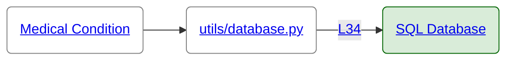
<a id="data-element-45"></a>
## Medical History

**Sensitivity:** 🔴 Critical • **Tags:** PHI • **Occurrences:** 54

**Risky Dataflows:**

<details>
<summary>OpenAI</summary>

1. First detected here in [pages/patient.py:59:9](https://github.com/hounddogai/hounddog-test-python-app/blob/781c916790f5/pages/patient.py#L59-L59)

    ```python
    medical_history
    ```

2. Placed inside a string and assigned to 'patient_context' in [pages/patient.py:284:17](https://github.com/hounddogai/hounddog-test-python-app/blob/781c916790f5/pages/patient.py#L284-L286)

    ```python
    patient_context = f"""
    Patient Medical History: {medical_history}
    """
    ```

3. Wrapped in langchain_core.messages.SystemMessage and assigned to 'messages' in [pages/patient.py:308:25](https://github.com/hounddogai/hounddog-test-python-app/blob/781c916790f5/pages/patient.py#L308-L308)

    ```python
    messages = [SystemMessage(content=patient_context)]
    ```

4. Exposed to OpenAI in [pages/patient.py:321:36](https://github.com/hounddogai/hounddog-test-python-app/blob/781c916790f5/pages/patient.py#L321-L321)

    ```python
    llm.invoke(messages)
    ```
</details>

**Safe Dataflows:**

<details>
<summary>SQL Database</summary>

1. First detected here in [utils/database.py:37:5](https://github.com/hounddogai/hounddog-test-python-app/blob/781c916790f5/utils/database.py#L37-L37)

    ```python
    medical_history = Column(Text)
    ```

2. Stored in SQL Database in [utils/database.py:37:5](https://github.com/hounddogai/hounddog-test-python-app/blob/781c916790f5/utils/database.py#L37-L37)

    ```python
    medical_history = Column(Text)
    ```
</details>


**Visualization:**

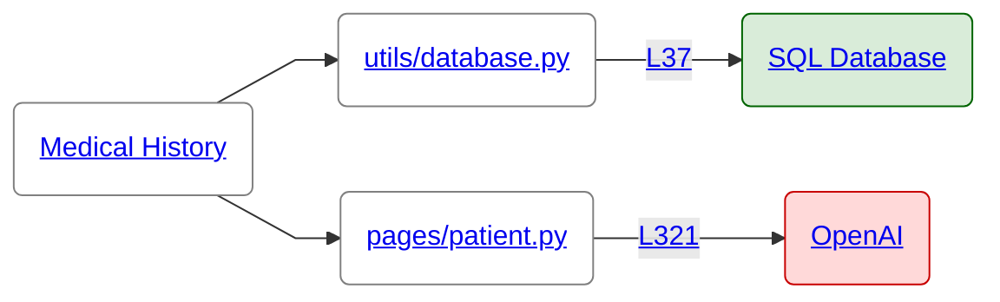
<a id="data-element-47"></a>
## Medical Record Number

**Sensitivity:** 🔴 Critical • **Tags:** PHI • **Occurrences:** 9

**Risky Dataflows:**

<span style="color:rgba(100, 100, 100, 1); font-size: 0.85em;">No risky dataflows detected</span>

**Safe Dataflows:**

<details>
<summary>SQL Database</summary>

</br>**Occurrence #1**

1. First detected here in [utils/data_manager.py:387:69](https://github.com/hounddogai/hounddog-test-python-app/blob/781c916790f5/utils/data_manager.py#L387-L387)

    ```python
    MedicalRecord.id
    ```

2. Stored in SQL Database in [utils/data_manager.py:387:58](https://github.com/hounddogai/hounddog-test-python-app/blob/781c916790f5/utils/data_manager.py#L387-L387)

    ```python
    func.count(MedicalRecord.id)
    ```
</br>**Occurrence #2**

1. First detected here in [utils/data_manager.py:248:45](https://github.com/hounddogai/hounddog-test-python-app/blob/781c916790f5/utils/data_manager.py#L248-L248)

    ```python
    MedicalRecord.id
    ```

2. Stored in SQL Database in [utils/data_manager.py:248:34](https://github.com/hounddogai/hounddog-test-python-app/blob/781c916790f5/utils/data_manager.py#L248-L248)

    ```python
    func.count(MedicalRecord.id)
    ```
</br>**Occurrence #3**

1. First detected here in [utils/data_manager.py:496:54](https://github.com/hounddogai/hounddog-test-python-app/blob/781c916790f5/utils/data_manager.py#L496-L496)

    ```python
    MedicalRecord.id
    ```

2. Stored in SQL Database in [utils/data_manager.py:496:43](https://github.com/hounddogai/hounddog-test-python-app/blob/781c916790f5/utils/data_manager.py#L496-L496)

    ```python
    func.count(MedicalRecord.id)
    ```
</br>**Occurrence #4**

1. First detected here in [utils/data_manager.py:387:69](https://github.com/hounddogai/hounddog-test-python-app/blob/781c916790f5/utils/data_manager.py#L387-L387)

    ```python
    MedicalRecord.id
    ```

2. Stored in SQL Database in [utils/data_manager.py:389:32](https://github.com/hounddogai/hounddog-test-python-app/blob/781c916790f5/utils/data_manager.py#L389-L389)

    ```python
    func.count(MedicalRecord.id)
    ```
</br>**Occurrence #5**

1. First detected here in [utils/data_manager.py:239:45](https://github.com/hounddogai/hounddog-test-python-app/blob/781c916790f5/utils/data_manager.py#L239-L239)

    ```python
    MedicalRecord.id
    ```

2. Stored in SQL Database in [utils/data_manager.py:239:34](https://github.com/hounddogai/hounddog-test-python-app/blob/781c916790f5/utils/data_manager.py#L239-L239)

    ```python
    func.count(MedicalRecord.id)
    ```
</details>


**Visualization:**

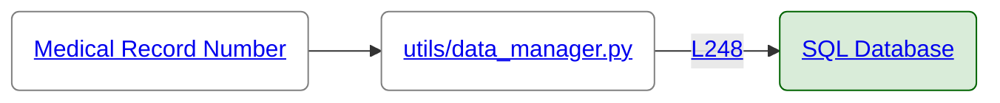
<a id="data-element-7"></a>
## Blood Cholesterol

**Sensitivity:** 🟠 Medium • **Tags:** PHI • **Occurrences:** 17

**Risky Dataflows:**

<span style="color:rgba(100, 100, 100, 1); font-size: 0.85em;">No risky dataflows detected</span>

**Safe Dataflows:**

<span style="color:rgba(100, 100, 100, 1); font-size: 0.85em;">No safe dataflows detected</span>

<a id="data-element-9"></a>
## Blood Pressure

**Sensitivity:** 🟠 Medium • **Tags:** PHI • **Occurrences:** 34

**Risky Dataflows:**

<span style="color:rgba(100, 100, 100, 1); font-size: 0.85em;">No risky dataflows detected</span>

**Safe Dataflows:**

<span style="color:rgba(100, 100, 100, 1); font-size: 0.85em;">No safe dataflows detected</span>

<a id="data-element-10"></a>
## Blood Type

**Sensitivity:** 🟠 Medium • **Tags:** PHI • **Occurrences:** 50

**Risky Dataflows:**

<span style="color:rgba(100, 100, 100, 1); font-size: 0.85em;">No risky dataflows detected</span>

**Safe Dataflows:**

<details>
<summary>SQL Database</summary>

1. First detected here in [utils/database.py:33:5](https://github.com/hounddogai/hounddog-test-python-app/blob/781c916790f5/utils/database.py#L33-L33)

    ```python
    blood_type = Column(String(10))
    ```

2. Stored in SQL Database in [utils/database.py:33:5](https://github.com/hounddogai/hounddog-test-python-app/blob/781c916790f5/utils/database.py#L33-L33)

    ```python
    blood_type = Column(String(10))
    ```
</details>


**Visualization:**

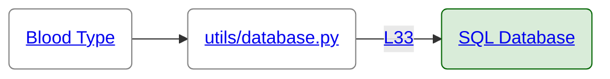
<a id="data-element-49"></a>
## Medication

**Sensitivity:** 🟠 Medium • **Tags:** PHI • **Occurrences:** 49

**Risky Dataflows:**

<span style="color:rgba(100, 100, 100, 1); font-size: 0.85em;">No risky dataflows detected</span>

**Safe Dataflows:**

<details>
<summary>SQL Database</summary>

1. First detected here in [utils/database.py:38:5](https://github.com/hounddogai/hounddog-test-python-app/blob/781c916790f5/utils/database.py#L38-L38)

    ```python
    current_medications = Column(Text)
    ```

2. Stored in SQL Database in [utils/database.py:38:5](https://github.com/hounddogai/hounddog-test-python-app/blob/781c916790f5/utils/database.py#L38-L38)

    ```python
    current_medications = Column(Text)
    ```
</details>


**Visualization:**

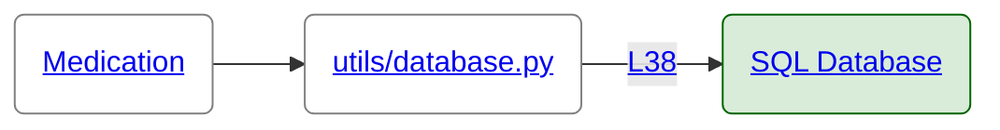
<a id="data-element-60"></a>
## Phone Number

**Sensitivity:** 🟠 Medium • **Tags:** PII • **Occurrences:** 57

**Risky Dataflows:**

<details>
<summary>Sentry</summary>

1. First detected here in [pages/patient.py:101:33](https://github.com/hounddogai/hounddog-test-python-app/blob/781c916790f5/pages/patient.py#L101-L101)

    ```python
    "phone": phone
    ```

2. Placed inside a dictionary and exposed to Sentry in [pages/patient.py:98:21](https://github.com/hounddogai/hounddog-test-python-app/blob/781c916790f5/pages/patient.py#L98-L102)

    ```python
    sentry_sdk.capture_message(
        f"Failed to add patient",
        level="error",
        extras={"phone": phone},
    )
    ```
</details>

**Safe Dataflows:**

<details>
<summary>SQL Database</summary>

1. First detected here in [utils/database.py:30:5](https://github.com/hounddogai/hounddog-test-python-app/blob/781c916790f5/utils/database.py#L30-L30)

    ```python
    phone = Column(String(50))
    ```

2. Stored in SQL Database in [utils/database.py:30:5](https://github.com/hounddogai/hounddog-test-python-app/blob/781c916790f5/utils/database.py#L30-L30)

    ```python
    phone = Column(String(50))
    ```
</details>


**Visualization:**

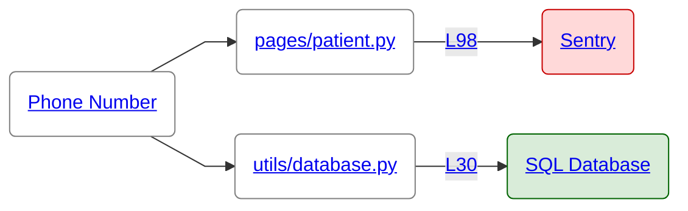
<a id="data-element-73"></a>
## Sexual Orientation

**Sensitivity:** 🟠 Medium • **Tags:** PII • **Occurrences:** 127

**Risky Dataflows:**

<span style="color:rgba(100, 100, 100, 1); font-size: 0.85em;">No risky dataflows detected</span>

**Safe Dataflows:**

<details>
<summary>SQL Database</summary>

1. First detected here in [utils/database.py:29:5](https://github.com/hounddogai/hounddog-test-python-app/blob/781c916790f5/utils/database.py#L29-L29)

    ```python
    gender = Column(String(50), nullable=False)
    ```

2. Stored in SQL Database in [utils/database.py:29:5](https://github.com/hounddogai/hounddog-test-python-app/blob/781c916790f5/utils/database.py#L29-L29)

    ```python
    gender = Column(String(50), nullable=False)
    ```
</details>


**Visualization:**

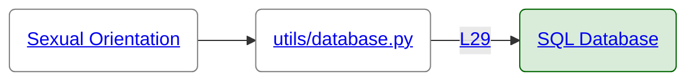
<a id="data-element-81"></a>
## Vital Sign

**Sensitivity:** 🟠 Medium • **Tags:** PHI • **Occurrences:** 4

**Risky Dataflows:**

<span style="color:rgba(100, 100, 100, 1); font-size: 0.85em;">No risky dataflows detected</span>

**Safe Dataflows:**

<span style="color:rgba(100, 100, 100, 1); font-size: 0.85em;">No safe dataflows detected</span>

<a id="data-element-16"></a>
## Date of Birth

**Sensitivity:** 🟡 Low • **Tags:** PII • **Occurrences:** 79

**Risky Dataflows:**

<span style="color:rgba(100, 100, 100, 1); font-size: 0.85em;">No risky dataflows detected</span>

**Safe Dataflows:**

<details>
<summary>SQL Database</summary>

1. First detected here in [utils/database.py:28:5](https://github.com/hounddogai/hounddog-test-python-app/blob/781c916790f5/utils/database.py#L28-L28)

    ```python
    date_of_birth = Column(Date, nullable=False)
    ```

2. Stored in SQL Database in [utils/database.py:28:5](https://github.com/hounddogai/hounddog-test-python-app/blob/781c916790f5/utils/database.py#L28-L28)

    ```python
    date_of_birth = Column(Date, nullable=False)
    ```
</details>


**Visualization:**

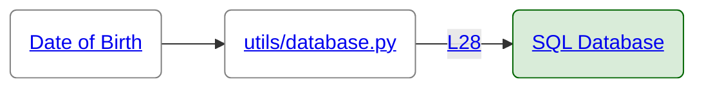
<a id="data-element-20"></a>
## Email

**Sensitivity:** 🟡 Low • **Tags:** PII • **Occurrences:** 55

**Risky Dataflows:**

<span style="color:rgba(100, 100, 100, 1); font-size: 0.85em;">No risky dataflows detected</span>

**Safe Dataflows:**

<details>
<summary>SQL Database</summary>

1. First detected here in [utils/database.py:31:5](https://github.com/hounddogai/hounddog-test-python-app/blob/781c916790f5/utils/database.py#L31-L31)

    ```python
    email = Column(String(100))
    ```

2. Stored in SQL Database in [utils/database.py:31:5](https://github.com/hounddogai/hounddog-test-python-app/blob/781c916790f5/utils/database.py#L31-L31)

    ```python
    email = Column(String(100))
    ```
</details>


**Visualization:**

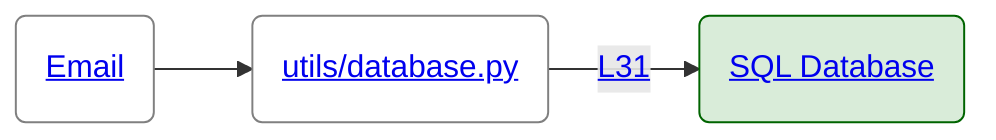
<a id="data-element-21"></a>
## Emergency Contact

**Sensitivity:** 🟡 Low • **Tags:** PII • **Occurrences:** 91

**Risky Dataflows:**

<span style="color:rgba(100, 100, 100, 1); font-size: 0.85em;">No risky dataflows detected</span>

**Safe Dataflows:**

<details>
<summary>SQL Database</summary>

1. First detected here in [utils/database.py:36:5](https://github.com/hounddogai/hounddog-test-python-app/blob/781c916790f5/utils/database.py#L36-L36)

    ```python
    emergency_contact_phone = Column(String(50))
    ```

2. Stored in SQL Database in [utils/database.py:36:5](https://github.com/hounddogai/hounddog-test-python-app/blob/781c916790f5/utils/database.py#L36-L36)

    ```python
    emergency_contact_phone = Column(String(50))
    ```
</details>


**Visualization:**

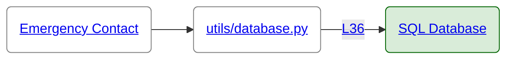
<a id="data-element-27"></a>
## First Name

**Sensitivity:** 🟡 Low • **Tags:** PII • **Occurrences:** 81

**Risky Dataflows:**

<details>
<summary>Logs</summary>

1. First detected here in [scripts/seed_db.py:143:9](https://github.com/hounddogai/hounddog-test-python-app/blob/781c916790f5/scripts/seed_db.py#L143-L143)

    ```python
    first_name
    ```

2. Placed inside a string and exposed to Logs in [scripts/seed_db.py:168:13](https://github.com/hounddogai/hounddog-test-python-app/blob/781c916790f5/scripts/seed_db.py#L168-L168)

    ```python
    logger.debug(f"Added patient: {first_name} {last_name}")
    ```
</details>

**Safe Dataflows:**

<details>
<summary>SQL Database</summary>

</br>**Occurrence #1**

1. First detected here in [utils/database.py:26:5](https://github.com/hounddogai/hounddog-test-python-app/blob/781c916790f5/utils/database.py#L26-L26)

    ```python
    first_name = Column(String(100), nullable=False)
    ```

2. Stored in SQL Database in [utils/database.py:26:5](https://github.com/hounddogai/hounddog-test-python-app/blob/781c916790f5/utils/database.py#L26-L26)

    ```python
    first_name = Column(String(100), nullable=False)
    ```
</br>**Occurrence #2**

1. First detected here in [utils/data_manager.py:102:33](https://github.com/hounddogai/hounddog-test-python-app/blob/781c916790f5/utils/data_manager.py#L102-L102)

    ```python
    Patient.first_name
    ```

2. Stored in SQL Database in [utils/data_manager.py:102:22](https://github.com/hounddogai/hounddog-test-python-app/blob/781c916790f5/utils/data_manager.py#L102-L102)

    ```python
    func.lower(Patient.first_name)
    ```
</details>


**Visualization:**

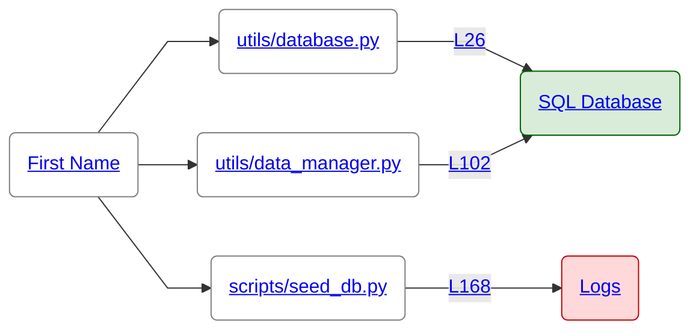
<a id="data-element-37"></a>
## Last Name

**Sensitivity:** 🟡 Low • **Tags:** PII • **Occurrences:** 78

**Risky Dataflows:**

<details>
<summary>Logs</summary>

1. First detected here in [scripts/seed_db.py:144:9](https://github.com/hounddogai/hounddog-test-python-app/blob/781c916790f5/scripts/seed_db.py#L144-L144)

    ```python
    last_name
    ```

2. Placed inside a string and exposed to Logs in [scripts/seed_db.py:168:13](https://github.com/hounddogai/hounddog-test-python-app/blob/781c916790f5/scripts/seed_db.py#L168-L168)

    ```python
    logger.debug(f"Added patient: {first_name} {last_name}")
    ```
</details>

**Safe Dataflows:**

<details>
<summary>SQL Database</summary>

</br>**Occurrence #1**

1. First detected here in [utils/data_manager.py:103:35](https://github.com/hounddogai/hounddog-test-python-app/blob/781c916790f5/utils/data_manager.py#L103-L103)

    ```python
    Patient.last_name
    ```

2. Stored in SQL Database in [utils/data_manager.py:103:24](https://github.com/hounddogai/hounddog-test-python-app/blob/781c916790f5/utils/data_manager.py#L103-L103)

    ```python
    func.lower(Patient.last_name)
    ```
</br>**Occurrence #2**

1. First detected here in [utils/database.py:27:5](https://github.com/hounddogai/hounddog-test-python-app/blob/781c916790f5/utils/database.py#L27-L27)

    ```python
    last_name = Column(String(100), nullable=False)
    ```

2. Stored in SQL Database in [utils/database.py:27:5](https://github.com/hounddogai/hounddog-test-python-app/blob/781c916790f5/utils/database.py#L27-L27)

    ```python
    last_name = Column(String(100), nullable=False)
    ```
</details>


**Visualization:**


# Data Sinks

This section lists the data sinks detected and the data elements exposed to them.

<a id="data-sink-configs"></a>
## Configuration Files

**Risky Dataflows:**

<span style="color:rgba(100, 100, 100, 1); font-size: 0.85em;">No risky dataflows detected</span>

**Safe Dataflows:**

<span style="color:rgba(100, 100, 100, 1); font-size: 0.85em;">No safe dataflows detected</span>

<a id="data-sink-env"></a>
## Environment Variables

**Risky Dataflows:**

<span style="color:rgba(100, 100, 100, 1); font-size: 0.85em;">No risky dataflows detected</span>

**Safe Dataflows:**

<span style="color:rgba(100, 100, 100, 1); font-size: 0.85em;">No safe dataflows detected</span>

<a id="data-sink-files"></a>
## Files

**Risky Dataflows:**

<span style="color:rgba(100, 100, 100, 1); font-size: 0.85em;">No risky dataflows detected</span>

**Safe Dataflows:**

<span style="color:rgba(100, 100, 100, 1); font-size: 0.85em;">No safe dataflows detected</span>

<a id="data-sink-langchain"></a>
## LangChain

**Risky Dataflows:**

<span style="color:rgba(100, 100, 100, 1); font-size: 0.85em;">No risky dataflows detected</span>

**Safe Dataflows:**

<span style="color:rgba(100, 100, 100, 1); font-size: 0.85em;">No safe dataflows detected</span>

<a id="data-sink-logs"></a>
## Logs

**Risky Dataflows:**

<details>
<summary>🟡 First Name</summary>

1. First detected here in [scripts/seed_db.py:143:9](https://github.com/hounddogai/hounddog-test-python-app/blob/781c916790f5/scripts/seed_db.py#L143-L143)

    ```python
    first_name
    ```

2. Placed inside a string and exposed to Logs in [scripts/seed_db.py:168:13](https://github.com/hounddogai/hounddog-test-python-app/blob/781c916790f5/scripts/seed_db.py#L168-L168)

    ```python
    logger.debug(f"Added patient: {first_name} {last_name}")
    ```
</details>

<details>
<summary>🟡 Last Name</summary>

1. First detected here in [scripts/seed_db.py:144:9](https://github.com/hounddogai/hounddog-test-python-app/blob/781c916790f5/scripts/seed_db.py#L144-L144)

    ```python
    last_name
    ```

2. Placed inside a string and exposed to Logs in [scripts/seed_db.py:168:13](https://github.com/hounddogai/hounddog-test-python-app/blob/781c916790f5/scripts/seed_db.py#L168-L168)

    ```python
    logger.debug(f"Added patient: {first_name} {last_name}")
    ```
</details>

**Safe Dataflows:**

<span style="color:rgba(100, 100, 100, 1); font-size: 0.85em;">No safe dataflows detected</span>

<a id="data-sink-openai"></a>
## OpenAI

**Risky Dataflows:**

<details>
<summary>🔴 Medical History</summary>

1. First detected here in [pages/patient.py:59:9](https://github.com/hounddogai/hounddog-test-python-app/blob/781c916790f5/pages/patient.py#L59-L59)

    ```python
    medical_history
    ```

2. Placed inside a string and assigned to 'patient_context' in [pages/patient.py:284:17](https://github.com/hounddogai/hounddog-test-python-app/blob/781c916790f5/pages/patient.py#L284-L286)

    ```python
    patient_context = f"""
    Patient Medical History: {medical_history}
    """
    ```

3. Wrapped in langchain_core.messages.SystemMessage and assigned to 'messages' in [pages/patient.py:308:25](https://github.com/hounddogai/hounddog-test-python-app/blob/781c916790f5/pages/patient.py#L308-L308)

    ```python
    messages = [SystemMessage(content=patient_context)]
    ```

4. Exposed to OpenAI in [pages/patient.py:321:36](https://github.com/hounddogai/hounddog-test-python-app/blob/781c916790f5/pages/patient.py#L321-L321)

    ```python
    llm.invoke(messages)
    ```
</details>

**Safe Dataflows:**

<span style="color:rgba(100, 100, 100, 1); font-size: 0.85em;">No safe dataflows detected</span>

<a id="data-sink-sql-db"></a>
## SQL Database

**Risky Dataflows:**

<span style="color:rgba(100, 100, 100, 1); font-size: 0.85em;">No risky dataflows detected</span>

**Safe Dataflows:**

<details>
<summary>🔴 Medical Condition</summary>

1. First detected here in [utils/database.py:34:5](https://github.com/hounddogai/hounddog-test-python-app/blob/781c916790f5/utils/database.py#L34-L34)

    ```python
    allergies = Column(Text)
    ```

2. Stored in SQL Database in [utils/database.py:34:5](https://github.com/hounddogai/hounddog-test-python-app/blob/781c916790f5/utils/database.py#L34-L34)

    ```python
    allergies = Column(Text)
    ```
</details>

<details>
<summary>🔴 Medical History</summary>

1. First detected here in [utils/database.py:37:5](https://github.com/hounddogai/hounddog-test-python-app/blob/781c916790f5/utils/database.py#L37-L37)

    ```python
    medical_history = Column(Text)
    ```

2. Stored in SQL Database in [utils/database.py:37:5](https://github.com/hounddogai/hounddog-test-python-app/blob/781c916790f5/utils/database.py#L37-L37)

    ```python
    medical_history = Column(Text)
    ```
</details>

<details>
<summary>🔴 Medical Record Number</summary>

</br>**Occurrence #1**

1. First detected here in [utils/data_manager.py:387:69](https://github.com/hounddogai/hounddog-test-python-app/blob/781c916790f5/utils/data_manager.py#L387-L387)

    ```python
    MedicalRecord.id
    ```

2. Stored in SQL Database in [utils/data_manager.py:387:58](https://github.com/hounddogai/hounddog-test-python-app/blob/781c916790f5/utils/data_manager.py#L387-L387)

    ```python
    func.count(MedicalRecord.id)
    ```
</br>**Occurrence #2**

1. First detected here in [utils/data_manager.py:248:45](https://github.com/hounddogai/hounddog-test-python-app/blob/781c916790f5/utils/data_manager.py#L248-L248)

    ```python
    MedicalRecord.id
    ```

2. Stored in SQL Database in [utils/data_manager.py:248:34](https://github.com/hounddogai/hounddog-test-python-app/blob/781c916790f5/utils/data_manager.py#L248-L248)

    ```python
    func.count(MedicalRecord.id)
    ```
</br>**Occurrence #3**

1. First detected here in [utils/data_manager.py:496:54](https://github.com/hounddogai/hounddog-test-python-app/blob/781c916790f5/utils/data_manager.py#L496-L496)

    ```python
    MedicalRecord.id
    ```

2. Stored in SQL Database in [utils/data_manager.py:496:43](https://github.com/hounddogai/hounddog-test-python-app/blob/781c916790f5/utils/data_manager.py#L496-L496)

    ```python
    func.count(MedicalRecord.id)
    ```
</br>**Occurrence #4**

1. First detected here in [utils/data_manager.py:387:69](https://github.com/hounddogai/hounddog-test-python-app/blob/781c916790f5/utils/data_manager.py#L387-L387)

    ```python
    MedicalRecord.id
    ```

2. Stored in SQL Database in [utils/data_manager.py:389:32](https://github.com/hounddogai/hounddog-test-python-app/blob/781c916790f5/utils/data_manager.py#L389-L389)

    ```python
    func.count(MedicalRecord.id)
    ```
</br>**Occurrence #5**

1. First detected here in [utils/data_manager.py:239:45](https://github.com/hounddogai/hounddog-test-python-app/blob/781c916790f5/utils/data_manager.py#L239-L239)

    ```python
    MedicalRecord.id
    ```

2. Stored in SQL Database in [utils/data_manager.py:239:34](https://github.com/hounddogai/hounddog-test-python-app/blob/781c916790f5/utils/data_manager.py#L239-L239)

    ```python
    func.count(MedicalRecord.id)
    ```
</details>

<details>
<summary>🟠 Blood Type</summary>

1. First detected here in [utils/database.py:33:5](https://github.com/hounddogai/hounddog-test-python-app/blob/781c916790f5/utils/database.py#L33-L33)

    ```python
    blood_type = Column(String(10))
    ```

2. Stored in SQL Database in [utils/database.py:33:5](https://github.com/hounddogai/hounddog-test-python-app/blob/781c916790f5/utils/database.py#L33-L33)

    ```python
    blood_type = Column(String(10))
    ```
</details>

<details>
<summary>🟠 Medication</summary>

1. First detected here in [utils/database.py:38:5](https://github.com/hounddogai/hounddog-test-python-app/blob/781c916790f5/utils/database.py#L38-L38)

    ```python
    current_medications = Column(Text)
    ```

2. Stored in SQL Database in [utils/database.py:38:5](https://github.com/hounddogai/hounddog-test-python-app/blob/781c916790f5/utils/database.py#L38-L38)

    ```python
    current_medications = Column(Text)
    ```
</details>

<details>
<summary>🟠 Phone Number</summary>

1. First detected here in [utils/database.py:30:5](https://github.com/hounddogai/hounddog-test-python-app/blob/781c916790f5/utils/database.py#L30-L30)

    ```python
    phone = Column(String(50))
    ```

2. Stored in SQL Database in [utils/database.py:30:5](https://github.com/hounddogai/hounddog-test-python-app/blob/781c916790f5/utils/database.py#L30-L30)

    ```python
    phone = Column(String(50))
    ```
</details>

<details>
<summary>🟠 Sexual Orientation</summary>

1. First detected here in [utils/database.py:29:5](https://github.com/hounddogai/hounddog-test-python-app/blob/781c916790f5/utils/database.py#L29-L29)

    ```python
    gender = Column(String(50), nullable=False)
    ```

2. Stored in SQL Database in [utils/database.py:29:5](https://github.com/hounddogai/hounddog-test-python-app/blob/781c916790f5/utils/database.py#L29-L29)

    ```python
    gender = Column(String(50), nullable=False)
    ```
</details>

<details>
<summary>🟡 Date of Birth</summary>

1. First detected here in [utils/database.py:28:5](https://github.com/hounddogai/hounddog-test-python-app/blob/781c916790f5/utils/database.py#L28-L28)

    ```python
    date_of_birth = Column(Date, nullable=False)
    ```

2. Stored in SQL Database in [utils/database.py:28:5](https://github.com/hounddogai/hounddog-test-python-app/blob/781c916790f5/utils/database.py#L28-L28)

    ```python
    date_of_birth = Column(Date, nullable=False)
    ```
</details>

<details>
<summary>🟡 Email</summary>

1. First detected here in [utils/database.py:31:5](https://github.com/hounddogai/hounddog-test-python-app/blob/781c916790f5/utils/database.py#L31-L31)

    ```python
    email = Column(String(100))
    ```

2. Stored in SQL Database in [utils/database.py:31:5](https://github.com/hounddogai/hounddog-test-python-app/blob/781c916790f5/utils/database.py#L31-L31)

    ```python
    email = Column(String(100))
    ```
</details>

<details>
<summary>🟡 Emergency Contact</summary>

1. First detected here in [utils/database.py:36:5](https://github.com/hounddogai/hounddog-test-python-app/blob/781c916790f5/utils/database.py#L36-L36)

    ```python
    emergency_contact_phone = Column(String(50))
    ```

2. Stored in SQL Database in [utils/database.py:36:5](https://github.com/hounddogai/hounddog-test-python-app/blob/781c916790f5/utils/database.py#L36-L36)

    ```python
    emergency_contact_phone = Column(String(50))
    ```
</details>

<details>
<summary>🟡 First Name</summary>

</br>**Occurrence #1**

1. First detected here in [utils/database.py:26:5](https://github.com/hounddogai/hounddog-test-python-app/blob/781c916790f5/utils/database.py#L26-L26)

    ```python
    first_name = Column(String(100), nullable=False)
    ```

2. Stored in SQL Database in [utils/database.py:26:5](https://github.com/hounddogai/hounddog-test-python-app/blob/781c916790f5/utils/database.py#L26-L26)

    ```python
    first_name = Column(String(100), nullable=False)
    ```
</br>**Occurrence #2**

1. First detected here in [utils/data_manager.py:102:33](https://github.com/hounddogai/hounddog-test-python-app/blob/781c916790f5/utils/data_manager.py#L102-L102)

    ```python
    Patient.first_name
    ```

2. Stored in SQL Database in [utils/data_manager.py:102:22](https://github.com/hounddogai/hounddog-test-python-app/blob/781c916790f5/utils/data_manager.py#L102-L102)

    ```python
    func.lower(Patient.first_name)
    ```
</details>

<details>
<summary>🟡 Last Name</summary>

</br>**Occurrence #1**

1. First detected here in [utils/data_manager.py:103:35](https://github.com/hounddogai/hounddog-test-python-app/blob/781c916790f5/utils/data_manager.py#L103-L103)

    ```python
    Patient.last_name
    ```

2. Stored in SQL Database in [utils/data_manager.py:103:24](https://github.com/hounddogai/hounddog-test-python-app/blob/781c916790f5/utils/data_manager.py#L103-L103)

    ```python
    func.lower(Patient.last_name)
    ```
</br>**Occurrence #2**

1. First detected here in [utils/database.py:27:5](https://github.com/hounddogai/hounddog-test-python-app/blob/781c916790f5/utils/database.py#L27-L27)

    ```python
    last_name = Column(String(100), nullable=False)
    ```

2. Stored in SQL Database in [utils/database.py:27:5](https://github.com/hounddogai/hounddog-test-python-app/blob/781c916790f5/utils/database.py#L27-L27)

    ```python
    last_name = Column(String(100), nullable=False)
    ```
</details>

<a id="data-sink-sqlalchemy"></a>
## SQLAlchemy

**Risky Dataflows:**

<span style="color:rgba(100, 100, 100, 1); font-size: 0.85em;">No risky dataflows detected</span>

**Safe Dataflows:**

<span style="color:rgba(100, 100, 100, 1); font-size: 0.85em;">No safe dataflows detected</span>

<a id="data-sink-sentry"></a>
## Sentry

**Risky Dataflows:**

<details>
<summary>🟠 Phone Number</summary>

1. First detected here in [pages/patient.py:101:33](https://github.com/hounddogai/hounddog-test-python-app/blob/781c916790f5/pages/patient.py#L101-L101)

    ```python
    "phone": phone
    ```

2. Placed inside a dictionary and exposed to Sentry in [pages/patient.py:98:21](https://github.com/hounddogai/hounddog-test-python-app/blob/781c916790f5/pages/patient.py#L98-L102)

    ```python
    sentry_sdk.capture_message(
        f"Failed to add patient",
        level="error",
        extras={"phone": phone},
    )
    ```
</details>

**Safe Dataflows:**

<span style="color:rgba(100, 100, 100, 1); font-size: 0.85em;">No safe dataflows detected</span>

<a id="data-sink-stdout"></a>
## Standard Output

**Risky Dataflows:**

<span style="color:rgba(100, 100, 100, 1); font-size: 0.85em;">No risky dataflows detected</span>

**Safe Dataflows:**

<span style="color:rgba(100, 100, 100, 1); font-size: 0.85em;">No safe dataflows detected</span>


# Risky Dataflows

This section shows vulnerable dataflows where sensitive data reaches unsafe sinks without adequate sanitization.

---

🟥 **CRITICAL:** Medical History exposed to OpenAI 
in [pages/patient.py:321:36](https://github.com/hounddogai/hounddog-test-python-app/blob/781c916790f5/pages/patient.py#L321-L321):

```python
llm.invoke(messages)
```

<details>
<summary>View Details</summary>

This issue was rated as 🟥 **CRITICAL** for exposing the following data element(s) to [OpenAI](#data-sink-openai):

<details>
<summary>🔴 Medical History</summary>

1. First detected here in [pages/patient.py:59:9](https://github.com/hounddogai/hounddog-test-python-app/blob/781c916790f5/pages/patient.py#L59-L59)

    ```python
    medical_history
    ```

2. Placed inside a string and assigned to 'patient_context' in [pages/patient.py:284:17](https://github.com/hounddogai/hounddog-test-python-app/blob/781c916790f5/pages/patient.py#L284-L286)

    ```python
    patient_context = f"""
    Patient Medical History: {medical_history}
    """
    ```

3. Wrapped in langchain_core.messages.SystemMessage and assigned to 'messages' in [pages/patient.py:308:25](https://github.com/hounddogai/hounddog-test-python-app/blob/781c916790f5/pages/patient.py#L308-L308)

    ```python
    messages = [SystemMessage(content=patient_context)]
    ```

4. Exposed to OpenAI in [pages/patient.py:321:36](https://github.com/hounddogai/hounddog-test-python-app/blob/781c916790f5/pages/patient.py#L321-L321)

    ```python
    llm.invoke(messages)
    ```
</details>


**Remediation:**

Remove the offending code or sanitize the data.

For auto-closing vulnerabilities, see [https://docs.hounddog.ai/scanner/remediation](https://docs.hounddog.ai/scanner/remediation).

**Compliance Frameworks:** [CWE-201](https://cwe.mitre.org/data/definitions/201.html), [A01:2021](https://owasp.org/Top10/A01_2021), [GDPR-A5-28](https://gdpr-info.eu/art-28-gdpr/), [CCPA](https://oag.ca.gov/privacy/ccpa), [HIPAA](https://www.hhs.gov/hipaa/index.html), [NIST-800-53](https://csrc.nist.gov/publications/detail/sp/800-53/rev-5/final)

</details>

---

🟧 **MEDIUM:** Phone Number exposed to Sentry 
in [pages/patient.py:98:21](https://github.com/hounddogai/hounddog-test-python-app/blob/781c916790f5/pages/patient.py#L98-L102):

```python
sentry_sdk.capture_message(
    f"Failed to add patient",
    level="error",
    extras={"phone": phone},
)
```

<details>
<summary>View Details</summary>

This issue was rated as 🟧 **MEDIUM** for exposing the following data element(s) to [Sentry](#data-sink-sentry):

<details>
<summary>🟠 Phone Number</summary>

1. First detected here in [pages/patient.py:101:33](https://github.com/hounddogai/hounddog-test-python-app/blob/781c916790f5/pages/patient.py#L101-L101)

    ```python
    "phone": phone
    ```

2. Placed inside a dictionary and exposed to Sentry in [pages/patient.py:98:21](https://github.com/hounddogai/hounddog-test-python-app/blob/781c916790f5/pages/patient.py#L98-L102)

    ```python
    sentry_sdk.capture_message(
        f"Failed to add patient",
        level="error",
        extras={"phone": phone},
    )
    ```
</details>


**Remediation:**

Remove the offending code or sanitize the data.

For auto-closing vulnerabilities, see [https://docs.hounddog.ai/scanner/remediation](https://docs.hounddog.ai/scanner/remediation).

**Compliance Frameworks:** [CWE-201](https://cwe.mitre.org/data/definitions/201.html), [A01:2021](https://owasp.org/Top10/A01_2021), [GDPR-A5-28](https://gdpr-info.eu/art-28-gdpr/), [CCPA](https://oag.ca.gov/privacy/ccpa), [NIST-800-53](https://csrc.nist.gov/publications/detail/sp/800-53/rev-5/final)

</details>

---

🟨 **LOW:** First Name and Last Name exposed to Logs 
in [scripts/seed_db.py:168:13](https://github.com/hounddogai/hounddog-test-python-app/blob/781c916790f5/scripts/seed_db.py#L168-L168):

```python
logger.debug(f"Added patient: {first_name} {last_name}")
```

<details>
<summary>View Details</summary>

This issue was rated as 🟨 **LOW** for exposing the following data element(s) to [Logs](#data-sink-logs):

<details>
<summary>🟡 First Name</summary>

1. First detected here in [scripts/seed_db.py:143:9](https://github.com/hounddogai/hounddog-test-python-app/blob/781c916790f5/scripts/seed_db.py#L143-L143)

    ```python
    first_name
    ```

2. Placed inside a string and exposed to Logs in [scripts/seed_db.py:168:13](https://github.com/hounddogai/hounddog-test-python-app/blob/781c916790f5/scripts/seed_db.py#L168-L168)

    ```python
    logger.debug(f"Added patient: {first_name} {last_name}")
    ```
</details>

<details>
<summary>🟡 Last Name</summary>

1. First detected here in [scripts/seed_db.py:144:9](https://github.com/hounddogai/hounddog-test-python-app/blob/781c916790f5/scripts/seed_db.py#L144-L144)

    ```python
    last_name
    ```

2. Placed inside a string and exposed to Logs in [scripts/seed_db.py:168:13](https://github.com/hounddogai/hounddog-test-python-app/blob/781c916790f5/scripts/seed_db.py#L168-L168)

    ```python
    logger.debug(f"Added patient: {first_name} {last_name}")
    ```
</details>


**Remediation:**

Remove the offending code or sanitize the data.

For auto-closing vulnerabilities, see [https://docs.hounddog.ai/scanner/remediation](https://docs.hounddog.ai/scanner/remediation).

**Compliance Frameworks:** [CWE-532](https://cwe.mitre.org/data/definitions/532.html), [A09:2021](https://owasp.org/Top10/A09_2021), [GDPR-A5-32](https://gdpr-info.eu/art-32-gdpr/), [CCPA](https://oag.ca.gov/privacy/ccpa), [NIST-800-53](https://csrc.nist.gov/publications/detail/sp/800-53/rev-5/final)

</details>


# Safe Dataflows

This section shows dataflows where sensitive data reaches safe sinks or is properly sanitized.

---

🟩 **INFO:** First Name stored in SQL Database 
in [utils/database.py:26:5](https://github.com/hounddogai/hounddog-test-python-app/blob/781c916790f5/utils/database.py#L26-L26):

```python
first_name = Column(String(100), nullable=False)
```

<details>
<summary>View Details</summary>

This issue was rated as 🟩 **INFO** for exposing the following data element(s) to [SQL Database](#data-sink-sql-db):

<details>
<summary>🟡 First Name</summary>

1. First detected here in [utils/database.py:26:5](https://github.com/hounddogai/hounddog-test-python-app/blob/781c916790f5/utils/database.py#L26-L26)

    ```python
    first_name = Column(String(100), nullable=False)
    ```

2. Stored in SQL Database in [utils/database.py:26:5](https://github.com/hounddogai/hounddog-test-python-app/blob/781c916790f5/utils/database.py#L26-L26)

    ```python
    first_name = Column(String(100), nullable=False)
    ```
</details>

</details>

---

🟩 **INFO:** Medical Record Number stored in SQL Database 
in [utils/data_manager.py:387:58](https://github.com/hounddogai/hounddog-test-python-app/blob/781c916790f5/utils/data_manager.py#L387-L387):

```python
func.count(MedicalRecord.id)
```

<details>
<summary>View Details</summary>

This issue was rated as 🟩 **INFO** for exposing the following data element(s) to [SQL Database](#data-sink-sql-db):

<details>
<summary>🔴 Medical Record Number</summary>

1. First detected here in [utils/data_manager.py:387:69](https://github.com/hounddogai/hounddog-test-python-app/blob/781c916790f5/utils/data_manager.py#L387-L387)

    ```python
    MedicalRecord.id
    ```

2. Stored in SQL Database in [utils/data_manager.py:387:58](https://github.com/hounddogai/hounddog-test-python-app/blob/781c916790f5/utils/data_manager.py#L387-L387)

    ```python
    func.count(MedicalRecord.id)
    ```
</details>

</details>

---

🟩 **INFO:** Date of Birth stored in SQL Database 
in [utils/database.py:28:5](https://github.com/hounddogai/hounddog-test-python-app/blob/781c916790f5/utils/database.py#L28-L28):

```python
date_of_birth = Column(Date, nullable=False)
```

<details>
<summary>View Details</summary>

This issue was rated as 🟩 **INFO** for exposing the following data element(s) to [SQL Database](#data-sink-sql-db):

<details>
<summary>🟡 Date of Birth</summary>

1. First detected here in [utils/database.py:28:5](https://github.com/hounddogai/hounddog-test-python-app/blob/781c916790f5/utils/database.py#L28-L28)

    ```python
    date_of_birth = Column(Date, nullable=False)
    ```

2. Stored in SQL Database in [utils/database.py:28:5](https://github.com/hounddogai/hounddog-test-python-app/blob/781c916790f5/utils/database.py#L28-L28)

    ```python
    date_of_birth = Column(Date, nullable=False)
    ```
</details>

</details>

---

🟩 **INFO:** Medical Record Number stored in SQL Database 
in [utils/data_manager.py:248:34](https://github.com/hounddogai/hounddog-test-python-app/blob/781c916790f5/utils/data_manager.py#L248-L248):

```python
func.count(MedicalRecord.id)
```

<details>
<summary>View Details</summary>

This issue was rated as 🟩 **INFO** for exposing the following data element(s) to [SQL Database](#data-sink-sql-db):

<details>
<summary>🔴 Medical Record Number</summary>

1. First detected here in [utils/data_manager.py:248:45](https://github.com/hounddogai/hounddog-test-python-app/blob/781c916790f5/utils/data_manager.py#L248-L248)

    ```python
    MedicalRecord.id
    ```

2. Stored in SQL Database in [utils/data_manager.py:248:34](https://github.com/hounddogai/hounddog-test-python-app/blob/781c916790f5/utils/data_manager.py#L248-L248)

    ```python
    func.count(MedicalRecord.id)
    ```
</details>

</details>

---

🟩 **INFO:** Medical Record Number stored in SQL Database 
in [utils/data_manager.py:496:43](https://github.com/hounddogai/hounddog-test-python-app/blob/781c916790f5/utils/data_manager.py#L496-L496):

```python
func.count(MedicalRecord.id)
```

<details>
<summary>View Details</summary>

This issue was rated as 🟩 **INFO** for exposing the following data element(s) to [SQL Database](#data-sink-sql-db):

<details>
<summary>🔴 Medical Record Number</summary>

1. First detected here in [utils/data_manager.py:496:54](https://github.com/hounddogai/hounddog-test-python-app/blob/781c916790f5/utils/data_manager.py#L496-L496)

    ```python
    MedicalRecord.id
    ```

2. Stored in SQL Database in [utils/data_manager.py:496:43](https://github.com/hounddogai/hounddog-test-python-app/blob/781c916790f5/utils/data_manager.py#L496-L496)

    ```python
    func.count(MedicalRecord.id)
    ```
</details>

</details>

---

🟩 **INFO:** Medical Condition stored in SQL Database 
in [utils/database.py:34:5](https://github.com/hounddogai/hounddog-test-python-app/blob/781c916790f5/utils/database.py#L34-L34):

```python
allergies = Column(Text)
```

<details>
<summary>View Details</summary>

This issue was rated as 🟩 **INFO** for exposing the following data element(s) to [SQL Database](#data-sink-sql-db):

<details>
<summary>🔴 Medical Condition</summary>

1. First detected here in [utils/database.py:34:5](https://github.com/hounddogai/hounddog-test-python-app/blob/781c916790f5/utils/database.py#L34-L34)

    ```python
    allergies = Column(Text)
    ```

2. Stored in SQL Database in [utils/database.py:34:5](https://github.com/hounddogai/hounddog-test-python-app/blob/781c916790f5/utils/database.py#L34-L34)

    ```python
    allergies = Column(Text)
    ```
</details>

</details>

---

🟩 **INFO:** First Name stored in SQL Database 
in [utils/data_manager.py:102:22](https://github.com/hounddogai/hounddog-test-python-app/blob/781c916790f5/utils/data_manager.py#L102-L102):

```python
func.lower(Patient.first_name)
```

<details>
<summary>View Details</summary>

This issue was rated as 🟩 **INFO** for exposing the following data element(s) to [SQL Database](#data-sink-sql-db):

<details>
<summary>🟡 First Name</summary>

1. First detected here in [utils/data_manager.py:102:33](https://github.com/hounddogai/hounddog-test-python-app/blob/781c916790f5/utils/data_manager.py#L102-L102)

    ```python
    Patient.first_name
    ```

2. Stored in SQL Database in [utils/data_manager.py:102:22](https://github.com/hounddogai/hounddog-test-python-app/blob/781c916790f5/utils/data_manager.py#L102-L102)

    ```python
    func.lower(Patient.first_name)
    ```
</details>

</details>

---

🟩 **INFO:** Medical Record Number stored in SQL Database 
in [utils/data_manager.py:389:32](https://github.com/hounddogai/hounddog-test-python-app/blob/781c916790f5/utils/data_manager.py#L389-L389):

```python
func.count(MedicalRecord.id)
```

<details>
<summary>View Details</summary>

This issue was rated as 🟩 **INFO** for exposing the following data element(s) to [SQL Database](#data-sink-sql-db):

<details>
<summary>🔴 Medical Record Number</summary>

1. First detected here in [utils/data_manager.py:387:69](https://github.com/hounddogai/hounddog-test-python-app/blob/781c916790f5/utils/data_manager.py#L387-L387)

    ```python
    MedicalRecord.id
    ```

2. Stored in SQL Database in [utils/data_manager.py:389:32](https://github.com/hounddogai/hounddog-test-python-app/blob/781c916790f5/utils/data_manager.py#L389-L389)

    ```python
    func.count(MedicalRecord.id)
    ```
</details>

</details>

---

🟩 **INFO:** Medical Record Number stored in SQL Database 
in [utils/data_manager.py:239:34](https://github.com/hounddogai/hounddog-test-python-app/blob/781c916790f5/utils/data_manager.py#L239-L239):

```python
func.count(MedicalRecord.id)
```

<details>
<summary>View Details</summary>

This issue was rated as 🟩 **INFO** for exposing the following data element(s) to [SQL Database](#data-sink-sql-db):

<details>
<summary>🔴 Medical Record Number</summary>

1. First detected here in [utils/data_manager.py:239:45](https://github.com/hounddogai/hounddog-test-python-app/blob/781c916790f5/utils/data_manager.py#L239-L239)

    ```python
    MedicalRecord.id
    ```

2. Stored in SQL Database in [utils/data_manager.py:239:34](https://github.com/hounddogai/hounddog-test-python-app/blob/781c916790f5/utils/data_manager.py#L239-L239)

    ```python
    func.count(MedicalRecord.id)
    ```
</details>

</details>

---

🟩 **INFO:** Last Name stored in SQL Database 
in [utils/data_manager.py:103:24](https://github.com/hounddogai/hounddog-test-python-app/blob/781c916790f5/utils/data_manager.py#L103-L103):

```python
func.lower(Patient.last_name)
```

<details>
<summary>View Details</summary>

This issue was rated as 🟩 **INFO** for exposing the following data element(s) to [SQL Database](#data-sink-sql-db):

<details>
<summary>🟡 Last Name</summary>

1. First detected here in [utils/data_manager.py:103:35](https://github.com/hounddogai/hounddog-test-python-app/blob/781c916790f5/utils/data_manager.py#L103-L103)

    ```python
    Patient.last_name
    ```

2. Stored in SQL Database in [utils/data_manager.py:103:24](https://github.com/hounddogai/hounddog-test-python-app/blob/781c916790f5/utils/data_manager.py#L103-L103)

    ```python
    func.lower(Patient.last_name)
    ```
</details>

</details>

---

🟩 **INFO:** Phone Number stored in SQL Database 
in [utils/database.py:30:5](https://github.com/hounddogai/hounddog-test-python-app/blob/781c916790f5/utils/database.py#L30-L30):

```python
phone = Column(String(50))
```

<details>
<summary>View Details</summary>

This issue was rated as 🟩 **INFO** for exposing the following data element(s) to [SQL Database](#data-sink-sql-db):

<details>
<summary>🟠 Phone Number</summary>

1. First detected here in [utils/database.py:30:5](https://github.com/hounddogai/hounddog-test-python-app/blob/781c916790f5/utils/database.py#L30-L30)

    ```python
    phone = Column(String(50))
    ```

2. Stored in SQL Database in [utils/database.py:30:5](https://github.com/hounddogai/hounddog-test-python-app/blob/781c916790f5/utils/database.py#L30-L30)

    ```python
    phone = Column(String(50))
    ```
</details>

</details>

---

🟩 **INFO:** Medical History stored in SQL Database 
in [utils/database.py:37:5](https://github.com/hounddogai/hounddog-test-python-app/blob/781c916790f5/utils/database.py#L37-L37):

```python
medical_history = Column(Text)
```

<details>
<summary>View Details</summary>

This issue was rated as 🟩 **INFO** for exposing the following data element(s) to [SQL Database](#data-sink-sql-db):

<details>
<summary>🔴 Medical History</summary>

1. First detected here in [utils/database.py:37:5](https://github.com/hounddogai/hounddog-test-python-app/blob/781c916790f5/utils/database.py#L37-L37)

    ```python
    medical_history = Column(Text)
    ```

2. Stored in SQL Database in [utils/database.py:37:5](https://github.com/hounddogai/hounddog-test-python-app/blob/781c916790f5/utils/database.py#L37-L37)

    ```python
    medical_history = Column(Text)
    ```
</details>

</details>

---

🟩 **INFO:** Emergency Contact stored in SQL Database 
in [utils/database.py:36:5](https://github.com/hounddogai/hounddog-test-python-app/blob/781c916790f5/utils/database.py#L36-L36):

```python
emergency_contact_phone = Column(String(50))
```

<details>
<summary>View Details</summary>

This issue was rated as 🟩 **INFO** for exposing the following data element(s) to [SQL Database](#data-sink-sql-db):

<details>
<summary>🟡 Emergency Contact</summary>

1. First detected here in [utils/database.py:36:5](https://github.com/hounddogai/hounddog-test-python-app/blob/781c916790f5/utils/database.py#L36-L36)

    ```python
    emergency_contact_phone = Column(String(50))
    ```

2. Stored in SQL Database in [utils/database.py:36:5](https://github.com/hounddogai/hounddog-test-python-app/blob/781c916790f5/utils/database.py#L36-L36)

    ```python
    emergency_contact_phone = Column(String(50))
    ```
</details>

</details>

---

🟩 **INFO:** Blood Type stored in SQL Database 
in [utils/database.py:33:5](https://github.com/hounddogai/hounddog-test-python-app/blob/781c916790f5/utils/database.py#L33-L33):

```python
blood_type = Column(String(10))
```

<details>
<summary>View Details</summary>

This issue was rated as 🟩 **INFO** for exposing the following data element(s) to [SQL Database](#data-sink-sql-db):

<details>
<summary>🟠 Blood Type</summary>

1. First detected here in [utils/database.py:33:5](https://github.com/hounddogai/hounddog-test-python-app/blob/781c916790f5/utils/database.py#L33-L33)

    ```python
    blood_type = Column(String(10))
    ```

2. Stored in SQL Database in [utils/database.py:33:5](https://github.com/hounddogai/hounddog-test-python-app/blob/781c916790f5/utils/database.py#L33-L33)

    ```python
    blood_type = Column(String(10))
    ```
</details>

</details>

---

🟩 **INFO:** Email stored in SQL Database 
in [utils/database.py:31:5](https://github.com/hounddogai/hounddog-test-python-app/blob/781c916790f5/utils/database.py#L31-L31):

```python
email = Column(String(100))
```

<details>
<summary>View Details</summary>

This issue was rated as 🟩 **INFO** for exposing the following data element(s) to [SQL Database](#data-sink-sql-db):

<details>
<summary>🟡 Email</summary>

1. First detected here in [utils/database.py:31:5](https://github.com/hounddogai/hounddog-test-python-app/blob/781c916790f5/utils/database.py#L31-L31)

    ```python
    email = Column(String(100))
    ```

2. Stored in SQL Database in [utils/database.py:31:5](https://github.com/hounddogai/hounddog-test-python-app/blob/781c916790f5/utils/database.py#L31-L31)

    ```python
    email = Column(String(100))
    ```
</details>

</details>

---

🟩 **INFO:** Medication stored in SQL Database 
in [utils/database.py:38:5](https://github.com/hounddogai/hounddog-test-python-app/blob/781c916790f5/utils/database.py#L38-L38):

```python
current_medications = Column(Text)
```

<details>
<summary>View Details</summary>

This issue was rated as 🟩 **INFO** for exposing the following data element(s) to [SQL Database](#data-sink-sql-db):

<details>
<summary>🟠 Medication</summary>

1. First detected here in [utils/database.py:38:5](https://github.com/hounddogai/hounddog-test-python-app/blob/781c916790f5/utils/database.py#L38-L38)

    ```python
    current_medications = Column(Text)
    ```

2. Stored in SQL Database in [utils/database.py:38:5](https://github.com/hounddogai/hounddog-test-python-app/blob/781c916790f5/utils/database.py#L38-L38)

    ```python
    current_medications = Column(Text)
    ```
</details>

</details>

---

🟩 **INFO:** Last Name stored in SQL Database 
in [utils/database.py:27:5](https://github.com/hounddogai/hounddog-test-python-app/blob/781c916790f5/utils/database.py#L27-L27):

```python
last_name = Column(String(100), nullable=False)
```

<details>
<summary>View Details</summary>

This issue was rated as 🟩 **INFO** for exposing the following data element(s) to [SQL Database](#data-sink-sql-db):

<details>
<summary>🟡 Last Name</summary>

1. First detected here in [utils/database.py:27:5](https://github.com/hounddogai/hounddog-test-python-app/blob/781c916790f5/utils/database.py#L27-L27)

    ```python
    last_name = Column(String(100), nullable=False)
    ```

2. Stored in SQL Database in [utils/database.py:27:5](https://github.com/hounddogai/hounddog-test-python-app/blob/781c916790f5/utils/database.py#L27-L27)

    ```python
    last_name = Column(String(100), nullable=False)
    ```
</details>

</details>

---

🟩 **INFO:** Sexual Orientation stored in SQL Database 
in [utils/database.py:29:5](https://github.com/hounddogai/hounddog-test-python-app/blob/781c916790f5/utils/database.py#L29-L29):

```python
gender = Column(String(50), nullable=False)
```

<details>
<summary>View Details</summary>

This issue was rated as 🟩 **INFO** for exposing the following data element(s) to [SQL Database](#data-sink-sql-db):

<details>
<summary>🟠 Sexual Orientation</summary>

1. First detected here in [utils/database.py:29:5](https://github.com/hounddogai/hounddog-test-python-app/blob/781c916790f5/utils/database.py#L29-L29)

    ```python
    gender = Column(String(50), nullable=False)
    ```

2. Stored in SQL Database in [utils/database.py:29:5](https://github.com/hounddogai/hounddog-test-python-app/blob/781c916790f5/utils/database.py#L29-L29)

    ```python
    gender = Column(String(50), nullable=False)
    ```
</details>

</details>


# Remediation Strategy

Avoid sending sensitive data to unsafe data sinks, even during development and testing.
For third parties, the shared data must align with your privacy notice and data processing agreement.
Adjust or restrict sharing as necessary to maintain compliance and minimize privacy risks.
For more straightforward sinks like logs, the recommendation is to remove the offending code entirely.
For auto-closing vulnerabilities, see https://docs.hounddog.ai/scanner/remediation.
